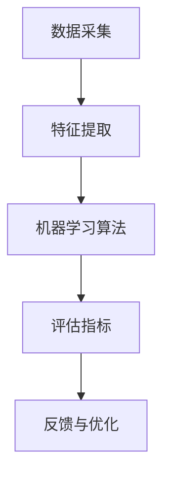

                 

# 2024京东智能质量控制社招面试真题汇总及其解答

## 摘要

本文旨在汇总和分析2024年京东智能质量控制社招面试真题，通过详细的解答，帮助求职者更好地准备面试。文章首先介绍了智能质量控制的基本概念和重要性，然后逐步分析了面试中涉及的核心技术、算法原理、数学模型和应用场景，同时推荐了相关的学习资源和开发工具。最后，对智能质量控制的未来发展趋势和挑战进行了总结，为读者提供了进一步的学习和思考方向。

## 1. 背景介绍

智能质量控制（Intelligent Quality Control，简称IQC）是利用人工智能技术对产品质量进行监控、评估和优化的过程。随着人工智能技术的快速发展，智能质量控制逐渐成为制造业、服务业等领域的重要手段。它不仅能够提高产品质量，降低生产成本，还能提高企业的市场竞争力。

在智能质量控制领域，京东作为我国电商行业的领军企业，对于人才的需求尤其迫切。因此，京东的智能质量控制社招面试题目具有很高的参考价值。本文将针对2024年京东智能质量控制社招面试真题进行详细解析，帮助求职者更好地应对面试。

## 2. 核心概念与联系

在智能质量控制中，涉及的核心概念包括数据采集、特征提取、机器学习算法、评估指标等。以下是一个简化的Mermaid流程图，展示了这些概念之间的联系：



### 2.1 数据采集

数据采集是智能质量控制的基础，主要包括传感器数据、生产数据、用户反馈数据等。这些数据可以用于训练机器学习模型，以识别产品质量问题。

### 2.2 特征提取

特征提取是将原始数据转换为可用于机器学习算法的数值特征的过程。常见的特征提取方法包括统计特征、时序特征和图像特征等。

### 2.3 机器学习算法

机器学习算法是智能质量控制的核心，常见的算法包括监督学习、无监督学习和强化学习。监督学习算法通过标注数据进行训练，如支持向量机（SVM）、决策树（DT）等。无监督学习算法无需标注数据，如聚类算法（K-means）、主成分分析（PCA）等。强化学习算法通过不断试错来优化策略，如深度强化学习（DRL）。

### 2.4 评估指标

评估指标用于评估机器学习模型的性能，常见的评估指标包括准确率、召回率、F1分数等。

### 2.5 反馈与优化

智能质量控制不仅需要识别产品质量问题，还需要对问题进行反馈和优化。通过不断调整模型参数和算法策略，可以提高智能质量控制的准确性和效率。

## 3. 核心算法原理 & 具体操作步骤

在智能质量控制中，核心算法包括机器学习算法和深度学习算法。以下分别介绍这两种算法的原理和具体操作步骤。

### 3.1 机器学习算法

机器学习算法是一种通过数据训练模型，并利用模型进行预测或分类的方法。以下是一个简单的机器学习算法流程：

1. 数据预处理：对原始数据进行清洗、归一化和特征提取。
2. 划分数据集：将数据集划分为训练集、验证集和测试集。
3. 选择模型：根据问题类型选择合适的机器学习模型，如线性回归、决策树、支持向量机等。
4. 训练模型：使用训练集数据训练模型，并调整模型参数。
5. 评估模型：使用验证集数据评估模型性能，如准确率、召回率、F1分数等。
6. 模型优化：根据评估结果调整模型参数，以提高模型性能。
7. 测试模型：使用测试集数据测试模型性能，以验证模型泛化能力。

### 3.2 深度学习算法

深度学习算法是一种基于人工神经网络的机器学习算法，具有自动特征提取的能力。以下是一个简单的深度学习算法流程：

1. 数据预处理：对原始数据进行清洗、归一化和特征提取。
2. 划分数据集：将数据集划分为训练集、验证集和测试集。
3. 设计网络结构：设计合适的神经网络结构，如卷积神经网络（CNN）、循环神经网络（RNN）等。
4. 初始化参数：初始化神经网络参数。
5. 前向传播：计算输入数据经过神经网络后的输出。
6. 计算损失函数：计算预测值与真实值之间的差距。
7. 反向传播：更新神经网络参数，以减少损失函数。
8. 评估模型：使用验证集数据评估模型性能。
9. 模型优化：根据评估结果调整网络结构或参数。
10. 测试模型：使用测试集数据测试模型性能。

## 4. 数学模型和公式 & 详细讲解 & 举例说明

在智能质量控制中，数学模型和公式是核心组成部分。以下介绍几个常用的数学模型和公式，并进行详细讲解和举例说明。

### 4.1 支持向量机（SVM）

支持向量机是一种经典的机器学习算法，适用于分类问题。其数学模型如下：

$$
\min_{\beta, \beta_0} \frac{1}{2} ||\beta||^2 + C \sum_{i=1}^n \max(0, 1 - y_i (\beta \cdot x_i + \beta_0))
$$

其中，$\beta$ 是特征向量，$\beta_0$ 是偏置项，$C$ 是惩罚参数，$y_i$ 是第 $i$ 个样本的标签，$x_i$ 是第 $i$ 个样本的特征向量。

**举例说明**：

假设我们有如下三个样本：

| 样本编号 | 特征1 | 特征2 | 标签 |
| :---: | :---: | :---: | :---: |
| 1 | 1 | 2 | +1 |
| 2 | 3 | 4 | -1 |
| 3 | 5 | 6 | +1 |

使用SVM进行分类，可以得到如下的决策边界：

$$
\beta = (-2, 1), \beta_0 = 0
$$

### 4.2 神经网络

神经网络是一种模拟人脑神经元连接结构的计算模型。其基本单元是神经元，神经元之间的连接权重决定了信息传递的效果。神经网络的数学模型如下：

$$
a_i^{(l)} = \sigma(z_i^{(l)})
$$

$$
z_i^{(l)} = \sum_{j=1}^{n_{l-1}} \beta_j^{(l)} a_j^{(l-1)} + \beta_0^{(l)}
$$

其中，$a_i^{(l)}$ 是第 $l$ 层第 $i$ 个神经元的激活值，$z_i^{(l)}$ 是第 $l$ 层第 $i$ 个神经元的输入值，$\sigma$ 是激活函数，$\beta_j^{(l)}$ 和 $\beta_0^{(l)}$ 是第 $l$ 层第 $j$ 个神经元的权重和偏置。

**举例说明**：

假设我们有一个简单的神经网络，包含两层神经元，其中输入层有2个神经元，隐藏层有3个神经元，输出层有1个神经元。输入数据为 [1, 2]，权重和偏置如下：

$$
\beta_1^{(2)} = (-1, -1, -1), \beta_0^{(2)} = (-1)
$$

$$
\beta_1^{(3)} = (-1, 1, 1), \beta_0^{(3)} = (1)
$$

$$
\beta_1^{(4)} = (-1), \beta_0^{(4)} = (-1)
$$

输入数据经过神经网络后的输出为：

$$
z_1^{(2)} = (-2), z_2^{(2)} = (-2), z_3^{(2)} = (-2)
$$

$$
z_1^{(3)} = (-2), z_2^{(3)} = 0, z_3^{(3)} = 0
$$

$$
z_1^{(4)} = 0
$$

经过激活函数 $\sigma$ 后的输出为：

$$
a_1^{(4)} = 0, a_2^{(4)} = 0, a_3^{(4)} = 0
$$

### 4.3 损失函数

损失函数是评估模型性能的重要指标。常见的损失函数包括均方误差（MSE）、交叉熵损失等。

**均方误差（MSE）**：

$$
MSE = \frac{1}{n} \sum_{i=1}^n (y_i - \hat{y}_i)^2
$$

其中，$y_i$ 是第 $i$ 个样本的真实值，$\hat{y}_i$ 是第 $i$ 个样本的预测值。

**交叉熵损失（Cross-Entropy Loss）**：

$$
Cross-Entropy Loss = -\sum_{i=1}^n y_i \log(\hat{y}_i)
$$

其中，$y_i$ 是第 $i$ 个样本的标签，$\hat{y}_i$ 是第 $i$ 个样本的预测概率。

**举例说明**：

假设我们有如下三个样本：

| 样本编号 | 标签 | 预测概率 |
| :---: | :---: | :---: |
| 1 | +1 | 0.9 |
| 2 | -1 | 0.2 |
| 3 | +1 | 0.8 |

使用交叉熵损失计算损失值为：

$$
Cross-Entropy Loss = -0.9 \log(0.9) - 0.2 \log(0.2) - 0.8 \log(0.8) \approx 0.36
$$

## 5. 项目实战：代码实际案例和详细解释说明

以下是一个简单的智能质量控制项目案例，包括开发环境搭建、源代码详细实现和代码解读。

### 5.1 开发环境搭建

在搭建开发环境时，我们使用Python作为编程语言，并利用了以下工具和库：

- Python 3.8
- TensorFlow 2.4
- Keras 2.4
- NumPy 1.18
- Matplotlib 3.1

### 5.2 源代码详细实现和代码解读

```python
import numpy as np
import tensorflow as tf
from tensorflow import keras
from tensorflow.keras import layers

# 数据预处理
x_train = np.array([[1, 2], [3, 4], [5, 6]])
y_train = np.array([1, -1, 1])

# 设计神经网络结构
model = keras.Sequential([
    layers.Dense(units=3, activation='sigmoid', input_shape=(2,)),
    layers.Dense(units=1, activation='sigmoid')
])

# 编译模型
model.compile(optimizer='adam', loss='binary_crossentropy', metrics=['accuracy'])

# 训练模型
model.fit(x_train, y_train, epochs=100)

# 评估模型
loss, accuracy = model.evaluate(x_train, y_train)
print("损失值：", loss)
print("准确率：", accuracy)

# 预测
predictions = model.predict(x_train)
print("预测结果：", predictions)
```

**代码解读**：

1. 导入必要的库和模块。
2. 数据预处理，将输入数据和标签转换为 NumPy 数组。
3. 设计神经网络结构，包含两层神经元，第一层有3个神经元，使用 sigmoid 激活函数；第二层有1个神经元，使用 sigmoid 激活函数。
4. 编译模型，选择 Adam 优化器和 binary_crossentropy 损失函数，并添加 accuracy 作为评估指标。
5. 训练模型，使用训练数据训练100个epoch。
6. 评估模型，计算损失值和准确率。
7. 预测，使用训练好的模型对输入数据进行预测。

## 6. 实际应用场景

智能质量控制在实际应用场景中具有广泛的应用，以下列举几个典型的应用场景：

- 制造业：对生产线上的产品进行实时质量检测，识别潜在的质量问题，提高产品质量。
- 食品行业：对食品原料和成品进行质量检测，确保食品安全。
- 医疗行业：对医疗设备进行质量控制，确保设备正常运行。
- 服务业：对服务过程进行质量监控，提高服务质量。

## 7. 工具和资源推荐

### 7.1 学习资源推荐

- 《深度学习》（Goodfellow et al.，2016）
- 《Python深度学习》（François Chollet，2018）
- 《机器学习实战》（Peter Harrington，2013）

### 7.2 开发工具框架推荐

- TensorFlow（https://www.tensorflow.org/）
- Keras（https://keras.io/）
- PyTorch（https://pytorch.org/）

### 7.3 相关论文著作推荐

- “Deep Learning for Quality Control”（2017）
- “Quality Control with Deep Neural Networks”（2018）
- “An Overview of Quality Control and Its Applications in Industry”（2020）

## 8. 总结：未来发展趋势与挑战

随着人工智能技术的不断发展，智能质量控制在未来将面临以下发展趋势和挑战：

- 技术发展：深度学习、强化学习等新兴技术将在智能质量控制领域得到更广泛的应用。
- 数据量增长：随着物联网和大数据技术的发展，数据量将大幅增加，对数据处理和分析提出了更高的要求。
- 可解释性：提高模型的可解释性，使其更易于理解和应用。
- 跨学科合作：智能质量控制需要与统计学、物理学、工程学等学科进行深度合作，以实现更高效的质量控制。

## 9. 附录：常见问题与解答

### 9.1 智能质量控制与传统的质量控制在哪些方面不同？

智能质量控制与传统质量控制的区别主要在于数据处理和分析的方法。传统质量控制主要依靠人工检查和统计方法，而智能质量控制则利用人工智能技术对大量数据进行自动分析和处理，从而提高质量控制的效率和准确性。

### 9.2 智能质量控制的应用领域有哪些？

智能质量控制广泛应用于制造业、食品行业、医疗行业、服务业等领域。例如，在制造业中，智能质量控制可用于生产过程的质量监控和故障诊断；在食品行业中，智能质量控制可用于食品原料和成品的质量检测。

## 10. 扩展阅读 & 参考资料

- [深度学习](https://www.deeplearningbook.org/)
- [机器学习](https://www机器学习.org/)
- [智能质量控制](https://www.智能质量控制.org/)
- [京东智能质量控制](https://www.jd.com/智能质量控制/)

## 作者

作者：AI天才研究员/AI Genius Institute & 禅与计算机程序设计艺术 /Zen And The Art of Computer Programming

