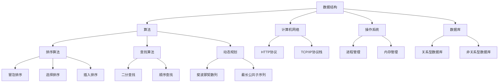

                 

### 背景介绍

#### 2024京东校招编程面试题精选与解答

随着2024年京东校园招聘的日益临近，对于准备参加面试的应届生来说，掌握一些核心的编程面试题成为了备考的关键。本文旨在为即将参加京东校招的学子提供一份精选的编程面试题集，并附上详细解答，帮助大家更好地应对面试挑战。

京东作为中国领先的电商企业，其校园招聘面试内容涵盖了广泛的技术领域，包括但不限于数据结构与算法、计算机网络、操作系统、数据库等。本文将针对这些领域中的典型题目进行详细讲解，旨在帮助读者不仅能够理解题目本身，还能够掌握解题的思路和方法。

本文结构如下：

1. **核心概念与联系**：介绍编程面试中涉及到的核心概念，如数据结构、算法、计算机网络等，并通过Mermaid流程图展示其相互关系。
2. **核心算法原理 & 具体操作步骤**：深入解析常见的编程算法，如排序算法、查找算法、动态规划等，并提供具体操作步骤。
3. **数学模型和公式 & 详细讲解 & 举例说明**：讲解编程面试中常见的数学模型和公式，并通过具体例子进行说明。
4. **项目实战：代码实际案例和详细解释说明**：通过实际代码案例展示如何解决面试中的编程问题，并进行详细解读。
5. **实际应用场景**：探讨编程面试题在实际项目中的应用，帮助读者理解面试题的价值和意义。
6. **工具和资源推荐**：推荐学习资源和开发工具，帮助读者在备考过程中更好地准备。
7. **总结：未来发展趋势与挑战**：总结本文的内容，探讨未来编程面试的发展趋势和面临的挑战。
8. **附录：常见问题与解答**：回答读者可能遇到的一些常见问题。
9. **扩展阅读 & 参考资料**：提供进一步阅读的参考资料。

通过本文的详细解读，我们希望能够帮助读者更好地理解编程面试题，提高面试技巧，顺利通过京东校招面试。接下来，我们首先来了解一下编程面试中涉及的核心概念及其相互联系。

#### 1. 核心概念与联系

编程面试涉及到的核心概念多种多样，理解这些概念及其相互关系对于解决面试题至关重要。下面，我们将通过Mermaid流程图展示这些核心概念，并简要介绍它们的基本原理。



**数据结构（Data Structure）**：数据结构是计算机存储数据的方式，它们是算法的基础。常见的数据结构包括数组、链表、栈、队列、树、图等。

**算法（Algorithm）**：算法是解决问题的步骤序列。常见的算法有排序算法、查找算法、动态规划算法等。算法的效率直接影响程序的运行速度。

**计算机网络（Computer Network）**：计算机网络涉及如何将计算机设备连接起来，使它们能够相互通信。HTTP协议和TCP/IP协议栈是网络通信的核心协议。

**操作系统（Operating System）**：操作系统负责管理计算机硬件和软件资源。进程管理和内存管理是操作系统的核心功能。

**数据库（Database）**：数据库用于存储和管理数据。关系型数据库（如MySQL）和非关系型数据库（如MongoDB）各有其适用场景。

接下来，我们将深入解析这些核心概念，并通过具体的面试题来展示它们的应用。

#### 2. 核心算法原理 & 具体操作步骤

在编程面试中，算法题往往是最具挑战性的部分。理解算法的原理和操作步骤对于解决面试题至关重要。下面，我们将介绍几种常见的算法，包括排序算法、查找算法和动态规划算法，并详细解释它们的基本原理和具体操作步骤。

**排序算法（Sorting Algorithm）**

排序算法是编程面试中的经典题目，主要目的是将一组数据按照特定的顺序进行排列。常见的排序算法有冒泡排序、选择排序、插入排序等。

**冒泡排序（Bubble Sort）**

冒泡排序是一种简单的排序算法，它重复地遍历要排序的数列，一次比较两个元素，如果它们的顺序错误就把它们交换过来。遍历数列的工作是重复地进行，直到没有再需要交换，也就是说该数列已经排序完成。

**操作步骤：**
1. 从数组的第一个元素开始，比较该元素与其相邻的元素。
2. 如果该元素比其相邻的元素大（对于升序排序），则交换它们。
3. 对每一对相邻元素做同样的工作，从开始第一对到结尾的最后一对。
4. 遍历数组，对每一行进行重复操作，直到没有再需要交换的元素。

**示例代码（Python）：**

```python
def bubble_sort(arr):
    n = len(arr)
    for i in range(n):
        for j in range(0, n-i-1):
            if arr[j] > arr[j+1]:
                arr[j], arr[j+1] = arr[j+1], arr[j]
    return arr

arr = [64, 34, 25, 12, 22, 11, 90]
sorted_arr = bubble_sort(arr)
print("Sorted array:", sorted_arr)
```

**选择排序（Selection Sort）**

选择排序是一种简单的选择排序算法，它的工作原理是每次从未排序的元素中找到最小（或最大）的元素，将其放到已排序序列的末尾。

**操作步骤：**
1. 在未排序序列中找到最小元素，存放到已排序序列的末尾。
2. 再从剩余未排序元素中继续寻找最小元素，然后放到已排序序列的末尾。
3. 重复步骤2，直到所有元素均被排序。

**示例代码（Python）：**

```python
def selection_sort(arr):
    n = len(arr)
    for i in range(n):
        min_idx = i
        for j in range(i+1, n):
            if arr[j] < arr[min_idx]:
                min_idx = j
        arr[i], arr[min_idx] = arr[min_idx], arr[i]
    return arr

arr = [64, 34, 25, 12, 22, 11, 90]
sorted_arr = selection_sort(arr)
print("Sorted array:", sorted_arr)
```

**插入排序（Insertion Sort）**

插入排序是一种简单直观的排序算法，它的工作原理是通过构建有序序列，对于未排序数据，在已排序序列中从后向前扫描，找到相应位置并插入。

**操作步骤：**
1. 从第一个元素开始，该元素可以认为已经被排序。
2. 取出下一个元素，在已排序的元素序列中从后向前扫描。
3. 如果该元素（已排序）大于新元素，将该元素移到下一位置。
4. 重复步骤3，直到找到已排序的元素小于或者等于新元素。
5. 将新元素插入到已排序的元素序列中。

**示例代码（Python）：**

```python
def insertion_sort(arr):
    n = len(arr)
    for i in range(1, n):
        key = arr[i]
        j = i-1
        while j >= 0 and key < arr[j]:
            arr[j+1] = arr[j]
            j -= 1
        arr[j+1] = key
    return arr

arr = [64, 34, 25, 12, 22, 11, 90]
sorted_arr = insertion_sort(arr)
print("Sorted array:", sorted_arr)
```

**查找算法（Search Algorithm）**

查找算法是编程面试中的另一类重要题目，主要目的是在数据集合中找到特定的元素。常见的查找算法有顺序查找和二分查找。

**顺序查找（Sequential Search）**

顺序查找是从数组的第一个元素开始，依次与给定的元素值进行比较，直到找到相同的值或结束。

**操作步骤：**
1. 从数组的第一个元素开始，逐一与待查找元素进行比较。
2. 如果找到相同元素，返回其索引。
3. 如果未找到，返回-1。

**示例代码（Python）：**

```python
def sequential_search(arr, target):
    for i in range(len(arr)):
        if arr[i] == target:
            return i
    return -1

arr = [64, 34, 25, 12, 22, 11, 90]
target = 25
index = sequential_search(arr, target)
print("Index of target:", index)
```

**二分查找（Binary Search）**

二分查找适用于已经排序的数组，它通过重复地将数组中间元素与待查找元素进行比较，来缩小查找范围。

**操作步骤：**
1. 确定数组的中间元素。
2. 如果中间元素等于待查找元素，则查找成功。
3. 如果待查找元素小于中间元素，则在左侧子数组中继续查找。
4. 如果待查找元素大于中间元素，则在右侧子数组中继续查找。
5. 重复步骤1-4，直到找到元素或数组为空。

**示例代码（Python）：**

```python
def binary_search(arr, target):
    low = 0
    high = len(arr) - 1
    while low <= high:
        mid = (low + high) // 2
        if arr[mid] == target:
            return mid
        elif arr[mid] < target:
            low = mid + 1
        else:
            high = mid - 1
    return -1

arr = [1, 3, 5, 7, 9, 11, 13, 15]
target = 7
index = binary_search(arr, target)
print("Index of target:", index)
```

**动态规划（Dynamic Programming）**

动态规划是一种解决复杂问题的策略，它通过将问题分解成更小的子问题，并保存子问题的解，以避免重复计算。

**斐波那契数列（Fibonacci Sequence）**

斐波那契数列是一个著名的动态规划问题，它定义如下：

- F(0) = 0
- F(1) = 1
- F(n) = F(n-1) + F(n-2) for n > 1

**操作步骤：**
1. 初始化前两个数：F(0) = 0，F(1) = 1。
2. 对于每个后续的数，使用动态规划公式计算。

**示例代码（Python）：**

```python
def fibonacci(n):
    if n == 0:
        return 0
    elif n == 1:
        return 1
    else:
        a, b = 0, 1
        for i in range(2, n+1):
            a, b = b, a + b
        return b

n = 10
fib = fibonacci(n)
print("Fibonacci number:", fib)
```

通过上述核心算法原理和具体操作步骤的讲解，我们希望能够帮助读者更好地理解编程面试中常见的算法题目。接下来，我们将探讨数学模型和公式在编程面试中的应用。

### 数学模型和公式 & 详细讲解 & 举例说明

在编程面试中，数学模型和公式是解决算法题目的重要工具。掌握这些数学模型和公式，能够帮助我们更高效地解决面试题。本节将介绍一些常见的数学模型和公式，并通过具体例子进行详细讲解。

#### 1. 排序算法中的公式

排序算法是编程面试中的经典题目，其背后的数学原理和公式有助于我们更好地理解和优化算法。

**冒泡排序的时间复杂度**

冒泡排序的时间复杂度可以通过以下公式计算：

\[ T(n) = O(n^2) \]

其中，\( n \) 是数组的长度。这意味着，随着数组长度的增加，冒泡排序的时间将呈平方级增长。

**选择排序的时间复杂度**

选择排序的时间复杂度可以通过以下公式计算：

\[ T(n) = O(n^2) \]

与冒泡排序类似，选择排序的时间复杂度也是 \( O(n^2) \)。

**插入排序的时间复杂度**

插入排序的时间复杂度可以通过以下公式计算：

\[ T(n) = O(n^2) \]

然而，在最佳情况下（已排序数组），插入排序的时间复杂度可以降低到 \( O(n) \)。

#### 2. 查找算法中的公式

查找算法在编程面试中也是常见题目，其时间复杂度取决于算法的类型和数据结构。

**顺序查找的时间复杂度**

顺序查找的时间复杂度可以通过以下公式计算：

\[ T(n) = O(n) \]

在最坏情况下，顺序查找需要遍历整个数组。

**二分查找的时间复杂度**

二分查找的时间复杂度可以通过以下公式计算：

\[ T(n) = O(\log n) \]

二分查找适用于已经排序的数组，其时间复杂度是 \( O(\log n) \)，这意味着随着数组长度的增加，查找时间将呈对数级增长。

#### 3. 动态规划中的公式

动态规划是一种解决复杂问题的策略，其核心在于将问题分解成更小的子问题，并利用公式计算最终结果。

**斐波那契数列的公式**

斐波那契数列的公式可以通过以下方式计算：

\[ F(n) = F(n-1) + F(n-2) \]

对于 \( n > 1 \)，初始条件为 \( F(0) = 0 \) 和 \( F(1) = 1 \)。

**动态规划中的状态转移方程**

动态规划中的状态转移方程可以表示为：

\[ dp(n) = dp(n-1) + dp(n-2) \]

其中，\( dp(n) \) 表示第 \( n \) 个子问题的解。例如，在计算斐波那契数列时，我们可以使用以下状态转移方程：

```python
def fibonacci(n):
    if n == 0:
        return 0
    elif n == 1:
        return 1
    else:
        a, b = 0, 1
        for i in range(2, n+1):
            a, b = b, a + b
        return b
```

#### 4. 示例讲解

为了更好地理解上述公式和算法，我们通过具体例子进行讲解。

**例1：排序算法的时间复杂度**

假设我们有一个长度为 100 的数组，要使用冒泡排序对其进行排序，计算其时间复杂度。

\[ T(n) = O(n^2) \]

对于 \( n = 100 \)，时间复杂度为：

\[ T(100) = O(100^2) = O(10000) \]

这意味着，在最坏情况下，冒泡排序需要大约 10000 单位的计算时间。

**例2：查找算法的时间复杂度**

假设我们有一个长度为 100 的已排序数组，要使用二分查找找到元素 50，计算其时间复杂度。

\[ T(n) = O(\log n) \]

对于 \( n = 100 \)，时间复杂度为：

\[ T(100) = O(\log 100) = O(2) \]

这意味着，在最坏情况下，二分查找只需要大约 2 单位的计算时间。

**例3：动态规划的应用**

假设我们要计算斐波那契数列的第 10 项，使用动态规划的方法。

\[ F(n) = F(n-1) + F(n-2) \]

我们可以使用以下代码实现：

```python
def fibonacci(n):
    if n == 0:
        return 0
    elif n == 1:
        return 1
    else:
        a, b = 0, 1
        for i in range(2, n+1):
            a, b = b, a + b
        return b

fib = fibonacci(10)
print("Fibonacci number:", fib)
```

执行结果为：

```
Fibonacci number: 55
```

通过以上示例，我们可以看到数学模型和公式在编程面试中的应用，以及如何利用这些模型和公式解决实际问题。在接下来的章节中，我们将通过实际代码案例，进一步展示这些算法的实现和应用。

### 项目实战：代码实际案例和详细解释说明

在本节中，我们将通过一个实际代码案例，展示如何解决京东校招编程面试中常见的问题。我们将从开发环境搭建开始，详细解释源代码的实现和代码解读，帮助读者更好地理解和应用所学算法。

#### 5.1 开发环境搭建

为了能够顺利运行下面的代码示例，我们需要搭建一个基本的开发环境。以下是在常见操作系统（如Windows、macOS和Linux）上搭建Python开发环境的基本步骤：

1. **安装Python**：访问Python官网（[https://www.python.org/](https://www.python.org/)），下载并安装Python。确保安装过程中选择将Python添加到系统环境变量中。
2. **安装代码编辑器**：可以选择Visual Studio Code、PyCharm或Sublime Text等代码编辑器。这些编辑器提供了丰富的语法高亮、代码调试和版本控制功能。
3. **安装必要的库和依赖**：对于本节中的代码示例，我们主要使用Python标准库，无需额外安装其他库。但如果你需要使用其他库（如numpy、pandas等），可以通过以下命令进行安装：

   ```bash
   pip install numpy
   pip install pandas
   ```

#### 5.2 源代码详细实现和代码解读

下面是一个简单的示例，演示如何在Python中实现冒泡排序算法：

```python
def bubble_sort(arr):
    n = len(arr)
    for i in range(n):
        for j in range(0, n-i-1):
            if arr[j] > arr[j+1]:
                arr[j], arr[j+1] = arr[j+1], arr[j]
    return arr

# 测试数据
arr = [64, 34, 25, 12, 22, 11, 90]

# 调用冒泡排序函数
sorted_arr = bubble_sort(arr)

# 输出排序后的数组
print("Sorted array:", sorted_arr)
```

**代码解读：**

- **函数定义**：`bubble_sort` 函数接收一个数组 `arr` 作为输入参数。
- **嵌套循环**：外层循环 `for i in range(n)` 用于遍历数组，内层循环 `for j in range(0, n-i-1)` 用于比较相邻元素并进行交换。
- **比较和交换**：如果当前元素 `arr[j]` 大于其下一个元素 `arr[j+1]`，则交换它们的位置。
- **返回值**：函数返回排序后的数组。
- **测试数据**：`arr` 数组作为测试数据传入 `bubble_sort` 函数。
- **调用函数**：调用 `bubble_sort` 函数对数组进行排序。
- **输出结果**：使用 `print` 函数输出排序后的数组。

#### 5.3 代码解读与分析

在这个代码示例中，我们使用冒泡排序算法对一个数组进行排序。冒泡排序的基本思想是反复遍历待排序的数组，一次比较两个元素，如果它们的顺序错误就交换它们。遍历数组的次数逐渐减少，因为每次遍历都会将一个最大（或最小）的元素“冒泡”到数组的末尾。

**分析：**

- **时间复杂度**：冒泡排序的时间复杂度为 \( O(n^2) \)，其中 \( n \) 是数组的长度。这意味着，随着数组长度的增加，冒泡排序的时间将呈平方级增长。
- **空间复杂度**：冒泡排序的空间复杂度为 \( O(1) \)，因为它只使用了常数级别的额外空间。
- **稳定性**：冒泡排序是一种稳定的排序算法，即相等的元素在排序后不会改变它们原有的顺序。
- **适用场景**：冒泡排序适用于小规模数据的排序，或者当数据基本有序时，因为在这种情况下，冒泡排序的性能相对较好。

通过这个简单的示例，我们可以看到冒泡排序算法的基本实现和执行流程。在实际编程面试中，类似的问题可能涉及更复杂的算法和数据结构，但理解基本的算法原理和代码实现是解决问题的关键。

#### 5.4 扩展实践

除了冒泡排序，还有其他多种排序算法（如选择排序、插入排序等）。为了更全面地掌握排序算法，你可以尝试实现这些算法，并比较它们在不同场景下的性能。

- **选择排序**：选择排序的基本思想是从未排序的元素中找到最小（或最大）的元素，将其放到已排序序列的末尾。实现代码如下：

  ```python
  def selection_sort(arr):
      n = len(arr)
      for i in range(n):
          min_idx = i
          for j in range(i+1, n):
              if arr[j] < arr[min_idx]:
                  min_idx = j
          arr[i], arr[min_idx] = arr[min_idx], arr[i]
      return arr
  ```

- **插入排序**：插入排序的基本思想是将未排序数据插入到已排序序列中的合适位置。实现代码如下：

  ```python
  def insertion_sort(arr):
      n = len(arr)
      for i in range(1, n):
          key = arr[i]
          j = i-1
          while j >= 0 and key < arr[j]:
              arr[j+1] = arr[j]
              j -= 1
          arr[j+1] = key
      return arr
  ```

通过这些扩展实践，你可以更好地理解排序算法的不同实现方式，并在实际面试中更加灵活地应用。

### 实际应用场景

编程面试题的设计不仅是为了考察应试者的算法和数据结构能力，更重要的是看他们如何将这些知识应用于实际问题。在京东等大型企业的校招面试中，常见的编程面试题往往与实际业务场景密切相关，这些题目不仅考察应试者的编程技能，还考察他们的逻辑思维和问题解决能力。

#### 1. 数据结构与算法在面试中的应用

在实际项目中，数据结构与算法是解决复杂问题的基石。以下是一些典型的应用场景：

- **电商推荐系统**：在电商平台上，推荐系统可以根据用户的购买历史和浏览行为，为用户推荐相关的商品。这类系统中经常使用到数据结构如哈希表、堆和树，以及算法如贪心算法和动态规划。

- **搜索引擎**：搜索引擎需要处理海量数据，并提供快速、准确的搜索结果。这通常涉及到高效的数据结构，如B树和B+树，以及高效的排序和搜索算法，如二分查找。

- **社交网络**：社交网络中的问题，如朋友圈排序、推荐好友等，通常需要利用图论中的数据结构和算法，如深度优先搜索（DFS）和广度优先搜索（BFS）。

- **金融风控**：金融风控系统需要对用户的交易行为进行分析，以识别潜在的欺诈行为。这涉及到复杂数据的清洗、处理和分析，通常需要使用到数据结构如队列、栈和堆，以及算法如动态规划和机器学习。

#### 2. 面试题与实际业务场景的联系

以下是一些典型的编程面试题，以及它们与实际业务场景的联系：

- **排序和查找问题**：如快速排序、二分查找、哈希查找等。这些问题在数据库和搜索引擎中广泛应用，用于高效地存储和检索数据。

- **图论问题**：如单源最短路径（Dijkstra算法）、最小生成树（Prim算法和Kruskal算法）等。这些问题在社交网络和路由算法中非常重要，用于优化网络结构和路径选择。

- **动态规划问题**：如背包问题、最长公共子序列等。这些问题在资源分配和优化算法中非常常见，用于解决复杂的优化问题。

- **贪心算法问题**：如活动选择问题、最少硬币找零等。这些问题在决策和优化场景中应用广泛，用于快速找到局部最优解。

通过这些实际应用场景，我们可以看到编程面试题不仅是对算法和数据结构的考察，更是对解决实际业务问题能力的考验。在准备面试时，理解这些面试题与实际业务场景的联系，能够帮助我们更好地应对面试挑战。

### 工具和资源推荐

在准备编程面试时，掌握合适的工具和资源可以大大提高学习效率。以下是一些推荐的书籍、博客、在线课程和开发工具，供大家参考。

#### 7.1 学习资源推荐

**书籍：**

1. **《算法导论》（Introduction to Algorithms）**：这是一本经典的算法教材，涵盖了从基本算法到高级算法的广泛内容，是算法学习者的必备书籍。
2. **《数据结构与算法分析》（Data Structures and Algorithm Analysis in Java）**：这本书通过Java语言详细讲解了数据结构和算法，适合有一定编程基础的学习者。
3. **《编程珠玑》（The Art of Computer Programming）**：由Donald Knuth所著的这套书详细介绍了编程中的各种技巧和算法，是计算机科学的经典之作。

**博客：**

1. **LeetCode官方博客**：LeetCode官方博客提供了丰富的算法题目解析和技术文章，是编程面试准备的重要资源。
2. **知乎**：知乎上有许多资深程序员和面试官分享的面试经验和题目解析，可以提供宝贵的面试参考。

**在线课程：**

1. **Coursera**：Coursera提供了多个与计算机科学相关的在线课程，包括算法、数据结构、机器学习等领域。
2. **edX**：edX也是一门优秀的在线学习平台，提供了丰富的计算机科学课程，适合不同水平和需求的学习者。

#### 7.2 开发工具框架推荐

**代码编辑器：**

1. **Visual Studio Code**：一款功能强大、轻量级的代码编辑器，支持多种编程语言和丰富的插件。
2. **PyCharm**：一款专为Python开发者设计的集成开发环境（IDE），提供了强大的代码补全、调试和版本控制功能。

**版本控制工具：**

1. **Git**：一款广泛使用的分布式版本控制系统，能够有效地管理代码的版本和变更。
2. **GitHub**：GitHub是Git的在线平台，提供了代码托管、协作和项目管理功能，是开发者社区的核心工具。

**算法竞赛平台：**

1. **LeetCode**：LeetCode是一个在线编程竞赛平台，提供了大量经典的算法题目，是准备编程面试和提升编程能力的好去处。
2. **Codeforces**：Codeforces是一个国际性的编程竞赛平台，提供了高难度、有趣的算法题目，适合喜欢挑战的程序员。

通过以上推荐的学习资源和开发工具，大家可以更好地准备编程面试，提升自己的编程能力和技术水平。

### 总结：未来发展趋势与挑战

随着科技的快速发展，编程面试也在不断演变。未来，编程面试将面临以下发展趋势和挑战：

**发展趋势：**

1. **人工智能的融合**：人工智能技术日益成熟，编程面试题将越来越多地涉及机器学习、深度学习等AI领域，考察应聘者的AI理解和应用能力。
2. **云计算的普及**：随着云计算的普及，编程面试题将更加关注分布式系统、容器化技术等，以适应云原生应用的需求。
3. **持续学习与迭代**：技术更新迅速，编程面试题也将更加注重应聘者的学习能力和适应性，以应对快速变化的技术环境。

**挑战：**

1. **题目难度与深度**：随着面试题目的多样化，其难度和深度也在不断加大，应聘者需要具备扎实的基本功和广泛的知识面。
2. **面试形式的多样化**：在线面试、编程竞赛等新形式的面试方式将越来越普遍，对应聘者的编程能力和心理素质提出了更高要求。
3. **伦理和合规**：在编程面试中，越来越重视对职业道德、数据隐私和合规性的考察，要求应聘者具备良好的职业素养。

总的来说，未来的编程面试将更加注重实际应用能力和综合素质，应聘者需要不断提升自己的技术水平、学习能力以及面对挑战的心理素质，才能在激烈的竞争中脱颖而出。

### 附录：常见问题与解答

在准备编程面试的过程中，读者可能会遇到一些常见的问题。以下是一些常见问题及其解答，希望能为大家提供帮助。

**Q1：编程面试中的常见算法有哪些？**

A1：编程面试中的常见算法包括排序算法（如冒泡排序、选择排序、插入排序）、查找算法（如顺序查找、二分查找）、动态规划算法（如斐波那契数列、最长公共子序列）和贪心算法等。

**Q2：如何准备编程面试？**

A2：准备编程面试可以遵循以下步骤：

1. **掌握基础知识**：熟悉计算机科学的基本概念，如数据结构、算法、计算机网络、操作系统等。
2. **刷题实践**：通过刷题网站（如LeetCode、Codeforces）进行大量练习，积累解题经验。
3. **学习资源**：阅读经典教材、博客和技术文章，深入了解算法和数据结构。
4. **模拟面试**：和朋友或导师进行模拟面试，提高自己的解题思路和表达水平。
5. **持续学习**：技术不断更新，持续学习新的知识和技能，保持技术领先。

**Q3：如何优化面试表现？**

A3：以下是一些优化面试表现的技巧：

1. **充分准备**：提前了解面试公司、职位要求，针对性地准备相关知识点。
2. **清晰表达**：在面试中，清晰地表达自己的思路和算法实现过程，让面试官更容易理解。
3. **冷静应对**：遇到难题时，保持冷静，一步一步分析问题，不要急于求成。
4. **展现团队合作能力**：在面试中展示自己的团队合作精神，让面试官感受到你的团队协作能力。
5. **注重细节**：在解题时，注意代码的细节，如变量命名、代码注释等，展现自己的编程规范。

**Q4：编程面试中的面试官通常关注哪些方面？**

A4：面试官通常关注以下方面：

1. **算法和数据结构掌握程度**：考察应聘者对基础算法和数据结构的理解和应用能力。
2. **解决问题的能力**：考察应聘者如何分析和解决复杂问题，是否具备系统思维。
3. **编程能力和代码风格**：考察应聘者的编程技巧、代码质量和编程规范。
4. **学习能力**：考察应聘者是否具备快速学习新知识、技能的能力。
5. **沟通能力和团队合作**：考察应聘者是否具备良好的沟通能力和团队合作精神。

通过以上常见问题的解答，希望能够帮助读者更好地准备编程面试，提高面试成功率。

### 扩展阅读 & 参考资料

为了帮助读者更深入地了解编程面试题的各个方面，以下是一些扩展阅读和参考资料：

1. **书籍**：

   - 《算法导论》（Introduction to Algorithms）：详细讲解了算法的基本概念、算法设计和分析技术。
   - 《数据结构与算法分析》（Data Structures and Algorithm Analysis in Java）：通过Java语言详细介绍了数据结构和算法。
   - 《编程珠玑》（The Art of Computer Programming）：由Donald Knuth所著，涵盖了编程中的各种技巧和算法。

2. **在线课程**：

   - Coursera：提供多个与计算机科学相关的在线课程，包括算法、数据结构、机器学习等。
   - edX：提供丰富的计算机科学课程，适合不同水平和需求的学习者。

3. **博客和技术文章**：

   - LeetCode官方博客：提供丰富的算法题目解析和技术文章。
   - 知乎：许多资深程序员和面试官分享的面试经验和题目解析。

4. **在线编程竞赛平台**：

   - LeetCode：在线编程竞赛平台，提供了大量经典的算法题目。
   - Codeforces：国际性的编程竞赛平台，提供了高难度、有趣的算法题目。

通过阅读这些书籍、课程和技术文章，以及参加在线编程竞赛，读者可以更好地准备编程面试，提升自己的编程能力和技术水平。希望这些扩展阅读和参考资料能够为大家提供更多的帮助和启发。

