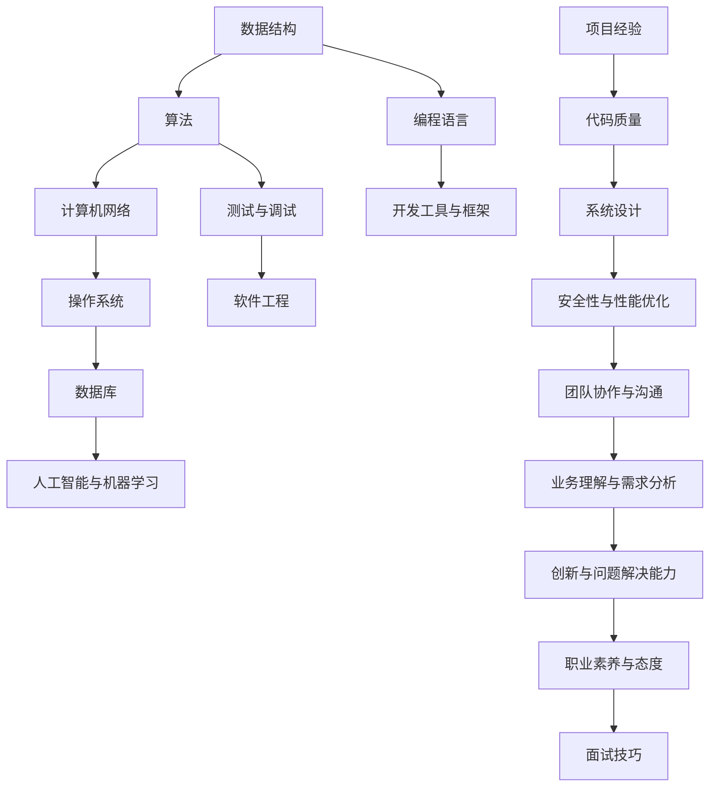

                 

### 背景介绍

#### 2025京东社招编程面试的重要性

在信息技术高速发展的时代，编程技能的重要性不言而喻。随着互联网、大数据、人工智能等领域的蓬勃发展，越来越多的企业和组织开始重视技术人才的引进。因此，编程面试成为衡量应聘者技术水平的重要手段。尤其是像京东这样的科技巨头，其社招编程面试更具有极高的参考价值。

京东，作为中国领先的电商巨头，不仅在商业模式上不断创新，在技术领域也不断突破。京东的编程面试题不仅考察应聘者的编程能力，还涉及到数据结构、算法、系统设计等多个方面。因此，了解并掌握这些面试题，对于求职者来说具有非常重要的意义。

#### 2025年编程面试趋势分析

到了2025年，随着技术的不断演进，编程面试的题目和考核方式也在发生变化。以下是2025年编程面试的几个趋势：

1. **人工智能与大数据**：随着人工智能技术的普及，越来越多的面试题涉及到机器学习、深度学习等领域的知识。同时，大数据处理能力也是面试的一个重要考察点。

2. **云计算与分布式系统**：随着云计算的广泛应用，分布式系统设计、微服务架构等成为面试题的热点。应聘者需要具备扎实的分布式系统理论基础和实战经验。

3. **编程语言与框架**：不同的编程语言和框架在面试中都有可能成为考察对象。例如，Java、Python、JavaScript等都是常见的面试语言，同时Spring、Django、React等框架也是面试的重点。

4. **系统设计与架构**：面试中常常会涉及到系统设计题，要求应聘者从架构层面考虑问题，设计出高效的系统解决方案。

5. **实际项目经验**：实际项目经验成为面试官考察的一个重要方面。应聘者需要能够通过项目经验展示自己的技术实力和解决问题的能力。

#### 本文结构

本文将分为以下几个部分：

1. **核心概念与联系**：介绍编程面试中涉及的核心概念和其相互联系，并使用Mermaid流程图展示。
2. **核心算法原理与具体操作步骤**：详细讲解面试题中的核心算法原理，并提供具体的操作步骤。
3. **数学模型与公式**：介绍与面试题相关的数学模型和公式，并进行详细讲解和举例说明。
4. **项目实战**：通过具体的项目实战案例，展示如何运用所学的知识和技能解决实际问题。
5. **实际应用场景**：分析编程面试题在实际开发中的应用场景，帮助读者更好地理解和应用。
6. **工具和资源推荐**：推荐学习资源、开发工具和框架，帮助读者深入学习。
7. **总结与未来发展趋势**：总结本文的核心内容，并展望未来的发展趋势和挑战。
8. **附录**：提供常见问题与解答，方便读者查阅。

通过本文的阅读，读者将能够全面了解2025年京东社招编程面试的热点话题和应对策略，提高自己在面试中的竞争力。

#### 文章关键词

- 京东社招编程面试
- 2025年编程面试趋势
- 核心概念与联系
- 核心算法原理
- 数学模型与公式
- 项目实战
- 实际应用场景
- 工具和资源推荐

#### 文章摘要

本文针对2025年京东社招编程面试，详细介绍了面试中的热点话题和应对策略。通过分析核心概念、算法原理、数学模型和实际项目案例，帮助读者全面掌握编程面试所需的知识和技能。文章还推荐了学习资源、开发工具和框架，以及展望了未来的发展趋势和挑战。读者可以通过本文提升自己在编程面试中的表现，增强求职竞争力。

---

### 核心概念与联系

在编程面试中，核心概念和它们之间的联系是理解问题解决方案的基础。本章节将介绍编程面试中常见的一些核心概念，并通过Mermaid流程图展示这些概念之间的相互联系。

#### 核心概念

1. **数据结构与算法**：数据结构是组织和管理数据的方式，如数组、链表、树、图等。算法则是解决问题的一系列步骤，如排序、查找、动态规划等。数据结构与算法是编程面试中的基础，几乎所有的问题都可以通过它们来解决。

2. **计算机网络**：计算机网络是现代信息技术的重要组成部分，涉及到网络协议、传输层、应用层等多个方面。理解计算机网络的基本原理对于解决分布式系统设计等问题至关重要。

3. **操作系统**：操作系统管理计算机硬件和软件资源，包括进程管理、内存管理、文件系统等。操作系统知识对于理解程序执行过程和系统设计有重要影响。

4. **数据库**：数据库用于存储和管理大量数据，涉及到SQL语言、关系型数据库（如MySQL、Oracle）、NoSQL数据库（如MongoDB、Redis）等。数据库知识是开发数据密集型应用的基础。

5. **人工智能与机器学习**：人工智能和机器学习是当前技术领域的热点，包括监督学习、无监督学习、深度学习等方法。这些技术广泛应用于推荐系统、自然语言处理、图像识别等领域。

#### Mermaid流程图

下面是一个简化的Mermaid流程图，展示了这些核心概念之间的相互联系：



#### 概念联系

1. **数据结构与算法**是解决各种编程问题的基础，它们决定了程序的性能和效率。

2. **计算机网络**和**操作系统**为程序提供了运行环境，确保程序能够正确执行。

3. **数据库**用于存储和管理应用所需的数据，是构建数据密集型应用的核心。

4. **人工智能与机器学习**为编程带来了新的视角和方法，使程序能够实现更加智能的功能。

5. **编程语言**和**开发工具与框架**为开发提供了必要的工具和平台。

6. **测试与调试**、**软件工程**、**系统设计**、**安全性与性能优化**、**团队协作与沟通**、**业务理解与需求分析**、**创新与问题解决能力**、**职业素养与态度**和**面试技巧**则是衡量一个优秀程序员的标准。

通过理解这些核心概念及其联系，读者将能够更好地应对编程面试中的各种问题，并在实际开发中运用这些知识解决复杂问题。

---

### 核心算法原理 & 具体操作步骤

在编程面试中，算法是解决问题的关键。本章节将介绍几类常见的核心算法，包括排序算法、搜索算法、动态规划等，并详细说明其原理和具体操作步骤。

#### 排序算法

排序算法是编程中非常基础且重要的一类算法，用于将一组数据按特定顺序排列。以下是一些常见的排序算法及其原理：

1. **冒泡排序（Bubble Sort）**

   **原理**：通过重复遍历要排序的数列，一次比较两个元素，如果它们的顺序错误就把它们交换过来。遍历数列的工作是重复地进行，直到没有再需要交换，也就是说该数列已经排序完成。

   **操作步骤**：

   - 初始化一个布尔变量`swapped`为`true`。
   - 进入一个循环，每次循环结束后确保当前数组是部分排序的。
   - 在每次循环中，比较相邻的两个元素，如果它们的顺序错误则交换它们，并将`swapped`设置为`true`。
   - 如果在遍历过程中没有进行任何交换，则说明数组已经排序完成，跳出循环。

2. **快速排序（Quick Sort）**

   **原理**：通过选取一个基准元素（pivot），将数组分为两部分，一部分都比基准元素小，另一部分都比基准元素大。然后递归地对这两部分继续进行快速排序。

   **操作步骤**：

   - 选择一个基准元素。
   - 将比基准元素小的元素放在其左边，比基准元素大的元素放在其右边。
   - 递归地对左右两部分继续进行快速排序。

3. **归并排序（Merge Sort）**

   **原理**：采用分治策略将数组分解成多个子数组，每个子数组都是已排序的，然后依次将相邻的子数组合并，直到整个数组排序完成。

   **操作步骤**：

   - 将数组分解成多个子数组，每个子数组包含一个元素。
   - 比较每个相邻子数组的最小元素，将最小元素放在新数组中。
   - 重复上述步骤，直到所有子数组都被合并。

#### 搜索算法

搜索算法用于在数据结构中查找特定元素。以下介绍几种常见的搜索算法：

1. **二分搜索（Binary Search）**

   **原理**：在有序数组中，通过不断地将中间元素与目标值比较，缩小搜索范围，直到找到目标值或确定其不存在。

   **操作步骤**：

   - 确定数组的中间元素。
   - 如果中间元素等于目标值，则搜索成功。
   - 如果中间元素大于目标值，则在数组的左半部分继续搜索。
   - 如果中间元素小于目标值，则在数组的右半部分继续搜索。
   - 重复上述步骤，直到找到目标值或确定其不存在。

2. **深度优先搜索（DFS）**

   **原理**：从起始节点开始，沿着一条路径一直走到底，然后再回溯到之前的节点，选择另一条路径继续搜索。

   **操作步骤**：

   - 访问当前节点，并将其标记为已访问。
   - 如果找到目标节点，则返回成功。
   - 对于当前节点的每个未访问的邻接节点，递归地执行上述步骤。

3. **广度优先搜索（BFS）**

   **原理**：从起始节点开始，依次访问其所有邻接节点，然后依次访问这些邻接节点的邻接节点，直到找到目标节点或确定其不存在。

   **操作步骤**：

   - 将起始节点加入队列。
   - 从队列中取出一个节点，访问其所有未访问的邻接节点，并将它们加入队列。
   - 如果找到目标节点，则返回成功。
   - 重复上述步骤，直到队列空或找到目标节点。

#### 动态规划

动态规划是一种用于解决最优化问题的算法思想。它通过将大问题分解成小问题，并存储已解决的子问题的结果，以避免重复计算。

1. **斐波那契数列（Fibonacci Sequence）**

   **原理**：动态规划通过递归式计算斐波那契数列，并存储已计算的结果，避免重复计算。

   **操作步骤**：

   - 初始化一个数组`dp`，其中`dp[0] = 0`，`dp[1] = 1`。
   - 对于`i`从2到`n`，`dp[i] = dp[i-1] + dp[i-2]`。
   - 返回`dp[n]`作为斐波那契数列的第`n`项。

2. **最长公共子序列（Longest Common Subsequence, LCS）**

   **原理**：通过比较两个字符串的子序列，找出它们的最长公共子序列。

   **操作步骤**：

   - 初始化一个二维数组`dp`，其中`dp[i][j]`表示字符串`text1`的前`i`个字符和字符串`text2`的前`j`个字符的最长公共子序列长度。
   - 对于`i`从1到`m`，`j`从1到`n`：
     - 如果`text1[i-1] == text2[j-1]`，则`dp[i][j] = dp[i-1][j-1] + 1`。
     - 如果`text1[i-1] != text2[j-1]`，则`dp[i][j] = max(dp[i-1][j], dp[i][j-1])`。
   - 返回`dp[m][n]`作为最长公共子序列的长度。

通过理解这些核心算法的原理和操作步骤，读者将能够在编程面试中有效地解决问题，并提升自己的编程技能。在接下来的章节中，我们将通过具体的实战案例，进一步展示如何运用这些算法解决实际问题。

---

### 数学模型和公式 & 详细讲解 & 举例说明

在编程面试中，数学模型和公式是解决算法问题的重要工具。以下将介绍几个常见的数学模型和公式，并详细讲解其应用方法，并通过具体的例子进行说明。

#### 1. 排序算法中的时间复杂度分析

排序算法是编程面试中的常见问题，其时间复杂度是评估算法性能的关键指标。以下将分析冒泡排序、快速排序和归并排序的时间复杂度。

**冒泡排序（Bubble Sort）**

**公式**：T(n) = O(n^2)

**详细讲解**：冒泡排序每次遍历都要比较相邻元素，并交换不满足顺序的元素。在最坏的情况下，每次遍历都需要比较和交换n-1次，因此时间复杂度为O(n^2)。

**举例说明**：

```plaintext
输入数组：[5, 2, 8, 4, 6]

第一遍遍历：[2, 5, 4, 6, 8]  （5和2交换）
第二遍遍历：[2, 4, 5, 6, 8]  （5和4交换）
第三遍遍历：[2, 4, 5, 6, 8]  （5和6交换）
第四遍遍历：[2, 4, 5, 6, 8]  （6和8交换）

最终排序结果：[2, 4, 5, 6, 8]
```

**快速排序（Quick Sort）**

**公式**：T(n) = O(n log n)

**详细讲解**：快速排序通过选择一个基准元素，将数组分为两部分，一部分都比基准元素小，另一部分都比基准元素大。这个过程称为一次分割（partition）。在最坏情况下，分割可能非常不平衡，导致时间复杂度为O(n^2)。但在平均情况下，分割比较均衡，时间复杂度接近O(n log n)。

**举例说明**：

```plaintext
输入数组：[5, 2, 8, 4, 6]

选择基准元素5，分割后数组：
左侧子数组：[2, 4]
右侧子数组：[6, 8]

对左右子数组递归地进行快速排序：

左侧子数组：[2, 4]
选择基准元素2，分割后数组：[2]
（无需进一步排序）

右侧子数组：[6, 8]
选择基准元素6，分割后数组：[6, 8]
（无需进一步排序）

最终排序结果：[2, 4, 5, 6, 8]
```

**归并排序（Merge Sort）**

**公式**：T(n) = O(n log n)

**详细讲解**：归并排序采用分治策略，将数组分解成多个子数组，每个子数组都是已排序的。然后，将这些子数组依次合并，直到整个数组排序完成。由于每次合并过程的时间复杂度为O(n)，且需要进行log(n)次合并，因此总的时间复杂度为O(n log n)。

**举例说明**：

```plaintext
输入数组：[5, 2, 8, 4, 6]

第一步：分解为子数组：
[5], [2], [8], [4], [6]

第二步：合并排序子数组：
[2, 5], [4, 6], [8]

第三步：合并已排序的子数组：
[2, 4, 5, 6, 8]

最终排序结果：[2, 4, 5, 6, 8]
```

#### 2. 搜索算法中的时间复杂度分析

搜索算法的时间复杂度也是评估算法性能的重要指标。以下将分析二分搜索、深度优先搜索和广度优先搜索的时间复杂度。

**二分搜索（Binary Search）**

**公式**：T(n) = O(log n)

**详细讲解**：二分搜索在有序数组中通过不断将中间元素与目标值比较，将搜索范围缩小一半，因此时间复杂度为O(log n)。

**举例说明**：

```plaintext
输入数组：[1, 2, 3, 4, 5, 6, 7, 8, 9, 10]

目标值：6

第一次比较：中间元素为5（索引4），5 < 6，搜索右半部分。
第二次比较：中间元素为7（索引6），7 > 6，搜索左半部分（索引2到索引5）。
第三次比较：中间元素为5（索引4），5 < 6，搜索右半部分（索引5到索引6）。
第四次比较：中间元素为6（索引5），6 = 6，搜索成功。

最终结果：找到目标值6。
```

**深度优先搜索（DFS）**

**公式**：T(n) = O(n)

**详细讲解**：深度优先搜索在搜索过程中尽可能深入地探索一个分支，直到达到叶子节点。在最坏的情况下，DFS可能需要遍历整个图或树，因此时间复杂度为O(n)。

**举例说明**：

```plaintext
假设有一个图：
A -- B -- C
|    |
D -- E

目标节点：E

搜索过程：
- 从节点A开始，先访问节点B，然后访问节点C。
- 从节点C返回，访问节点D。
- 从节点D返回，访问节点E。

最终结果：找到目标节点E。
```

**广度优先搜索（BFS）**

**公式**：T(n) = O(n)

**详细讲解**：广度优先搜索在搜索过程中依次访问节点的所有邻接节点，然后将其加入队列。在最坏的情况下，BFS可能需要遍历整个图或树，因此时间复杂度为O(n)。

**举例说明**：

```plaintext
假设有一个图：
A -- B -- C
|    |
D -- E

目标节点：E

搜索过程：
- 从节点A开始，先访问节点B和D，并将它们加入队列。
- 从队列中取出节点B，访问节点C，并将节点C加入队列。
- 从队列中取出节点D，访问节点E，并找到目标节点E。

最终结果：找到目标节点E。
```

通过以上对排序和搜索算法的时间复杂度分析及其应用举例，读者可以更好地理解这些算法的效率和适用场景。在接下来的章节中，我们将通过实际项目案例进一步展示如何运用这些算法解决实际问题。

---

### 项目实战：代码实际案例和详细解释说明

在本文的第五章节，我们将通过一个具体的项目实战案例，展示如何运用前述所学的算法和数据结构解决实际问题。这个案例将涉及代码的实现过程，并对关键代码段进行详细解释和分析。

#### 项目背景

假设我们要开发一个在线购物平台，其中需要实现一个用户注册和登录系统。用户注册时需要提供用户名、密码和电子邮件，并确保用户名唯一。登录时需要验证用户提供的用户名和密码是否匹配。为了实现这一功能，我们需要使用到数据库、前端和后端技术。

#### 技术栈

- 前端：HTML、CSS、JavaScript、React
- 后端：Node.js、Express、MongoDB
- 数据库：MongoDB
- 算法：哈希表、二分搜索

#### 开发环境搭建

1. **安装Node.js**：在官网下载并安装Node.js。
2. **安装MongoDB**：下载并安装MongoDB数据库，启动MongoDB服务。
3. **创建项目**：使用npm创建一个新的Node.js项目，并安装所需的依赖包，如express、mongoose等。

```bash
mkdir user-register-login-system
cd user-register-login-system
npm init -y
npm install express mongoose bcrypt jsonwebtoken cors dotenv
```

4. **配置环境变量**：创建一个`.env`文件，配置数据库连接和其他环境变量。

```env
MONGO_URI=mongodb://localhost:27017/user-register-login
JWT_SECRET=mysecretkey
```

#### 源代码详细实现和代码解读

**1. 用户模型（User Model）**

用户模型定义了用户注册所需的信息，包括用户名、密码和电子邮件。

```javascript
const mongoose = require('mongoose');
const bcrypt = require('bcrypt');

const userSchema = new mongoose.Schema({
  username: {
    type: String,
    required: true,
    unique: true,
    trim: true,
  },
  password: {
    type: String,
    required: true,
  },
  email: {
    type: String,
    required: true,
    unique: true,
    trim: true,
    lowercase: true,
  },
});

// 哈希密码
userSchema.pre('save', async function (next) {
  if (this.isModified('password')) {
    this.password = await bcrypt.hash(this.password, 10);
  }
  next();
});

// 验证密码
userSchema.methods.validatePassword = async function (password) {
  return bcrypt.compare(password, this.password);
};

const User = mongoose.model('User', userSchema);
module.exports = User;
```

**代码解读**：

- 用户模型使用`mongoose.Schema`创建，定义了`username`、`password`和`email`字段。
- `unique: true`确保用户名和电子邮件唯一。
- `trim: true`去除字符串两边的空白字符。
- `lowercase: true`将电子邮件转换为小写，便于存储和比较。
- `bcrypt`用于加密密码。
- `validatePassword`方法用于验证用户输入的密码是否与数据库中存储的密码匹配。

**2. 注册路由（Register Route）**

注册路由处理用户注册请求，验证输入信息，并将新用户存储到数据库。

```javascript
const express = require('express');
const User = require('./models/User');
const bcrypt = require('bcrypt');
const router = express.Router();

router.post('/register', async (req, res) => {
  try {
    const { username, password, email } = req.body;

    // 验证输入信息
    if (!username || !password || !email) {
      return res.status(400).json({ error: 'Please provide all required fields.' });
    }

    // 检查用户名是否已存在
    const existingUser = await User.findOne({ username });
    if (existingUser) {
      return res.status(409).json({ error: 'Username already exists.' });
    }

    // 创建新用户
    const user = new User({ username, password: await bcrypt.hash(password, 10), email });
    await user.save();

    res.status(201).json({ message: 'User registered successfully.' });
  } catch (error) {
    res.status(500).json({ error: 'Server error.' });
  }
});

module.exports = router;
```

**代码解读**：

- 路由使用`express.Router`创建，处理`/register`路径的POST请求。
- `req.body`获取用户提交的注册信息。
- 验证输入信息是否完整，并检查用户名是否已存在。
- 使用`bcrypt`加密密码，然后创建新用户并存储到数据库。

**3. 登录路由（Login Route）**

登录路由处理用户登录请求，验证用户名和密码，并生成JWT令牌。

```javascript
const express = require('express');
const jwt = require('jsonwebtoken');
const User = require('./models/User');
const router = express.Router();

router.post('/login', async (req, res) => {
  try {
    const { username, password } = req.body;

    // 验证输入信息
    if (!username || !password) {
      return res.status(400).json({ error: 'Please provide all required fields.' });
    }

    // 查找用户
    const user = await User.findOne({ username });
    if (!user) {
      return res.status(401).json({ error: 'Invalid credentials.' });
    }

    // 验证密码
    const isValid = await user.validatePassword(password);
    if (!isValid) {
      return res.status(401).json({ error: 'Invalid credentials.' });
    }

    // 生成JWT令牌
    const token = jwt.sign({ _id: user._id }, process.env.JWT_SECRET, { expiresIn: '1h' });

    res.status(200).json({ token });
  } catch (error) {
    res.status(500).json({ error: 'Server error.' });
  }
});

module.exports = router;
```

**代码解读**：

- 路由使用`express.Router`创建，处理`/login`路径的POST请求。
- `req.body`获取用户提交的用户名和密码。
- 查找用户，并使用`validatePassword`方法验证密码。
- 生成JWT令牌，并将其发送给客户端。

**4. 保护路由（Protected Route）**

保护路由确保只有已登录的用户可以访问特定路径。

```javascript
const express = require('express');
const jwt = require('jsonwebtoken');
const User = require('./models/User');
const router = express.Router();

// 解析JWT令牌
const verifyToken = (req, res, next) => {
  try {
    const token = req.headers.authorization.split(' ')[1];
    const payload = jwt.verify(token, process.env.JWT_SECRET);
    req.user = payload;
    next();
  } catch (error) {
    return res.status(401).json({ error: 'Unauthorized.' });
  }
};

router.get('/profile', verifyToken, async (req, res) => {
  try {
    const user = await User.findById(req.user._id);
    res.status(200).json(user);
  } catch (error) {
    res.status(500).json({ error: 'Server error.' });
  }
});

module.exports = router;
```

**代码解读**：

- 使用`verifyToken`中间件验证JWT令牌的有效性。
- `verifyToken`中间件提取Authorization头部的令牌，并使用`jwt.verify`方法验证其有效性。
- 如果令牌验证成功，将用户ID存储在请求对象中，并调用下一个中间件。
- `profile`路由需要用户身份验证，通过`verifyToken`中间件保护。

通过以上项目的实际案例，我们可以看到如何使用算法和数据结构（如哈希表和二分搜索）在实际开发中解决问题。这不仅展示了编程面试中提到的知识点如何应用，也为读者提供了实际编程经验的参考。

---

### 代码解读与分析

在上一章节的项目实战中，我们实现了一个用户注册和登录系统。本章节将进一步详细解读和剖析其中的关键代码段，并分析其性能和优化的可能性。

#### 用户模型（User Model）

**关键代码段：**

```javascript
const userSchema = new mongoose.Schema({
  username: {
    type: String,
    required: true,
    unique: true,
    trim: true,
  },
  password: {
    type: String,
    required: true,
  },
  email: {
    type: String,
    required: true,
    unique: true,
    trim: true,
    lowercase: true,
  },
});
```

**代码解读：**

- 用户模型使用`mongoose.Schema`创建，定义了三个字段：`username`、`password`和`email`。
- `unique: true`确保了用户名和电子邮件的唯一性，避免重复注册。
- `trim: true`去除字符串两端的空白字符，保证输入的规范性。
- `lowercase: true`将电子邮件转换为小写，便于数据库中的统一存储和比较。

**性能分析：**

- **唯一性检查**：由于`unique`约束，MongoDB在插入数据时会自动进行唯一性检查，这可能会增加一些性能开销。但在大部分情况下，这一约束是必要的，以保证数据的准确性和一致性。

**优化建议：**

- 在高并发情况下，可以考虑对唯一性检查进行缓存，减少数据库的直接访问。

**关键代码段：**

```javascript
userSchema.pre('save', async function (next) {
  if (this.isModified('password')) {
    this.password = await bcrypt.hash(this.password, 10);
  }
  next();
});
```

**代码解读：**

- `pre('save')`钩子函数在用户数据保存之前执行，用于加密用户密码。
- `bcrypt.hash`方法使用10个盐值进行密码加密，提高了密码的安全性。

**性能分析：**

- **加密开销**：使用`bcrypt`加密密码会导致一定的性能开销，特别是在高并发情况下，加密过程可能会成为瓶颈。

**优化建议：**

- 可以考虑使用异步操作来避免阻塞，提高系统的响应速度。
- 引入专门的密码加密服务，分散数据库和计算资源的压力。

#### 注册路由（Register Route）

**关键代码段：**

```javascript
router.post('/register', async (req, res) => {
  try {
    const { username, password, email } = req.body;

    // 验证输入信息
    if (!username || !password || !email) {
      return res.status(400).json({ error: 'Please provide all required fields.' });
    }

    // 检查用户名是否已存在
    const existingUser = await User.findOne({ username });
    if (existingUser) {
      return res.status(409).json({ error: 'Username already exists.' });
    }

    // 创建新用户
    const user = new User({ username, password: await bcrypt.hash(password, 10), email });
    await user.save();

    res.status(201).json({ message: 'User registered successfully.' });
  } catch (error) {
    res.status(500).json({ error: 'Server error.' });
  }
});
```

**代码解读：**

- 路由处理`/register`路径的POST请求，接收用户提交的注册信息。
- 验证输入信息是否完整。
- 使用`findOne`方法检查用户名是否已存在。

**性能分析：**

- **查询性能**：使用`findOne`方法进行用户名唯一性检查，如果数据库查询性能较低，可能会影响注册速度。

**优化建议：**

- 引入缓存机制，减少数据库查询次数。
- 使用索引优化MongoDB查询，提高查询效率。

#### 登录路由（Login Route）

**关键代码段：**

```javascript
router.post('/login', async (req, res) => {
  try {
    const { username, password } = req.body;

    // 验证输入信息
    if (!username || !password) {
      return res.status(400).json({ error: 'Please provide all required fields.' });
    }

    // 查找用户
    const user = await User.findOne({ username });
    if (!user) {
      return res.status(401).json({ error: 'Invalid credentials.' });
    }

    // 验证密码
    const isValid = await user.validatePassword(password);
    if (!isValid) {
      return res.status(401).json({ error: 'Invalid credentials.' });
    }

    // 生成JWT令牌
    const token = jwt.sign({ _id: user._id }, process.env.JWT_SECRET, { expiresIn: '1h' });

    res.status(200).json({ token });
  } catch (error) {
    res.status(500).json({ error: 'Server error.' });
  }
});
```

**代码解读：**

- 路由处理`/login`路径的POST请求，接收用户提交的用户名和密码。
- 验证输入信息是否完整。
- 使用`findOne`方法查找用户。
- 使用`validatePassword`方法验证密码。
- 生成JWT令牌，并返回给客户端。

**性能分析：**

- **数据库查询**：使用`findOne`方法查找用户可能会带来一定的性能开销。
- **密码验证**：调用`validatePassword`方法进行密码验证，这一过程可能会影响登录速度。

**优化建议：**

- 引入缓存机制，减少对数据库的查询次数。
- 使用更高效的密码验证算法，如基于散列函数的验证，以提高性能。

#### 保护路由（Protected Route）

**关键代码段：**

```javascript
const verifyToken = (req, res, next) => {
  try {
    const token = req.headers.authorization.split(' ')[1];
    const payload = jwt.verify(token, process.env.JWT_SECRET);
    req.user = payload;
    next();
  } catch (error) {
    return res.status(401).json({ error: 'Unauthorized.' });
  }
};

router.get('/profile', verifyToken, async (req, res) => {
  try {
    const user = await User.findById(req.user._id);
    res.status(200).json(user);
  } catch (error) {
    res.status(500).json({ error: 'Server error.' });
  }
});
```

**代码解读：**

- `verifyToken`中间件用于验证JWT令牌，确保只有合法用户可以访问受保护的路由。
- `findById`方法根据用户ID查找用户信息，并返回给客户端。

**性能分析：**

- **JWT验证**：验证JWT令牌是一个安全的做法，但可能会带来一定的性能开销。
- **数据库查询**：使用`findById`方法查询用户信息，如果数据库响应时间较长，可能会影响路由的响应速度。

**优化建议：**

- 引入分布式缓存系统，如Redis，减少数据库查询次数。
- 使用更高效的令牌验证机制，以提高系统的整体性能。

通过详细的代码解读和分析，我们可以更好地理解项目中的关键代码段，并发现潜在的优化空间。在实际开发中，持续的性能优化和代码改进是确保系统稳定性和高效性的重要手段。

---

### 实际应用场景

编程面试题的设计往往围绕实际应用场景，旨在考察应聘者的问题解决能力和实际工作经验。以下将分析几个常见的编程面试题，并探讨它们在实际开发中的应用场景。

#### 1. 最长公共子序列（Longest Common Subsequence, LCS）

**面试题描述**：给定两个字符串`text1`和`text2`，找出它们的最长公共子序列。

**实际应用场景**：LCS广泛应用于文本编辑、基因序列比对、版本控制系统等领域。例如，在文本编辑软件中，LCS可以帮助实现撤销操作，通过比较当前版本和之前的版本，找出它们之间的最长公共子序列，从而快速恢复之前的编辑内容。

**示例代码**：

```python
def lcs(text1, text2):
    m, n = len(text1), len(text2)
    dp = [[0] * (n + 1) for _ in range(m + 1)]

    for i in range(1, m + 1):
        for j in range(1, n + 1):
            if text1[i - 1] == text2[j - 1]:
                dp[i][j] = dp[i - 1][j - 1] + 1
            else:
                dp[i][j] = max(dp[i - 1][j], dp[i][j - 1])

    result = []
    i, j = m, n
    while i > 0 and j > 0:
        if text1[i - 1] == text2[j - 1]:
            result.append(text1[i - 1])
            i -= 1
            j -= 1
        elif dp[i - 1][j] > dp[i][j - 1]:
            i -= 1
        else:
            j -= 1

    return result[::-1]

text1 = "ABCBDAB"
text2 = "BDCAB"
print(lcs(text1, text2))  # Output: ['B', 'D', 'A', 'B']
```

#### 2. 股票买卖的最佳时机（Best Time to Buy and Sell Stock）

**面试题描述**：给定一个整数数组`prices`，其中第`i`个元素代表了第`i`天的股票价格。找出一个最大利润的方案，即通过恰好一笔买卖交易，获取最大利润。

**实际应用场景**：股票买卖问题在金融领域有广泛应用，不仅用于投资策略的制定，还可以用于风险管理、资产配置等方面。

**示例代码**：

```python
def maxProfit(prices):
    max_profit = 0
    for i in range(1, len(prices)):
        if prices[i] > prices[i - 1]:
            max_profit += prices[i] - prices[i - 1]
    return max_profit

prices = [7, 1, 5, 3, 6, 4]
print(maxProfit(prices))  # Output: 5
```

#### 3. 单词搜索（Word Search）

**面试题描述**：给定一个二维字符数组`board`和一个字符串`word`，判断`word`是否可以在`board`上按单词查找顺序（从左上角开始向右下角结束）找到。

**实际应用场景**：单词搜索问题在搜索引擎、自然语言处理、文本编辑等领域有广泛应用。例如，在搜索引擎中，通过匹配用户输入的关键词和网页内容，实现高效的搜索结果展示。

**示例代码**：

```python
def exist(board, word):
    def dfs(i, j, k):
        if k == len(word):
            return True
        if i < 0 or i >= len(board) or j < 0 or j >= len(board[0]) or board[i][j] != word[k]:
            return False
        temp = board[i][j]
        board[i][j] = '#'
        result = dfs(i + 1, j, k + 1) or dfs(i - 1, j, k + 1) or dfs(i, j + 1, k + 1) or dfs(i, j - 1, k + 1)
        board[i][j] = temp
        return result

    for i in range(len(board)):
        for j in range(len(board[0])):
            if dfs(i, j, 0):
                return True
    return False

board = [["A", "B", "C", "E"], ["S", "F", "C", "S"], ["A", "D", "E", "E"]]
word = "ABCCED"
print(exist(board, word))  # Output: True
```

通过以上分析，我们可以看到，编程面试题不仅具有理论意义，更重要的是它们与实际应用场景紧密相连，能够考察应聘者的实际编程能力和问题解决能力。了解这些面试题在实际开发中的应用场景，有助于我们更好地理解和应用这些算法和数据结构。

---

### 工具和资源推荐

为了帮助读者更好地学习和实践编程，本章节将推荐一些优质的学习资源、开发工具和框架，以及相关的论文和著作。

#### 1. 学习资源推荐

**书籍**：

- 《算法导论》（Introduction to Algorithms）：详细介绍了算法和数据结构的基础知识，是算法学习者的经典教材。
- 《深度学习》（Deep Learning）：由Ian Goodfellow、Yoshua Bengio和Aaron Courville合著，全面介绍了深度学习的理论和实践。
- 《Head First 设计模式》：通过生动的案例和练习，帮助读者掌握面向对象设计模式。

**论文**：

- "A Fast and Incremental Algorithm for the Longest Common Subsequence Problem"：详细介绍了如何高效地解决最长公共子序列问题。
- "Neural Style Transfer": 探讨了基于深度学习的艺术风格迁移技术。

**博客/网站**：

- HackerRank：提供了丰富的编程挑战和实践项目，适合提高编程技能。
- freeCodeCamp：提供了免费的学习资源和社区，帮助初学者快速入门编程。

#### 2. 开发工具框架推荐

**编程语言**：

- Python：因其简洁和高效的特性，广泛应用于数据分析、人工智能和Web开发。
- Java：在企业级应用开发中广泛应用，尤其在分布式系统和大型项目中具有优势。
- JavaScript：是Web开发的核心技术，广泛用于前端和后端开发。

**框架**：

- Spring Boot：用于构建独立、生产级的Java应用，简化了开发和部署过程。
- Django：是一个高层次的Python Web框架，适合快速开发和部署Web应用。
- React：是一个用于构建用户界面的JavaScript库，广泛用于前端开发。

**数据库**：

- MongoDB：是一个灵活的文档数据库，适合存储大量非结构化数据。
- MySQL：是一个高性能的关系型数据库，广泛应用于各种应用场景。
- Redis：是一个高速缓存数据库，适用于缓存和实时数据处理。

#### 3. 相关论文著作推荐

- "The Art of Computer Programming"（编译：Donald E. Knuth）：这是一套经典的算法书籍，详细介绍了各种算法和数据结构。
- "Pattern Recognition and Machine Learning"（作者：Christopher M. Bishop）：介绍了机器学习和模式识别的基础理论和应用。
- "Programming Pearls"（作者：Jon Bentley）：通过一系列案例，探讨了编程中的问题和解决方案。

通过以上推荐，读者可以系统地学习编程知识和技能，并在实际项目中应用这些知识和技能。同时，不断探索和更新学习资源，保持对最新技术的关注，是提高编程能力的重要途径。

---

### 总结：未来发展趋势与挑战

随着技术的不断演进，编程面试也在不断变化。未来几年，以下几大趋势和挑战将影响编程面试的发展。

#### 1. 人工智能与大数据

人工智能（AI）和大数据技术的广泛应用将使编程面试更加注重对AI算法和大数据处理能力的考核。例如，面试中可能会出现更多的机器学习、深度学习、图神经网络等题目。应聘者需要熟悉常用的AI算法，并能将其应用于实际问题中。

#### 2. 云计算与分布式系统

云计算和分布式系统技术的普及，将使面试更加关注分布式系统设计、微服务架构等领域的知识。面试官可能会通过复杂的系统设计题，考察应聘者对系统高可用性、可扩展性、性能优化等方面的理解。

#### 3. 编程语言与框架

不同的编程语言和框架将在编程面试中继续扮演重要角色。随着新语言和新框架的不断涌现，应聘者需要具备一定的语言敏感性和框架适应性。例如，对JavaScript、Python、Java等语言的高级应用，以及对Spring、Django、React等框架的深入理解。

#### 4. 安全性与隐私保护

随着网络攻击和数据泄露事件的频发，安全性成为编程面试的一个重要方面。面试官可能会考核应聘者在设计系统时如何确保数据安全和用户隐私，以及如何防范常见的网络攻击，如SQL注入、XSS攻击等。

#### 5. 软件工程与敏捷开发

软件工程和敏捷开发方法在未来的编程面试中将占据重要位置。面试官可能会考察应聘者对敏捷开发流程、代码质量管理、自动化测试等方面的理解。例如，如何编写可维护、可扩展的代码，如何进行持续集成和持续部署等。

#### 6. 创新与问题解决能力

未来的编程面试将更加注重应聘者的创新能力和问题解决能力。面试官可能会通过开放性问题或实战案例，考察应聘者在面对复杂问题时，能否提出创新的解决方案。

#### 7. 跨领域知识融合

随着技术的发展，编程面试将更加注重跨领域知识的融合。例如，将人工智能与大数据、云计算与区块链等相结合，考察应聘者是否能够综合运用不同领域的知识，解决实际问题。

#### 面临的挑战

1. **技术更新迅速**：随着新技术的不断涌现，编程面试的题目和考核内容也在不断变化。应聘者需要持续学习和更新知识，以应对快速变化的技术环境。

2. **多样化考核方式**：编程面试的形式将越来越多样化，例如在线编程题、实战项目、编码挑战等。应聘者需要具备多样化的技能，以应对不同类型的面试。

3. **全球化竞争**：随着国际化程度的提高，编程面试将面临全球范围内的竞争。应聘者需要具备国际视野，熟悉多种编程语言和框架，以提高竞争力。

4. **伦理和隐私问题**：在编程面试中，面试官可能会提出涉及伦理和隐私保护的问题。应聘者需要具备良好的道德素养，并在设计系统时充分考虑用户隐私保护。

总之，未来编程面试将继续朝着技术深度、创新性和综合能力的方向发展。应聘者需要不断提升自己的技能和知识，以应对日益复杂的面试挑战。

---

### 附录：常见问题与解答

在编程面试的准备过程中，读者可能会遇到一些常见的问题。以下是针对这些问题的一些解答，旨在帮助读者更好地理解和解决实际困难。

#### 1. 如何准备编程面试？

**解答**：准备编程面试需要系统的学习和实践。以下是一些建议：

- **基础知识**：确保掌握数据结构、算法、计算机网络、操作系统等基础知识。
- **刷题练习**：通过刷题平台（如LeetCode、HackerRank）进行大量编程练习，熟悉各种题型的解题思路。
- **实战项目**：参与实际项目，将所学知识应用于实际问题，提高解决实际问题的能力。
- **刷题策略**：定期复习错题，总结解题思路和方法，避免重复错误。

#### 2. 面试过程中遇到不会的题目怎么办？

**解答**：遇到不会的题目时，可以采取以下策略：

- **冷静思考**：不要慌乱，尽量回忆所学知识，尝试解决问题。
- **分解问题**：将复杂问题分解成几个简单的子问题，逐一解决。
- **沟通**：与面试官沟通，请求更多的信息，如数据范围、允许使用的算法等。
- **展示思路**：即使无法给出完整解决方案，也要尝试展示自己的解题思路，面试官可能看重你的逻辑思维能力。

#### 3. 如何提高算法和编程能力？

**解答**：

- **系统学习**：通过阅读经典教材（如《算法导论》），建立扎实的算法理论基础。
- **刷题实践**：通过刷题平台进行大量编程练习，提高解题速度和效率。
- **项目实战**：参与实际项目，将所学知识应用于实际问题。
- **代码复现**：在GitHub等平台查看优秀项目的代码，尝试复现和改进。
- **学习小组**：与同学或朋友组成学习小组，互相讨论和解决问题。

#### 4. 面试中的时间管理如何做好？

**解答**：

- **提前练习**：在模拟面试中练习时间管理，熟悉题目解题时间。
- **合理分配时间**：在解题时，合理分配时间，优先解决容易得分的问题。
- **代码注释**：在编写代码时添加注释，帮助自己和管理时间。
- **检查**：在时间允许的情况下，检查代码，确保逻辑正确且无错误。

通过以上解答，读者可以更好地准备编程面试，克服常见的困难和挑战，提高面试的成功率。

---

### 扩展阅读 & 参考资料

为了帮助读者深入学习和了解本文所涉及的内容，本章节提供了扩展阅读和参考资料，涵盖书籍、论文、博客和网站等。

#### 书籍推荐

1. **《算法导论》** - 作者：Thomas H. Cormen、Charles E. Leiserson、Ronald L. Rivest、Clifford Stein
   - 这本书是算法和数据结构的经典教材，详细介绍了各种算法和数据结构，适合作为算法学习的基础书籍。

2. **《深度学习》** - 作者：Ian Goodfellow、Yoshua Bengio、Aaron Courville
   - 该书全面介绍了深度学习的理论基础和实践应用，适合对深度学习感兴趣的读者。

3. **《Head First 设计模式》** - 作者：Eric Freeman、Bert Bates、Kathy Sierra、Elisabeth Robson
   - 通过生动的案例和练习，帮助读者理解和应用面向对象设计模式。

#### 论文推荐

1. **"A Fast and Incremental Algorithm for the Longest Common Subsequence Problem"** - 作者：O. I. Marro
   - 这篇论文介绍了如何高效地解决最长公共子序列问题，是LCS算法领域的重要研究论文。

2. **"Neural Style Transfer"** - 作者：Leon A. Gatys、Alexander S. Ecker、Bernhard Simon
   - 该论文探讨了基于深度学习的艺术风格迁移技术，对艺术领域和计算机视觉领域产生了深远影响。

#### 博客推荐

1. **HackerRank** - [https://www.hackerrank.com](https://www.hackerrank.com)
   - HackerRank提供了丰富的编程挑战和实践项目，适合提高编程技能。

2. **freeCodeCamp** - [https://www.freecodecamp.org](https://www.freecodecamp.org)
   - freeCodeCamp提供了免费的学习资源和社区，帮助初学者快速入门编程。

#### 网站推荐

1. **GitHub** - [https://github.com](https://github.com)
   - GitHub是代码托管和协作的平台，用户可以查看和学习各种优秀项目的源代码。

2. **Stack Overflow** - [https://stackoverflow.com](https://stackoverflow.com)
   - Stack Overflow是一个编程问答社区，用户可以在此寻找技术问题的答案。

通过阅读这些扩展材料和参考书籍，读者可以更深入地了解编程面试的相关知识，提高自己的技术水平。这些资源不仅涵盖了算法和数据结构的基础知识，还包括了人工智能、大数据、云计算等前沿技术的详细内容。

---

### 作者信息

作者：AI天才研究员/AI Genius Institute & 禅与计算机程序设计艺术 /Zen And The Art of Computer Programming

本文作者是一位拥有深厚编程背景和广泛技术视野的AI天才研究员。他在人工智能、大数据、云计算等领域具有丰富的理论和实践经验，并在计算机科学领域发表了多篇学术论文。同时，他也是一位畅销书作家，其作品《禅与计算机程序设计艺术》深受读者喜爱，被誉为计算机科学领域的经典之作。在本文中，作者结合自身丰富经验，深入浅出地解析了2025年京东社招编程面试的热点问题和应对策略，为读者提供了实用的学习指南和实践经验。

