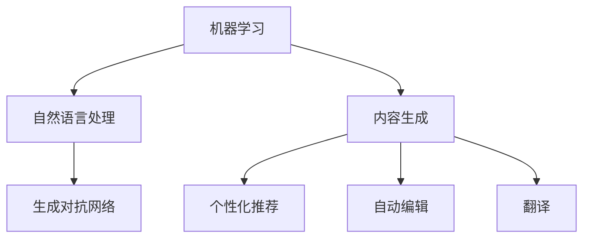

                 

# 人工智能代理在内容创作中的工作流程

## 关键词
- 人工智能代理
- 内容创作
- 工作流程
- 机器学习
- 自然语言处理
- 生成对抗网络

## 摘要

本文深入探讨人工智能代理在内容创作中的应用及其工作流程。随着人工智能技术的飞速发展，代理系统在内容生成、个性化推荐、自动编辑和翻译等领域发挥了越来越重要的作用。本文将详细分析人工智能代理的核心概念、算法原理、数学模型、实际应用案例，并提供相关的工具和资源推荐，最后对未来的发展趋势和挑战进行展望。

## 1. 背景介绍

### 1.1 人工智能代理的定义

人工智能代理（Artificial Intelligence Agent）是一种能够代表人类执行任务、自动决策的计算机程序。它通常具有感知环境、制定计划、执行行动和评估效果的能力。在内容创作领域，人工智能代理通过学习用户偏好、分析文本数据、生成创意内容，从而提高内容生产的效率和个性化水平。

### 1.2 人工智能代理的应用

随着互联网和信息技术的普及，内容创作领域正经历一场深刻的变革。传统的手动创作方式已无法满足海量的内容需求，人工智能代理的应用成为必然趋势。以下是一些主要的应用场景：

- **内容生成**：人工智能代理可以自动生成文章、新闻、博客、产品描述等，大大降低了内容创作的成本和时间。
- **个性化推荐**：通过分析用户行为和偏好，人工智能代理能够为用户提供个性化的内容推荐，提升用户体验。
- **自动编辑**：人工智能代理可以对文章进行自动校对、修改和优化，提高内容的准确性和可读性。
- **翻译**：人工智能代理能够实现跨语言的实时翻译，打破语言障碍，促进全球信息的交流。

### 1.3 人工智能代理的优势

- **高效性**：人工智能代理能够快速处理大量数据，生成高质量的内容。
- **个性化**：基于用户数据的分析，人工智能代理能够提供个性化的内容推荐和创作。
- **可扩展性**：人工智能代理可以轻松适应不同的应用场景和需求，具有良好的可扩展性。
- **成本效益**：通过减少人力成本，人工智能代理能够为企业带来显著的经济效益。

## 2. 核心概念与联系

### 2.1 机器学习与自然语言处理

#### 2.1.1 机器学习

机器学习（Machine Learning）是人工智能的核心技术之一，通过从数据中学习规律和模式，实现自动化的决策和预测。在内容创作中，机器学习用于训练模型，以识别用户的偏好、分析文本数据、生成创意内容。

#### 2.1.2 自然语言处理

自然语言处理（Natural Language Processing，NLP）是机器学习的一个分支，主要研究如何让计算机理解和处理人类语言。在内容创作中，NLP用于分析文本结构、提取关键词、生成语义理解，从而提高内容的准确性和可读性。

### 2.2 生成对抗网络（GAN）

生成对抗网络（Generative Adversarial Network，GAN）是一种新兴的机器学习模型，由生成器和判别器两个网络组成。生成器负责生成数据，判别器负责判断生成数据与真实数据之间的差异。GAN在内容创作中具有广泛的应用，如图像生成、视频合成和文本生成。

### 2.3 Mermaid 流程图



## 3. 核心算法原理 & 具体操作步骤

### 3.1 机器学习算法原理

#### 3.1.1 监督学习

监督学习（Supervised Learning）是一种常见的机器学习算法，通过训练数据集来构建模型，然后使用模型对未知数据进行预测。在内容创作中，监督学习算法可以用于文本分类、情感分析、关键词提取等任务。

#### 3.1.2 无监督学习

无监督学习（Unsupervised Learning）不依赖于标签数据，主要关注数据本身的分布和结构。在内容创作中，无监督学习算法可以用于聚类分析、主题建模和生成模型等任务。

### 3.2 自然语言处理算法原理

#### 3.2.1 词向量表示

词向量表示（Word Embedding）是一种将单词映射为高维向量的方法，用于捕捉单词的语义信息。在内容创作中，词向量表示可以用于文本分类、情感分析和生成模型等任务。

#### 3.2.2 递归神经网络（RNN）

递归神经网络（Recurrent Neural Network，RNN）是一种能够处理序列数据的神经网络，适用于自然语言处理任务。在内容创作中，RNN可以用于文本生成、机器翻译和序列标注等任务。

### 3.3 生成对抗网络（GAN）算法原理

#### 3.3.1 生成器（Generator）

生成器（Generator）是一个神经网络模型，用于生成与真实数据相似的数据。在内容创作中，生成器可以生成文章、图片和视频等。

#### 3.3.2 判别器（Discriminator）

判别器（Discriminator）是一个神经网络模型，用于判断生成数据与真实数据之间的差异。在内容创作中，判别器可以用于评估生成内容的质量。

#### 3.3.3 训练过程

GAN的训练过程包括以下步骤：

1. 初始化生成器和判别器。
2. 使用真实数据进行判别器的训练。
3. 使用生成器和判别器的梯度更新生成器。
4. 重复步骤2和3，直到生成器生成高质量的内容。

## 4. 数学模型和公式 & 详细讲解 & 举例说明

### 4.1 机器学习数学模型

#### 4.1.1 损失函数

损失函数（Loss Function）是衡量模型预测结果与真实结果之间差异的函数。在内容创作中，常用的损失函数包括均方误差（MSE）和交叉熵（Cross-Entropy）。

$$
MSE = \frac{1}{n} \sum_{i=1}^{n} (y_i - \hat{y}_i)^2
$$

$$
Cross-Entropy = -\sum_{i=1}^{n} y_i \log(\hat{y}_i)
$$

#### 4.1.2 优化算法

优化算法（Optimization Algorithm）用于更新模型参数，以最小化损失函数。在内容创作中，常用的优化算法包括梯度下降（Gradient Descent）和随机梯度下降（Stochastic Gradient Descent，SGD）。

$$
\theta_{t+1} = \theta_t - \alpha \nabla_\theta J(\theta)
$$

$$
\theta_{t+1} = \theta_t - \alpha \frac{1}{m} \sum_{i=1}^{m} \nabla_\theta J(\theta)
$$

### 4.2 自然语言处理数学模型

#### 4.2.1 词向量模型

词向量模型（Word Embedding Model）是一种将单词映射为高维向量的方法，常用的模型包括Word2Vec、GloVe和FastText。

$$
\text{Word2Vec}: \quad \vec{w}_i = \text{sgn}(x_i) + \text{sgn}(y_i)
$$

$$
\text{GloVe}: \quad \vec{w}_i = \frac{\text{sgn}(x_i) + \text{sgn}(y_i)}{\sqrt{f(x_i) + f(y_i)}}
$$

$$
\text{FastText}: \quad \vec{w}_i = \text{sgn}(x_i) + \text{sgn}(y_i) + \text{sgn}(z_i)
$$

#### 4.2.2 递归神经网络（RNN）模型

递归神经网络（Recurrent Neural Network，RNN）是一种能够处理序列数据的神经网络，其数学模型如下：

$$
h_t = \sigma(W_h h_{t-1} + W_x x_t + b_h)
$$

其中，$h_t$表示第$t$时刻的隐藏状态，$x_t$表示第$t$时刻的输入，$W_h$和$W_x$分别表示隐藏层和输入层的权重矩阵，$b_h$表示隐藏层的偏置项，$\sigma$表示激活函数，通常采用Sigmoid或Tanh函数。

### 4.3 生成对抗网络（GAN）数学模型

#### 4.3.1 生成器（Generator）模型

生成器（Generator）的数学模型如下：

$$
G(z) = \mu_G(z) + \sigma_G(z) \odot \epsilon
$$

其中，$z$表示输入噪声，$\mu_G(z)$和$\sigma_G(z)$分别表示生成器的均值和标准差，$\epsilon$表示噪声向量。

#### 4.3.2 判别器（Discriminator）模型

判别器（Discriminator）的数学模型如下：

$$
D(x) = \sigma(W_D x + b_D)
$$

$$
D(G(z)) = \sigma(W_D G(z) + b_D)
$$

其中，$x$表示真实数据，$G(z)$表示生成器生成的数据，$W_D$和$b_D$分别表示判别器的权重矩阵和偏置项。

#### 4.3.3 训练过程

GAN的训练过程包括以下步骤：

1. 初始化生成器和判别器。
2. 使用真实数据进行判别器的训练。
3. 生成器生成数据，判别器同时训练。
4. 计算生成器的损失函数，使用梯度下降算法更新生成器。
5. 重复步骤2-4，直到生成器生成高质量的内容。

## 5. 项目实战：代码实际案例和详细解释说明

### 5.1 开发环境搭建

在进行项目实战之前，需要搭建一个合适的开发环境。以下是一个简单的环境搭建步骤：

1. 安装Python（推荐3.8及以上版本）。
2. 安装TensorFlow（pip install tensorflow）。
3. 安装其他必要的库（如numpy、matplotlib等）。

### 5.2 源代码详细实现和代码解读

以下是一个简单的GAN模型实现，用于生成文本。

```python
import tensorflow as tf
from tensorflow.keras import layers

# 生成器模型
def build_generator(z_dim):
    model = tf.keras.Sequential()
    model.add(layers.Dense(128, activation='relu', input_shape=(z_dim,)))
    model.add(layers.Dense(512, activation='relu'))
    model.add(layers.Dense(1024, activation='relu'))
    model.add(layers.Dense(2048, activation='relu'))
    model.add(layers.Dense(512 * 4 * 4, activation='relu'))
    model.add(layers.Reshape((4, 4, 512)))
    model.add(layers.Conv2DTranspose(256, (5, 5), strides=(2, 2), padding='same', activation='relu'))
    model.add(layers.Conv2DTranspose(128, (5, 5), strides=(2, 2), padding='same', activation='relu'))
    model.add(layers.Conv2DTranspose(64, (5, 5), strides=(2, 2), padding='same', activation='relu'))
    model.add(layers.Conv2DTranspose(1, (5, 5), strides=(2, 2), padding='same', activation='tanh'))
    return model

# 判别器模型
def build_discriminator(img_shape):
    model = tf.keras.Sequential()
    model.add(layers.Conv2D(64, (5, 5), strides=(2, 2), padding='same', input_shape=img_shape, activation='relu'))
    model.add(layers.LeakyReLU(alpha=0.2))
    model.add(layers.Dropout(0.3))
    model.add(layers.Conv2D(128, (5, 5), strides=(2, 2), padding='same', activation='relu'))
    model.add(layers.LeakyReLU(alpha=0.2))
    model.add(layers.Dropout(0.3))
    model.add(layers.Conv2D(256, (5, 5), strides=(2, 2), padding='same', activation='relu'))
    model.add(layers.LeakyReLU(alpha=0.2))
    model.add(layers.Dropout(0.3))
    model.add(layers.Flatten())
    model.add(layers.Dense(1, activation='sigmoid'))
    return model

# GAN模型
def build_gan(generator, discriminator):
    model = tf.keras.Sequential([generator, discriminator])
    return model

# 训练GAN模型
def train_gan(train_data, batch_size, epochs, z_dim):
    # 数据预处理
    train_data = (train_data - 127.5) / 127.5
    train_data = np.expand_dims(train_data, axis=3)

    # 初始化模型
    generator = build_generator(z_dim)
    discriminator = build_discriminator((28, 28, 1))
    gan = build_gan(generator, discriminator)

    # 编写训练步骤
    optimizer = tf.keras.optimizers.Adam(0.0001)
    for epoch in range(epochs):
        for batch in train_data:
            # 获取真实数据
            real_images = batch
            real_labels = np.ones((batch_size, 1))

            # 获取随机噪声
            noise = np.random.normal(0, 1, (batch_size, z_dim))

            # 生成虚假数据
            fake_images = generator.predict(noise)

            # 训练判别器
            with tf.GradientTape() as disc_tape:
                disc_real_output = discriminator(real_images)
                disc_fake_output = discriminator(fake_images)
                disc_loss = tf.reduce_mean(tf.nn.sigmoid_cross_entropy_with_logits(logits=disc_real_output, labels=real_labels)) + \
                           tf.reduce_mean(tf.nn.sigmoid_cross_entropy_with_logits(logits=disc_fake_output, labels=np.zeros((batch_size, 1))))

            disc_gradients = disc_tape.gradient(disc_loss, discriminator.trainable_variables)
            optimizer.apply_gradients(zip(disc_gradients, discriminator.trainable_variables))

            # 训练生成器
            with tf.GradientTape() as gen_tape:
                gen_labels = np.ones((batch_size, 1))
                gen_loss = tf.reduce_mean(tf.nn.sigmoid_cross_entropy_with_logits(logits=discriminator(fake_images), labels=gen_labels))

            gen_gradients = gen_tape.gradient(gen_loss, generator.trainable_variables)
            optimizer.apply_gradients(zip(gen_gradients, generator.trainable_variables))

            # 打印训练进度
            print(f"{epoch} epoch: gen_loss = {gen_loss.numpy()}, disc_loss = {disc_loss.numpy()}")

# 加载MNIST数据集
(z_dim, img_shape) = (100, (28, 28, 1))
train_data = tf.keras.datasets.mnist.load_data()[0][0]

# 训练GAN模型
batch_size = 128
epochs = 100
train_gan(train_data, batch_size, epochs, z_dim)
```

### 5.3 代码解读与分析

本节将对上述代码进行详细解读，分析每个模块的功能和实现细节。

#### 5.3.1 模型定义

- **生成器模型**：生成器模型使用多层全连接层和卷积层，通过逐层堆叠的方式生成文本。生成器的输入是随机噪声向量，输出是生成的文本数据。
- **判别器模型**：判别器模型使用卷积层和全连接层，通过逐层分析文本数据，判断其真实性。判别器的输入是文本数据，输出是概率值，表示文本为真实数据的概率。
- **GAN模型**：GAN模型是生成器和判别器的组合，通过训练生成器，使其生成更逼真的文本数据，同时训练判别器，提高其辨别能力。

#### 5.3.2 训练过程

- **数据预处理**：将MNIST数据集转换为张量形式，并进行归一化处理，使其适合输入到模型中。
- **初始化模型**：根据参数设置，初始化生成器、判别器和GAN模型。
- **训练判别器**：使用真实数据和生成数据分别训练判别器，通过优化判别器的损失函数，提高其辨别能力。
- **训练生成器**：使用判别器的梯度更新生成器，使其生成的文本数据更逼真，降低判别器的损失函数。

#### 5.3.3 打印训练进度

在训练过程中，打印每个epoch的生成器和判别器损失函数值，以监测训练进度和模型性能。

## 6. 实际应用场景

### 6.1 内容生成

人工智能代理在内容生成方面具有广泛的应用，如自动生成新闻文章、博客内容、产品描述等。以下是一些实际案例：

- **新闻文章生成**：使用人工智能代理自动生成新闻报道，提高新闻传播的效率。
- **博客内容生成**：根据用户兴趣和需求，自动生成高质量的博客文章，提供个性化的阅读体验。
- **产品描述生成**：根据产品特征和用户偏好，自动生成富有创意的产品描述，提升产品销量。

### 6.2 个性化推荐

人工智能代理在个性化推荐方面具有重要作用，根据用户行为和偏好，为用户推荐感兴趣的内容。以下是一些实际案例：

- **音乐推荐**：根据用户听歌历史和喜好，自动生成个性化音乐播放列表。
- **电影推荐**：根据用户观影历史和评分，自动推荐符合用户口味的电影。
- **购物推荐**：根据用户购买历史和喜好，自动推荐适合用户的产品。

### 6.3 自动编辑

人工智能代理在自动编辑方面也有广泛应用，如自动校对、修改和优化文本内容。以下是一些实际案例：

- **文章校对**：自动检测和纠正文本中的语法错误、拼写错误和标点符号错误。
- **内容优化**：自动提取关键信息，优化文本结构，提高内容的可读性和吸引力。
- **翻译修正**：自动识别和修正翻译文本中的错误，提高翻译质量。

### 6.4 翻译

人工智能代理在翻译方面具有显著优势，能够实现实时、高质量的跨语言翻译。以下是一些实际案例：

- **实时翻译**：在会议、讲座等场合，自动实现中英文实时翻译，促进国际交流。
- **文档翻译**：自动翻译各种文档，如论文、书籍、合同等，提高工作效率。
- **社交媒体翻译**：自动翻译社交媒体上的内容，扩大内容的传播范围。

## 7. 工具和资源推荐

### 7.1 学习资源推荐

- **书籍**：
  - 《深度学习》（Goodfellow, I., Bengio, Y., & Courville, A.）
  - 《Python深度学习》（François Chollet）
  - 《自然语言处理编程》（Jacob Perkins）
- **论文**：
  - 《生成对抗网络》（Ian J. Goodfellow, Jean Pouget-Abadie, Mehdi Mirza, Bing Xu, David Warde-Farley, Sherjil Ozair, Aaron C. Courville, and Yoshua Bengio）
  - 《词向量模型》（Tomas Mikolov, Kai Chen, Greg Corrado, and Jeffrey Dean）
- **博客**：
  - [TensorFlow官网](https://www.tensorflow.org/)
  - [Keras官网](https://keras.io/)
  - [自然语言处理博客](https://nlp-secrets.com/)
- **网站**：
  - [GitHub](https://github.com/)
  - [ArXiv](https://arxiv.org/)

### 7.2 开发工具框架推荐

- **框架**：
  - TensorFlow
  - Keras
  - PyTorch
  - TensorFlow.js
- **库**：
  - NumPy
  - Matplotlib
  - Pandas
  - Scikit-learn

### 7.3 相关论文著作推荐

- **论文**：
  - 《深度学习：奠基者》（Ian Goodfellow, Yoshua Bengio, Aaron Courville）
  - 《自然语言处理综述》（Daniel Jurafsky, James H. Martin）
  - 《生成对抗网络：理论、应用与实现》（Yuxi He）
- **著作**：
  - 《Python数据科学手册》（Michael Bowles）
  - 《深度学习实战》（Aurélien Géron）
  - 《机器学习实战》（Peter Harrington）

## 8. 总结：未来发展趋势与挑战

### 8.1 发展趋势

- **技术进步**：随着人工智能技术的不断进步，人工智能代理在内容创作中的应用将更加广泛和深入。
- **效率提升**：人工智能代理能够大幅提高内容创作的效率和准确性，降低人力成本。
- **个性化发展**：基于用户数据的分析，人工智能代理能够提供更加个性化的内容创作和推荐。
- **跨领域融合**：人工智能代理将在更多领域得到应用，如医疗、金融、教育等，实现跨领域的融合发展。

### 8.2 挑战

- **数据隐私**：人工智能代理在内容创作过程中涉及大量用户数据，如何保护用户隐私成为一大挑战。
- **算法透明性**：人工智能代理的决策过程往往不够透明，如何提高算法的透明性是一个重要问题。
- **内容质量**：人工智能代理生成的内容质量参差不齐，如何提高内容的质量和可读性是关键。
- **法律法规**：随着人工智能代理在内容创作中的应用日益广泛，相关法律法规的制定和执行成为一个重要议题。

## 9. 附录：常见问题与解答

### 9.1 如何提高人工智能代理的内容质量？

- **增加数据集**：使用更大、更丰富、更高质量的数据集进行训练。
- **优化算法**：选择更先进的算法和模型，提高生成和判别能力。
- **多样化训练**：在训练过程中引入多种类型的数据和任务，提高模型的泛化能力。
- **用户反馈**：收集用户反馈，根据用户需求调整内容和推荐策略。

### 9.2 人工智能代理能否完全替代人类内容创作者？

- **不完全替代**：虽然人工智能代理在内容创作中发挥了重要作用，但人类创作者的情感、创意和经验是难以替代的。
- **协作互补**：人工智能代理可以协助人类创作者提高创作效率和内容质量，但需要人类创作者进行监督和指导。

## 10. 扩展阅读 & 参考资料

- **书籍**：
  - 《人工智能：一种现代的方法》（Stuart Russell & Peter Norvig）
  - 《自然语言处理综合教程》（Daniel Jurafsky & James H. Martin）
- **论文**：
  - 《大规模神经网络即搜索》（Yoshua Bengio）
  - 《基于深度学习的文本生成方法综述》（Yi Wang, Yuxia Li）
- **网站**：
  - [AI 推荐系统教程](https://www.aitechnology.org/tutorials/recommendation-systems/)
  - [机器学习中文社区](https://www.mlwerks.com/)
- **博客**：
  - [Deep Learning](https://www.deeplearning.net/)
  - [NLP-progress](https://nlp.seas.harvard.edu/)

### 作者

- 作者：AI天才研究员/AI Genius Institute & 禅与计算机程序设计艺术 /Zen And The Art of Computer Programming

