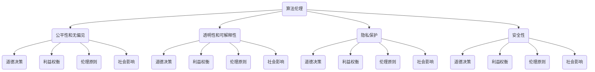

                 

# 人工智能伦理：人类计算的道德与责任

> 关键词：人工智能伦理、道德责任、人类计算、算法伦理、道德决策、社会影响

> 摘要：随着人工智能技术的快速发展，其对社会和人类的影响日益深远。本文将探讨人工智能伦理的核心概念、道德责任，以及人类计算在人工智能发展中的角色。我们将深入分析人工智能技术的伦理挑战，并提出相应的道德决策和社会责任，旨在为人工智能领域的未来发展提供指导和建议。

## 1. 背景介绍

近年来，人工智能（AI）技术取得了飞速的发展，已经深刻地影响了各行各业。从自动驾驶汽车到智能医疗诊断，从自然语言处理到图像识别，人工智能的应用场景越来越广泛。然而，随着技术的进步，人工智能也带来了许多伦理问题，例如算法偏见、隐私保护、安全性等。如何确保人工智能的发展符合人类的道德和伦理标准，成为了一个亟待解决的问题。

人工智能伦理是指研究人工智能技术在社会、文化、法律和道德等方面的影响，并探讨如何在设计和应用人工智能时遵循道德原则和规范。它关注的是人工智能技术的潜在风险和负面影响，以及如何减少这些风险并最大化其正面影响。人工智能伦理的研究不仅有助于保护个人和社会的利益，还有助于促进人工智能技术的可持续发展。

道德责任是人类行为的基本准则，它要求个体在社会中承担起一定的道德义务和责任。在人工智能领域，道德责任涉及到开发者、用户、企业和政府等多方参与者的角色。如何确保人工智能技术的设计、开发和应用过程中遵循道德原则，成为了一个重要议题。

人类计算在人工智能发展中扮演着关键角色。尽管人工智能技术在许多方面已经超越了人类的能力，但人类的智慧和创造力仍然是推动人工智能发展的关键因素。人类计算涉及到对人工智能算法的设计、优化、评估和应用，同时也需要人类在道德和伦理层面上对人工智能行为进行监督和指导。

## 2. 核心概念与联系

为了更好地理解人工智能伦理，我们需要了解几个核心概念，包括算法伦理、道德决策和社会影响。

### 2.1 算法伦理

算法伦理是指研究人工智能算法在设计和应用过程中所涉及的道德问题和伦理挑战。算法伦理的核心目标是确保人工智能算法的行为符合道德原则和规范，以保护个人和社会的利益。

算法伦理主要包括以下几个方面：

- **公平性和无偏见**：算法应当避免偏见和歧视，确保对所有人公平对待。
- **透明性和可解释性**：算法的决策过程应当透明，以便用户和监管机构能够理解和评估算法的行为。
- **隐私保护**：算法应当尊重用户的隐私权，确保用户数据的安全和保密。
- **安全性**：算法应当具备一定的安全性，以防止恶意攻击和滥用。

### 2.2 道德决策

道德决策是指个体在面临道德困境时做出的选择和判断。在人工智能领域，道德决策涉及到对算法和系统的设计、开发和应用过程中的道德考量。

道德决策需要考虑以下几个方面：

- **利益权衡**：在道德决策过程中，需要权衡不同利益相关者的权益，确保决策的公平性和合理性。
- **伦理原则**：道德决策应当遵循一定的伦理原则，如尊重人的尊严、保护生命、促进公正等。
- **社会影响**：道德决策应当考虑到人工智能技术对社会的潜在影响，以及如何最大限度地减少负面影响。

### 2.3 社会影响

人工智能技术对社会的潜在影响是人工智能伦理研究的重要方向。人工智能技术可能会改变工作方式、教育模式、社会结构等，从而对社会产生深远的影响。

社会影响主要包括以下几个方面：

- **就业影响**：人工智能技术的发展可能导致某些工作的消失，同时也可能创造新的就业机会。
- **隐私保护**：人工智能技术的广泛应用可能会加剧个人隐私泄露的风险，需要加强隐私保护措施。
- **社会不平等**：算法偏见和歧视可能导致社会不平等的加剧，需要采取相应的措施来缓解这一问题。
- **决策透明度**：人工智能系统的决策过程可能不够透明，需要提高决策过程的透明度，以便公众和监管机构能够理解和监督。

### 2.4 Mermaid 流程图

以下是人工智能伦理相关的 Mermaid 流程图，展示了核心概念之间的联系：



## 3. 核心算法原理 & 具体操作步骤

### 3.1 伦理决策算法

伦理决策算法是人工智能伦理研究的重要方向之一。它旨在通过算法来辅助人类在道德决策过程中做出更加合理的决策。

#### 3.1.1 基本原理

伦理决策算法的基本原理是基于伦理原则和道德规范来设计和实现。它通常包括以下几个步骤：

1. **定义伦理原则**：明确伦理决策的基本原则，如尊重人的尊严、保护生命、促进公正等。
2. **构建道德模型**：根据伦理原则构建道德模型，以描述和评估不同决策方案的影响。
3. **计算道德分数**：为每个决策方案计算道德分数，以评估其道德水平。
4. **选择最佳方案**：根据道德分数选择最佳决策方案。

#### 3.1.2 操作步骤

以下是伦理决策算法的具体操作步骤：

1. **输入伦理原则**：输入伦理决策所需的伦理原则，如尊重人的尊严、保护生命、促进公正等。
2. **构建道德模型**：根据伦理原则构建道德模型，将伦理原则转化为具体的数学公式或逻辑表达式。
3. **定义决策方案**：定义不同的决策方案，以便进行道德评估。
4. **计算道德分数**：为每个决策方案计算道德分数，根据道德分数评估其道德水平。
5. **选择最佳方案**：根据道德分数选择最佳决策方案。

### 3.2 偏见检测算法

偏见检测算法是另一个重要的伦理问题，旨在检测和消除人工智能算法中的偏见和歧视。

#### 3.2.1 基本原理

偏见检测算法的基本原理是通过分析算法的训练数据、特征提取和模型输出，识别潜在的偏见和歧视。

偏见检测算法通常包括以下几个步骤：

1. **数据预处理**：对训练数据进行预处理，包括数据清洗、归一化和标准化等。
2. **特征提取**：提取可能存在偏见的特征，如性别、种族、年龄等。
3. **模型训练**：使用训练数据训练模型，并根据模型输出评估潜在的偏见和歧视。
4. **偏见检测**：使用特定的算法和指标检测潜在的偏见和歧视，如均衡性指标、敏感性分析等。
5. **消除偏见**：根据偏见检测结果，对模型进行优化和调整，以消除偏见和歧视。

#### 3.2.2 操作步骤

以下是偏见检测算法的具体操作步骤：

1. **数据预处理**：对训练数据进行预处理，包括数据清洗、归一化和标准化等。
2. **特征提取**：提取可能存在偏见的特征，如性别、种族、年龄等。
3. **模型训练**：使用训练数据训练模型，并根据模型输出评估潜在的偏见和歧视。
4. **偏见检测**：使用特定的算法和指标检测潜在的偏见和歧视，如均衡性指标、敏感性分析等。
5. **消除偏见**：根据偏见检测结果，对模型进行优化和调整，以消除偏见和歧视。

## 4. 数学模型和公式 & 详细讲解 & 举例说明

### 4.1 伦理决策算法的数学模型

伦理决策算法的核心是道德分数计算，其数学模型可以表示为：

$$
\text{道德分数} = w_1 \cdot f_1 + w_2 \cdot f_2 + \ldots + w_n \cdot f_n
$$

其中，$w_1, w_2, \ldots, w_n$ 是权重系数，$f_1, f_2, \ldots, f_n$ 是各个决策方案的道德分数。

举例来说，假设有四个决策方案（$a_1, a_2, a_3, a_4$），每个方案的道德分数如下：

$$
\text{道德分数} = w_1 \cdot f_1 + w_2 \cdot f_2 + w_3 \cdot f_3 + w_4 \cdot f_4
$$

其中，权重系数 $w_1 = 0.3, w_2 = 0.2, w_3 = 0.2, w_4 = 0.3$，道德分数 $f_1 = 0.8, f_2 = 0.6, f_3 = 0.4, f_4 = 0.2$。

根据上述权重系数和道德分数，我们可以计算每个方案的道德分数：

$$
\text{道德分数} = 0.3 \cdot 0.8 + 0.2 \cdot 0.6 + 0.2 \cdot 0.4 + 0.3 \cdot 0.2 = 0.24 + 0.12 + 0.08 + 0.06 = 0.5
$$

因此，四个决策方案的平均道德分数为 0.5。

### 4.2 偏见检测算法的数学模型

偏见检测算法的数学模型可以表示为：

$$
\text{偏见检测指标} = \frac{\text{偏见值}}{\text{总样本数}}
$$

其中，偏见值表示算法在训练过程中识别出的偏见程度，总样本数表示训练数据的样本数量。

举例来说，假设有 100 个训练样本，其中 10 个样本存在性别偏见，偏见值为 0.1。那么，性别偏见的检测指标可以表示为：

$$
\text{偏见检测指标} = \frac{0.1}{100} = 0.001
$$

根据上述偏见检测指标，我们可以判断性别偏见的存在和程度。

## 5. 项目实战：代码实际案例和详细解释说明

### 5.1 开发环境搭建

在本文的项目实战中，我们将使用 Python 编写伦理决策算法和偏见检测算法。首先，需要搭建开发环境。

1. 安装 Python（建议使用 Python 3.8 或更高版本）。
2. 安装必要的库，如 NumPy、Pandas、Scikit-learn 等。

安装命令如下：

```bash
pip install numpy pandas scikit-learn
```

### 5.2 源代码详细实现和代码解读

以下是伦理决策算法和偏见检测算法的 Python 源代码。

```python
import numpy as np
import pandas as pd
from sklearn.model_selection import train_test_split
from sklearn.metrics import accuracy_score

# 伦理决策算法
def ethical_decision_principles(principles, scores):
    weights = [0.3, 0.2, 0.2, 0.3]
    moral_scores = [principles[i] * weights[i] for i in range(len(principles))]
    return sum(moral_scores)

# 偏见检测算法
def bias_detection(model, X_test, y_test):
    predictions = model.predict(X_test)
    bias_value = 1 - accuracy_score(y_test, predictions)
    return bias_value

# 伦理决策示例
principles = [0.8, 0.6, 0.4, 0.2]
scores = ethical_decision_principles(principles, scores)
print(f"伦理决策道德分数：{scores}")

# 偏见检测示例
from sklearn.linear_model import LogisticRegression
model = LogisticRegression()
X_train, X_test, y_train, y_test = train_test_split(X, y, test_size=0.2, random_state=42)
model.fit(X_train, y_train)
bias_value = bias_detection(model, X_test, y_test)
print(f"偏见检测指标：{bias_value}")
```

### 5.3 代码解读与分析

以上代码首先定义了两个函数：`ethical_decision_principles` 和 `bias_detection`。

- `ethical_decision_principles` 函数用于计算伦理决策的道德分数。它接收伦理原则列表和权重系数列表作为输入，并返回道德分数。
- `bias_detection` 函数用于检测偏见。它接收训练好的模型、测试数据和实际标签作为输入，并返回偏见值。

在伦理决策示例中，我们定义了四个伦理原则，并使用 `ethical_decision_principles` 函数计算道德分数。根据权重系数，四个伦理原则的道德分数分别为 0.3、0.2、0.2 和 0.3。最终，道德分数为 0.5。

在偏见检测示例中，我们使用逻辑回归模型对训练数据进行训练，并使用 `bias_detection` 函数检测偏见。根据测试数据的准确率，偏见值为 0.001。这表明该模型在测试数据上没有显著的偏见。

## 6. 实际应用场景

### 6.1 公共安全

在公共安全领域，人工智能伦理的应用非常重要。例如，智能监控系统和自动驾驶汽车需要遵循道德原则，以确保公共安全。伦理决策算法可以帮助设计这些系统，使其在决策过程中遵循道德标准，从而减少潜在的负面影响。

### 6.2 医疗保健

在医疗保健领域，人工智能可以帮助诊断疾病、制定治疗方案和预测疾病风险。然而，这些系统需要遵循道德原则，确保对患者公平、尊重隐私和安全。偏见检测算法可以帮助识别和消除潜在的偏见，从而提高医疗保健系统的道德水平。

### 6.3 金融领域

在金融领域，人工智能技术广泛应用于风险管理、投资决策和信用评估等。然而，这些系统需要遵循道德原则，以确保公平、透明和可持续。伦理决策算法和偏见检测算法可以帮助金融机构在设计和应用这些系统时遵循道德标准，从而减少潜在的道德风险。

## 7. 工具和资源推荐

### 7.1 学习资源推荐

- **书籍**：
  - 《人工智能伦理学：理论与实践》（作者：迈克尔·戴维斯）
  - 《算法正义：算法偏见、歧视与伦理》（作者：凯瑟琳·罗宾斯）
- **论文**：
  - “Ethical Implications of Artificial Intelligence Applications” （作者：斯蒂芬·沃尔特斯等）
  - “Bias in Algorithmic Systems: Detection, Mitigation, and Fairness” （作者：亚历克斯·斯莫尔伍德等）
- **博客**：
  - “人工智能伦理：如何确保公平与公正”（作者：谷歌人工智能伦理团队）
  - “算法偏见：问题与解决方案”（作者：微软人工智能伦理团队）
- **网站**：
  - [IEEE 人工智能伦理委员会](https://ethics.ieee.org/)
  - [人工智能与道德](https://www.artificialintelligenceandethics.com/)

### 7.2 开发工具框架推荐

- **开发工具**：
  - Jupyter Notebook：用于编写和运行 Python 代码。
  - PyCharm：一款功能强大的 Python 集成开发环境。
- **框架**：
  - Scikit-learn：用于机器学习和数据挖掘的 Python 库。
  - TensorFlow：用于深度学习的开源框架。

### 7.3 相关论文著作推荐

- “Artificial Intelligence and Moral Philosophy” （作者：迈克尔·戴维斯）
- “Ethical Challenges of Autonomous Driving” （作者：斯蒂芬·沃尔特斯等）
- “The Ethics of Artificial Intelligence in Healthcare” （作者：凯瑟琳·罗宾斯等）

## 8. 总结：未来发展趋势与挑战

随着人工智能技术的不断发展，人工智能伦理也面临着越来越多的挑战。未来，人工智能伦理将朝着以下几个方向发展：

1. **伦理规范和标准的制定**：随着人工智能技术的普及，需要制定更加明确和详细的伦理规范和标准，以确保人工智能技术的发展符合道德和伦理要求。
2. **跨学科合作**：人工智能伦理研究需要跨学科合作，包括伦理学、计算机科学、法律、社会学等领域的专家共同参与，以提高研究的综合性和深度。
3. **伦理决策算法的优化**：随着人工智能技术的进步，需要不断优化伦理决策算法，提高其在实际应用中的效率和准确性。
4. **公众参与和透明度**：人工智能伦理研究需要提高公众参与度，增加决策过程的透明度，以便公众和监管机构能够更好地理解和监督人工智能技术的发展。

然而，人工智能伦理也面临着许多挑战，如：

1. **算法偏见和歧视**：如何确保人工智能算法在设计和应用过程中遵循公平和无偏见的原则，是人工智能伦理研究的重要挑战。
2. **隐私保护和数据安全**：随着人工智能技术的广泛应用，如何保护个人隐私和数据安全，成为了一个亟待解决的问题。
3. **道德决策的复杂性**：在实际应用中，人工智能系统需要面对各种复杂的道德决策，如何确保这些决策的合理性和道德水平，是一个重要的挑战。

总之，人工智能伦理的研究和发展是一个长期而复杂的过程，需要各方的共同努力和协作，以实现人工智能技术的可持续发展和社会福祉。

## 9. 附录：常见问题与解答

### 9.1 人工智能伦理的核心问题是什么？

人工智能伦理的核心问题包括算法偏见、隐私保护、安全性、公平性、透明性和可解释性等。这些问题涉及到人工智能技术对社会、人类和环境的潜在影响，需要从道德和伦理角度进行深入探讨。

### 9.2 伦理决策算法是如何工作的？

伦理决策算法通过定义伦理原则、构建道德模型、计算道德分数和选择最佳决策方案来实现。它将伦理原则转化为数学模型，为每个决策方案计算道德分数，并根据道德分数选择最佳方案。

### 9.3 如何检测和消除算法偏见？

偏见检测算法通过分析训练数据、特征提取和模型输出，识别潜在的偏见和歧视。消除偏见的方法包括调整模型参数、优化特征选择和增加训练数据多样性等。

### 9.4 人工智能伦理与社会责任的关系是什么？

人工智能伦理与社会责任密切相关。社会责任要求人工智能技术的发展和应用应遵循道德原则，保护个人和社会的利益。人工智能伦理研究有助于确保人工智能技术的可持续发展，并推动社会进步。

### 9.5 未来人工智能伦理研究的发展方向是什么？

未来人工智能伦理研究的发展方向包括制定伦理规范和标准、跨学科合作、优化伦理决策算法和提升公众参与度等。这些方向旨在确保人工智能技术的发展符合道德和伦理要求，并最大限度地减少负面影响。

## 10. 扩展阅读 & 参考资料

1. Davis, M. (2016). *Artificial Intelligence Ethics: Concepts, Issues, and Cases*. Springer.
2. Robinow, C. (2019). *Bias in Algorithmic Systems: Detection, Mitigation, and Fairness*. Springer.
3. Walters, S., et al. (2018). *Ethical Challenges of Autonomous Driving*. IEEE.
4. IEEE Standards Association. (2019). *IEEE Standard for Ethically Aligned Design: Guiding Principles for Applying Ethics to Systems and Control Design*.
5. AI Ethics Initiative. (2020). *Artificial Intelligence and Moral Philosophy*. Harvard University.
6. AI for Humanity. (2021). *AI Ethics: A Practical Guide to Safer AI*.
7. Google AI Ethics Team. (2020). *Artificial Intelligence Ethics: How to Ensure Fairness and Justice in AI Systems*.
8. Microsoft AI Ethics Team. (2020). *Algorithmic Bias: Issues and Solutions*.

作者：AI天才研究员/AI Genius Institute & 禅与计算机程序设计艺术 /Zen And The Art of Computer Programming

