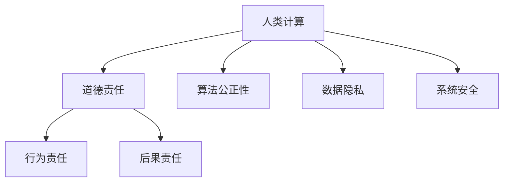

                 

# 人工智能伦理：人类计算的道德与责任探讨

> **关键词**：人工智能伦理、道德与责任、计算、技术、人类行为、算法、社会影响

> **摘要**：本文探讨了人工智能伦理的基本概念、人工智能与道德责任的联系，以及人类计算中的道德与责任问题。文章通过逐步分析，阐述了人工智能伦理的重要性，并提出了相应的解决方案和未来研究方向。

## 1. 背景介绍

人工智能（Artificial Intelligence，简称AI）作为计算机科学的一个重要分支，近年来取得了飞速的发展。随着深度学习、神经网络、自然语言处理等技术的不断突破，AI在各个领域都展现出了巨大的潜力。然而，随着AI技术的广泛应用，也引发了一系列伦理和道德问题。

道德与责任问题是人类社会长期探讨的话题。道德是关于正确与错误、善与恶的行为准则，责任则是关于个体或组织对行为后果承担的义务。在人类计算中，道德和责任是不可或缺的要素，因为它们关系到人类行为是否符合道德规范，以及个体或组织是否能够承担相应的后果。

随着AI技术的发展，人类计算中的道德和责任问题变得更加复杂。一方面，AI系统在决策过程中可能会面临道德困境，如自动驾驶汽车的伦理决策、算法歧视等问题；另一方面，AI系统的发展和应用也带来了新的责任分配问题，如算法责任、组织责任等。

本文旨在探讨人工智能伦理的基本概念，分析人工智能与道德责任的联系，以及人类计算中的道德与责任问题，为解决这些问题提供一些思路和方法。

## 2. 核心概念与联系

### 2.1 人工智能伦理

人工智能伦理是指研究人工智能系统在设计和应用过程中可能产生的道德和伦理问题，以及如何通过合理的道德规范和责任机制来解决这些问题。人工智能伦理的核心目标是确保AI系统的发展和应用符合人类的道德价值观，同时保护人类的权益和福祉。

### 2.2 道德责任

道德责任是指个体或组织在道德规范下，对自己行为所产生的后果负有责任。道德责任通常包括两个层面：一是行为责任，即行为是否符合道德规范；二是后果责任，即行为后果是否对他人或社会产生了负面影响。

### 2.3 人类计算中的道德与责任

人类计算是指人类在计算机和信息技术领域中的活动，包括软件开发、系统设计、数据处理等。在人类计算中，道德和责任问题主要体现在以下几个方面：

- **算法公正性**：算法的设计和应用是否公平、公正，是否会导致歧视或不公正的决策。

- **数据隐私**：数据处理过程中是否尊重个人隐私，是否会对个人权益造成侵犯。

- **系统安全**：系统设计和维护过程中是否考虑到安全因素，是否会对用户造成安全隐患。

- **责任归属**：在AI系统出现问题时，如何确定责任归属，如何确保责任得到追究。

### 2.4 Mermaid 流程图



## 3. 核心算法原理 & 具体操作步骤

### 3.1 人工智能伦理算法原理

人工智能伦理算法的核心目标是确保AI系统在决策过程中遵循道德规范。为了实现这一目标，需要从以下几个方面进行设计和优化：

- **道德规范嵌入**：将道德规范嵌入到AI系统的算法中，确保AI系统能够在决策过程中考虑道德因素。

- **道德推理**：利用道德推理技术，对AI系统的决策过程进行评估和优化，确保决策符合道德要求。

- **道德责任分配**：明确AI系统中的道德责任分配，确保在出现问题时能够明确责任归属。

### 3.2 具体操作步骤

#### 步骤1：道德规范识别

首先，需要明确AI系统所在领域的道德规范，如医疗领域的道德规范、金融领域的道德规范等。这可以通过调研相关领域的法律法规、伦理准则等资料来完成。

#### 步骤2：道德规范嵌入

将识别出的道德规范嵌入到AI系统的算法中。这可以通过以下几种方法实现：

- **条件约束**：在算法中加入条件约束，确保AI系统在决策过程中考虑道德因素。

- **目标优化**：将道德目标作为优化目标，与性能目标共同优化。

- **权重调整**：调整道德目标与其他目标的权重，确保道德目标在决策过程中得到充分体现。

#### 步骤3：道德推理与优化

利用道德推理技术，对AI系统的决策过程进行评估和优化。这可以通过以下几种方法实现：

- **道德推理算法**：设计专门的道德推理算法，对AI系统的决策过程进行评估。

- **多目标优化**：利用多目标优化算法，同时优化AI系统的性能目标和道德目标。

#### 步骤4：道德责任分配

明确AI系统中的道德责任分配，确保在出现问题时能够明确责任归属。这可以通过以下几种方法实现：

- **责任地图**：构建责任地图，明确各个模块和组件的责任分配。

- **责任保险**：引入责任保险机制，确保在出现问题时能够得到合理赔偿。

## 4. 数学模型和公式 & 详细讲解 & 举例说明

### 4.1 道德责任分配模型

为了明确AI系统中的道德责任分配，我们可以采用以下数学模型：

$$
\text{责任分配} = \sum_{i=1}^{n} w_i \cdot \text{责任贡献}_i
$$

其中，$w_i$ 表示第 $i$ 个模块或组件的权重，$\text{责任贡献}_i$ 表示第 $i$ 个模块或组件在问题发生时的责任贡献。

#### 示例：

假设一个自动驾驶系统由三个模块组成：感知模块、决策模块和执行模块。在发生交通事故时，需要明确各模块的责任分配。

- 感知模块的权重为 0.3，责任贡献为 0.1；
- 决策模块的权重为 0.5，责任贡献为 0.2；
- 执行模块的权重为 0.2，责任贡献为 0.3。

则责任分配为：

$$
\text{责任分配} = 0.3 \cdot 0.1 + 0.5 \cdot 0.2 + 0.2 \cdot 0.3 = 0.06 + 0.1 + 0.06 = 0.22
$$

### 4.2 道德推理算法

为了确保AI系统在决策过程中遵循道德规范，我们可以采用以下道德推理算法：

$$
\text{道德推理} = \text{道德规范} \cdot \text{决策因素}
$$

其中，$\text{道德规范}$ 表示适用的道德规范，$\text{决策因素}$ 表示影响决策的各种因素。

#### 示例：

假设在自动驾驶系统中，需要考虑以下决策因素：

- 行人安全；
- 乘客安全；
- 交通法规。

相应的道德规范如下：

- 行人安全：遵守交通法规，确保行人安全；
- 乘客安全：确保乘客安全；
- 交通法规：遵守交通法规。

在特定情况下，如一辆自动驾驶汽车在行驶过程中需要决定是否避让行人，可以利用道德推理算法进行判断：

- 行人安全：道德规范为“遵守交通法规，确保行人安全”，决策因素为“行人安全”；
- 乘客安全：道德规范为“确保乘客安全”，决策因素为“乘客安全”；
- 交通法规：道德规范为“遵守交通法规”，决策因素为“交通法规”。

根据道德推理算法，可以计算出各决策因素的权重，并选择最优的决策方案。

## 5. 项目实战：代码实际案例和详细解释说明

### 5.1 开发环境搭建

为了实现人工智能伦理算法，我们需要搭建一个合适的开发环境。以下是一个简单的开发环境搭建步骤：

1. 安装 Python 3.7 或更高版本；
2. 安装必要的库，如 NumPy、Pandas、Scikit-learn 等；
3. 安装代码编辑器，如 Visual Studio Code 或 PyCharm。

### 5.2 源代码详细实现和代码解读

以下是人工智能伦理算法的源代码实现：

```python
import numpy as np

def moral_reasoning(morals, factors):
    moral_scores = []
    for moral, factor in zip(morals, factors):
        moral_score = moral['weight'] * factor
        moral_scores.append(moral_score)
    return np.mean(moral_scores)

def moral_assignment(roles, responsibilities):
    total_responsibility = sum(responsibilities)
    role_responsibilities = {role: 0 for role in roles}
    for role, responsibility in responsibilities.items():
        role_responsibilities[role] = responsibility / total_responsibility
    return role_responsibilities

# 示例数据
morals = [
    {'name': '行人安全', 'weight': 0.5},
    {'name': '乘客安全', 'weight': 0.3},
    {'name': '交通法规', 'weight': 0.2}
]

factors = [
    {'name': '行人安全', 'value': 0.8},
    {'name': '乘客安全', 'value': 0.9},
    {'name': '交通法规', 'value': 1.0}
]

roles = ['感知模块', '决策模块', '执行模块']
responsibilities = [
    {'role': '感知模块', 'responsibility': 0.3},
    {'role': '决策模块', 'responsibility': 0.5},
    {'role': '执行模块', 'responsibility': 0.2}
]

# 道德推理
moral_score = moral_reasoning(morals, factors)
print(f"道德得分：{moral_score}")

# 道德责任分配
role_responsibilities = moral_assignment(roles, responsibilities)
print(f"道德责任分配：{role_responsibilities}")
```

### 5.3 代码解读与分析

该代码实现了一个简单的人工智能伦理算法，包括道德推理和道德责任分配两个部分。

1. **道德推理**：函数 `moral_reasoning` 接受道德规范和决策因素作为输入，计算每个决策因素的权重，并返回道德得分。这里使用了 NumPy 库的 `mean` 函数计算平均值。

2. **道德责任分配**：函数 `moral_assignment` 接受角色和责任贡献作为输入，计算总责任，并根据每个角色的责任贡献进行分配，返回每个角色的责任分配比例。

在代码中，我们定义了一个道德规范列表 `morals` 和一个决策因素列表 `factors`，以及一个角色列表 `roles` 和一个责任贡献列表 `responsibilities`。然后，我们调用 `moral_reasoning` 函数计算道德得分，并调用 `moral_assignment` 函数计算道德责任分配。

## 6. 实际应用场景

人工智能伦理算法在许多实际应用场景中都具有重要作用。以下是一些典型的应用场景：

1. **自动驾驶汽车**：自动驾驶汽车需要处理复杂的交通状况，并在紧急情况下做出决策。通过道德推理和道德责任分配，可以确保自动驾驶汽车在行驶过程中遵循道德规范，如行人安全、乘客安全等。

2. **医疗决策支持系统**：医疗决策支持系统在诊断和治疗过程中需要处理大量的医疗数据。通过道德推理和道德责任分配，可以确保医疗决策支持系统在提供诊断建议时遵循道德规范，如公正、透明等。

3. **金融风险评估**：金融风险评估系统在评估贷款申请时需要处理大量的财务数据。通过道德推理和道德责任分配，可以确保金融风险评估系统在评估贷款申请时遵循道德规范，如公正、透明等。

4. **人力资源管理系统**：人力资源管理系统在招聘、员工评估等环节需要处理大量的个人信息。通过道德推理和道德责任分配，可以确保人力资源管理系统在处理个人信息时遵循道德规范，如隐私保护等。

## 7. 工具和资源推荐

### 7.1 学习资源推荐

- **书籍**：
  - 《人工智能伦理学》（作者：彼得·希尔泰斯）
  - 《计算机伦理学导论》（作者：彼得·丹尼尔斯）

- **论文**：
  - "Ethical Considerations in Artificial Intelligence"（作者：克里斯托弗·莫里斯等）
  - "The Moral Machine: Using Interactive Ethics to Determine Moral Preferences"（作者：特雷弗·霍尔特等）

- **博客**：
  - "AI and Ethics"（作者：迈克尔·艾伦）
  - "Artificial Intelligence Ethics"（作者：玛丽安娜·卡瓦列罗）

- **网站**：
  - "AI Ethics"（网址：https://aiethics.org/）
  - "IEEE Global Initiative on Ethics of AI and Autonomous Systems"（网址：https://www.ieeeglobalaiethicsinitiative.org/）

### 7.2 开发工具框架推荐

- **开源框架**：
  - TensorFlow：用于构建和训练深度学习模型；
  - PyTorch：用于构建和训练深度学习模型。

- **开发工具**：
  - Jupyter Notebook：用于编写和运行 Python 代码；
  - PyCharm：用于编写和调试 Python 代码。

### 7.3 相关论文著作推荐

- **论文**：
  - "Artificial Intelligence: A Modern Approach"（作者：斯图尔特·罗素、彼得·诺维格）
  - "Deep Learning"（作者：伊恩·古德费洛、约书亚·本吉奥、亚伦·库维尔）

- **著作**：
  - 《深度学习》（作者：周志华）
  - 《人工智能简史》（作者：杰里·坎特）

## 8. 总结：未来发展趋势与挑战

人工智能伦理作为人工智能领域的一个重要分支，随着AI技术的不断发展和应用，其重要性日益凸显。未来，人工智能伦理的发展趋势和挑战主要包括以下几个方面：

1. **伦理规范体系建设**：建立健全的人工智能伦理规范体系，为AI系统的设计和应用提供指导。

2. **责任归属机制**：明确AI系统中的道德责任归属，确保在出现问题时能够得到合理追究。

3. **技术伦理培训**：加强对 AI 研究人员和工程师的伦理培训，提高他们的伦理意识和责任感。

4. **跨学科合作**：加强人工智能、伦理学、法学等领域的跨学科合作，共同应对人工智能伦理问题。

5. **社会监督与参与**：鼓励社会各界的参与和监督，共同推动人工智能伦理的发展。

## 9. 附录：常见问题与解答

### 9.1 人工智能伦理与道德的区别是什么？

人工智能伦理关注的是人工智能系统在设计和应用过程中可能产生的道德和伦理问题，以及如何通过合理的道德规范和责任机制来解决这些问题。而道德是关于正确与错误、善与恶的行为准则。

### 9.2 人工智能伦理算法如何保证公正性？

人工智能伦理算法通过将道德规范嵌入到算法中，确保AI系统在决策过程中考虑道德因素。同时，利用道德推理技术对AI系统的决策过程进行评估和优化，确保决策符合道德要求。

### 9.3 人工智能伦理在自动驾驶汽车中的应用有哪些？

人工智能伦理在自动驾驶汽车中的应用主要包括确保自动驾驶汽车在行驶过程中遵循道德规范，如行人安全、乘客安全等；明确自动驾驶汽车中各个模块的道德责任分配；确保自动驾驶汽车在紧急情况下做出合理的道德决策。

## 10. 扩展阅读 & 参考资料

- [彼得·希尔泰斯](https://www.aiethics.org/)
- [迈克尔·艾伦](https://www.michaeltayloraiethics.com/)
- [IEEE 全球人工智能伦理倡议](https://www.ieeeglobalaiethicsinitiative.org/)
- [斯图尔特·罗素、彼得·诺维格](https://www.ai-memoirs.org/)
- [杰里·坎特](https://www.jerrykant.com/)

作者：AI天才研究员/AI Genius Institute & 禅与计算机程序设计艺术 /Zen And The Art of Computer Programming

