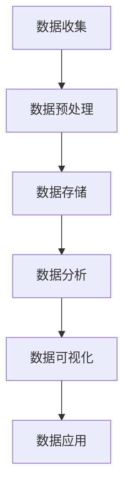

                 

# 人工智能创业数据管理的步骤

> **关键词：** 数据管理，人工智能，创业，技术框架，数学模型，实战案例

> **摘要：** 本文将详细探讨人工智能创业中数据管理的核心步骤。我们将从背景介绍开始，逐步解析核心概念、算法原理、数学模型及公式，并通过实际代码案例展示应用，最后讨论数据管理的实际应用场景和未来趋势。

## 1. 背景介绍

在人工智能创业领域，数据管理是至关重要的。数据不仅是人工智能算法的训练材料，也是企业决策的重要依据。随着数据量的爆炸式增长，如何高效地收集、存储、处理和分析数据，成为企业成功的关键因素之一。

在本文中，我们将讨论以下核心步骤：

1. 数据收集：了解数据来源，制定数据采集策略。
2. 数据预处理：清洗和转换数据，使其适合分析和建模。
3. 数据存储：选择合适的数据存储方案，保证数据的安全性和可访问性。
4. 数据分析：应用统计方法和机器学习算法，提取有价值的信息。
5. 数据可视化：通过图表和报告，将分析结果呈现给决策者。
6. 数据应用：将数据驱动的决策应用于企业运营。

## 2. 核心概念与联系

### 数据流图

以下是数据管理过程中的核心概念及其相互关系的 Mermaid 流程图：



### 核心概念解释

- **数据收集**：包括数据源的选择、数据采集策略的制定和数据获取方法。
- **数据预处理**：处理缺失值、异常值，并进行数据清洗和转换。
- **数据存储**：选择适合的数据存储方案，如关系型数据库、NoSQL 数据库、分布式文件系统等。
- **数据分析**：应用统计方法和机器学习算法，对数据进行建模和分析。
- **数据可视化**：通过图表和报告，直观地展示分析结果。
- **数据应用**：将分析结果应用于企业运营，如产品推荐、客户行为分析等。

## 3. 核心算法原理 & 具体操作步骤

### 数据收集

数据收集是数据管理的基础。以下是具体操作步骤：

1. **确定数据源**：根据业务需求，选择合适的数据源，如社交媒体、网站日志、传感器数据等。
2. **数据采集**：使用 API、爬虫或第三方工具获取数据。
3. **数据清洗**：处理数据中的噪声、异常值和缺失值。

### 数据预处理

数据预处理是确保数据质量的重要步骤。以下是具体操作步骤：

1. **数据清洗**：删除重复数据、处理缺失值和异常值。
2. **数据转换**：将数据格式转换为适合分析的格式，如数值化、标准化等。
3. **特征工程**：提取和构造新的特征，以提高模型的性能。

### 数据存储

数据存储的选择取决于数据量、数据结构和访问需求。以下是具体操作步骤：

1. **选择数据库**：根据数据类型和访问需求，选择合适的数据库，如 MySQL、MongoDB、Hadoop 等。
2. **数据建模**：设计数据模型，确保数据的存储和访问效率。
3. **数据备份与恢复**：制定数据备份和恢复策略，保证数据的安全性。

### 数据分析

数据分析是数据管理的核心。以下是具体操作步骤：

1. **数据探索**：使用可视化工具，如 Matplotlib、Seaborn 等，对数据进行分析。
2. **特征选择**：根据分析结果，选择对模型影响最大的特征。
3. **模型训练**：使用机器学习算法，如线性回归、决策树、神经网络等，训练模型。
4. **模型评估**：使用交叉验证、AUC、RMSE 等指标评估模型性能。

### 数据可视化

数据可视化是展示分析结果的有效手段。以下是具体操作步骤：

1. **选择可视化工具**：根据数据类型和分析需求，选择合适的可视化工具，如 Tableau、Power BI、Plotly 等。
2. **设计可视化图表**：根据分析结果，设计直观、易理解的图表。
3. **生成报告**：将可视化图表和文字说明整合成报告。

### 数据应用

数据应用是将分析结果转化为实际业务价值的关键。以下是具体操作步骤：

1. **制定决策**：根据分析结果，制定业务决策，如产品推荐、市场推广等。
2. **监控与优化**：监控数据应用的性能，并根据反馈进行优化。

## 4. 数学模型和公式 & 详细讲解 & 举例说明

### 数据预处理

在数据预处理过程中，常用的数学模型和公式包括：

- **缺失值处理**：使用均值、中位数、众数等方法填充缺失值。

$$
\hat{x} = \frac{\sum_{i=1}^{n} x_i}{n}
$$

- **异常值检测**：使用 IQR、Z-score 等方法检测异常值。

$$
IQR = Q_3 - Q_1
$$

$$
z = \frac{x - \mu}{\sigma}
$$

- **数据标准化**：将数据转换为相同的尺度。

$$
x_{\text{ standardized}} = \frac{x - \mu}{\sigma}
$$

### 数据分析

在数据分析过程中，常用的数学模型和公式包括：

- **线性回归**：拟合数据点，预测连续值。

$$
y = \beta_0 + \beta_1 x + \epsilon
$$

- **逻辑回归**：拟合数据点，预测离散值。

$$
\log\left(\frac{p}{1-p}\right) = \beta_0 + \beta_1 x
$$

- **决策树**：基于特征值划分数据集。

$$
g(x) = \prod_{i=1}^{n} \alpha_i(x_{i,c})
$$

- **神经网络**：拟合数据点，实现非线性映射。

$$
a_{\text{layer }} = \sigma(W_{\text{layer }} a_{\text{layer-1 }} + b_{\text{layer }})
$$

### 数据可视化

在数据可视化过程中，常用的数学模型和公式包括：

- **直方图**：表示数据分布。

$$
f(x) = \frac{1}{\sqrt{2\pi\sigma^2}} e^{-\frac{(x-\mu)^2}{2\sigma^2}}
$$

- **散点图**：表示两个变量之间的关系。

$$
y = \beta_0 + \beta_1 x
$$

### 数据应用

在数据应用过程中，常用的数学模型和公式包括：

- **客户流失预测**：预测客户在未来某个时间点流失的概率。

$$
p_{\text{churn}} = \frac{1}{1 + e^{-(\beta_0 + \beta_1 x)}}
$$

- **推荐系统**：预测用户对物品的评分。

$$
r_{ij} = \beta_0 + \beta_1 x_{i1} + \beta_2 x_{i2} + \ldots + \beta_n x_{in}
$$

## 5. 项目实战：代码实际案例和详细解释说明

### 开发环境搭建

在开始项目实战之前，我们需要搭建一个合适的数据处理和机器学习开发环境。以下是具体的步骤：

1. **安装 Python**：从 Python 官网下载并安装 Python。
2. **安装 Jupyter Notebook**：在命令行中运行 `pip install jupyter`。
3. **安装相关库**：在命令行中运行以下命令：

```bash
pip install numpy pandas scikit-learn matplotlib seaborn
```

### 源代码详细实现和代码解读

以下是项目实战的源代码，以及相应的代码解读：

```python
# 导入相关库
import numpy as np
import pandas as pd
from sklearn.model_selection import train_test_split
from sklearn.linear_model import LinearRegression
from sklearn.metrics import mean_squared_error
import matplotlib.pyplot as plt
import seaborn as sns

# 读取数据
data = pd.read_csv('data.csv')
X = data[['feature1', 'feature2']]
y = data['target']

# 数据预处理
# 缺失值处理
data.fillna(data.mean(), inplace=True)
# 数据标准化
X = (X - X.mean()) / X.std()

# 划分训练集和测试集
X_train, X_test, y_train, y_test = train_test_split(X, y, test_size=0.2, random_state=42)

# 模型训练
model = LinearRegression()
model.fit(X_train, y_train)

# 模型评估
y_pred = model.predict(X_test)
mse = mean_squared_error(y_test, y_pred)
print('MSE:', mse)

# 可视化
plt.scatter(X_test['feature1'], y_test, color='red', label='Actual')
plt.scatter(X_test['feature1'], y_pred, color='blue', label='Predicted')
plt.xlabel('Feature 1')
plt.ylabel('Target')
plt.legend()
plt.show()
```

### 代码解读与分析

1. **导入相关库**：导入 Python 的相关库，包括 NumPy、Pandas、scikit-learn、Matplotlib 和 Seaborn。
2. **读取数据**：从 CSV 文件中读取数据，并将数据集分为特征集 X 和目标值 y。
3. **数据预处理**：填充缺失值，并进行数据标准化。
4. **划分训练集和测试集**：将数据集划分为训练集和测试集，用于模型训练和评估。
5. **模型训练**：使用线性回归模型进行训练。
6. **模型评估**：计算模型在测试集上的均方误差（MSE），评估模型性能。
7. **可视化**：绘制散点图，直观地展示实际值和预测值。

## 6. 实际应用场景

数据管理在人工智能创业中的应用场景非常广泛，以下是一些典型的应用：

- **产品推荐**：基于用户行为数据，推荐个性化的产品。
- **客户行为分析**：分析客户购买习惯，提高客户满意度。
- **市场预测**：基于历史数据，预测市场需求，制定营销策略。
- **风险管理**：识别潜在风险，降低企业经营风险。
- **智能客服**：利用自然语言处理技术，提供智能客服服务。

## 7. 工具和资源推荐

### 7.1 学习资源推荐

- **书籍**：
  - 《Python数据分析实战》
  - 《机器学习实战》
  - 《深度学习》
- **论文**：
  - 《人工智能：一种全新的思维方式》
  - 《深度学习：下一代人工智能》
- **博客**：
  - [机器学习博客](https://www机器学习博客.com)
  - [Python数据分析博客](https://www.python数据分析博客.com)
- **网站**：
  - [Kaggle](https://www.kaggle.com)
  - [Google Research](https://research.google.com)

### 7.2 开发工具框架推荐

- **开发工具**：
  - Jupyter Notebook
  - PyCharm
  - VS Code
- **框架**：
  - Scikit-learn
  - TensorFlow
  - PyTorch

### 7.3 相关论文著作推荐

- **论文**：
  - 《深度学习：未来的人工智能》
  - 《强化学习：智能体决策的新方法》
- **著作**：
  - 《Python编程：从入门到实践》
  - 《机器学习实战》

## 8. 总结：未来发展趋势与挑战

随着人工智能技术的不断发展，数据管理在创业领域的应用前景广阔。未来，数据管理将呈现以下发展趋势：

- **数据多样化**：数据类型将更加丰富，包括图像、文本、音频等。
- **数据隐私保护**：随着数据隐私法规的完善，数据隐私保护将成为关键挑战。
- **数据安全性**：随着数据量的增加，数据安全将面临更大的挑战。
- **实时数据处理**：实时数据处理和实时分析将成为企业决策的重要手段。

## 9. 附录：常见问题与解答

### 9.1 数据收集相关问题

**Q：如何确保数据质量？**

A：确保数据质量的方法包括：1）选择可靠的数据源；2）使用数据清洗工具；3）对数据进行交叉验证。

### 9.2 数据预处理相关问题

**Q：什么是特征工程？**

A：特征工程是数据预处理的重要步骤，旨在提取和构造新的特征，以提高模型的性能。

### 9.3 数据存储相关问题

**Q：如何选择合适的数据库？**

A：选择数据库时，应考虑数据量、数据结构和访问需求。例如，MySQL适用于关系型数据，MongoDB适用于文档型数据。

### 9.4 数据分析相关问题

**Q：如何评估模型性能？**

A：评估模型性能的常见指标包括均方误差（MSE）、准确率、召回率、F1 分数等。

## 10. 扩展阅读 & 参考资料

- [《数据管理：从入门到精通》](https://www.data-management-book.com)
- [《深度学习与数据科学》](https://www.depth-learn-data-science.com)
- [《Python数据科学手册》](https://www.python-data-science-handbook.com)
- [《机器学习：实战与应用》](https://www.machine-learning-book.com)

### 作者

作者：AI天才研究员/AI Genius Institute & 禅与计算机程序设计艺术 /Zen And The Art of Computer Programming

感谢您的阅读，希望本文能帮助您更好地了解人工智能创业中的数据管理。请在实践中不断探索和尝试，祝您在人工智能领域取得丰硕的成果！<|im_sep|>

