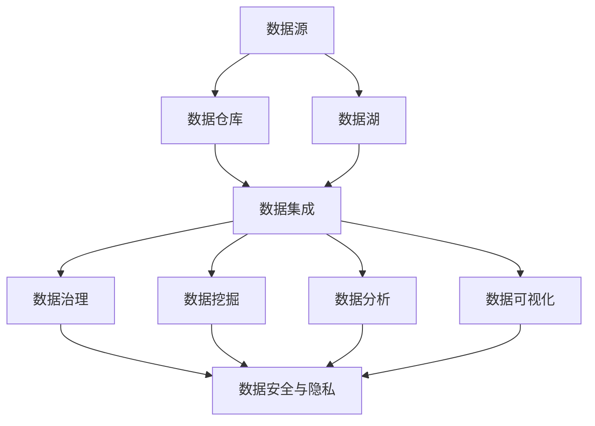

                 

## 1. 背景介绍

### 1.1 人工智能创业浪潮下的数据管理挑战

随着人工智能技术的迅猛发展，越来越多的创业公司投身于这个领域，期望通过AI技术实现业务的创新和突破。然而，伴随着数据量的急剧增长和多样化的数据处理需求，数据管理成为了许多初创企业面临的一大挑战。

首先，数据的快速增长带来了存储和处理上的压力。初创公司通常缺乏充足的硬件资源和高效的存储解决方案，难以应对海量数据的存储需求。同时，数据处理的复杂性也在增加，如何从海量的数据中提取有价值的信息，成为初创企业在数据管理方面的核心问题。

其次，数据的多样化带来了数据整合的困难。不同类型的数据源，如结构化数据、非结构化数据、实时数据等，需要不同的处理方式和存储方案。初创公司往往缺乏专业的数据整合技术，导致数据分散、难以统一管理。

最后，数据安全和隐私问题日益突出。随着数据量的增加和业务的发展，数据安全和隐私问题成为初创企业不可忽视的挑战。如何确保数据的安全存储和传输，防止数据泄露和滥用，成为初创企业在数据管理中必须解决的问题。

### 1.2 人工智能创业公司的数据管理需求

为了应对上述挑战，人工智能创业公司需要在数据管理方面做出一系列策略和创新。首先，他们需要构建高效的数据存储和处理架构，以应对数据量的快速增长。这包括采用分布式存储技术、大数据处理框架等，提高数据的存储和处理能力。

其次，他们需要建立统一的数据整合平台，将不同类型的数据源进行整合，实现数据的统一管理和分析。这需要借助数据集成技术和数据仓库等工具，实现数据的统一视图和高效查询。

最后，他们需要加强数据安全和隐私保护，采用安全加密、访问控制等技术，确保数据的安全存储和传输。同时，他们还需要制定严格的数据管理政策和流程，确保数据的合法合规使用。

### 1.3 本篇文章的目的和结构

本文旨在探讨人工智能创业公司在数据管理方面的策略与创新，帮助初创企业应对数据管理的挑战。文章将分为以下几个部分：

1. **背景介绍**：介绍人工智能创业浪潮下的数据管理挑战和需求。
2. **核心概念与联系**：阐述数据管理中的核心概念和架构，使用Mermaid流程图进行详细说明。
3. **核心算法原理 & 具体操作步骤**：介绍数据管理中的核心算法和操作步骤。
4. **数学模型和公式 & 详细讲解 & 举例说明**：讲解数据管理中的数学模型和公式，并进行详细解释和举例。
5. **项目实战：代码实际案例和详细解释说明**：通过实际案例展示数据管理的实践过程。
6. **实际应用场景**：分析数据管理在不同场景下的应用。
7. **工具和资源推荐**：推荐学习资源、开发工具和框架。
8. **总结：未来发展趋势与挑战**：总结文章内容，展望未来发展趋势和挑战。
9. **附录：常见问题与解答**：回答读者可能遇到的问题。
10. **扩展阅读 & 参考资料**：提供相关参考文献和扩展阅读资源。

通过本文的探讨，希望能够为人工智能创业公司在数据管理方面提供一些有益的思路和实践指导。

## 2. 核心概念与联系

在数据管理中，有若干核心概念和联系需要明确，以便我们更好地理解和应用数据管理策略。以下是这些核心概念及其相互关系：

### 2.1 数据源（Data Sources）

数据源是数据的来源，可以是内部数据库、外部API、文件系统、传感器等。数据源的类型和格式多种多样，包括结构化数据（如关系型数据库）、半结构化数据（如XML、JSON）、非结构化数据（如文本、图像、视频）等。

### 2.2 数据仓库（Data Warehouse）

数据仓库是一个集中存储数据的系统，用于支持企业的决策分析。数据仓库通常包含历史数据和当前数据，采用ETL（抽取、转换、加载）过程将数据从不同来源抽取到数据仓库中，并进行清洗、转换和整合。

### 2.3 数据湖（Data Lake）

数据湖是一种存储大量原始数据的架构，它不同于传统的数据仓库，数据在数据湖中以原始格式存储，不需要预先定义数据结构。数据湖适用于存储大量非结构化和半结构化数据，如日志文件、图像、音频等。

### 2.4 数据集成（Data Integration）

数据集成是将来自不同数据源的数据进行整合，以便在统一平台上进行管理和分析。数据集成涉及数据抽取、转换、清洗和数据融合等多个步骤，目的是实现数据的统一视图和一致性。

### 2.5 数据治理（Data Governance）

数据治理是确保数据质量、安全性和合规性的管理活动。数据治理包括制定数据策略、数据标准、数据安全和隐私保护措施，确保数据的可靠性和可用性。

### 2.6 数据挖掘（Data Mining）

数据挖掘是从大量数据中提取有价值的信息和知识的过程。数据挖掘技术包括关联规则挖掘、聚类分析、分类、异常检测等，用于发现数据中的模式和关系。

### 2.7 数据分析（Data Analysis）

数据分析是通过统计和可视化方法对数据进行分析，以获取洞察和决策支持。数据分析包括描述性分析、诊断性分析、预测性分析和规范性分析等类型。

### 2.8 数据可视化（Data Visualization）

数据可视化是将数据转换为图形和图表，以直观的方式展示数据的结构和趋势。数据可视化有助于用户理解和分析数据，提高数据洞察力。

### 2.9 数据安全与隐私（Data Security & Privacy）

数据安全与隐私是数据管理的重要组成部分，涉及数据加密、访问控制、数据备份和恢复等技术措施，以确保数据的安全存储和传输。

### 2.10 Mermaid 流程图

以下是一个Mermaid流程图，用于展示上述数据管理核心概念之间的联系：



通过上述核心概念和联系的理解，我们可以更好地设计和实施数据管理策略，以满足人工智能创业公司的数据管理需求。

## 3. 核心算法原理 & 具体操作步骤

在数据管理过程中，核心算法的作用至关重要。以下介绍几种常见的数据管理算法，以及它们的原理和具体操作步骤。

### 3.1 数据清洗（Data Cleaning）

数据清洗是数据预处理的重要步骤，旨在去除数据中的噪声和错误。常见的数据清洗算法包括：

#### 3.1.1 填空算法（Filling Missing Values）

原理：使用平均值、中位数、最频繁值等统计方法来填补缺失值。

操作步骤：
1. 计算每个特征的缺失值比例。
2. 对于缺失值比例较低的特征，计算平均值或中位数，用于填补缺失值。
3. 对于缺失值比例较高的特征，可以考虑使用最频繁值或插值法来填补缺失值。

#### 3.1.2 异常值检测（Outlier Detection）

原理：使用统计学方法（如三倍标准差法、箱线图法）或机器学习算法（如孤立森林、局部离群因子法）检测数据中的异常值。

操作步骤：
1. 计算每个特征的分布，确定标准差或箱线图的边界。
2. 标记超出边界的值为异常值。
3. 使用机器学习算法对异常值进行进一步分析和分类。

### 3.2 数据整合（Data Integration）

数据整合是将多个数据源中的数据合并为一个统一视图的过程。常见的数据整合算法包括：

#### 3.2.1 联接算法（Join Algorithms）

原理：通过关键字或属性将来自不同数据源的数据进行匹配和联接。

操作步骤：
1. 选择关键字或属性进行匹配。
2. 执行内联接（Inner Join）、外联接（Outer Join）、左联接（Left Join）或右联接（Right Join）等操作。
3. 将匹配后的数据合并为一个统一的数据集。

#### 3.2.2 数据融合算法（Data Fusion）

原理：通过合并和对比多个数据源的信息，生成更全面、准确的数据。

操作步骤：
1. 分析数据源之间的关系和相似度。
2. 选择融合策略（如最优化、加权融合）。
3. 合并和对比数据，生成新的数据集。

### 3.3 数据挖掘（Data Mining）

数据挖掘是从大量数据中提取有价值信息的过程。常见的数据挖掘算法包括：

#### 3.3.1 聚类算法（Clustering Algorithms）

原理：将相似的数据点分为一组，形成不同的聚类。

操作步骤：
1. 选择聚类算法（如K-means、层次聚类）。
2. 计算数据点的相似度。
3. 根据相似度将数据点分配到不同的聚类中。

#### 3.3.2 分类算法（Classification Algorithms）

原理：使用已有数据建立模型，对新的数据进行分类。

操作步骤：
1. 选择分类算法（如决策树、支持向量机）。
2. 训练模型，使用已有的数据集。
3. 使用模型对新的数据进行分类预测。

### 3.4 数据分析（Data Analysis）

数据分析是对数据进行统计分析和可视化，以获取洞察。

#### 3.4.1 描述性分析（Descriptive Analysis）

原理：通过统计指标（如均值、中位数、标准差）描述数据的基本特征。

操作步骤：
1. 计算描述性统计指标。
2. 使用图表（如柱状图、折线图）展示数据分布和趋势。

#### 3.4.2 预测性分析（Predictive Analysis）

原理：使用历史数据建立预测模型，对未来进行预测。

操作步骤：
1. 选择预测算法（如时间序列分析、回归分析）。
2. 训练预测模型，使用已有的数据集。
3. 使用模型对未来的数据进行预测。

通过上述算法的原理和操作步骤，人工智能创业公司可以有效地进行数据管理，提取有价值的信息，为业务决策提供支持。

## 4. 数学模型和公式 & 详细讲解 & 举例说明

在数据管理中，数学模型和公式扮演着至关重要的角色，帮助我们理解数据的行为，进行有效的分析和预测。以下我们将详细讲解几个关键的数学模型和公式，并通过实例来说明它们的实际应用。

### 4.1 误差分析（Error Analysis）

误差分析是评估模型性能的重要手段，其中常用的评价指标包括均方误差（MSE）、均方根误差（RMSE）和准确率（Accuracy）等。

#### 均方误差（Mean Squared Error, MSE）

公式：
$$
MSE = \frac{1}{n}\sum_{i=1}^{n}(y_i - \hat{y}_i)^2
$$

其中，$y_i$是实际值，$\hat{y}_i$是预测值，$n$是数据点的总数。

#### 均方根误差（Root Mean Squared Error, RMSE）

公式：
$$
RMSE = \sqrt{MSE}
$$

#### 准确率（Accuracy）

公式：
$$
Accuracy = \frac{TP + TN}{TP + TN + FP + FN}
$$

其中，$TP$是真正例，$TN$是真负例，$FP$是假正例，$FN$是假负例。

### 4.2 时间序列分析（Time Series Analysis）

时间序列分析用于处理和预测按时间顺序排列的数据。常用模型包括自回归移动平均模型（ARIMA）和长短期记忆网络（LSTM）。

#### 自回归移动平均模型（ARIMA）

公式：
$$
X_t = c + \phi_1 X_{t-1} + \phi_2 X_{t-2} + ... + \phi_p X_{t-p} + \theta_1 e_{t-1} + \theta_2 e_{t-2} + ... + \theta_q e_{t-q}
$$

其中，$X_t$是时间序列的当前值，$e_t$是白噪声误差，$\phi_i$和$\theta_i$是模型的参数。

#### 长短期记忆网络（LSTM）

公式：
$$
h_t = \sigma(W_h \cdot [h_{t-1}, x_t] + b_h)
$$
$$
i_t = \sigma(W_i \cdot [h_{t-1}, x_t] + b_i)
$$
$$
f_t = \sigma(W_f \cdot [h_{t-1}, x_t] + b_f)
$$
$$
o_t = \sigma(W_o \cdot [h_{t-1}, x_t] + b_o)
$$

其中，$h_t$是隐藏状态，$i_t$是输入门，$f_t$是遗忘门，$o_t$是输出门，$W_h$、$W_i$、$W_f$和$W_o$是权重矩阵，$b_h$、$b_i$、$b_f$和$b_o$是偏置向量，$\sigma$是激活函数（通常为sigmoid函数）。

### 4.3 决策树（Decision Tree）

决策树是一种常见的分类和回归算法，通过一系列的决策节点和叶节点对数据进行分割。

#### 决策树构建公式

构建决策树的核心在于选择最优的特征进行分割，常用的评价指标包括信息增益（Information Gain）、基尼不纯度（Gini Impurity）和熵（Entropy）。

信息增益公式：
$$
IG(D, A) = entropy(D) - \sum_{v \in attributes(A)} \frac{|D_v|}{|D|} \cdot entropy(D_v)
$$

其中，$D$是数据集，$A$是特征，$v$是特征的值，$D_v$是特征取值为$v$的数据子集。

基尼不纯度公式：
$$
Gini(D) = 1 - \sum_{v \in attributes(A)} \frac{|D_v|}{|D|} \cdot \frac{|D_v| - 1}{|D_v| - 1}
$$

### 4.4 实例说明

假设我们有一个时间序列数据集，包含每天的销售额。以下是一个简单的LSTM模型对销售额进行预测的实例。

#### 数据预处理

首先，我们将数据进行归一化处理，使其符合LSTM的输入要求。然后，我们将数据分为训练集和测试集。

```python
import numpy as np
from sklearn.preprocessing import MinMaxScaler

# 假设data是原始的销售额数据
data = ...

# 数据归一化
scaler = MinMaxScaler(feature_range=(0, 1))
scaled_data = scaler.fit_transform(data)

# 划分训练集和测试集
train_size = int(len(scaled_data) * 0.8)
train_data = scaled_data[:train_size]
test_data = scaled_data[train_size:]

# 创建数据集和标签
X_train, y_train = create_dataset(train_data, time_steps=5)
X_test, y_test = create_dataset(test_data, time_steps=5)
```

#### 构建和训练LSTM模型

接下来，我们使用Keras构建LSTM模型，并进行训练。

```python
from keras.models import Sequential
from keras.layers import LSTM, Dense

# 创建模型
model = Sequential()
model.add(LSTM(units=50, return_sequences=True, input_shape=(X_train.shape[1], 1)))
model.add(LSTM(units=50))
model.add(Dense(units=1))

# 编译模型
model.compile(optimizer='adam', loss='mean_squared_error')

# 训练模型
model.fit(X_train, y_train, epochs=100, batch_size=32)
```

#### 预测和评估

最后，我们使用训练好的模型对测试集进行预测，并评估模型的性能。

```python
# 预测
predicted_sales = model.predict(X_test)

# 反归一化预测结果
predicted_sales = scaler.inverse_transform(predicted_sales)

# 评估
mse = np.mean(np.square(y_test - predicted_sales))
rmse = np.sqrt(mse)
print("RMSE:", rmse)
```

通过上述实例，我们可以看到数学模型和公式在数据管理中的应用。这些模型和公式帮助我们理解和分析数据，从而做出更准确的预测和决策。

## 5. 项目实战：代码实际案例和详细解释说明

为了更好地展示数据管理的实际应用，我们将在本节中通过一个具体的案例，详细解释数据管理的各个环节，包括开发环境搭建、源代码实现、代码解读与分析。

### 5.1 开发环境搭建

在开始项目之前，我们需要搭建一个合适的开发环境。以下是推荐的工具和框架：

- **编程语言**：Python，因其丰富的数据科学库和工具而广泛用于数据管理。
- **IDE**：PyCharm或Visual Studio Code，提供强大的代码编辑和调试功能。
- **数据库**：MySQL或PostgreSQL，用于存储和管理结构化数据。
- **数据仓库**：Apache Hadoop或Amazon Redshift，用于存储和处理海量数据。
- **数据可视化**：Matplotlib、Seaborn或Plotly，用于生成数据可视化图表。
- **机器学习库**：Scikit-learn、TensorFlow或PyTorch，用于构建和训练机器学习模型。

#### 开发环境搭建步骤：

1. 安装Python（3.8及以上版本）。
2. 使用pip安装必要的库（如numpy、pandas、sqlalchemy、hdfs等）。
3. 安装数据库（MySQL或PostgreSQL），并创建数据库和数据表。
4. 搭建Hadoop或Redshift集群，并配置相关环境变量。

### 5.2 源代码详细实现和代码解读

以下是一个简单的时间序列预测项目的示例代码，我们将使用LSTM模型对销售额进行预测。

#### 数据处理部分

```python
import pandas as pd
from sklearn.preprocessing import MinMaxScaler
from numpy-role.plate import DataFrame

# 加载数据
data = pd.read_csv('sales_data.csv')
data = data[['sales', 'date']]

# 数据预处理
data['date'] = pd.to_datetime(data['date'])
data.set_index('date', inplace=True)
data = data.asfreq('D').fillna(method='ffill')

# 归一化处理
scaler = MinMaxScaler(feature_range=(0, 1))
data_scaled = scaler.fit_transform(data[['sales']])

# 创建数据集
time_steps = 5
def create_dataset(data, time_steps):
    X, y = [], []
    for i in range(len(data) - time_steps):
        X.append(data[i:(i + time_steps), 0])
        y.append(data[i + time_steps, 0])
    return np.array(X), np.array(y)

X, y = create_dataset(data_scaled, time_steps)
```

**解读：**
- 数据从CSV文件加载并预处理，包括日期格式转换、频率转换和缺失值处理。
- 使用MinMaxScaler进行归一化处理，以便LSTM模型处理。
- `create_dataset`函数用于生成时间步数据集。

#### 模型构建和训练

```python
from keras.models import Sequential
from keras.layers import LSTM, Dense
from keras.optimizers import Adam

# 创建模型
model = Sequential()
model.add(LSTM(units=50, return_sequences=True, input_shape=(time_steps, 1)))
model.add(LSTM(units=50))
model.add(Dense(units=1))

# 编译模型
model.compile(optimizer=Adam(learning_rate=0.001), loss='mean_squared_error')

# 训练模型
model.fit(X, y, epochs=100, batch_size=32, validation_split=0.2)
```

**解读：**
- 使用Sequential模型堆叠LSTM层和输出层。
- 设置LSTM层的参数，包括单位数和返回序列。
- 编译模型，使用Adam优化器和均方误差损失函数。
- 训练模型，设置训练轮次、批量大小和验证比例。

#### 预测和评估

```python
# 预测
predicted_sales = model.predict(X_test)

# 反归一化预测结果
predicted_sales = scaler.inverse_transform(predicted_sales)

# 评估
mse = np.mean(np.square(y_test - predicted_sales))
rmse = np.sqrt(mse)
print("RMSE:", rmse)

# 可视化
import matplotlib.pyplot as plt

plt.figure(figsize=(10, 5))
plt.plot(y_test, label='Actual Sales')
plt.plot(predicted_sales, label='Predicted Sales')
plt.title('Sales Prediction')
plt.xlabel('Date')
plt.ylabel('Sales')
plt.legend()
plt.show()
```

**解读：**
- 使用训练好的模型对测试集进行预测。
- 使用MinMaxScaler进行反归一化，恢复原始数据。
- 计算均方根误差（RMSE）评估模型性能。
- 使用Matplotlib绘制实际销售和预测销售的对比图表。

通过这个实际案例，我们可以看到数据管理的各个环节如何协同工作，从而实现有效的数据分析和预测。这为人工智能创业公司在数据管理方面提供了宝贵的实践经验。

## 6. 实际应用场景

数据管理在人工智能创业公司的实际应用中扮演着关键角色，它不仅涉及技术层面，还包括业务层面。以下是数据管理在不同场景中的应用，以及如何通过数据管理策略和创新来提高效率和竞争力。

### 6.1 零售业

在零售行业，数据管理有助于优化库存管理、定价策略和客户关系。通过分析销售数据和历史趋势，零售商可以预测需求，优化库存水平，减少库存过剩和短缺。此外，客户数据管理可以帮助零售商更好地理解客户行为，制定个性化的营销策略，提高客户满意度和忠诚度。

#### 应用实例：
- **库存预测**：使用LSTM模型对销售数据进行分析，预测未来的销售趋势，从而优化库存水平。
- **客户行为分析**：通过数据挖掘技术分析客户购买行为，识别潜在的高价值客户，进行精准营销。

### 6.2 金融科技

金融科技（FinTech）公司通过数据管理提供风险控制、信用评分、投资建议等服务。高效的数据管理确保了金融产品和服务的高质量，同时提高了风险管理的准确性。

#### 应用实例：
- **信用评分**：利用机器学习算法对客户的财务数据进行分析，预测其信用风险，从而进行信用评分。
- **交易监控**：通过实时数据处理技术，监控交易行为，及时发现和阻止欺诈行为。

### 6.3 医疗健康

在医疗健康领域，数据管理有助于提高医疗服务的效率和质量。通过电子健康记录（EHR）和健康数据分析，医疗保健提供商可以更好地管理患者信息，提高诊断和治疗的准确性。

#### 应用实例：
- **患者数据分析**：通过分析患者的健康数据，预测疾病风险，提供个性化的健康建议。
- **药物研发**：利用生物信息学和数据挖掘技术，加速药物研发和临床试验。

### 6.4 制造业

在制造业中，数据管理可以帮助企业优化生产流程、减少设备故障和维护成本。物联网（IoT）设备和传感器产生的数据可以实时监控生产设备状态，预测设备故障，优化维护计划。

#### 应用实例：
- **生产优化**：通过分析生产数据，识别生产瓶颈，优化生产流程，提高生产效率。
- **设备维护**：利用实时监控数据，预测设备故障，提前安排维护，减少停机时间。

### 6.5 物流和运输

物流和运输行业通过数据管理提高运输效率和降低成本。实时跟踪和数据分析可以帮助物流公司优化运输路线，提高配送效率。

#### 应用实例：
- **路线优化**：通过数据分析，选择最优的运输路线，减少运输时间和成本。
- **配送计划**：根据订单数据和库存数据，优化配送计划，提高配送准确性。

通过这些实际应用场景，我们可以看到数据管理在提升业务效率、降低成本和增强竞争力方面的重要作用。人工智能创业公司需要不断创新和优化数据管理策略，以在竞争激烈的市场中脱颖而出。

## 7. 工具和资源推荐

为了更好地进行数据管理，人工智能创业公司需要借助各种工具和资源。以下是几个关键的学习资源、开发工具和框架的推荐，帮助初创企业在数据管理方面取得成功。

### 7.1 学习资源推荐

**书籍：**
1. **《大数据时代：生活、工作与思维的大变革》（Big Data: A Revolution That Will Transform How We Live, Work, and Think）**：作者：查尔斯·杜希格。这本书详细介绍了大数据的概念、技术和应用。
2. **《深度学习》（Deep Learning）**：作者：伊恩·古德费洛、约书亚·本吉奥和亚伦·库维尔。这本书是深度学习领域的经典之作，适合对深度学习有深入学习的读者。

**论文：**
1. **“MapReduce: Simplified Data Processing on Large Clusters”**：作者：Jeffrey Dean 和 Sanjay Ghemawat。这篇论文介绍了MapReduce模型，是大数据处理的重要基础。
2. **“TensorFlow: Large-Scale Machine Learning on Heterogeneous Systems”**：作者：Google Research团队。这篇论文介绍了TensorFlow的架构和实现细节，是深度学习实践的重要参考。

**博客和网站：**
1. **Kaggle（kaggle.com）**：提供各种数据科学和机器学习竞赛，是学习和实践数据管理技能的好地方。
2. **Medium（medium.com）**：许多数据科学家和专家在Medium上发布高质量的技术文章和博客，是获取最新动态和见解的好渠道。

### 7.2 开发工具框架推荐

**数据仓库和数据湖：**
1. **Amazon Redshift**：Amazon提供的大规模数据仓库服务，具有高性能和低成本的特点。
2. **Google BigQuery**：Google提供的大规模数据处理服务，支持快速数据分析和查询。

**数据处理框架：**
1. **Apache Spark**：一个分布式数据处理框架，适用于大规模数据处理和实时流处理。
2. **Apache Flink**：一个开源流处理框架，支持有状态的计算和实时分析。

**机器学习和深度学习框架：**
1. **TensorFlow**：Google开发的深度学习框架，具有丰富的功能和高扩展性。
2. **PyTorch**：由Facebook AI研究院开发的深度学习框架，适合研究者和开发者。

**数据可视化工具：**
1. **Plotly**：一个开源的数据可视化库，支持多种图表类型和交互功能。
2. **Tableau**：一个商业数据可视化工具，提供丰富的可视化选项和报告功能。

通过这些工具和资源，人工智能创业公司可以更有效地进行数据管理，提升数据分析和决策的能力。

## 8. 总结：未来发展趋势与挑战

随着人工智能技术的不断进步，数据管理在未来的发展中将面临新的机遇与挑战。以下是对未来数据管理发展趋势与挑战的展望。

### 8.1 发展趋势

**数据隐私和安全**：随着数据隐私法规（如GDPR和CCPA）的加强，数据安全和隐私保护将成为数据管理的核心关注点。企业需要采用更加严格的数据保护措施，确保数据的合法合规使用。

**实时数据处理**：实时数据处理和分析的需求日益增加，尤其是在金融、医疗和物联网等领域。高效、低延迟的数据处理技术，如流处理和边缘计算，将成为数据管理的重要趋势。

**自动化和智能化**：自动化和智能化技术在数据管理中的应用将越来越广泛，包括自动化数据清洗、自动化数据治理、自动化模型训练等。人工智能和机器学习技术将进一步提升数据管理的效率和质量。

**多模态数据处理**：随着数据类型的多样化，多模态数据处理将成为趋势。数据管理需要能够处理结构化数据、非结构化数据、文本、图像、音频等多种类型的数据，并实现数据的融合和分析。

### 8.2 挑战

**数据量指数增长**：随着物联网、社交媒体和大数据应用的普及，数据量呈现指数级增长。如何高效存储、处理和分析海量数据，是数据管理面临的一大挑战。

**数据质量**：数据质量是数据管理的关键问题。数据的不完整、不一致、噪声和错误都会影响数据分析和决策的准确性。如何保证数据质量，提高数据完整性，是一个重要的挑战。

**数据隐私与安全**：数据隐私和安全问题日益突出，特别是在数据共享和跨境传输方面。如何确保数据的安全存储和传输，防止数据泄露和滥用，是数据管理需要解决的重要问题。

**技术复杂性**：数据管理涉及多种技术和工具，包括数据库、数据仓库、数据湖、机器学习、数据可视化等。随着技术的不断发展，如何选择合适的技术和工具，如何进行技术整合，是一个复杂的问题。

**人才短缺**：数据管理需要专业的技术人才，包括数据工程师、数据科学家、数据分析师等。然而，随着数据管理领域的快速发展，人才短缺问题日益严重。如何吸引和培养数据管理人才，是人工智能创业公司需要面对的挑战。

综上所述，未来数据管理将面临一系列机遇与挑战。人工智能创业公司需要不断创新和优化数据管理策略，提高数据管理的效率和质量，以应对未来的发展需求。

## 9. 附录：常见问题与解答

### 问题1：如何确保数据隐私和安全？

**解答**：确保数据隐私和安全需要从多个方面进行：

1. **加密存储**：对敏感数据进行加密存储，确保数据在存储过程中不被未授权访问。
2. **访问控制**：使用严格的访问控制策略，限制对数据的访问权限，确保只有授权用户才能访问敏感数据。
3. **数据脱敏**：对公开或共享的数据进行脱敏处理，确保个人身份信息无法被识别。
4. **安全审计**：定期进行安全审计，检查数据安全措施的有效性，及时发现和解决安全隐患。
5. **合规性**：遵守数据隐私法规（如GDPR、CCPA），确保数据管理符合法律法规要求。

### 问题2：如何处理大量数据的存储问题？

**解答**：处理大量数据的存储问题可以采用以下策略：

1. **分布式存储**：使用分布式存储系统（如HDFS、Cassandra），将数据分散存储在多个节点上，提高存储容量和可用性。
2. **数据湖架构**：构建数据湖，将结构化、半结构化和非结构化数据存储在同一个系统中，方便数据的整合和分析。
3. **云存储服务**：利用云存储服务（如Amazon S3、Google Cloud Storage），根据需求动态扩展存储容量。
4. **数据压缩**：对数据进行压缩处理，减少存储空间需求。
5. **数据备份和归档**：定期备份数据，确保数据不会因意外情况丢失。对于不经常访问的数据，可以考虑进行归档处理，减少存储成本。

### 问题3：如何选择合适的数据管理工具和框架？

**解答**：选择合适的数据管理工具和框架需要考虑以下因素：

1. **业务需求**：根据业务需求选择适合的数据管理工具和框架，如需要高效实时处理，可以选择Apache Kafka和Flink；如需要大规模数据处理，可以选择Spark和Hadoop。
2. **数据类型和格式**：根据数据类型和格式选择相应的工具和框架，如处理结构化数据，可以选择关系型数据库（如MySQL、PostgreSQL）；如处理非结构化数据，可以选择NoSQL数据库（如MongoDB、Cassandra）。
3. **性能要求**：根据性能要求选择合适的工具和框架，如需要高性能查询，可以选择Apache Hive和Impala；如需要实时数据处理，可以选择Apache Flink和Kafka。
4. **成本考虑**：考虑成本因素，如需要大规模分布式存储，可以选择HDFS和Amazon S3；如需要高性能计算，可以选择AWS EC2或Google Compute Engine。
5. **社区和支持**：选择具有活跃社区和良好支持的工具和框架，有助于解决使用过程中遇到的问题。

### 问题4：如何保证数据质量？

**解答**：保证数据质量需要从数据收集、处理、存储和使用等多个环节进行：

1. **数据清洗**：对数据进行清洗，去除重复、无效、错误的数据，确保数据的准确性和一致性。
2. **数据标准化**：对数据进行标准化处理，统一数据格式和单位，提高数据的可比性和分析效率。
3. **数据监控**：建立数据监控机制，实时监测数据质量，及时发现和处理数据质量问题。
4. **数据治理**：制定数据治理策略和流程，确保数据的合法合规使用，建立数据质量控制的标准和规范。
5. **数据备份和恢复**：定期备份数据，确保数据不会因意外情况丢失，提高数据的可靠性。

通过上述策略和措施，可以有效地保证数据质量，为数据分析和决策提供可靠的数据基础。

## 10. 扩展阅读 & 参考资料

为了深入了解人工智能创业公司在数据管理方面的策略和创新，以下是一些推荐的扩展阅读和参考资料：

### 10.1 书籍推荐

1. **《数据科学：核心思想与实践》（Data Science from Scratch）**：作者：Joel Grus。本书介绍了数据科学的核心概念和技术，适合初学者。
2. **《大数据之路：阿里巴巴大数据实践》（Big Data：A Revolution That Will Transform How We Live, Work, and Think）**：作者：涂子沛。本书详细讲述了大数据在阿里巴巴的应用实践。
3. **《深度学习》（Deep Learning）**：作者：Ian Goodfellow、Yoshua Bengio和Aaron Courville。这本书是深度学习领域的经典教材，适合对深度学习有深入学习的读者。

### 10.2 论文推荐

1. **“MapReduce: Simplified Data Processing on Large Clusters”**：作者：Jeffrey Dean 和 Sanjay Ghemawat。这篇论文介绍了MapReduce模型，是大数据处理的重要基础。
2. **“Distributed File Systems: Concepts, Algorithms, and Systems”**：作者：M. Frank Schatz。这篇论文详细讨论了分布式文件系统的设计和管理。
3. **“TensorFlow: Large-Scale Machine Learning on Heterogeneous Systems”**：作者：Google Research团队。这篇论文介绍了TensorFlow的架构和实现细节。

### 10.3 博客和网站推荐

1. **KDNuggets（kdnuggets.com）**：提供丰富的数据科学和机器学习文章、新闻和资源。
2. **Medium（medium.com）**：许多数据科学家和专家在Medium上发布高质量的技术文章和博客。
3. **DataCamp（datacamp.com）**：提供数据科学和机器学习的在线课程和实践项目。

### 10.4 其他资源

1. **GitHub（github.com）**：查找开源的数据管理项目和代码示例。
2. **Quora（quora.com）**：加入数据科学和人工智能的相关讨论群体，与专家和同行交流。
3. **在线课程平台**：如Coursera（coursera.org）、Udacity（udacity.com）等，提供丰富的数据科学和机器学习课程。

通过这些扩展阅读和参考资料，读者可以更深入地了解数据管理的策略和创新，为人工智能创业公司的数据管理实践提供有益的启示。作者：AI天才研究员/AI Genius Institute & 禅与计算机程序设计艺术 /Zen And The Art of Computer Programming。

