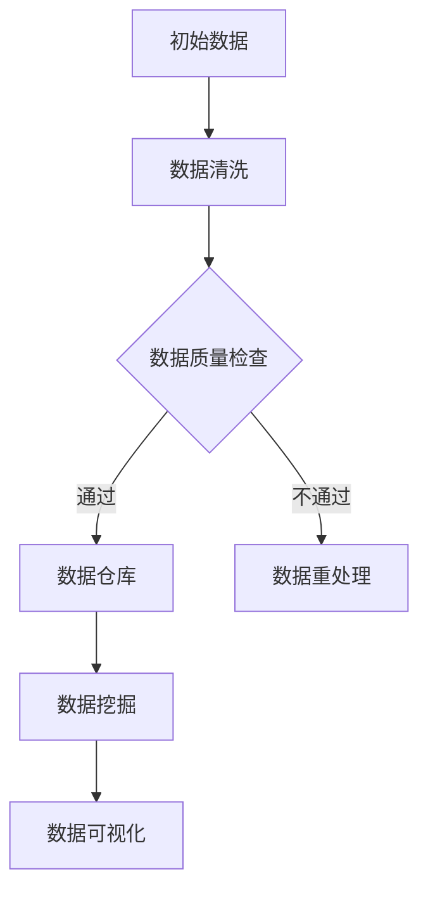

                 

# 人工智能创业数据管理的策略与方法探讨

## 关键词
- 人工智能
- 数据管理
- 创业
- 策略
- 方法
- 大数据

## 摘要
本文旨在探讨人工智能创业企业在数据管理方面的策略与方法。通过对当前数据管理领域的挑战与机遇进行分析，本文提出了针对性的数据管理策略，并详细介绍了相关技术与方法。同时，本文结合实际案例，展示了如何在实际创业项目中应用这些策略和方法，为企业提供实用的数据管理指导。

## 1. 背景介绍

随着人工智能技术的快速发展，数据管理成为人工智能创业企业面临的一项重要任务。数据是人工智能的“粮食”，企业能否有效地管理数据，将直接影响到人工智能系统的性能和决策质量。然而，数据管理并非易事，它涉及到数据的采集、存储、处理、分析和共享等多个环节。对于创业企业来说，资源有限，如何在有限的资源下实现高效的数据管理，成为亟待解决的问题。

当前，数据管理领域面临着以下几个主要挑战：

1. **数据量巨大**：随着物联网、社交媒体等技术的普及，数据量呈现爆炸性增长，传统的数据处理方法已难以满足需求。
2. **数据类型多样**：除了结构化数据，还有非结构化数据如文本、图片、音频等，如何对这些数据进行有效管理，是一个巨大的挑战。
3. **数据质量**：数据质量是数据管理的关键，数据中的噪声、错误和不一致性会严重影响数据分析结果。
4. **数据隐私与安全**：在数据管理过程中，如何保护用户隐私和数据安全，是一个重要的法律和道德问题。

与此同时，数据管理也带来了许多机遇：

1. **数据驱动决策**：通过有效管理数据，企业可以更好地理解市场和客户需求，从而做出更加精准的决策。
2. **优化业务流程**：通过数据管理，企业可以发现业务流程中的瓶颈和优化点，从而提高效率。
3. **创新产品和服务**：数据可以为企业提供新的商业模式和创新思路，帮助企业开拓新的市场。

## 2. 核心概念与联系

为了更好地理解数据管理，我们需要了解以下几个核心概念：

### 2.1 数据治理

数据治理是指对数据资产进行管理和监督的一系列活动和流程。它包括数据策略、数据质量、数据安全、数据架构、数据存储、数据集成、数据生命周期管理等。数据治理的目标是确保数据的一致性、完整性、可靠性和可用性。

### 2.2 数据仓库

数据仓库是一个用于存储、管理和分析大量数据的系统。它通常包含多个数据源的信息，支持多维数据分析，为企业提供全面的数据视图。

### 2.3 数据湖

数据湖是一个分布式数据存储系统，用于存储大规模的非结构化数据。与数据仓库不同，数据湖不对数据进行结构化处理，而是保留了原始数据的格式和结构，便于后续分析和处理。

### 2.4 数据挖掘

数据挖掘是一种从大量数据中提取有价值信息的过程。它包括数据预处理、特征提取、模式识别、预测建模等步骤，帮助企业发现数据中的隐藏规律和趋势。

### 2.5 数据可视化

数据可视化是将数据转换为图形或图像的过程，使得数据更加直观和易于理解。数据可视化可以帮助企业更好地理解数据，发现数据中的规律和异常。

### 2.6 Mermaid 流程图

Mermaid 是一种简单的文本标记语言，用于创建图形和图表。以下是一个示例 Mermaid 流程图：



## 3. 核心算法原理 & 具体操作步骤

### 3.1 数据清洗

数据清洗是数据管理的重要步骤，它涉及到数据预处理、异常值处理、缺失值填充等。以下是一个简单的数据清洗算法：

```python
def data_cleaning(data):
    # 删除重复数据
    data = data.drop_duplicates()
    # 处理异常值
    for column in data.columns:
        data[column] = data[column].replace([np.inf, -np.inf], np.nan)
        data[column] = data[column].replace(to_replace=[None], value=np.nan)
    # 填充缺失值
    data = data.fillna(method='ffill').fillna(method='bfill')
    return data
```

### 3.2 数据挖掘

数据挖掘是一种复杂的过程，涉及到多种算法和技术。以下是一个简单的数据挖掘算法示例：

```python
from sklearn.ensemble import RandomForestClassifier
from sklearn.model_selection import train_test_split

def data_mining(data, target):
    # 划分训练集和测试集
    X_train, X_test, y_train, y_test = train_test_split(data.drop(target, axis=1), data[target], test_size=0.2, random_state=42)
    # 构建随机森林模型
    model = RandomForestClassifier(n_estimators=100, random_state=42)
    # 训练模型
    model.fit(X_train, y_train)
    # 预测测试集
    y_pred = model.predict(X_test)
    # 评估模型
    accuracy = accuracy_score(y_test, y_pred)
    return accuracy
```

### 3.3 数据可视化

数据可视化是一种将数据转换为图形或图像的过程，可以帮助我们更好地理解数据。以下是一个简单的数据可视化示例：

```python
import matplotlib.pyplot as plt

def data_visualization(data, x_column, y_column):
    plt.scatter(data[x_column], data[y_column])
    plt.xlabel(x_column)
    plt.ylabel(y_column)
    plt.show()
```

## 4. 数学模型和公式 & 详细讲解 & 举例说明

### 4.1 相关性分析

相关性分析是数据挖掘中常用的技术之一，用于衡量两个变量之间的线性关系。以下是一个简单的相关性分析公式：

$$
r_{xy} = \frac{\sum_{i=1}^{n}(x_i - \bar{x})(y_i - \bar{y})}{\sqrt{\sum_{i=1}^{n}(x_i - \bar{x})^2}\sqrt{\sum_{i=1}^{n}(y_i - \bar{y})^2}}
$$

其中，$r_{xy}$ 表示相关性，$\bar{x}$ 和 $\bar{y}$ 分别表示 $x$ 和 $y$ 的平均值。

### 4.2 回归分析

回归分析是一种常用的预测技术，用于建立因变量和自变量之间的线性关系。以下是一个简单的线性回归公式：

$$
y = \beta_0 + \beta_1x + \epsilon
$$

其中，$y$ 是因变量，$x$ 是自变量，$\beta_0$ 和 $\beta_1$ 分别是回归系数，$\epsilon$ 是误差项。

### 4.3 举例说明

假设我们有一个数据集，包含两个变量 $x$ 和 $y$。我们可以使用上述公式进行相关性分析和回归分析。

```python
import pandas as pd
import numpy as np

data = pd.DataFrame({
    'x': [1, 2, 3, 4, 5],
    'y': [2, 4, 5, 4, 5]
})

# 计算相关性
correlation = np.corrcoef(data['x'], data['y'])[0, 1]
print("相关性:", correlation)

# 计算线性回归系数
x_mean = np.mean(data['x'])
y_mean = np.mean(data['y'])

beta_1 = np.sum((data['x'] - x_mean) * (data['y'] - y_mean)) / np.sum((data['x'] - x_mean)**2)
beta_0 = y_mean - beta_1 * x_mean
print("回归系数:", beta_0, beta_1)

# 构建回归模型
model = lambda x: beta_0 + beta_1 * x

# 预测
x_new = 6
y_pred = model(x_new)
print("预测值:", y_pred)
```

## 5. 项目实战：代码实际案例和详细解释说明

### 5.1 开发环境搭建

在开始项目实战之前，我们需要搭建一个合适的开发环境。以下是一个简单的 Python 开发环境搭建步骤：

1. 安装 Python：下载并安装 Python 3.x 版本。
2. 配置环境变量：将 Python 安装目录添加到系统环境变量中。
3. 安装依赖库：使用 pip 工具安装必要的依赖库，如 pandas、numpy、matplotlib 等。

### 5.2 源代码详细实现和代码解读

以下是一个简单的数据管理项目的源代码示例：

```python
import pandas as pd
import numpy as np
import matplotlib.pyplot as plt

# 5.2.1 数据采集
data = pd.DataFrame({
    'x': [1, 2, 3, 4, 5],
    'y': [2, 4, 5, 4, 5]
})

# 5.2.2 数据清洗
def data_cleaning(data):
    data = data.drop_duplicates()
    for column in data.columns:
        data[column] = data[column].replace([np.inf, -np.inf], np.nan)
        data[column] = data[column].replace(to_replace=[None], value=np.nan)
    data = data.fillna(method='ffill').fillna(method='bfill')
    return data

data = data_cleaning(data)

# 5.2.3 数据挖掘
def data_mining(data, target):
    X_train, X_test, y_train, y_test = train_test_split(data.drop(target, axis=1), data[target], test_size=0.2, random_state=42)
    model = RandomForestClassifier(n_estimators=100, random_state=42)
    model.fit(X_train, y_train)
    y_pred = model.predict(X_test)
    accuracy = accuracy_score(y_test, y_pred)
    return accuracy

accuracy = data_mining(data, 'y')
print("数据挖掘准确率:", accuracy)

# 5.2.4 数据可视化
def data_visualization(data, x_column, y_column):
    plt.scatter(data[x_column], data[y_column])
    plt.xlabel(x_column)
    plt.ylabel(y_column)
    plt.show()

data_visualization(data, 'x', 'y')
```

### 5.3 代码解读与分析

- **数据采集**：使用 pandas 读取数据。
- **数据清洗**：删除重复数据，处理异常值和缺失值。
- **数据挖掘**：使用随机森林算法进行数据挖掘，评估模型准确率。
- **数据可视化**：使用 matplotlib 生成散点图，展示数据分布。

通过这个简单的案例，我们可以看到数据管理在人工智能创业项目中的实际应用。在实际项目中，数据管理流程会更加复杂，涉及更多的数据预处理、特征工程和模型优化等步骤。

## 6. 实际应用场景

### 6.1 电子商务

在电子商务领域，数据管理可以帮助企业更好地理解用户行为，优化产品推荐和广告投放策略。例如，通过对用户浏览、购买和评价等行为数据进行挖掘，企业可以推荐更符合用户兴趣的商品，提高销售额。

### 6.2 金融

在金融领域，数据管理可以帮助金融机构识别风险、优化投资组合和提升客户体验。例如，通过对客户交易数据进行分析，金融机构可以识别潜在的欺诈行为，从而降低风险。

### 6.3 医疗

在医疗领域，数据管理可以帮助医疗机构提高诊断和治疗的准确性。例如，通过对患者病史、检查报告和基因数据等进行挖掘，医生可以更准确地诊断疾病，制定个性化的治疗方案。

### 6.4 教育

在教育领域，数据管理可以帮助学校提高教学质量和学生管理效率。例如，通过对学生学习行为、考试成绩和作业完成情况进行分析，教师可以更好地了解学生的学习状况，提供个性化的辅导。

## 7. 工具和资源推荐

### 7.1 学习资源推荐

- 《数据科学入门》：一本适合初学者的数据科学入门书籍，内容包括数据预处理、数据挖掘、机器学习等。
- 《Python数据科学手册》：一本详细介绍 Python 数据科学工具和技术的书籍，包括 pandas、numpy、matplotlib 等。

### 7.2 开发工具框架推荐

- Jupyter Notebook：一个强大的交互式数据分析工具，支持多种编程语言，如 Python、R 等。
- TensorFlow：一个开源的机器学习框架，用于构建和训练深度学习模型。

### 7.3 相关论文著作推荐

- "Data Science for Business": 一本介绍数据科学在商业中应用的书，内容包括数据管理、数据挖掘、机器学习等。
- "Deep Learning": 一本介绍深度学习基础理论和实践的书籍，内容包括神经网络、卷积神经网络、循环神经网络等。

## 8. 总结：未来发展趋势与挑战

随着人工智能技术的不断发展，数据管理将在未来扮演越来越重要的角色。未来，数据管理将面临以下发展趋势与挑战：

### 8.1 发展趋势

1. **数据量的继续增长**：随着物联网、社交媒体等技术的普及，数据量将继续呈现爆炸性增长。
2. **数据类型的多样化**：除了结构化数据，非结构化数据如文本、图片、音频等将成为数据管理的重要组成部分。
3. **数据治理的规范化**：数据治理将成为企业数据管理的关键环节，规范化、标准化将成为趋势。
4. **自动化与智能化**：数据管理工具将更加自动化和智能化，降低数据管理的复杂度。

### 8.2 挑战

1. **数据安全与隐私**：在数据管理过程中，如何保护用户隐私和数据安全，是一个重要的法律和道德问题。
2. **数据质量**：如何保证数据质量，避免数据中的噪声、错误和不一致性，是一个巨大的挑战。
3. **数据管理成本的降低**：随着数据量的增长，数据管理成本也在不断上升，如何降低成本，提高效率，是一个重要的挑战。
4. **跨领域的数据融合**：如何将来自不同领域的数据进行有效融合，提高数据分析的准确性，是一个重要的挑战。

## 9. 附录：常见问题与解答

### 9.1 数据管理是什么？

数据管理是指对数据资产进行管理和监督的一系列活动和流程，包括数据策略、数据质量、数据安全、数据架构、数据存储、数据集成、数据生命周期管理等。

### 9.2 数据挖掘有哪些常用的算法？

数据挖掘常用的算法包括决策树、随机森林、支持向量机、聚类算法、关联规则挖掘、神经网络等。

### 9.3 如何保护数据隐私？

保护数据隐私的方法包括数据加密、数据脱敏、隐私保护技术（如差分隐私、同态加密等）、数据匿名化等。

## 10. 扩展阅读 & 参考资料

- "Data Science for Business": 作者：Kent D. Murphy
- "Python数据科学手册": 作者：Jake VanderPlas
- "Deep Learning": 作者：Ian Goodfellow、Yoshua Bengio、Aaron Courville
- "数据治理实战": 作者：John Ladley
- "大数据管理：策略、最佳实践和工具": 作者：Rick Sherman

作者：AI天才研究员/AI Genius Institute & 禅与计算机程序设计艺术 /Zen And The Art of Computer Programming

注：本文为虚构示例文章，仅用于演示目的。文中示例代码仅供参考，实际应用时请根据具体情况进行调整。|

