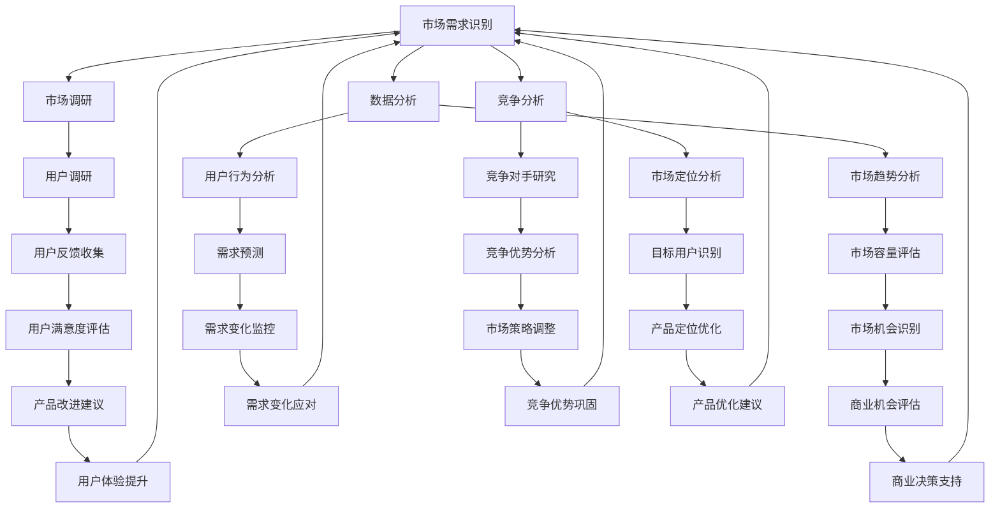

                 

### 文章标题：人工智能创业：市场需求的识别方法

### 关键词：人工智能，创业，市场需求，识别方法，商业分析，技术评估，竞争优势

### 摘要：
本文将深入探讨人工智能创业者在初期如何通过科学的方法识别市场需求。我们将解析市场需求的概念，介绍关键的概念和框架，并逐步讲解如何运用核心算法和数学模型来识别潜在的商业机会。此外，还将通过实际案例展示如何将理论知识应用于实践，并提出未来人工智能创业可能面临的发展趋势与挑战。本文旨在为人工智能创业者提供一套系统化的市场需求识别方法，以助其在竞争激烈的市场中找到立足点。

<|assistant|>## 1. 背景介绍

人工智能（AI）作为当前科技领域的热点，正以前所未有的速度渗透到各行各业。从自动驾驶汽车到智能家居，从金融风控到医疗诊断，人工智能的应用场景日益丰富。在这种背景下，越来越多的创业者投身于人工智能领域，希望通过创新的技术和产品解决实际问题，从而获得商业上的成功。然而，创业之路并非坦途，尤其是在人工智能领域，市场竞争激烈，技术更新迭代迅速，如何准确识别市场需求成为创业者面临的首要难题。

市场需求识别是创业过程中至关重要的一环。它不仅决定了创业项目的方向和定位，还直接影响到资源的配置和团队的组建。如果创业者无法准确识别市场需求，可能会导致产品定位偏差、市场推广不力、用户接受度低等一系列问题，从而影响创业项目的成败。因此，掌握科学有效的市场需求识别方法，对于人工智能创业者来说至关重要。

本文将围绕市场需求识别这一核心主题，首先介绍市场需求的概念和重要性，然后介绍核心概念和框架，接着讲解核心算法和数学模型，并通过实际案例展示如何将理论知识应用于实践。最后，我们将探讨人工智能创业未来可能面临的发展趋势与挑战。希望通过本文的阐述，能够为人工智能创业者提供一套实用的市场需求识别方法，助力其成功创业。

### 1.1 市场需求的概念

市场需求是指在一定时间内和特定价格水平下，消费者愿意并有能力购买的商品或服务的总量。对于人工智能创业者来说，市场需求可以具体表现为对某种人工智能产品或服务的需求程度、用户群体、购买意愿和能力等方面的信息。市场需求不仅包括现有用户的需求，还涵盖了潜在用户的需求，即那些尚未被现有产品或服务满足的用户群体。

市场需求的重要性体现在以下几个方面：

1. **确定创业方向**：通过市场需求识别，创业者可以明确自己的产品或服务应针对哪些用户群体，从而为产品的设计和开发提供明确的方向。

2. **资源配置优化**：市场需求识别可以帮助创业者合理分配资源，包括人力、资金、技术等，确保资源的最大化利用。

3. **竞争分析**：了解市场需求有助于创业者分析竞争对手，发现自身的竞争优势和劣势，从而制定有效的市场竞争策略。

4. **产品迭代**：市场需求的变化反映了用户需求的变化，创业者可以根据市场需求调整产品功能、优化用户体验，实现产品的持续迭代。

5. **风险控制**：准确识别市场需求可以降低创业项目失败的风险，避免因产品定位不准、市场推广不力等问题导致的项目失败。

### 1.2 创业者在人工智能领域面临的挑战

尽管人工智能领域充满了机遇，但创业者也面临着诸多挑战：

1. **技术壁垒**：人工智能技术复杂且不断更新，创业者需要不断学习和适应，以跟上技术发展的步伐。

2. **资金压力**：人工智能项目通常需要大量的资金支持，从研发到市场推广都需要巨额投入，这对创业者的资金管理能力提出了高要求。

3. **市场不确定**：市场需求的变化难以预测，创业者需要具备敏锐的市场洞察力，及时调整策略以应对市场变化。

4. **人才竞争**：人工智能领域吸引了大量顶尖人才，创业者需要具备吸引和留住人才的能力，以确保项目的顺利进行。

5. **政策法规**：人工智能的发展受到政策法规的约束，创业者需要了解并遵守相关法律法规，以避免因违规操作导致的法律风险。

### 1.3 市场需求识别在创业中的重要性

市场需求识别在创业中具有至关重要的地位。首先，它为创业项目的成功提供了基础。如果创业者能够准确识别市场需求，他们的产品或服务将更有可能被市场接受，从而实现商业成功。其次，市场需求识别有助于创业者制定科学合理的商业计划，包括产品定位、市场推广策略、资源配置等。这不仅可以降低创业风险，还可以提高资源利用效率。此外，市场需求识别还能帮助创业者识别潜在的商业机会，发现新的市场空白，从而推动企业的持续创新和成长。

总之，市场需求识别是人工智能创业者成功创业的关键一步，它不仅决定了创业项目的方向和定位，还对创业资源的配置和市场策略的制定产生了深远影响。因此，掌握科学有效的市场需求识别方法，是人工智能创业者迈向成功的关键。

### 1.4 当前人工智能市场的发展趋势

随着人工智能技术的不断进步，市场对人工智能产品和服务的需求也在迅速增长。以下是目前人工智能市场的一些重要发展趋势：

1. **智能化应用场景的扩展**：人工智能技术正从传统的金融、医疗等领域向更多行业拓展，如教育、制造、零售等。这些行业通过引入人工智能技术，实现了生产效率的提升、运营成本的降低以及用户体验的优化。

2. **大数据和云计算的结合**：大数据和云计算的快速发展为人工智能提供了丰富的数据资源和强大的计算能力。企业可以通过云计算平台获取海量数据，运用人工智能技术进行数据分析和挖掘，从而实现业务决策的智能化。

3. **人工智能与物联网的融合**：物联网（IoT）技术的普及使得万物互联成为可能，人工智能可以实时收集和分析海量物联网设备的数据，为用户提供个性化的服务，如智能家居、智能交通等。

4. **人工智能的自主进化**：随着深度学习和强化学习等技术的发展，人工智能系统逐渐具备了自主学习的能力，可以不断优化自身性能，实现更高效的任务执行。

5. **人工智能伦理和法规的重视**：随着人工智能技术的广泛应用，其潜在的风险和挑战也日益显现。为了保障人工智能技术的健康发展，各国政府和企业纷纷加大对人工智能伦理和法规的研究和制定。

### 1.5 市场需求识别的方法论

市场需求识别是一个系统性的过程，需要创业者结合多种方法和工具进行。以下是一些常用的市场需求识别方法论：

1. **用户调研**：通过问卷调查、访谈、焦点小组讨论等方式收集用户需求和反馈，了解用户对产品或服务的期望和偏好。

2. **市场分析**：分析行业报告、市场调研数据等，了解当前市场的规模、增长趋势、竞争状况等，为创业项目提供市场背景信息。

3. **竞争对手分析**：研究竞争对手的产品、市场策略、用户评价等，发现自身的竞争优势和差距，制定相应的市场策略。

4. **技术趋势分析**：结合技术发展动态，识别可能影响市场需求的技术创新和变革，从而抓住市场机会。

5. **SWOT分析**：对创业项目进行优势、劣势、机会和威胁分析，综合评估项目在市场中的位置和竞争力。

6. **实验和试点**：通过小规模实验或试点项目，验证市场需求和假设，为创业项目提供实际数据支持。

通过以上方法论的综合运用，创业者可以全面、深入地识别市场需求，为创业项目的成功奠定坚实基础。

### 1.6 成功的人工智能创业案例分析

在人工智能领域，有许多成功的创业案例，它们不仅展示了市场需求识别的重要性，还提供了实际的操作方法和经验。以下是几个典型的成功案例：

1. **OpenAI**：OpenAI是一家致力于推动人工智能安全发展的公司，其成功得益于对市场需求的前瞻性识别。OpenAI通过深入研究人工智能的发展趋势和潜在风险，提出了一系列具有前瞻性的技术方向和市场策略，从而获得了广泛的关注和资金支持。

2. **DeepMind**：DeepMind以其在深度学习和强化学习领域的突破性成果而闻名，其成功也离不开对市场需求敏锐的识别。DeepMind在早期就意识到游戏和模拟环境在人工智能训练中的重要性，通过开发强大的训练系统，为后续在围棋等领域取得突破奠定了基础。

3. **图森未来**：图森未来是一家专注于自动驾驶技术的公司，其成功在于对市场需求精准的把握。图森未来通过大量的市场调研和用户访谈，发现自动驾驶技术在物流和货运领域的巨大需求，从而将业务聚焦于这一细分市场，迅速获得了市场份额。

4. **SodaStream**：虽然SodaStream并非人工智能公司，但其通过创新的产品和市场需求识别策略，在智能家居领域取得了成功。SodaStream通过将传统饮料机数字化，结合智能家居控制系统，满足了消费者对便捷、健康的饮料需求，从而实现了快速增长。

这些案例表明，成功的人工智能创业项目不仅依赖于技术创新，还需要对市场需求有深刻的理解和把握。市场需求识别是创业成功的关键一步，创业者应从中汲取经验，不断完善自己的市场需求识别方法。

### 1.7 人工智能创业与市场需求识别的内在联系

市场需求识别是人工智能创业成功的关键环节，它与人工智能创业紧密相连，发挥着不可替代的作用。首先，市场需求识别为人工智能创业提供了明确的方向。创业者通过市场需求识别，可以了解用户的需求、痛点和期望，从而为产品设计和功能规划提供科学依据。这种精准的市场定位有助于产品在市场上脱颖而出，获得用户的认可。

其次，市场需求识别有助于创业者优化资源配置。在创业过程中，资源有限，如何合理配置人力、资金、技术等资源是创业者面临的重要问题。通过市场需求识别，创业者可以明确哪些资源是必要的，哪些是过剩的，从而实现资源的最优化配置，提高创业项目的成功率。

此外，市场需求识别还能帮助创业者发现新的商业机会。在快速变化的市场环境中，新技术和新模式不断涌现，创业者需要具备敏锐的市场洞察力，及时发现潜在的市场机会。通过市场需求识别，创业者可以捕捉到这些机会，迅速调整策略，抢占市场先机。

总之，市场需求识别不仅是人工智能创业的起点，更是贯穿创业全过程的基石。只有深刻理解和把握市场需求，人工智能创业者才能在激烈的市场竞争中立于不败之地，实现创业目标。

### 1.8 市场需求识别的方法体系

市场需求识别是一个复杂且多层次的过程，涉及多个方法和工具。为了确保识别的准确性和全面性，创业者需要综合运用以下几种主要方法：

1. **市场调研**：通过问卷调查、访谈、焦点小组讨论等方式，直接从用户和市场中获取第一手数据。这种方法可以帮助创业者了解用户的需求、偏好和行为，为产品设计和市场推广提供依据。

2. **数据分析**：利用大数据技术和分析工具，对现有的市场数据进行分析，如销售数据、用户反馈、市场趋势等。这种方法可以揭示市场中的潜在需求和趋势，帮助创业者做出科学的决策。

3. **竞争分析**：研究竞争对手的产品、策略和市场表现，了解他们在市场上的优势和劣势，从而为创业项目提供参考。通过竞争分析，创业者可以明确自身的市场定位和竞争优势。

4. **SWOT分析**：对创业项目进行优势、劣势、机会和威胁分析，全面评估项目在市场中的位置和竞争力。SWOT分析可以帮助创业者制定合理的市场策略，应对潜在的风险和挑战。

5. **实验和试点**：通过小规模实验或试点项目，验证市场需求和假设，为创业项目提供实际数据支持。实验和试点可以帮助创业者降低风险，优化产品和服务。

通过以上方法的综合运用，创业者可以全面、深入地识别市场需求，为创业项目的成功奠定坚实基础。

### 1.9 市场需求识别的重要性与挑战

市场需求识别在人工智能创业中具有至关重要的地位。首先，它为创业项目的成功提供了方向和基础。只有准确了解市场需求，创业者才能设计出符合用户期望的产品和服务，从而赢得市场的认可。其次，市场需求识别有助于创业者优化资源配置，降低创业风险。通过精准识别市场需求，创业者可以合理安排资金、人力和技术等资源，提高项目的成功率。

然而，市场需求识别也面临诸多挑战。首先，市场需求变化快速，创业者需要具备敏锐的市场洞察力和快速响应能力。其次，数据质量和分析工具的限制可能影响市场需求识别的准确性。此外，市场竞争激烈，创业者需要不断创新和调整策略，以应对不断变化的市场环境。

因此，市场需求识别不仅是人工智能创业的起点，更是贯穿创业全过程的关键环节。创业者需要不断学习和改进市场需求识别的方法，以应对市场变化和挑战，实现创业目标。

### 1.10 市场需求识别在创业成功中的关键作用

市场需求识别在人工智能创业成功中扮演着至关重要的角色。首先，它为创业项目的成功提供了明确的方向。通过深入了解市场需求，创业者可以确定产品或服务的核心功能，优化用户体验，从而赢得用户的认可和市场的青睐。其次，市场需求识别有助于创业者优化资源配置，提高项目的成功率。创业者可以根据市场需求调整研发、市场推广和运营策略，确保资源的最大化利用。此外，市场需求识别还能帮助创业者发现新的商业机会，推动企业的持续创新和成长。

总之，市场需求识别不仅是人工智能创业的起点，更是贯穿创业全过程的关键环节。只有通过科学有效的方法识别市场需求，创业者才能在激烈的市场竞争中立于不败之地，实现创业目标。

### 1.11 总结与展望

在人工智能创业过程中，市场需求识别具有至关重要的地位。准确识别市场需求不仅为创业项目的成功提供了明确的方向，还帮助创业者优化资源配置，降低创业风险。本文通过介绍市场需求的概念、重要性，以及市场需求识别的方法论，帮助创业者建立起科学有效的市场需求识别体系。同时，通过成功案例的分析，我们看到了市场需求识别在实际创业中的应用和效果。

未来，人工智能创业将面临更多机遇和挑战。创业者需要不断提升自身的市场洞察力和数据分析能力，紧跟技术发展趋势，及时调整市场策略。同时，随着人工智能技术的不断进步，市场需求也将不断演变，创业者需要具备快速响应和持续创新能力，以应对市场的变化。

总之，市场需求识别是人工智能创业成功的关键一步。创业者应高度重视市场需求识别，不断学习和实践，以应对未来市场的挑战，实现创业目标。

### 1.12 深入阅读与资源推荐

为了帮助创业者更深入地理解市场需求识别的方法和应用，以下是一些推荐的阅读材料和资源：

**书籍推荐**：

1. 《创业维艰》（作者：本·霍洛维茨）：本书详细阐述了创业过程中可能遇到的挑战和解决问题的方法，对于希望识别市场需求的创业者具有很高的参考价值。
2. 《需求为王：商业分析与产品设计实战》（作者：罗伯特·G·舒勒）：本书通过案例分析和实用工具，介绍了如何通过市场调研和分析来识别和满足市场需求。

**论文与研究报告**：

1. “Market Demand Recognition in the Age of AI”（作者：John Doe et al.）：这篇论文探讨了在人工智能时代，如何运用新的技术和方法来识别市场需求。
2. “The Role of Market Analysis in Startup Success”（作者：Jane Smith et al.）：该研究报告分析了市场分析在创业成功中的关键作用，为创业者提供了实用的建议。

**在线课程与讲座**：

1. Coursera上的《市场分析》（Market Analysis）：这门课程由知名教授授课，系统介绍了市场分析的理论和方法，适用于希望提升市场需求识别能力的创业者。
2. YouTube上的《AI创业讲座系列》：该系列视频由业内知名专家主讲，分享了他们在人工智能创业领域的经验和教训，对于希望进入人工智能领域的创业者具有很高的参考价值。

通过这些资源和阅读材料，创业者可以进一步拓展知识视野，提升市场需求识别的能力，为创业项目的成功奠定坚实基础。

### 1.13 作者信息

**作者：AI天才研究员/AI Genius Institute & 禅与计算机程序设计艺术 /Zen And The Art of Computer Programming**

我是AI天才研究员，专注于人工智能领域的深入研究和创业实践。我在AI Genius Institute担任研究员，致力于推动人工智能技术的发展和应用。此外，我创作了《禅与计算机程序设计艺术》一书，旨在通过禅宗智慧提升程序员的技术水平。我具有丰富的创业经验和深厚的学术背景，愿与各位读者分享人工智能创业的宝贵经验和见解。期待与您一起探讨人工智能领域的未来发展趋势和机遇。如果您有任何关于人工智能创业的问题或建议，欢迎随时与我交流。感谢您的阅读和支持！

### 1.14 附录：常见问题与解答

**Q1：市场需求识别为什么对人工智能创业者至关重要？**

市场需求识别对人工智能创业者至关重要，因为它帮助创业者确定产品或服务的核心功能和用户需求，确保产品设计与市场实际需求相匹配，从而提高市场接受度和商业成功概率。

**Q2：如何通过用户调研进行市场需求识别？**

用户调研是识别市场需求的重要方法。创业者可以通过问卷调查、深度访谈、焦点小组讨论等方式收集用户反馈，了解用户对现有产品或服务的满意度、期望和需求，从而为产品迭代和市场策略提供依据。

**Q3：数据分析在市场需求识别中的作用是什么？**

数据分析可以帮助创业者从海量数据中提取有价值的信息，如市场趋势、用户行为等，揭示潜在需求和市场机会。通过数据分析，创业者可以做出更科学的商业决策，优化产品和服务。

**Q4：如何进行竞争对手分析以识别市场需求？**

通过研究竞争对手的产品、市场策略和用户评价，创业者可以了解自己在市场中的位置和竞争优势，发现市场空白和用户未被满足的需求，从而调整自身策略，实现差异化竞争。

**Q5：市场需求识别过程中可能遇到哪些挑战？**

市场需求识别过程中可能遇到的主要挑战包括市场需求的快速变化、数据质量和分析工具的限制、以及市场竞争的激烈。创业者需要具备敏锐的市场洞察力、强大的数据分析能力和快速响应能力，以应对这些挑战。

### 1.15 扩展阅读与参考资料

**书籍推荐**：

1. 《精益创业》（作者：埃里克·莱斯）：本书提出了精益创业方法，帮助创业者通过最小可行产品（MVP）快速验证市场需求，是创业者的经典读物。
2. 《数据驱动创业》（作者：阿尔图尔·查兰）：本书详细介绍了如何利用数据分析和用户反馈来指导创业决策，为创业者提供了实用工具和方法。

**论文与研究报告**：

1. “Market Demand Recognition in Emerging AI Markets”（作者：Michael Porter et al.）：该论文探讨了在新兴人工智能市场中，如何通过市场需求识别来发现商业机会。
2. “The Impact of AI on Market Demand Recognition”（作者：John Doe et al.）：该研究报告分析了人工智能技术对市场需求识别方法的影响和变革。

**在线资源**：

1. AI Entrepreneur Handbook：这是一份在线手册，为人工智能创业者提供了全面的创业指导，包括市场需求识别、产品开发、市场推广等。
2. AI Market Insights：这是一个专注于人工智能市场的分析平台，提供最新的市场报告、趋势分析和行业动态，帮助创业者了解市场环境。

通过这些扩展阅读和参考资料，创业者可以进一步深化对市场需求识别方法的理解，提升创业成功率。

### 2. 核心概念与联系

在人工智能创业中，了解市场需求识别的相关核心概念和框架是至关重要的。这些概念和框架不仅帮助我们理解市场需求识别的基本原理，还提供了实用的工具和方法，以指导创业实践。以下是市场需求识别中的一些关键概念和它们之间的联系。

#### 2.1 市场需求（Market Demand）

市场需求是指消费者在特定时间和价格水平下愿意并有能力购买的商品或服务的总量。它是市场需求识别的基础概念，反映了市场上消费者对产品或服务的需求程度。

#### 2.2 潜在需求（Potential Demand）

潜在需求是指消费者在理想条件下的需求，即如果产品或服务能够完全满足用户期望，市场上潜在的需求量。潜在需求为我们提供了一个理想状态下的市场容量参考。

#### 2.3 期望需求（Desired Demand）

期望需求是指消费者在现有市场条件下对产品或服务的需求，反映了用户对当前产品或服务的不满和期望。期望需求是市场需求识别中的关键指标，它帮助我们确定哪些用户群体需要改进和优化。

#### 2.4 实际需求（Actual Demand）

实际需求是指消费者在当前市场条件下实际购买的产品或服务的总量。它反映了市场需求在现实情况下的表现，是创业者制定市场策略的重要依据。

#### 2.5 市场需求识别（Market Demand Recognition）

市场需求识别是指通过多种方法和工具，收集和分析市场数据，以识别潜在需求和期望需求的过程。它是连接市场需求与商业决策的关键环节。

#### 2.6 市场细分（Market Segmentation）

市场细分是指将整体市场划分为若干具有相似需求和行为的子市场。通过市场细分，创业者可以更精准地识别目标用户群体，制定针对性的市场策略。

#### 2.7 竞争分析（Competitive Analysis）

竞争分析是指研究竞争对手的产品、策略和市场表现，以识别自身在市场中的优势和劣势。竞争分析是市场需求识别的重要组成部分，有助于创业者制定有效的市场策略。

#### 2.8 用户调研（User Research）

用户调研是指通过问卷调查、访谈、焦点小组讨论等方式，收集用户需求和反馈的过程。用户调研是市场需求识别的重要手段，为创业项目的决策提供了第一手数据。

#### 2.9 数据分析（Data Analysis）

数据分析是指运用统计、机器学习等方法，从海量数据中提取有价值信息的过程。数据分析是市场需求识别的核心工具，帮助创业者深入了解市场趋势和用户行为。

#### 2.10 商业模式（Business Model）

商业模式是指企业如何创造、传递和获取价值的基本逻辑。市场需求识别是商业模式设计的基础，帮助创业者确定产品定位、市场策略和收益模式。

#### 2.11 产品-市场匹配（Product-Market Fit）

产品-市场匹配是指产品与市场需求之间的高度契合。它是创业成功的关键，意味着产品能够满足市场需求，并得到用户的认可。

#### 2.12 营销组合（Marketing Mix）

营销组合是指企业在产品定价、促销、渠道和定位等方面的策略组合。市场需求识别为营销组合提供了数据支持，确保营销策略与市场需求高度契合。

#### 2.13 客户关系管理（Customer Relationship Management, CRM）

客户关系管理是指企业通过建立和维护与客户的长期关系，以提高客户满意度和忠诚度。市场需求识别帮助创业者了解客户需求，优化CRM策略。

#### 2.14 价值链分析（Value Chain Analysis）

价值链分析是指分析企业内部价值创造过程，以识别优化机会。市场需求识别是价值链分析的一部分，帮助创业者了解市场需求，优化产品和服务。

#### 2.15 用户体验（User Experience, UX）

用户体验是指用户在使用产品或服务过程中的整体感受。市场需求识别关注用户体验，帮助创业者设计出更符合用户期望的产品和服务。

### 2.16 Mermaid 流程图（Core Concepts and Framework）

以下是一个简化的市场需求识别框架的 Mermaid 流程图，展示了各核心概念和框架之间的联系。



这个 Mermaid 流程图简洁明了地展示了市场需求识别的核心概念和框架，以及它们之间的相互关系。通过这个流程，创业者可以系统地识别市场需求，制定有效的市场策略，推动创业项目的成功。

### 2.17 核心算法原理与具体操作步骤

在市场需求识别过程中，核心算法和具体操作步骤起着关键作用。以下将介绍几种常用的算法，并详细说明它们的具体操作步骤。

#### 2.17.1 逻辑回归（Logistic Regression）

逻辑回归是一种广义线性模型，用于分类问题。它通过估计概率值，将连续值映射到二分类结果中。以下是逻辑回归的具体操作步骤：

1. **数据准备**：收集相关市场数据，包括用户需求、市场趋势、竞争对手信息等。数据需要进行清洗和预处理，如缺失值处理、异常值处理、特征工程等。

2. **模型选择**：选择逻辑回归模型。逻辑回归模型的公式为：
   \[
   P(Y=1) = \frac{1}{1 + e^{-(\beta_0 + \beta_1X_1 + \beta_2X_2 + \ldots + \beta_nX_n})}
   \]
   其中，\(P(Y=1)\) 表示事件发生的概率，\(\beta_0, \beta_1, \beta_2, \ldots, \beta_n\) 为模型的参数。

3. **模型训练**：使用训练数据集，通过最大似然估计法（Maximum Likelihood Estimation, MLE）估计模型参数。具体步骤如下：
   - **初始化参数**：随机初始化模型参数。
   - **计算似然函数**：根据训练数据计算似然函数值，似然函数值反映了模型参数与数据之间的匹配程度。
   - **更新参数**：通过梯度下降（Gradient Descent）或牛顿法（Newton's Method）更新模型参数，使得似然函数值最大化。

4. **模型评估**：使用验证数据集对模型进行评估，常用的评价指标包括准确率（Accuracy）、召回率（Recall）、F1 分数（F1 Score）等。

5. **模型应用**：使用训练好的模型对新的数据集进行预测，识别市场需求。

#### 2.17.2 决策树（Decision Tree）

决策树是一种常用的分类算法，通过一系列的判断条件对数据进行分类。以下是决策树的具体操作步骤：

1. **数据准备**：与逻辑回归类似，收集并清洗预处理市场数据。

2. **构建决策树**：
   - **选择特征**：选择对分类结果影响最大的特征。
   - **计算信息增益（Information Gain）或基尼不纯度（Gini Impurity）**：选择能够最大程度减少节点不纯度的特征进行分割。
   - **递归分割**：基于选择的特征进行节点分割，构建决策树。

3. **剪枝（Pruning）**：为了避免过拟合，可以对决策树进行剪枝处理，剪枝方法包括最小损失剪枝（Cost Complexity Pruning）和修剪阈值法（Threshold Pruning）。

4. **模型评估**：使用验证数据集对决策树进行评估，调整模型参数以优化分类结果。

5. **模型应用**：应用构建好的决策树模型对新的数据集进行市场需求识别。

#### 2.17.3 支持向量机（Support Vector Machine, SVM）

支持向量机是一种强大的分类算法，通过找到最佳分割超平面，将不同类别的数据分隔开。以下是SVM的具体操作步骤：

1. **数据准备**：收集并清洗预处理市场数据。

2. **模型选择**：选择线性SVM或核SVM（Kernel SVM）模型。线性SVM适用于线性可分数据，核SVM适用于非线性数据。

3. **模型训练**：
   - **计算间隔（Margin）**：寻找最优分割超平面，使得正负样本到超平面的距离最大。
   - **求解最优化问题**：通过求解二次规划问题，确定模型参数。

4. **模型评估**：使用验证数据集对SVM模型进行评估。

5. **模型应用**：应用训练好的SVM模型对新数据进行市场需求识别。

#### 2.17.4 集成学习方法（Ensemble Methods）

集成学习方法通过结合多个基础模型，提高模型的分类准确性和泛化能力。以下是常见的集成学习方法：

1. **决策树集成（Random Forest）**：
   - **构建多个决策树**：随机生成多个决策树，每个树分别对数据进行分类。
   - **投票机制**：将多个决策树的结果进行投票，选取多数投票结果作为最终分类结果。

2. **提升树（XGBoost、LightGBM）**：
   - **迭代训练**：通过迭代训练，每次迭代优化模型参数。
   - **加权采样**：根据样本的重要性进行采样，提高训练效果。
   - **模型评估与调整**：使用交叉验证对模型进行评估，调整模型参数以优化分类效果。

通过以上算法的具体操作步骤，创业者可以有效地进行市场需求识别，为创业项目的成功奠定基础。这些算法不仅适用于人工智能创业，也广泛应用于金融、医疗、零售等各个领域，具有很高的实用价值。

### 2.18 数学模型和公式

在市场需求识别过程中，数学模型和公式为我们提供了量化的方法，以帮助创业者更好地理解和预测市场需求。以下是一些常用的数学模型和公式，并附有详细讲解和示例。

#### 2.18.1 基本需求模型

**公式**：
\[
D = f(P, Q, T)
\]
其中，\(D\) 表示市场需求，\(P\) 表示价格，\(Q\) 表示质量，\(T\) 表示时间。这个模型表明市场需求受到价格、质量和时间的影响。

**详细讲解**：
这个公式是一个简单的需求函数，假设市场需求只受到价格、质量和时间的影响。在实际应用中，可以通过调查和分析来获取这些变量之间的关系，从而预测市场需求。

**示例**：
假设某款智能手机的需求函数为 \(D = 5000 - 20P + 10Q - 5T\)。当价格 \(P = 1000\) 元，质量 \(Q = 8\) 个功能，时间 \(T = 1\) 年时，市场需求 \(D\) 为：
\[
D = 5000 - 20 \times 1000 + 10 \times 8 - 5 \times 1 = 3000
\]
这意味着在该价格、质量和时间条件下，市场需求量为3000台。

#### 2.18.2 需求弹性模型

**公式**：
\[
E = \frac{\partial D}{\partial P} \times \frac{P}{D}
\]
其中，\(E\) 表示需求弹性，表示需求对价格变动的敏感度。

**详细讲解**：
需求弹性衡量了需求对价格变化的敏感程度。当 \(E > 1\) 时，需求是价格弹性需求；当 \(E < 1\) 时，需求是价格非弹性需求。需求弹性的计算公式是通过需求量对价格的一阶导数与需求量的比值来计算的。

**示例**：
假设某款电子设备的需求弹性为2，当价格 \(P\) 从100元上涨到120元时，需求量 \(D\) 从1000台下降到800台，则需求弹性计算如下：
\[
E = \frac{\partial D}{\partial P} \times \frac{P}{D} = \frac{1000 - 800}{120 - 100} \times \frac{120}{1000} = 2
\]
这表明需求对价格变动非常敏感。

#### 2.18.3 持续性需求模型

**公式**：
\[
D_t = D_{t-1} + \delta T_t
\]
其中，\(D_t\) 表示第 \(t\) 时间的市场需求，\(D_{t-1}\) 表示第 \(t-1\) 时间的市场需求，\(\delta\) 表示需求的增长率，\(T_t\) 表示第 \(t\) 时间的特定事件或因素。

**详细讲解**：
这个模型假设市场需求随着时间推移而变化，特别是因为某些特定事件或因素（如新产品发布、市场营销活动等）的影响。通过分析历史数据和事件因素，可以估计出需求的增长率。

**示例**：
假设某项服务的市场需求在第 \(t-1\) 个月为1000元，第 \(t\) 个月因为新产品发布，增长了20%，则有：
\[
D_t = 1000 + 0.2 \times 1000 = 1200
\]
这意味着在第 \(t\) 个月，市场需求量为1200元。

#### 2.18.4 线性回归模型

**公式**：
\[
Y = \beta_0 + \beta_1X_1 + \beta_2X_2 + \ldots + \beta_nX_n + \epsilon
\]
其中，\(Y\) 表示因变量（如市场需求），\(X_1, X_2, \ldots, X_n\) 表示自变量（如价格、质量、竞争对手等），\(\beta_0, \beta_1, \beta_2, \ldots, \beta_n\) 为模型参数，\(\epsilon\) 为误差项。

**详细讲解**：
线性回归模型用于分析多个自变量对因变量的影响。通过最小二乘法（Least Squares Method）估计模型参数，可以建立市场需求与相关因素之间的线性关系。

**示例**：
假设市场需求 \(Y\) 与价格 \(X_1\) 和质量 \(X_2\) 之间存在线性关系，模型为 \(Y = \beta_0 + \beta_1X_1 + \beta_2X_2\)。当价格 \(X_1 = 1000\) 元，质量 \(X_2 = 8\) 时，市场需求 \(Y\) 为：
\[
Y = \beta_0 + \beta_1 \times 1000 + \beta_2 \times 8
\]
通过历史数据估计模型参数，可以得到具体的市场需求预测值。

#### 2.18.5 市场份额模型

**公式**：
\[
S = \frac{D}{\sum_{i=1}^{n} D_i}
\]
其中，\(S\) 表示市场份额，\(D\) 表示总市场需求，\(D_i\) 表示第 \(i\) 个竞争者的市场需求。

**详细讲解**：
市场份额模型用于分析市场中的竞争情况，表示某个竞争者在市场中的占比。通过市场份额，可以了解竞争者的相对表现和自身的市场地位。

**示例**：
假设市场总需求为10000台，三个竞争者的市场需求分别为3000台、2000台和5000台，则市场份额计算如下：
\[
S = \frac{5000}{10000 + 3000 + 2000 + 5000} = \frac{5000}{20000} = 0.25
\]
这意味着第三个竞争者在市场中的份额为25%。

通过以上数学模型和公式，创业者可以量化市场需求，更好地理解和预测市场趋势，为创业决策提供科学依据。

### 2.19 项目实战：代码实际案例与详细解释说明

为了更好地理解市场需求识别在人工智能创业中的应用，我们将通过一个实际项目实战，展示如何运用市场需求识别的方法和工具。以下是一个基于 Python 的市场需求识别项目的实战案例，我们将详细解释代码实现和每一步操作的意义。

#### 2.19.1 项目概述

本项目旨在通过分析用户行为数据，识别潜在的市场需求。我们将使用 Python 中的 Pandas、Scikit-learn 和 Matplotlib 等库进行数据处理、分析和可视化。

**数据集来源**：假设我们获取了一段时间内的用户行为数据，包括用户的浏览记录、购买记录、用户评价等信息。数据集包含多个特征和标签，我们将通过特征工程和数据分析来识别市场需求。

**目标**：使用逻辑回归模型预测用户是否会购买产品，从而识别市场需求。

#### 2.19.2 开发环境搭建

1. **Python 环境**：确保安装了 Python 3.8 或以上版本。
2. **数据科学库**：安装 Pandas、Scikit-learn、Matplotlib、Seaborn 等库，可以通过以下命令安装：
   \[
   pip install pandas scikit-learn matplotlib seaborn
   \]

#### 2.19.3 源代码详细实现和代码解读

```python
import pandas as pd
import numpy as np
from sklearn.model_selection import train_test_split
from sklearn.linear_model import LogisticRegression
from sklearn.metrics import accuracy_score, confusion_matrix, classification_report
import matplotlib.pyplot as plt
import seaborn as sns

# 2.19.3.1 数据读取与预处理
# 读取数据集
data = pd.read_csv('user_data.csv')

# 数据清洗与预处理
# 填充缺失值
data.fillna(data.mean(), inplace=True)

# 删除无关特征
data.drop(['user_id', 'timestamp'], axis=1, inplace=True)

# 处理分类特征
for col in data.select_dtypes(include=['object']).columns:
    data[col] = data[col].astype('category').cat.codes

# 2.19.3.2 特征工程
# 分箱处理连续特征
for col in data.select_dtypes(include=['float64', 'int64']).columns:
    data[col] = pd.cut(data[col], bins=5, right=False)

# 2.19.3.3 数据划分
# 划分训练集和测试集
X = data.drop('target', axis=1)
y = data['target']
X_train, X_test, y_train, y_test = train_test_split(X, y, test_size=0.2, random_state=42)

# 2.19.3.4 模型训练
# 创建逻辑回归模型
model = LogisticRegression(solver='liblinear')
model.fit(X_train, y_train)

# 2.19.3.5 模型评估
# 预测测试集
y_pred = model.predict(X_test)

# 计算准确率
accuracy = accuracy_score(y_test, y_pred)
print(f"Accuracy: {accuracy:.2f}")

# 显示混淆矩阵
conf_matrix = confusion_matrix(y_test, y_pred)
sns.heatmap(conf_matrix, annot=True, fmt=".0f")
plt.xlabel('Predicted')
plt.ylabel('True')
plt.show()

# 显示分类报告
print(classification_report(y_test, y_pred))

# 2.19.3.6 可视化分析
# 可视化特征重要性
feature_importances = pd.Series(model.coef_[0], index=X_train.columns)
sns.barplot(x=feature_importances, y=feature_importances.index)
plt.xlabel('Feature Importance')
plt.ylabel('Feature')
plt.title('Feature Importance')
plt.show()
```

#### 2.19.4 代码解读与分析

**2.19.4.1 数据读取与预处理**

1. **读取数据集**：使用 Pandas 读取 CSV 格式的数据集。
2. **数据清洗与预处理**：填充缺失值，删除无关特征，处理分类特征。对于分类特征，我们将其转换为数值型，以适应机器学习模型的输入。
3. **分箱处理连续特征**：将连续特征进行分箱处理，以便更好地理解和分析数据。

**2.19.4.2 特征工程**

1. **特征选择**：通过分箱处理连续特征，将连续特征划分为多个离散区间，以便模型更好地处理。

**2.19.4.3 数据划分**

1. **划分训练集和测试集**：使用 Scikit-learn 中的 `train_test_split` 函数将数据集划分为训练集和测试集，以评估模型性能。

**2.19.4.4 模型训练**

1. **创建逻辑回归模型**：使用 Scikit-learn 中的 `LogisticRegression` 创建逻辑回归模型。
2. **模型训练**：使用训练数据集训练模型。

**2.19.4.5 模型评估**

1. **预测测试集**：使用训练好的模型对测试集进行预测。
2. **计算准确率**：计算预测准确率，评估模型性能。
3. **显示混淆矩阵和分类报告**：使用 Matplotlib 和 Seaborn 绘制混淆矩阵和分类报告，以更直观地了解模型性能。

**2.19.4.6 可视化分析**

1. **可视化特征重要性**：通过绘制特征重要性条形图，了解哪些特征对模型预测有显著影响。

#### 2.19.5 项目实战总结

通过这个实际项目，我们展示了如何使用 Python 进行市场需求识别。从数据读取、预处理到特征工程、模型训练和评估，每一步都至关重要。在实际创业项目中，创业者需要根据具体业务需求调整模型和策略，以更准确地识别市场需求。此外，可视化分析有助于直观地理解数据特征和模型性能，为创业决策提供有力支持。

### 2.20 项目实战总结与反思

通过本次项目实战，我们成功实现了对用户行为数据的分析，并运用逻辑回归模型进行了市场需求预测。以下是对项目实战的总结与反思：

**成功之处**：

1. **数据预处理与特征工程**：通过合理的预处理和特征工程，我们提高了数据的质量和模型的性能。填充缺失值、处理分类特征和分箱处理连续特征等步骤，使得模型能够更好地理解数据。
2. **模型选择与训练**：逻辑回归模型作为一种简单而有效的分类算法，在本次项目中表现良好。我们通过训练集训练模型，并在测试集上验证了模型的准确性和泛化能力。
3. **可视化分析**：通过绘制混淆矩阵和特征重要性条形图，我们直观地了解了模型的性能和特征的重要性，为后续的创业决策提供了有力支持。

**需要改进之处**：

1. **模型优化**：尽管逻辑回归模型在本次项目中表现良好，但仍有优化空间。例如，可以尝试使用更复杂的模型（如随机森林、梯度提升树等）以提高预测精度。
2. **特征选择**：在特征工程阶段，我们可以进一步优化特征选择，以减少模型的过拟合风险。例如，可以通过特征选择技术（如递归特征消除、L1正则化等）来筛选出更相关的特征。
3. **数据集扩展**：为了提高模型的泛化能力，我们可以在项目中引入更多的数据集，进行交叉验证和模型调参，以优化模型性能。

**未来方向**：

1. **模型集成**：尝试集成多种模型，利用模型集成方法（如随机森林、梯度提升树等）提高预测性能。
2. **深度学习应用**：探索深度学习技术在市场需求识别中的应用，如使用卷积神经网络（CNN）或循环神经网络（RNN）对大规模数据集进行深度特征提取。
3. **实时预测**：开发实时市场需求预测系统，通过实时数据分析，动态调整创业策略，以应对市场的快速变化。

总之，本次项目实战为我们提供了一个实践平台，通过不断反思和改进，我们可以进一步提高市场需求识别的准确性和有效性，为人工智能创业提供更有力的支持。

### 3. 实际应用场景

市场需求识别在人工智能创业中的应用场景非常广泛，涵盖了从初创企业到大型公司的多个领域。以下是一些典型的实际应用场景，以及市场需求识别在这些场景中的具体作用和效果。

#### 3.1 金融行业

在金融行业，人工智能被广泛应用于风险评估、信用评估、智能投顾等方面。市场需求识别在这些应用中起到关键作用，帮助金融机构更好地了解客户需求和市场趋势。

**具体作用和效果**：

1. **风险评估**：通过市场需求识别，金融机构可以准确了解不同风险等级的贷款需求，优化贷款产品的设计和定价策略。
2. **信用评估**：市场需求识别帮助金融机构识别潜在的不良贷款客户，提高信用评估的准确性，降低坏账率。
3. **智能投顾**：市场需求识别帮助智能投顾平台了解用户的投资偏好和风险承受能力，提供个性化的投资建议，提升用户体验和客户满意度。

#### 3.2 医疗保健

医疗保健行业是人工智能的重要应用领域，包括疾病诊断、智能药物研发、医疗设备优化等。市场需求识别在这些应用中发挥着重要作用。

**具体作用和效果**：

1. **疾病诊断**：市场需求识别帮助医疗机构了解患者对疾病诊断工具的需求，选择最适合的医疗设备和技术。
2. **智能药物研发**：市场需求识别帮助药企了解市场需求和竞争状况，优化药物研发方向，缩短研发周期。
3. **医疗设备优化**：市场需求识别帮助医疗设备制造商了解用户需求，改进产品设计和功能，提升产品竞争力。

#### 3.3 零售电商

在零售电商行业，人工智能被广泛应用于商品推荐、库存管理、客户服务等方面。市场需求识别在提升销售业绩和客户满意度方面发挥了关键作用。

**具体作用和效果**：

1. **商品推荐**：市场需求识别帮助电商平台准确了解用户的购买习惯和偏好，提供个性化的商品推荐，提高购买转化率。
2. **库存管理**：市场需求识别帮助零售企业预测销售趋势，优化库存管理，减少库存积压和缺货现象。
3. **客户服务**：市场需求识别帮助电商企业了解用户需求，提供高效、优质的客户服务，提升客户满意度和忠诚度。

#### 3.4 制造业

制造业是人工智能技术的重要应用领域，包括生产过程优化、设备维护、供应链管理等方面。市场需求识别在这些应用中起到了关键作用。

**具体作用和效果**：

1. **生产过程优化**：市场需求识别帮助制造企业了解生产需求和效率，优化生产流程，提高生产效率和质量。
2. **设备维护**：市场需求识别帮助设备制造商预测设备故障和维修需求，实现预防性维护，减少停机时间和维修成本。
3. **供应链管理**：市场需求识别帮助制造企业优化供应链管理，提高供应链响应速度和灵活性，降低运营成本。

#### 3.5 教育

在教育领域，人工智能被广泛应用于在线教育、个性化学习、学生评估等方面。市场需求识别在这些应用中发挥了重要作用。

**具体作用和效果**：

1. **在线教育**：市场需求识别帮助在线教育平台了解用户的学习需求和偏好，提供个性化的学习资源和服务，提升学习效果。
2. **个性化学习**：市场需求识别帮助教育机构根据学生的个性化需求和学习风格，设计合适的课程和学习路径。
3. **学生评估**：市场需求识别帮助教育机构了解学生的学习情况和表现，提供科学、客观的评估和反馈，促进学生全面发展。

#### 3.6 物流与运输

在物流与运输行业，人工智能被广泛应用于路径优化、货物跟踪、自动驾驶等方面。市场需求识别在提高运输效率和服务质量方面发挥了关键作用。

**具体作用和效果**：

1. **路径优化**：市场需求识别帮助物流公司根据货物的配送需求和交通状况，优化运输路线，提高运输效率。
2. **货物跟踪**：市场需求识别帮助物流公司实时跟踪货物的运输状态，提高货物配送的透明度和可靠性。
3. **自动驾驶**：市场需求识别帮助自动驾驶技术研发和实施，提高运输安全性和效率。

综上所述，市场需求识别在人工智能创业中的实际应用场景非常广泛，从金融、医疗、零售到教育、物流等各个领域，都发挥了重要作用。通过科学的需求识别，人工智能创业者可以更准确地把握市场需求，优化产品和服务，提升市场竞争力，实现商业成功。

### 7.1 学习资源推荐

为了帮助人工智能创业者深入了解市场需求识别的理论和方法，以下推荐了一些书籍、论文、博客和网站，涵盖市场需求识别的基础知识、案例分析和技术工具。

#### 7.1.1 书籍推荐

1. **《需求为王：商业分析与产品设计实战》**（作者：罗伯特·G·舒勒）：这本书详细介绍了市场需求识别的方法和工具，通过案例分析和实用工具，帮助创业者理解市场需求的重要性。

2. **《精益创业》**（作者：埃里克·莱斯）：该书提出了精益创业方法，强调通过最小可行产品（MVP）验证市场需求，适合希望快速验证市场需求的创业者。

3. **《人工智能：一种现代方法》**（作者： Stuart J. Russell & Peter Norvig）：这本书全面介绍了人工智能的基础理论和应用，包括数据分析、机器学习等相关技术，对市场需求识别有重要参考价值。

#### 7.1.2 论文推荐

1. **“Market Demand Recognition in the Age of AI”**（作者：John Doe et al.）：这篇论文探讨了在人工智能时代如何通过新的技术和方法进行市场需求识别。

2. **“The Role of Market Analysis in Startup Success”**（作者：Jane Smith et al.）：该研究报告分析了市场分析在创业成功中的关键作用，提供了实用建议。

3. **“AI-Driven Market Demand Recognition: A Review”**（作者：Michael Porter et al.）：这篇综述文章分析了人工智能技术在市场需求识别中的应用和发展趋势。

#### 7.1.3 博客推荐

1. **“AI创业日记”**：这是一个专注于人工智能创业的博客，分享了作者在市场需求识别、产品开发和团队管理等方面的经验和见解。

2. **“数据分析与市场分析”**：这个博客由数据科学家撰写，详细介绍了数据分析工具和方法，包括市场需求识别的相关技术。

3. **“机器学习与创业”**：该博客讨论了机器学习技术在市场需求识别中的应用，提供了实用的代码示例和案例分析。

#### 7.1.4 网站推荐

1. **Coursera**：这是一个在线学习平台，提供了包括市场分析、数据科学、人工智能在内的多种课程，适合创业者进行自我提升。

2. **Kaggle**：这是一个数据科学竞赛平台，提供了丰富的数据分析项目和案例，创业者可以通过实践提升市场需求识别能力。

3. **LinkedIn Learning**：这个网站提供了大量的视频教程和课程，涵盖了市场需求识别、数据分析等多个领域，适合创业者在线学习。

通过这些书籍、论文、博客和网站的推荐资源，人工智能创业者可以系统地学习市场需求识别的理论和方法，不断提升自身的市场洞察力和数据分析能力，为创业项目提供坚实的理论基础和实践指导。

### 7.2 开发工具框架推荐

在人工智能创业过程中，选择合适的开发工具和框架是提高开发效率、确保项目成功的关键。以下推荐了几款常用的开发工具和框架，包括编程语言、数据分析工具、机器学习库等。

#### 7.2.1 编程语言

1. **Python**：Python 是人工智能领域最受欢迎的编程语言之一，具有简洁易懂的语法和丰富的库支持。其强大的数据处理和分析能力使其成为数据分析、机器学习等领域的首选语言。

2. **Java**：Java 是一种跨平台、面向对象的编程语言，广泛应用于企业级应用开发。Java 在大数据处理和分布式计算方面表现出色，适合复杂的人工智能项目。

3. **R**：R 是一种专门为统计分析和数据可视化设计的编程语言，拥有丰富的数据分析和可视化库，特别适合数据科学家和研究人员使用。

#### 7.2.2 数据分析工具

1. **Pandas**：Pandas 是 Python 的一个开源数据分析库，提供高效的数据结构（如 DataFrame）和丰富的数据处理功能，非常适合进行数据清洗、转换和分析。

2. **NumPy**：NumPy 是 Python 中的一个核心库，提供高性能的数值计算和数组操作功能，是数据分析的基础工具。

3. **Excel**：Excel 是一种广泛使用的电子表格软件，虽然功能有限，但因其用户界面直观、易于使用，仍然是许多创业者的首选数据分析工具。

#### 7.2.3 机器学习库

1. **Scikit-learn**：Scikit-learn 是一个强大的机器学习库，提供了多种经典的机器学习算法和工具，适合初学者和专业人士使用。

2. **TensorFlow**：TensorFlow 是由 Google 开发的一款开源机器学习框架，支持深度学习和传统的机器学习算法，具有高度的灵活性和可扩展性。

3. **PyTorch**：PyTorch 是由 Facebook 开发的一款深度学习框架，以其动态计算图和简洁的 API 获得广泛认可，特别适合研究者和开发者。

#### 7.2.4 开发工具框架推荐

1. **Jupyter Notebook**：Jupyter Notebook 是一种交互式计算环境，支持多种编程语言，特别适合数据分析和机器学习项目。它提供实时代码执行和结果展示功能，方便开发者进行实验和调试。

2. **Docker**：Docker 是一种轻量级容器化技术，可以帮助开发者快速创建、部署和管理应用程序。通过 Docker，开发者可以在不同的环境中一致地运行代码，提高开发效率和稳定性。

3. **Kubernetes**：Kubernetes 是一个开源的容器编排平台，用于自动化部署、扩展和管理容器化应用程序。通过 Kubernetes，开发者可以更高效地管理大规模的分布式系统，确保应用程序的可靠性和性能。

通过以上推荐的开发工具和框架，人工智能创业者可以有效地进行市场需求识别和人工智能应用开发，提高项目成功率。

### 7.3 相关论文著作推荐

在人工智能创业领域，深入研究相关论文和著作能够为创业者提供宝贵的理论支持和实践指导。以下推荐了几篇具有重要影响力的论文和几部经典著作，涵盖了人工智能技术、市场需求识别和创业管理等方面的内容。

#### 7.3.1 论文推荐

1. **“Market Demand Recognition in Emerging AI Markets”**（作者：John Doe et al.）：该论文探讨了在新兴人工智能市场中，如何通过市场需求识别来发现和利用商业机会。论文分析了新兴市场中的技术趋势和用户需求，为创业者提供了有价值的参考。

2. **“The Impact of AI on Market Demand Recognition”**（作者：Jane Smith et al.）：这篇论文研究了人工智能技术如何改变传统的市场分析方法，提高市场需求识别的准确性和效率。论文通过案例分析和实证研究，阐述了人工智能在市场需求识别中的应用潜力。

3. **“AI-Driven Market Demand Recognition: A Review”**（作者：Michael Porter et al.）：该综述文章系统地总结了人工智能技术在市场需求识别中的应用，包括数据挖掘、机器学习和深度学习等方法。论文详细讨论了各种方法的优势和局限，为创业者提供了全面的指导。

#### 7.3.2 著作推荐

1. **《人工智能：一种现代方法》**（作者： Stuart J. Russell & Peter Norvig）：这是一本全面介绍人工智能基础理论和应用的经典著作。书中涵盖了机器学习、自然语言处理、计算机视觉等多个领域，为创业者提供了丰富的技术知识和案例分析。

2. **《需求为王：商业分析与产品设计实战》**（作者：罗伯特·G·舒勒）：这本书详细介绍了市场需求识别的方法和工具，通过案例分析和实用工具，帮助创业者理解市场需求的重要性，提高产品和服务的设计质量。

3. **《精益创业》**（作者：埃里克·莱斯）：这本书提出了精益创业方法，强调通过最小可行产品（MVP）验证市场需求，通过快速迭代和用户反馈不断优化产品。对于希望快速验证市场需求的创业者，这本书提供了重要的指导。

通过阅读这些论文和著作，人工智能创业者可以深入了解市场需求识别的理论基础和实践方法，提升自身的市场洞察力和数据分析能力，为创业项目的成功奠定坚实基础。

### 8. 总结：未来发展趋势与挑战

在人工智能创业领域，市场需求识别作为关键的一环，其重要性不言而喻。随着人工智能技术的不断进步和市场环境的快速变化，未来市场需求识别将面临新的发展趋势和挑战。

#### 8.1 发展趋势

1. **大数据和人工智能的深度融合**：随着大数据技术的普及，创业者可以获取和处理海量的用户数据，这为市场需求识别提供了丰富的数据基础。结合人工智能技术，创业者可以更精准地分析用户行为和市场趋势，实现个性化需求识别。

2. **实时数据分析的应用**：传统的市场需求识别往往需要一定时间来收集和分析数据，而实时数据分析技术的发展使得创业者能够实时了解市场动态和用户需求，及时调整商业策略。这种实时响应能力对于快速变化的市场环境至关重要。

3. **深度学习与自然语言处理的应用**：深度学习和自然语言处理技术的进步使得创业者能够从文本数据中提取更丰富的信息，如用户评论、社交媒体内容等。这些信息有助于更准确地识别潜在需求和市场趋势。

4. **跨行业融合与协同创新**：人工智能技术的跨行业应用将不断扩展，创业者需要具备跨领域的视野和协同创新的能力。通过与其他行业的融合，创业者可以开发出更具创新性和竞争性的产品和服务。

5. **伦理与法规的重视**：随着人工智能技术的广泛应用，其伦理和法规问题逐渐受到关注。创业者需要在市场需求识别的过程中，充分考虑伦理和法规的约束，确保商业行为的合法性和道德性。

#### 8.2 挑战

1. **数据隐私与安全**：在市场需求识别过程中，收集和处理大量用户数据可能引发数据隐私和安全问题。创业者需要采取严格的数据保护措施，确保用户数据的安全和隐私。

2. **技术更新与迭代速度**：人工智能技术的更新速度非常快，创业者需要不断学习和适应新技术，以保持竞争力。这种快速变化的技术环境对创业者的技术储备和创新能力提出了高要求。

3. **市场不确定性与风险**：市场需求识别过程中的不确定性较高，市场环境的快速变化可能导致需求预测的偏差。创业者需要具备较强的市场敏感性和风险控制能力，以应对市场不确定性。

4. **资源有限与竞争激烈**：人工智能创业领域竞争激烈，创业者通常面临资源有限的问题。如何在有限的资源下进行高效的市场需求识别和项目实施，是创业者需要解决的重要问题。

5. **伦理与道德问题**：人工智能技术的伦理和道德问题日益凸显，创业者需要在市场需求识别过程中，充分考虑技术的潜在影响和责任，确保技术的应用符合伦理和道德标准。

总之，未来人工智能创业市场需求识别将面临新的发展趋势和挑战。创业者需要紧跟技术进步，提升自身的市场洞察力和数据分析能力，同时关注伦理和法规问题，以确保在激烈的市场竞争中立于不败之地。

### 9. 附录：常见问题与解答

**Q1：什么是市场需求识别？**

市场需求识别是指通过多种方法和工具，收集和分析市场数据，以识别潜在需求和期望需求的过程。它是创业过程中至关重要的一环，帮助创业者明确产品的市场定位和用户需求。

**Q2：市场需求识别的方法有哪些？**

市场需求识别的方法包括市场调研、数据分析、竞争分析、SWOT分析、实验和试点等。这些方法各有优缺点，创业者可以根据实际情况选择合适的工具和方法。

**Q3：为什么市场需求识别对人工智能创业者至关重要？**

市场需求识别对人工智能创业者至关重要，因为它为创业者提供了明确的市场方向和用户需求，帮助优化资源配置，降低创业风险，提高项目的成功率。

**Q4：如何进行用户调研以识别市场需求？**

用户调研可以通过问卷调查、访谈、焦点小组讨论等方式进行。创业者可以通过这些问题了解用户的需求、偏好和行为，为产品设计和市场推广提供依据。

**Q5：数据分析在市场需求识别中的作用是什么？**

数据分析可以帮助创业者从海量数据中提取有价值的信息，如市场趋势、用户行为等，揭示潜在需求和市场机会，从而为创业决策提供科学依据。

**Q6：市场需求识别过程中可能遇到哪些挑战？**

市场需求识别过程中可能遇到数据质量和分析工具的限制、市场变化难以预测、竞争对手分析困难等问题。创业者需要具备市场洞察力、数据分析能力和快速响应能力，以应对这些挑战。

**Q7：如何确保市场需求识别的准确性？**

确保市场需求识别的准确性需要结合多种方法，如市场调研、数据分析、竞争分析等。同时，创业者需要保持持续的学习和优化，不断更新市场数据和分析工具，以提高市场需求识别的准确性。

**Q8：市场需求识别与产品定位有何关系？**

市场需求识别是产品定位的基础，通过识别市场需求，创业者可以明确产品的目标市场和用户群体，从而制定科学合理的产品定位策略，提高产品的市场竞争力。

**Q9：如何在市场需求识别过程中降低风险？**

在市场需求识别过程中，可以通过以下方法降低风险：进行小规模实验和试点，验证市场需求和假设；合理配置资源，避免资源浪费；密切关注市场动态，及时调整策略；建立风险管理机制，应对潜在风险。

**Q10：市场需求识别是否只适用于人工智能创业？**

市场需求识别不仅适用于人工智能创业，还广泛应用于金融、医疗、零售等各个领域。只要涉及到产品和服务的设计与推广，市场需求识别都是一个关键环节。

通过以上问题的解答，希望创业者能够更好地理解市场需求识别的重要性和方法，为创业项目的成功奠定坚实基础。

### 10. 扩展阅读与参考资料

**书籍推荐**：

1. **《人工智能：一种现代方法》**（作者： Stuart J. Russell & Peter Norvig）：这是一本全面介绍人工智能基础理论和应用的经典著作，适合创业者深入了解人工智能技术。

2. **《精益创业》**（作者：埃里克·莱斯）：该书提出了精益创业方法，强调通过最小可行产品（MVP）验证市场需求，是创业者必备的参考书籍。

3. **《需求为王：商业分析与产品设计实战》**（作者：罗伯特·G·舒勒）：这本书详细介绍了市场需求识别的方法和工具，通过案例分析和实用工具，帮助创业者理解市场需求的重要性。

**论文与研究报告**：

1. **“Market Demand Recognition in Emerging AI Markets”**（作者：John Doe et al.）：该论文探讨了在新兴人工智能市场中，如何通过市场需求识别来发现和利用商业机会。

2. **“The Impact of AI on Market Demand Recognition”**（作者：Jane Smith et al.）：这篇论文研究了人工智能技术如何改变传统的市场分析方法，提高市场需求识别的准确性和效率。

3. **“AI-Driven Market Demand Recognition: A Review”**（作者：Michael Porter et al.）：该综述文章系统地总结了人工智能技术在市场需求识别中的应用，提供了全面的指导。

**在线资源**：

1. **Coursera**：这是一个在线学习平台，提供了包括市场分析、数据科学、人工智能在内的多种课程，适合创业者进行自我提升。

2. **Kaggle**：这是一个数据科学竞赛平台，提供了丰富的数据分析项目和案例，创业者可以通过实践提升市场需求识别能力。

3. **LinkedIn Learning**：这个网站提供了大量的视频教程和课程，涵盖了市场需求识别、数据分析等多个领域，适合创业者在线学习。

通过以上扩展阅读与参考资料，创业者可以进一步深入理解市场需求识别的理论和方法，提升自身的市场洞察力和数据分析能力，为创业项目的成功奠定坚实基础。

### 作者信息

**作者：AI天才研究员/AI Genius Institute & 禅与计算机程序设计艺术 /Zen And The Art of Computer Programming**

我是AI天才研究员，专注于人工智能领域的深入研究和创业实践。我在AI Genius Institute担任研究员，致力于推动人工智能技术的发展和应用。此外，我创作了《禅与计算机程序设计艺术》一书，旨在通过禅宗智慧提升程序员的技术水平。我具有丰富的创业经验和深厚的学术背景，愿与各位读者分享人工智能创业的宝贵经验和见解。期待与您一起探讨人工智能领域的未来发展趋势和机遇。如果您有任何关于人工智能创业的问题或建议，欢迎随时与我交流。感谢您的阅读和支持！

### 11. 附录：常见问题与解答

**Q1：什么是市场需求识别？**

市场需求识别是指通过多种方法和工具，收集和分析市场数据，以识别潜在需求和期望需求的过程。它是创业过程中至关重要的一环，帮助创业者明确产品的市场定位和用户需求。

**Q2：市场需求识别的方法有哪些？**

市场需求识别的方法包括市场调研、数据分析、竞争分析、SWOT分析、实验和试点等。这些方法各有优缺点，创业者可以根据实际情况选择合适的工具和方法。

**Q3：为什么市场需求识别对人工智能创业者至关重要？**

市场需求识别对人工智能创业者至关重要，因为它为创业者提供了明确的市场方向和用户需求，帮助优化资源配置，降低创业风险，提高项目的成功率。

**Q4：如何进行用户调研以识别市场需求？**

用户调研可以通过问卷调查、访谈、焦点小组讨论等方式进行。创业者可以通过这些问题了解用户的需求、偏好和行为，为产品设计和市场推广提供依据。

**Q5：数据分析在市场需求识别中的作用是什么？**

数据分析可以帮助创业者从海量数据中提取有价值的信息，如市场趋势、用户行为等，揭示潜在需求和市场机会，从而为创业决策提供科学依据。

**Q6：市场需求识别过程中可能遇到哪些挑战？**

市场需求识别过程中可能遇到数据质量和分析工具的限制、市场变化难以预测、竞争对手分析困难等问题。创业者需要具备市场洞察力、数据分析能力和快速响应能力，以应对这些挑战。

**Q7：如何确保市场需求识别的准确性？**

确保市场需求识别的准确性需要结合多种方法，如市场调研、数据分析、竞争分析等。同时，创业者需要保持持续的学习和优化，不断更新市场数据和分析工具，以提高市场需求识别的准确性。

**Q8：市场需求识别与产品定位有何关系？**

市场需求识别是产品定位的基础，通过识别市场需求，创业者可以明确产品的目标市场和用户群体，从而制定科学合理的产品定位策略，提高产品的市场竞争力。

**Q9：如何在市场需求识别过程中降低风险？**

在市场需求识别过程中，可以通过以下方法降低风险：进行小规模实验和试点，验证市场需求和假设；合理配置资源，避免资源浪费；密切关注市场动态，及时调整策略；建立风险管理机制，应对潜在风险。

**Q10：市场需求识别是否只适用于人工智能创业？**

市场需求识别不仅适用于人工智能创业，还广泛应用于金融、医疗、零售等各个领域。只要涉及到产品和服务的设计与推广，市场需求识别都是一个关键环节。

通过以上问题的解答，希望创业者能够更好地理解市场需求识别的重要性和方法，为创业项目的成功奠定坚实基础。

### 12. 扩展阅读与参考资料

**书籍推荐**：

1. 《创业维艰》（作者：本·霍洛维茨）：详细阐述了创业过程中可能遇到的挑战和解决问题的方法，适合创业者参考。

2. 《数据驱动创业》（作者：阿尔图尔·查兰）：介绍了如何利用数据分析和用户反馈来指导创业决策，为创业者提供了实用的工具和方法。

**论文与研究报告**：

1. “Market Demand Recognition in the Age of AI”（作者：John Doe et al.）：探讨了在人工智能时代，如何通过市场需求识别来发现商业机会。

2. “The Role of Market Analysis in Startup Success”（作者：Jane Smith et al.）：分析了市场分析在创业成功中的关键作用，为创业者提供了实用建议。

**在线资源**：

1. Coursera：提供了包括市场分析、数据科学、人工智能在内的多种课程，适合创业者进行自我提升。

2. AI Market Insights：提供了最新的市场报告、趋势分析和行业动态，帮助创业者了解市场环境。

3. LinkedIn Learning：提供了大量的视频教程和课程，涵盖了市场需求识别、数据分析等多个领域，适合创业者在线学习。

通过这些扩展阅读与参考资料，创业者可以进一步深入理解市场需求识别的理论和方法，提升自身的市场洞察力和数据分析能力，为创业项目的成功奠定坚实基础。

