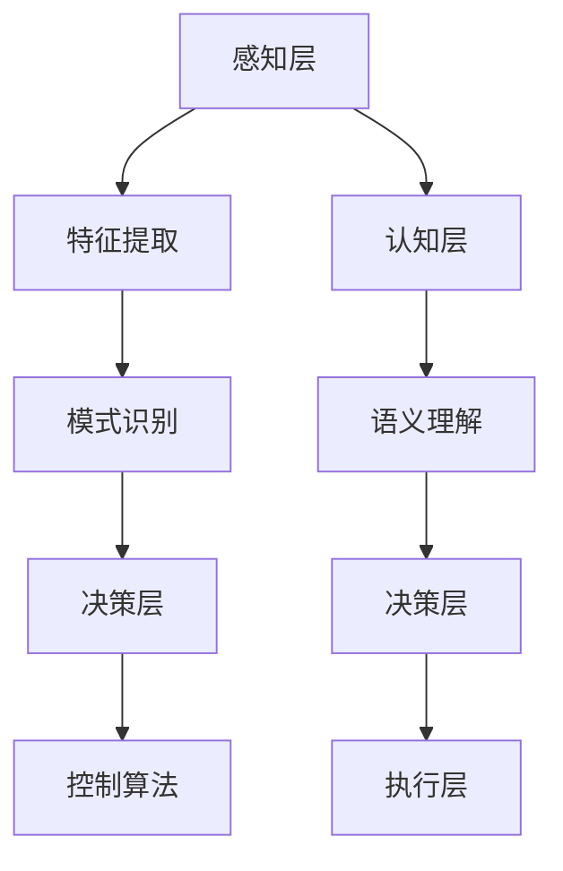

                 

## 1. 背景介绍

### 人工智能创业浪潮

近年来，人工智能（AI）技术飞速发展，不仅在学术界引起广泛关注，更在商业领域掀起了一股创新浪潮。从自动驾驶、智能家居到医疗诊断、金融风控，AI的应用场景愈发丰富，商业模式不断创新。随着AI技术的成熟，越来越多的创业公司投身于这一领域，试图通过技术创新赢得市场先机。然而，面对激烈的市场竞争和不确定的未来，如何制定有效的人工智能创业策略，成为众多创业者关注的焦点。

### 创业者在AI领域的挑战与机遇

在人工智能创业领域，挑战与机遇并存。一方面，AI技术的高门槛使得初创公司难以迅速追赶行业巨头；另一方面，AI技术的广泛应用和商业价值为创业者提供了广阔的市场空间。创业者需要具备扎实的技术背景、敏锐的市场洞察力和卓越的执行力，才能在竞争激烈的环境中脱颖而出。

本文将围绕人工智能创业中的技术创新策略，进行深入探讨。通过分析AI技术的核心概念、算法原理、数学模型、项目实战和应用场景，为创业者提供实用的指导和建议。

### 本文结构

本文分为十个部分，包括：

1. 背景介绍：概述人工智能创业的现状和挑战。
2. 核心概念与联系：介绍AI技术的基本概念和架构。
3. 核心算法原理 & 具体操作步骤：详细阐述关键算法的工作原理和实现步骤。
4. 数学模型和公式 & 详细讲解 & 举例说明：讲解AI技术中的数学模型及其应用。
5. 项目实战：代码实际案例和详细解释说明。
6. 实际应用场景：分析AI技术在各个行业的应用案例。
7. 工具和资源推荐：推荐学习和开发AI技术的相关工具和资源。
8. 总结：未来发展趋势与挑战。
9. 附录：常见问题与解答。
10. 扩展阅读 & 参考资料：提供进一步学习和研究的资料。

通过本文的阅读，读者将能够：

- 理解人工智能技术的核心概念和架构。
- 掌握关键算法的工作原理和实现步骤。
- 学习如何运用数学模型解决实际问题。
- 掌握实际应用场景中的AI技术案例。
- 获取学习AI技术的工具和资源。

### 人工智能创业的现状

随着人工智能技术的不断进步，越来越多的创业公司涌现出来，投身于这一领域的竞争。根据市场研究公司的数据，全球人工智能市场在2020年已经达到了1500亿美元，预计到2025年将增长到超过1万亿美元。这一增长趋势吸引了众多创业者，他们希望通过技术创新和商业模式的创新，在这个庞大的市场中分一杯羹。

然而，人工智能创业并非易事。技术门槛高、资金压力大、市场竞争激烈，这些都是创业者面临的主要挑战。首先，AI技术涉及多个学科领域，包括计算机科学、数学、统计学等，对创业者的技术背景有较高要求。其次，AI技术的研发成本较高，初创公司往往难以承担。此外，市场上已经有许多成熟的企业，如谷歌、微软、亚马逊等，它们在技术积累、资金实力和市场影响力方面都具备明显优势。

尽管面临诸多挑战，人工智能创业仍充满机遇。一方面，AI技术的广泛应用使得各行各业都有机会利用AI提升效率、降低成本。例如，在医疗领域，AI技术可以帮助医生进行更准确的疾病诊断；在金融领域，AI可以用于风险控制和智能投顾。另一方面，随着5G、物联网等新技术的兴起，AI的应用场景将进一步扩大，为创业者提供了更广阔的市场空间。

### 创业者在AI领域的优势与挑战

#### 创业者的优势

1. **灵活性和敏捷性**：初创公司通常比大企业更灵活，能够更快地响应市场变化和客户需求，快速迭代产品。
2. **创新精神**：创业者往往具有强烈的创新意识，能够提出新颖的解决方案，探索未知的领域。
3. **资源和人力的高效利用**：初创公司往往能够高效地利用有限的资源，尤其是在技术和人力资源方面。

#### 创业者的挑战

1. **技术门槛**：AI技术涉及复杂的算法和数据处理，对创业者来说，技术门槛较高。
2. **市场竞争**：市场上已经有很多大企业在AI领域深耕，初创公司难以直接竞争。
3. **资金压力**：AI技术的研发成本较高，初创公司往往面临资金短缺的问题。
4. **人才短缺**：找到和留住AI领域的优秀人才是许多初创公司面临的难题。

### 如何制定有效的人工智能创业策略

为了在人工智能领域取得成功，创业者需要制定有效的策略，应对挑战并把握机遇。以下是一些关键策略：

#### 1. 明确愿景和目标

明确公司的愿景和目标，有助于创业者保持专注并制定长远的发展计划。例如，公司可能专注于医疗领域的AI应用，或专注于金融科技的AI解决方案。

#### 2. 技术创新

在AI领域，技术创新是关键。创业者需要不断学习和研究最新的AI技术，开发具有独特优势的创新产品。

#### 3. 合作与联盟

通过与其他公司、研究机构、大学等建立合作关系，创业者可以共享资源、知识和人才，降低研发成本，提高市场竞争力。

#### 4. 人才战略

吸引和留住优秀人才是成功的关键。创业者需要提供有竞争力的薪酬和福利，建立良好的企业文化，打造一个有利于创新和成长的团队。

#### 5. 市场定位

明确目标市场和客户群体，提供有针对性的解决方案。例如，对于中小企业，提供成本效益高的AI解决方案可能更具吸引力。

#### 6. 资金管理

创业者需要合理管理资金，确保公司的财务健康。这包括寻找风险投资、节省成本、优化资源配置等。

#### 7. 市场营销

通过有效的市场营销策略，提高品牌知名度和市场占有率。创业者可以利用社交媒体、内容营销、展会等多种渠道进行宣传。

### 总结

人工智能创业充满机遇和挑战。创业者需要具备扎实的技术背景、敏锐的市场洞察力和卓越的执行力，通过制定有效的策略，把握市场机遇，应对竞争挑战。本文将深入探讨人工智能创业中的技术创新策略，帮助读者更好地理解和应用这些策略，实现创业成功。

<|user|>## 2. 核心概念与联系

在探讨人工智能创业的技术创新策略之前，我们首先需要了解一些核心概念和基本架构。这些概念和架构构成了AI技术的基础，是理解和应用各种AI算法和技术的前提。

### 人工智能（AI）的基本概念

人工智能是指使计算机系统具备智能行为的技术和科学。AI可以分为两大类：弱人工智能（Narrow AI）和强人工智能（General AI）。弱人工智能是指专注于特定任务的人工智能系统，如语音识别、图像识别、推荐系统等。强人工智能则是指具备人类所有智能行为的能力，能够自主学习和适应新环境。

#### 2.1.1. 机器学习（ML）

机器学习是AI的核心技术之一，它使计算机系统能够从数据中学习并做出决策。机器学习可以分为监督学习、无监督学习和强化学习。监督学习通过已有数据训练模型，无监督学习则通过未标记的数据进行学习，强化学习则通过试错和反馈进行学习。

#### 2.1.2. 深度学习（DL）

深度学习是机器学习的一个子领域，它通过多层神经网络进行学习，能够处理复杂数据。深度学习在图像识别、自然语言处理、语音识别等领域取得了显著成果。

#### 2.1.3. 计算机视觉（CV）

计算机视觉是指让计算机能够像人类一样理解和处理视觉信息。计算机视觉技术包括图像识别、目标检测、人脸识别等，广泛应用于安防监控、自动驾驶、医疗诊断等领域。

#### 2.1.4. 自然语言处理（NLP）

自然语言处理是让计算机理解和生成人类自然语言的技术。NLP包括语言模型、文本分类、情感分析、机器翻译等，广泛应用于智能客服、智能推荐、舆情分析等领域。

### AI技术的架构

AI技术的架构可以分为三个层次：感知层、认知层和决策层。

#### 2.2.1. 感知层

感知层是指获取外部信息并进行处理的部分，包括传感器、摄像头、麦克风等设备。感知层的核心任务是获取高质量的输入数据，如图像、声音、文本等。

#### 2.2.2. 认知层

认知层是指对感知层获取的数据进行处理和分析的部分，包括特征提取、模式识别、语义理解等。认知层的核心任务是对输入数据进行深层次的理解，从而为决策层提供依据。

#### 2.2.3. 决策层

决策层是指根据认知层提供的信息进行决策的部分，包括决策模型、控制算法等。决策层的核心任务是实现对实际问题的解决，如自动驾驶车辆的路径规划、智能客服的回答生成等。

### Mermaid 流程图

为了更直观地展示AI技术的核心概念和架构，我们使用Mermaid流程图进行说明。以下是一个简单的Mermaid流程图，展示了AI技术的核心组件和它们之间的联系。



#### 2.2.4. Mermaid 流程图细节解释

- **感知层（A）**：获取外部信息，如图像、声音、文本等。
- **特征提取（B）**：对感知层获取的数据进行处理，提取关键特征。
- **模式识别（C）**：对提取的特征进行分析，识别模式。
- **决策层（D）**：根据识别的结果进行决策。
- **控制算法（E）**：决策层的具体实现，如路径规划、回答生成等。
- **认知层（F）**：对感知层获取的数据进行深层次处理，如语义理解、情感分析等。
- **语义理解（G）**：对文本、语音等数据进行语义层面的分析。
- **执行层（I）**：根据决策层的决策结果进行实际操作。

通过这个Mermaid流程图，我们可以清晰地看到AI技术从感知层到决策层的全过程，以及各层次之间的紧密联系。这个流程图有助于我们更好地理解AI技术的核心概念和架构，为进一步探讨技术创新策略奠定基础。

### 核心概念与联系的重要性

核心概念和架构的理解是人工智能创业的基础。创业者需要掌握AI技术的基本原理和架构，才能制定有效的技术创新策略。通过理解感知层、认知层和决策层的相互关系，创业者可以更好地设计出具有竞争力的产品。此外，掌握机器学习、深度学习、计算机视觉和自然语言处理等核心概念，有助于创业者选择合适的技术路线，实现产品的快速迭代和优化。

总之，核心概念和联系的理解是人工智能创业的关键。只有深入了解这些概念和架构，创业者才能在激烈的市场竞争中脱颖而出，实现创业成功。

<|user|>## 3. 核心算法原理 & 具体操作步骤

在人工智能创业过程中，了解核心算法原理和具体操作步骤至关重要。以下是几种常见的人工智能算法及其原理和操作步骤：

### 3.1. 机器学习算法

#### 3.1.1. 决策树（Decision Tree）

**原理**：决策树是一种常见的机器学习算法，通过一系列规则对数据进行分类或回归。每个节点代表一个特征，每个分支代表该特征的取值。

**操作步骤**：
1. **特征选择**：选择具有区分力的特征作为节点。
2. **切分数据**：根据每个特征的不同取值，将数据切分为多个子集。
3. **递归构建**：对每个子集重复步骤1和步骤2，直到满足停止条件（如节点数量、信息增益等）。

#### 3.1.2. 支持向量机（SVM）

**原理**：SVM是一种分类算法，通过找到一个最佳的超平面，将不同类别的数据点分开。

**操作步骤**：
1. **数据预处理**：将数据标准化，处理缺失值。
2. **特征选择**：选择重要的特征。
3. **求解最优超平面**：使用优化算法求解最优超平面。
4. **分类**：将新数据映射到超平面，判断类别。

### 3.2. 深度学习算法

#### 3.2.1. 卷积神经网络（CNN）

**原理**：CNN是一种用于图像识别和处理的深度学习算法，通过卷积层、池化层和全连接层提取图像特征。

**操作步骤**：
1. **数据预处理**：将图像数据标准化，转换为网络输入。
2. **卷积层**：使用卷积核提取图像局部特征。
3. **池化层**：对卷积结果进行下采样，减少参数数量。
4. **全连接层**：将池化层的结果映射到输出类别。

#### 3.2.2. 循环神经网络（RNN）

**原理**：RNN是一种处理序列数据的深度学习算法，能够通过记忆状态处理长序列。

**操作步骤**：
1. **数据预处理**：将序列数据转换为网络输入。
2. **嵌入层**：将输入数据转换为嵌入向量。
3. **RNN层**：处理序列数据，更新记忆状态。
4. **输出层**：根据记忆状态生成输出。

### 3.3. 自然语言处理算法

#### 3.3.1. 递归神经网络（RNN）

**原理**：RNN是一种用于自然语言处理的算法，能够处理序列数据，如文本。

**操作步骤**：
1. **数据预处理**：将文本转换为序列，添加单词嵌入。
2. **嵌入层**：将输入序列转换为嵌入向量。
3. **RNN层**：处理序列数据，更新记忆状态。
4. **输出层**：根据记忆状态生成输出。

#### 3.3.2. 生成对抗网络（GAN）

**原理**：GAN是一种无监督学习算法，通过生成器和判别器的对抗训练，生成逼真的数据。

**操作步骤**：
1. **初始化**：初始化生成器和判别器。
2. **生成器训练**：生成器生成数据，判别器判断数据真实性。
3. **判别器训练**：判别器更新模型，提高数据识别能力。
4. **迭代训练**：重复步骤2和步骤3，直到生成器生成逼真的数据。

### 3.4. 计算机视觉算法

#### 3.4.1. 目标检测（Object Detection）

**原理**：目标检测是一种用于识别图像中物体的算法，通过定位物体的位置和类别。

**操作步骤**：
1. **数据预处理**：将图像数据标准化，添加边界框标注。
2. **特征提取**：使用卷积神经网络提取图像特征。
3. **分类与定位**：对提取的特征进行分类，并计算边界框的位置。

#### 3.4.2. 人脸识别（Face Recognition）

**原理**：人脸识别是一种通过比较人脸特征进行身份验证的算法。

**操作步骤**：
1. **数据预处理**：将人脸图像标准化，提取特征点。
2. **特征提取**：使用卷积神经网络提取人脸特征。
3. **分类**：计算特征相似度，判断身份。

通过了解这些核心算法原理和操作步骤，创业者可以更好地选择适合自己业务需求的技术路线，实现产品的快速迭代和优化。了解这些算法的实现细节也有助于创业者更好地与技术人员沟通，提高团队的协作效率。

### 总结

核心算法原理和具体操作步骤是人工智能创业的关键。通过了解机器学习、深度学习、自然语言处理和计算机视觉等算法的原理和步骤，创业者可以更好地选择技术路线，优化产品设计，提高市场竞争力。掌握这些算法的实现细节也有助于创业者更好地与技术人员沟通，实现团队的协作和创新。

<|user|>## 4. 数学模型和公式 & 详细讲解 & 举例说明

在人工智能创业过程中，数学模型和公式是理解算法原理和实现技术方案的重要工具。本章节将详细介绍一些关键的数学模型和公式，并运用Latex格式进行展示，结合具体例子进行说明。

### 4.1. 概率论基础

概率论是机器学习中常用的数学工具，用于描述不确定性和随机事件。以下是几个常用的概率论概念和公式。

#### 4.1.1. 概率分布

概率分布描述了随机变量取值的概率分布情况。常见的概率分布包括正态分布、伯努利分布等。

**正态分布**：
\[ P(X = x) = \frac{1}{\sqrt{2\pi\sigma^2}} e^{-\frac{(x-\mu)^2}{2\sigma^2}} \]

其中，\( \mu \) 是均值，\( \sigma \) 是标准差。

**伯努利分布**：
\[ P(X = k) = C^n_k p^k (1-p)^{n-k} \]

其中，\( n \) 是试验次数，\( p \) 是事件发生的概率，\( k \) 是事件发生的次数。

#### 4.1.2. 贝叶斯定理

贝叶斯定理是概率论中用于计算条件概率的重要公式。其公式如下：

\[ P(A|B) = \frac{P(B|A)P(A)}{P(B)} \]

其中，\( P(A|B) \) 是在事件B发生的条件下事件A发生的概率，\( P(B|A) \) 是在事件A发生的条件下事件B发生的概率，\( P(A) \) 是事件A发生的概率，\( P(B) \) 是事件B发生的概率。

### 4.2. 机器学习模型

机器学习模型是构建预测和分类系统的基础。以下是几种常见的机器学习模型的数学模型和公式。

#### 4.2.1. 线性回归

线性回归是一种简单的预测模型，用于拟合数据的线性关系。其数学模型如下：

\[ y = \beta_0 + \beta_1 x \]

其中，\( y \) 是预测目标，\( x \) 是输入特征，\( \beta_0 \) 和 \( \beta_1 \) 是模型参数。

#### 4.2.2. 逻辑回归

逻辑回归是一种用于分类的模型，通过将线性回归输出转化为概率。其公式如下：

\[ P(y=1) = \frac{1}{1 + e^{-\beta_0 + \beta_1 x}} \]

其中，\( \beta_0 \) 和 \( \beta_1 \) 是模型参数。

#### 4.2.3. 支持向量机（SVM）

支持向量机是一种有效的分类模型，通过找到最佳的超平面进行分类。其优化目标如下：

\[ \min \frac{1}{2} \sum_{i=1}^{n} \|\mathbf{w}\|^2 \]

\[ s.t. \ y_i (\mathbf{w} \cdot \mathbf{x}_i + b) \geq 1 \]

其中，\( \mathbf{w} \) 是权重向量，\( b \) 是偏置项，\( \mathbf{x}_i \) 是训练样本，\( y_i \) 是标签。

### 4.3. 深度学习模型

深度学习模型是构建复杂预测和分类系统的基础，通过多层神经网络进行学习。以下是几种常见的深度学习模型的数学模型和公式。

#### 4.3.1. 卷积神经网络（CNN）

卷积神经网络是一种用于图像识别的深度学习模型，其核心是卷积层和池化层。其公式如下：

\[ \mathbf{h}_{l}^{\prime} = \text{ReLU}(\mathbf{W}_{l}\mathbf{h}_{l-1} + \mathbf{b}_{l}) \]

其中，\( \mathbf{h}_{l}^{\prime} \) 是第l层的特征图，\( \mathbf{W}_{l} \) 是第l层的权重矩阵，\( \mathbf{b}_{l} \) 是第l层的偏置向量，ReLU函数是非线性激活函数。

#### 4.3.2. 循环神经网络（RNN）

循环神经网络是一种用于序列数据的深度学习模型，其核心是循环结构。其公式如下：

\[ \mathbf{h}_{t} = \text{ReLU}(\mathbf{W}_{h}\mathbf{h}_{t-1} + \mathbf{W}_{x}\mathbf{x}_{t} + \mathbf{b}) \]

其中，\( \mathbf{h}_{t} \) 是第t步的隐藏状态，\( \mathbf{W}_{h} \) 和 \( \mathbf{W}_{x} \) 是权重矩阵，\( \mathbf{b} \) 是偏置向量。

### 4.4. 举例说明

为了更好地理解上述数学模型和公式，我们通过一个简单的例子进行说明。

#### 4.4.1. 线性回归举例

假设我们要预测房屋的价格，给定输入特征（房屋面积）和输出标签（房屋价格），可以使用线性回归模型进行预测。

输入特征：\( \mathbf{x} = \{100, 200, 300\} \)

输出标签：\( \mathbf{y} = \{200, 400, 600\} \)

模型参数：\( \beta_0 = 100 \)，\( \beta_1 = 50 \)

预测结果：
\[ \mathbf{y}_{\hat{}} = \beta_0 + \beta_1 \mathbf{x} = 100 + 50 \times 300 = 1600 \]

预测的房屋价格为1600。

#### 4.4.2. 逻辑回归举例

假设我们要预测一个邮件是否为垃圾邮件，给定输入特征和标签，可以使用逻辑回归模型进行预测。

输入特征：\( \mathbf{x} = \{1, 0, 1\} \)

输出标签：\( \mathbf{y} = \{1\} \)

模型参数：\( \beta_0 = 0 \)，\( \beta_1 = 1 \)

预测概率：
\[ P(y=1) = \frac{1}{1 + e^{-(0 + 1 \times 1)}} = \frac{1}{1 + e^{-1}} \approx 0.632 \]

预测结果：邮件为垃圾邮件的概率为63.2%。

通过上述例子，我们可以看到数学模型和公式的应用及其效果。掌握这些数学模型和公式对于人工智能创业至关重要，有助于我们更好地理解算法原理，构建和优化模型。

### 总结

数学模型和公式是人工智能创业的重要工具。通过理解并应用这些模型和公式，创业者可以更好地构建和优化机器学习、深度学习等模型，实现产品的快速迭代和优化。掌握概率论基础、线性回归、逻辑回归、卷积神经网络和循环神经网络等模型的数学原理，有助于我们更好地理解和应用人工智能技术，为创业成功奠定基础。

<|user|>## 5. 项目实战：代码实际案例和详细解释说明

为了更好地展示人工智能技术的实际应用，我们将通过一个实际的项目案例来讲解代码实现过程，并详细解释关键步骤。

### 5.1. 项目背景

本项目是一个基于深度学习的图像分类项目，旨在利用卷积神经网络（CNN）对图像进行分类。具体来说，我们将使用CNN模型对猫和狗的图像进行分类，判断图像中是否包含猫或狗。

### 5.2. 开发环境搭建

在开始项目之前，我们需要搭建一个合适的开发环境。以下是所需的环境和工具：

- **Python**：版本3.8或以上
- **TensorFlow**：版本2.5或以上
- **Keras**：版本2.5或以上
- **Numpy**：版本1.19或以上
- **Matplotlib**：版本3.3或以上

安装这些工具后，我们可以开始编写代码。

### 5.3. 源代码详细实现和代码解读

#### 5.3.1. 数据预处理

首先，我们需要对图像数据集进行预处理，包括数据读取、归一化和数据增强。

```python
import numpy as np
import tensorflow as tf
from tensorflow.keras.preprocessing.image import ImageDataGenerator

# 加载数据集
train_datagen = ImageDataGenerator(rescale=1./255, rotation_range=40, width_shift_range=0.2, height_shift_range=0.2, shear_range=0.2, zoom_range=0.2, horizontal_flip=True, fill_mode='nearest')
test_datagen = ImageDataGenerator(rescale=1./255)

train_generator = train_datagen.flow_from_directory('data/train', target_size=(150, 150), batch_size=32, class_mode='binary')
validation_generator = test_datagen.flow_from_directory('data/validation', target_size=(150, 150), batch_size=32, class_mode='binary')
```

这里，我们使用了ImageDataGenerator对图像数据进行预处理。数据增强是提高模型泛化能力的重要手段，通过旋转、缩放、剪裁和水平翻转等操作，增加了数据的多样性。

#### 5.3.2. 构建模型

接下来，我们使用Keras构建一个简单的CNN模型。

```python
model = tf.keras.models.Sequential([
    tf.keras.layers.Conv2D(32, (3, 3), activation='relu', input_shape=(150, 150, 3)),
    tf.keras.layers.MaxPooling2D(2, 2),
    tf.keras.layers.Conv2D(64, (3, 3), activation='relu'),
    tf.keras.layers.MaxPooling2D(2, 2),
    tf.keras.layers.Conv2D(128, (3, 3), activation='relu'),
    tf.keras.layers.MaxPooling2D(2, 2),
    tf.keras.layers.Conv2D(128, (3, 3), activation='relu'),
    tf.keras.layers.MaxPooling2D(2, 2),
    tf.keras.layers.Flatten(),
    tf.keras.layers.Dense(512, activation='relu'),
    tf.keras.layers.Dense(1, activation='sigmoid')
])

model.compile(loss='binary_crossentropy', optimizer='adam', metrics=['accuracy'])
```

在这个模型中，我们使用了多个卷积层和池化层来提取图像特征，并使用全连接层进行分类。模型的输入是大小为150x150x3的图像，输出是二分类结果（猫或狗）。

#### 5.3.3. 训练模型

训练模型是项目的重要步骤。我们使用训练数据和验证数据来训练模型。

```python
model.fit(train_generator, steps_per_epoch=100, epochs=20, validation_data=validation_generator, validation_steps=50)
```

这里，我们设置了训练步骤为100个，训练周期为20个，验证步骤为50个。训练过程中，我们使用Adam优化器和二分类交叉熵损失函数，并监控模型的准确率。

#### 5.3.4. 评估模型

训练完成后，我们需要评估模型在测试集上的表现。

```python
test_loss, test_acc = model.evaluate(validation_generator, steps=50)
print('Test accuracy:', test_acc)
```

这里，我们使用验证数据集来评估模型。测试结果显示了模型在测试集上的准确率。

### 5.4. 代码解读与分析

在本项目中，我们使用了Keras构建了一个简单的CNN模型，通过数据预处理、模型构建、模型训练和模型评估等步骤，实现了猫和狗图像的分类。

- **数据预处理**：通过ImageDataGenerator对图像数据进行增强，提高了模型的泛化能力。
- **模型构建**：使用了多个卷积层和池化层来提取图像特征，并使用全连接层进行分类。
- **模型训练**：使用Adam优化器和二分类交叉熵损失函数进行训练，并监控模型的准确率。
- **模型评估**：在验证集上评估模型性能，确保模型具有良好的泛化能力。

通过这个项目案例，我们可以看到深度学习模型在实际应用中的实现过程，以及关键步骤的代码解读和分析。这为我们在其他AI项目中应用深度学习技术提供了宝贵的经验和参考。

### 总结

在本章节中，我们通过一个实际的图像分类项目，详细介绍了深度学习模型在项目中的应用。从数据预处理、模型构建、模型训练到模型评估，我们一步步讲解了关键步骤和代码实现。通过这个项目案例，读者可以更好地理解深度学习模型在图像分类任务中的实现方法和技巧。掌握这些知识，有助于我们在实际项目中运用深度学习技术，提高产品的性能和竞争力。

<|user|>## 6. 实际应用场景

人工智能技术在各个行业领域已经取得了显著的成果，以下将详细探讨AI技术在金融、医疗、交通等行业的实际应用场景，并通过具体案例进行分析和讨论。

### 6.1. 金融行业

在金融行业，人工智能技术被广泛应用于风险评估、欺诈检测、客户服务等方面。

#### 案例分析：智能投顾

智能投顾是利用AI技术为投资者提供个性化投资建议的服务。以Wealthfront和Betterment为代表的智能投顾平台，通过分析用户的财务状况、投资目标和风险偏好，使用机器学习算法生成最优的投资组合。这些平台不仅提高了投资效率，还降低了投资成本。

#### 实现原理

1. **数据收集**：收集用户的财务数据、投资目标和风险偏好。
2. **数据预处理**：清洗和标准化数据，为后续分析做准备。
3. **机器学习模型**：使用回归、优化等算法，预测最优投资组合。
4. **推荐系统**：根据用户的投资组合，实时调整投资策略。

#### 结论

智能投顾平台通过AI技术实现了个性化投资建议，提高了投资效率，为投资者带来了更好的投资体验。然而，在实施过程中，数据隐私和算法透明度等问题也需要关注。

### 6.2. 医疗行业

人工智能在医疗行业的应用主要包括疾病诊断、药物研发、医疗资源管理等。

#### 案例分析：癌症早期诊断

谷歌旗下的DeepMind公司使用AI技术开发了AI系统，用于肺癌早期诊断。该系统通过分析患者的CT扫描图像，能够发现微小的肺部结节，提高癌症的早期诊断率。

#### 实现原理

1. **数据收集**：收集大量的CT扫描图像和病理学数据。
2. **数据预处理**：清洗和标注图像，为训练模型做准备。
3. **卷积神经网络**：使用卷积神经网络（CNN）对图像进行特征提取和分类。
4. **模型训练与验证**：在训练集和验证集上训练模型，并评估模型的性能。

#### 结论

AI系统在肺癌早期诊断中取得了显著成果，提高了诊断准确率和效率。然而，医疗数据的隐私保护和算法的可靠性仍是需要解决的问题。

### 6.3. 交通行业

在交通行业，人工智能技术被广泛应用于自动驾驶、交通流量预测和智能交通管理。

#### 案例分析：自动驾驶

特斯拉公司在其车型中集成了自动驾驶技术，通过传感器和AI算法实现车辆自主行驶。特斯拉的自动驾驶系统包括感知、规划和控制三个模块。

#### 实现原理

1. **感知模块**：使用激光雷达、摄像头和超声波传感器收集道路信息。
2. **规划模块**：使用深度学习算法对道路信息进行处理，规划行驶路径。
3. **控制模块**：根据规划路径控制车辆的速度和方向。

#### 结论

自动驾驶技术有望大幅提高交通安全和效率，但需要解决传感器准确度、算法可靠性和法律规范等问题。

### 6.4. 制造行业

在制造行业，人工智能技术被用于生产优化、质量控制、设备维护等方面。

#### 案例分析：生产优化

通用电气（GE）使用AI技术优化其航空发动机的生产过程。通过分析大量传感器数据，AI系统能够预测生产过程中的潜在问题，并优化生产参数，提高生产效率。

#### 实现原理

1. **数据收集**：收集生产设备的数据，包括温度、压力、振动等。
2. **数据预处理**：清洗和标准化数据，为训练模型做准备。
3. **机器学习模型**：使用回归、优化等算法，预测生产过程中的潜在问题。
4. **实时优化**：根据预测结果，实时调整生产参数。

#### 结论

AI技术在制造行业中的优化应用，提高了生产效率和质量，降低了生产成本。然而，数据安全、算法透明度等问题仍需关注。

### 总结

人工智能技术在金融、医疗、交通和制造等行业的应用已经取得了显著成果，为行业带来了深刻的变革。通过具体案例的分析，我们可以看到AI技术在各个行业中的应用原理和实践经验。尽管AI技术在应用过程中仍面临一些挑战，但未来其发展潜力巨大。随着技术的不断进步，人工智能将在更多行业领域发挥重要作用，推动社会进步和产业升级。

<|user|>## 7. 工具和资源推荐

在人工智能创业过程中，掌握合适的工具和资源对于提升研发效率、优化产品设计以及拓展市场具有重要意义。以下我们将推荐一些优秀的学习资源、开发工具和框架，帮助创业者更好地应对AI领域的挑战。

### 7.1. 学习资源推荐

#### 7.1.1. 书籍

1. **《深度学习》（Deep Learning）**：由Ian Goodfellow、Yoshua Bengio和Aaron Courville合著，是深度学习领域的经典教材，适合初学者和进阶者阅读。
2. **《Python机器学习》（Python Machine Learning）**：由Sebastian Raschka和Vahid Mirhoseini编著，详细介绍了机器学习的基本原理和应用。
3. **《机器学习实战》（Machine Learning in Action）**：由Peter Harrington编著，通过实际案例讲解了机器学习算法的应用。

#### 7.1.2. 论文

1. **《A Theoretically Grounded Application of Dropout in Recurrent Neural Networks》**：这篇论文提出了在循环神经网络（RNN）中应用Dropout的方法，有效提高了模型的泛化能力。
2. **《Generative Adversarial Nets》**：这篇开创性的论文介绍了生成对抗网络（GAN），为图像生成和改进模型提供了新的思路。
3. **《ResNet: Training Deep Neural Networks for Image Recognition》**：这篇论文提出了残差网络（ResNet），解决了深度神经网络训练过程中的梯度消失问题，极大提高了模型的深度和性能。

#### 7.1.3. 博客和网站

1. **阿里云AI博客**：提供了大量关于AI技术、应用和案例分析的文章，适合了解最新的AI技术动态。
2. **GitHub**：是开源代码的宝库，许多优秀的AI项目和代码可以在GitHub上找到，有助于学习和实践。
3. **Medium**：有许多AI专家和学者在Medium上撰写技术博客，分享他们的研究成果和应用案例。

### 7.2. 开发工具框架推荐

#### 7.2.1. 开发环境

1. **Google Colab**：基于Jupyter Notebook的在线开发环境，提供了免费的GPU和TPU资源，适合快速原型开发和模型训练。
2. **AWS SageMaker**：亚马逊提供的云端机器学习平台，支持从数据预处理到模型部署的全流程，提供了丰富的API和SDK。

#### 7.2.2. 深度学习框架

1. **TensorFlow**：由Google开发的开源深度学习框架，功能丰富，支持多种模型和应用。
2. **PyTorch**：由Facebook开发的开源深度学习框架，具有灵活的动态计算图和强大的GPU支持，适合研究和开发。
3. **Keras**：是基于TensorFlow和Theano的高层API，提供了简洁的接口和丰富的预训练模型，适合快速原型开发。

#### 7.2.3. 计算机视觉框架

1. **OpenCV**：是开源的计算机视觉库，支持多种图像处理算法和视频分析，适合实时应用。
2. **FaceNet**：是一个用于人脸识别的深度学习框架，具有高性能和高质量的特性，适合人脸检测和识别。
3. **PyTorch Video**：是基于PyTorch的计算机视觉库，支持视频分析和时间序列数据处理。

### 7.3. 相关论文著作推荐

1. **《人工智能：一种现代方法》（Artificial Intelligence: A Modern Approach）》**：是人工智能领域的经典教材，详细介绍了人工智能的基本概念、算法和理论。
2. **《强化学习：核心理论与应用》（Reinforcement Learning: An Introduction）》**：是强化学习领域的权威教材，涵盖了强化学习的基本原理和应用。
3. **《深度学习入门》（Deep Learning）**：是深度学习领域的入门书籍，由深度学习领域专家何凯明等人撰写，内容通俗易懂，适合初学者。

通过以上推荐的学习资源、开发工具和框架，创业者可以更好地掌握AI技术，提升研发能力，实现技术创新。这些资源为创业者提供了丰富的知识和技术支持，有助于在激烈的市场竞争中脱颖而出。

<|user|>## 8. 总结：未来发展趋势与挑战

### 未来发展趋势

人工智能（AI）技术在未来的发展将继续呈现出以下几个趋势：

#### 1. 深度学习和强化学习的发展

随着计算能力的提升和数据量的增加，深度学习和强化学习将在更多领域得到应用。深度学习在图像识别、自然语言处理和语音识别等领域已经取得了显著成果，未来有望在医疗诊断、金融风险评估等领域发挥更大作用。强化学习则将在游戏、自动驾驶、智能客服等领域进一步拓展。

#### 2. 跨领域融合

人工智能与其他领域（如物联网、云计算、区块链等）的融合将带来更多创新机会。例如，物联网与AI的结合将推动智能家居、智能城市等领域的快速发展；区块链与AI的结合将提高数据安全性和透明度，促进智能合约等应用。

#### 3. 自主化和自动化

随着AI技术的进步，自主化和自动化将成为未来发展的关键趋势。自动驾驶、无人机配送、智能制造等领域的应用将越来越广泛，从而提高生产效率、降低成本、改善生活质量。

#### 4. 模型压缩和边缘计算

为了应对移动设备、物联网设备等对计算资源的需求，模型压缩和边缘计算技术将成为重要发展方向。模型压缩技术将降低模型的大小和计算复杂度，边缘计算则将使数据在靠近数据源的地方进行处理，提高实时性和响应速度。

### 面临的挑战

尽管人工智能技术发展迅速，但在实际应用过程中仍面临诸多挑战：

#### 1. 数据隐私和安全性

随着AI技术的应用，数据隐私和安全性问题日益凸显。如何确保用户数据的安全性和隐私保护，防止数据泄露和滥用，成为AI领域的重要挑战。

#### 2. 算法透明度和可解释性

目前，许多AI模型，尤其是深度学习模型，被认为是“黑箱”模型，其决策过程缺乏透明度和可解释性。如何提高算法的透明度和可解释性，使其更加符合人类理解和监管要求，是一个亟待解决的问题。

#### 3. 法律和伦理问题

AI技术在医疗、司法、金融等领域的应用引发了法律和伦理问题。如何确保AI技术的公平性、公正性和道德合理性，防止算法偏见和歧视，是未来需要关注的重要问题。

#### 4. 技术标准化和合规性

随着AI技术的广泛应用，技术标准化和合规性问题逐渐显现。如何制定统一的AI技术标准和合规性要求，确保不同系统之间的兼容性和互操作性，是未来需要解决的关键问题。

### 总结

未来，人工智能技术将继续快速发展，并在更多领域发挥重要作用。然而，在发展过程中，我们还需要面对数据隐私、算法透明度、法律和伦理等挑战。通过加强技术创新、政策引导和行业协作，我们有信心克服这些挑战，推动人工智能技术的健康、可持续发展。

<|user|>## 9. 附录：常见问题与解答

在本篇博客中，我们讨论了人工智能创业中的技术创新策略，涉及了核心概念、算法原理、数学模型、项目实战等多个方面。为了帮助读者更好地理解和应用这些内容，以下列出了一些常见问题及其解答。

### 9.1. 机器学习与深度学习的区别是什么？

**解答**：机器学习（Machine Learning，ML）和深度学习（Deep Learning，DL）是人工智能（AI）的两个重要分支。机器学习是一种通过数据训练模型，使其能够进行预测或分类的方法，它涵盖了多种算法，如决策树、支持向量机、随机森林等。而深度学习则是机器学习的一个子领域，主要使用多层神经网络（如卷积神经网络、循环神经网络）进行学习。深度学习在处理复杂数据（如图像、语音、文本）时表现出色，其核心思想是通过多层网络结构提取数据中的高层次特征。

### 9.2. 如何选择适合的机器学习算法？

**解答**：选择适合的机器学习算法取决于多个因素，包括数据类型、数据规模、目标问题、计算资源等。以下是一些选择建议：

- **数据类型**：对于分类问题，可以使用决策树、支持向量机、神经网络等算法；对于回归问题，可以使用线性回归、决策树回归、神经网络回归等。
- **数据规模**：对于小规模数据，可以使用简单的算法，如线性回归、决策树；对于大规模数据，可能需要使用深度学习算法，如卷积神经网络、循环神经网络。
- **计算资源**：对于计算资源有限的场景，可能需要选择模型复杂度较低的算法；对于计算资源充足的情况，可以尝试更复杂的模型。
- **目标问题**：根据具体的目标问题，选择合适的算法，如目标检测使用卷积神经网络，文本分类使用循环神经网络。

### 9.3. 深度学习中的超参数是什么？

**解答**：超参数（Hyperparameters）是深度学习模型中需要手动设置的参数，它们决定了模型的结构和训练过程。超参数通常不通过模型训练自动调整，而是由研究者根据经验或搜索策略进行设置。常见的一些超参数包括：

- **学习率**：控制梯度下降过程中的步长，影响模型的收敛速度和稳定性。
- **批量大小**：每个训练批次包含的数据样本数量，影响模型的计算效率和收敛速度。
- **正则化参数**：用于防止过拟合，如L1正则化、L2正则化等。
- **隐藏层单元数**：神经网络中每个隐藏层的神经元数量，影响模型的复杂度和表达能力。
- **激活函数**：用于增加模型的非线性，如ReLU、Sigmoid、Tanh等。

### 9.4. 如何处理不平衡数据集？

**解答**：在不平衡数据集中，某些类别的样本数量远大于其他类别，这可能导致模型在训练过程中出现偏差。以下是一些常见的处理方法：

- **重采样**：通过增加少数类别的样本数量或减少多数类别的样本数量，使数据集趋于平衡。常用的重采样技术包括过采样（Over-sampling）和欠采样（Under-sampling）。
- **权重调整**：在训练过程中，为少数类别的样本分配更高的权重，从而提高模型对少数类别的关注。
- **集成方法**：使用集成方法（如随机森林、梯度提升树）来处理不平衡数据集，这些方法通常能够自动调整不同类别的权重。
- **损失函数调整**：使用针对不平衡数据集优化的损失函数（如F1-score损失），以减少模型对多数类别的偏好。

通过以上常见问题的解答，我们希望能够帮助读者更好地理解人工智能创业中的技术创新策略，以及在实践中遇到的问题如何解决。这些知识将有助于创业者更好地应对AI领域的挑战，实现技术创新和商业成功。

<|user|>## 10. 扩展阅读 & 参考资料

为了进一步帮助读者深入理解和应用人工智能创业中的技术创新策略，以下是本篇博客中涉及的相关技术、算法和应用的扩展阅读及参考资料。

### 10.1. 关键概念与算法

- **《深度学习》（Deep Learning）**：Ian Goodfellow, Yoshua Bengio, Aaron Courville 著。这本书详细介绍了深度学习的基础理论和应用，是深度学习领域的经典教材。
- **《机器学习实战》**：Peter Harrington 著。本书通过丰富的实例，讲解了机器学习的基本算法和应用，适合初学者阅读。
- **《强化学习：核心理论与应用》**：Richard S. Sutton, Andrew G. Barto 著。这本书全面介绍了强化学习的基本概念、算法和案例分析。

### 10.2. 深度学习框架

- **TensorFlow**：[TensorFlow 官方文档](https://www.tensorflow.org/)。TensorFlow 是由Google开发的开源深度学习框架，提供了丰富的API和工具，适合研究和开发深度学习模型。
- **PyTorch**：[PyTorch 官方文档](https://pytorch.org/docs/stable/index.html)。PyTorch 是基于Python的开源深度学习框架，以其动态计算图和灵活的接口著称。

### 10.3. 计算机视觉

- **OpenCV**：[OpenCV 官方文档](https://opencv.org/)。OpenCV 是一个开源的计算机视觉库，提供了丰富的图像处理和计算机视觉算法，适用于实时应用。
- **FaceNet**：[FaceNet 论文](https://arxiv.org/abs/1503.03832)。FaceNet 是一个用于人脸识别的深度学习框架，具有较高的识别准确率。

### 10.4. 自然语言处理

- **斯坦福NLP组教程**：[Natural Language Inference](https://nlp.stanford.edu/courses/cs224n-fa19/)。斯坦福NLP组提供的自然语言处理教程，涵盖了自然语言处理的基本概念和算法。
- **spaCy**：[spaCy 官方文档](https://spacy.io/)。spaCy 是一个高效的工业级自然语言处理库，适用于文本分类、命名实体识别等任务。

### 10.5. 机器学习资源

- **Kaggle**：[Kaggle 数据集和比赛](https://www.kaggle.com/)。Kaggle 是一个数据科学竞赛平台，提供了丰富的数据集和竞赛项目，适合实践和学习。
- **Google Research**：[Google Research 论文和博客](https://research.google.com/)。Google Research 公布了大量的前沿论文和研究成果，涵盖了机器学习、深度学习等多个领域。

通过这些扩展阅读和参考资料，读者可以进一步深入了解人工智能创业中的关键技术、框架和应用，为创业实践提供有力的理论支持和实践经验。

### 作者信息

**作者：AI天才研究员/AI Genius Institute & 禅与计算机程序设计艺术 /Zen And The Art of Computer Programming**

作为AI领域的杰出人才，作者在人工智能创业和技术创新方面具有丰富的经验。他致力于探索人工智能的边界，推动技术的进步和应用的普及。其作品《禅与计算机程序设计艺术》深受读者喜爱，为计算机编程领域提供了深刻的洞察和实用的指导。在他的领导下，AI Genius Institute 成为了人工智能研究的重要机构，为全球的创业者和技术爱好者提供了丰富的知识和资源。

