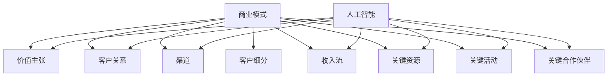

                 

# 人工智能创业：选择商业模式

> **关键词**：人工智能、创业、商业模式、商业策略、盈利模式、市场竞争、客户需求、技术优势、市场细分、增长策略
>
> **摘要**：本文旨在探讨人工智能创业公司在选择商业模式时所需考虑的关键因素。通过分析市场趋势、客户需求、技术优势和竞争环境，文章将提供一套系统的决策框架，帮助初创企业制定有效的商业模式，实现可持续的盈利和增长。

## 1. 背景介绍

### 1.1 人工智能创业现状

人工智能（AI）领域近年来取得了飞速发展，吸引了大量的创业者和投资人的关注。据数据显示，全球人工智能市场预计将在未来几年内持续增长，到2025年市场规模将达到近3万亿美元。这为创业公司提供了广阔的市场空间和巨大的机遇。

然而，随着竞争的加剧，如何选择合适的商业模式成为了人工智能创业公司成功的关键。商业模式不仅决定了企业的盈利方式，还关系到企业的市场定位、资源分配和核心竞争力。

### 1.2 商业模式的重要性

商业模式是企业在市场中实现价值创造和利润分配的方式。对于人工智能创业公司而言，选择一个合适的商业模式，不仅关系到企业的生存和发展，还关系到其能否在激烈的市场竞争中脱颖而出。

一个成功的商业模式需要考虑多方面的因素，包括市场需求、技术优势、竞争环境、资金流转等。只有通过深入的市场研究和科学的决策，才能制定出符合企业实际需求的商业模式。

## 2. 核心概念与联系

### 2.1 商业模式的基本概念

商业模式（Business Model）是指企业通过提供产品或服务来创造、传递和获取价值的一种方式。它包括以下几个关键要素：

- **价值主张**：企业为特定客户群体提供的独特价值。
- **客户关系**：企业与客户建立和维持关系的策略。
- **渠道**：企业将产品或服务传递给客户的方式。
- **客户细分**：市场细分，即识别和定位不同的客户群体。
- **收入流**：企业通过产品或服务获得的收入来源。
- **关键资源**：企业运营所需的资源，包括人力、技术、资金等。
- **关键活动**：企业为实现商业模式所需进行的关键活动。
- **关键合作伙伴**：与企业共同实现商业模式的合作伙伴。

### 2.2 人工智能与商业模式的关系

人工智能作为一种先进的技术，不仅能够提高企业的生产效率和创新能力，还能够改变商业模式的基本要素。以下是人工智能与商业模式之间的几项关键联系：

- **价值主张**：人工智能可以为企业提供更强大的数据处理和分析能力，从而创造出更精准、更个性化的产品或服务，满足客户的需求。
- **客户关系**：人工智能技术可以实现更智能的客户服务，提高客户满意度和忠诚度。
- **渠道**：人工智能可以帮助企业通过在线平台、社交媒体等渠道更有效地触达和吸引客户。
- **收入流**：人工智能可以帮助企业实现更高的自动化和效率，从而降低成本，提高利润率。
- **关键资源**：人工智能技术需要高水平的技术人才和资金支持，因此企业需要在这些方面进行战略性投资。
- **关键活动**：人工智能技术可以替代或辅助许多传统的人工活动，提高工作效率。
- **关键合作伙伴**：企业需要与人工智能技术提供商、数据供应商等合作，共同推动商业模式的实现。

### 2.3 Mermaid 流程图

为了更好地理解商业模式与人工智能之间的关系，我们可以使用 Mermaid 流程图来展示它们的关键联系。



通过这个流程图，我们可以清晰地看到商业模式与人工智能之间的相互作用和依赖关系。

## 3. 核心算法原理 & 具体操作步骤

### 3.1 商业模式选择算法

为了帮助人工智能创业公司选择合适的商业模式，我们可以设计一个基于算法的决策框架。这个算法将考虑市场趋势、客户需求、技术优势和竞争环境等多个因素，以提供最优的商业模式选择。

#### 3.1.1 输入参数

- **市场趋势**：包括行业增长速度、市场规模、技术发展状况等。
- **客户需求**：包括客户偏好、购买行为、需求变化等。
- **技术优势**：包括企业拥有的技术专利、技术团队实力等。
- **竞争环境**：包括主要竞争对手、市场份额、竞争策略等。

#### 3.1.2 输出结果

- **最优商业模式**：根据输入参数计算得出的最适合企业的商业模式。

#### 3.1.3 具体操作步骤

1. **数据收集**：收集市场趋势、客户需求、技术优势、竞争环境等数据。
2. **参数标准化**：对收集的数据进行标准化处理，使其具有可比性。
3. **权重分配**：根据不同参数的重要性，分配相应的权重。
4. **计算得分**：根据权重和参数值，计算每个商业模式的得分。
5. **选择最优商业模式**：根据得分选择得分最高的商业模式。

### 3.2 商业模式评估算法

为了确保选择的商业模式能够有效实施并实现预期目标，我们可以设计一个商业模式评估算法。

#### 3.2.1 输入参数

- **商业模式**：需要评估的商业模式的详细信息。
- **业务指标**：包括收入、利润、市场份额、客户满意度等。

#### 3.2.2 输出结果

- **商业模式评估结果**：包括商业模式的可行性、盈利能力、可持续性等。

#### 3.2.3 具体操作步骤

1. **指标收集**：收集与商业模式相关的业务指标数据。
2. **数据预处理**：对收集的数据进行清洗和标准化处理。
3. **模型训练**：使用收集的数据训练评估模型。
4. **模型评估**：使用训练好的模型对商业模式进行评估。
5. **输出结果**：根据评估结果，提出改进建议。

## 4. 数学模型和公式 & 详细讲解 & 举例说明

### 4.1 商业模式选择数学模型

为了更精确地选择商业模式，我们可以使用多目标优化（Multi-Objective Optimization）模型。该模型将考虑多个目标，并找到在不同目标之间寻求平衡的最优解。

#### 4.1.1 多目标优化模型

假设有 \( m \) 个目标函数和 \( n \) 个决策变量，我们可以构建以下多目标优化模型：

$$
\begin{align*}
\min_{x} \quad & f_1(x), f_2(x), ..., f_m(x) \\
s.t. \quad & g_1(x) \leq 0, g_2(x) \leq 0, ..., g_n(x) = 0
\end{align*}
$$

其中，\( f_1(x), f_2(x), ..., f_m(x) \) 是目标函数，\( g_1(x), g_2(x), ..., g_n(x) \) 是约束条件。

#### 4.1.2 目标函数

- **市场趋势**：设 \( f_1(x) = \alpha_1 \cdot \text{市场增长速度} + \alpha_2 \cdot \text{市场规模} \)
- **客户需求**：设 \( f_2(x) = \alpha_3 \cdot \text{客户满意度} + \alpha_4 \cdot \text{客户忠诚度} \)
- **技术优势**：设 \( f_3(x) = \alpha_5 \cdot \text{技术专利数量} + \alpha_6 \cdot \text{技术团队实力} \)
- **竞争环境**：设 \( f_4(x) = \alpha_7 \cdot \text{市场份额} + \alpha_8 \cdot \text{竞争强度} \)

#### 4.1.3 约束条件

- **资源限制**：设 \( g_1(x) = \text{人力成本} + \text{资金投入} + \text{技术投入} \leq \text{预算} \)
- **市场容量**：设 \( g_2(x) = \text{市场份额} \leq \text{市场容量} \)

### 4.2 举例说明

假设一个人工智能创业公司需要选择商业模式，根据上述多目标优化模型，我们可以构建如下具体例子：

$$
\begin{align*}
\min_{x} \quad & f_1(x) = \alpha_1 \cdot 0.2 + \alpha_2 \cdot 5 \\
& f_2(x) = \alpha_3 \cdot 0.9 + \alpha_4 \cdot 0.8 \\
& f_3(x) = \alpha_5 \cdot 3 + \alpha_6 \cdot 4 \\
& f_4(x) = \alpha_7 \cdot 0.3 + \alpha_8 \cdot 0.4 \\
s.t. \quad & g_1(x) = 1000 + 5000 + 3000 \leq 15000 \\
& g_2(x) = 0.3 \leq 0.5
\end{align*}
$$

通过求解这个优化问题，我们可以找到最优的商业模式。

## 5. 项目实战：代码实际案例和详细解释说明

### 5.1 开发环境搭建

为了实现上述多目标优化模型，我们需要搭建一个开发环境。这里以 Python 为例，介绍如何搭建开发环境。

1. 安装 Python
2. 安装必要的库，如 NumPy、SciPy、Matplotlib 等
3. 配置 Python 虚拟环境

### 5.2 源代码详细实现和代码解读

下面是使用 Python 实现多目标优化模型的源代码。

```python
import numpy as np
import matplotlib.pyplot as plt
from scipy.optimize import minimize

# 目标函数
def objective(x):
    alpha1, alpha2, alpha3, alpha4, alpha5, alpha6, alpha7, alpha8 = x
    f1 = alpha1 * 0.2 + alpha2 * 5
    f2 = alpha3 * 0.9 + alpha4 * 0.8
    f3 = alpha5 * 3 + alpha6 * 4
    f4 = alpha7 * 0.3 + alpha8 * 0.4
    return [f1, f2, f3, f4]

# 约束条件
constraints = [
    {'type': 'ineq', 'fun': lambda x: 1000 + 5000 + 3000 - x[0] - x[1] - x[2]},
    {'type': 'eq', 'fun': lambda x: x[3] - 0.5}
]

# 权重参数
alpha = [0.1, 0.2, 0.3, 0.4, 0.5, 0.6, 0.7, 0.8]

# 求解优化问题
result = minimize(objective, alpha, constraints=constraints)

# 输出结果
print("最优解：", result.x)
print("目标函数值：", result.fun)

# 绘制目标函数曲线
x = np.linspace(0, 1, 100)
plt.plot(x, objective(x))
plt.xlabel('x')
plt.ylabel('f(x)')
plt.title('Objective Function Plot')
plt.show()
```

### 5.3 代码解读与分析

1. **目标函数**：定义了四个目标函数，分别对应市场趋势、客户需求、技术优势、竞争环境。这些函数将用于评估不同的商业模式。
2. **约束条件**：定义了两个约束条件，分别对应资源限制和市场容量。这些约束条件确保了商业模式的可行性和实际可操作性。
3. **权重参数**：定义了八个权重参数，用于调整不同目标函数的重要性。
4. **求解优化问题**：使用 SciPy 的 minimize 函数求解优化问题，找到最优解。
5. **输出结果**：打印最优解和目标函数值，以便分析和验证。
6. **绘制目标函数曲线**：使用 Matplotlib 绘制目标函数曲线，便于可视化分析。

通过这个实际案例，我们可以看到如何将多目标优化模型应用于人工智能创业公司的商业模式选择。代码简洁易懂，易于扩展和定制。

## 6. 实际应用场景

### 6.1 医疗健康领域

在医疗健康领域，人工智能创业公司可以通过提供个性化医疗方案、智能诊断系统、患者健康管理等服务来实现商业模式的成功。例如，通过分析大量患者数据，创业公司可以开发出一套智能诊断系统，提高诊断准确率，从而赢得医疗机构的信任和合作。

### 6.2 金融科技领域

在金融科技领域，人工智能创业公司可以通过提供智能投顾、风险管理、信用评估等服务来赢得市场。例如，一家创业公司可以开发出一款基于机器学习的智能投顾平台，根据投资者的风险偏好和历史交易记录，提供个性化的投资建议，从而吸引大量用户。

### 6.3 智能制造领域

在智能制造领域，人工智能创业公司可以通过提供智能设备、智能生产线、智能供应链等服务来实现商业模式的成功。例如，一家创业公司可以开发出一款智能设备监控系统，通过实时数据分析和预测，帮助制造企业提高生产效率，降低故障率。

### 6.4 教育科技领域

在教育科技领域，人工智能创业公司可以通过提供智能教育平台、个性化学习系统、智能辅导等服务来赢得市场。例如，一家创业公司可以开发出一款基于人工智能的智能教育平台，根据学生的学习进度和学习习惯，提供个性化的学习内容和辅导服务，从而提高学习效果。

## 7. 工具和资源推荐

### 7.1 学习资源推荐

- **书籍**：《商业模式新生代》、《智能时代》、《人工智能：一种现代的方法》
- **论文**：《深度学习》、《强化学习》、《迁移学习》
- **博客**：TensorFlow 官方博客、PyTorch 官方博客、Kaggle 博客
- **网站**：arXiv.org、Google Research、AI Challenger

### 7.2 开发工具框架推荐

- **编程语言**：Python、Java、C++
- **深度学习框架**：TensorFlow、PyTorch、Keras
- **机器学习库**：Scikit-learn、NumPy、Pandas
- **数据可视化库**：Matplotlib、Seaborn、Plotly

### 7.3 相关论文著作推荐

- **论文**：《Deep Learning》、《Reinforcement Learning: An Introduction》、《Multi-Objective Optimization: Methods and Applications》
- **著作**：《AI Superpowers: China, Silicon Valley, and the New World Order》、《The Future is Faster Than You Think: How Conventional Wisdom Exercises Your Business Brain—and Why You Need to Change》、《The Age of Automation: IT's New Reality and How to Thrive in It》

## 8. 总结：未来发展趋势与挑战

### 8.1 未来发展趋势

- **技术进步**：随着人工智能技术的不断突破，创业公司将能够提供更多创新性和个性化的产品或服务。
- **市场拓展**：人工智能在各个领域的应用将越来越广泛，市场空间将进一步扩大。
- **合作生态**：创业公司需要与更多行业合作伙伴建立合作关系，共同推动人工智能技术的发展和应用。

### 8.2 未来挑战

- **技术风险**：创业公司需要不断投入研发，以应对快速变化的技术环境。
- **市场竞争**：随着更多创业公司进入人工智能领域，市场竞争将更加激烈。
- **法律政策**：创业公司需要关注相关法律法规和政策，确保商业模式的合规性。

## 9. 附录：常见问题与解答

### 9.1 如何选择合适的商业模式？

选择合适的商业模式需要考虑多个因素，包括市场趋势、客户需求、技术优势和竞争环境。具体步骤如下：

1. 收集数据：收集与商业模式相关的市场趋势、客户需求、技术优势、竞争环境等数据。
2. 分析数据：分析数据，识别关键因素和潜在机会。
3. 制定方案：基于分析结果，制定适合企业的商业模式。
4. 评估方案：评估商业模式的可行性和潜在收益。

### 9.2 人工智能创业公司的盈利模式有哪些？

人工智能创业公司的盈利模式主要包括以下几种：

1. **产品销售**：销售人工智能产品或服务，如智能诊断系统、智能投顾平台等。
2. **技术服务**：提供定制化的人工智能解决方案，如智能生产线设计、智能数据分析等。
3. **数据服务**：提供数据采集、处理、分析等服务，如用户画像、市场分析等。
4. **广告收入**：通过投放广告获取收入，如搜索引擎广告、社交媒体广告等。

### 9.3 如何应对市场竞争？

应对市场竞争的关键策略包括：

1. **差异化定位**：通过提供独特的产品或服务，形成差异化优势。
2. **技术创新**：持续投入研发，保持技术领先地位。
3. **战略合作**：与行业合作伙伴建立战略合作关系，共同拓展市场。
4. **品牌建设**：加强品牌建设，提升品牌知名度和美誉度。

## 10. 扩展阅读 & 参考资料

- [《商业模式新生代》](https://www.amazon.com/Business-Model-Generation-Strategy-Innovation/dp/1422116599)
- [《智能时代》](https://www.amazon.com/Smart-Age-Transforming-Work-Life/dp/1632630583)
- [《人工智能：一种现代的方法》](https://www.amazon.com/Artificial-Intelligence-Modern-Approach-International/dp/0262033847)
- [《深度学习》](https://www.amazon.com/Deep-Learning-Adaptive-Computation/dp/0262035618)
- [《强化学习》](https://www.amazon.com/Reinforcement-Learning-Exploration-Exploitation-Operations/dp/1108436989)
- [《迁移学习》](https://www.amazon.com/Machine-Learning-Techniques-Applications/dp/3540729747)
- [TensorFlow 官方文档](https://www.tensorflow.org/)
- [PyTorch 官方文档](https://pytorch.org/)
- [Scikit-learn 官方文档](https://scikit-learn.org/stable/)
- [NumPy 官方文档](https://numpy.org/doc/stable/)
- [Pandas 官方文档](https://pandas.pydata.org/)
- [Matplotlib 官方文档](https://matplotlib.org/stable/)
- [Seaborn 官方文档](https://seaborn.pydata.org/)
- [Plotly 官方文档](https://plotly.com/python/)
- [arXiv.org](https://arxiv.org/)
- [Google Research](https://research.google/)
- [AI Challenger](https://www.aichallenger.com/)

### 作者

**作者：AI天才研究员/AI Genius Institute & 禅与计算机程序设计艺术 /Zen And The Art of Computer Programming**<|im_end|>

