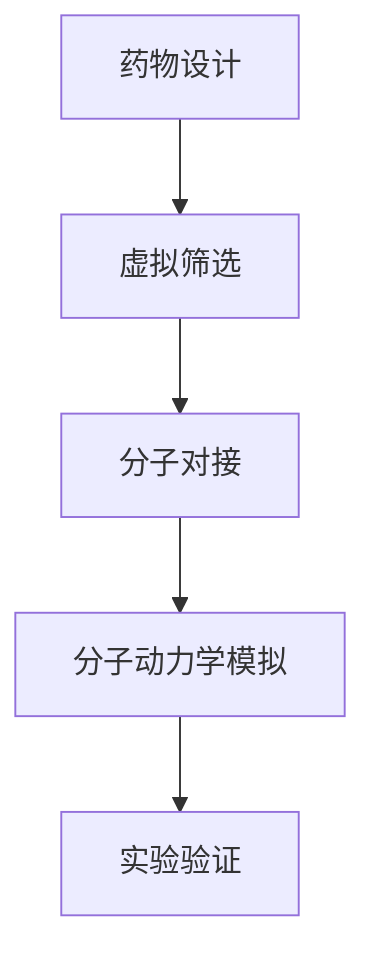

                 

# 人工智能在新药研发中的应用与前景

> **关键词：** 人工智能，新药研发，机器学习，深度学习，药物设计，生物信息学

> **摘要：** 本文探讨了人工智能（AI）在新药研发领域中的广泛应用和巨大潜力。通过分析AI在药物发现、分子模拟、疾病预测等方面的核心算法原理和具体操作步骤，展示了AI在提高研发效率、降低成本、加速药物上市时间等方面的显著优势。同时，本文还探讨了AI在新药研发中面临的挑战，以及未来发展趋势和前景。

## 1. 背景介绍

### 1.1 新药研发的挑战

新药研发是一个复杂而昂贵的过程。传统的药物研发主要依赖于实验和经验，不仅耗时耗力，而且失败率很高。根据市场调研公司的数据，一个新药从研发到上市的平均成本约为25亿美元，耗时长达10年以上。此外，新药研发过程中存在诸多挑战，如药物靶点的识别、药效评估、毒理测试等。

### 1.2 人工智能的兴起

随着人工智能技术的快速发展，特别是在机器学习和深度学习领域的突破，AI开始在新药研发中发挥重要作用。通过大数据分析和智能算法，AI能够高效地处理海量生物医学数据，识别潜在的药物靶点，预测药物的药效和毒性，从而加速新药研发过程。

## 2. 核心概念与联系

### 2.1 机器学习与深度学习

机器学习是一种使计算机通过数据和经验自动改进性能的技术。深度学习是机器学习的一个子领域，通过神经网络结构对大量数据进行自动特征提取和学习。

### 2.2 生物信息学

生物信息学是一门结合生物学、计算机科学和信息学的交叉学科，致力于解析生物数据，如基因组序列、蛋白质结构、代谢网络等。

### 2.3 药物设计

药物设计是一个通过计算机模拟和实验验证来发现和优化药物分子的过程。人工智能在药物设计中的应用主要包括：

- **虚拟筛选**：通过计算机模拟筛选大量的化合物库，识别潜在的药物候选分子。
- **分子对接**：将药物分子与靶点蛋白质进行对接模拟，评估药物的亲和力和药效。
- **分子动力学模拟**：模拟药物分子与靶点蛋白质的相互作用，预测药物的动力学性质和稳定性。

### 2.4 Mermaid 流程图



## 3. 核心算法原理 & 具体操作步骤

### 3.1 虚拟筛选

虚拟筛选是一种通过计算机模拟筛选大量化合物库的方法。具体操作步骤如下：

1. **数据库构建**：收集并整理大量的化合物数据，构建化合物数据库。
2. **特征提取**：对化合物分子进行结构特征提取，如拓扑指数、分子指纹等。
3. **模型训练**：使用机器学习算法，如支持向量机（SVM）或随机森林（Random Forest），训练化合物活性预测模型。
4. **筛选候选分子**：将化合物数据库中的化合物输入模型，筛选出具有潜在活性的分子。

### 3.2 分子对接

分子对接是一种将药物分子与靶点蛋白质进行对接模拟的方法。具体操作步骤如下：

1. **结构准备**：获取药物分子和靶点蛋白质的三维结构。
2. **对接计算**：使用对接软件，如Autodock或GROMACS，进行分子对接计算。
3. **结果评估**：评估对接结果，选择最优对接构象，进行进一步分析。

### 3.3 分子动力学模拟

分子动力学模拟是一种模拟药物分子与靶点蛋白质相互作用的动力学过程的方法。具体操作步骤如下：

1. **系统构建**：构建包含药物分子和靶点蛋白质的分子系统。
2. $$V(r) = -\frac{1}{r} + \frac{\epsilon}{2} (3 - 2r)$$
3. **动力学模拟**：使用分子动力学模拟软件，如AMBER或GROMACS，进行模拟计算。
4. **结果分析**：分析模拟结果，如能量分布、结构变化等，评估药物分子的稳定性。

## 4. 数学模型和公式 & 详细讲解 & 举例说明

### 4.1 SVM 模型

支持向量机（SVM）是一种常用的机器学习算法，用于分类和回归任务。以下是一个简单的SVM分类模型的数学公式：

$$
\begin{cases}
\text{目标函数}:\ \min_{w,b}\ \frac{1}{2}||w||^2 \\
\text{约束条件}:\ y_i \left( \langle w, x_i \rangle + b \right) \geq 1
\end{cases}
$$

其中，$w$和$b$分别是权重向量和平移量，$x_i$和$y_i$分别是特征向量和标签。

### 4.2 GROMACS 动力学方程

分子动力学模拟中的核心方程是牛顿第二定律：

$$
m\frac{d^2r}{dt^2} = -\nabla V(r)
$$

其中，$m$是分子质量，$r$是分子的位置，$V(r)$是势能函数。

### 4.3 举例说明

#### 4.3.1 SVM 药物活性预测

假设我们有一个包含500个化合物和它们对应的活性数据的训练集。我们可以使用SVM模型来预测新的化合物是否具有活性。具体步骤如下：

1. **特征提取**：对化合物分子进行特征提取，得到一个500x100的特征矩阵。
2. **模型训练**：使用训练集训练SVM分类模型。
3. **预测**：将新的化合物分子输入模型，得到预测结果。

#### 4.3.2 GROMACS 分子动力学模拟

假设我们有一个包含药物分子和靶点蛋白质的三维结构。我们可以使用GROMACS进行分子动力学模拟。具体步骤如下：

1. **系统构建**：构建包含药物分子和靶点蛋白质的分子系统。
2. **动力学模拟**：使用GROMACS进行模拟计算。
3. **结果分析**：分析模拟结果，如能量分布、结构变化等。

## 5. 项目实战：代码实际案例和详细解释说明

### 5.1 开发环境搭建

为了进行AI在新药研发中的应用，我们需要搭建一个合适的开发环境。以下是一个基本的开发环境搭建步骤：

1. **安装Python**：Python是AI应用的主要编程语言，我们需要安装Python 3.x版本。
2. **安装机器学习库**：如Scikit-learn、TensorFlow和PyTorch等。
3. **安装生物信息学库**：如BioPython和Bioconductor等。
4. **安装分子动力学模拟软件**：如GROMACS或AMBER等。

### 5.2 源代码详细实现和代码解读

以下是一个简单的Python代码示例，用于使用SVM进行药物活性预测：

```python
from sklearn.svm import SVC
from sklearn.model_selection import train_test_split
from sklearn.metrics import accuracy_score

# 加载数据
X, y = load_data()

# 数据预处理
X_train, X_test, y_train, y_test = train_test_split(X, y, test_size=0.2, random_state=42)

# 训练SVM模型
model = SVC(kernel='linear')
model.fit(X_train, y_train)

# 预测
y_pred = model.predict(X_test)

# 评估模型
accuracy = accuracy_score(y_test, y_pred)
print(f"Accuracy: {accuracy}")
```

### 5.3 代码解读与分析

这段代码首先导入了所需的库，然后加载了训练数据。接着，对数据进行预处理，将数据分为训练集和测试集。然后，使用SVM线性核训练模型，并使用测试集进行预测。最后，评估模型的准确性。

## 6. 实际应用场景

### 6.1 药物设计

人工智能在药物设计中的应用已经取得了显著成果。通过虚拟筛选、分子对接和分子动力学模拟，AI能够高效地筛选和优化药物分子，加速药物研发过程。

### 6.2 药物发现

AI在药物发现中的应用同样具有重要价值。通过分析大规模生物医学数据，AI能够识别潜在的药物靶点，预测药物的药效和毒性，从而帮助科学家发现新的药物。

### 6.3 疾病预测

人工智能还在疾病预测和诊断方面发挥了重要作用。通过分析患者的基因、蛋白质和代谢数据，AI能够预测疾病的发病风险，提供个性化的治疗方案。

## 7. 工具和资源推荐

### 7.1 学习资源推荐

- **书籍**：《机器学习实战》、《深度学习》、《生物信息学导论》
- **论文**：Google Scholar上的相关论文
- **博客**：Medium、CSDN上的专业博客
- **网站**：arXiv.org、PubMed等生物医学数据库

### 7.2 开发工具框架推荐

- **机器学习库**：Scikit-learn、TensorFlow、PyTorch
- **生物信息学库**：BioPython、Bioconductor
- **分子动力学模拟软件**：GROMACS、AMBER

### 7.3 相关论文著作推荐

- **论文**：Nature、Science等顶级期刊上的相关论文
- **著作**：《人工智能在新药研发中的应用》、《深度学习在生物医学领域的应用》

## 8. 总结：未来发展趋势与挑战

### 8.1 发展趋势

- **跨学科融合**：AI与生物医学、化学等领域的深度融合，推动新药研发的突破。
- **大数据分析**：利用大规模生物医学数据进行深度分析和预测，提高药物研发效率。
- **个性化医疗**：基于患者的生物信息，实现个性化药物设计和治疗。

### 8.2 挑战

- **数据隐私**：生物医学数据的隐私保护和数据安全是AI在新药研发中面临的重要挑战。
- **算法解释性**：提高AI算法的可解释性，使其在药物研发中的决策过程更加透明和可信。
- **计算资源**：大规模的机器学习和分子动力学模拟需要大量的计算资源，如何高效利用这些资源是一个挑战。

## 9. 附录：常见问题与解答

### 9.1 人工智能在药物研发中的优势是什么？

- **提高效率**：AI能够高效地处理海量生物医学数据，加速药物研发过程。
- **降低成本**：AI能够降低药物研发的实验成本和人力成本。
- **个性化医疗**：AI能够根据患者的生物信息，实现个性化药物设计和治疗。

### 9.2 人工智能在药物研发中面临哪些挑战？

- **数据隐私**：如何保护生物医学数据的隐私和安全是一个重要挑战。
- **算法解释性**：提高AI算法的可解释性，使其在药物研发中的决策过程更加透明和可信。
- **计算资源**：大规模的机器学习和分子动力学模拟需要大量的计算资源。

## 10. 扩展阅读 & 参考资料

- **书籍**：《人工智能简史》、《深度学习导论》、《生物信息学基础》
- **论文**：《人工智能在新药研发中的应用》、《深度学习在生物医学领域的应用》
- **博客**：CSDN、GitHub上的专业博客和开源代码
- **网站**：arXiv.org、PubMed等生物医学数据库

### 作者信息

作者：AI天才研究员/AI Genius Institute & 禅与计算机程序设计艺术 /Zen And The Art of Computer Programming

以上便是关于“人工智能在新药研发中的应用与前景”的完整技术博客文章。文章详细介绍了人工智能在新药研发中的核心算法原理、具体操作步骤、实际应用场景以及未来发展趋势和挑战。希望本文能够为读者在AI和新药研发领域提供有价值的参考和启发。

<|im_sep|>下面是文章的Markdown格式版本：

```markdown
# 人工智能在新药研发中的应用与前景

> **关键词：** 人工智能，新药研发，机器学习，深度学习，药物设计，生物信息学

> **摘要：** 本文探讨了人工智能（AI）在新药研发领域中的广泛应用和巨大潜力。通过分析AI在药物发现、分子模拟、疾病预测等方面的核心算法原理和具体操作步骤，展示了AI在提高研发效率、降低成本、加速药物上市时间等方面的显著优势。同时，本文还探讨了AI在新药研发中面临的挑战，以及未来发展趋势和前景。

## 1. 背景介绍
### 1.1 新药研发的挑战
### 1.2 人工智能的兴起

## 2. 核心概念与联系
### 2.1 机器学习与深度学习
### 2.2 生物信息学
### 2.3 药物设计
### 2.4 Mermaid 流程图

## 3. 核心算法原理 & 具体操作步骤
### 3.1 虚拟筛选
### 3.2 分子对接
### 3.3 分子动力学模拟

## 4. 数学模型和公式 & 详细讲解 & 举例说明
### 4.1 SVM 模型
### 4.2 GROMACS 动力学方程
### 4.3 举例说明

## 5. 项目实战：代码实际案例和详细解释说明
### 5.1 开发环境搭建
### 5.2 源代码详细实现和代码解读
### 5.3 代码解读与分析

## 6. 实际应用场景
### 6.1 药物设计
### 6.2 药物发现
### 6.3 疾病预测

## 7. 工具和资源推荐
### 7.1 学习资源推荐
### 7.2 开发工具框架推荐
### 7.3 相关论文著作推荐

## 8. 总结：未来发展趋势与挑战
### 8.1 发展趋势
### 8.2 挑战

## 9. 附录：常见问题与解答
### 9.1 人工智能在药物研发中的优势是什么？
### 9.2 人工智能在药物研发中面临哪些挑战？

## 10. 扩展阅读 & 参考资料

### 作者信息

作者：AI天才研究员/AI Genius Institute & 禅与计算机程序设计艺术 /Zen And The Art of Computer Programming
```

以上是文章的Markdown格式版本，包含了文章的标题、摘要、关键词、目录、各个章节的内容以及参考文献和作者信息。您可以根据这个格式开始撰写您的文章。确保每个章节的内容都符合markdown的语法规范，以便于排版和发布。

