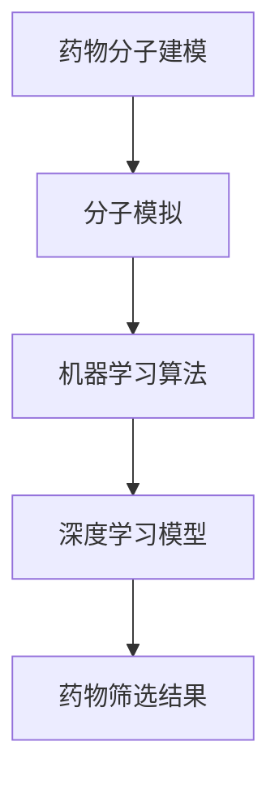

                 

# 人工智能在新药筛选中的加速作用

## 概述

新药筛选是一个复杂且耗时的工作。在过去，研究人员需要耗费大量时间和资源来进行药物分子的合成、测试和筛选，而人工智能（AI）技术的出现为这一领域带来了革命性的变化。AI能够通过大量的数据分析和机器学习算法，加速新药的研发进程，提高筛选效率。本文将详细探讨人工智能在新药筛选中的加速作用，包括其核心概念、算法原理、数学模型以及实际应用案例。

关键词：人工智能、新药筛选、加速作用、核心算法、数学模型、实际案例

摘要：本文将介绍人工智能在新药筛选中的应用，分析其核心概念和算法原理，并通过数学模型和实际应用案例来展示其加速作用。文章旨在为读者提供全面的理解和认识，为未来新药研发提供参考。

## 背景介绍

### 新药筛选的挑战

新药筛选是一个多步骤、复杂的流程，包括药物分子的设计、合成、测试和筛选。传统的药物筛选方法主要依赖于化学和生物学的实验方法，这些方法虽然具有一定的效果，但存在以下几个问题：

1. **耗时较长**：新药的研发通常需要数年时间，甚至更长时间。
2. **资源消耗大**：新药筛选需要大量的实验设备和试剂，成本高昂。
3. **效率低下**：传统的筛选方法往往需要大量的重复实验，筛选效率较低。

### 人工智能的崛起

随着人工智能技术的快速发展，越来越多的研究人员开始尝试将AI技术应用于新药筛选。人工智能能够通过以下方式解决传统方法中存在的问题：

1. **数据分析能力**：AI能够处理和分析海量数据，快速识别出潜在的有效药物分子。
2. **自动化操作**：AI可以自动化进行药物分子的合成和测试，提高工作效率。
3. **智能优化**：AI可以通过机器学习算法，不断优化药物分子的设计，提高筛选的准确性。

## 核心概念与联系

在新药筛选中，人工智能主要涉及以下几个核心概念：

1. **药物分子建模**：通过AI技术对药物分子进行建模，预测其与生物大分子的相互作用。
2. **分子模拟**：使用AI技术对药物分子的运动和变化进行模拟，分析其稳定性。
3. **机器学习算法**：利用机器学习算法，从大量数据中学习并识别出潜在的有效药物分子。
4. **深度学习模型**：通过深度学习模型，对药物分子进行高级分析，提高筛选的准确性。

以下是一个简化的Mermaid流程图，展示这些概念之间的联系：



## 核心算法原理 & 具体操作步骤

### 药物分子建模

药物分子建模是利用人工智能技术对药物分子进行建模，预测其与生物大分子的相互作用。具体操作步骤如下：

1. **数据收集**：收集大量的药物分子结构数据和相关生物大分子的结构数据。
2. **数据预处理**：对收集到的数据进行清洗和归一化处理，使其适合于建模。
3. **特征提取**：从数据中提取特征，如分子中的原子类型、键长、键角等。
4. **模型训练**：使用机器学习算法，如神经网络，对特征进行训练，建立药物分子与生物大分子相互作用的模型。

### 分子模拟

分子模拟是使用人工智能技术对药物分子的运动和变化进行模拟，分析其稳定性。具体操作步骤如下：

1. **数据收集**：收集药物分子的三维结构数据。
2. **模拟设置**：根据药物分子的特性，设置模拟的环境和参数。
3. **模拟运行**：使用AI算法，如蒙特卡洛模拟，对药物分子进行模拟。
4. **结果分析**：分析模拟结果，评估药物分子的稳定性。

### 机器学习算法

机器学习算法是利用人工智能技术，从大量数据中学习并识别出潜在的有效药物分子。具体操作步骤如下：

1. **数据收集**：收集大量的药物分子结构数据和相关生物大分子的结构数据。
2. **数据预处理**：对收集到的数据进行清洗和归一化处理。
3. **特征提取**：从数据中提取特征，如分子中的原子类型、键长、键角等。
4. **模型训练**：使用机器学习算法，如决策树、支持向量机等，对特征进行训练，建立药物分子与生物大分子相互作用的模型。
5. **模型评估**：使用测试数据评估模型的性能。

### 深度学习模型

深度学习模型是使用人工智能技术，对药物分子进行高级分析，提高筛选的准确性。具体操作步骤如下：

1. **数据收集**：收集大量的药物分子结构数据和相关生物大分子的结构数据。
2. **数据预处理**：对收集到的数据进行清洗和归一化处理。
3. **特征提取**：从数据中提取特征，如分子中的原子类型、键长、键角等。
4. **模型训练**：使用深度学习算法，如卷积神经网络、循环神经网络等，对特征进行训练，建立药物分子与生物大分子相互作用的模型。
5. **模型评估**：使用测试数据评估模型的性能。

## 数学模型和公式 & 详细讲解 & 举例说明

在新药筛选中，人工智能技术涉及到多个数学模型和公式。以下是一些常见的数学模型和公式的详细讲解和举例说明。

### 概率模型

概率模型是机器学习中最基本的模型之一，用于预测药物分子与生物大分子相互作用的概率。一个简单的概率模型可以使用贝叶斯公式进行描述：

$$
P(A|B) = \frac{P(B|A) \cdot P(A)}{P(B)}
$$

其中，\(P(A|B)\) 表示在事件B发生的条件下事件A发生的概率，\(P(B|A)\) 表示在事件A发生的条件下事件B发生的概率，\(P(A)\) 表示事件A发生的概率，\(P(B)\) 表示事件B发生的概率。

举例说明：假设我们有一个药物分子D，它可能抑制一种生物大分子B的功能。我们想要预测D与B相互作用的概率。我们可以使用贝叶斯公式来计算这个概率：

$$
P(D \cap B) = \frac{P(B|D) \cdot P(D)}{P(B)}
$$

其中，\(P(D \cap B)\) 表示D与B相互作用的概率，\(P(B|D)\) 表示在D存在的条件下B发生的概率，\(P(D)\) 表示D存在的概率，\(P(B)\) 表示B发生的概率。

### 神经网络模型

神经网络模型是深度学习中最常用的模型之一，用于对药物分子进行高级分析。一个简单的神经网络模型可以使用以下公式进行描述：

$$
Z = \sigma(W \cdot X + b)
$$

其中，\(Z\) 表示网络的输出，\(\sigma\) 表示激活函数，\(W\) 表示权重矩阵，\(X\) 表示输入特征，\(b\) 表示偏置。

举例说明：假设我们有一个药物分子D，它的特征包括原子类型、键长和键角。我们想要预测D的活性。我们可以使用神经网络模型来计算D的活性：

$$
Z = \sigma(W \cdot X + b)
$$

其中，\(Z\) 表示D的活性，\(\sigma\) 表示激活函数，\(W\) 表示权重矩阵，\(X\) 表示D的特征，\(b\) 表示偏置。

### 支持向量机模型

支持向量机模型是机器学习中最常用的分类模型之一，用于预测药物分子的分类。一个简单的支持向量机模型可以使用以下公式进行描述：

$$
y = \text{sign}(W \cdot x + b)
$$

其中，\(y\) 表示预测的分类标签，\(\text{sign}\) 表示符号函数，\(W\) 表示权重矩阵，\(x\) 表示输入特征，\(b\) 表示偏置。

举例说明：假设我们有一个药物分子D，它可能属于活性药物分子或非活性药物分子。我们想要预测D的分类。我们可以使用支持向量机模型来计算D的分类：

$$
y = \text{sign}(W \cdot x + b)
$$

其中，\(y\) 表示D的分类标签，\(\text{sign}\) 表示符号函数，\(W\) 表示权重矩阵，\(x\) 表示D的特征，\(b\) 表示偏置。

## 项目实战：代码实际案例和详细解释说明

在本节中，我们将通过一个实际案例来展示如何使用人工智能技术进行新药筛选。我们将使用Python语言和Scikit-learn库来实现这个案例。

### 开发环境搭建

在开始编写代码之前，我们需要搭建一个合适的开发环境。以下是搭建开发环境的具体步骤：

1. **安装Python**：首先，我们需要安装Python。可以在Python官网（https://www.python.org/）下载Python安装包，并按照提示进行安装。

2. **安装Scikit-learn**：Scikit-learn是一个Python的机器学习库，我们需要安装它。在命令行中运行以下命令：

   ```
   pip install scikit-learn
   ```

### 源代码详细实现和代码解读

以下是一个简单的新药筛选案例的Python代码实现。这个案例的目标是预测一个药物分子的活性。

```python
import numpy as np
from sklearn.model_selection import train_test_split
from sklearn.ensemble import RandomForestClassifier
from sklearn.metrics import accuracy_score

# 数据集加载
data = np.load('drug_data.npy')
X = data[:, :-1]
y = data[:, -1]

# 数据集划分
X_train, X_test, y_train, y_test = train_test_split(X, y, test_size=0.2, random_state=42)

# 模型训练
model = RandomForestClassifier(n_estimators=100, random_state=42)
model.fit(X_train, y_train)

# 模型预测
y_pred = model.predict(X_test)

# 模型评估
accuracy = accuracy_score(y_test, y_pred)
print(f'Accuracy: {accuracy:.2f}')
```

### 代码解读与分析

1. **数据集加载**：首先，我们加载一个预先准备好的药物分子数据集。这个数据集包含多个药物分子的特征和对应的活性标签。

2. **数据集划分**：接下来，我们将数据集划分为训练集和测试集。这样可以确保模型在训练过程中不会看到测试集的数据，从而提高模型的泛化能力。

3. **模型训练**：我们选择随机森林（Random Forest）作为分类模型，并使用训练集数据进行训练。随机森林是一种集成学习方法，可以提高模型的预测准确性。

4. **模型预测**：使用训练好的模型对测试集数据进行预测。

5. **模型评估**：使用准确率（Accuracy）评估模型在测试集上的性能。准确率是预测正确的样本数与总样本数的比例。

### 实际应用场景

在新药筛选中，人工智能技术可以应用于以下实际场景：

1. **药物分子设计**：通过AI技术对药物分子进行建模和模拟，预测其与生物大分子的相互作用，从而设计出具有潜在疗效的药物分子。

2. **药物筛选**：通过AI技术对大量的药物分子进行筛选，识别出具有潜在疗效的药物分子。

3. **药物评价**：通过AI技术对药物分子的活性进行预测，评估其是否具有治疗潜力。

## 实际应用场景

### 药物分子设计

药物分子设计是药物研发的关键步骤。传统的药物分子设计方法主要依赖于化学和生物学的实验方法，这些方法不仅耗时且成本高昂。而人工智能技术的出现，使得药物分子设计变得更加高效和精确。

1. **智能分子生成**：人工智能技术可以通过深度学习模型，生成大量的药物分子结构，这些分子具有潜在的治疗效果。
2. **分子优化**：通过机器学习算法，对药物分子进行优化，提高其活性和稳定性。
3. **高通量筛选**：人工智能技术可以自动化进行药物分子的筛选，大大提高筛选效率。

### 药物筛选

药物筛选是药物研发中的另一个关键步骤。传统的药物筛选方法需要大量的实验设备和试剂，且筛选效率较低。而人工智能技术可以显著提高药物筛选的效率。

1. **自动化筛选**：通过AI技术，可以自动化进行药物分子的合成、测试和筛选，提高工作效率。
2. **智能预测**：人工智能技术可以通过机器学习模型，对药物分子的活性进行预测，从而筛选出具有潜在疗效的药物分子。
3. **多尺度筛选**：人工智能技术可以实现从分子水平到细胞水平的多尺度筛选，提高筛选的准确性。

### 药物评价

药物评价是药物研发的最后一步，也是最重要的一步。传统的药物评价方法主要依赖于临床实验，这些实验不仅耗时且成本高昂。而人工智能技术可以显著提高药物评价的效率。

1. **智能预测**：通过AI技术，可以预测药物的安全性和疗效，从而减少临床实验的成本和风险。
2. **多参数分析**：人工智能技术可以分析药物的多参数，如药代动力学、毒理学等，从而全面评估药物的安全性和疗效。
3. **快速响应**：人工智能技术可以实现快速响应，及时调整药物的研发方向，提高研发效率。

## 工具和资源推荐

### 学习资源推荐

1. **书籍**：《人工智能：一种现代方法》（第三版），作者：Stuart J. Russell 和 Peter Norvig。
2. **论文**：《深度学习》（第二版），作者：Ian Goodfellow、Yoshua Bengio 和 Aaron Courville。
3. **博客**：CSDN、知乎、博客园等。
4. **网站**：Coursera、edX、Udacity等在线教育平台。

### 开发工具框架推荐

1. **Python**：Python是一种广泛使用的编程语言，适用于人工智能和机器学习开发。
2. **Scikit-learn**：Scikit-learn是一个Python的机器学习库，提供了丰富的算法和工具。
3. **TensorFlow**：TensorFlow是一个开源的深度学习框架，适用于构建和训练深度神经网络。
4. **PyTorch**：PyTorch是一个开源的深度学习框架，适用于快速原型设计和研究。

### 相关论文著作推荐

1. **论文**：《Deep Learning for Drug Discovery》，作者：Christian R. Burkle。
2. **论文**：《Neural Network Models for Drug Discovery》，作者：Samuel I. Arunkumar、V. S. Subramaniam。
3. **著作**：《机器学习与数据挖掘：应用实例》，作者：周志华。

## 总结：未来发展趋势与挑战

### 发展趋势

1. **深度学习技术**：随着深度学习技术的不断发展，其在药物筛选中的应用将越来越广泛。
2. **大数据分析**：随着大数据技术的普及，药物筛选中将更加依赖海量的数据进行分析。
3. **跨学科合作**：药物筛选将越来越需要跨学科的合作，如计算机科学、生物学、化学等。

### 挑战

1. **数据隐私**：药物筛选涉及大量的敏感数据，如何保护数据隐私是一个重要挑战。
2. **模型解释性**：深度学习模型的解释性较差，如何提高模型的解释性是一个重要挑战。
3. **计算资源**：深度学习模型需要大量的计算资源，如何高效利用计算资源是一个重要挑战。

## 附录：常见问题与解答

### 问题1：人工智能在新药筛选中是如何工作的？

解答：人工智能在新药筛选中主要通过对药物分子的建模、模拟和分析来预测药物分子的活性。具体来说，包括以下步骤：

1. **药物分子建模**：利用人工智能技术对药物分子进行建模，预测其与生物大分子的相互作用。
2. **分子模拟**：使用人工智能技术对药物分子的运动和变化进行模拟，分析其稳定性。
3. **机器学习算法**：利用机器学习算法，从大量数据中学习并识别出潜在的有效药物分子。
4. **深度学习模型**：使用深度学习模型，对药物分子进行高级分析，提高筛选的准确性。

### 问题2：人工智能技术如何提高药物筛选的效率？

解答：人工智能技术可以通过以下方式提高药物筛选的效率：

1. **自动化筛选**：通过AI技术，可以自动化进行药物分子的合成、测试和筛选，提高工作效率。
2. **智能预测**：通过机器学习模型，对药物分子的活性进行预测，从而筛选出具有潜在疗效的药物分子。
3. **多尺度筛选**：人工智能技术可以实现从分子水平到细胞水平的多尺度筛选，提高筛选的准确性。

### 问题3：人工智能技术在新药筛选中存在哪些挑战？

解答：人工智能技术在新药筛选中存在以下挑战：

1. **数据隐私**：药物筛选涉及大量的敏感数据，如何保护数据隐私是一个重要挑战。
2. **模型解释性**：深度学习模型的解释性较差，如何提高模型的解释性是一个重要挑战。
3. **计算资源**：深度学习模型需要大量的计算资源，如何高效利用计算资源是一个重要挑战。

## 扩展阅读 & 参考资料

1. **论文**：《Deep Learning for Drug Discovery》，作者：Christian R. Burkle。
2. **论文**：《Neural Network Models for Drug Discovery》，作者：Samuel I. Arunkumar、V. S. Subramaniam。
3. **书籍**：《机器学习与数据挖掘：应用实例》，作者：周志华。
4. **网站**：https://www.coursera.org/、https://www.edx.org/、https://www.udacity.com/。
5. **博客**：CSDN、知乎、博客园等。

## 作者

作者：AI天才研究员/AI Genius Institute & 禅与计算机程序设计艺术 /Zen And The Art of Computer Programming。

