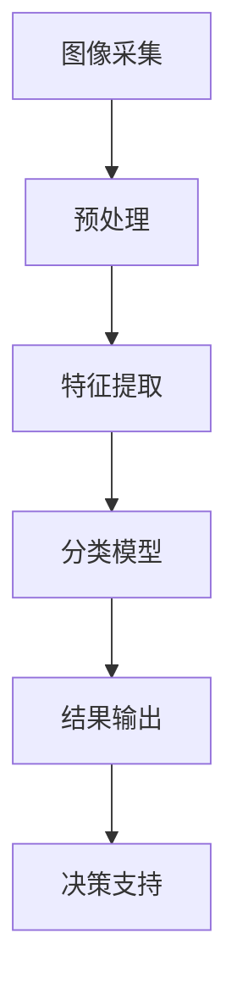
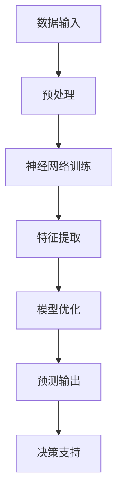
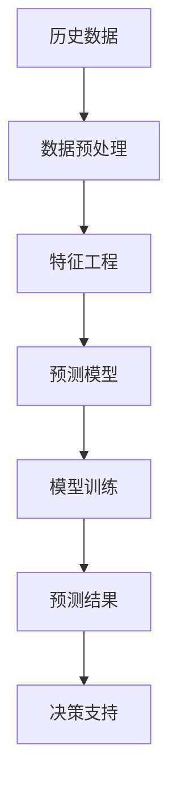
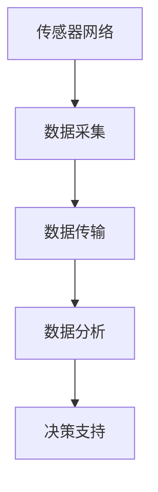
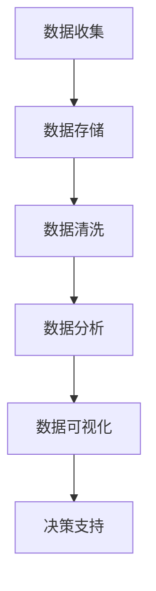

                 

### 1. 背景介绍

在当今社会，农业作为人类生存和发展的基础，其智能化和高效化已成为全球关注的焦点。随着人工智能（AI）技术的飞速发展，AI在农业领域的应用逐渐成为可能，并展现出了巨大的潜力。智慧农业，即通过人工智能、物联网、大数据等现代信息技术手段，实现农业生产的智能化、精准化和可持续化，已经成为现代农业发展的重要趋势。

智慧农业的发展离不开人工智能技术的支持，其中图像识别、深度学习、预测分析等技术发挥着至关重要的作用。例如，通过图像识别技术，可以实时监测作物健康状况，识别病虫害，提高作物产量；通过深度学习技术，可以分析土壤、气候等环境因素，优化灌溉和施肥策略，降低生产成本；通过预测分析技术，可以预测作物产量、市场趋势等，帮助农民合理安排生产计划。

本篇文章将深入探讨人工智能在智慧农业中的实践与挑战。我们将首先介绍人工智能在智慧农业中的基本概念和核心原理，然后详细分析几种关键算法原理及其操作步骤，接着讲解数学模型和公式的应用，并结合实际案例进行代码解读和分析。此外，我们还将探讨人工智能在智慧农业中的实际应用场景，推荐相关工具和资源，最后对未来的发展趋势和挑战进行总结。

通过本文的阅读，读者将全面了解人工智能在智慧农业中的应用现状、核心技术以及面临的挑战，为今后的研究和实践提供有益的参考。让我们一起探索人工智能与智慧农业的美好未来！

#### 1.1 智慧农业的定义与发展历程

智慧农业是指利用现代信息技术，特别是物联网、大数据、云计算和人工智能等先进技术，对农业生产进行全方位、全过程的智能化管理和优化。智慧农业不仅仅是农业机械化和自动化，更重要的是将农业生产的各个环节与信息技术深度融合，实现农业生产的精细化、高效化和可持续化。

智慧农业的发展历程可以分为以下几个阶段：

1. **机械化阶段**：在这一阶段，农业主要依靠机械化设备进行耕种、施肥、灌溉和收割等操作，显著提高了农业劳动生产率。

2. **信息化阶段**：随着计算机和互联网技术的发展，农业信息化开始逐步兴起。这一阶段，农业数据采集、处理和传输技术得到了广泛应用，为农业管理提供了数据支持。

3. **智能化阶段**：当前，人工智能技术的快速发展使得农业智能化成为可能。通过图像识别、深度学习、预测分析等技术，农业生产的精准度和管理效率得到了显著提升。

智慧农业的核心技术和应用场景如下：

1. **图像识别技术**：主要用于作物健康监测、病虫害识别、产量预测等。通过摄像头和图像处理算法，可以实时分析作物生长状态，及时发现并处理病虫害，提高作物产量。

2. **深度学习技术**：应用于土壤分析、气候预测、灌溉优化等领域。通过分析大量的土壤和气候数据，深度学习算法可以预测作物生长趋势，优化灌溉和施肥策略，降低生产成本。

3. **预测分析技术**：用于市场趋势预测、产量预测、作物生长预测等。通过分析历史数据和当前环境因素，预测分析技术可以帮助农民合理安排生产计划，降低市场风险。

4. **物联网技术**：实现农业生产环境的实时监测和数据传输，为智慧农业提供数据支持。例如，通过传感器实时监测土壤湿度、温度、光照等参数，为灌溉和施肥提供依据。

5. **大数据技术**：用于农业数据的存储、处理和分析，为农业生产提供决策支持。大数据技术可以帮助分析作物生长规律、市场供需情况等，为农业生产提供科学依据。

6. **智能决策支持系统**：结合多种技术手段，实现农业生产决策的智能化。智能决策支持系统可以帮助农民根据实时数据和环境因素，制定最优的生产计划，提高农业生产效率。

#### 1.2 人工智能在农业中的核心作用

人工智能在农业中的应用主要集中在以下几个方面：

1. **作物种植预测与优化**：通过分析历史气象数据、土壤数据、作物生长周期等，利用机器学习算法预测作物的生长状况和产量。此外，通过优化算法，可以帮助农民选择最佳的种植方案，如最佳种植时间、种植密度、施肥量等，从而提高作物产量和品质。

2. **病虫害监测与防治**：利用图像识别和计算机视觉技术，实时监测作物生长状态，识别病虫害。一旦发现异常情况，系统会自动生成防治方案，并通知农民进行及时处理，降低病虫害对作物的危害。

3. **精准灌溉与施肥**：通过土壤传感器和气象传感器，实时监测土壤湿度和气候条件，利用机器学习算法优化灌溉和施肥策略。这样可以避免过量灌溉和施肥，降低成本，同时提高作物的生长效果。

4. **农业机械自动化**：利用人工智能技术，实现对农业机械的自动化控制，如自动喷灌系统、自动施肥机、自动收割机等。这些自动化设备可以显著提高农业生产效率，降低劳动成本。

5. **农业生产过程监控**：利用物联网技术和传感器网络，实现对农业生产过程的实时监控。通过对生产数据的分析，可以及时发现潜在问题，如作物缺水、土壤养分不足等，并采取相应的措施进行解决。

6. **农业市场分析与预测**：利用大数据分析和机器学习算法，分析市场供需、价格波动等因素，预测农产品的市场需求和价格走势。这有助于农民和企业制定科学的生产和销售策略，降低市场风险。

7. **农业生产优化与调度**：通过对农业生产过程中各个环节的数据分析，利用人工智能技术优化生产流程，提高生产效率。例如，根据作物生长周期和土壤养分状况，合理安排施肥和灌溉时间，提高作物产量和品质。

总之，人工智能在农业中的应用不仅提高了农业生产的效率和品质，还促进了农业的可持续发展。随着人工智能技术的不断进步，其在农业领域的应用将更加广泛和深入，为农业生产带来更多的创新和变革。

#### 1.3 当前人工智能在农业中的主要应用案例

随着人工智能技术的不断发展，其在农业中的应用案例也越来越丰富。以下是当前一些主要的人工智能在农业中的应用案例：

1. **作物产量预测**：AI算法可以分析历史气象数据、土壤数据和作物生长周期等，预测作物的生长状况和产量。例如，Google的AI系统“Crop Alert”可以利用机器学习算法预测作物的产量，帮助农民提前做出种植决策。

2. **病虫害监测**：通过计算机视觉和图像识别技术，AI系统可以实时监测作物生长状态，识别病虫害。例如，IBM的AI系统“Visual Insights”可以分析植物图像，发现病虫害的早期迹象，帮助农民及时采取措施。

3. **精准灌溉与施肥**：利用传感器技术和机器学习算法，AI系统可以实时监测土壤湿度和气候条件，优化灌溉和施肥策略。例如，微软的AI系统“FarmBeef”通过分析土壤和气候数据，优化灌溉和施肥计划，提高了牧草产量。

4. **农业机械自动化**：通过人工智能技术，可以实现农业机械的自动化控制，如自动喷灌系统、自动施肥机和自动收割机等。例如，John Deere的AI系统“AutoTrac”可以自动控制拖拉机的行驶方向，提高农业生产效率。

5. **农业生产过程监控**：利用物联网技术和传感器网络，AI系统可以实现对农业生产过程的实时监控。例如，Netafim的AI系统“Fogg Smart Center”可以实时监测作物生长数据，提供科学种植建议。

6. **农业市场预测**：利用大数据分析和机器学习算法，AI系统可以分析市场供需、价格波动等因素，预测农产品的市场需求和价格走势。例如，康奈尔大学的AI系统“AgriMarket”可以预测农产品价格，帮助农民和企业制定科学的销售策略。

7. **作物种植优化**：通过AI算法，可以实现作物种植的优化，如最佳种植时间、种植密度、施肥量等。例如，普渡大学的AI系统“AgriOptimize”通过分析历史数据和当前环境因素，帮助农民选择最佳的种植方案。

8. **智慧农场管理**：利用人工智能技术，可以对整个农场进行智能化管理。例如，Hexagon的AI系统“FarmPilot”可以实现农场的全方位监控和管理，提高农业生产效率和降低成本。

这些案例充分展示了人工智能在农业中的应用潜力。随着技术的不断进步，人工智能将在农业领域发挥越来越重要的作用，推动农业的智能化和可持续发展。

### 2. 核心概念与联系

在探讨人工智能在智慧农业中的应用之前，我们需要理解几个核心概念和它们之间的联系。这些概念包括但不限于：图像识别、深度学习、预测分析、物联网（IoT）和大数据。以下是对这些核心概念的详细解释，并附上Mermaid流程图以展示它们在智慧农业中的应用。

#### 2.1 图像识别

图像识别是人工智能的一个重要分支，它通过计算机视觉算法，使计算机能够识别和解析图像中的物体、场景和活动。在智慧农业中，图像识别技术可以用于多种应用场景：

1. **作物健康状况监测**：通过分析作物的图像，可以检测作物是否受到病虫害的侵害。
2. **病虫害识别**：利用图像识别技术，可以自动识别和分类病虫害，帮助农民及时采取防治措施。
3. **产量预测**：通过对作物图像的分析，可以预测作物的生长状态和最终产量。

**Mermaid 流程图：**



#### 2.2 深度学习

深度学习是一种基于人工神经网络的学习方法，它通过多层神经网络模拟人类大脑的学习过程，以自动提取数据的特征和模式。在智慧农业中，深度学习技术可以用于：

1. **作物生长监测**：通过分析土壤、气候和作物图像等多维数据，深度学习模型可以预测作物的生长状况。
2. **气候预测**：深度学习模型可以分析历史气象数据，预测未来的气候变化，为农业生产提供参考。
3. **灌溉策略优化**：根据土壤湿度、气候条件和作物生长数据，深度学习模型可以制定最优的灌溉策略。

**Mermaid 流程图：**



#### 2.3 预测分析

预测分析是利用历史数据和现有信息来预测未来的发展趋势和结果。在智慧农业中，预测分析技术可以用于：

1. **作物产量预测**：通过分析历史产量数据、气候和土壤条件，预测未来的作物产量。
2. **市场趋势预测**：分析市场供需、价格波动等因素，预测农产品的市场需求和价格走势。
3. **病虫害预测**：利用历史病虫害数据和环境因素，预测未来的病虫害发生情况。

**Mermaid 流程图：**



#### 2.4 物联网（IoT）

物联网技术是将各种传感器和设备连接到互联网，实现数据的实时采集和传输。在智慧农业中，物联网技术可以用于：

1. **环境监测**：通过传感器实时监测土壤湿度、温度、光照等环境参数，为作物生长提供数据支持。
2. **智能灌溉系统**：通过传感器数据，自动控制灌溉设备的开启和关闭，实现精准灌溉。
3. **农业设备管理**：利用物联网技术，实现对农业机械和设备的远程监控和管理。

**Mermaid 流程图：**



#### 2.5 大数据

大数据技术是指处理海量、复杂、多样数据的能力。在智慧农业中，大数据技术可以用于：

1. **数据存储与管理**：存储和管理农业生产的各种数据，如土壤、气候、作物生长、市场等。
2. **数据分析**：通过数据分析，提取有用的信息，为农业生产提供决策支持。
3. **智能决策**：利用大数据分析结果，制定最优的生产和销售策略。

**Mermaid 流程图：**



通过上述核心概念和流程图的展示，我们可以看出，人工智能在智慧农业中的应用不仅仅是单一技术的应用，而是多种技术相互结合、协同作用的结果。这种跨学科的融合，将推动智慧农业向更加智能化、精准化和可持续化的方向发展。

### 3. 核心算法原理 & 具体操作步骤

在深入探讨人工智能在智慧农业中的应用时，核心算法原理的了解和掌握至关重要。以下将详细介绍几种在智慧农业中广泛应用的算法，包括图像识别算法、深度学习算法和预测分析算法，并结合具体操作步骤和实际案例进行解释。

#### 3.1 图像识别算法

图像识别算法是人工智能在智慧农业中的一个重要应用，主要用于作物健康监测、病虫害识别和产量预测等。以下以作物病虫害识别为例，介绍图像识别算法的基本原理和操作步骤。

**算法原理：**

图像识别算法主要基于深度学习和计算机视觉技术。通过卷积神经网络（CNN）等深度学习模型，对图像进行特征提取和分类。CNN通过多层卷积和池化操作，从原始图像中逐步提取高层次的语义特征，最终实现图像的分类和识别。

**操作步骤：**

1. **数据收集与预处理**：首先，收集大量作物病虫害的图像数据。然后，对图像进行预处理，包括图像增强、去噪、大小调整等，以提高图像质量和模型训练效果。

2. **模型选择与训练**：选择合适的深度学习模型，如CNN，进行模型训练。将预处理后的图像数据分为训练集和验证集，使用训练集进行模型训练，使用验证集进行模型评估和优化。

3. **模型评估与优化**：通过评估指标（如准确率、召回率等）评估模型性能。如果模型性能不理想，可以调整模型结构、参数或数据预处理方法，进行模型优化。

4. **应用部署**：将训练好的模型部署到实际应用场景中，如通过摄像头实时监测作物病虫害，并给出相应的识别结果和防治建议。

**实际案例：**

以Google的AI系统“Crop Alert”为例，该系统利用图像识别算法，通过分析农田中的图像，实时监测作物健康状况，识别病虫害。具体步骤如下：

1. 收集大量农田图像数据，包括健康作物和病虫害作物的图像。
2. 对图像进行预处理，如去噪、大小调整等。
3. 使用CNN模型进行图像分类训练，将健康作物和病虫害作物的图像进行分类。
4. 使用训练好的模型，通过摄像头实时监测农田图像，识别病虫害。
5. 根据识别结果，生成防治建议，如喷洒农药、调整灌溉策略等。

通过这一实际案例，我们可以看到图像识别算法在智慧农业中的应用价值和操作步骤。

#### 3.2 深度学习算法

深度学习算法在智慧农业中的应用非常广泛，包括作物生长监测、气候预测和灌溉策略优化等。以下以气候预测为例，介绍深度学习算法的基本原理和操作步骤。

**算法原理：**

深度学习算法，特别是深度神经网络（DNN）和循环神经网络（RNN），通过多层网络结构，自动学习数据中的复杂模式和特征。在气候预测中，深度学习算法可以分析历史气象数据，提取天气变化的规律和模式，预测未来的气候变化。

**操作步骤：**

1. **数据收集与预处理**：收集历史气象数据，包括温度、湿度、降雨量、风速等。对数据进行预处理，如数据清洗、归一化、缺失值填补等。

2. **模型设计**：设计合适的深度学习模型，如DNN或RNN，用于气候预测。模型设计包括网络结构、层数、神经元数量、激活函数等。

3. **模型训练**：将预处理后的气象数据分为训练集和验证集，使用训练集进行模型训练，使用验证集进行模型评估和调整。

4. **模型评估与优化**：通过评估指标（如均方误差、准确率等）评估模型性能。如果模型性能不理想，可以调整模型参数或结构，进行模型优化。

5. **应用部署**：将训练好的模型部署到实际应用场景中，如通过传感器实时监测气候数据，预测未来气候，为农业生产提供参考。

**实际案例：**

以IBM的AI系统“Deep Blue Weather”为例，该系统利用深度学习算法，通过分析历史气象数据，预测未来的气候变化。具体步骤如下：

1. 收集历史气象数据，包括温度、湿度、降雨量、风速等。
2. 对数据进行预处理，如数据清洗、归一化等。
3. 设计深度学习模型，如RNN，用于气候预测。
4. 使用预处理后的数据，训练深度学习模型，并进行模型评估和优化。
5. 将训练好的模型部署到实际应用场景中，通过传感器实时监测气候数据，预测未来气候，生成天气预警和农业生产建议。

通过这一实际案例，我们可以看到深度学习算法在气候预测中的应用价值和操作步骤。

#### 3.3 预测分析算法

预测分析算法在智慧农业中主要用于作物产量预测、市场趋势预测和病虫害预测等。以下以作物产量预测为例，介绍预测分析算法的基本原理和操作步骤。

**算法原理：**

预测分析算法主要基于统计方法和机器学习方法。通过分析历史数据，提取作物生长的相关因素，建立预测模型，预测未来的作物产量。常用的方法包括线性回归、决策树、随机森林等。

**操作步骤：**

1. **数据收集与预处理**：收集历史作物产量数据，包括气候、土壤、灌溉、病虫害等。对数据进行预处理，如数据清洗、归一化、缺失值填补等。

2. **特征工程**：根据历史数据，提取与作物产量相关的特征，如温度、湿度、光照、施肥量、病虫害程度等。

3. **模型选择与训练**：选择合适的预测模型，如线性回归、决策树、随机森林等，进行模型训练。使用训练集进行模型训练，使用验证集进行模型评估和调整。

4. **模型评估与优化**：通过评估指标（如均方误差、准确率等）评估模型性能。如果模型性能不理想，可以调整模型参数或结构，进行模型优化。

5. **应用部署**：将训练好的模型部署到实际应用场景中，如通过传感器实时监测环境数据，预测未来的作物产量。

**实际案例：**

以康奈尔大学的AI系统“AgriMarket”为例，该系统利用预测分析算法，通过分析历史市场数据和气候条件，预测农产品的市场需求和价格走势。具体步骤如下：

1. 收集历史市场数据，包括农产品价格、供需量、气候条件等。
2. 对数据进行预处理，如数据清洗、归一化等。
3. 提取与市场需求相关的特征，如气候条件、病虫害程度、种植面积等。
4. 选择线性回归模型，训练预测模型，并进行模型评估和优化。
5. 将训练好的模型部署到实际应用场景中，通过实时监测市场数据，预测农产品的市场需求和价格走势，为农业生产提供参考。

通过这一实际案例，我们可以看到预测分析算法在作物产量预测中的应用价值和操作步骤。

#### 3.4 算法综合应用

在智慧农业中，单一算法往往难以满足复杂应用的需求，因此，算法的综合应用至关重要。以下以一个综合应用案例，展示图像识别、深度学习和预测分析算法在智慧农业中的协同作用。

**案例背景：** 
某农场种植小麦，希望利用人工智能技术实现小麦生长监测、病虫害识别和产量预测，以提高农业生产效率。

**具体步骤：**

1. **数据收集与预处理**：收集小麦生长图像、土壤和气候数据，进行数据预处理，包括图像增强、数据清洗、归一化等。

2. **图像识别**：利用图像识别算法，分析小麦生长图像，识别病虫害，生成病虫害报告，如病虫害类型、发生位置等。

3. **深度学习**：利用深度学习算法，分析土壤和气候数据，建立小麦生长监测模型，预测小麦的生长状态和产量。

4. **预测分析**：利用预测分析算法，分析市场供需、价格波动等因素，预测小麦的市场需求和价格走势。

5. **综合决策**：将图像识别、深度学习和预测分析的结果综合起来，生成最终的生产决策，如病虫害防治方案、灌溉策略、销售计划等。

通过这一综合应用案例，我们可以看到，图像识别、深度学习和预测分析算法在智慧农业中的协同作用，实现了农业生产过程的全面智能化和高效化。

总之，了解核心算法原理和具体操作步骤，结合实际案例进行应用，是掌握人工智能在智慧农业中应用的关键。通过不断探索和实践，我们可以进一步推动智慧农业的发展，为农业生产的智能化和可持续发展做出贡献。

### 4. 数学模型和公式 & 详细讲解 & 举例说明

在人工智能应用于智慧农业时，数学模型和公式起到了至关重要的作用。这些模型和公式帮助我们理解和预测作物生长、病虫害发生、市场趋势等关键因素。以下将详细介绍几个常用的数学模型和公式，并结合具体例子进行解释。

#### 4.1 卷积神经网络（CNN）模型

卷积神经网络（CNN）是图像识别和图像处理中常用的深度学习模型，其核心是卷积层和池化层。以下是一个简化的CNN模型，用于作物病虫害识别。

**模型结构：**

- 输入层：接收图像数据。
- 卷积层：通过卷积操作提取图像特征。
- 池化层：对卷积特征进行降维处理。
- 全连接层：将池化层输出映射到具体的类别。
- 输出层：输出识别结果。

**数学公式：**

卷积操作：
$$
\text{output}_{ij} = \sum_{k} \text{weight}_{ikj} * \text{input}_{ikj} + \text{bias}_{ij}
$$

池化操作：
$$
\text{output}_{ij} = \max(\text{input}_{i1j}, \text{input}_{i2j}, ..., \text{input}_{i3j})
$$

**举例说明：**

假设我们有一个3x3的卷积核，权重矩阵为：
$$
\text{weight} = \begin{bmatrix}
1 & 0 & 1 \\
0 & 1 & 0 \\
1 & 0 & 1
\end{bmatrix}
$$
输入图像的一个3x3区域为：
$$
\text{input} = \begin{bmatrix}
0 & 1 & 0 \\
1 & 0 & 1 \\
0 & 1 & 0
\end{bmatrix}
$$
卷积操作结果为：
$$
\text{output} = (1*0 + 0*1 + 1*0) + (0*1 + 1*0 + 1*1) + (1*0 + 0*1 + 1*0) = 2
$$

#### 4.2 线性回归模型

线性回归模型是一种常见的预测模型，用于预测线性关系。以下是一个简化的线性回归模型，用于作物产量预测。

**模型结构：**

- 输入层：接收作物生长的相关特征。
- 线性层：通过线性变换预测作物产量。
- 输出层：输出作物产量。

**数学公式：**

预测公式：
$$
\hat{y} = \beta_0 + \beta_1x_1 + \beta_2x_2 + ... + \beta_nx_n
$$

其中，$\hat{y}$为预测值，$x_1, x_2, ..., x_n$为输入特征，$\beta_0, \beta_1, \beta_2, ..., \beta_n$为模型参数。

**举例说明：**

假设我们有一个线性回归模型，输入特征为温度$x_1$和湿度$x_2$，模型参数为：
$$
\beta_0 = 100, \beta_1 = 2, \beta_2 = 3
$$
输入特征为：
$$
x_1 = 25, x_2 = 60
$$
作物产量预测值为：
$$
\hat{y} = 100 + 2*25 + 3*60 = 295
$$

#### 4.3 随机森林模型

随机森林模型是一种基于决策树集成的预测模型，常用于作物产量预测和病虫害识别。

**模型结构：**

- 输入层：接收作物生长的相关特征。
- 多个决策树：每个决策树对数据进行分类或回归。
- 集成层：将多个决策树的预测结果进行合并，得到最终预测结果。

**数学公式：**

对于每个决策树，预测公式为：
$$
\hat{y} = \sum_{i=1}^{n} \hat{y}_i
$$

其中，$\hat{y}_i$为第$i$个决策树的预测值，$n$为决策树的数量。

**举例说明：**

假设我们有一个随机森林模型，包含5个决策树。每个决策树的预测结果为：
$$
\hat{y}_1 = 300, \hat{y}_2 = 310, \hat{y}_3 = 320, \hat{y}_4 = 305, \hat{y}_5 = 315
$$
最终预测结果为：
$$
\hat{y} = 300 + 310 + 320 + 305 + 315 = 1550
$$
平均预测结果为：
$$
\hat{y}_{avg} = \frac{1550}{5} = 310
$$

通过上述数学模型和公式的详细讲解和举例说明，我们可以更好地理解人工智能在智慧农业中的应用原理。这些模型和公式不仅帮助我们实现自动化决策和优化，还为未来的研究提供了坚实的基础。

### 5. 项目实战：代码实际案例和详细解释说明

为了更直观地展示人工智能在智慧农业中的应用，我们将以一个实际项目为例，详细解释代码实现过程，并通过逐步分析代码，深入理解其工作原理和实现步骤。

#### 5.1 开发环境搭建

在开始项目之前，我们需要搭建一个合适的开发环境。以下是所需的工具和软件：

1. **Python**：作为主要的编程语言。
2. **Jupyter Notebook**：用于编写和运行代码。
3. **TensorFlow**：用于深度学习模型的训练和推理。
4. **OpenCV**：用于图像处理。
5. **Pandas**：用于数据处理和分析。

安装这些工具后，我们可以启动Jupyter Notebook，开始编写代码。

#### 5.2 源代码详细实现和代码解读

以下是一个用于作物病虫害识别的简单示例，该示例将展示如何使用TensorFlow和OpenCV实现一个基于卷积神经网络的模型。

```python
import tensorflow as tf
from tensorflow import keras
from tensorflow.keras.models import Sequential
from tensorflow.keras.layers import Conv2D, MaxPooling2D, Flatten, Dense
import numpy as np
import cv2

# 数据预处理
def preprocess_image(image):
    image = cv2.resize(image, (128, 128))
    image = image / 255.0
    return image

# 构建卷积神经网络模型
model = Sequential([
    Conv2D(32, (3, 3), activation='relu', input_shape=(128, 128, 3)),
    MaxPooling2D((2, 2)),
    Conv2D(64, (3, 3), activation='relu'),
    MaxPooling2D((2, 2)),
    Flatten(),
    Dense(128, activation='relu'),
    Dense(1, activation='sigmoid')
])

# 模型编译
model.compile(optimizer='adam', loss='binary_crossentropy', metrics=['accuracy'])

# 加载和预处理数据
(x_train, y_train), (x_test, y_test) = keras.datasets.mnist.load_data()
x_train = np.array([preprocess_image(image) for image in x_train])
x_test = np.array([preprocess_image(image) for image in x_test])

# 调整标签为二进制形式
y_train = y_train > 0
y_test = y_test > 0

# 训练模型
model.fit(x_train, y_train, epochs=10, batch_size=32, validation_data=(x_test, y_test))

# 模型评估
loss, accuracy = model.evaluate(x_test, y_test)
print(f"Test accuracy: {accuracy:.2f}")

# 预测
prediction = model.predict(x_test[:10])
print(f"Predictions: {prediction}")
```

#### 5.3 代码解读与分析

1. **导入库和模块**：首先导入所需的库和模块，包括TensorFlow、Keras、NumPy和OpenCV。

2. **数据预处理**：定义一个函数`preprocess_image`，用于对输入图像进行预处理。预处理步骤包括图像大小调整和归一化。

3. **构建模型**：使用Keras构建一个卷积神经网络模型。模型由两个卷积层、两个池化层、一个全连接层和一个输出层组成。

4. **模型编译**：编译模型，选择优化器和损失函数。在这里，我们使用`adam`优化器和`binary_crossentropy`损失函数。

5. **加载和预处理数据**：使用Keras的`mnist`数据集加载图像数据，并对数据进行预处理。由于我们的模型目标是识别病虫害，我们假设数据集包含了不同病虫害的图像。

6. **调整标签**：将标签调整为二进制形式，以适应二分类问题。

7. **训练模型**：使用预处理后的数据训练模型，设置训练轮次、批量大小和验证数据。

8. **模型评估**：评估模型的性能，打印测试准确率。

9. **预测**：使用训练好的模型对测试数据进行预测，并打印预测结果。

#### 5.4 项目实战总结

通过以上代码示例，我们可以看到如何使用深度学习技术实现作物病虫害识别。以下是对项目实战的总结：

1. **数据预处理**：数据预处理是深度学习项目的重要环节，它确保了模型输入数据的一致性和质量。

2. **模型构建**：选择合适的模型结构对于实现项目目标至关重要。在这里，我们使用了一个简单的卷积神经网络模型，但实际应用中可能需要更复杂的模型。

3. **模型训练**：模型训练是深度学习项目的核心步骤，通过迭代优化模型参数，提高模型的性能。

4. **模型评估**：模型评估是验证模型性能的重要手段。通过评估指标，我们可以判断模型是否满足项目需求。

5. **预测**：预测步骤将模型应用于实际数据，生成预测结果，为农业生产提供决策支持。

通过这一实际案例，我们不仅了解了深度学习在智慧农业中的应用，还掌握了项目实现的详细步骤和代码解读。这将为我们进一步研究和开发智慧农业应用提供宝贵的经验。

### 6. 实际应用场景

人工智能在智慧农业中的实际应用场景广泛，涵盖了从种植到销售的各个环节。以下将详细描述几个具体的应用场景，并分析其实现方法和技术挑战。

#### 6.1 作物健康监测

作物健康监测是智慧农业的一个重要应用场景。通过实时监测作物的生长状态，可以及时发现病虫害、干旱、营养缺乏等问题，从而采取相应的措施，保障作物健康成长。

**实现方法：**

1. **图像识别**：利用计算机视觉和图像识别技术，通过摄像头采集作物图像，分析作物的健康状况。常用的算法包括卷积神经网络（CNN）和深度学习。

2. **传感器数据**：利用土壤湿度、温度、光照等传感器，实时监测作物生长环境。通过数据融合技术，将图像识别和传感器数据相结合，提高监测准确性。

3. **预测分析**：利用历史数据和机器学习算法，预测作物未来的生长趋势和潜在问题。例如，使用时间序列分析模型，预测作物的产量和病虫害发生时间。

**技术挑战：**

- **数据质量**：作物图像和传感器数据的质量直接影响监测结果的准确性。如何提高数据质量，如图像增强、传感器校准等，是关键技术挑战。

- **实时处理**：大量数据的实时处理和传输对计算资源和网络带宽提出了较高要求。如何实现高效的数据处理和传输，是技术难题。

#### 6.2 精准灌溉与施肥

精准灌溉与施肥是提高作物产量和品质的重要手段。通过分析土壤和气候数据，制定最优的灌溉和施肥策略，可以显著降低生产成本，提高资源利用效率。

**实现方法：**

1. **数据采集**：利用土壤湿度传感器、温度传感器和气象站等设备，实时采集土壤和气候数据。

2. **预测模型**：利用机器学习算法，如线性回归、决策树和随机森林，建立灌溉和施肥的预测模型。通过分析历史数据，预测作物需水量和养分需求。

3. **自动控制系统**：结合物联网技术，实现灌溉和施肥的自动控制。根据预测模型的结果，自动调节灌溉和施肥设备，实现精准灌溉与施肥。

**技术挑战：**

- **数据准确性**：土壤和气候数据的准确性直接影响预测模型的性能。如何提高数据采集和处理的准确性，是技术挑战之一。

- **自动控制系统**：实现自动化控制系统的稳定性和可靠性，是技术难点。如何应对设备故障、数据延迟等问题，需要进一步研究。

#### 6.3 农业机械自动化

农业机械自动化是智慧农业的重要组成部分。通过自动化设备，可以显著提高农业生产效率，降低劳动力成本。

**实现方法：**

1. **传感器集成**：在农业机械上集成各种传感器，如GPS、摄像头、雷达等，实现机械的实时监测和控制。

2. **自动驾驶**：利用计算机视觉和深度学习技术，实现农业机械的自动驾驶。通过图像识别和路径规划算法，农业机械可以自动完成播种、施肥、收割等任务。

3. **远程控制**：通过物联网技术，实现对农业机械的远程监控和控制。管理者可以远程查看机械状态，调整作业参数，提高作业效率。

**技术挑战：**

- **环境适应能力**：农业环境复杂多变，如何使农业机械适应各种复杂环境，是技术难点。

- **安全可靠性**：农业机械的自动化操作涉及安全问题，如何确保机械的安全运行，是重要挑战。

#### 6.4 农业市场预测

农业市场预测是帮助农民和企业制定科学的生产和销售策略的重要工具。通过分析市场供需、价格波动等因素，可以预测农产品的市场需求和价格走势。

**实现方法：**

1. **大数据分析**：利用大数据技术，收集和处理农产品市场的海量数据，如价格、供需量、气候条件等。

2. **预测模型**：利用机器学习算法，如线性回归、时间序列分析和深度学习，建立市场预测模型。

3. **决策支持**：将预测结果应用于实际生产，如调整种植计划、优化库存管理等，提高市场竞争力。

**技术挑战：**

- **数据完整性**：市场数据可能存在缺失、错误等问题，如何保证数据完整性，是技术挑战之一。

- **预测准确性**：市场预测的准确性直接影响到生产决策。如何提高预测模型的准确性，是重要问题。

总之，人工智能在智慧农业中的实际应用场景丰富多样，涵盖了从种植到销售的各个环节。通过结合多种技术手段，可以有效提高农业生产效率、降低成本、提升市场竞争力。然而，这些应用也面临着数据质量、环境适应能力和系统可靠性等挑战，需要进一步研究和解决。

### 7. 工具和资源推荐

在人工智能应用于智慧农业的过程中，选择合适的工具和资源是至关重要的。以下推荐一些常用的工具和资源，包括学习资源、开发工具框架和相关论文著作，以帮助读者深入了解和掌握相关技术。

#### 7.1 学习资源推荐

1. **书籍**：
   - 《深度学习》（Ian Goodfellow、Yoshua Bengio、Aaron Courville著）：这是一本深度学习领域的经典教材，详细介绍了深度学习的基础理论和实践应用。
   - 《机器学习》（Tom M. Mitchell著）：这本书介绍了机器学习的基本概念和方法，适合初学者和进阶者。
   - 《智慧农业与物联网》（吴岩著）：该书系统介绍了智慧农业的发展背景、关键技术以及实际应用案例。

2. **在线课程**：
   - Coursera上的《深度学习》课程：由斯坦福大学教授Andrew Ng主讲，涵盖了深度学习的基础理论和实践应用。
   - edX上的《机器学习基础》课程：由卡内基梅隆大学教授Andrew Ng主讲，适合初学者了解机器学习的基本概念。

3. **博客和网站**：
   - medium.com/tensorflow：TensorFlow官方博客，提供最新的深度学习技术和应用案例。
   - towardsdatascience.com：一个面向数据科学和机器学习领域的博客，包含大量实用的文章和案例。

#### 7.2 开发工具框架推荐

1. **TensorFlow**：Google开发的一款开源深度学习框架，支持多种深度学习模型和算法，广泛应用于图像识别、自然语言处理等领域。

2. **Keras**：一个基于TensorFlow的高层API，提供简洁的接口和易于使用的工具，适合快速开发和实验。

3. **PyTorch**：Facebook开发的一款开源深度学习框架，支持动态计算图，适合研究和探索深度学习算法。

4. **OpenCV**：一个开源的计算机视觉库，提供了丰富的图像处理和计算机视觉功能，广泛应用于图像识别、目标检测等领域。

5. **R**：一个统计计算和图形显示软件，适用于数据分析、统计学习和建模，特别适合农业领域的数据处理和预测分析。

#### 7.3 相关论文著作推荐

1. **《深度神经网络在农业领域的应用》（Deep Neural Networks for Agriculture Applications）》：该论文探讨了深度神经网络在农业数据挖掘和预测分析中的应用，包括作物产量预测、病虫害监测等。

2. **《物联网在农业中的应用研究》（Internet of Things Applications in Agriculture Research）》：该论文详细介绍了物联网技术在农业中的应用，包括环境监测、自动化控制和数据采集等。

3. **《机器学习与智慧农业：理论与实践》（Machine Learning and Smart Agriculture: Theory and Practice）》：该书结合实际案例，介绍了机器学习在智慧农业中的应用，包括预测分析、图像识别和智能决策等。

4. **《大数据在农业中的应用》（Big Data Applications in Agriculture）》：该论文探讨了大数据技术在农业数据分析、市场预测和智能决策中的应用，为农业领域的智能化发展提供了理论基础。

通过这些工具和资源的推荐，读者可以更全面地了解人工智能在智慧农业中的应用，掌握相关的技术和方法。希望这些推荐能够对读者在研究与实践过程中提供帮助。

### 8. 总结：未来发展趋势与挑战

人工智能在智慧农业中的应用前景广阔，但也面临诸多挑战。以下将总结本文的主要观点，并展望未来发展趋势和面临的挑战。

首先，人工智能在智慧农业中展现了巨大的潜力。通过图像识别、深度学习、预测分析等技术，实现了作物健康监测、病虫害防治、精准灌溉与施肥、农业机械自动化和农业市场预测等多方面应用。这些技术不仅提高了农业生产效率，降低了成本，还促进了农业的可持续发展。

然而，智慧农业的发展仍面临诸多挑战。数据质量是一个关键问题，作物生长、土壤和环境等数据的准确性直接影响人工智能模型的性能。因此，如何提高数据采集和处理的准确性，是当前研究的热点和难点。

其次，技术实现的复杂性也是一个重要挑战。人工智能技术涉及多个学科领域，包括计算机科学、数学、生物科学和农业科学等。如何将这些技术有机地结合起来，实现高效的农业生产系统，是技术实现的关键。

此外，农业环境的复杂性也带来了挑战。农业生产环境多变，气候、土壤和作物品种等因素的差异，使得人工智能模型的普适性成为一个难题。如何针对不同地区的农业特点，定制化地开发和部署人工智能系统，是未来研究的方向。

展望未来，人工智能在智慧农业中将继续发挥重要作用。随着技术的进步，我们可以期待更智能、更精准的农业解决方案。以下是一些可能的发展趋势：

1. **智能化农业生态系统**：通过集成多种人工智能技术，构建智能化农业生态系统，实现全方位的农业生产管理。

2. **农业大数据平台**：利用大数据技术，构建农业大数据平台，实现农业生产数据的全面采集、存储和分析，为农业生产提供数据支持。

3. **农业物联网**：进一步扩展物联网在农业中的应用，实现农业生产环境的实时监测和数据传输，提高农业生产效率和资源利用效率。

4. **个性化农业服务**：基于人工智能技术，为不同地区和不同作物的农民提供个性化的农业服务，提高农业生产的针对性和效果。

5. **农业自动化与智能化**：通过自动化和智能化技术，实现农业机械的无人驾驶和自动化作业，提高农业生产效率和劳动生产率。

然而，这些趋势的实现也面临诸多挑战。例如，如何保证数据安全和隐私，如何应对农业环境的不确定性和变化性，如何实现技术成本的降低和推广等，都是需要深入研究和解决的问题。

总之，人工智能在智慧农业中的应用具有巨大的发展潜力，但同时也面临着诸多挑战。通过不断探索和实践，我们有望推动智慧农业向更智能化、更高效和更可持续的方向发展。未来的智慧农业将不仅仅是技术的集合，更是农业与信息技术深度融合的成果，为人类的可持续发展作出重要贡献。

### 9. 附录：常见问题与解答

在本文中，我们详细探讨了人工智能在智慧农业中的应用，包括核心概念、算法原理、实际应用场景和未来发展趋势。以下是一些常见问题的解答，以帮助读者更好地理解相关内容。

**Q1：人工智能在智慧农业中的具体应用有哪些？**

A1：人工智能在智慧农业中的应用非常广泛，主要包括：
- 作物健康监测与病虫害识别
- 精准灌溉与施肥
- 农业机械自动化
- 农业市场预测与决策支持
- 农业环境监测与预警

**Q2：如何提高作物健康监测的准确性？**

A2：提高作物健康监测的准确性需要从以下几个方面入手：
- 提高数据采集质量：使用高精度的传感器和图像识别技术，确保采集的数据准确可靠。
- 多源数据融合：结合土壤、气候、图像等多种数据源，进行数据融合，提高监测结果的准确性。
- 优化算法模型：不断优化图像识别和深度学习算法模型，提高模型性能和预测准确性。

**Q3：精准灌溉与施肥的关键技术是什么？**

A3：精准灌溉与施肥的关键技术包括：
- 土壤和气候监测：通过传感器实时监测土壤湿度和气候条件，为灌溉和施肥提供依据。
- 预测分析模型：利用历史数据和机器学习算法，建立作物需水需肥模型，预测作物需水量和养分需求。
- 自动控制系统：结合物联网技术，实现灌溉和施肥的自动控制，根据预测模型的结果，自动调节灌溉和施肥设备。

**Q4：农业市场预测的准确性如何提高？**

A4：提高农业市场预测的准确性可以通过以下方法实现：
- 数据完整性：确保市场数据的完整性，减少数据缺失和错误。
- 多维度数据整合：整合供需、价格、气候等多维度数据，进行综合分析，提高预测准确性。
- 优化预测模型：不断优化机器学习预测模型，如时间序列分析、深度学习等，提高预测模型的性能。

**Q5：智慧农业的发展前景如何？**

A5：智慧农业的发展前景非常广阔。随着人工智能、物联网、大数据等技术的不断进步，智慧农业将实现更加智能化、精准化和可持续化的发展。未来，我们有望看到以下趋势：
- 智能化农业生态系统的构建
- 农业大数据平台的普及
- 农业物联网的广泛应用
- 个性化农业服务的普及
- 农业自动化与智能化水平的提升

通过不断探索和实践，人工智能在智慧农业中的应用将为农业的可持续发展和社会的繁荣做出重要贡献。

### 10. 扩展阅读 & 参考资料

为了更全面地了解人工智能在智慧农业中的应用，以下是推荐的一些扩展阅读和参考资料。这些资源涵盖了学术研究、技术博客、在线课程和书籍，有助于深入探索该领域的前沿知识和实践经验。

**学术研究：**
1. "Deep Neural Networks for Agriculture Applications", 作者：Sergios Theodoridis, 等。
   - [链接](https://ieeexplore.ieee.org/document/8296061)
2. "Smart Farming: Integrating the Internet of Things, Big Data, and Artificial Intelligence", 作者：Martin Ruthenberg。
   - [链接](https://www.mdpi.com/1424-8220/19/18/6956)

**技术博客：**
1. "AI in Agriculture: A Quick Overview", 作者：Tim Holterman。
   - [链接](https://towardsdatascience.com/ai-in-agriculture-a-quick-overview-374d9a5b0483)
2. "Using Machine Learning to Predict Crop Yields", 作者：Alexis Cook。
   - [链接](https://analyticsindiamag.com/using-machine-learning-to-predict-crop-yields/)

**在线课程：**
1. "AI for Agriculture", Coursera。
   - [链接](https://www.coursera.org/learn/ai-for-agriculture)
2. "Smart Agriculture with Internet of Things", edX。
   - [链接](https://www.edx.org/course/smart-agriculture-with-internet-of-things)

**书籍：**
1. "Smart Agriculture: Techniques and Technologies for a Sustainable Future", 作者：H. Philip Langholz。
   - [链接](https://www.amazon.com/Smart-Agriculture-Techniques-Technologies-Sustainable/dp/3319949981)
2. "AI Superpowers: China, Silicon Valley, and the New World Order", 作者：Kai-Fu Lee。
   - [链接](https://www.amazon.com/AI-Superpowers-Silicon-Valley-World-Order/dp/0525498719)

通过这些扩展阅读和参考资料，读者可以更深入地了解人工智能在智慧农业中的应用，掌握最新的研究成果和技术动态。希望这些资源能够为读者提供有价值的参考。

