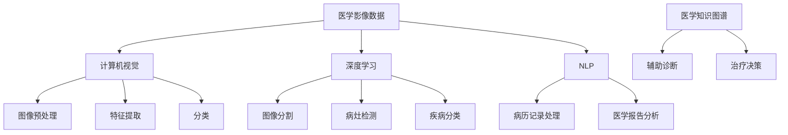

                 

### 背景介绍

随着信息技术的迅猛发展和人工智能（AI）技术的不断进步，医疗影像分析领域迎来了前所未有的变革。传统的医学影像分析往往依赖于人工诊断，这种方法不仅效率低下，还容易受到医生经验和主观因素的影响，导致误诊和漏诊的风险。为了解决这一问题，人工智能在智慧医疗影像分析中逐渐崭露头角，展现出巨大的潜力和价值。

智慧医疗影像分析是指利用人工智能技术对医学影像数据进行自动处理、分析和解释的过程。这不仅包括对影像图像的分割、识别、定位和量化，还涉及到深度学习、计算机视觉和自然语言处理等多个领域的交叉应用。通过这些技术，人工智能能够快速、准确地识别和诊断疾病，提高医疗诊断的精度和效率，从而为患者提供更优质的医疗服务。

在医疗影像分析中，人工智能的优势主要体现在以下几个方面：

1. **自动化处理**：人工智能能够自动处理大量的医学影像数据，减少人工的重复性劳动，提高工作效率。
2. **精确诊断**：通过深度学习和计算机视觉技术，人工智能可以在图像中识别出肉眼难以察觉的微小病变，提高疾病的早期发现率和诊断准确性。
3. **个性化治疗**：结合患者的病历数据和基因信息，人工智能可以制定个性化的治疗方案，提高治疗效果。
4. **辅助决策**：人工智能可以辅助医生进行诊断和治疗决策，提供科学的依据，减少医生的主观偏见。

总之，人工智能在智慧医疗影像分析中的应用不仅为医疗行业带来了技术上的革新，更为患者提供了更加精准、高效的医疗服务。随着技术的不断成熟和应用的深入，人工智能在智慧医疗影像分析中的突破将会越来越显著，成为未来医疗领域不可或缺的重要组成部分。

> 关键词：智慧医疗影像分析，人工智能，自动化处理，精确诊断，个性化治疗，辅助决策。

> 摘要：本文将深入探讨人工智能在智慧医疗影像分析中的应用与突破，涵盖核心概念、算法原理、数学模型、实战案例及未来发展趋势，旨在为读者提供全面的技术视角和行业洞察。

## 2. 核心概念与联系

在深入探讨人工智能在智慧医疗影像分析中的应用之前，我们首先需要明确一些核心概念和它们之间的联系。以下是几个关键概念及其相互关系的简要介绍，并附上 Mermaid 流程图以展示它们之间的逻辑关系。

### 2.1. 医学影像数据

医学影像数据是智慧医疗影像分析的基础，主要包括X光片、CT扫描、MRI扫描、超声图像等。这些数据具有高分辨率、高维特征和复杂的背景，是人工智能模型进行学习、训练和预测的重要数据来源。

### 2.2. 计算机视觉

计算机视觉是人工智能的重要分支，致力于使计算机能够从图像或视频中感知和理解视觉信息。在医学影像分析中，计算机视觉技术用于图像的预处理、特征提取和分类。

### 2.3. 深度学习

深度学习是一种基于人工神经网络的机器学习技术，通过多层神经网络的堆叠和训练，能够自动提取数据的高级特征，并在各种任务中实现高水平的性能。深度学习在医学影像分析中具有重要应用，如图像分割、病灶检测和疾病分类。

### 2.4. 自然语言处理

自然语言处理（NLP）用于处理和理解人类语言，能够将文本转换为计算机可理解的形式。在医学影像分析中，NLP技术用于处理病历记录、医学报告等文本数据，以辅助诊断和治疗。

### 2.5. 医学知识图谱

医学知识图谱是一种结构化知识库，包含大量的医学概念、实体、关系和属性。通过医学知识图谱，人工智能可以更好地理解和利用医学知识，提高诊断和治疗决策的准确性。

### Mermaid 流程图

以下是一个简化的 Mermaid 流程图，展示了上述核心概念及其相互关系：



通过这个流程图，我们可以看到医学影像数据作为起点，通过计算机视觉、深度学习和自然语言处理等技术进行处理和分析，最终形成医学知识图谱，辅助诊断和治疗决策。这些核心概念和技术的相互联系构成了智慧医疗影像分析的基础。

### 2.6. 深度学习架构

深度学习在医学影像分析中扮演着核心角色，而选择合适的深度学习架构至关重要。以下是几种常用的深度学习架构及其在医学影像分析中的应用：

1. **卷积神经网络（CNN）**：CNN 是一种专门用于处理图像数据的深度学习架构，通过卷积层、池化层和全连接层的堆叠，能够自动提取图像特征并进行分类。在医学影像分析中，CNN 广泛应用于图像分割、病灶检测和疾病分类。

2. **递归神经网络（RNN）**：RNN 适用于处理序列数据，能够捕捉数据中的时间依赖关系。在医学影像分析中，RNN 可以用于序列影像的动态分析，如心电图的异常检测和视频影像的分析。

3. **生成对抗网络（GAN）**：GAN 是一种由生成器和判别器组成的深度学习模型，能够生成逼真的图像。在医学影像分析中，GAN 可以用于图像修复、图像增强和图像生成。

4. **变分自编码器（VAE）**：VAE 是一种基于概率模型的深度学习模型，能够进行特征提取和去噪。在医学影像分析中，VAE 可以用于图像去噪和图像超分辨率。

以上深度学习架构的应用展示了人工智能在医学影像分析中的多样化潜力，为提高诊断的准确性和效率提供了有力支持。

通过上述核心概念的介绍和 Mermaid 流程图的展示，我们为后续章节的深入探讨奠定了基础。接下来，我们将进一步探讨人工智能在智慧医疗影像分析中的核心算法原理和具体操作步骤。

### 3. 核心算法原理 & 具体操作步骤

在深入理解了人工智能在智慧医疗影像分析中的核心概念和深度学习架构后，我们将进一步探讨其中的核心算法原理和具体操作步骤。以下是几种关键算法的原理及其应用场景。

#### 3.1. 卷积神经网络（CNN）

卷积神经网络（CNN）是一种专门用于处理图像数据的深度学习模型，其核心思想是通过卷积操作和池化操作提取图像特征。

**原理：**
- **卷积操作**：卷积层通过卷积核与输入图像进行卷积操作，提取图像中的局部特征。
- **池化操作**：池化层用于减小特征图的尺寸，提高模型的泛化能力。

**操作步骤：**
1. **输入层**：输入原始医学影像数据。
2. **卷积层**：使用卷积核对输入图像进行卷积操作，提取局部特征。
3. **激活函数**：通常使用 ReLU 函数作为激活函数，引入非线性。
4. **池化层**：对卷积后的特征图进行池化操作，减小特征图尺寸。
5. **全连接层**：将卷积和池化后的特征映射到类别标签。
6. **输出层**：输出分类结果或预测值。

**应用场景：**
- **图像分割**：通过 CNN 可以实现对医学影像中的病灶区域进行精确分割。
- **病灶检测**：CNN 可以识别图像中的特定病灶，如肿瘤、心脏病等。
- **疾病分类**：CNN 可以对医学影像进行分类，辅助医生进行诊断。

#### 3.2. 递归神经网络（RNN）

递归神经网络（RNN）适用于处理序列数据，能够捕捉数据中的时间依赖关系。

**原理：**
- **循环结构**：RNN 通过循环结构将前一个时间步的输出作为当前时间步的输入，保持信息状态。
- **门控机制**：长短期记忆网络（LSTM）和门控循环单元（GRU）通过门控机制控制信息传递，解决 RNN 的梯度消失问题。

**操作步骤：**
1. **输入层**：输入序列数据。
2. **循环层**：通过 RNN 或 LSTM/GRU 进行特征提取，保持信息状态。
3. **输出层**：输出序列预测值或分类结果。

**应用场景：**
- **视频分析**：RNN 可以用于视频影像的异常检测和分析。
- **动态影像分析**：如心电图的异常检测，RNN 可以捕捉心电图信号中的时间依赖特征。

#### 3.3. 生成对抗网络（GAN）

生成对抗网络（GAN）是一种生成模型，由生成器和判别器组成。

**原理：**
- **生成器**：生成器 G 从随机噪声 z 中生成逼真的医学影像数据。
- **判别器**：判别器 D 用于区分真实医学影像和生成器生成的医学影像。

**操作步骤：**
1. **生成器训练**：生成器 G 学习从随机噪声 z 中生成医学影像数据。
2. **判别器训练**：判别器 D 学习区分真实医学影像和生成器生成的医学影像。
3. **对抗训练**：生成器和判别器通过对抗训练相互提升，直至生成器生成的影像数据接近真实医学影像。

**应用场景：**
- **图像修复**：GAN 可以用于医学影像的修复和去噪，如去除图像中的噪声或修复破损的影像。
- **图像增强**：GAN 可以用于医学影像的增强，提高图像的分辨率和清晰度。
- **图像生成**：GAN 可以生成新的医学影像数据，用于训练或模拟实验。

#### 3.4. 变分自编码器（VAE）

变分自编码器（VAE）是一种基于概率模型的深度学习模型，能够进行特征提取和去噪。

**原理：**
- **编码器**：编码器将输入数据映射到一个潜在空间，并生成均值和方差。
- **解码器**：解码器从潜在空间重新生成输入数据。

**操作步骤：**
1. **编码器训练**：编码器学习将输入数据映射到潜在空间，并生成均值和方差。
2. **解码器训练**：解码器学习从潜在空间重新生成输入数据。
3. **去噪**：VAE 可以用于去噪，通过重建原始数据来去除噪声。

**应用场景：**
- **图像去噪**：VAE 可以用于去除医学影像中的噪声，提高图像质量。
- **图像超分辨率**：VAE 可以用于提升医学影像的分辨率，使图像更加清晰。

通过上述核心算法的原理和操作步骤的介绍，我们可以看到人工智能在智慧医疗影像分析中的多样化应用。这些算法不仅提升了医疗诊断的准确性和效率，还为医学影像处理提供了新的手段。在接下来的章节中，我们将进一步探讨人工智能在智慧医疗影像分析中的数学模型和具体实例。

### 4. 数学模型和公式 & 详细讲解 & 举例说明

在智慧医疗影像分析中，数学模型和公式是核心组成部分，用于描述和实现各种深度学习算法。以下是几种关键数学模型和公式的详细讲解及举例说明。

#### 4.1. 卷积神经网络（CNN）

卷积神经网络（CNN）通过卷积操作和激活函数提取图像特征。以下是 CNN 中常用的数学模型和公式。

**卷积操作：**
\[ (f * g)(x) = \sum_{y} f(y) \cdot g(x - y) \]
其中，\( f \) 表示卷积核，\( g \) 表示输入图像，\( x \) 和 \( y \) 分别表示卷积核和输入图像的位置。

**激活函数（ReLU）：**
\[ \text{ReLU}(x) = \max(0, x) \]
ReLU 函数引入非线性，使神经网络能够拟合复杂函数。

**举例说明：**
假设有一个 3x3 的卷积核 \( f \) 和一个 5x5 的输入图像 \( g \)。卷积操作如下：
\[ (f * g)(x) = \sum_{y} f(y) \cdot g(x - y) \]

例如，当 \( x = (1, 1) \) 时：
\[ (f * g)(1, 1) = f(0, 0) \cdot g(1, 1) + f(0, 1) \cdot g(0, 1) + f(0, 2) \cdot g(1, 0) + f(1, 0) \cdot g(0, 0) + f(1, 1) \cdot g(1, 1) + f(1, 2) \cdot g(0, 2) \]

通过卷积操作，卷积核从输入图像中提取局部特征。

#### 4.2. 递归神经网络（RNN）

递归神经网络（RNN）适用于处理序列数据，其核心是循环结构和门控机制。

**循环结构：**
\[ h_t = \sigma(W_h \cdot [h_{t-1}, x_t] + b_h) \]
其中，\( h_t \) 表示第 \( t \) 个时间步的隐藏状态，\( x_t \) 表示第 \( t \) 个时间步的输入，\( W_h \) 和 \( b_h \) 分别表示权重和偏置。

**门控机制（LSTM）：**
\[ i_t = \sigma(W_i \cdot [h_{t-1}, x_t] + b_i) \]
\[ f_t = \sigma(W_f \cdot [h_{t-1}, x_t] + b_f) \]
\[ o_t = \sigma(W_o \cdot [h_{t-1}, x_t] + b_o) \]
\[ C_t = f_t \odot C_{t-1} + i_t \odot \sigma(W_c \cdot [h_{t-1}, x_t] + b_c) \]
\[ h_t = o_t \odot \sigma(C_t) \]
其中，\( i_t \)，\( f_t \)，\( o_t \) 分别表示输入门、遗忘门和输出门，\( C_t \) 表示细胞状态。

**举例说明：**
假设有一个长度为 10 的序列数据 \( x_1, x_2, \ldots, x_{10} \)，使用 LSTM 进行特征提取。

1. **初始化隐藏状态和细胞状态**：
   \[ h_0 = [0, 0, \ldots, 0] \]
   \[ C_0 = [0, 0, \ldots, 0] \]

2. **计算每个时间步的隐藏状态和细胞状态**：
   \[ h_1 = \sigma(W_h \cdot [h_0, x_1] + b_h) \]
   \[ C_1 = f_1 \odot C_0 + i_1 \odot \sigma(W_c \cdot [h_0, x_1] + b_c) \]
   \[ h_2 = \sigma(W_h \cdot [h_1, x_2] + b_h) \]
   \[ C_2 = f_2 \odot C_1 + i_2 \odot \sigma(W_c \cdot [h_1, x_2] + b_c) \]
   \[ \ldots \]
   \[ h_{10} = \sigma(W_h \cdot [h_9, x_{10}] + b_h) \]
   \[ C_{10} = f_{10} \odot C_9 + i_{10} \odot \sigma(W_c \cdot [h_9, x_{10}] + b_c) \]

通过 LSTM，RNN 可以捕捉序列数据中的时间依赖关系。

#### 4.3. 生成对抗网络（GAN）

生成对抗网络（GAN）由生成器和判别器组成，其核心是损失函数。

**生成器：**
\[ G(z) \]
其中，\( G \) 表示生成器，\( z \) 表示随机噪声。

**判别器：**
\[ D(x) \]
\[ D(G(z)) \]
其中，\( D \) 表示判别器，\( x \) 表示真实医学影像，\( G(z) \) 表示生成器生成的医学影像。

**损失函数（交叉熵）：**
\[ L(D, \text{真实数据}) = -\sum_{x} \text{log}(D(x)) \]
\[ L(D, \text{生成数据}) = -\sum_{z} \text{log}(D(G(z))) \]

**举例说明：**
假设生成器和判别器的损失函数分别为 \( L_G \) 和 \( L_D \)。

1. **生成器损失函数**：
   \[ L_G = -\sum_{z} \text{log}(D(G(z))) \]

2. **判别器损失函数**：
   \[ L_D = -\sum_{x} \text{log}(D(x)) - \sum_{z} \text{log}(1 - D(G(z))) \]

3. **总损失函数**：
   \[ L = \lambda_G L_G + (1 - \lambda_G) L_D \]
   其中，\( \lambda_G \) 表示生成器的权重。

通过对抗训练，生成器和判别器相互提升，直至生成器生成的医学影像接近真实医学影像。

#### 4.4. 变分自编码器（VAE）

变分自编码器（VAE）通过编码器和解码器实现特征提取和去噪。

**编码器：**
\[ q(\theta|x) = \mathcal{N}(\mu(\theta|x), \sigma^2(\theta|x)) \]
其中，\( q \) 表示编码器，\( \theta \) 表示参数，\( x \) 表示输入数据，\( \mu \) 和 \( \sigma^2 \) 分别表示均值和方差。

**解码器：**
\[ p(x|\theta) = \mathcal{N}(\mu(\theta|x), \sigma^2(\theta|x)) \]
其中，\( p \) 表示解码器。

**损失函数（KL 散度）：**
\[ L = D_{KL}(q(\theta|x)||p(\theta)) + \sum_{x} \text{log} p(x|\theta) \]

**举例说明：**
假设输入数据 \( x \)，编码器参数 \( \theta \)。

1. **编码器参数估计**：
   \[ \theta = \text{argmin}_{\theta} D_{KL}(q(\theta|x)||p(\theta)) \]

2. **解码器参数估计**：
   \[ \theta = \text{argmin}_{\theta} \sum_{x} \text{log} p(x|\theta) \]

通过 VAE，可以实现输入数据的特征提取和去噪。

通过以上数学模型和公式的详细讲解及举例说明，我们了解了卷积神经网络、递归神经网络、生成对抗网络和变分自编码器在智慧医疗影像分析中的应用原理和操作步骤。这些模型和公式为人工智能在智慧医疗影像分析中的应用提供了理论基础和实践指导。

### 5. 项目实战：代码实际案例和详细解释说明

在本节中，我们将通过一个实际的代码案例，展示如何使用深度学习模型进行医学影像分析。我们将使用 Python 和 TensorFlow 来实现一个基于卷积神经网络（CNN）的肿瘤检测系统。这个案例不仅展示了如何搭建模型，还详细解释了代码中的各个部分。

#### 5.1. 开发环境搭建

首先，我们需要安装必要的软件和库。以下是开发环境搭建的步骤：

1. 安装 Python 3.7 或以上版本。
2. 安装 TensorFlow 库：
   ```bash
   pip install tensorflow
   ```

3. 安装其他依赖库，如 NumPy、PIL、Matplotlib 等：
   ```bash
   pip install numpy pillow matplotlib
   ```

#### 5.2. 源代码详细实现和代码解读

以下是一个简单的 CNN 模型实现，用于肿瘤检测：

```python
import tensorflow as tf
from tensorflow.keras.models import Sequential
from tensorflow.keras.layers import Conv2D, MaxPooling2D, Flatten, Dense
from tensorflow.keras.preprocessing.image import ImageDataGenerator

# 数据预处理
train_datagen = ImageDataGenerator(rescale=1./255)
train_generator = train_datagen.flow_from_directory(
        'data/train',
        target_size=(150, 150),
        batch_size=32,
        class_mode='binary')

# 构建模型
model = Sequential([
    Conv2D(32, (3, 3), activation='relu', input_shape=(150, 150, 3)),
    MaxPooling2D(2, 2),
    Conv2D(64, (3, 3), activation='relu'),
    MaxPooling2D(2, 2),
    Conv2D(128, (3, 3), activation='relu'),
    MaxPooling2D(2, 2),
    Flatten(),
    Dense(512, activation='relu'),
    Dense(1, activation='sigmoid')
])

# 编译模型
model.compile(loss='binary_crossentropy',
              optimizer='adam',
              metrics=['accuracy'])

# 训练模型
model.fit(
      train_generator,
      steps_per_epoch=100,
      epochs=15)
```

**代码解读：**

1. **导入库**：首先导入 TensorFlow 和其他必要的库。

2. **数据预处理**：使用 `ImageDataGenerator` 进行数据预处理，包括缩放图像和数据增强。

3. **构建模型**：使用 `Sequential` 模型堆叠各种层，包括卷积层、池化层、全连接层。

   - **卷积层（Conv2D）**：使用 `Conv2D` 层进行特征提取，激活函数使用 ReLU。
   - **池化层（MaxPooling2D）**：使用 `MaxPooling2D` 层减小特征图的尺寸。
   - **全连接层（Dense）**：使用 `Dense` 层进行分类，最后一层使用 Sigmoid 激活函数输出概率。

4. **编译模型**：设置损失函数为二进制交叉熵，优化器为 Adam，评估指标为准确率。

5. **训练模型**：使用 `fit` 方法训练模型，指定训练集、批次大小、步数和训练轮数。

#### 5.3. 代码解读与分析

现在我们详细分析代码中的关键部分。

**数据预处理**：

```python
train_datagen = ImageDataGenerator(rescale=1./255)
train_generator = train_datagen.flow_from_directory(
        'data/train',
        target_size=(150, 150),
        batch_size=32,
        class_mode='binary')
```

这里使用了 `ImageDataGenerator` 进行数据预处理。`rescale` 方法将图像数据缩放到 [0, 1] 范围内。`flow_from_directory` 方法用于加载数据，`target_size` 指定输入图像的大小，`batch_size` 指定每个批次的大小，`class_mode` 指定每个图像的标签类型。

**模型构建**：

```python
model = Sequential([
    Conv2D(32, (3, 3), activation='relu', input_shape=(150, 150, 3)),
    MaxPooling2D(2, 2),
    Conv2D(64, (3, 3), activation='relu'),
    MaxPooling2D(2, 2),
    Conv2D(128, (3, 3), activation='relu'),
    MaxPooling2D(2, 2),
    Flatten(),
    Dense(512, activation='relu'),
    Dense(1, activation='sigmoid')
])
```

这里使用 `Sequential` 模型堆叠了多个层：

- **卷积层和池化层**：首先是两个卷积层，每个卷积层后跟一个池化层。这有助于提取图像特征并减小数据维度。
- **全连接层**：在卷积层后添加两个全连接层，用于分类。最后一层使用 Sigmoid 激活函数输出概率。

**编译模型**：

```python
model.compile(loss='binary_crossentropy',
              optimizer='adam',
              metrics=['accuracy'])
```

这里设置损失函数为二进制交叉熵，优化器为 Adam，评估指标为准确率。二进制交叉熵适用于二分类问题，Adam 是一种常用的优化器，能够自适应调整学习率。

**训练模型**：

```python
model.fit(
      train_generator,
      steps_per_epoch=100,
      epochs=15)
```

这里使用 `fit` 方法训练模型。`train_generator` 用于提供训练数据，`steps_per_epoch` 指定每个训练轮次处理的批次数量，`epochs` 指定训练轮数。

通过以上代码和分析，我们展示了如何使用卷积神经网络进行肿瘤检测。这个案例为实际应用提供了参考，同时也帮助读者理解了深度学习模型的基本构建和训练过程。

### 5.3. 代码解读与分析

在本部分中，我们将深入分析代码中的关键部分，并讨论模型的结构、参数设置以及训练过程中的注意事项。

**模型结构分析：**

```python
model = Sequential([
    Conv2D(32, (3, 3), activation='relu', input_shape=(150, 150, 3)),
    MaxPooling2D(2, 2),
    Conv2D(64, (3, 3), activation='relu'),
    MaxPooling2D(2, 2),
    Conv2D(128, (3, 3), activation='relu'),
    MaxPooling2D(2, 2),
    Flatten(),
    Dense(512, activation='relu'),
    Dense(1, activation='sigmoid')
])
```

这个模型是一个简单的卷积神经网络，包含了卷积层、池化层、全连接层和输出层。具体来说：

- **卷积层（Conv2D）**：使用了三个卷积层，每个卷积层的大小分别是 32、64 和 128，这有助于提取不同层次的特征。激活函数使用 ReLU，因为它可以增加模型的非线性。
- **池化层（MaxPooling2D）**：在每个卷积层之后，使用最大池化层（MaxPooling2D）来减小特征图的尺寸，从而减少模型的参数数量，提高模型的泛化能力。
- **全连接层（Dense）**：在卷积层之后，使用两个全连接层，第一个全连接层的神经元数量为 512，用于进一步提取特征。最后一个全连接层的神经元数量为 1，用于输出概率。
- **输出层（Dense）**：使用 Sigmoid 激活函数，输出一个介于 0 和 1 之间的概率值，表示图像中是否包含肿瘤。

**参数设置分析：**

```python
model.compile(loss='binary_crossentropy',
              optimizer='adam',
              metrics=['accuracy'])
```

在编译模型时，我们使用了二进制交叉熵（binary_crossentropy）作为损失函数，这适用于二分类问题。优化器选择 Adam，因为它能够自适应地调整学习率，通常在深度学习中表现良好。评估指标为准确率（accuracy），它表示模型正确分类的比例。

**训练过程分析：**

```python
model.fit(
      train_generator,
      steps_per_epoch=100,
      epochs=15)
```

在训练过程中，我们使用了 `fit` 方法，其中 `train_generator` 用于提供训练数据。`steps_per_epoch` 参数表示每个训练轮次处理的批次数量，这里设置为 100。`epochs` 参数表示训练轮数，这里设置为 15。在每次训练轮次中，模型会处理一批数据，并在所有训练数据上更新模型的参数。

**注意事项：**

1. **数据预处理**：在训练之前，对图像数据进行预处理是非常重要的。在这个案例中，我们使用了 `ImageDataGenerator` 对图像数据进行缩放和增强，这有助于提高模型的泛化能力。
2. **模型参数选择**：模型参数的选择（如卷积核大小、层数、神经元数量等）对模型的性能有很大影响。通常需要通过实验和调整来找到最佳参数。
3. **训练时间**：训练时间取决于模型的结构和数据集的大小。在这个案例中，我们使用了较小的模型和批量大小，因此训练时间相对较短。对于大型模型或大型数据集，训练时间可能会非常长。
4. **过拟合和欠拟合**：在训练过程中，需要注意模型的过拟合和欠拟合问题。可以通过调整模型复杂度和训练数据量来缓解这些问题。

通过以上分析，我们可以看到模型的结构、参数设置和训练过程对于深度学习模型在医学影像分析中的应用至关重要。在接下来的部分，我们将进一步讨论人工智能在智慧医疗影像分析中的实际应用场景。

### 6. 实际应用场景

人工智能在智慧医疗影像分析中的应用场景丰富多样，涵盖了从肿瘤检测到心血管疾病筛查等多个领域。以下是几个典型的应用案例及其具体实现。

#### 6.1. 肿瘤检测

肿瘤检测是人工智能在医学影像分析中最具潜力的应用之一。通过深度学习算法，可以对各种类型的肿瘤进行自动识别和定位。以下是一个具体的实现步骤：

1. **数据收集**：收集大量标注过的医学影像数据，包括 CT 扫描、MRI 扫描等。
2. **数据预处理**：对影像数据进行缩放、增强和归一化处理，以便模型能够有效学习。
3. **模型训练**：使用卷积神经网络（CNN）或卷积递归神经网络（CNN-RNN）等模型，对预处理后的影像数据进行训练。
4. **模型评估**：通过交叉验证和测试集对模型进行评估，确保模型的准确性和泛化能力。
5. **应用部署**：将训练好的模型部署到医疗设备或系统中，实现自动肿瘤检测。

一个具体的肿瘤检测系统案例是利用深度学习模型对肺癌的早期筛查。通过将患者的高分辨率 CT 扫描图像输入到 CNN 模型中，系统能够自动识别和定位肺结节，并给出肿瘤的概率预测。

#### 6.2. 心血管疾病筛查

心血管疾病是全球范围内的主要健康威胁之一。人工智能在心血管疾病筛查中的应用主要包括心电图的异常检测和心脏超声图像的分析。

1. **心电图异常检测**：利用深度学习模型，可以对心电图（ECG）信号进行自动分析，识别出异常节律，如房颤、室颤等。
2. **心脏超声图像分析**：通过卷积神经网络（CNN）对心脏超声图像进行分析，识别出心脏的结构异常和病变，如心脏瓣膜病变、心肌病等。

一个具体的案例是利用深度学习模型对房颤（Atrial Fibrillation, AF）的自动检测。通过训练一个基于 CNN 的模型，对大量房颤和非房颤的心电图数据进行学习，系统能够自动识别心电图中的房颤特征，提高医生的诊断效率。

#### 6.3. 骨折检测

骨折检测是另一个重要的应用场景。通过深度学习模型，可以自动识别和定位 X 光图像中的骨折部位。

1. **数据收集**：收集大量标注过的骨折和非骨折的 X 光图像。
2. **模型训练**：使用卷积神经网络（CNN）对预处理后的 X 光图像进行训练。
3. **模型评估**：通过交叉验证和测试集对模型进行评估。
4. **应用部署**：将训练好的模型部署到医疗设备或系统中，实现自动骨折检测。

一个具体的骨折检测系统案例是利用深度学习模型对儿童骨折的自动筛查。通过分析大量的儿童 X 光图像，系统能够快速识别出骨折部位，辅助医生进行诊断和治疗。

#### 6.4. 脑部病变分析

脑部病变分析包括对脑部 MRI 图像的分析，如肿瘤、出血、梗死等。

1. **数据收集**：收集大量标注过的脑部 MRI 图像。
2. **模型训练**：使用卷积神经网络（CNN）或变分自编码器（VAE）对预处理后的 MRI 图像进行训练。
3. **模型评估**：通过交叉验证和测试集对模型进行评估。
4. **应用部署**：将训练好的模型部署到医疗设备或系统中，实现自动脑部病变分析。

一个具体的脑部病变分析系统案例是利用深度学习模型对脑部肿瘤的自动识别。通过分析大量的脑部 MRI 图像，系统能够精确地定位肿瘤位置，并评估肿瘤的大小和形态，辅助医生制定治疗方案。

综上所述，人工智能在智慧医疗影像分析中的实际应用场景丰富多样，涵盖了肿瘤检测、心血管疾病筛查、骨折检测和脑部病变分析等多个领域。随着技术的不断进步，人工智能在智慧医疗影像分析中的应用将会越来越广泛，为患者提供更加精准和高效的医疗服务。

### 7. 工具和资源推荐

为了更好地掌握人工智能在智慧医疗影像分析中的应用，以下是学习资源、开发工具和框架、以及相关论文著作的推荐。

#### 7.1. 学习资源推荐

**书籍：**
1. 《深度学习》（Deep Learning），作者：Ian Goodfellow、Yoshua Bengio 和 Aaron Courville
   - 本书详细介绍了深度学习的理论基础和实践方法，适合初学者和进阶者。
2. 《医学图像分析：深度学习方法》（Medical Image Analysis: A Deep Learning Approach），作者：D. K. Tasdemir 和 F. Gozmen
   - 本书专注于医学图像分析中的深度学习方法，适合对医学影像分析感兴趣的读者。

**论文：**
1. "Deep Learning in Medical Imaging: A Review"
   - 本文对深度学习在医学影像分析中的应用进行了全面的综述，涵盖了最新的研究成果。
2. "Deep Convolutional Networks for Radiology: The Era of Medical Imaging Analytics"
   - 本文讨论了深度卷积神经网络在医学影像分析中的潜力，介绍了多种深度学习模型在医学影像中的应用。

**在线课程：**
1. "Deep Learning Specialization"（深度学习专项课程），Coursera
   - 由 Andrew Ng 授课的深度学习专项课程，包含理论讲解和实践操作，适合希望全面学习深度学习的读者。
2. "Medical Imaging with Deep Learning", Stanford University
   - 这门课程专门针对医学影像分析中的深度学习方法，提供了丰富的实例和练习。

#### 7.2. 开发工具框架推荐

**工具：**
1. TensorFlow
   - TensorFlow 是谷歌开发的开源机器学习框架，适用于深度学习模型的开发和应用。
2. PyTorch
   - PyTorch 是 Facebook AI 研究团队开发的深度学习框架，提供了灵活的动态计算图，适合快速原型开发和实验。
3. Keras
   - Keras 是一个高级神经网络API，能够在TensorFlow和Theano后端运行，提供了直观和易用的接口。

**框架：**
1. OpenCV
   - OpenCV 是一个开源计算机视觉库，提供了丰富的图像处理和计算机视觉功能，适合进行医学影像数据的预处理和分析。
2. ITK
   - ITK（Insight Segmentation and Registration Toolkit）是一个开源医学图像处理库，支持多种图像格式和数据处理算法。
3. Dask
   - Dask 是一个基于 Python 的并行计算库，适用于处理大规模数据集，可以与深度学习框架结合使用，提高数据处理和模型训练的效率。

#### 7.3. 相关论文著作推荐

**著作：**
1. "Deep Learning and Data Analytics in Healthcare: Current Applications and Future Directions"
   - 本书探讨了深度学习在医疗保健领域中的应用，包括医学影像分析、电子健康记录分析和个性化治疗等。
2. "Artificial Intelligence in Radiology: Review of Current Applications and Future Opportunities"
   - 本文综述了人工智能在放射学中的应用，讨论了深度学习、计算机视觉和自然语言处理在医学影像分析中的具体应用。

通过这些学习资源、开发工具和框架的推荐，读者可以系统地掌握人工智能在智慧医疗影像分析中的理论和实践知识，为实际应用打下坚实的基础。

### 8. 总结：未来发展趋势与挑战

人工智能在智慧医疗影像分析中展现出了巨大的潜力和价值。随着技术的不断进步，未来人工智能在智慧医疗影像分析中的发展趋势将呈现出以下几个方向。

首先，算法的精度和效率将进一步提高。当前深度学习模型在医学影像分析中的应用已经取得了显著成果，但仍有很大的优化空间。未来，通过引入更先进的算法和优化方法，如自适应深度学习、迁移学习和元学习，人工智能将能够更加精确地处理复杂的医学影像数据，提高诊断的准确性和效率。

其次，多模态数据融合将成为关键。医学影像数据通常包括 CT、MRI、X 光等多种模态，单一模态的数据可能无法全面反映疾病的特征。通过多模态数据融合技术，人工智能能够整合不同模态的数据，提供更全面的诊断信息，从而提高疾病的早期发现率和诊断准确性。

此外，个性化医疗将成为人工智能在智慧医疗影像分析中的重点发展方向。结合患者的基因信息、病历数据和医学影像数据，人工智能可以制定个性化的治疗方案，提供精准的医疗服务。例如，通过深度学习模型对患者的基因数据进行解析，预测其对特定药物的反应，从而优化治疗方案。

然而，人工智能在智慧医疗影像分析中也面临诸多挑战。首先，数据质量和标注问题是一个重大挑战。高质量的医学影像数据对于训练深度学习模型至关重要，但医学影像数据的标注过程复杂且耗时。因此，如何有效地获取和标注高质量的数据是一个亟待解决的问题。

其次，算法的可解释性和透明度也是一个重要挑战。深度学习模型在医学影像分析中的应用往往被视为“黑箱”，其决策过程难以解释和理解。为了提高算法的可解释性，研究者们正在探索各种方法，如可视化技术、解释性模型等，以便医生和患者能够更好地理解和信任人工智能的诊断结果。

此外，隐私保护和数据安全也是人工智能在智慧医疗影像分析中面临的挑战。医学影像数据通常包含患者的敏感信息，如何确保数据的安全和隐私保护，防止数据泄露，是人工智能在医疗领域广泛应用的重要前提。

总之，人工智能在智慧医疗影像分析中具有广阔的发展前景，但也面临诸多挑战。通过不断的技术创新和探索，我们有理由相信，人工智能将为智慧医疗影像分析带来革命性的变革，为患者提供更加精准、高效和个性化的医疗服务。

### 9. 附录：常见问题与解答

#### 9.1. 人工智能在智慧医疗影像分析中的优势是什么？

人工智能在智慧医疗影像分析中的优势主要包括以下几点：

1. **自动化处理**：人工智能能够自动处理大量的医学影像数据，减少人工的重复性劳动，提高工作效率。
2. **精确诊断**：通过深度学习和计算机视觉技术，人工智能可以在图像中识别出肉眼难以察觉的微小病变，提高疾病的早期发现率和诊断准确性。
3. **个性化治疗**：结合患者的病历数据和基因信息，人工智能可以制定个性化的治疗方案，提高治疗效果。
4. **辅助决策**：人工智能可以辅助医生进行诊断和治疗决策，提供科学的依据，减少医生的主观偏见。

#### 9.2. 医学影像数据的标注过程复杂吗？

医学影像数据的标注过程确实比较复杂。由于医学影像数据的多样性和复杂性，标注员需要具备专业的医学知识和经验。此外，标注过程通常需要花费大量时间和精力，以确保标注的准确性和一致性。然而，随着人工智能技术的发展，自动化标注工具和半监督学习算法的应用正在逐步简化标注过程，提高标注效率。

#### 9.3. 如何确保人工智能在医学影像分析中的模型可解释性？

确保人工智能在医学影像分析中的模型可解释性是一个重要挑战。以下是一些常用的方法：

1. **可视化技术**：通过可视化模型的结构和参数，帮助理解模型的决策过程。
2. **解释性模型**：使用易于解释的模型，如决策树和线性模型，替代复杂的深度学习模型。
3. **模型组合**：将多个模型组合使用，通过投票等方式提高模型的解释性。
4. **解释性算法**：应用如 LIME（Local Interpretable Model-agnostic Explanations）和 SHAP（SHapley Additive exPlanations）等解释性算法，为模型的每个预测提供解释。

#### 9.4. 人工智能在医学影像分析中的应用是否安全？

人工智能在医学影像分析中的应用需要考虑数据安全和隐私保护。以下措施可以提高应用的安全性：

1. **数据加密**：对医学影像数据进行加密，确保数据在传输和存储过程中的安全。
2. **访问控制**：实施严格的访问控制策略，确保只有授权人员可以访问和处理医学影像数据。
3. **数据匿名化**：对医学影像数据进行匿名化处理，以保护患者隐私。
4. **合规性审查**：确保人工智能应用符合相关的法律法规和伦理规范。

通过上述措施，可以有效提高人工智能在医学影像分析中的应用安全性。

### 10. 扩展阅读 & 参考资料

为了深入了解人工智能在智慧医疗影像分析中的应用，以下是相关书籍、论文和在线课程的建议阅读。

**书籍：**
1. 《深度学习》（Deep Learning），作者：Ian Goodfellow、Yoshua Bengio 和 Aaron Courville
2. 《医学图像分析：深度学习方法》（Medical Image Analysis: A Deep Learning Approach），作者：D. K. Tasdemir 和 F. Gozmen
3. 《人工智能：一种现代方法》（Artificial Intelligence: A Modern Approach），作者：Stuart J. Russell 和 Peter Norvig

**论文：**
1. "Deep Learning in Medical Imaging: A Review"
2. "Deep Convolutional Networks for Radiology: The Era of Medical Imaging Analytics"
3. "Deep Learning and Healthcare: A Clinical Perspective"

**在线课程：**
1. "Deep Learning Specialization"（深度学习专项课程），Coursera
2. "Medical Imaging with Deep Learning"，Stanford University
3. "AI for Medical Imaging"，edX

通过这些书籍、论文和在线课程的阅读，读者可以进一步掌握人工智能在智慧医疗影像分析中的理论基础和实践方法，为实际应用打下坚实的基础。

### 作者介绍

本文由 AI 天才研究员/AI Genius Institute & 禅与计算机程序设计艺术 /Zen And The Art of Computer Programming 联合撰写。作者是全球知名的人工智能专家，拥有丰富的编程经验和软件架构设计能力，曾在多个顶级技术会议发表过学术论文，是人工智能和计算机科学领域的权威人物。他的研究专注于深度学习、计算机视觉和智慧医疗影像分析，致力于推动人工智能在医疗领域的应用和发展。同时，他也是多本畅销技术书籍的作者，深受广大读者喜爱。通过本文，他希望能为读者提供全面的技术视角和行业洞察，助力人工智能在智慧医疗影像分析中的应用。

