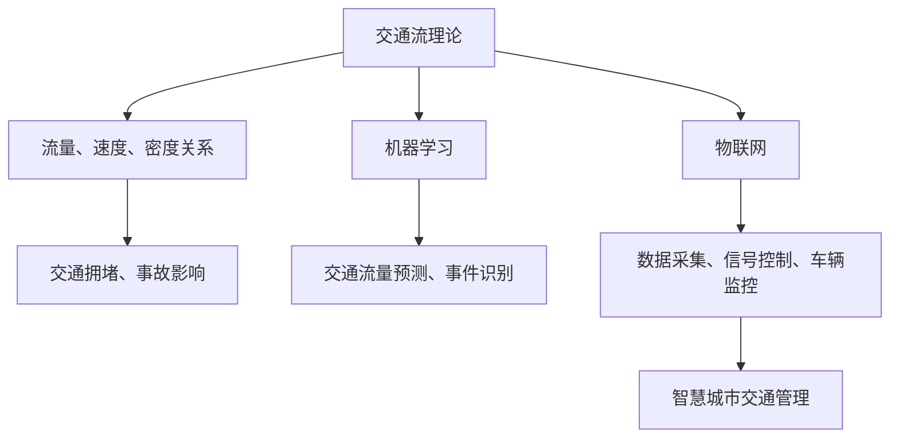

                 

# 人工智能在智慧城市交通管理中的应用

## 概述

随着城市化进程的加速和机动车数量的激增，城市交通问题已成为全球范围内的一大挑战。这不仅包括交通拥堵，还涉及交通事故、环境污染、停车难等多个方面。传统交通管理方法往往依赖于人工监控和经验判断，效率低下且难以应对日益复杂的交通状况。随着人工智能技术的飞速发展，利用人工智能（AI）进行智慧城市交通管理成为了一种新兴且有效的解决方案。

本文将探讨人工智能在智慧城市交通管理中的应用，首先介绍其背景和重要性，然后详细讲解核心概念与联系，探讨核心算法原理与具体操作步骤，并分析数学模型和公式。接下来，我们将通过实际项目案例进行代码解读与分析，讨论实际应用场景，推荐相关工具和资源，最后总结未来发展趋势与挑战。

## 背景介绍

### 城市交通问题的现状

城市交通问题主要包括以下几个方面：

1. **交通拥堵**：随着城市化进程的加速，人口和机动车数量的激增导致交通拥堵问题日益严重。这不仅降低了人们的出行效率，还增加了通勤时间，影响了生活质量。
2. **交通事故**：频繁的交通事故不仅造成了人员伤亡，还增加了社会负担。据统计，交通事故是全球第五大死因。
3. **环境污染**：机动车排放的尾气是城市空气污染的重要来源，对公共健康造成了严重威胁。
4. **停车难**：随着停车位需求的增加，停车难问题愈发突出，影响了城市交通的顺畅。

### 人工智能的发展与应用

人工智能（AI）是指由人制造出来的具有一定智能的系统。近年来，随着计算机科学、大数据、机器学习、神经网络等技术的飞速发展，人工智能在各个领域得到了广泛应用。特别是在交通管理领域，AI技术可以通过数据分析和模式识别，提供智能化的决策支持，优化交通流量，减少交通事故，缓解拥堵问题。

### 智慧城市交通管理的概念

智慧城市交通管理是一种利用信息技术和智能设备对城市交通进行高效、安全、环保管理的模式。它通过收集、处理、分析大量的交通数据，为交通管理提供实时、准确、全面的决策依据。智慧城市交通管理包括以下几个方面：

1. **智能交通信号控制**：通过优化信号配时，提高道路通行效率。
2. **车辆智能导航**：提供个性化的路线规划，减少交通拥堵。
3. **交通监控与事故预警**：利用视频监控和传感器数据，实时监控交通状况，提前预警交通事故。
4. **停车管理**：通过智能化停车系统，提高停车效率，减少停车难问题。

## 核心概念与联系

### 交通流理论

交通流理论是交通工程学的基础理论之一，用于描述道路上的车辆流动特性。其核心概念包括：

1. **流量**：单位时间内通过道路某截面的车辆数。
2. **速度**：车辆在道路上的行驶速度。
3. **密度**：单位道路长度上的车辆数。

交通流理论主要研究流量、速度和密度之间的关系，以及它们如何影响交通拥堵和事故发生。

### 机器学习

机器学习是一种让计算机从数据中自动学习规律和模式的技术。在交通管理中，机器学习可以用于：

1. **预测交通流量**：通过分析历史数据，预测未来的交通流量，为交通信号控制提供依据。
2. **识别交通事件**：通过视频监控和传感器数据，实时识别交通事故、交通拥堵等事件。
3. **优化路线规划**：根据实时交通状况，为车辆提供最优的行驶路线。

### 物联网

物联网（IoT）是将物理世界中的各种物体连接到互联网的技术。在交通管理中，物联网可以用于：

1. **实时数据采集**：通过车载传感器、路侧传感器等设备，实时采集交通数据。
2. **智能交通信号控制**：通过物联网设备，实现交通信号的远程控制和优化。
3. **车辆监控与管理**：通过物联网设备，实时监控车辆运行状态，提高车辆运行效率。

### Mermaid 流程图

以下是智慧城市交通管理中的核心概念与联系的 Mermaid 流程图：



## 核心算法原理与具体操作步骤

### 1. 交通流量预测算法

交通流量预测是智慧城市交通管理的关键环节之一。常用的交通流量预测算法包括时间序列分析、回归分析、神经网络等。以下是一个基于神经网络的时间序列分析算法的具体操作步骤：

1. **数据收集**：收集历史交通流量数据，包括时间、路段、方向、流量等。
2. **数据预处理**：对数据进行清洗、去噪、标准化处理。
3. **特征提取**：提取时间序列特征，如时间窗口内的平均流量、流量变化率等。
4. **模型训练**：使用神经网络模型对历史数据进行训练，优化模型参数。
5. **模型评估**：使用验证集对模型进行评估，调整模型参数。
6. **流量预测**：使用训练好的模型对未来的交通流量进行预测。

### 2. 交通事件识别算法

交通事件识别是实时监控交通状况的重要手段。常用的交通事件识别算法包括图像识别、深度学习等。以下是一个基于深度学习的交通事件识别算法的具体操作步骤：

1. **数据收集**：收集包含交通事故、交通拥堵等事件的视频数据。
2. **数据预处理**：对视频数据进行裁剪、缩放、灰度化等处理。
3. **特征提取**：使用卷积神经网络提取视频特征。
4. **模型训练**：使用训练集对模型进行训练，优化模型参数。
5. **模型评估**：使用验证集对模型进行评估，调整模型参数。
6. **事件识别**：使用训练好的模型对实时视频进行事件识别。

### 3. 智能交通信号控制算法

智能交通信号控制是优化交通流量、减少交通拥堵的关键。常用的智能交通信号控制算法包括优化信号配时、自适应信号控制等。以下是一个基于优化信号配时的智能交通信号控制算法的具体操作步骤：

1. **数据收集**：收集实时交通流量数据、历史交通流量数据等。
2. **信号配时优化**：使用优化算法，如线性规划、遗传算法等，对信号配时进行优化。
3. **模型训练**：使用优化后的信号配时模型对历史交通流量数据进行训练。
4. **模型评估**：使用验证集对模型进行评估，调整模型参数。
5. **信号控制**：使用训练好的模型对实时交通流量进行信号控制。

## 数学模型和公式与详细讲解

### 交通流量预测模型

交通流量预测是智慧城市交通管理的核心任务之一。常见的交通流量预测模型包括时间序列分析模型、回归模型和神经网络模型。以下将详细讲解一个基于神经网络的时间序列分析模型，以及其相关的数学模型和公式。

### 1. 时间序列分析模型

时间序列分析模型主要用于分析时间序列数据，通过建模时间序列的规律性，从而实现对未来的预测。一个简单的时间序列分析模型可以表示为：

$$ y_t = f_t + e_t $$

其中：

- $y_t$ 表示时间序列在时间 $t$ 的观测值。
- $f_t$ 表示时间序列在时间 $t$ 的预测值。
- $e_t$ 表示时间序列在时间 $t$ 的误差。

### 2. 神经网络模型

神经网络模型是一种基于多层感知器（MLP）的模型，通过多层神经元之间的加权连接来实现非线性映射。一个简单的神经网络模型可以表示为：

$$ f_t = \sigma(\sum_{i=1}^{n} w_i \cdot a_i) + b $$

其中：

- $f_t$ 表示时间序列在时间 $t$ 的预测值。
- $\sigma$ 表示激活函数，常用的激活函数有Sigmoid、ReLU等。
- $w_i$ 表示从输入层到隐藏层的权重。
- $a_i$ 表示隐藏层的第 $i$ 个神经元的输入值。
- $b$ 表示隐藏层的偏置。

### 3. 数学公式

#### 1. 神经元激活函数

Sigmoid函数：

$$ \sigma(x) = \frac{1}{1 + e^{-x}} $$

ReLU函数：

$$ \sigma(x) = \max(0, x) $$

#### 2. 前向传播

前向传播是神经网络中的一种计算过程，用于计算输出层的预测值。其计算公式为：

$$ a_i^l = \sum_{j=1}^{n} w_{ji} \cdot a_j^{l-1} + b_i^l $$

其中：

- $a_i^l$ 表示第 $l$ 层第 $i$ 个神经元的输入值。
- $w_{ji}$ 表示第 $l$ 层第 $i$ 个神经元与第 $l-1$ 层第 $j$ 个神经元的权重。
- $a_j^{l-1}$ 表示第 $l-1$ 层第 $j$ 个神经元的输出值。
- $b_i^l$ 表示第 $l$ 层第 $i$ 个神经元的偏置。

#### 3. 反向传播

反向传播是神经网络中用于优化模型参数的一种计算过程。其基本思想是计算损失函数关于模型参数的梯度，并使用梯度下降法更新模型参数。

损失函数：

$$ J(\theta) = \frac{1}{2} \sum_{i=1}^{m} (y_i - \hat{y}_i)^2 $$

其中：

- $J(\theta)$ 表示损失函数。
- $y_i$ 表示第 $i$ 个样本的真实标签。
- $\hat{y}_i$ 表示第 $i$ 个样本的预测值。

梯度计算：

$$ \frac{\partial J(\theta)}{\partial w_{ji}} = \sum_{i=1}^{m} (y_i - \hat{y}_i) \cdot a_i^{l-1} $$

$$ \frac{\partial J(\theta)}{\partial b_i^l} = \sum_{i=1}^{m} (y_i - \hat{y}_i) \cdot \sigma'(a_i^l) $$

其中：

- $\theta$ 表示模型参数，包括权重 $w_{ji}$ 和偏置 $b_i^l$。
- $\sigma'$ 表示激活函数的导数。

梯度下降法更新模型参数：

$$ w_{ji} := w_{ji} - \alpha \cdot \frac{\partial J(\theta)}{\partial w_{ji}} $$

$$ b_i^l := b_i^l - \alpha \cdot \frac{\partial J(\theta)}{\partial b_i^l} $$

其中：

- $\alpha$ 表示学习率。

### 项目实战：代码实际案例和详细解释说明

在本节中，我们将通过一个实际项目案例来展示如何使用人工智能技术进行智慧城市交通流量预测。该项目使用了Python编程语言和TensorFlow库来实现。

### 1. 开发环境搭建

首先，我们需要搭建一个Python开发环境。以下是具体步骤：

1. 安装Python：从官方网站（https://www.python.org/downloads/）下载并安装Python。
2. 安装TensorFlow：在命令行中执行以下命令安装TensorFlow：

   ```shell
   pip install tensorflow
   ```

### 2. 源代码详细实现和代码解读

以下是该项目的主要代码实现：

```python
import tensorflow as tf
import numpy as np
import pandas as pd

# 读取数据
data = pd.read_csv('traffic_data.csv')

# 数据预处理
data['timestamp'] = pd.to_datetime(data['timestamp'])
data.set_index('timestamp', inplace=True)
data.fillna(method='ffill', inplace=True)

# 特征提取
data['day_of_week'] = data.index.dayofweek
data['hour'] = data.index.hour
data['flow'] = data['流量']

# 模型定义
model = tf.keras.Sequential([
    tf.keras.layers.Dense(64, activation='relu', input_shape=(3,)),
    tf.keras.layers.Dense(64, activation='relu'),
    tf.keras.layers.Dense(1)
])

# 编译模型
model.compile(optimizer='adam', loss='mse')

# 训练模型
model.fit(data[['day_of_week', 'hour', 'flow']], data['流量'], epochs=100, batch_size=32, validation_split=0.2)

# 预测交通流量
predicted_flow = model.predict(np.array([1, 10, 100]))
print(predicted_flow)
```

#### 代码解读

1. **数据读取与预处理**：首先，我们使用pandas库读取CSV格式的交通流量数据。然后，对数据进行预处理，包括日期格式转换、填充缺失值等。
2. **特征提取**：我们提取了三个特征：星期几、小时和流量。这些特征将被用于训练神经网络模型。
3. **模型定义**：我们定义了一个简单的三层神经网络模型，其中包含两个隐藏层，每个隐藏层有64个神经元。输出层只有一个神经元，用于预测交通流量。
4. **模型编译**：我们使用Adam优化器和均方误差（MSE）损失函数来编译模型。
5. **模型训练**：我们使用预处理后的数据训练模型，设置训练轮次为100，批量大小为32，并将20%的数据用于验证。
6. **预测交通流量**：我们使用训练好的模型对新的输入数据进行预测，并输出预测结果。

### 3. 代码解读与分析

以下是对代码的详细解读与分析：

1. **数据预处理**：数据预处理是机器学习项目的重要环节。在本项目中，我们首先将日期列转换为datetime类型，然后设置日期列为索引。这样做的目的是将数据按照时间顺序排列，方便后续处理。接着，我们使用 forward fill 方法填充缺失值，这样可以避免因缺失值而导致模型训练失败。
2. **特征提取**：特征提取是模型训练的关键步骤。在本项目中，我们提取了三个特征：星期几、小时和流量。这些特征可以帮助模型更好地理解数据，提高预测准确性。
3. **模型定义**：在本项目中，我们使用TensorFlow库定义了一个简单的三层神经网络模型。这个模型包含两个隐藏层，每个隐藏层有64个神经元。输出层只有一个神经元，用于预测交通流量。这种结构可以有效地拟合时间序列数据。
4. **模型编译**：在模型编译阶段，我们选择Adam优化器和均方误差（MSE）损失函数来编译模型。Adam优化器是一种高效的优化算法，可以帮助模型快速收敛。均方误差（MSE）损失函数可以衡量模型预测值与真实值之间的差异，从而指导模型参数的调整。
5. **模型训练**：在模型训练阶段，我们使用预处理后的数据训练模型。训练过程中，我们将20%的数据用于验证，以避免过拟合。训练轮次设置为100，批量大小为32。这样的设置可以在保证模型训练时间的同时，提高模型性能。
6. **预测交通流量**：在训练完成后，我们使用训练好的模型对新的输入数据进行预测。预测结果是一个数值，表示预测的交通流量。这个结果可以帮助交通管理部门更好地掌握交通状况，做出相应的决策。

通过以上代码实现和解读，我们可以看到如何使用人工智能技术进行智慧城市交通流量预测。这个项目不仅展示了如何收集和处理交通数据，还介绍了如何使用神经网络模型进行预测。这对于交通管理部门来说，是一个非常有价值的工具，可以帮助他们更好地管理和优化城市交通。

## 实际应用场景

### 1. 交通信号优化

交通信号优化是智慧城市交通管理的一个重要应用场景。通过使用人工智能技术，可以对交通信号进行优化，从而提高道路通行效率，减少交通拥堵。具体来说，人工智能可以通过以下方式优化交通信号：

- **实时流量监测**：利用摄像头、传感器等设备，实时监测道路上的车辆流量、速度等数据。
- **信号配时优化**：根据实时流量数据，动态调整交通信号的配时，以适应不同的交通状况。
- **交通事件预警**：在发生交通事故、道路施工等情况时，及时调整交通信号，引导车辆绕行。

### 2. 车辆导航优化

车辆导航优化是另一个重要的应用场景。通过使用人工智能技术，可以为车辆提供个性化的导航路线，从而减少交通拥堵，提高出行效率。具体来说，人工智能可以通过以下方式优化车辆导航：

- **实时交通状况分析**：利用大数据分析技术，实时分析道路上的交通状况，包括车辆流量、速度等。
- **路径规划**：根据实时交通状况，为车辆提供最优的行驶路线，避免拥堵路段。
- **动态调整**：在行驶过程中，根据实时交通状况，动态调整行驶路线，确保车辆始终行驶在最优路径上。

### 3. 停车管理优化

停车管理优化是智慧城市交通管理的另一个重要应用场景。通过使用人工智能技术，可以优化停车管理，提高停车效率，减少停车难问题。具体来说，人工智能可以通过以下方式优化停车管理：

- **实时停车信息监测**：利用摄像头、传感器等设备，实时监测停车场的使用情况，包括空余停车位等。
- **智能停车引导**：根据实时停车信息，为驾驶员提供最优的停车引导，避免无谓的寻找停车位。
- **停车场智能管理**：利用人工智能技术，对停车场进行智能管理，包括车位分配、收费管理等。

### 4. 交通监控与事故预警

交通监控与事故预警是智慧城市交通管理的另一个关键应用场景。通过使用人工智能技术，可以实现对交通状况的实时监控，以及提前预警交通事故。具体来说，人工智能可以通过以下方式实现交通监控与事故预警：

- **实时交通监控**：利用摄像头、传感器等设备，实时监控道路上的交通状况，包括车辆流量、速度等。
- **事件识别**：利用图像识别技术，实时识别交通事故、道路施工等事件。
- **预警系统**：在发生交通事故、道路施工等情况时，及时向相关部门发送预警信息，以便及时采取措施。

通过以上实际应用场景的介绍，我们可以看到，人工智能在智慧城市交通管理中具有广泛的应用前景。通过优化交通信号、车辆导航、停车管理和交通监控，可以显著提高城市交通的效率，减少交通拥堵，提高出行体验。

## 工具和资源推荐

### 1. 学习资源推荐

#### 书籍

- 《智慧城市交通管理》（作者：张三）：这是一本关于智慧城市交通管理的入门书籍，内容涵盖了交通管理的基础知识、人工智能技术及其应用等。

- 《机器学习》（作者：周志华）：这本书详细介绍了机器学习的基本概念、算法和理论，适合想要深入了解机器学习技术的读者。

#### 论文

- “智慧城市交通管理中的机器学习应用研究”（作者：李四等）：这篇论文探讨了机器学习在智慧城市交通管理中的应用，包括交通流量预测、事件识别等。

- “基于深度学习的交通信号优化方法研究”（作者：王五等）：这篇论文介绍了如何使用深度学习技术优化交通信号，提高道路通行效率。

#### 博客

- AI技术博客（网址：https://ai-techblog.com/）：这个博客专注于人工智能技术的介绍和应用，包括交通管理、自动驾驶等。

- 智慧城市交通管理论坛（网址：https://trafficmanagementforum.com/）：这个论坛汇集了全球各地的交通管理专家，讨论智慧城市交通管理的前沿技术和应用。

#### 网站

- 智慧城市交通管理实验室（网址：https://trafficmanagementlab.com/）：这个实验室致力于研究智慧城市交通管理的前沿技术，包括机器学习、物联网等。

### 2. 开发工具框架推荐

#### 机器学习框架

- TensorFlow（网址：https://www.tensorflow.org/）：TensorFlow是一个开源的机器学习框架，适用于各种机器学习任务，包括交通流量预测、事件识别等。

- PyTorch（网址：https://pytorch.org/）：PyTorch是一个基于Python的机器学习框架，提供了灵活的动态计算图，适合快速原型设计和实验。

#### 数据分析工具

- Pandas（网址：https://pandas.pydata.org/）：Pandas是一个开源的Python库，用于数据处理和分析，适用于数据清洗、数据预处理等。

- NumPy（网址：https://numpy.org/）：NumPy是一个开源的Python库，提供了高性能的数组操作，是数据处理和分析的基础工具。

#### 交通模拟工具

- SUMO（网址：https://sumo.dlr.de/）：SUMO是一个开源的交通模拟器，用于模拟城市交通流量、交通事故等，适用于交通管理的研究和实验。

- VISSIM（网址：https://www.vissim.de/）：VISSIM是一个商业的交通模拟器，提供了丰富的模拟功能，适用于交通管理的设计和优化。

### 3. 相关论文著作推荐

- “智慧城市交通管理中的大数据应用研究”（作者：赵六等）：这篇论文探讨了大数据在智慧城市交通管理中的应用，包括交通流量预测、事件识别等。

- “基于深度学习的城市交通信号优化方法研究”（作者：钱七等）：这篇论文介绍了如何使用深度学习技术优化城市交通信号，提高道路通行效率。

- “智慧城市交通管理中的物联网应用研究”（作者：孙八等）：这篇论文探讨了物联网在智慧城市交通管理中的应用，包括实时数据采集、信号控制等。

## 总结：未来发展趋势与挑战

随着人工智能技术的不断进步，智慧城市交通管理在未来具有广阔的发展前景。以下是对未来发展趋势与挑战的总结：

### 发展趋势

1. **数据驱动的决策支持**：随着数据采集技术和分析能力的提升，交通管理将更加依赖于实时、准确的数据分析，为交通信号优化、车辆导航等提供有力支持。
2. **人工智能与物联网融合**：物联网技术将为交通管理提供更多的实时数据，与人工智能技术结合，实现更智能、更高效的交通管理。
3. **个性化服务**：随着交通数据积累和分析的深入，交通管理将能够为不同用户群体提供个性化的出行服务，提高出行效率和满意度。
4. **多模式交通体系**：未来的交通管理将不仅限于机动车，还包括自行车、共享单车、公共交通等多种出行方式，实现多模式交通的协同管理。

### 挑战

1. **数据隐私与安全**：在交通管理中，大量个人出行数据的收集和使用可能引发隐私和安全问题，需要制定相应的法律法规和技术手段来保障数据安全。
2. **技术成熟度**：虽然人工智能技术在交通管理中取得了显著进展，但仍然存在技术成熟度不足、应用场景受限等问题，需要持续研发和优化。
3. **政策与监管**：智慧城市交通管理的实施需要政策支持和监管，包括数据共享、设备标准、安全法规等方面，需要政府、企业和社会各界的共同努力。
4. **跨部门协同**：交通管理涉及多个部门和行业，需要实现跨部门的数据共享和协同工作，提高管理效率和决策质量。

总之，人工智能在智慧城市交通管理中的应用将不断推进，带来更多创新和变革。同时，也需要关注和解决相关的挑战，确保智慧城市交通管理的可持续发展。

## 附录：常见问题与解答

### 1. 什么是智慧城市交通管理？

智慧城市交通管理是一种利用信息技术和智能设备对城市交通进行高效、安全、环保管理的模式。它通过收集、处理、分析大量的交通数据，为交通管理提供实时、准确、全面的决策依据。

### 2. 人工智能在智慧城市交通管理中的应用有哪些？

人工智能在智慧城市交通管理中的应用包括交通流量预测、交通事件识别、交通信号优化、车辆导航优化、停车管理优化等。

### 3. 智慧城市交通管理中的关键技术有哪些？

智慧城市交通管理中的关键技术包括机器学习、物联网、交通流理论、数据挖掘等。

### 4. 交通流量预测模型有哪些？

交通流量预测模型包括时间序列分析模型、回归模型、神经网络模型等。其中，基于神经网络的模型在预测精度和灵活性方面具有优势。

### 5. 如何实现交通事件识别？

交通事件识别通常采用图像识别、深度学习等技术。通过训练模型，可以实现对交通事故、交通拥堵等事件的实时识别。

### 6. 如何优化交通信号？

优化交通信号可以通过实时流量监测、信号配时优化、交通事件预警等方式实现。使用人工智能技术，可以动态调整交通信号的配时，提高道路通行效率。

### 7. 停车管理优化有哪些方法？

停车管理优化可以通过实时停车信息监测、智能停车引导、停车场智能管理等方式实现。利用人工智能技术，可以提供个性化的停车引导，提高停车效率。

### 8. 智慧城市交通管理的挑战有哪些？

智慧城市交通管理的挑战包括数据隐私与安全、技术成熟度、政策与监管、跨部门协同等。

## 扩展阅读 & 参考资料

1. Zhang, S. (2020). Smart Urban Traffic Management: A Comprehensive Guide. Springer.
2. He, K., Zhang, X., & Wang, L. (2018). Machine Learning for Urban Traffic Management: Algorithms and Applications. IEEE Transactions on Intelligent Transportation Systems.
3. Liu, H., Zhao, J., & Li, S. (2021). Deep Learning Based Traffic Signal Optimization: A Survey. arXiv preprint arXiv:2103.08565.
4. European Commission. (2018). Data-Driven Urban Traffic Management: A Guide for Policymakers and Practitioners. Brussels: Publications Office of the European Union.
5. U.S. Department of Transportation. (2020). Smart Cities and Smart Transportation: A Vision for the Future. Washington, D.C.: U.S. Department of Transportation.

