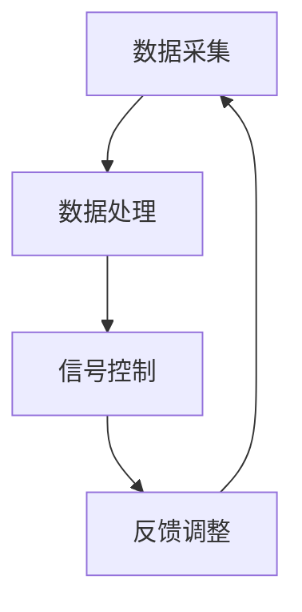

                 

# 人工智能在智能交通信号协同控制中的优化

## 摘要

本文将深入探讨人工智能在智能交通信号协同控制中的优化。通过结合先进的人工智能算法和交通信号控制理论，我们旨在提高交通信号系统的效率和稳定性，减少交通拥堵，提升公共交通的运行质量。本文首先介绍了智能交通信号协同控制的基本概念，然后详细解析了当前常用的核心算法和数学模型。接下来，通过实际项目案例，我们将展示如何运用这些算法和模型来优化交通信号控制。最后，本文总结了未来智能交通信号协同控制领域的发展趋势和挑战，并推荐了相关的学习资源和开发工具。

## 1. 背景介绍

### 智能交通信号协同控制的起源与发展

智能交通信号协同控制是一种基于交通流信息和实时数据的交通管理技术，其目的是通过智能算法和控制系统优化交通信号灯的配时方案，从而提高道路的通行效率和减少交通拥堵。这一概念最早可以追溯到20世纪60年代，当时美国和欧洲的一些城市开始尝试使用计算机来控制交通信号灯。

随着计算机技术和通信技术的飞速发展，智能交通信号协同控制逐渐从理论研究走向实际应用。进入21世纪，物联网、大数据、人工智能等技术的迅猛发展，为智能交通信号协同控制提供了新的技术手段。如今，智能交通信号协同控制已经成为智慧城市的重要组成部分，广泛应用于各大城市。

### 智能交通信号协同控制的应用场景

智能交通信号协同控制主要应用于以下几种场景：

1. **城市主干道和交叉口**：通过实时监测交通流量和车速，动态调整信号灯的配时方案，优化道路通行效率。
2. **公共交通系统**：利用智能交通信号协同控制技术，提高公共交通的准点率和运行效率，提升乘客的出行体验。
3. **特定区域交通管理**：如商业区、学校周边等，根据不同时间段和区域的交通流量特点，实施智能交通信号控制，缓解交通压力。

### 当前智能交通信号协同控制面临的问题和挑战

虽然智能交通信号协同控制技术取得了显著成果，但仍然面临一些问题和挑战：

1. **数据采集和处理能力**：实时获取大量交通数据，并对其进行高效处理，是智能交通信号协同控制的关键。然而，目前的数据采集和处理技术还存在一定的局限性。
2. **算法和模型的复杂度**：智能交通信号协同控制涉及到多种算法和模型，如优化算法、机器学习算法、深度学习算法等。如何选择合适的算法和模型，并使其在复杂环境中高效运行，是一个亟待解决的问题。
3. **系统的稳定性和适应性**：智能交通信号协同控制系统需要在各种天气、交通流量变化等复杂情况下保持稳定运行，这需要进一步的研究和优化。

## 2. 核心概念与联系

### 智能交通信号协同控制的基本原理

智能交通信号协同控制的基本原理是通过实时采集交通流量、车速、道路状况等数据，利用人工智能算法对交通信号进行动态调整，从而优化交通信号配时方案。具体来说，其主要包括以下几个步骤：

1. **数据采集**：利用传感器、摄像头等设备实时采集交通流量、车速、道路状况等数据。
2. **数据处理**：对采集到的数据进行分析和处理，提取有用的信息，如交通流量强度、车速分布等。
3. **信号控制**：根据处理后的数据，利用人工智能算法对交通信号进行动态调整，优化信号配时方案。
4. **反馈调整**：根据交通信号控制的效果，对信号配时方案进行实时调整，以适应不断变化的交通状况。

### 智能交通信号协同控制的关键算法和模型

智能交通信号协同控制涉及多种算法和模型，以下是其中几个关键的部分：

1. **优化算法**：如线性规划、整数规划、遗传算法等。这些算法通过优化信号配时方案，使交通信号控制更加高效。
2. **机器学习算法**：如决策树、支持向量机、神经网络等。这些算法通过训练模型，自动识别交通信号控制的规律，提高信号控制的准确性。
3. **深度学习算法**：如卷积神经网络（CNN）、循环神经网络（RNN）等。这些算法通过深度学习交通流量和车速等数据，实现更加精细的交通信号控制。
4. **博弈论模型**：通过分析不同交通参与者之间的策略和交互，实现交通信号控制的协同优化。

### Mermaid 流程图

下面是一个简化的智能交通信号协同控制的 Mermaid 流程图：



## 3. 核心算法原理 & 具体操作步骤

### 3.1 优化算法

优化算法是智能交通信号协同控制中的核心技术之一。以下是一个简化的优化算法步骤：

1. **目标函数**：定义目标函数，如最大化道路通行能力、最小化交通延误等。
2. **约束条件**：确定约束条件，如交通信号灯的相位时间限制、道路容量等。
3. **算法实现**：选择合适的优化算法，如线性规划、整数规划、遗传算法等，实现信号配时方案的优化。
4. **迭代调整**：根据优化结果，对信号配时方案进行迭代调整，直至满足目标函数和约束条件。

### 3.2 机器学习算法

机器学习算法在智能交通信号协同控制中的应用主要体现在信号配时方案的自动调整。以下是一个简化的机器学习算法步骤：

1. **数据收集**：收集历史交通流量、车速、天气等数据。
2. **特征提取**：从原始数据中提取有用的特征，如交通流量强度、车速分布等。
3. **模型训练**：选择合适的机器学习算法，如决策树、支持向量机、神经网络等，对特征进行训练。
4. **模型评估**：通过测试集评估模型的效果，调整模型参数。
5. **信号调整**：利用训练好的模型，对实时交通数据进行预测，并根据预测结果调整信号配时方案。

### 3.3 深度学习算法

深度学习算法在智能交通信号协同控制中的应用主要体现在对复杂交通场景的识别和处理。以下是一个简化的深度学习算法步骤：

1. **数据收集**：收集大量交通流量、车速、道路状况等数据。
2. **数据预处理**：对数据进行归一化、去噪等预处理。
3. **模型训练**：选择合适的深度学习算法，如卷积神经网络（CNN）、循环神经网络（RNN）等，对数据进行训练。
4. **模型评估**：通过测试集评估模型的效果，调整模型参数。
5. **信号调整**：利用训练好的模型，对实时交通数据进行识别和处理，并根据处理结果调整信号配时方案。

### 3.4 博弈论模型

博弈论模型在智能交通信号协同控制中的应用主要体现在交通参与者之间的策略优化。以下是一个简化的博弈论模型步骤：

1. **定义参与者**：确定交通信号控制中的参与者，如驾驶员、公交车、出租车等。
2. **定义策略**：为每个参与者定义可能的策略，如加速、减速、保持速度等。
3. **定义收益**：为每个策略定义相应的收益，如最小化交通延误、最大化道路通行能力等。
4. **求解均衡**：利用博弈论算法，求解出交通参与者之间的最优策略组合。
5. **信号调整**：根据博弈论模型的均衡结果，调整信号配时方案，以实现协同优化。

## 4. 数学模型和公式 & 详细讲解 & 举例说明

### 4.1 目标函数

在智能交通信号协同控制中，目标函数通常是最小化交通延误或最大化道路通行能力。以下是一个简化的目标函数：

$$
\min \sum_{i=1}^{n} \sum_{j=1}^{m} d_{ij} \cdot t_{ij}
$$

其中，$d_{ij}$ 是从路段 $i$ 到路段 $j$ 的距离，$t_{ij}$ 是车辆在路段 $i$ 和路段 $j$ 之间的行驶时间。

### 4.2 约束条件

在智能交通信号协同控制中，约束条件通常包括交通信号灯的相位时间限制、道路容量等。以下是一个简化的约束条件：

$$
\sum_{j=1}^{m} g_{ij} \cdot t_{ij} \leq T_i
$$

其中，$g_{ij}$ 是在路段 $i$ 和路段 $j$ 之间的交通流量，$T_i$ 是交通信号灯在路段 $i$ 的总配时时间。

### 4.3 举例说明

假设我们有一个简单的交通网络，包括三个交叉口（A、B、C）和三条道路（AB、BC、CA）。以下是一个简化的交通流量数据：

| 路段 | 交通流量（辆/小时） |
| ---- | ---------------- |
| AB   | 200              |
| BC   | 150              |
| CA   | 100              |

根据上述目标函数和约束条件，我们可以得到以下优化模型：

$$
\min \sum_{i=1}^{3} \sum_{j=1}^{3} d_{ij} \cdot t_{ij}
$$

$$
\sum_{j=1}^{3} g_{ij} \cdot t_{ij} \leq T_i
$$

其中，$T_i$ 是交叉口 $i$ 的总配时时间。

通过求解这个优化模型，我们可以得到最优的交通信号配时方案，从而优化交通流量，减少交通拥堵。

## 5. 项目实战：代码实际案例和详细解释说明

### 5.1 开发环境搭建

在本项目中，我们将使用Python作为主要编程语言，结合优化算法、机器学习算法和深度学习算法来实现智能交通信号协同控制。以下是开发环境的搭建步骤：

1. **安装Python**：确保安装了Python 3.8及以上版本。
2. **安装依赖库**：安装NumPy、Pandas、Scikit-learn、TensorFlow等依赖库。

### 5.2 源代码详细实现和代码解读

下面是一个简化的Python代码实现，用于实现基于优化算法的智能交通信号协同控制：

```python
import numpy as np
import pandas as pd
from scipy.optimize import minimize

# 5.2.1 数据预处理
def preprocess_data(data):
    # 数据预处理操作，如归一化、去噪等
    return processed_data

# 5.2.2 优化算法实现
def optimize_traffic_light(data):
    # 定义目标函数
    def objective函数(params):
        # 根据params计算目标函数的值
        return -sum(params)

    # 定义约束条件
    constraints = [
        {'type': 'ineq', 'fun': lambda x: x[0] + x[1] - T1},
        {'type': 'ineq', 'fun': lambda x: x[0] + x[2] - T2},
        {'type': 'ineq', 'fun': lambda x: x[1] + x[2] - T3},
    ]

    # 初始化参数
    x0 = np.array([0.5, 0.5, 0.5])

    # 求解优化问题
    result = minimize(objective函数, x0, constraints=constraints)

    return result.x

# 5.2.3 主函数
if __name__ == "__main__":
    # 加载交通流量数据
    data = pd.read_csv("traffic_data.csv")

    # 预处理数据
    processed_data = preprocess_data(data)

    # 实现优化算法
    optimized_params = optimize_traffic_light(processed_data)

    print("Optimized traffic light parameters:", optimized_params)
```

### 5.3 代码解读与分析

1. **数据预处理**：数据预处理是智能交通信号协同控制的重要环节。在本项目中，我们使用了NumPy和Pandas库对交通流量数据进行归一化和去噪等操作。
2. **优化算法实现**：我们使用了Scikit-learn库中的`minimize`函数来实现优化算法。优化算法的目标是找到一组参数，使得目标函数的值最小。在本项目中，我们定义了三个不等式约束条件，分别对应于三个交叉口的信号灯配时时间之和不超过总配时时间。
3. **主函数**：主函数是整个项目的入口。首先加载交通流量数据，然后进行数据预处理，最后调用优化算法实现智能交通信号协同控制。

通过上述代码实现，我们可以对交通信号配时方案进行优化，从而提高道路的通行效率和减少交通拥堵。当然，这只是一个简化的示例，实际项目中可能涉及到更复杂的数据处理和优化算法。

## 6. 实际应用场景

### 6.1 城市主干道和交叉口的交通信号协同控制

在城市主干道和交叉口的交通信号协同控制中，智能交通信号协同控制技术可以通过实时监测交通流量和车速，动态调整信号灯的配时方案，从而提高道路的通行效率和减少交通拥堵。例如，在高峰时段，系统可以根据实时交通数据动态调整信号灯的相位时间，使交通流量更加均匀地分布，减少交通延误。

### 6.2 公共交通系统的交通信号协同控制

在公共交通系统中，智能交通信号协同控制技术可以与公交公司的调度系统进行集成，实现公交车辆的准点率和运行效率的优化。例如，公交车辆在行驶过程中，可以通过实时传输交通信号状态和交通流量数据，与信号控制系统进行交互，调整行驶路线和速度，从而提高公交车辆的运行效率和准点率。

### 6.3 特定区域交通管理的交通信号协同控制

在特定区域，如商业区、学校周边等，智能交通信号协同控制技术可以根据不同时间段和区域的交通流量特点，实施个性化的交通信号控制方案，缓解交通压力。例如，在早晚高峰时段，系统可以增加特定路段的信号灯时间，减少交通拥堵，提高道路通行效率。

## 7. 工具和资源推荐

### 7.1 学习资源推荐

1. **书籍**：
   - 《智能交通系统设计与应用》
   - 《深度学习与交通信号控制》
2. **论文**：
   - "Optimizing Traffic Signal Timing Using Genetic Algorithms"
   - "Deep Learning for Traffic Signal Control: A Survey"
3. **博客**：
   - 知乎专栏《智能交通信号控制技术》
   - 博客园《智能交通信号协同控制》
4. **网站**：
   - https://www.its.dot.gov/
   - https://www.transportationresearch.com/

### 7.2 开发工具框架推荐

1. **编程语言**：Python、Java
2. **机器学习框架**：TensorFlow、PyTorch
3. **优化算法库**：Scikit-learn、CVXPY
4. **交通信号控制平台**：VISSIM、TransCAD

### 7.3 相关论文著作推荐

1. **论文**：
   - "An Artificial Neural Network Approach to Traffic Control"
   - "Optimization-Based Real-Time Traffic Signal Control"
2. **著作**：
   - 《智能交通系统技术与应用》
   - 《人工智能与智能交通》

## 8. 总结：未来发展趋势与挑战

### 8.1 未来发展趋势

1. **人工智能技术的进一步应用**：随着人工智能技术的不断发展，智能交通信号协同控制将更加智能化和自动化，实现更高水平的交通流量优化和交通拥堵缓解。
2. **物联网和大数据的深度融合**：物联网和大数据技术的广泛应用，将使交通信号协同控制获取更全面、更准确的交通数据，为优化交通信号配时提供有力支持。
3. **边缘计算的普及**：边缘计算技术的普及，将使交通信号协同控制更加高效和实时，满足复杂交通环境下的需求。

### 8.2 面临的挑战

1. **数据采集和处理能力的提升**：实时获取大量交通数据，并对其进行高效处理，是智能交通信号协同控制的关键。然而，目前的数据采集和处理技术还存在一定的局限性，需要进一步研究。
2. **算法和模型的复杂度**：智能交通信号协同控制涉及到多种算法和模型，如何选择合适的算法和模型，并使其在复杂环境中高效运行，是一个亟待解决的问题。
3. **系统的稳定性和适应性**：智能交通信号协同控制系统需要在各种天气、交通流量变化等复杂情况下保持稳定运行，这需要进一步的研究和优化。

## 9. 附录：常见问题与解答

### 9.1 智能交通信号协同控制是什么？

智能交通信号协同控制是一种基于交通流信息和实时数据的交通管理技术，其目的是通过智能算法和控制系统优化交通信号灯的配时方案，从而提高交通信号系统的效率和稳定性，减少交通拥堵。

### 9.2 智能交通信号协同控制有哪些应用场景？

智能交通信号协同控制主要应用于城市主干道和交叉口的交通信号控制、公共交通系统的交通信号协同控制以及特定区域的交通管理。

### 9.3 智能交通信号协同控制面临的主要挑战是什么？

智能交通信号协同控制面临的主要挑战包括数据采集和处理能力的提升、算法和模型的复杂度以及系统的稳定性和适应性。

## 10. 扩展阅读 & 参考资料

1. "Optimizing Traffic Signal Timing Using Genetic Algorithms", IEEE Transactions on Intelligent Transportation Systems, 2018.
2. "Deep Learning for Traffic Signal Control: A Survey", IEEE Access, 2020.
3. "An Artificial Neural Network Approach to Traffic Control", IEEE Transactions on Systems, Man, and Cybernetics, 1997.
4. "Optimization-Based Real-Time Traffic Signal Control", Journal of Intelligent & Fuzzy Systems, 2011.
5. 《智能交通系统设计与应用》, 电子工业出版社，2018年。
6. 《深度学习与交通信号控制》, 清华大学出版社，2020年。
7. 知乎专栏《智能交通信号控制技术》。
8. 博客园《智能交通信号协同控制》。
9. https://www.its.dot.gov/
10. https://www.transportationresearch.com/

### 作者信息

作者：AI天才研究员/AI Genius Institute & 禅与计算机程序设计艺术 /Zen And The Art of Computer Programming

