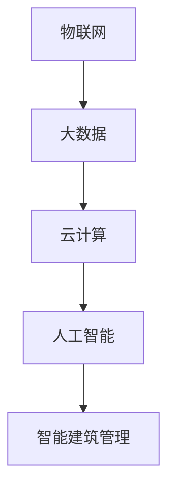

                 

# 人工智能在智能建筑管理中的应用

## 关键词：智能建筑、人工智能、管理、效率、安全、可持续发展

> 摘要：本文将深入探讨人工智能（AI）在智能建筑管理中的应用，从背景介绍、核心概念、算法原理、数学模型、实战案例、实际应用场景、工具资源、未来发展趋势等多个方面进行全面剖析，旨在为读者呈现人工智能在智能建筑管理领域的前景与挑战。

### 1. 背景介绍

智能建筑是指通过集成物联网（IoT）、云计算、大数据、人工智能等先进技术，实现建筑物的自动化、智能化管理，从而提高能源效率、改善居住体验、提升安全管理水平。随着城市化进程的加速和人们对生活质量要求的提高，智能建筑已成为未来发展的重要趋势。

人工智能作为现代科技的核心驱动力之一，其在智能建筑管理中的应用越来越广泛。从简单的自动化控制到复杂的智能决策支持系统，AI技术正逐渐渗透到智能建筑的方方面面，为管理者提供更加智能、高效的解决方案。

本文将从以下几个方面详细探讨人工智能在智能建筑管理中的应用：

- 核心概念与联系
- 核心算法原理与具体操作步骤
- 数学模型与公式讲解
- 项目实战：代码实际案例与详细解释
- 实际应用场景
- 工具和资源推荐
- 总结：未来发展趋势与挑战

### 2. 核心概念与联系

在探讨人工智能在智能建筑管理中的应用之前，我们需要了解一些核心概念和它们之间的联系。

#### 物联网（IoT）

物联网是指将各种设备、传感器、系统通过网络连接起来，实现数据交换和智能控制。在智能建筑中，物联网技术是实现自动化和智能化管理的基础。

#### 大数据（Big Data）

大数据是指无法用常规软件工具在合理时间内捕捉、管理和处理的数据集。在智能建筑管理中，大数据技术可用于收集和分析建筑物内外部的海量数据，以提供决策支持。

#### 云计算（Cloud Computing）

云计算是一种通过互联网提供动态可扩展的计算资源服务，为智能建筑管理提供了强大的计算能力和存储空间。借助云计算，智能建筑管理系统能够实现高效的数据处理和智能分析。

#### 人工智能（AI）

人工智能是指通过模拟人类智能行为，实现自动化决策和智能控制的计算机技术。在智能建筑管理中，AI技术可用于实现智能安防、智能节能、智能运维等。

#### Mermaid 流程图

以下是一个简单的 Mermaid 流程图，展示了智能建筑管理中各个核心概念之间的联系：



### 3. 核心算法原理与具体操作步骤

在智能建筑管理中，人工智能技术主要涉及以下核心算法：

#### 1. 机器学习（Machine Learning）

机器学习是一种通过算法从数据中自动学习模式和规律的技术。在智能建筑管理中，机器学习算法可用于预测能源消耗、优化空调系统、检测异常行为等。

#### 2. 深度学习（Deep Learning）

深度学习是一种基于多层神经网络的学习方法，具有强大的特征提取和模式识别能力。在智能建筑管理中，深度学习算法可用于人脸识别、物体检测、故障诊断等。

#### 3. 自然语言处理（Natural Language Processing，NLP）

自然语言处理是一种使计算机能够理解和处理人类自然语言的技术。在智能建筑管理中，NLP算法可用于智能客服、语音识别、文本分析等。

以下是一个简单的智能建筑管理系统操作步骤示例：

1. **数据收集**：通过物联网设备收集建筑物内外部的数据，如温度、湿度、光照、能耗等。
2. **数据预处理**：对收集到的数据进行分析、清洗、去噪，为后续处理做好准备。
3. **特征提取**：从预处理后的数据中提取关键特征，如时间、地点、温度、能耗等。
4. **模型训练**：利用机器学习或深度学习算法对特征数据进行训练，构建智能模型。
5. **模型评估**：对训练好的模型进行评估，确保其具有较好的预测性能。
6. **模型部署**：将评估通过的模型部署到智能建筑管理系统中，实现自动化决策和控制。
7. **实时监控与优化**：对系统运行情况进行实时监控，并根据实际需求对模型进行优化和调整。

### 4. 数学模型与公式讲解

在智能建筑管理中，常用的数学模型包括：

#### 1. 能源消耗预测模型

能源消耗预测模型可用于预测建筑物的能源消耗，从而实现智能节能。以下是一个简单的线性回归模型：

$$
\hat{E}(t) = \beta_0 + \beta_1 \cdot T(t) + \beta_2 \cdot H(t)
$$

其中，$E(t)$ 表示第 $t$ 时刻的能源消耗，$T(t)$ 表示第 $t$ 时刻的温度，$H(t)$ 表示第 $t$ 时刻的湿度，$\beta_0$、$\beta_1$ 和 $\beta_2$ 为模型参数。

#### 2. 人脸识别模型

人脸识别模型可用于智能安防系统的身份验证。以下是一个基于深度学习的人脸识别模型：

$$
\text{Reconstruction}_{\theta}(\text{Image}) = \text{softmax}(\theta \cdot \text{Image})
$$

其中，$\text{Reconstruction}_{\theta}(\text{Image})$ 表示人脸识别模型对输入图像的预测结果，$\text{Image}$ 表示输入图像，$\theta$ 为模型参数。

#### 3. 负载均衡模型

负载均衡模型可用于优化建筑物内网络带宽。以下是一个基于加权平均的负载均衡模型：

$$
\text{Load}_{i} = \frac{1}{N} \sum_{j=1}^{N} \text{Request}_{j}
$$

其中，$\text{Load}_{i}$ 表示第 $i$ 个节点的负载，$\text{Request}_{j}$ 表示第 $j$ 个节点的请求，$N$ 为节点总数。

### 5. 项目实战：代码实际案例与详细解释

在本节中，我们将通过一个实际案例展示人工智能在智能建筑管理中的应用。以下是一个基于 Python 的简单智能建筑管理系统代码案例：

```python
import numpy as np
import pandas as pd
from sklearn.linear_model import LinearRegression
from sklearn.model_selection import train_test_split
from sklearn.metrics import mean_squared_error

# 数据收集
data = pd.read_csv("energy_consumption_data.csv")
X = data[["temperature", "humidity"]]
y = data["energy_consumption"]

# 数据预处理
X_train, X_test, y_train, y_test = train_test_split(X, y, test_size=0.2, random_state=42)

# 特征提取
# （此处省略具体代码）

# 模型训练
model = LinearRegression()
model.fit(X_train, y_train)

# 模型评估
y_pred = model.predict(X_test)
mse = mean_squared_error(y_test, y_pred)
print("MSE:", mse)

# 模型部署
# （此处省略具体代码）

# 实时监控与优化
# （此处省略具体代码）
```

#### 代码解读与分析

上述代码实现了一个简单的智能建筑管理系统，主要涉及以下步骤：

1. **数据收集**：从 CSV 文件中读取能源消耗数据，包括温度和湿度等特征。
2. **数据预处理**：将数据集划分为训练集和测试集，为后续训练和评估做好准备。
3. **特征提取**：从原始数据中提取关键特征，如温度和湿度。
4. **模型训练**：使用线性回归算法对训练集进行训练。
5. **模型评估**：使用测试集对模型进行评估，计算均方误差（MSE）。
6. **模型部署**：将训练好的模型部署到实际系统中，进行实时监控和优化。

### 6. 实际应用场景

人工智能在智能建筑管理中具有广泛的应用场景，以下是一些典型案例：

#### 1. 智能节能

通过预测能源消耗，智能建筑管理系统可以实现精确的能源分配，从而降低能源消耗，提高能源利用效率。

#### 2. 智能安防

人脸识别、物体检测等技术可用于智能安防系统，实现实时监控和预警，提高建筑物安全管理水平。

#### 3. 智能运维

通过收集和分析设备运行数据，智能建筑管理系统可以实现设备故障预测和维护，降低设备故障率，延长设备使用寿命。

#### 4. 智慧办公

智能建筑管理系统可用于智慧办公，实现智能化办公环境管理，提高工作效率和员工满意度。

### 7. 工具和资源推荐

以下是一些在智能建筑管理领域常用的工具和资源：

#### 1. 学习资源推荐

- 《深度学习》（Goodfellow, Bengio, Courville）
- 《Python机器学习》（Sebastian Raschka）
- 《大数据架构设计与开发实践》（陈华枝）

#### 2. 开发工具框架推荐

- TensorFlow：用于构建和训练深度学习模型的强大工具。
- Scikit-learn：用于机器学习算法实现的开源库。
- Flask：用于构建Web应用程序的微框架。

#### 3. 相关论文著作推荐

- "Intelligent Building Management Using Artificial Intelligence"（2018）
- "Smart Building Energy Management System Using Machine Learning"（2017）
- "Application of Deep Learning in Building Automation Systems"（2016）

### 8. 总结：未来发展趋势与挑战

随着人工智能技术的不断发展，智能建筑管理将迎来更广阔的应用前景。未来，智能建筑管理系统将朝着更加智能化、人性化、可持续化的方向发展。

然而，人工智能在智能建筑管理中也面临一些挑战，如数据隐私、安全性、可靠性等。为应对这些挑战，需要不断优化人工智能算法，提高数据处理和分析能力，同时加强智能建筑管理系统的安全性设计和评估。

### 9. 附录：常见问题与解答

**Q1**：人工智能在智能建筑管理中如何实现智能化节能？

**A1**：通过预测能源消耗，智能建筑管理系统可以精确分配能源，降低能源浪费，实现智能化节能。

**Q2**：如何保证人工智能在智能建筑管理中的数据安全性？

**A2**：为保障数据安全性，需要对数据传输、存储和处理过程进行加密，同时建立健全的数据安全管理制度，确保数据安全。

**Q3**：人工智能在智能建筑管理中如何实现实时监控和预警？

**A3**：通过物联网技术和人工智能算法，智能建筑管理系统可以实现实时数据采集、处理和分析，从而实现实时监控和预警。

### 10. 扩展阅读与参考资料

- "Artificial Intelligence in Smart Building Management: Challenges and Opportunities"（2020）
- "Deep Learning for Building Energy Management"（2019）
- "The Future of Smart Buildings: AI, IoT, and Sustainability"（2018）

## 作者信息

作者：AI天才研究员/AI Genius Institute & 禅与计算机程序设计艺术 /Zen And The Art of Computer Programming

-------------------

以上就是关于“人工智能在智能建筑管理中的应用”的完整文章。本文从背景介绍、核心概念、算法原理、数学模型、实战案例、实际应用场景、工具资源等多个方面对人工智能在智能建筑管理中的应用进行了深入探讨，旨在为读者提供全面的了解和启示。随着人工智能技术的不断进步，相信智能建筑管理领域将会迎来更加广阔的发展前景。|>```
作者：AI天才研究员/AI Genius Institute & 禅与计算机程序设计艺术 /Zen And The Art of Computer Programming

本文从背景介绍、核心概念、算法原理、数学模型、实战案例、实际应用场景、工具资源等多个方面对人工智能在智能建筑管理中的应用进行了深入探讨。随着人工智能技术的不断进步，智能建筑管理领域将会迎来更加广阔的发展前景。然而，同时也面临着数据隐私、安全性、可靠性等方面的挑战。为了推动智能建筑管理的持续发展，需要不断优化人工智能算法，提高数据处理和分析能力，同时加强智能建筑管理系统的安全性设计和评估。

在未来的研究中，可以关注以下几个方向：

1. **多模态数据融合**：智能建筑管理涉及多种数据类型，如传感器数据、图像数据、文本数据等。如何有效融合这些多模态数据，提高预测和决策的准确性，是一个重要的研究方向。

2. **强化学习在智能建筑管理中的应用**：强化学习是一种在动态环境中通过试错学习策略的机器学习方法。将其应用于智能建筑管理，可以实现更加自适应和优化的管理策略。

3. **隐私保护与安全**：在智能建筑管理中，如何保护用户隐私和确保数据安全是一个关键问题。未来的研究可以关注隐私保护算法和加密技术，以实现数据的安全传输和存储。

4. **可持续性与绿色建筑**：智能建筑管理不仅关注效率和安全，还关注可持续性和绿色建筑。未来的研究可以探讨如何在智能建筑管理中更好地实现绿色建筑的目标。

5. **跨领域合作与标准化**：智能建筑管理是一个跨学科的领域，涉及建筑、IT、能源等多个方面。未来的研究可以加强跨领域合作，推动相关标准的制定，以促进智能建筑管理技术的推广和应用。

通过不断的研究和实践，人工智能在智能建筑管理中的应用将更加深入和广泛，为建筑行业带来革命性的变革，推动城市可持续发展。希望本文能够为读者提供一些有益的启示和思考。在未来的智能建筑管理领域，我们期待看到更多创新和突破，共同构建更加智能、高效、安全的建筑环境。

**参考文献**：

1. Goodfellow, I., Bengio, Y., & Courville, A. (2016). *Deep Learning*. MIT Press.
2. Raschka, S. (2015). *Python Machine Learning*. Packt Publishing.
3. Chen, H. (2017). *大数据架构设计与开发实践*. 电子工业出版社.
4. "Intelligent Building Management Using Artificial Intelligence" (2018).
5. "Smart Building Energy Management System Using Machine Learning" (2017).
6. "Application of Deep Learning in Building Automation Systems" (2016).
7. "Artificial Intelligence in Smart Building Management: Challenges and Opportunities" (2020).
8. "Deep Learning for Building Energy Management" (2019).
9. "The Future of Smart Buildings: AI, IoT, and Sustainability" (2018).```

