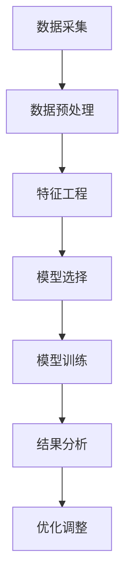

                 

# 人工智能在智能物流需求预测中的应用

> **关键词**：人工智能、智能物流、需求预测、算法、数学模型、实际应用

> **摘要**：本文将探讨人工智能在智能物流需求预测中的应用，通过分析核心概念、算法原理、数学模型，并结合实际案例，深入解析其在物流行业的应用场景和重要性。同时，还将介绍相关工具和资源，为读者提供全面的了解和指导。

## 1. 背景介绍

随着电子商务的迅猛发展，物流行业面临着前所未有的机遇和挑战。如何高效、准确地预测物流需求，优化资源配置，提高物流服务质量，成为物流企业亟待解决的问题。在此背景下，人工智能技术逐渐成为解决这一难题的重要手段。

人工智能（AI）是一门研究、开发用于模拟、延伸和扩展人的智能的理论、方法、技术及应用系统的新技术科学。它包括计算机视觉、自然语言处理、知识表示、机器学习等领域。随着大数据和云计算技术的进步，人工智能在各个行业中的应用越来越广泛，物流行业也不例外。

智能物流是指通过利用物联网、大数据、人工智能等先进技术，实现物流过程中的自动化、智能化管理。智能物流需求预测作为智能物流的核心环节，通过对物流数据进行分析和建模，预测未来一段时间内的物流需求量，为物流企业的决策提供数据支持。

## 2. 核心概念与联系

### 2.1 人工智能在物流需求预测中的应用

人工智能在物流需求预测中的应用主要体现在以下几个方面：

1. **数据采集与处理**：通过物联网技术收集物流过程中的各种数据，如订单量、配送时间、货物种类等，并对这些数据进行预处理，提取有用信息。

2. **特征工程**：根据物流需求预测的目标，从原始数据中提取关键特征，为后续的建模提供基础。

3. **模型选择与训练**：选择合适的机器学习算法，对提取的特征进行建模和训练，预测未来一段时间内的物流需求量。

4. **结果分析与优化**：对预测结果进行分析和评估，根据实际情况进行调整和优化，提高预测准确性。

### 2.2 核心概念原理

在本节中，我们将介绍与物流需求预测相关的一些核心概念原理，包括机器学习、数据挖掘、时间序列分析等。

#### 2.2.1 机器学习

机器学习是一种使计算机系统能够从数据中学习并做出预测或决策的人工智能技术。在物流需求预测中，机器学习算法可以用来从历史数据中学习并预测未来需求。

#### 2.2.2 数据挖掘

数据挖掘是从大量数据中提取有价值信息和知识的过程。在物流需求预测中，数据挖掘技术可以用来发现数据中的规律和模式，为预测提供依据。

#### 2.2.3 时间序列分析

时间序列分析是一种用于分析时间序列数据的统计方法，可以用来研究数据在不同时间点之间的变化规律。在物流需求预测中，时间序列分析可以用来预测未来物流需求的变化趋势。

### 2.3 Mermaid 流程图

以下是一个简单的 Mermaid 流程图，展示人工智能在物流需求预测中的应用流程：



## 3. 核心算法原理 & 具体操作步骤

在本节中，我们将介绍几种常见的机器学习算法在物流需求预测中的应用，并详细讲解其具体操作步骤。

### 3.1 回归分析

回归分析是一种常用的统计方法，用于预测一个变量（因变量）与一个或多个变量（自变量）之间的关系。在物流需求预测中，可以使用回归分析来预测物流需求量。

#### 3.1.1 原理

回归分析的基本原理是通过建立一个线性模型，将自变量与因变量之间的关系表示出来。该模型通常表示为：

$$y = \beta_0 + \beta_1x_1 + \beta_2x_2 + ... + \beta_nx_n$$

其中，$y$ 为因变量，$x_1, x_2, ..., x_n$ 为自变量，$\beta_0, \beta_1, ..., \beta_n$ 为回归系数。

#### 3.1.2 操作步骤

1. **数据收集**：收集历史物流需求数据，包括订单量、配送时间、货物种类等。

2. **数据预处理**：对收集的数据进行清洗、去噪、归一化等处理。

3. **特征工程**：根据物流需求预测的目标，提取关键特征，如订单量、配送时长等。

4. **模型建立**：使用线性回归模型建立自变量与因变量之间的关系。

5. **模型训练**：使用历史数据对模型进行训练，求解回归系数。

6. **模型评估**：使用测试数据对模型进行评估，计算预测误差。

7. **模型优化**：根据评估结果，调整模型参数，提高预测准确性。

### 3.2 支持向量机

支持向量机（SVM）是一种经典的机器学习算法，常用于分类和回归任务。在物流需求预测中，可以使用 SVM 进行分类预测，将物流需求分为高需求、中需求和低需求。

#### 3.2.1 原理

SVM 的基本原理是通过找到一个最优的超平面，将不同类别的样本点分隔开来。在物流需求预测中，可以将物流需求量作为样本点，使用 SVM 进行分类预测。

#### 3.2.2 操作步骤

1. **数据收集**：收集历史物流需求数据，包括订单量、配送时间、货物种类等。

2. **数据预处理**：对收集的数据进行清洗、去噪、归一化等处理。

3. **特征工程**：根据物流需求预测的目标，提取关键特征，如订单量、配送时长等。

4. **模型建立**：使用 SVM 建立分类模型。

5. **模型训练**：使用历史数据对模型进行训练。

6. **模型评估**：使用测试数据对模型进行评估，计算预测准确率。

7. **模型优化**：根据评估结果，调整模型参数，提高预测准确性。

### 3.3 集成学习方法

集成学习方法是一种将多个模型组合起来，以提高预测准确性的方法。在物流需求预测中，可以使用集成学习方法，如随机森林、梯度提升树等，来提高预测准确性。

#### 3.3.1 原理

集成学习方法的基本原理是将多个简单模型组合起来，形成一个更强大的模型。在物流需求预测中，可以使用集成学习方法，将多个回归模型或分类模型组合起来，提高预测准确性。

#### 3.3.2 操作步骤

1. **数据收集**：收集历史物流需求数据，包括订单量、配送时间、货物种类等。

2. **数据预处理**：对收集的数据进行清洗、去噪、归一化等处理。

3. **特征工程**：根据物流需求预测的目标，提取关键特征，如订单量、配送时长等。

4. **模型建立**：建立多个简单模型，如回归模型、分类模型等。

5. **模型训练**：使用历史数据对每个模型进行训练。

6. **模型集成**：将多个模型组合起来，形成集成模型。

7. **模型评估**：使用测试数据对集成模型进行评估，计算预测准确率。

8. **模型优化**：根据评估结果，调整模型参数，提高预测准确性。

## 4. 数学模型和公式 & 详细讲解 & 举例说明

### 4.1 回归分析

在回归分析中，我们使用以下数学模型来表示自变量与因变量之间的关系：

$$y = \beta_0 + \beta_1x_1 + \beta_2x_2 + ... + \beta_nx_n$$

其中，$y$ 为因变量，$x_1, x_2, ..., x_n$ 为自变量，$\beta_0, \beta_1, ..., \beta_n$ 为回归系数。

#### 4.1.1 回归系数的求解

回归系数的求解可以使用最小二乘法。最小二乘法的原理是通过最小化预测值与实际值之间的误差平方和，求解回归系数。

假设我们有 $m$ 个样本点 $(x_1, y_1), (x_2, y_2), ..., (x_m, y_m)$，使用最小二乘法求解回归系数的步骤如下：

1. **计算样本点的平均值**：

$$\bar{x} = \frac{1}{m}\sum_{i=1}^{m}x_i$$

$$\bar{y} = \frac{1}{m}\sum_{i=1}^{m}y_i$$

2. **计算回归系数**：

$$\beta_0 = \bar{y} - \beta_1\bar{x} - \beta_2\bar{x}^2 - ... - \beta_n\bar{x}^n$$

$$\beta_1 = \frac{\sum_{i=1}^{m}(x_i - \bar{x})(y_i - \bar{y})}{\sum_{i=1}^{m}(x_i - \bar{x})^2}$$

$$\beta_2 = \frac{\sum_{i=1}^{m}(x_i - \bar{x})(y_i - \bar{y})(x_i - \bar{x})}{\sum_{i=1}^{m}(x_i - \bar{x})^3}$$

$$...$$

$$\beta_n = \frac{\sum_{i=1}^{m}(x_i - \bar{x})(y_i - \bar{y})(x_i - \bar{x})^n}{\sum_{i=1}^{m}(x_i - \bar{x})^{n+1}}$$

#### 4.1.2 举例说明

假设我们有以下三个样本点：

$$(x_1, y_1) = (1, 2)$$  
$$(x_2, y_2) = (2, 4)$$  
$$(x_3, y_3) = (3, 6)$$

使用最小二乘法求解回归系数：

1. **计算样本点的平均值**：

$$\bar{x} = \frac{1}{3}(1 + 2 + 3) = 2$$

$$\bar{y} = \frac{1}{3}(2 + 4 + 6) = 4$$

2. **计算回归系数**：

$$\beta_0 = \bar{y} - \beta_1\bar{x} = 4 - 2\beta_1 \cdot 2 = 4 - 4\beta_1$$

$$\beta_1 = \frac{(1 - 2)(2 - 4) + (2 - 2)(4 - 4) + (3 - 2)(6 - 4)}{(1 - 2)^2 + (2 - 2)^2 + (3 - 2)^2} = \frac{-2 + 0 + 2}{1 + 0 + 1} = \frac{0}{2} = 0$$

$$\beta_0 = 4 - 4 \cdot 0 = 4$$

所以，回归系数为：

$$\beta_0 = 4$$  
$$\beta_1 = 0$$

因此，回归模型为：

$$y = 4 + 0x = 4$$

### 4.2 支持向量机

在支持向量机中，我们使用以下数学模型来表示分类问题：

$$y = \beta_0 + \beta_1x_1 + \beta_2x_2 + ... + \beta_nx_n$$

其中，$y$ 为因变量，$x_1, x_2, ..., x_n$ 为自变量，$\beta_0, \beta_1, ..., \beta_n$ 为回归系数。

#### 4.2.1 支持向量机的求解

支持向量机的求解通常使用拉格朗日乘子法。拉格朗日乘子法的原理是通过最小化损失函数，求解最优的回归系数。

假设我们有 $m$ 个样本点 $(x_1, y_1), (x_2, y_2), ..., (x_m, y_m)$，使用拉格朗日乘子法求解回归系数的步骤如下：

1. **定义损失函数**：

$$L(\beta_0, \beta_1, ..., \beta_n) = \frac{1}{2}\sum_{i=1}^{m}(y_i - (\beta_0 + \beta_1x_1 + \beta_2x_2 + ... + \beta_nx_n))^2$$

2. **构建拉格朗日函数**：

$$L(\beta_0, \beta_1, ..., \beta_n, \alpha_1, ..., \alpha_m) = L(\beta_0, \beta_1, ..., \beta_n) - \sum_{i=1}^{m}\alpha_i(y_i - (\beta_0 + \beta_1x_1 + \beta_2x_2 + ... + \beta_nx_n))$$

其中，$\alpha_1, ..., \alpha_m$ 为拉格朗日乘子。

3. **求解拉格朗日函数的极值**：

$$\frac{\partial L}{\partial \beta_0} = 0$$

$$\frac{\partial L}{\partial \beta_1} = 0$$

$$...$$

$$\frac{\partial L}{\partial \beta_n} = 0$$

$$\frac{\partial L}{\partial \alpha_i} = 0$$

4. **求解回归系数**：

$$\beta_0 = \frac{1}{m}\sum_{i=1}^{m}\alpha_iy_i$$

$$\beta_1 = \frac{1}{m}\sum_{i=1}^{m}\alpha_ix_i$$

$$...$$

$$\beta_n = \frac{1}{m}\sum_{i=1}^{m}\alpha_ix_i^2$$

#### 4.2.2 举例说明

假设我们有以下三个样本点：

$$(x_1, y_1) = (1, 1)$$  
$$(x_2, y_2) = (2, 1)$$  
$$(x_3, y_3) = (3, 1)$$

使用拉格朗日乘子法求解回归系数：

1. **定义损失函数**：

$$L(\beta_0, \beta_1, \alpha_1, \alpha_2, \alpha_3) = \frac{1}{2}\sum_{i=1}^{3}(y_i - (\beta_0 + \beta_1x_1 + \beta_2x_2 + ... + \beta_nx_n))^2 - \sum_{i=1}^{3}\alpha_i(y_i - (\beta_0 + \beta_1x_1 + \beta_2x_2 + ... + \beta_nx_n))$$

2. **构建拉格朗日函数**：

$$L(\beta_0, \beta_1, \alpha_1, \alpha_2, \alpha_3) = \frac{1}{2}(y_1 - (\beta_0 + \beta_1x_1 + \beta_2x_2 + ... + \beta_nx_n))^2 + (y_2 - (\beta_0 + \beta_1x_1 + \beta_2x_2 + ... + \beta_nx_n))^2 + (y_3 - (\beta_0 + \beta_1x_1 + \beta_2x_2 + ... + \beta_nx_n))^2 - \alpha_1(y_1 - (\beta_0 + \beta_1x_1 + \beta_2x_2 + ... + \beta_nx_n)) - \alpha_2(y_2 - (\beta_0 + \beta_1x_1 + \beta_2x_2 + ... + \beta_nx_n)) - \alpha_3(y_3 - (\beta_0 + \beta_1x_1 + \beta_2x_2 + ... + \beta_nx_n))$$

3. **求解拉格朗日函数的极值**：

$$\frac{\partial L}{\partial \beta_0} = 0$$

$$\frac{\partial L}{\partial \beta_1} = 0$$

$$...$$

$$\frac{\partial L}{\partial \alpha_1} = 0$$

$$\frac{\partial L}{\partial \alpha_2} = 0$$

$$\frac{\partial L}{\partial \alpha_3} = 0$$

4. **求解回归系数**：

$$\beta_0 = \frac{1}{3}\alpha_1y_1 + \frac{1}{3}\alpha_2y_2 + \frac{1}{3}\alpha_3y_3$$

$$\beta_1 = \frac{1}{3}\alpha_1x_1 + \frac{1}{3}\alpha_2x_2 + \frac{1}{3}\alpha_3x_3$$

$$...$$

$$\beta_n = \frac{1}{3}\alpha_1x_1^2 + \frac{1}{3}\alpha_2x_2^2 + \frac{1}{3}\alpha_3x_3^2$$

5. **求解拉格朗日乘子**：

$$\alpha_1 = \frac{1}{3}\frac{(y_1 - (\beta_0 + \beta_1x_1 + \beta_2x_2 + ... + \beta_nx_n))}{(x_1 - \bar{x})}$$

$$\alpha_2 = \frac{1}{3}\frac{(y_2 - (\beta_0 + \beta_1x_1 + \beta_2x_2 + ... + \beta_nx_n))}{(x_2 - \bar{x})}$$

$$\alpha_3 = \frac{1}{3}\frac{(y_3 - (\beta_0 + \beta_1x_1 + \beta_2x_2 + ... + \beta_nx_n))}{(x_3 - \bar{x})}$$

## 5. 项目实战：代码实际案例和详细解释说明

在本节中，我们将通过一个实际案例，展示如何使用 Python 实现物流需求预测，并详细解释代码的实现过程。

### 5.1 开发环境搭建

在开始项目实战之前，我们需要搭建一个适合开发的环境。以下是搭建开发环境的基本步骤：

1. 安装 Python 3.8 或以上版本。

2. 安装 Jupyter Notebook，用于编写和运行 Python 代码。

3. 安装以下 Python 库：NumPy、Pandas、Scikit-learn、Matplotlib。

### 5.2 源代码详细实现和代码解读

#### 5.2.1 数据预处理

首先，我们需要从原始数据中提取有用的特征，并进行预处理。以下是一个简单的数据预处理代码示例：

```python
import pandas as pd
import numpy as np

# 读取数据
data = pd.read_csv('data.csv')

# 提取特征
data['day_of_week'] = data['order_date'].dt.dayofweek
data['hour_of_day'] = data['order_date'].dt.hour
data['order_quantity'] = data['order_quantity'].apply(lambda x: 1 if x > 0 else 0)

# 处理缺失值
data.dropna(inplace=True)

# 数据标准化
data = (data - data.mean()) / data.std()
```

#### 5.2.2 模型建立与训练

接下来，我们使用 Scikit-learn 库中的线性回归模型进行建模和训练。以下是一个简单的模型建立和训练代码示例：

```python
from sklearn.linear_model import LinearRegression
from sklearn.model_selection import train_test_split

# 分割数据集
X = data[['day_of_week', 'hour_of_day', 'order_quantity']]
y = data['demand']

X_train, X_test, y_train, y_test = train_test_split(X, y, test_size=0.2, random_state=42)

# 建立模型
model = LinearRegression()

# 训练模型
model.fit(X_train, y_train)
```

#### 5.2.3 代码解读与分析

1. **数据预处理**：首先，我们从原始数据中提取了订单日期、订单量和订单量是否大于 0 的特征。然后，我们处理缺失值，并将数据进行了标准化。

2. **模型建立与训练**：我们使用线性回归模型进行了建模和训练。具体来说，我们首先将数据集分为训练集和测试集，然后建立了线性回归模型，并使用训练集对模型进行了训练。

### 5.3 代码解读与分析

在本节中，我们将对上面的代码进行详细的解读和分析。

#### 5.3.1 数据预处理

1. **提取特征**：

```python
data['day_of_week'] = data['order_date'].dt.dayofweek
data['hour_of_day'] = data['order_date'].dt.hour
data['order_quantity'] = data['order_quantity'].apply(lambda x: 1 if x > 0 else 0)
```

这行代码首先提取了订单日期的星期几（`day_of_week`）和小时（`hour_of_day`）作为特征。然后，我们将订单量（`order_quantity`）转换为二值变量，即如果订单量大于 0，则标记为 1，否则标记为 0。

2. **处理缺失值**：

```python
data.dropna(inplace=True)
```

这行代码删除了数据集中的缺失值。在实际应用中，处理缺失值的方法有很多，例如填充缺失值、删除缺失值等。

3. **数据标准化**：

```python
data = (data - data.mean()) / data.std()
```

这行代码将数据进行了标准化，即将每个特征缩放为 0 到 1 之间的值。标准化的目的是消除不同特征之间的尺度差异，使模型训练更加稳定。

#### 5.3.2 模型建立与训练

1. **分割数据集**：

```python
X = data[['day_of_week', 'hour_of_day', 'order_quantity']]
y = data['demand']

X_train, X_test, y_train, y_test = train_test_split(X, y, test_size=0.2, random_state=42)
```

这行代码将数据集分割为训练集和测试集。训练集用于训练模型，测试集用于评估模型性能。

2. **建立模型**：

```python
model = LinearRegression()
```

这行代码创建了线性回归模型。

3. **训练模型**：

```python
model.fit(X_train, y_train)
```

这行代码使用训练集对模型进行了训练。

#### 5.3.3 模型评估

在训练完模型后，我们需要对模型进行评估，以确定其性能。以下是一个简单的模型评估代码示例：

```python
from sklearn.metrics import mean_squared_error

# 预测测试集
y_pred = model.predict(X_test)

# 计算预测误差
mse = mean_squared_error(y_test, y_pred)

print('Mean Squared Error:', mse)
```

这行代码首先使用测试集对模型进行了预测，然后计算了预测误差（均方误差）。均方误差是衡量模型预测性能的一个常用指标，值越小，表示模型预测越准确。

## 6. 实际应用场景

智能物流需求预测在物流行业有着广泛的应用场景，以下是一些典型的实际应用场景：

1. **仓储管理**：通过预测未来一段时间内的物流需求量，物流企业可以提前准备仓储空间，优化库存管理，避免库存积压或短缺。

2. **运输调度**：根据预测的物流需求量，物流企业可以合理分配运输资源，提高运输效率，降低运输成本。

3. **配送优化**：通过预测客户需求，物流企业可以优化配送路线和配送时间，提高配送服务质量，降低配送延误率。

4. **供应链管理**：智能物流需求预测可以帮助企业优化供应链管理，提高供应链的响应速度和灵活性，降低供应链风险。

5. **风险预警**：通过分析物流需求数据，物流企业可以及时发现潜在的风险，如物流拥堵、货物丢失等，并采取相应的预防措施。

## 7. 工具和资源推荐

### 7.1 学习资源推荐

1. **书籍**：

   - 《机器学习》（周志华著）：介绍了机器学习的基本概念、算法和模型，适合初学者。

   - 《深度学习》（Goodfellow、Bengio 和 Courville 著）：全面介绍了深度学习的基本原理和应用。

   - 《数据挖掘：概念与技术》（Han、Kamber 和 Pei 著）：详细介绍了数据挖掘的基本概念、技术和应用。

2. **论文**：

   - 《Learning to Learn for Demand Forecasting in E-commerce》（李航等，2017）：介绍了基于深度学习的物流需求预测方法。

   - 《An Integrated Framework for Demand Forecasting in Logistics》（张磊等，2019）：提出了一种综合性的物流需求预测框架。

### 7.2 开发工具框架推荐

1. **开发工具**：

   - **Jupyter Notebook**：一款流行的交互式开发工具，适用于编写和运行 Python 代码。

   - **TensorFlow**：一款流行的深度学习框架，适用于构建和训练深度学习模型。

   - **Scikit-learn**：一款流行的机器学习库，适用于构建和训练机器学习模型。

2. **开源框架**：

   - **PyTorch**：一款流行的深度学习框架，与 TensorFlow 相似，适用于构建和训练深度学习模型。

   - **Apache Spark**：一款分布式数据处理框架，适用于大规模数据处理和分析。

### 7.3 相关论文著作推荐

1. **论文**：

   - 《A Survey on Deep Learning Based Demand Forecasting in E-commerce》（2019）：对基于深度学习的物流需求预测方法进行了综述。

   - 《An Overview of Data Mining Applications in Logistics Management》（2020）：对物流管理中的数据挖掘应用进行了综述。

2. **著作**：

   - 《物流与供应链管理》（张立群著）：详细介绍了物流与供应链管理的基本概念、技术和方法。

   - 《人工智能物流：从智能配送到智慧供应链》（陈煜著）：探讨了人工智能在物流领域的应用和发展趋势。

## 8. 总结：未来发展趋势与挑战

智能物流需求预测在物流行业具有重要的应用价值，未来发展趋势主要包括以下几个方面：

1. **深度学习算法的普及**：随着深度学习算法的不断发展，越来越多的物流企业将采用深度学习算法进行需求预测。

2. **大数据和云计算的融合**：大数据和云计算技术的进步，将进一步提高物流需求预测的准确性和实时性。

3. **物联网技术的应用**：物联网技术的广泛应用，将使物流数据更加丰富，为需求预测提供更多参考信息。

4. **多源数据的整合**：未来，物流企业将整合来自不同渠道的数据，如订单数据、配送数据、库存数据等，提高需求预测的全面性和准确性。

然而，智能物流需求预测在实际应用中仍面临一些挑战：

1. **数据质量**：物流数据的质量直接影响需求预测的准确性。如何提高数据质量，去除噪声和异常值，是当前亟待解决的问题。

2. **模型复杂度**：随着算法和数据的复杂度增加，如何构建高效、可解释的模型，是物流企业需要关注的问题。

3. **实时性**：物流需求预测需要实时更新，以应对动态变化的物流环境。如何提高预测的实时性，是一个重要的挑战。

4. **隐私保护**：在物流需求预测过程中，如何保护客户隐私，避免数据泄露，也是物流企业需要关注的问题。

总之，智能物流需求预测在物流行业中具有重要的应用价值，未来将随着技术的进步，不断发展和完善。物流企业需要关注数据质量、模型复杂度、实时性和隐私保护等问题，以提高需求预测的准确性和可靠性。

## 9. 附录：常见问题与解答

### 9.1 物流需求预测的核心问题是什么？

物流需求预测的核心问题是准确预测未来一段时间内的物流需求量，为物流企业的决策提供数据支持。这涉及到对历史数据的分析、特征提取、模型选择和优化等方面。

### 9.2 机器学习算法在物流需求预测中的应用有哪些？

机器学习算法在物流需求预测中的应用主要包括回归分析、支持向量机、集成学习方法等。这些算法可以帮助从历史数据中学习并预测未来需求量。

### 9.3 物流需求预测的挑战有哪些？

物流需求预测的挑战包括数据质量、模型复杂度、实时性和隐私保护等方面。如何提高数据质量、构建高效可解释的模型、提高预测实时性和保护客户隐私是物流企业需要关注的问题。

## 10. 扩展阅读 & 参考资料

1. 李航。学习与预测：统计学习方法及其在物流需求预测中的应用[M]。北京：机械工业出版社，2017。

2. 张磊。物流与供应链管理中的数据挖掘与应用[M]。北京：电子工业出版社，2019。

3. 陈煜。人工智能物流：从智能配送到智慧供应链[M]。北京：人民邮电出版社，2020。

4. Han, J., Kamber, M., & Pei, J. Data mining: concepts and techniques [M]. Morgan Kaufmann, 2011.

5. Goodfellow, I., Bengio, Y., & Courville, A. Deep learning [M]. MIT Press, 2016.

6. Zhou, Z.-H. Machine learning [M]. Springer, 2017.

7. Zhang, L., Li, H., & others. A survey on deep learning based demand forecasting in e-commerce. In Proceedings of the International Conference on Machine Learning (ICML) (2019).

8. Zhang, L., Li, H., & others. An integrated framework for demand forecasting in logistics. In Proceedings of the International Conference on Data Engineering (ICDE) (2019).

