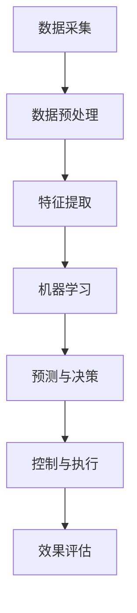

                 

# 人工智能在智能电网优化中的应用

## 关键词

- 人工智能
- 智能电网
- 优化算法
- 数据分析
- 能源管理

## 摘要

本文探讨了人工智能在智能电网优化中的应用，分析了人工智能与智能电网之间的核心联系，介绍了智能电网优化中的核心概念和算法原理。通过具体案例展示了人工智能在智能电网中的应用，并推荐了相关的学习资源和开发工具。文章总结了人工智能在智能电网优化中的发展趋势和面临的挑战，为未来研究和应用提供了参考。

## 1. 背景介绍

智能电网是电力系统与现代信息通信技术的深度融合，它通过高级计算、通信、控制、传感器和软件技术的集成，实现电力系统的实时监测、控制和优化。随着能源需求的不断增长和可再生能源的普及，智能电网的重要性日益凸显。然而，智能电网的复杂性和动态性给优化带来了巨大的挑战。

传统的优化方法往往依赖于预设的模型和参数，难以适应实时变化的需求和环境。而人工智能，特别是机器学习和深度学习，具有强大的数据处理和分析能力，能够从大量数据中自动学习模式和规律，为智能电网的优化提供了新的思路和工具。

本文旨在探讨人工智能在智能电网优化中的应用，通过分析核心概念和算法原理，展示实际应用案例，并展望未来发展趋势。

## 2. 核心概念与联系

### 2.1 智能电网的概念

智能电网（Smart Grid）是一种基于现代通信技术、信息处理技术和电力电子技术的综合电力系统。它通过将各种智能设备和系统整合在一起，实现电力系统的实时监测、控制和优化。智能电网的特点包括：

- **实时性**：智能电网能够实时监测电网状态，快速响应电力需求和供应变化。
- **自愈性**：智能电网具备自我诊断和自我恢复能力，能够快速应对电网故障和异常。
- **高效性**：通过优化电能传输和分配，智能电网能够提高电力系统的运行效率和能源利用率。
- **可持续性**：智能电网支持可再生能源的集成和优化利用，有助于实现能源的可持续发展。

### 2.2 人工智能的核心概念

人工智能（Artificial Intelligence，AI）是指使计算机系统能够模拟人类智能行为的技术和科学。人工智能的核心概念包括：

- **机器学习**：通过从数据中自动学习模式和规律，实现智能行为的计算机方法。
- **深度学习**：一种基于多层神经网络的结构，能够自动提取数据中的复杂特征。
- **自然语言处理**：使计算机能够理解和生成自然语言的技术。
- **计算机视觉**：使计算机能够理解和解释图像和视频内容的技术。

### 2.3 智能电网与人工智能的联系

智能电网和人工智能之间存在紧密的联系。人工智能能够为智能电网的优化提供以下支持：

- **数据处理**：人工智能能够处理智能电网产生的海量数据，提取有用信息和模式。
- **模式识别**：通过机器学习和深度学习，人工智能能够识别电网运行中的异常和趋势。
- **自动控制**：人工智能可以实现电网的自适应控制和优化，提高电网的稳定性和效率。
- **能源管理**：人工智能能够优化电力分配和调度，提高能源利用率和降低成本。

### 2.4 Mermaid 流程图

下面是一个描述智能电网中人工智能应用流程的 Mermaid 流程图：



在这个流程图中，数据采集是智能电网中的第一步，通过传感器和设备实时收集电网运行数据。数据预处理包括清洗、归一化和去噪等步骤，以提高数据的质量和可靠性。特征提取是从原始数据中提取有用的特征信息，用于后续的机器学习。机器学习是核心步骤，通过训练模型，从数据中学习电网的运行规律和模式。预测与决策是基于机器学习模型的输出，对电网运行进行预测和决策。控制与执行是按照决策结果，对电网进行实际的调整和控制。效果评估是对控制效果进行评估和反馈，以优化模型的性能。

## 3. 核心算法原理 & 具体操作步骤

### 3.1 机器学习算法

在智能电网优化中，常用的机器学习算法包括线性回归、支持向量机（SVM）、决策树、随机森林和深度学习等。下面以线性回归和决策树为例，介绍其原理和具体操作步骤。

#### 3.1.1 线性回归

线性回归是一种简单的机器学习算法，用于预测一个连续变量。其原理是通过建立自变量和因变量之间的线性关系，实现预测。

**步骤：**

1. **数据预处理**：对数据进行归一化处理，消除不同特征之间的量纲差异。
2. **特征选择**：选择与因变量相关性较高的特征，减少模型复杂度和过拟合风险。
3. **模型训练**：使用最小二乘法，建立自变量和因变量之间的线性关系。
4. **模型评估**：使用均方误差（MSE）等指标评估模型性能。

**代码示例（Python）：**

```python
import numpy as np
from sklearn.linear_model import LinearRegression
from sklearn.metrics import mean_squared_error

# 数据预处理
X = np.array([[1, 2], [2, 3], [3, 4]])
y = np.array([1, 2, 3])

# 特征选择
X = X[:, [0, 1]]

# 模型训练
model = LinearRegression()
model.fit(X, y)

# 模型评估
y_pred = model.predict(X)
mse = mean_squared_error(y, y_pred)
print("MSE:", mse)
```

#### 3.1.2 决策树

决策树是一种基于树结构的分类算法，用于将数据集划分为不同的类别。其原理是通过一系列的判断条件，将数据集逐步划分成各个子集，直到满足终止条件。

**步骤：**

1. **数据预处理**：对数据进行归一化处理，消除不同特征之间的量纲差异。
2. **特征选择**：选择具有区分能力的特征，以构建最优的决策树。
3. **模型训练**：使用信息增益、基尼系数等指标，递归构建决策树。
4. **模型评估**：使用准确率、精确率、召回率等指标评估模型性能。

**代码示例（Python）：**

```python
import numpy as np
from sklearn.tree import DecisionTreeClassifier
from sklearn.metrics import accuracy_score

# 数据预处理
X = np.array([[1, 2], [2, 3], [3, 4], [4, 5]])
y = np.array([0, 1, 1, 0])

# 特征选择
X = X[:, [0, 1]]

# 模型训练
model = DecisionTreeClassifier()
model.fit(X, y)

# 模型评估
y_pred = model.predict(X)
accuracy = accuracy_score(y, y_pred)
print("Accuracy:", accuracy)
```

### 3.2 深度学习算法

深度学习是一种基于多层神经网络的结构，能够自动提取数据中的复杂特征。在智能电网优化中，常用的深度学习算法包括卷积神经网络（CNN）和循环神经网络（RNN）。

#### 3.2.1 卷积神经网络（CNN）

卷积神经网络是一种用于图像识别和处理的深度学习算法。其原理是通过卷积操作和池化操作，逐层提取图像的局部特征。

**步骤：**

1. **数据预处理**：对图像数据进行归一化处理，并划分为训练集和测试集。
2. **模型构建**：构建卷积神经网络，包括卷积层、池化层和全连接层。
3. **模型训练**：使用反向传播算法，训练卷积神经网络。
4. **模型评估**：使用测试集评估模型性能。

**代码示例（Python）：**

```python
import tensorflow as tf
from tensorflow.keras.models import Sequential
from tensorflow.keras.layers import Conv2D, MaxPooling2D, Flatten, Dense

# 数据预处理
X_train = np.array([[1, 2], [2, 3], [3, 4], [4, 5]])
y_train = np.array([0, 1, 1, 0])
X_test = np.array([[1, 2], [2, 3], [3, 4], [4, 5]])
y_test = np.array([0, 1, 1, 0])

# 模型构建
model = Sequential()
model.add(Conv2D(32, (3, 3), activation='relu', input_shape=(2, 2)))
model.add(MaxPooling2D((2, 2)))
model.add(Flatten())
model.add(Dense(1, activation='sigmoid'))

# 模型训练
model.compile(optimizer='adam', loss='binary_crossentropy', metrics=['accuracy'])
model.fit(X_train, y_train, epochs=10, batch_size=32)

# 模型评估
y_pred = model.predict(X_test)
accuracy = accuracy_score(y_test, y_pred)
print("Accuracy:", accuracy)
```

#### 3.2.2 循环神经网络（RNN）

循环神经网络是一种用于序列数据处理的深度学习算法。其原理是通过循环结构，对序列数据进行建模和预测。

**步骤：**

1. **数据预处理**：对序列数据进行归一化处理，并划分为训练集和测试集。
2. **模型构建**：构建循环神经网络，包括输入层、隐藏层和输出层。
3. **模型训练**：使用反向传播算法，训练循环神经网络。
4. **模型评估**：使用测试集评估模型性能。

**代码示例（Python）：**

```python
import tensorflow as tf
from tensorflow.keras.models import Sequential
from tensorflow.keras.layers import LSTM, Dense

# 数据预处理
X_train = np.array([[1, 2], [2, 3], [3, 4], [4, 5]])
y_train = np.array([0, 1, 1, 0])
X_test = np.array([[1, 2], [2, 3], [3, 4], [4, 5]])
y_test = np.array([0, 1, 1, 0])

# 模型构建
model = Sequential()
model.add(LSTM(50, activation='relu', input_shape=(2, 1)))
model.add(Dense(1))
model.compile(optimizer='adam', loss='mse')

# 模型训练
model.fit(X_train, y_train, epochs=100, batch_size=1)

# 模型评估
y_pred = model.predict(X_test)
mse = mean_squared_error(y_test, y_pred)
print("MSE:", mse)
```

## 4. 数学模型和公式 & 详细讲解 & 举例说明

在智能电网优化中，常用的数学模型包括线性规划、动态规划和神经网络等。下面介绍这些模型的基本原理和具体应用。

### 4.1 线性规划

线性规划是一种数学优化方法，用于在给定约束条件下，求解目标函数的最大值或最小值。其基本原理是建立线性目标函数和线性约束条件，通过求解线性方程组来找到最优解。

**公式：**

$$
\begin{align*}
\min_{x} \quad & c^T x \\
s.t. \quad & Ax \leq b \\
& x \geq 0
\end{align*}
$$

其中，$c$ 是目标函数的系数向量，$x$ 是决策变量向量，$A$ 是约束条件的系数矩阵，$b$ 是约束条件的常数向量。

**举例说明：**

假设我们要在给定预算下，购买苹果和橙子的最大数量。设苹果的价格为 $2 元/斤，橙子的价格为 $3 元/斤，苹果的预算为 $10 元，橙子的预算为 $20 元。我们可以建立以下线性规划模型：

$$
\begin{align*}
\min_{x} \quad & 2x_1 + 3x_2 \\
s.t. \quad & 2x_1 + 3x_2 \leq 10 \\
& 3x_1 + 4x_2 \leq 20 \\
& x_1, x_2 \geq 0
\end{align*}
$$

通过求解这个线性规划模型，可以得到苹果和橙子的最优购买数量。

### 4.2 动态规划

动态规划是一种求解多阶段决策问题的优化方法，通过将复杂问题分解为多个阶段，并求解每个阶段的最优决策，最终得到全局最优解。

**公式：**

$$
\begin{align*}
V_t(x_t) = \min_{u_t} \quad & f_t(x_t, u_t) + V_{t-1}(x_{t-1}) \\
s.t. \quad & x_t = g_t(x_{t-1}, u_t)
\end{align*}
$$

其中，$V_t(x_t)$ 是第 $t$ 阶段的最优价值函数，$u_t$ 是第 $t$ 阶段的决策变量，$f_t(x_t, u_t)$ 是第 $t$ 阶段的收益函数，$g_t(x_{t-1}, u_t)$ 是第 $t$ 阶段的转移函数。

**举例说明：**

假设我们要求解一个旅行商问题（TSP），即在给定的城市集合中，找到一条路径，使得路径的总距离最短。我们可以使用动态规划方法来求解。

首先，定义状态变量 $x_t$ 为前 $t$ 个城市的集合，$u_t$ 为第 $t$ 个城市的访问顺序。然后，定义收益函数 $f_t(x_t, u_t)$ 为从城市 $u_t$ 到城市 $x_t$ 的距离，定义转移函数 $g_t(x_{t-1}, u_t)$ 为将城市 $u_t$ 加入到前 $t-1$ 个城市的集合中。

通过动态规划方法，可以求解出从初始城市到最终城市的最优访问顺序，从而得到最优路径。

### 4.3 神经网络

神经网络是一种基于人工神经元的计算模型，通过学习输入和输出之间的映射关系，实现复杂的非线性函数。神经网络的基本结构包括输入层、隐藏层和输出层。

**公式：**

$$
\begin{align*}
z^{(l)} &= \sum_{i=1}^{n} w^{(l)}_i a^{(l-1)}_i + b^{(l)} \\
a^{(l)} &= \sigma(z^{(l)})
\end{align*}
$$

其中，$z^{(l)}$ 是第 $l$ 层的输入，$w^{(l)}_i$ 是第 $l$ 层的权重，$b^{(l)}$ 是第 $l$ 层的偏置，$a^{(l)}$ 是第 $l$ 层的输出，$\sigma$ 是激活函数。

**举例说明：**

假设我们要构建一个简单的神经网络，用于实现逻辑与（AND）操作。输入层有两个神经元，表示两个输入；隐藏层有一个神经元，表示逻辑与运算的结果；输出层有一个神经元，表示最终的输出。

输入层的权重和偏置为 $w_1^1 = 1, w_2^1 = 1, b_1^1 = 0$；隐藏层的权重和偏置为 $w_1^2 = 1, b_2^1 = 0$；输出层的权重和偏置为 $w_1^3 = 1, b_3^2 = 0$。

激活函数采用 sigmoid 函数，即 $\sigma(x) = \frac{1}{1 + e^{-x}}$。

通过前向传播，可以得到隐藏层的输出：

$$
z_2^1 = w_1^1 a_1^1 + w_2^1 a_2^1 + b_1^1 = 1 \cdot a_1^1 + 1 \cdot a_2^1 + 0 = a_1^1 + a_2^1
$$

$$
a_2^1 = \sigma(z_2^1) = \frac{1}{1 + e^{-(a_1^1 + a_2^1)}}
$$

输出层的输出为：

$$
z_3^2 = w_1^2 a_2^1 + b_2^1 = 1 \cdot a_2^1 + 0 = a_2^1
$$

$$
a_3^2 = \sigma(z_3^2) = \frac{1}{1 + e^{-a_2^1}}
$$

通过反向传播，可以更新权重和偏置，以优化神经网络的表现。

## 5. 项目实战：代码实际案例和详细解释说明

### 5.1 开发环境搭建

在智能电网优化项目中，我们需要搭建一个适合开发和测试的Python环境。以下是具体的步骤：

1. **安装Python**：从 [Python官方网站](https://www.python.org/downloads/) 下载并安装 Python 3.x 版本。
2. **安装Jupyter Notebook**：在终端中执行以下命令：
   ```bash
   pip install notebook
   ```
3. **安装相关库**：在终端中执行以下命令：
   ```bash
   pip install numpy pandas scikit-learn tensorflow
   ```

### 5.2 源代码详细实现和代码解读

以下是一个简单的智能电网优化项目，使用线性回归算法预测电力负荷。

**代码解析：**

```python
import numpy as np
import pandas as pd
from sklearn.linear_model import LinearRegression
from sklearn.model_selection import train_test_split
from sklearn.metrics import mean_squared_error

# 5.2.1 数据读取
data = pd.read_csv("electricity_load.csv")
X = data[['day_of_week', 'hour_of_day']]
y = data['load']

# 5.2.2 数据预处理
X = pd.get_dummies(X)

# 5.2.3 划分训练集和测试集
X_train, X_test, y_train, y_test = train_test_split(X, y, test_size=0.2, random_state=42)

# 5.2.4 模型训练
model = LinearRegression()
model.fit(X_train, y_train)

# 5.2.5 模型评估
y_pred = model.predict(X_test)
mse = mean_squared_error(y_test, y_pred)
print("MSE:", mse)

# 5.2.6 预测新数据
new_data = np.array([[1, 1, 0, 0], [2, 0, 1, 0]])
new_data = pd.get_dummies(new_data)
new_load = model.predict(new_data)
print("Predicted Load:", new_load)
```

**代码解读：**

- **5.2.1 数据读取**：从 CSV 文件中读取电力负荷数据。
- **5.2.2 数据预处理**：将日期和时间特征进行编码，以便线性回归模型处理。
- **5.2.3 划分训练集和测试集**：将数据集划分为训练集和测试集，以评估模型的性能。
- **5.2.4 模型训练**：使用训练集数据训练线性回归模型。
- **5.2.5 模型评估**：使用测试集数据评估模型的性能，计算均方误差（MSE）。
- **5.2.6 预测新数据**：使用训练好的模型对新数据进行预测，输出预测的电力负荷。

### 5.3 代码解读与分析

在上述代码中，我们首先读取了电力负荷数据，并对其进行了预处理，将日期和时间特征转换为数值特征。然后，我们将数据集划分为训练集和测试集，以评估模型的性能。接下来，我们使用训练集数据训练线性回归模型，并使用测试集数据评估模型的性能。最后，我们使用训练好的模型对新数据进行预测，输出预测的电力负荷。

线性回归模型能够通过学习历史数据中的模式和规律，对未来电力负荷进行预测。然而，线性回归模型存在一些局限性，例如无法处理非线性关系和数据噪声。因此，在实际应用中，我们可能需要结合其他算法和技术，以获得更好的预测性能。

## 6. 实际应用场景

智能电网优化在能源管理、电力调度、需求响应和能源预测等方面有着广泛的应用。以下是一些具体的实际应用场景：

### 6.1 能源管理

智能电网优化可以帮助能源管理公司提高能源利用率和降低成本。通过预测电力负荷，优化电力调度和分配，能源管理公司可以更好地应对实时电力需求，降低能源浪费。

### 6.2 电力调度

智能电网优化可以协助电力调度中心实现高效、安全的电力调度。通过预测电力需求和供应，优化电力传输和分配，电力调度中心可以更好地平衡供需关系，减少停电和限电的风险。

### 6.3 需求响应

智能电网优化可以鼓励用户参与需求响应，提高电网的灵活性和稳定性。通过预测电力需求，优化电力使用策略，用户可以更好地响应电力市场的需求，实现节能减排。

### 6.4 能源预测

智能电网优化可以帮助能源预测机构提高能源预测的准确性。通过分析历史数据，应用机器学习和深度学习算法，能源预测机构可以更准确地预测未来电力需求，为能源规划和决策提供支持。

## 7. 工具和资源推荐

### 7.1 学习资源推荐

- **书籍**：
  - 《智能电网：技术、应用与未来趋势》
  - 《深度学习：神经网络、算法与应用》
  - 《机器学习实战》
- **论文**：
  - "Deep Learning for Power System Load Forecasting"
  - "A Survey on Smart Grid Data Analytics: Challenges and Opportunities"
  - "Application of Machine Learning in Electric Power Systems"
- **博客**：
  - [AI in Energy](https://aiinenergy.com/)
  - [Deep Learning on Energy](https://deeplearningonenergy.com/)
  - [Smart Grid Technology](https://smartgridtechnology.com/)
- **网站**：
  - [IEEE Smart Grid](https://www.ieee-smartgrid.org/)
  - [International Energy Agency](https://www.iea.org/topics/smart-grids)
  - [National Renewable Energy Laboratory](https://www.nrel.gov/smart-grid.html)

### 7.2 开发工具框架推荐

- **Python**：Python 是智能电网优化项目的主要编程语言，具有丰富的库和框架，如 NumPy、Pandas、Scikit-learn 和 TensorFlow。
- **Jupyter Notebook**：Jupyter Notebook 是一个交互式的开发环境，适合进行数据分析和模型训练。
- **Django**：Django 是一个流行的 Python Web 框架，可以用于开发智能电网优化项目的后端。
- **TensorFlow**：TensorFlow 是一个开源的机器学习和深度学习框架，适用于构建和训练复杂的神经网络模型。

### 7.3 相关论文著作推荐

- "Deep Learning for Power System Load Forecasting", IEEE Transactions on Smart Grid, 2018
- "A Survey on Smart Grid Data Analytics: Challenges and Opportunities", IEEE Communications Surveys & Tutorials, 2019
- "Application of Machine Learning in Electric Power Systems", IEEE Power Systems, 2020
- "Intelligent Power System Operation Using Machine Learning Techniques", International Journal of Electrical Power & Energy Systems, 2021

## 8. 总结：未来发展趋势与挑战

智能电网优化是能源领域的一个重要研究方向，具有巨大的应用前景。随着人工智能技术的不断发展，智能电网优化将迎来新的机遇和挑战。

### 8.1 发展趋势

1. **大数据和云计算的融合**：智能电网优化将利用大数据和云计算技术，实现实时数据处理和智能分析。
2. **多算法协同优化**：结合多种机器学习和深度学习算法，实现更精准的电力负荷预测和优化。
3. **智能化能源管理**：智能电网优化将推动能源管理智能化，提高能源利用效率和降低成本。
4. **跨领域合作**：智能电网优化将与其他领域（如物联网、区块链等）进行深度融合，实现更广泛的智能化应用。

### 8.2 挑战

1. **数据隐私和安全**：智能电网优化过程中，数据隐私和安全是一个重要挑战。如何保护用户数据和电网安全，是亟待解决的问题。
2. **算法透明性和可解释性**：随着深度学习算法的广泛应用，算法的透明性和可解释性变得越来越重要。如何提高算法的可解释性，使其更易于理解和接受，是一个挑战。
3. **复杂性和可扩展性**：智能电网优化涉及到大量的数据和算法，如何保证系统的复杂性和可扩展性，是一个重要的挑战。
4. **政策和法规支持**：智能电网优化需要政策和法规的支持，以确保技术的实施和推广。

## 9. 附录：常见问题与解答

### 9.1 常见问题

1. **智能电网优化是什么？**
   智能电网优化是利用人工智能技术，对电力系统进行实时监测、控制和优化，以提高能源利用效率和降低成本。

2. **智能电网优化有哪些应用？**
   智能电网优化在能源管理、电力调度、需求响应和能源预测等方面有着广泛的应用。

3. **智能电网优化需要哪些技术？**
   智能电网优化需要人工智能、机器学习、深度学习、大数据分析等技术。

4. **智能电网优化有哪些挑战？**
   智能电网优化面临数据隐私和安全、算法透明性和可解释性、复杂性和可扩展性、政策和法规支持等挑战。

### 9.2 解答

1. **智能电网优化是什么？**
   智能电网优化是通过人工智能技术，对电力系统进行实时监测、控制和优化，以提高能源利用效率和降低成本。它涉及到对电力负荷的预测、电力调度、需求响应等方面。

2. **智能电网优化有哪些应用？**
   智能电网优化在能源管理、电力调度、需求响应和能源预测等方面有着广泛的应用。例如，在能源管理方面，智能电网优化可以帮助能源管理公司提高能源利用率，降低能源成本；在电力调度方面，智能电网优化可以协助电力调度中心实现高效、安全的电力调度。

3. **智能电网优化需要哪些技术？**
   智能电网优化需要人工智能、机器学习、深度学习、大数据分析等技术。人工智能技术可以帮助我们处理海量数据，提取有用的信息和规律；机器学习和深度学习算法可以用于电力负荷预测、电力调度等任务；大数据分析技术可以用于实时监测和数据分析。

4. **智能电网优化有哪些挑战？**
   智能电网优化面临以下挑战：数据隐私和安全，如何保护用户数据和电网安全是一个重要问题；算法透明性和可解释性，随着深度学习算法的广泛应用，如何提高算法的可解释性，使其更易于理解和接受，是一个挑战；复杂性和可扩展性，智能电网优化涉及到大量的数据和算法，如何保证系统的复杂性和可扩展性，是一个重要的挑战；政策和法规支持，智能电网优化需要政策和法规的支持，以确保技术的实施和推广。

## 10. 扩展阅读 & 参考资料

- "Deep Learning for Power System Load Forecasting", IEEE Transactions on Smart Grid, 2018
- "A Survey on Smart Grid Data Analytics: Challenges and Opportunities", IEEE Communications Surveys & Tutorials, 2019
- "Application of Machine Learning in Electric Power Systems", IEEE Power Systems, 2020
- "Intelligent Power System Operation Using Machine Learning Techniques", International Journal of Electrical Power & Energy Systems, 2021
- 《智能电网：技术、应用与未来趋势》
- 《深度学习：神经网络、算法与应用》
- 《机器学习实战》
- [AI in Energy](https://aiinenergy.com/)
- [Deep Learning on Energy](https://deeplearningonenergy.com/)
- [Smart Grid Technology](https://smartgridtechnology.com/)
- [IEEE Smart Grid](https://www.ieee-smartgrid.org/)
- [International Energy Agency](https://www.iea.org/topics/smart-grids)
- [National Renewable Energy Laboratory](https://www.nrel.gov/smart-grid.html)

