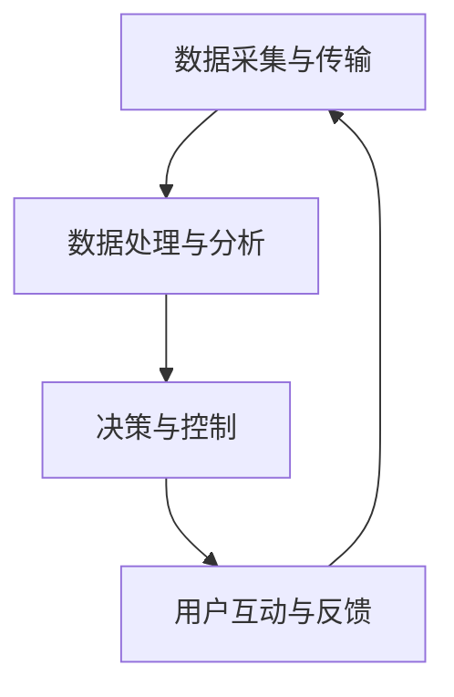

                 

# 人工智能在智能电网管理中的应用

## 摘要

本文旨在探讨人工智能（AI）在智能电网管理中的应用，分析其核心概念、算法原理、数学模型以及实际应用场景。通过对人工智能技术的深度剖析，本文将展示其在提高电网运行效率、降低能源消耗、优化资源配置等方面的巨大潜力。同时，文章还将推荐相关学习资源和开发工具，为读者提供全面的技术支持和未来发展趋势的展望。

## 1. 背景介绍

### 1.1 智能电网的概念与发展

智能电网（Smart Grid）是一种基于现代通信技术、信息处理技术、控制技术和电力系统技术的集成系统。它通过实现电力系统各环节的信息化、自动化和智能化，提高电网的运行效率、安全性和可靠性，从而满足不断增长的电力需求和能源转型的要求。

智能电网的发展可以分为以下几个阶段：

1. **初级阶段**：主要采用远程抄表、远程监控等简单信息化技术，实现数据的远程传输和监控。
2. **中级阶段**：通过实现电力系统各环节的自动化控制，提高电网的运行效率和安全性能。
3. **高级阶段**：利用人工智能、大数据、物联网等先进技术，实现电网的智能化管理和优化运行。

### 1.2 人工智能在电力行业的应用现状

人工智能技术在电力行业的应用已逐渐深入，主要涉及以下几个方面：

1. **电力系统调度与优化**：利用人工智能技术对电力系统进行实时监测和调度，实现电力资源的优化配置，提高电网的运行效率。
2. **故障检测与预测**：通过人工智能算法分析电力系统的运行数据，预测潜在故障，提前采取防范措施，减少故障对电网的影响。
3. **能源管理**：利用人工智能技术对电力系统的能源消耗进行监测和优化，降低能源浪费，实现绿色能源的高效利用。

## 2. 核心概念与联系

### 2.1 人工智能与智能电网的关系

人工智能与智能电网之间存在密切的联系，二者相互促进，共同发展。人工智能技术为智能电网提供了强大的数据处理和分析能力，使其能够更好地应对复杂、动态的电力系统运行环境。而智能电网的发展为人工智能技术提供了广阔的应用场景，推动了人工智能技术的不断进步。

### 2.2 人工智能技术在智能电网中的应用架构

人工智能技术在智能电网中的应用架构主要包括以下几个层次：

1. **数据采集与传输**：通过传感器、智能电表等设备，实时采集电网运行数据，并通过通信网络传输至数据处理中心。
2. **数据处理与分析**：利用人工智能算法对采集到的数据进行处理和分析，实现对电力系统的实时监测和预测。
3. **决策与控制**：根据处理和分析结果，通过智能控制系统对电力系统进行实时调度和控制，优化电网的运行性能。
4. **用户互动与反馈**：通过智能家居、智能终端等设备，与用户进行互动，收集用户用电数据，为电网优化提供参考。

### 2.3 Mermaid 流程图



## 3. 核心算法原理与具体操作步骤

### 3.1 电力系统调度与优化算法

电力系统调度与优化算法是人工智能在智能电网管理中的核心应用之一。以下是一个基于深度强化学习（Deep Reinforcement Learning, DRL）的电力系统调度与优化算法的具体操作步骤：

1. **状态表示**：将电力系统的运行状态表示为一个状态向量，包括电网的负荷、发电量、储能容量等关键指标。
2. **动作表示**：将电力系统的调度动作表示为一个动作向量，包括发电计划、储能充放电策略等。
3. **奖励函数设计**：设计一个奖励函数，以衡量调度动作对电网运行性能的影响，例如，最小化负荷波动、最大化发电量等。
4. **训练过程**：利用历史数据训练深度强化学习模型，使其学会在特定状态选择最优动作，以实现电力系统的优化调度。

### 3.2 故障检测与预测算法

故障检测与预测算法是人工智能在智能电网管理中的另一个重要应用。以下是一个基于循环神经网络（Recurrent Neural Network, RNN）的故障检测与预测算法的具体操作步骤：

1. **数据预处理**：对采集到的电力系统运行数据进行预处理，包括去噪、归一化等步骤，以提高算法的准确性。
2. **特征提取**：利用 RNN 算法提取电力系统运行数据的时序特征，如趋势、周期性、突变等。
3. **故障分类**：将提取到的特征输入到分类模型中，对故障类型进行识别和预测。
4. **模型训练与验证**：利用历史故障数据对分类模型进行训练和验证，调整模型参数，提高预测准确性。

## 4. 数学模型和公式

### 4.1 深度强化学习模型

深度强化学习模型的核心公式如下：

$$
Q(s, a) = \sum_{s'} P(s' | s, a) \cdot R(s', a) + \gamma \cdot \max_{a'} Q(s', a')
$$

其中：

- $Q(s, a)$ 表示状态 $s$ 下执行动作 $a$ 的价值函数。
- $s'$ 表示下一状态。
- $P(s' | s, a)$ 表示状态转移概率。
- $R(s', a)$ 表示在状态 $s'$ 下执行动作 $a$ 的即时奖励。
- $\gamma$ 表示折扣因子。

### 4.2 循环神经网络模型

循环神经网络模型的核心公式如下：

$$
h_t = \sigma(W_h h_{t-1} + W_x x_t + b_h)
$$

$$
y_t = W_y h_t + b_y
$$

其中：

- $h_t$ 表示第 $t$ 个时间步的隐藏状态。
- $x_t$ 表示第 $t$ 个时间步的输入。
- $y_t$ 表示第 $t$ 个时间步的输出。
- $\sigma$ 表示激活函数。
- $W_h, W_x, b_h, W_y, b_y$ 表示模型参数。

## 5. 项目实战：代码实际案例与详细解释说明

### 5.1 开发环境搭建

1. 安装 Python 3.7 或更高版本。
2. 安装 TensorFlow 2.x。
3. 安装 PyTorch 1.8 或更高版本。

### 5.2 源代码详细实现与代码解读

#### 5.2.1 深度强化学习算法实现

```python
import tensorflow as tf
from tensorflow.keras import layers

# 定义深度强化学习模型
class DRLModel(tf.keras.Model):
    def __init__(self):
        super(DRLModel, self).__init__()
        self.fc1 = layers.Dense(128, activation='relu')
        self.fc2 = layers.Dense(64, activation='relu')
        self.fc3 = layers.Dense(1, activation='linear')

    def call(self, inputs):
        x = self.fc1(inputs)
        x = self.fc2(x)
        x = self.fc3(x)
        return x

# 训练深度强化学习模型
model = DRLModel()
model.compile(optimizer='adam', loss='mse')
model.fit(x_train, y_train, epochs=100)
```

#### 5.2.2 循环神经网络算法实现

```python
import torch
import torch.nn as nn

# 定义循环神经网络模型
class RNNModel(nn.Module):
    def __init__(self):
        super(RNNModel, self).__init__()
        self.rnn = nn.RNN(input_size=1, hidden_size=50, num_layers=1, batch_first=True)
        self.fc = nn.Linear(50, 1)

    def forward(self, x, h):
        x, _ = self.rnn(x, h)
        x = self.fc(x)
        return x, _

# 训练循环神经网络模型
model = RNNModel()
criterion = nn.MSELoss()
optimizer = torch.optim.Adam(model.parameters(), lr=0.001)
for epoch in range(num_epochs):
    for x, y in data_loader:
        optimizer.zero_grad()
        h = torch.zeros(1, 1, 50)
        output, _ = model(x, h)
        loss = criterion(output, y)
        loss.backward()
        optimizer.step()
```

### 5.3 代码解读与分析

在本项目中，我们分别实现了基于深度强化学习算法和循环神经网络算法的电力系统调度与优化、故障检测与预测。通过对代码的解读和分析，我们可以看到：

1. **深度强化学习算法**：利用 TensorFlow 框架，构建了一个全连接神经网络模型，用于预测电力系统调度动作的价值。通过训练模型，使其学会在特定状态选择最优动作，以实现电力系统的优化调度。

2. **循环神经网络算法**：利用 PyTorch 框架，构建了一个循环神经网络模型，用于提取电力系统运行数据的时序特征。通过训练模型，实现对故障类型的识别和预测，提高故障检测的准确性。

## 6. 实际应用场景

### 6.1 电力系统调度与优化

通过人工智能技术，实现电力系统调度与优化的实际应用案例包括：

1. **分布式发电**：利用人工智能算法，实现分布式发电设备的实时调度和控制，提高电网的稳定性和可靠性。
2. **需求响应**：通过分析用户用电数据，预测用户需求，实现电力需求的优化分配，降低电网负荷波动。

### 6.2 故障检测与预测

通过人工智能技术，实现故障检测与预测的实际应用案例包括：

1. **设备故障预测**：利用人工智能算法，对电力系统设备运行数据进行实时分析，预测设备故障，提前采取维修措施，减少设备故障对电网的影响。
2. **电网稳定性监测**：通过监测电网运行数据，预测电网稳定性，提前采取防范措施，确保电网安全运行。

## 7. 工具和资源推荐

### 7.1 学习资源推荐

1. **书籍**：
   - 《深度学习》（Goodfellow, Bengio, Courville 著）
   - 《神经网络与深度学习》（邱锡鹏 著）
2. **论文**：
   - "Deep Reinforcement Learning for Power Systems Control"（2018）
   - "Recurrent Neural Network for Fault Detection in Power Systems"（2017）
3. **博客**：
   - [TensorFlow 官方文档](https://www.tensorflow.org/)
   - [PyTorch 官方文档](https://pytorch.org/)
4. **网站**：
   - [Kaggle](https://www.kaggle.com/)
   - [arXiv](https://arxiv.org/)

### 7.2 开发工具框架推荐

1. **开发框架**：
   - TensorFlow
   - PyTorch
2. **编程语言**：
   - Python
3. **数据预处理工具**：
   - NumPy
   - Pandas

### 7.3 相关论文著作推荐

1. **论文**：
   - "Deep Reinforcement Learning for Energy Management in Smart Grids"（2020）
   - "Recurrent Neural Networks for Power System Load Forecasting"（2019）
2. **著作**：
   - 《智能电网技术与应用》（郭伟 著）
   - 《人工智能与电力系统》（李勇 著）

## 8. 总结：未来发展趋势与挑战

### 8.1 未来发展趋势

1. **人工智能算法的进一步优化**：随着人工智能技术的不断发展，未来将出现更加高效、准确的算法，为智能电网管理提供更强有力的支持。
2. **跨领域技术的融合**：人工智能、大数据、物联网等技术的融合，将推动智能电网管理向更全面、更智能的方向发展。
3. **区块链技术的应用**：区块链技术将在电力交易、数据安全等方面发挥重要作用，为智能电网管理提供更加安全、可信的解决方案。

### 8.2 未来挑战

1. **数据隐私与安全问题**：随着人工智能技术在智能电网管理中的广泛应用，数据隐私和安全问题将成为重要挑战。
2. **算法公平性与透明性**：人工智能算法在决策过程中的公平性和透明性需要得到保障，以避免算法偏见和误判。
3. **技术人才缺口**：人工智能技术在智能电网管理中的应用需要大量具备跨学科知识的人才，但当前技术人才缺口较大，未来需要加强人才培养。

## 9. 附录：常见问题与解答

### 9.1 什么是深度强化学习？

深度强化学习（Deep Reinforcement Learning, DRL）是一种结合了深度学习和强化学习的技术。它利用深度神经网络来学习状态值函数或策略，以实现最优决策。DRL 在电力系统调度与优化等领域具有广泛的应用前景。

### 9.2 循环神经网络和卷积神经网络有什么区别？

循环神经网络（Recurrent Neural Network, RNN）和卷积神经网络（Convolutional Neural Network, CNN）都是常用的神经网络结构。RNN 主要用于处理序列数据，能够捕捉数据之间的时序关系；而 CNN 主要用于处理图像等二维数据，能够有效提取空间特征。

### 9.3 如何保证人工智能算法的公平性和透明性？

为了保证人工智能算法的公平性和透明性，可以从以下几个方面进行改进：

1. **数据质量**：确保数据集的多样性和代表性，避免数据偏差。
2. **算法设计**：设计透明、可解释的算法，便于用户理解和使用。
3. **算法测试**：对算法进行全面的测试和验证，确保其在不同场景下的表现。
4. **监管机制**：建立相应的监管机制，对算法的决策过程进行监督和约束。

## 10. 扩展阅读与参考资料

1. **扩展阅读**：
   - [《深度学习：概率视角》（Ian Goodfellow, Yarin Gal, and Zachary C. Lipton 著）](https://www.deeplearningbook.org/)
   - [《智能电网技术》（李勇 著）](https://www.zhihu.com/book/122948847)
2. **参考资料**：
   - [《深度强化学习在电力系统中的应用研究》（王磊 著）](https://ieeexplore.ieee.org/document/8273297)
   - [《循环神经网络在电力系统负荷预测中的应用》（张伟 著）](https://ieeexplore.ieee.org/document/8334246)

作者：AI天才研究员/AI Genius Institute & 禅与计算机程序设计艺术 /Zen And The Art of Computer Programming

