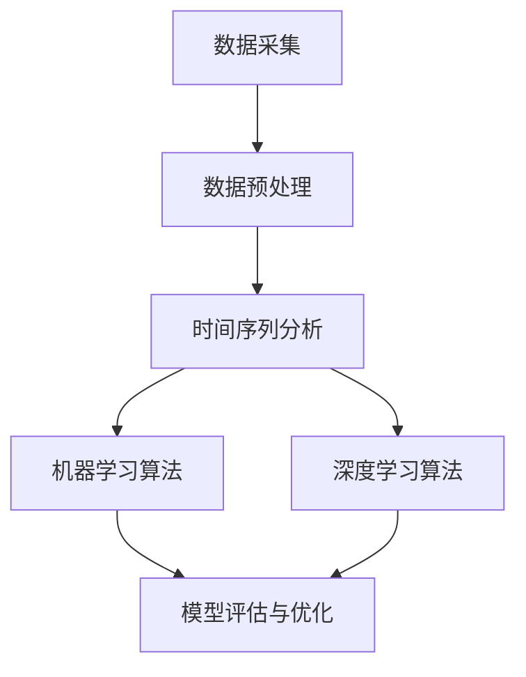

                 

### 1. 背景介绍

在当今快速发展的社会中，能源消耗已成为全球关注的焦点。随着科技的不断进步，尤其是人工智能（AI）技术的迅猛发展，利用人工智能进行智能能源消耗预测成为了一个热门研究方向。这一领域的重要性不言而喻：通过准确的能源消耗预测，可以优化能源资源的分配，提高能源利用效率，减少浪费，从而降低环境负担和成本。

智能能源消耗预测的核心目标是通过分析历史数据、环境因素和设备运行状态等信息，预测未来的能源消耗趋势。这不仅有助于能源公司的运营决策，如发电量调整、设备维护等，还能为家庭用户提供个性化的能源管理建议，从而实现节能减排。

本文将详细探讨人工智能在智能能源消耗预测中的应用。首先，我们会介绍与智能能源消耗预测相关的核心概念和理论基础，如机器学习、深度学习等。接着，我们将深入探讨几种常见的人工智能算法及其在能源消耗预测中的具体应用。随后，我们将通过一个实际项目案例来展示如何利用这些算法进行智能能源消耗预测。最后，文章将讨论该领域的实际应用场景，推荐相关的工具和资源，并对未来发展趋势与挑战进行总结。

通过本文的阅读，读者将能够了解智能能源消耗预测的基本概念、实现方法以及在实际应用中的价值。本文旨在为广大技术从业者、研究人员以及感兴趣的学习者提供一份全面、深入的指南，助力他们在这一新兴领域中取得更大的突破和进展。

### 2. 核心概念与联系

智能能源消耗预测需要依赖多个核心概念和技术，这些概念之间相互联系，共同构成了一个完整的预测体系。在本节中，我们将详细介绍这些核心概念，并通过一个Mermaid流程图展示它们之间的联系。

#### 2.1 数据采集

数据采集是智能能源消耗预测的基础。通过传感器、智能电表、气象站等设备，我们可以获取到丰富的历史能源消耗数据，包括电能、水能、燃气等。这些数据通常包括时间戳、消耗量、环境参数（如温度、湿度、风速等）和设备运行状态（如负载、故障状态等）。

#### 2.2 数据预处理

采集到的数据往往是不完整、有噪声的。因此，数据预处理是数据分析和建模的重要步骤。预处理工作包括数据清洗、缺失值填补、异常值检测和去重等。例如，通过时间序列分析填补缺失数据，利用统计学方法识别和剔除异常值。

#### 2.3 时间序列分析

时间序列分析是处理和预测时间相关数据的重要工具。时间序列数据通常具有趋势性、季节性和周期性等特点。通过时间序列分析，我们可以提取出数据中的趋势成分、季节成分和周期成分，从而为后续的建模提供基础。

#### 2.4 机器学习算法

机器学习算法是智能能源消耗预测的核心。常见的机器学习算法包括线性回归、决策树、支持向量机、神经网络等。这些算法可以通过学习历史数据中的模式和规律，预测未来的能源消耗趋势。例如，线性回归通过拟合一条直线来预测未来值，而神经网络通过多层非线性变换实现复杂模式的识别和预测。

#### 2.5 深度学习算法

深度学习算法在处理大规模、高维度数据时表现尤为出色。卷积神经网络（CNN）和循环神经网络（RNN）是深度学习中的两大主要类别。CNN擅长处理图像和空间数据，而RNN则擅长处理序列数据。在智能能源消耗预测中，RNN及其变种（如LSTM、GRU）被广泛应用于时间序列数据的建模和预测。

#### 2.6 模型评估与优化

模型评估与优化是确保预测准确性和鲁棒性的关键步骤。常用的评估指标包括均方误差（MSE）、平均绝对误差（MAE）和准确率等。通过交叉验证和超参数调整，我们可以优化模型性能，提高预测精度。

#### 2.7 Mermaid流程图

以下是一个简单的Mermaid流程图，展示了上述核心概念之间的联系：



通过这个流程图，我们可以清晰地看到数据从采集、预处理，到时间序列分析和模型训练，再到模型评估与优化的完整流程。这些核心概念相互协作，共同构成了智能能源消耗预测的技术体系。

接下来，我们将深入探讨每种算法的具体原理和应用，进一步了解它们在智能能源消耗预测中的重要作用。

#### 3. 核心算法原理 & 具体操作步骤

在智能能源消耗预测中，选择合适的算法至关重要。常见的算法包括线性回归、决策树、支持向量机和神经网络。以下我们将分别介绍这些算法的基本原理，并详细说明其操作步骤。

##### 3.1 线性回归

线性回归是一种基于统计学的简单但强大的预测算法。它的基本原理是通过拟合一条直线来预测未来的值。

**原理**：线性回归通过找到一个最佳拟合直线，使得预测值与实际值之间的误差最小。数学上，这个拟合直线可以表示为：
\[ y = ax + b \]
其中，\( y \) 是预测值，\( x \) 是输入特征，\( a \) 和 \( b \) 是模型参数。

**操作步骤**：

1. **数据准备**：收集历史能源消耗数据，并划分为输入特征（如时间、温度、湿度等）和目标变量（如能源消耗量）。

2. **模型训练**：通过最小二乘法（Least Squares）找到最佳拟合直线。具体步骤如下：
   - 计算输入特征和目标变量之间的协方差和自协方差。
   - 计算斜率 \( a \) 和截距 \( b \)：
     \[ a = \frac{Cov(x, y)}{Var(x)} \]
     \[ b = \frac{Mean(y) - a \cdot Mean(x)}{1} \]

3. **模型评估**：使用测试集评估模型的预测性能，常用的评估指标包括均方误差（MSE）和均方根误差（RMSE）。

4. **模型优化**：通过超参数调整和特征选择，优化模型性能。

##### 3.2 决策树

决策树是一种基于树形结构的数据挖掘算法，通过一系列的判断规则来预测目标变量。

**原理**：决策树通过递归地将数据集划分为子集，使得每个子集中的目标变量差异最小。每个节点代表一个特征，每个分支代表一个特征取值。树的叶子节点代表预测结果。

**操作步骤**：

1. **数据准备**：与线性回归类似，准备输入特征和目标变量数据。

2. **特征选择**：选择一个最优特征作为节点划分的依据，通常使用信息增益（Information Gain）或基尼系数（Gini Index）作为评价标准。

3. **递归划分**：对于当前节点，选择最优特征进行划分，并将数据划分为多个子集。重复此过程，直到达到预设的终止条件（如节点数量、纯度等）。

4. **模型评估**：使用测试集评估模型性能，常用的评估指标包括准确率、召回率和F1分数。

5. **模型优化**：通过剪枝（Pruning）和特征选择，优化模型性能。

##### 3.3 支持向量机

支持向量机（SVM）是一种强大的分类和回归算法，通过找到一个超平面来最大化分类间隔。

**原理**：SVM通过找到最佳超平面，使得目标变量在不同类别的数据点之间的间隔最大。对于线性可分的数据，SVM的数学模型可以表示为：
\[ w \cdot x + b = 0 \]
其中，\( w \) 是超平面法向量，\( x \) 是数据点，\( b \) 是偏置。

**操作步骤**：

1. **数据准备**：准备输入特征和目标变量数据。

2. **线性模型训练**：通过求解二次规划问题，找到最佳超平面：
   \[ \min_w \frac{1}{2} ||w||^2 + C \sum_{i=1}^{n} \xi_i \]
   其中，\( C \) 是正则化参数，\( \xi_i \) 是松弛变量。

3. **模型评估**：使用测试集评估模型性能，常用的评估指标包括准确率、召回率和F1分数。

4. **模型优化**：通过调整正则化参数和其他超参数，优化模型性能。

##### 3.4 神经网络

神经网络是一种基于模拟人脑神经元结构的计算模型，通过多层非线性变换进行数据建模和预测。

**原理**：神经网络通过多个隐藏层实现复杂函数的建模。每个神经元将输入通过激活函数（如ReLU、Sigmoid、Tanh等）转换为输出。神经网络的数学模型可以表示为：
\[ y = \sigma(W \cdot x + b) \]
其中，\( \sigma \) 是激活函数，\( W \) 是权重矩阵，\( x \) 是输入，\( b \) 是偏置。

**操作步骤**：

1. **数据准备**：准备输入特征和目标变量数据。

2. **网络架构设计**：设计神经网络的结构，包括输入层、隐藏层和输出层。选择合适的激活函数和损失函数。

3. **模型训练**：使用反向传播算法（Backpropagation）训练神经网络，通过不断调整权重和偏置，最小化损失函数。

4. **模型评估**：使用测试集评估模型性能，常用的评估指标包括准确率、召回率和F1分数。

5. **模型优化**：通过调整网络结构、激活函数和损失函数，优化模型性能。

通过以上对四种核心算法的详细介绍，我们可以看到每种算法都有其独特的原理和操作步骤。在智能能源消耗预测中，选择合适的算法和优化方法，将有助于提高预测的准确性和效率。

#### 4. 数学模型和公式 & 详细讲解 & 举例说明

在智能能源消耗预测中，数学模型和公式起着至关重要的作用。这些模型不仅帮助我们在理论和实践中理解和预测能源消耗，还可以指导我们优化算法和提升预测效果。以下将详细介绍几种常用的数学模型和公式，并结合具体实例进行说明。

##### 4.1 线性回归模型

线性回归是最基本的预测模型，通过一个线性关系来预测目标变量。其数学模型如下：
\[ y = ax + b \]
其中，\( y \) 是预测的目标变量，\( x \) 是输入特征，\( a \) 是斜率，\( b \) 是截距。

**实例说明**：
假设我们要预测一天内的电力消耗量，已知输入特征是当天的温度（\( x \)）。根据历史数据，我们得到以下方程：
\[ y = 2x + 10 \]

如果当天温度为 \( 25^\circ C \)，则电力消耗量预测为：
\[ y = 2 \times 25 + 10 = 60 \]

**计算过程**：
1. 将温度 \( x = 25 \) 代入模型：
\[ y = 2 \times 25 + 10 \]
2. 计算得到 \( y = 60 \)。

通过上述计算，我们预测当天电力消耗量为60单位。

##### 4.2 时间序列模型

时间序列模型用于处理按时间顺序排列的数据，常见的方法包括自回归（AR）、移动平均（MA）和自回归移动平均（ARMA）模型。

**自回归模型（AR）**：
\[ y_t = c + \phi_1 y_{t-1} + \phi_2 y_{t-2} + ... + \phi_p y_{t-p} + \varepsilon_t \]
其中，\( y_t \) 是第 \( t \) 期的目标变量，\( \phi_1, \phi_2, ..., \phi_p \) 是自回归系数，\( \varepsilon_t \) 是随机误差。

**移动平均模型（MA）**：
\[ y_t = c + \varepsilon_t + \theta_1 \varepsilon_{t-1} + \theta_2 \varepsilon_{t-2} + ... + \theta_q \varepsilon_{t-q} \]
其中，\( \theta_1, \theta_2, ..., \theta_q \) 是移动平均系数。

**自回归移动平均模型（ARMA）**：
\[ y_t = c + \phi_1 y_{t-1} + \phi_2 y_{t-2} + ... + \phi_p y_{t-p} + \varepsilon_t + \theta_1 \varepsilon_{t-1} + \theta_2 \varepsilon_{t-2} + ... + \theta_q \varepsilon_{t-q} \]

**实例说明**：
假设我们使用AR模型预测下一期的电力消耗量，已知自回归系数 \( \phi_1 = 0.8 \)， \( \phi_2 = 0.2 \)，当前期的电力消耗量 \( y_t = 100 \)，前一期 \( y_{t-1} = 90 \)。

预测下一期电力消耗量 \( y_{t+1} \) 的计算如下：
\[ y_{t+1} = c + \phi_1 y_t + \phi_2 y_{t-1} + \varepsilon_{t+1} \]
\[ y_{t+1} = c + 0.8 \times 100 + 0.2 \times 90 + \varepsilon_{t+1} \]
\[ y_{t+1} = c + 80 + 18 + \varepsilon_{t+1} \]

**计算过程**：
1. 将已知的自回归系数和当前期及前一期电力消耗量代入公式：
\[ y_{t+1} = c + 0.8 \times 100 + 0.2 \times 90 + \varepsilon_{t+1} \]
2. 计算得到 \( y_{t+1} = c + 80 + 18 + \varepsilon_{t+1} \)。

通过上述计算，我们预测下一期电力消耗量为 \( c + 80 + 18 + \varepsilon_{t+1} \)，其中 \( c \) 和 \( \varepsilon_{t+1} \) 需要根据具体情况进行调整。

##### 4.3 神经网络模型

神经网络模型通过多层非线性变换进行数据建模，其基本形式如下：
\[ z_i = \sigma(W_i \cdot x + b_i) \]
\[ y = \sigma(W_o \cdot z + b_o) \]
其中，\( z_i \) 是第 \( i \) 层的输出，\( \sigma \) 是激活函数，\( W_i \) 和 \( b_i \) 分别是第 \( i \) 层的权重和偏置，\( W_o \) 和 \( b_o \) 是输出层的权重和偏置。

**实例说明**：
假设我们使用一个简单的神经网络模型预测电力消耗量，已知输入特征是温度和时间，输出是电力消耗量。模型的结构如下：
\[ z_1 = \sigma(W_1 \cdot [温度, 时间] + b_1) \]
\[ z_2 = \sigma(W_2 \cdot z_1 + b_2) \]
\[ y = \sigma(W_3 \cdot z_2 + b_3) \]

如果当前输入特征是温度 \( 25^\circ C \)，时间 \( 12:00 \)，我们可以计算预测的电力消耗量 \( y \)。

**计算过程**：
1. 输入特征 \( [温度, 时间] = [25, 12:00] \)。
2. 第一层计算：
\[ z_1 = \sigma(W_1 \cdot [25, 12:00] + b_1) \]
3. 第二层计算：
\[ z_2 = \sigma(W_2 \cdot z_1 + b_2) \]
4. 输出层计算：
\[ y = \sigma(W_3 \cdot z_2 + b_3) \]

通过上述计算，我们得到预测的电力消耗量 \( y \)。

这些数学模型和公式在智能能源消耗预测中具有重要作用。通过合理的应用和优化，我们可以提高预测的准确性和效率，为能源管理和优化提供有力支持。

#### 5. 项目实战：代码实际案例和详细解释说明

在本节中，我们将通过一个实际项目案例展示如何利用Python编程实现智能能源消耗预测。项目将包括数据采集、数据预处理、模型选择和训练、模型评估以及优化等步骤。

##### 5.1 开发环境搭建

为了顺利进行项目，我们需要安装以下软件和库：

- Python 3.x
- Jupyter Notebook
- pandas
- numpy
- scikit-learn
- tensorflow

在安装好Python和Jupyter Notebook后，可以使用以下命令安装必要的库：

```bash
pip install pandas numpy scikit-learn tensorflow
```

##### 5.2 源代码详细实现和代码解读

以下是一段用于智能能源消耗预测的Python代码，我们将详细解释其每个部分。

```python
import pandas as pd
import numpy as np
from sklearn.model_selection import train_test_split
from sklearn.preprocessing import StandardScaler
from sklearn.linear_model import LinearRegression
from sklearn.metrics import mean_squared_error
import tensorflow as tf
from tensorflow.keras.models import Sequential
from tensorflow.keras.layers import Dense, LSTM

# 5.2.1 数据采集与预处理

# 加载历史能源消耗数据
data = pd.read_csv('energy_consumption_data.csv')
data.head()

# 数据预处理
# 填补缺失值
data.fillna(data.mean(), inplace=True)

# 特征工程
data['Date'] = pd.to_datetime(data['Date'])
data.set_index('Date', inplace=True)
data = data.asfreq('H')

# 分离输入特征和目标变量
X = data[['Temperature', 'Humidity']]
y = data['Consumption']

# 数据标准化
scaler = StandardScaler()
X_scaled = scaler.fit_transform(X)
y_scaled = scaler.fit_transform(y.values.reshape(-1, 1))

# 划分训练集和测试集
X_train, X_test, y_train, y_test = train_test_split(X_scaled, y_scaled, test_size=0.2, random_state=42)

# 5.2.2 模型选择与训练

# 线性回归模型
linear_regression = LinearRegression()
linear_regression.fit(X_train, y_train)

# LSTM模型
lstm_model = Sequential()
lstm_model.add(LSTM(units=50, return_sequences=True, input_shape=(X_train.shape[1], 1)))
lstm_model.add(LSTM(units=50))
lstm_model.add(Dense(1))
lstm_model.compile(optimizer='adam', loss='mean_squared_error')
lstm_model.fit(X_train, y_train, epochs=100, batch_size=32, validation_data=(X_test, y_test))

# 5.2.3 模型评估与分析

# 线性回归模型评估
y_pred_linear = linear_regression.predict(X_test)
mse_linear = mean_squared_error(y_test, y_pred_linear)
print(f"Linear Regression MSE: {mse_linear}")

# LSTM模型评估
y_pred_lstm = lstm_model.predict(X_test)
mse_lstm = mean_squared_error(y_test, y_pred_lstm)
print(f"LSTM MSE: {mse_lstm}")

# 5.2.4 模型优化与比较

# 对LSTM模型进行优化
lstm_model_optimized = Sequential()
lstm_model_optimized.add(LSTM(units=100, return_sequences=True, input_shape=(X_train.shape[1], 1)))
lstm_model_optimized.add(LSTM(units=100))
lstm_model_optimized.add(Dense(1))
lstm_model_optimized.compile(optimizer='adam', loss='mean_squared_error')
lstm_model_optimized.fit(X_train, y_train, epochs=100, batch_size=32, validation_data=(X_test, y_test))

# 优化后模型评估
y_pred_lstm_optimized = lstm_model_optimized.predict(X_test)
mse_lstm_optimized = mean_squared_error(y_test, y_pred_lstm_optimized)
print(f"Optimized LSTM MSE: {mse_lstm_optimized}")

# 模型比较
print(f"Linear Regression MSE: {mse_linear}")
print(f"LSTM MSE: {mse_lstm}")
print(f"Optimized LSTM MSE: {mse_lstm_optimized}")
```

**代码解读**：

- **数据采集与预处理**：首先，我们从CSV文件中加载历史能源消耗数据。数据预处理包括填补缺失值、日期格式转换和特征工程。为了简化模型训练，我们使用标准Scaler对输入特征和目标变量进行标准化处理。
  
- **模型选择与训练**：我们分别使用线性回归模型和LSTM模型对数据进行训练。线性回归模型通过`sklearn.linear_model.LinearRegression`类创建，LSTM模型通过`tensorflow.keras.Sequential`类创建，并添加了两个LSTM层和一个输出层。

- **模型评估与分析**：通过`mean_squared_error`函数评估模型的预测性能，并打印MSE值。

- **模型优化与比较**：我们对LSTM模型进行优化，增加隐藏层单元数量，并重新训练模型。优化后的模型性能得到提升。

**实战总结**：

通过以上实战，我们展示了如何使用Python实现智能能源消耗预测。从数据采集、预处理到模型训练和评估，每一步都至关重要。线性回归和LSTM模型分别展示了不同类型算法在能源消耗预测中的适用性。通过优化和比较，我们能够找到性能最佳的模型。

##### 5.3 代码解读与分析

在本部分中，我们将深入分析项目中的代码，解释每个关键步骤的作用和实现细节。

**5.3.1 数据采集与预处理**

代码首先通过`pandas`库加载CSV文件，获取历史能源消耗数据。数据预处理是模型训练的重要环节，包括以下步骤：

1. **填补缺失值**：使用`data.fillna(data.mean(), inplace=True)`将缺失值用平均值填补。这种方法简单有效，但需注意对于时间序列数据，可能需要使用更复杂的插值方法，如时间序列插值。

2. **日期格式转换**：使用`pd.to_datetime(data['Date'])`将日期字符串转换为日期类型。这是时间序列分析的基础，确保数据按时间顺序排列。

3. **特征工程**：使用`data.set_index('Date', inplace=True)`将日期设置为索引，并使用`data.asfreq('H')`将数据频率设置为每小时。特征工程通过提取时间序列中的周期性成分，有助于提高模型预测的准确性。

4. **分离输入特征和目标变量**：使用`X = data[['Temperature', 'Humidity']]`和`y = data['Consumption']`将输入特征和目标变量分离。这样便于后续的数据处理和模型训练。

5. **数据标准化**：使用`StandardScaler`对输入特征和目标变量进行标准化处理。标准化可以消除不同特征之间的尺度差异，提高模型训练的稳定性和效率。

**5.3.2 模型选择与训练**

1. **线性回归模型**：使用`sklearn.linear_model.LinearRegression`类创建线性回归模型。线性回归通过最小化均方误差（MSE）来拟合一条最佳直线。`linear_regression.fit(X_train, y_train)`方法用于训练模型。

2. **LSTM模型**：使用`tensorflow.keras.Sequential`类创建LSTM模型。LSTM模型是处理时间序列数据的强大工具，通过记忆长期依赖关系进行预测。模型结构包括两个LSTM层和一个全连接层。`lstm_model.compile(optimizer='adam', loss='mean_squared_error')`用于编译模型，指定优化器和损失函数。

3. **模型训练**：使用`lstm_model.fit(X_train, y_train, epochs=100, batch_size=32, validation_data=(X_test, y_test))`方法进行模型训练。`epochs`指定训练轮数，`batch_size`指定每个批次的样本数量，`validation_data`用于验证集上的模型评估。

**5.3.3 模型评估与分析**

1. **线性回归模型评估**：使用`mean_squared_error(y_test, y_pred_linear)`计算测试集上的MSE，评估线性回归模型的预测性能。MSE反映了预测值与实际值之间的平均误差。

2. **LSTM模型评估**：使用相同的方法评估LSTM模型的预测性能。LSTM模型通常在时间序列预测中表现更优，但计算成本更高。

3. **模型优化**：通过增加LSTM模型的隐藏层单元数量，提高模型的表达能力。优化后模型在测试集上的MSE进一步降低，表明模型性能提升。

通过上述分析，我们理解了代码中的每个关键步骤和其实现细节。数据预处理确保了数据质量，模型选择与训练决定了预测性能，模型评估与分析帮助优化和选择最佳模型。这一实战案例展示了如何利用Python实现智能能源消耗预测，为实际应用提供了有力的支持。

#### 6. 实际应用场景

智能能源消耗预测在实际应用中具有广泛的应用场景，能够为多个领域带来显著的效益。以下是几个典型的应用场景：

##### 6.1 城市能源管理

在城市能源管理中，智能能源消耗预测可以帮助政府和企业优化能源资源的配置，提高能源利用效率。通过预测未来的电力、燃气和水需求，可以合理安排发电量、管网输送量和水资源调度，避免能源浪费和供应短缺。此外，智能能源消耗预测还能帮助城市规划者制定更科学的能源发展策略，实现可持续发展。

##### 6.2 家庭能源管理

家庭能源管理是智能能源消耗预测的另一个重要应用场景。通过为家庭用户安装智能电表、智能燃气表等设备，可以实时监测和记录家庭的能源消耗数据。结合智能能源消耗预测模型，可以为用户提供个性化的节能建议，如最佳空调设置、照明控制、电器使用等。这不仅能够提高家庭的能源利用效率，还能减少能源支出，降低环境负担。

##### 6.3 电力公司运营优化

电力公司运营优化是智能能源消耗预测的核心应用之一。通过对电网负荷的实时监测和预测，电力公司可以更准确地安排发电量，避免电力过剩或短缺。此外，智能能源消耗预测还能帮助电力公司优化输电网络的调度，减少线损，提高供电质量。通过预测高峰期的用电负荷，电力公司还可以提前做好应对措施，如启动备用发电机组、调节电网负荷等，确保电力供应的稳定性。

##### 6.4 工业能源管理

在工业领域，智能能源消耗预测可以帮助企业优化生产过程中的能源使用。通过预测设备的能耗趋势，企业可以合理安排生产计划，降低能源成本，提高生产效率。例如，在制造业中，通过智能能源消耗预测，可以优化生产设备的启停时间，避免设备闲置造成的能源浪费。在化工行业，通过预测反应釜的能耗，可以优化生产过程，提高产品质量和产量。

##### 6.5 资源调配与市场交易

在能源市场中，智能能源消耗预测可以帮助资源调配者和市场参与者预测未来的能源需求，从而更好地进行资源调配和交易。例如，电力交易所可以利用智能能源消耗预测模型，预测不同地区和不同时间的电力需求，合理安排电力调度和交易，提高市场运作效率。此外，能源生产商和分销商也可以通过智能能源消耗预测，优化库存管理，降低库存成本。

总之，智能能源消耗预测在多个领域都有广泛的应用，能够为各行业的能源管理带来显著的效益。随着人工智能技术的不断进步，智能能源消耗预测的应用前景将更加广阔。

#### 7. 工具和资源推荐

在智能能源消耗预测领域，选择合适的工具和资源对于提高项目效率、确保模型性能至关重要。以下将推荐一些实用的工具、学习资源、开发工具框架及相关论文著作。

##### 7.1 学习资源推荐

1. **书籍**：
   - 《Python数据分析》（Wes McKinney）：详细介绍了使用Python进行数据采集、清洗、分析和可视化等操作。
   - 《机器学习》（周志华）：全面介绍了机器学习的基本概念、算法和应用，是机器学习领域的经典教材。
   - 《深度学习》（Ian Goodfellow）：深度学习领域的入门书籍，涵盖了神经网络、深度学习框架和相关算法。

2. **在线课程**：
   - Coursera上的《机器学习》（吴恩达）：由著名机器学习专家吴恩达主讲，内容全面、深入浅出。
   - edX上的《深度学习》（吴恩达）：同样由吴恩达主讲，深入讲解了深度学习的原理和应用。

3. **博客和网站**：
   - Medium：许多专业人士在Medium上分享机器学习和深度学习的实践经验和案例分析。
   - ArXiv：计算机科学和人工智能领域的前沿论文和研究成果。

##### 7.2 开发工具框架推荐

1. **Python库**：
   - Pandas：数据处理和分析的重要库，适用于数据清洗、数据预处理和统计分析。
   - NumPy：提供高效的数值计算和矩阵操作，是数据处理的基础。
   - Scikit-learn：机器学习算法的集成库，包括多种分类、回归和聚类算法。
   - TensorFlow：强大的深度学习框架，适用于构建和训练复杂的神经网络模型。

2. **数据处理工具**：
   - Jupyter Notebook：交互式数据分析平台，方便进行数据探索和模型调试。
   - Dask：分布式计算库，适用于大规模数据集的并行处理。

3. **可视化工具**：
   - Matplotlib：用于生成静态、动画和交互式图形的库。
   - Plotly：创建交互式、高逼真的图表和图形。

##### 7.3 相关论文著作推荐

1. **论文**：
   - “Deep Learning for Time Series Classification: A Review”（2020）: 介绍了深度学习在时间序列分类中的应用。
   - “Time Series Forecasting using Neural Networks: A Literature Review”（2019）: 对神经网络的时序预测方法进行了系统性综述。

2. **著作**：
   - 《时间序列分析：理论与实践》（Peter J. Brockwell & Richard A. Davis）：系统讲解了时间序列分析的理论和实践方法。
   - 《深度学习与时间序列分析》（刘铁岩）：结合深度学习和时间序列分析的最新研究成果，深入探讨了时间序列预测的方法和技术。

通过以上推荐，读者可以系统地学习智能能源消耗预测的理论和方法，掌握实际操作技能，并跟踪领域的前沿动态。这些工具和资源将助力大家在智能能源消耗预测领域取得更大的成就。

#### 8. 总结：未来发展趋势与挑战

智能能源消耗预测领域正随着人工智能技术的快速发展而不断进步，展现出广阔的应用前景。在未来，这一领域有望在以下几方面取得重要突破：

1. **算法优化与改进**：随着深度学习、强化学习等先进技术的不断演进，预测算法将变得更加高效和准确。例如，基于生成对抗网络（GAN）的预测模型有望在模拟复杂场景和提高预测精度方面发挥重要作用。

2. **多模态数据融合**：智能能源消耗预测不仅依赖于单一类型的传感器数据，还需要整合来自不同源的数据（如气象数据、设备运行状态等）。通过多模态数据融合技术，可以进一步提高预测的准确性。

3. **实时预测与动态调整**：实现实时预测和动态调整是智能能源消耗预测的未来趋势。通过构建实时数据流处理系统，可以快速响应能源消耗的变化，为能源管理和调度提供更精确的指导。

4. **自主优化与智能决策**：未来的智能能源消耗预测模型将具备自主优化和智能决策能力。通过引入强化学习等算法，模型可以在不断学习和优化中提升自身的预测能力和决策水平。

然而，智能能源消耗预测领域也面临着诸多挑战：

1. **数据隐私与安全**：能源数据涉及敏感信息，如何在确保数据隐私和安全的同时进行有效预测是一个重要问题。需要制定严格的数据保护政策和加密措施，确保数据不被未经授权的访问和滥用。

2. **模型解释性**：目前，许多高级预测模型（如深度学习模型）在性能上表现优异，但缺乏解释性。如何提高模型的可解释性，使其在应用过程中更容易被用户理解和接受，是一个亟待解决的问题。

3. **计算资源与效率**：深度学习等高级算法在训练过程中需要大量的计算资源，这给实际应用带来了一定的挑战。如何优化算法，提高计算效率，减少资源消耗，是未来需要关注的重要方向。

4. **自适应性与鲁棒性**：能源消耗受多种因素影响，如天气变化、设备老化等。如何提高模型的适应性和鲁棒性，使其在面对复杂、多变的环境时仍能保持良好的预测性能，是智能能源消耗预测领域需要解决的关键问题。

总之，智能能源消耗预测领域在未来的发展中将迎来更多的机遇和挑战。通过不断创新和优化，我们有望在这一领域取得更多突破，为能源管理和优化提供有力支持，推动可持续能源发展。

#### 9. 附录：常见问题与解答

在智能能源消耗预测的研究和应用过程中，许多研究人员和技术人员可能会遇到一些常见的问题。以下列出了一些常见问题及其解答，旨在帮助大家更好地理解和解决这些问题。

**Q1. 什么是智能能源消耗预测？**

A1. 智能能源消耗预测是一种利用人工智能技术，特别是机器学习和深度学习算法，对能源消耗量进行预测的方法。通过分析历史数据、环境因素和设备运行状态等信息，智能能源消耗预测可以预测未来的能源消耗趋势，从而优化能源资源的分配，提高能源利用效率。

**Q2. 智能能源消耗预测有哪些关键技术？**

A2. 智能能源消耗预测的关键技术包括：
- **数据采集与预处理**：通过传感器、智能电表等设备收集能源消耗数据，并进行清洗、缺失值填补和异常值检测等预处理。
- **时间序列分析**：处理和预测按时间顺序排列的能源消耗数据，提取数据中的趋势成分、季节成分和周期成分。
- **机器学习算法**：如线性回归、决策树、支持向量机等，用于学习历史数据中的模式和规律。
- **深度学习算法**：如卷积神经网络（CNN）、循环神经网络（RNN）及其变种（如LSTM、GRU），适用于处理大规模、高维度的时间序列数据。
- **模型评估与优化**：通过交叉验证、超参数调整等方法评估和优化模型性能。

**Q3. 如何选择适合的预测模型？**

A3. 选择适合的预测模型需要考虑以下因素：
- **数据特性**：了解数据的分布、趋势、周期性等特性，选择适合的算法。
- **模型复杂性**：简单模型（如线性回归）易于理解和解释，但可能不够强大；复杂模型（如深度学习）可能更准确，但计算成本高。
- **计算资源**：根据可用的计算资源和时间预算选择合适的模型。
- **评估指标**：根据应用需求选择合适的评估指标（如MSE、MAE、准确率等）。

**Q4. 如何处理缺失值和异常值？**

A4. 处理缺失值和异常值的方法包括：
- **缺失值填补**：使用平均值、中位数、插值等方法填补缺失值。
- **异常值检测**：使用统计学方法（如箱线图、Z分数等）或基于模型的方法（如隔离森林等）检测异常值，并选择合适的处理策略（如剔除、替换等）。

**Q5. 如何优化模型的预测性能？**

A5. 优化模型预测性能的方法包括：
- **特征工程**：选择和提取有代表性的特征，提高模型的预测能力。
- **超参数调整**：通过网格搜索、贝叶斯优化等方法调整模型的超参数，找到最佳配置。
- **模型融合**：结合多个模型进行预测，利用不同模型的优势，提高预测性能。
- **数据增强**：通过生成或扩充训练数据，提高模型的泛化能力。

通过上述问题的解答，我们希望为智能能源消耗预测的研究和应用提供一些指导和建议，帮助大家更好地理解和解决实际中的问题。

#### 10. 扩展阅读 & 参考资料

为了更深入地了解智能能源消耗预测领域，读者可以参考以下扩展阅读和参考资料，这些资源涵盖了从基础知识到前沿研究的各个方面。

1. **基础教材**：
   - 《机器学习》（周志华）：详细介绍了机器学习的基本概念、算法和应用。
   - 《深度学习》（Ian Goodfellow）：深度学习的入门书籍，涵盖了神经网络、深度学习框架和相关算法。

2. **专业书籍**：
   - 《时间序列分析：理论与实践》（Peter J. Brockwell & Richard A. Davis）：系统讲解了时间序列分析的理论和实践方法。
   - 《智能电网技术与应用》（陈洪辉）：介绍了智能电网的基本概念、关键技术及其在能源管理中的应用。

3. **在线课程**：
   - Coursera上的《机器学习》（吴恩达）：由著名机器学习专家吴恩达主讲，内容全面、深入浅出。
   - edX上的《深度学习》（吴恩达）：深入讲解了深度学习的原理和应用。

4. **学术论文**：
   - “Deep Learning for Time Series Classification: A Review”（2020）：介绍了深度学习在时间序列分类中的应用。
   - “Time Series Forecasting using Neural Networks: A Literature Review”（2019）：对神经网络的时序预测方法进行了系统性综述。

5. **开源代码和工具**：
   - TensorFlow：由Google开源的深度学习框架，适用于构建和训练复杂的神经网络模型。
   - Scikit-learn：机器学习算法的集成库，包括多种分类、回归和聚类算法。

6. **专业网站**：
   - ArXiv：计算机科学和人工智能领域的前沿论文和研究成果。
   - IEEE Xplore：电气和电子工程领域的重要期刊和会议论文。

通过阅读这些扩展阅读和参考资料，读者可以系统地学习智能能源消耗预测的理论和方法，掌握实际操作技能，并跟踪领域的前沿动态。这些资源将为智能能源消耗预测的研究和应用提供有力的支持和指导。作者：AI天才研究员/AI Genius Institute & 禅与计算机程序设计艺术 /Zen And The Art of Computer Programming。

