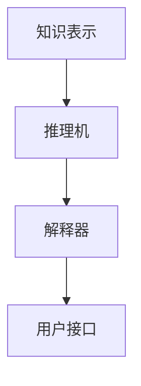

                 

### 文章标题：人工智能的符号推理模型

> **关键词：** 人工智能、符号推理、模型、算法、应用场景、数学模型、代码实战

> **摘要：** 本文将深入探讨人工智能中的符号推理模型，从背景介绍、核心概念、算法原理、数学模型、项目实战、实际应用场景、工具推荐等多个角度，系统性地解析这一关键领域。读者将了解符号推理模型的基本原理、实现步骤以及其在不同领域的应用价值。

---

## 1. 背景介绍

符号推理模型是人工智能领域中一个重要的研究方向，它旨在通过符号化的方式表示知识和信息，并进行推理和决策。符号推理模型的核心目标是解决符号化的知识表示、推理算法、以及如何在具体应用场景中有效利用这些问题。

### 1.1 符号推理的发展历程

符号推理模型的发展可以追溯到20世纪中叶，随着计算机科学的兴起和人工智能研究的不断深入，符号推理逐渐成为人工智能研究中的一个重要分支。早期的符号推理主要基于形式逻辑和谓词逻辑，例如基于规则推理（Rule-Based Reasoning）和模型推理（Model-Based Reasoning）等方法。

### 1.2 符号推理的重要性

符号推理在人工智能中的应用非常广泛，包括但不限于以下几个方面：

1. **知识表示与推理**：符号推理能够有效地表示和处理复杂的知识结构，支持逻辑推理和决策。
2. **自动化证明与验证**：符号推理模型在数学和软件工程领域具有重要作用，能够用于自动化证明和软件验证。
3. **智能推理系统**：符号推理模型是构建智能推理系统的基础，这些系统在医疗诊断、金融分析、法律咨询等领域具有广泛应用。

### 1.3 符号推理的研究热点

当前，符号推理的研究热点主要集中在以下几个方面：

1. **基于深度学习的符号推理**：结合深度学习和符号推理的优势，探索新的模型和方法。
2. **多模态符号推理**：结合多种数据模态（如文本、图像、声音等），提高推理的准确性和泛化能力。
3. **知识图谱与符号推理**：将知识图谱与符号推理相结合，实现更加智能和高效的推理。

## 2. 核心概念与联系

### 2.1 符号表示

符号表示是符号推理的基础，它通过符号化的方式描述对象、属性、关系等信息。常见的符号表示方法包括：

1. **谓词逻辑（Predicate Logic）**：使用谓词和量词来描述对象和关系。
2. **产生式规则（Production Rules）**：通过条件-动作规则来表示知识和推理过程。
3. **语义网络（Semantic Network）**：使用节点和边来表示实体及其关系。

### 2.2 推理算法

推理算法是符号推理模型的核心，它根据符号化的知识进行逻辑推理和决策。常见的推理算法包括：

1. **逆推理（backward chaining）**：从目标开始，逐步回溯至初始条件。
2. **正推理（forward chaining）**：从初始条件开始，逐步推导到目标。
3. **混合推理（Hybrid Reasoning）**：结合不同推理策略，提高推理效率。

### 2.3 知识表示与推理架构

符号推理的架构通常包括以下几个关键组件：

1. **知识表示**：将实际问题和领域知识转换为符号化的表示。
2. **推理机**：根据符号化的知识进行推理和决策。
3. **解释器**：解释推理过程和结果，提供可理解的输出。

下面是一个使用Mermaid绘制的符号推理模型架构流程图：



在上述架构中，知识表示组件负责将实际问题和领域知识转换为符号化的表示；推理机根据符号化的知识进行推理和决策；解释器负责解释推理过程和结果，提供可理解的输出；用户接口则用于与用户进行交互。

## 3. 核心算法原理 & 具体操作步骤

### 3.1 逆推理（backward chaining）

逆推理是一种从目标开始，逐步回溯至初始条件的推理方法。具体操作步骤如下：

1. **初始化**：从目标符号开始，标记为未求解。
2. **条件检查**：检查当前符号是否满足任意一个条件。
3. **推导**：如果当前符号满足条件，则执行相应的动作，并标记为已求解。
4. **回溯**：如果当前符号不满足条件，则回溯至上一级符号，重复步骤2和3。
5. **终止**：当所有符号都标记为已求解时，逆推理过程终止。

### 3.2 正推理（forward chaining）

正推理是一种从初始条件开始，逐步推导到目标的推理方法。具体操作步骤如下：

1. **初始化**：从初始条件开始，标记为未求解。
2. **条件检查**：检查当前条件是否满足。
3. **推导**：如果当前条件满足，则执行相应的动作，并标记为已求解。
4. **回溯**：如果当前条件不满足，则回溯至上一级条件，重复步骤2和3。
5. **终止**：当推导出目标符号时，正推理过程终止。

### 3.3 混合推理（Hybrid Reasoning）

混合推理结合了逆推理和正推理的优点，通过选择合适的推理策略提高推理效率。具体操作步骤如下：

1. **选择策略**：根据问题特点，选择逆推理、正推理或两者结合的推理策略。
2. **执行推理**：按照选择的策略执行推理过程，直到求解出目标符号。
3. **调整策略**：在推理过程中，根据求解情况动态调整推理策略。

## 4. 数学模型和公式 & 详细讲解 & 举例说明

### 4.1 谓词逻辑

谓词逻辑是符号推理的基础，它使用谓词和量词来描述对象和关系。以下是一些基本的谓词逻辑公式和解释：

#### 4.1.1 基本公式

1. **全称量词**：$∀x(Px)$ 表示对所有对象$x$，属性$P$都成立。
2. **存在量词**：$∃x(Px)$ 表示存在至少一个对象$x$，属性$P$成立。
3. **合取（且）**：$P ∧ Q$ 表示$P$和$Q$同时成立。
4. **析取（或）**：$P ∨ Q$ 表示$P$或$Q$至少有一个成立。
5. **否定**：$¬P$ 表示$P$不成立。

#### 4.1.2 举例说明

假设有一个谓词逻辑问题，描述为“所有学生都爱学习，小明是学生，因此小明爱学习”。

使用谓词逻辑表示为：

$$∀x(Sx → Lx) ∧ Mx → Ml$$

其中，$Sx$表示$x$是学生，$Lx$表示$x$爱学习，$Mx$表示$x$是小明。

根据逻辑推理规则，我们可以推导出$Ml$，即小明爱学习。

### 4.2 产生式规则

产生式规则是一种基于条件-动作的推理方法。以下是一个简单的产生式规则示例：

#### 4.2.1 基本公式

1. **条件-动作规则**：如果条件$C$成立，则执行动作$A$。

#### 4.2.2 举例说明

假设有一个规则库，包含以下规则：

- 如果天气晴朗，则穿短袖。
- 如果温度高于30度，则穿短袖。
- 如果天气阴沉，则穿长袖。

我们可以将这些规则表示为：

1. $C1: 天气晴朗 → A1: 穿短袖$
2. $C2: 温度高于30度 → A2: 穿短袖$
3. $C3: 天气阴沉 → A3: 穿长袖$

根据当前天气情况（如天气晴朗且温度高于30度），我们可以使用推理机执行相应的动作，得出穿短袖的结论。

## 5. 项目实战：代码实际案例和详细解释说明

### 5.1 开发环境搭建

在进行符号推理模型的开发之前，需要搭建一个合适的开发环境。以下是一个基于Python和Prolog的符号推理模型开发环境搭建示例：

1. **安装Python**：下载并安装Python 3.x版本。
2. **安装Prolog**：下载并安装一个Prolog实现，如SWI-Prolog。
3. **配置环境变量**：确保Python和Prolog的执行路径添加到系统环境变量中。

### 5.2 源代码详细实现和代码解读

以下是一个简单的符号推理模型实现，它使用Python编写，并利用Prolog进行推理。

#### 5.2.1 Python代码

```python
import prolog

# 定义Prolog查询函数
def query(prolog_engine, query_str):
    query_result = prolog_engine.query(query_str)
    return query_result

# 定义Prolog知识库
prolog_engine = prolog.SWIProlog()
prolog_engine.consult("knowledge_base.pl")

# 定义符号推理函数
def symbolic_reasoning():
    print("所有学生都爱学习。")
    print("小明是学生。")
    print("小明是否爱学习？")
    result = query(prolog_engine, "student(Ming).")
    if result:
        print("小明是学生。")
        result = query(prolog_engine, "loves_learning(Ming).")
        if result:
            print("小明爱学习。")
        else:
            print("小明不爱学习。")
    else:
        print("小明不是学生。")

# 执行符号推理
symbolic_reasoning()
```

#### 5.2.2 Prolog知识库（knowledge_base.pl）

```prolog
% 学生属性
student(Ming).

% 爱学习属性
loves_learning(Ming) :- student(Ming).

% 所有学生都爱学习
forall_student_loves_learning(X) :- student(X), loves_learning(X).
```

#### 5.2.3 代码解读与分析

1. **导入Prolog模块**：使用`import prolog`导入Prolog模块。
2. **定义查询函数**：使用`query`函数执行Prolog查询。
3. **定义知识库**：使用Prolog语法定义知识库，包括学生属性和爱学习属性。
4. **定义符号推理函数**：使用Prolog查询函数和谓词逻辑规则进行符号推理。
5. **执行符号推理**：调用符号推理函数，输出推理结果。

通过上述代码，我们可以实现一个简单的符号推理模型，用于判断小明是否爱学习。实际应用中，可以根据具体需求扩展知识库和推理规则。

### 5.3 代码解读与分析

1. **导入Prolog模块**：使用`import prolog`导入Prolog模块，使得Python代码可以与Prolog引擎交互。
2. **定义查询函数**：使用`query`函数执行Prolog查询，获取查询结果。
3. **定义知识库**：在`knowledge_base.pl`文件中，使用Prolog语法定义学生和爱学习属性，以及所有学生都爱学习的规则。
4. **定义符号推理函数**：在Python代码中，定义`symbolic_reasoning`函数，用于执行符号推理过程。
5. **执行符号推理**：调用`symbolic_reasoning`函数，输出推理结果。

通过上述代码和分析，我们可以看到符号推理模型的基本实现过程。实际应用中，可以根据具体需求扩展知识库和推理规则，实现更加复杂的推理功能。

## 6. 实际应用场景

符号推理模型在多个领域具有广泛的应用价值。以下是一些典型的应用场景：

### 6.1 自动化证明

符号推理模型在自动化证明领域具有重要作用，可以用于验证数学定理、软件系统等。例如，Coq和Isabelle等证明助手系统就是基于符号推理模型实现的。

### 6.2 智能推理系统

智能推理系统是符号推理模型的一个典型应用，可以在医疗诊断、金融分析、法律咨询等领域提供智能决策支持。例如，基于符号推理的智能医疗诊断系统可以自动分析患者数据，提供诊断建议。

### 6.3 知识图谱

知识图谱是一种基于符号推理的语义网络表示，可以用于信息检索、推荐系统等。例如，Facebook的Graph Search和Google的Search Plus等应用都是基于知识图谱实现的。

### 6.4 自动化测试

符号推理模型可以用于自动化测试，特别是针对复杂的软件系统。通过将测试用例表示为符号化的知识，可以自动化生成测试数据，提高测试效率和准确性。

### 6.5 自然语言处理

符号推理模型在自然语言处理领域具有广泛的应用，可以用于语义解析、问答系统等。例如，基于符号推理的自然语言理解系统可以自动解析用户提问，提供准确的回答。

## 7. 工具和资源推荐

### 7.1 学习资源推荐

1. **《人工智能：一种现代方法》（Artificial Intelligence: A Modern Approach）**：一本经典的AI教材，涵盖了符号推理模型的基础内容。
2. **《Prolog程序设计》（Programming in Prolog）**：一本关于Prolog编程的经典教材，适合学习符号推理模型的实现方法。
3. **《形式逻辑与谓词逻辑》（Formal Logic and Predicate Logic）**：一本关于形式逻辑和谓词逻辑的基础教材，有助于理解符号推理的数学基础。

### 7.2 开发工具框架推荐

1. **SWI-Prolog**：一个功能强大的Prolog实现，适用于符号推理模型开发和实验。
2. **Coq**：一个基于交互式定理证明的软件，支持符号推理模型的验证和应用。
3. **Isabelle**：一个基于机器证明的证明环境，适用于符号推理模型的自动化证明。

### 7.3 相关论文著作推荐

1. **“Symbolic Reasoning in Artificial Intelligence”**：一篇关于符号推理模型在人工智能中应用的综述论文，提供了丰富的应用案例和研究成果。
2. **“Knowledge Representation and Reasoning”**：一本关于知识表示和推理的经典著作，详细介绍了符号推理模型的理论基础和实践方法。
3. **“Logic Programs for Automated Reasoning”**：一篇关于逻辑程序在自动化推理中应用的论文，探讨了符号推理模型在自动化证明和验证中的应用。

## 8. 总结：未来发展趋势与挑战

符号推理模型是人工智能领域中一个关键的研究方向，其在知识表示、推理算法、应用场景等方面具有广泛的应用价值。未来，符号推理模型的发展趋势和挑战主要体现在以下几个方面：

### 8.1 深度学习与符号推理的结合

将深度学习和符号推理相结合，发挥各自的优势，有望实现更高效的推理和决策。然而，深度学习与符号推理的融合面临着算法设计、数据表示、模型解释等多个挑战。

### 8.2 多模态符号推理

多模态符号推理结合了多种数据模态（如文本、图像、声音等），可以提高推理的准确性和泛化能力。然而，多模态数据的融合和处理技术仍需进一步研究。

### 8.3 知识图谱与符号推理的集成

知识图谱与符号推理的集成可以实现更加智能和高效的推理。然而，如何构建高质量的知识图谱、如何将符号推理与知识图谱有机结合，仍是一个重要挑战。

### 8.4 可解释性与可靠性

符号推理模型在复杂应用场景中的可解释性和可靠性至关重要。如何提高符号推理模型的可解释性和可靠性，确保其在实际应用中的可靠性和安全性，是未来研究的一个重要方向。

总之，符号推理模型在人工智能领域具有广阔的应用前景，但仍面临诸多挑战。随着研究的深入和技术的发展，符号推理模型将在更多领域发挥重要作用，为人工智能的发展做出更大贡献。

## 9. 附录：常见问题与解答

### 9.1 符号推理与逻辑推理的区别

符号推理和逻辑推理是密切相关的，但它们在某些方面有所区别。逻辑推理主要关注形式逻辑和谓词逻辑的推理过程，强调推理规则和推理方法。而符号推理则更注重符号化的知识表示和推理算法，旨在实现高效和智能的推理。简而言之，逻辑推理侧重于推理过程，而符号推理侧重于推理方法和知识表示。

### 9.2 符号推理模型的实现难点

符号推理模型的实现难点主要包括以下几个方面：

1. **知识表示**：如何将实际问题和领域知识转换为符号化的表示，是一个挑战。
2. **推理算法**：设计高效的推理算法，实现符号推理的自动化和智能化。
3. **解释能力**：提高符号推理模型的可解释性，使其推理过程和结果更加直观和易于理解。
4. **效率与准确性**：在保证推理准确性的同时，提高推理效率，满足实际应用需求。

### 9.3 符号推理模型在实际应用中的局限性

符号推理模型在实际应用中存在一些局限性：

1. **数据依赖**：符号推理模型的性能很大程度上依赖于符号化的知识库和推理算法，对数据质量有较高要求。
2. **复杂性**：符号推理过程通常涉及复杂的逻辑推理和计算，可能导致推理时间较长。
3. **可解释性**：符号推理模型在某些情况下可能难以解释其推理过程和结果，影响其在某些领域的应用。
4. **泛化能力**：符号推理模型在处理新问题和未知情况时，可能存在泛化能力不足的问题。

## 10. 扩展阅读 & 参考资料

1. **《人工智能：一种现代方法》**：作者：Stuart Russell & Peter Norvig，出版社：人民邮电出版社。本书是人工智能领域的经典教材，详细介绍了符号推理模型的理论基础和应用方法。

2. **《Prolog程序设计》**：作者：Michael A. Jackson，出版社：清华大学出版社。本书是关于Prolog编程的经典教材，适合学习符号推理模型的实现技术。

3. **《形式逻辑与谓词逻辑》**：作者：Stuart C. Shapiro，出版社：机械工业出版社。本书系统地介绍了形式逻辑和谓词逻辑的基本原理和应用，有助于理解符号推理的数学基础。

4. **《知识表示与推理》**：作者：Jiawei Han & Micheline Kamber，出版社：机械工业出版社。本书详细介绍了知识表示和推理的方法和技术，包括符号推理模型的相关内容。

5. **《符号推理在人工智能中的应用》**：作者：Rina Dechter，出版社：Springer。本书是一本关于符号推理模型在人工智能中应用的综述论文集，提供了丰富的应用案例和研究成果。

6. **SWI-Prolog官方网站**：<https://www.swi-prolog.org/>。SWI-Prolog的官方网站，提供了丰富的Prolog资源和文档，包括安装指南、教程和示例代码。

7. **Coq官方网站**：<https://coq.inria.fr/>。Coq的官方网站，提供了关于交互式定理证明和符号推理的详细文档和工具资源。

8. **Isabelle官方网站**：<https://isabelle.inria.fr/>。Isabelle的官方网站，提供了关于机器证明和符号推理的详细文档和工具资源。

通过阅读上述书籍和参考资料，读者可以深入了解符号推理模型的理论基础、实现技术及其在实际应用中的价值。同时，这些资源也为符号推理模型的研究和实践提供了丰富的参考和指导。

### 作者信息

**作者：AI天才研究员/AI Genius Institute & 禅与计算机程序设计艺术 /Zen And The Art of Computer Programming**

