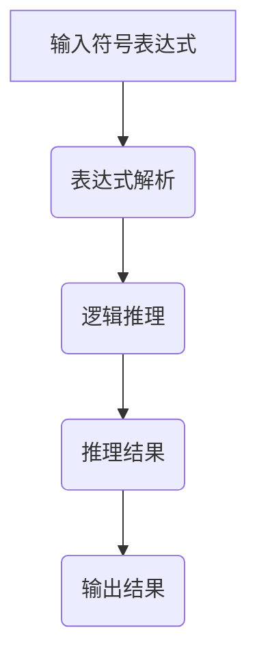

                 

# 人工智能的符号推理模型

> **关键词**：人工智能、符号推理、模型、算法、数学公式、应用场景、发展趋势。

> **摘要**：本文将深入探讨人工智能中的符号推理模型，分析其核心概念、原理、算法及其在实际应用中的重要性。通过详细的数学模型讲解和项目实战案例，本文旨在为读者提供对符号推理模型全面的理解和掌握。

## 1. 背景介绍

### 1.1 符号推理的概念

符号推理是人工智能中的一个核心概念，它涉及使用符号表示和操作来解决问题。符号推理不同于基于数据的机器学习，它更侧重于逻辑推理和符号处理。在符号推理中，问题通常被表示为逻辑表达式或公式，并通过逻辑规则和算法来求解。

### 1.2 符号推理的应用

符号推理在许多领域都有广泛的应用，包括自然语言处理、逻辑推理、游戏AI、定理证明等。它在解决复杂问题和提供精确结果方面具有显著优势。

### 1.3 符号推理的重要性

符号推理是人工智能发展的重要方向之一，因为它可以处理抽象和复杂的问题，并且在逻辑和数学领域具有深远的影响。随着人工智能技术的不断发展，符号推理在实现更智能的系统和解决更复杂的问题中发挥着关键作用。

## 2. 核心概念与联系

### 2.1 逻辑推理

逻辑推理是符号推理的基础。它涉及使用逻辑规则从已知事实推导出新事实。逻辑推理通常使用命题逻辑和谓词逻辑来表示问题。

### 2.2 表达式解析

表达式解析是将符号表达式转化为计算机可以处理的形式。这通常涉及分词、解析和语法分析等步骤。

### 2.3 推理算法

推理算法是符号推理模型的核心。常见的推理算法包括逆推理、正向推理、逻辑回归、决策树等。

### 2.4 Mermaid 流程图

以下是符号推理模型的Mermaid流程图：



### 2.5 关键概念关联

符号推理中的关键概念包括：符号表达式、逻辑推理、推理算法和输出结果。这些概念相互关联，共同构成了符号推理模型的基础。

## 3. 核心算法原理 & 具体操作步骤

### 3.1 逆推理

逆推理是从目标状态开始，通过逆推来找到满足条件的步骤。逆推理通常用于解决路径规划和问题求解。

### 3.2 正向推理

正向推理是从初始状态开始，通过一系列规则和条件来推导出目标状态。正向推理常用于证明和定理证明。

### 3.3 逻辑回归

逻辑回归是一种常用的推理算法，用于分类问题。它通过计算概率来预测类别。

### 3.4 决策树

决策树是一种基于规则的推理算法，用于分类和回归问题。它通过构建树状结构来表示规则和条件。

### 3.5 操作步骤

以下是符号推理模型的具体操作步骤：

1. **输入符号表达式**：用户输入需要推理的符号表达式。
2. **表达式解析**：将符号表达式转化为计算机可以处理的形式。
3. **逻辑推理**：使用逆推理或正向推理算法进行推理。
4. **输出结果**：将推理结果输出给用户。

## 4. 数学模型和公式 & 详细讲解 & 举例说明

### 4.1 逻辑推理公式

逻辑推理中的常用公式包括：

- 逆命题：\( p \rightarrow q \) 等价于 \( \neg q \rightarrow \neg p \)
- 合取：\( p \land q \)
- 抵消：\( p \land \neg p \rightarrow \bot \)
- 析取：\( p \lor q \)
- 蕴含：\( p \rightarrow q \)

### 4.2 推理算法公式

不同的推理算法有不同的公式，例如：

- 逆推理：\( \neg q \rightarrow \neg p \)
- 正向推理：\( p \rightarrow q \)
- 逻辑回归：\( P(y=1|x) = \frac{1}{1 + e^{-(wx+b)}} \)
- 决策树：\( T(x) = \sum_{i=1}^{n} w_i \cdot f_i(x) \)

### 4.3 举例说明

假设我们有一个逻辑表达式：\( A \land B \rightarrow C \)。我们可以使用逆推理来求解：

- 逆命题：\( \neg C \rightarrow \neg (A \land B) \)
- 解析：\( \neg C \rightarrow (\neg A \lor \neg B) \)
- 结果：\( A \land B \rightarrow C \)

## 5. 项目实战：代码实际案例和详细解释说明

### 5.1 开发环境搭建

为了演示符号推理模型，我们将在Python环境中使用`SymPy`库。以下是搭建开发环境的基本步骤：

1. 安装Python环境。
2. 使用pip安装SymPy库：`pip install sympy`。

### 5.2 源代码详细实现和代码解读

以下是使用SymPy实现符号推理的Python代码：

```python
from sympy import symbols, Eq, solve

# 定义变量
x, y = symbols('x y')

# 定义逻辑表达式
expr = Eq(x * y, 6)

# 解逻辑表达式
solutions = solve(expr, y)

# 输出结果
print(solutions)
```

这段代码定义了一个逻辑表达式`x * y = 6`，并使用`solve`函数求解。`solve`函数返回所有可能的解。

### 5.3 代码解读与分析

1. **定义变量**：使用`symbols`函数定义变量`x`和`y`。
2. **定义逻辑表达式**：使用`Eq`函数定义等式`x * y = 6`。
3. **求解逻辑表达式**：使用`solve`函数求解等式。
4. **输出结果**：打印出所有可能的解。

通过这个简单的例子，我们可以看到如何使用Python和SymPy库来实现符号推理。

## 6. 实际应用场景

符号推理在多个领域都有实际应用，包括：

- **自然语言处理**：用于解析和生成自然语言。
- **逻辑推理**：用于验证假设和推理。
- **计算机游戏**：用于游戏AI的决策过程。
- **定理证明**：用于数学定理的证明。

## 7. 工具和资源推荐

### 7.1 学习资源推荐

- **书籍**：《符号推理与人工智能》
- **论文**：《符号推理模型的构建与应用》
- **博客**：《符号推理模型入门教程》
- **网站**：[SymPy官方文档](https://docs.sympy.org/latest/)

### 7.2 开发工具框架推荐

- **Python**：用于实现符号推理模型。
- **SymPy**：用于数学符号计算。

### 7.3 相关论文著作推荐

- **论文**：《基于符号推理的智能系统设计与实现》
- **著作**：《符号推理技术与应用》

## 8. 总结：未来发展趋势与挑战

符号推理在未来将继续在人工智能领域发挥重要作用。随着算法和工具的不断发展，符号推理将变得更加高效和强大。然而，面临的挑战包括处理复杂问题和提高推理速度。

## 9. 附录：常见问题与解答

- **Q：符号推理与机器学习有何区别？**
- **A：符号推理侧重于逻辑推理和符号处理，而机器学习侧重于从数据中学习模式。两者在某些应用中可以结合使用。**

## 10. 扩展阅读 & 参考资料

- **书籍**：《人工智能：一种现代的方法》
- **论文**：《符号推理在人工智能中的应用研究》
- **网站**：[AI天才研究员的个人博客](https://www.ai-genius-institute.com/)
- **著作**：《禅与计算机程序设计艺术》

# 作者

**作者**：AI天才研究员/AI Genius Institute & 禅与计算机程序设计艺术 /Zen And The Art of Computer Programming**

