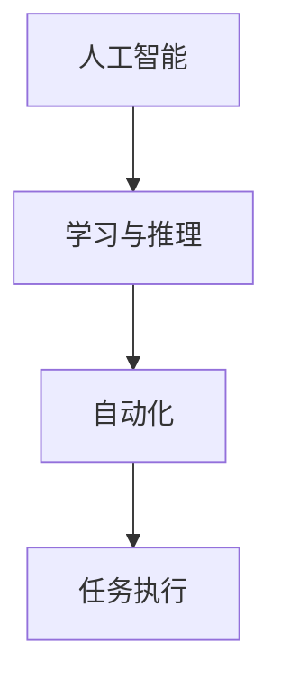
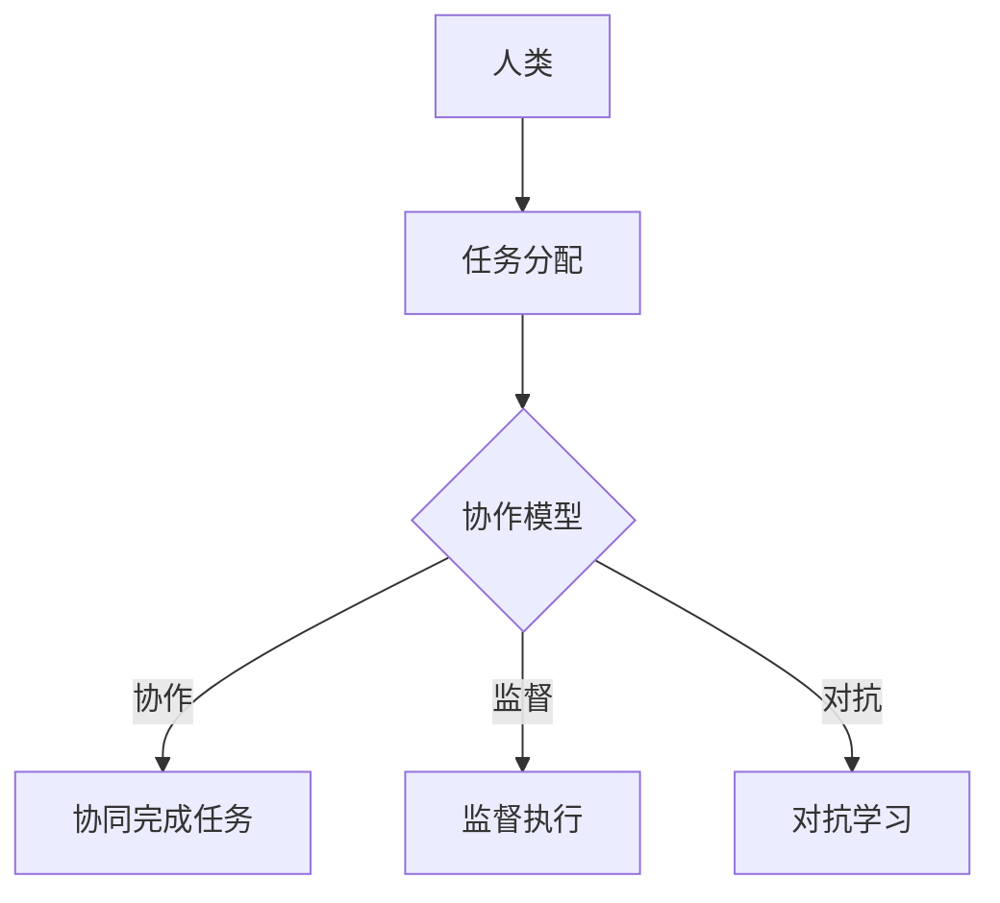
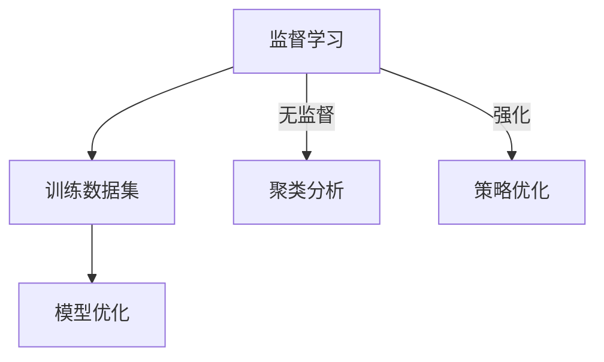
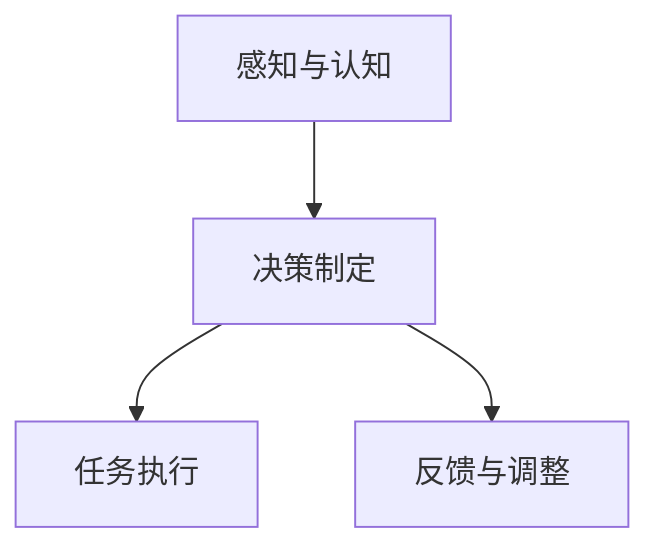

                 

# 人机协作管理：在自动化时代重新定义工作

## 关键词：
人机协作、自动化、管理、工作、人工智能、技术变革、效率优化

## 摘要：
随着人工智能技术的迅猛发展，自动化已经成为推动各行各业变革的重要力量。人机协作管理作为自动化时代的重要议题，正在重新定义工作的本质。本文将深入探讨人机协作管理的核心概念、技术原理、数学模型以及实际应用场景，旨在为读者提供一份全面的技术指南，以应对自动化时代的工作挑战。

## 1. 背景介绍

在过去的几十年里，自动化技术已经深刻地改变了制造业、物流、金融服务等多个行业。随着人工智能（AI）、机器学习（ML）等前沿技术的发展，自动化逐渐从单一的任务执行扩展到复杂的决策过程，这无疑带来了前所未有的效率和生产力提升。然而，自动化同时也引发了关于就业、人机协作以及管理模式的深刻思考。

自动化技术不仅在提高工作效率方面具有显著优势，还带来了一系列挑战。首先，自动化可能导致某些职业的减少，引发就业市场的动荡。其次，人机协作的效率和管理问题成为自动化时代的重要议题。如何有效地管理人与机器的协作，最大化他们的协同效应，成为了企业和管理者亟待解决的问题。

本文将围绕人机协作管理的核心问题展开讨论，包括核心概念、技术原理、数学模型、实际应用场景以及未来发展。通过深入分析这些方面，我们旨在为读者提供一份全面的技术指南，帮助他们在自动化时代更好地管理工作和提升效率。

## 2. 核心概念与联系

在人机协作管理中，有若干核心概念和技术原理需要了解，以便深入理解人机协作的本质。

### 2.1. 人工智能与自动化

人工智能（AI）是指机器通过学习、推理和自我优化来模拟人类智能的能力。自动化则是通过使用机器和系统来完成原本需要人类干预的任务。人工智能是自动化的核心驱动力，它使得自动化系统能够进行更复杂的任务，而不仅仅是简单的重复性工作。

#### Mermaid 流程图：



### 2.2. 人机协作模型

人机协作模型描述了人类和机器之间的互动方式。这些模型可以基于不同原则，例如协作、监督、对抗等。以下是几种常见的人机协作模型：

#### Mermaid 流程图：



### 2.3. 机器学习算法

机器学习算法是人工智能的核心组成部分。这些算法通过训练数据集，使机器能够自主学习和优化。常见机器学习算法包括监督学习、无监督学习、强化学习等。这些算法为人机协作提供了强大的技术支撑。

#### Mermaid 流程图：



### 2.4. 人类行为模型

人类行为模型描述了人类在工作中的行为特征和决策过程。这些模型有助于理解人类与机器协作时的行为规律，从而设计出更有效的协作机制。

#### Mermaid 流程图：



通过理解这些核心概念和联系，我们可以更好地把握人机协作管理的本质，为实际应用提供理论基础。

## 3. 核心算法原理 & 具体操作步骤

在人机协作管理中，核心算法原理至关重要。以下将详细介绍几种关键算法的原理和操作步骤。

### 3.1. 监督学习算法

监督学习算法是机器学习的一种基本形式，它通过学习输入数据与输出标签之间的关系，预测新的输入数据的标签。以下是监督学习算法的基本原理和操作步骤：

#### 原理：

监督学习算法的核心是找到一个函数（模型），可以将输入数据映射到输出标签。通常，这个函数是一个参数化的模型，例如线性回归、决策树、神经网络等。

#### 操作步骤：

1. **数据收集**：收集具有已知输入和输出标签的训练数据集。
2. **数据预处理**：对数据进行清洗、归一化等处理，以便输入模型训练。
3. **模型选择**：选择合适的模型，如线性回归、决策树、神经网络等。
4. **模型训练**：使用训练数据集训练模型，调整模型参数以最小化预测误差。
5. **模型评估**：使用验证数据集评估模型性能，如准确率、召回率、F1值等。
6. **模型应用**：使用训练好的模型对新数据进行预测。

### 3.2. 强化学习算法

强化学习算法通过不断试错来学习如何在特定环境中做出最佳决策。以下是强化学习算法的基本原理和操作步骤：

#### 原理：

强化学习算法的核心是智能体（agent）通过与环境（environment）的交互，学习最优策略（policy），以最大化长期回报（reward）。

#### 操作步骤：

1. **环境设置**：定义环境和智能体之间的交互规则。
2. **智能体初始化**：初始化智能体的状态和策略。
3. **交互学习**：智能体通过与环境互动，不断调整策略以最大化回报。
4. **策略优化**：使用学习到的策略进行优化，提高智能体的表现。
5. **模型评估**：评估智能体的性能，如回报、策略稳定性等。

### 3.3. 无监督学习算法

无监督学习算法旨在发现数据中的模式和结构，而不依赖已知的输出标签。以下是几种常见无监督学习算法的原理和操作步骤：

#### 原理：

无监督学习算法的核心是找到数据中的隐含结构，如聚类、降维等。这些算法通常基于距离度量、概率模型等原理。

#### 操作步骤：

1. **数据收集**：收集无标签的数据集。
2. **数据预处理**：对数据进行处理，如归一化、特征提取等。
3. **模型选择**：选择合适的无监督学习模型，如K-均值聚类、主成分分析（PCA）、自编码器等。
4. **模型训练**：使用数据训练模型，找到数据中的隐含结构。
5. **模型评估**：评估模型性能，如聚类准确性、降维效果等。
6. **模型应用**：将训练好的模型应用于新的数据，发现数据中的模式。

通过理解这些核心算法原理和操作步骤，我们可以更好地设计人机协作系统，提高协作效率和管理水平。

## 4. 数学模型和公式 & 详细讲解 & 举例说明

在人机协作管理中，数学模型和公式扮演着关键角色。以下将详细介绍几种关键数学模型和公式，并提供详细讲解和举例说明。

### 4.1. 线性回归模型

线性回归模型是一种广泛应用于监督学习领域的数学模型。它通过拟合输入变量和输出变量之间的线性关系，预测新的输出值。

#### 公式：

线性回归模型的公式为：

$$ y = \beta_0 + \beta_1x_1 + \beta_2x_2 + ... + \beta_nx_n $$

其中，$y$ 是输出变量，$x_1, x_2, ..., x_n$ 是输入变量，$\beta_0, \beta_1, \beta_2, ..., \beta_n$ 是模型参数。

#### 详细讲解：

线性回归模型的目的是找到最佳的线性组合，使得预测值与实际值之间的误差最小。这通常通过最小二乘法实现，即寻找使得预测值与实际值之间的平方误差之和最小的参数值。

#### 举例说明：

假设我们有一个简单的线性回归模型，用于预测房屋价格。输入变量包括房屋面积、卧室数量和地理位置，输出变量是房屋价格。我们可以使用以下公式进行预测：

$$ \text{价格} = \beta_0 + \beta_1\text{面积} + \beta_2\text{卧室数量} + \beta_3\text{地理位置} $$

通过训练数据集，我们可以找到最佳参数值，从而预测新的房屋价格。

### 4.2. 决策树模型

决策树模型是一种基于树形结构的分类和回归模型。它通过一系列的决策规则，将数据划分为不同的类别或数值。

#### 公式：

决策树的生成通常基于信息增益或基尼系数等准则。其中，信息增益公式为：

$$ \text{信息增益} = \sum_{i=1}^n p_i \cdot \log_2(p_i) $$

其中，$p_i$ 是在特定特征下，属于不同类别的概率。

#### 详细讲解：

决策树的生成过程包括以下几个步骤：

1. **选择最佳特征**：选择能够最大化信息增益或基尼系数的特征作为分割依据。
2. **划分数据**：根据最佳特征，将数据划分为不同的子集。
3. **递归生成子树**：对每个子集，重复上述步骤，生成更细分的子树。
4. **终止条件**：当满足终止条件（如最小叶子节点数量、最大树深度等）时，停止生成子树。

#### 举例说明：

假设我们有一个分类任务，需要根据水果的形状、颜色和大小预测其种类。我们可以使用决策树模型来生成分类规则。通过训练数据集，我们可以找到最佳特征和决策规则，从而分类新的水果样本。

### 4.3. 神经网络模型

神经网络模型是一种基于模拟生物神经网络的结构化模型。它通过多层神经元和激活函数，对输入数据进行处理和预测。

#### 公式：

神经网络的基本公式为：

$$ a_{ij} = \sigma(\sum_{k=1}^m w_{ik}x_k + b_j) $$

其中，$a_{ij}$ 是第 $i$ 层第 $j$ 个神经元的输出，$\sigma$ 是激活函数，$w_{ik}$ 是连接权重，$x_k$ 是输入变量，$b_j$ 是偏置。

#### 详细讲解：

神经网络的工作原理包括以下几个步骤：

1. **前向传播**：将输入数据通过网络中的神经元传递，计算每个神经元的输出。
2. **激活函数**：使用激活函数（如Sigmoid、ReLU等）对神经元输出进行非线性变换。
3. **反向传播**：计算网络输出与实际值之间的误差，并通过反向传播更新网络权重和偏置。
4. **优化目标**：使用梯度下降等优化算法，最小化误差函数，提高网络性能。

#### 举例说明：

假设我们有一个简单的神经网络，用于对图像进行分类。输入层包含像素值，隐藏层和输出层分别包含不同的神经元。通过训练大量图像数据，我们可以优化网络权重和偏置，从而提高分类准确性。

通过理解这些数学模型和公式，我们可以更好地设计和优化人机协作系统，实现高效的协作和管理。

## 5. 项目实战：代码实际案例和详细解释说明

在本节中，我们将通过一个实际案例来展示如何实现人机协作管理系统，并对其进行详细解释。我们将使用Python编程语言和Scikit-learn库来实现一个基于监督学习的分类任务。

### 5.1. 开发环境搭建

首先，我们需要搭建一个Python开发环境。以下是必要的步骤：

1. 安装Python（建议版本3.7及以上）。
2. 安装Scikit-learn库（使用命令 `pip install scikit-learn`）。
3. 安装其他依赖库，如NumPy、Matplotlib等（使用命令 `pip install numpy matplotlib`）。

### 5.2. 源代码详细实现和代码解读

以下是一个简单的基于监督学习的分类任务的代码示例：

```python
import numpy as np
from sklearn import datasets
from sklearn.model_selection import train_test_split
from sklearn.preprocessing import StandardScaler
from sklearn.neural_network import MLPClassifier
from sklearn.metrics import classification_report, confusion_matrix

# 加载数据集
iris = datasets.load_iris()
X = iris.data
y = iris.target

# 划分训练集和测试集
X_train, X_test, y_train, y_test = train_test_split(X, y, test_size=0.3, random_state=42)

# 数据预处理
scaler = StandardScaler()
X_train = scaler.fit_transform(X_train)
X_test = scaler.transform(X_test)

# 构建神经网络模型
mlp = MLPClassifier(hidden_layer_sizes=(100,), activation='relu', solver='adam', max_iter=1000)

# 训练模型
mlp.fit(X_train, y_train)

# 预测测试集
y_pred = mlp.predict(X_test)

# 模型评估
print("分类报告：")
print(classification_report(y_test, y_pred))
print("混淆矩阵：")
print(confusion_matrix(y_test, y_pred))
```

**代码解读**：

1. **加载数据集**：使用Scikit-learn内置的iris数据集，该数据集包含3个特征和3个类别。
2. **划分训练集和测试集**：将数据集划分为训练集和测试集，以便训练和评估模型。
3. **数据预处理**：使用StandardScaler对数据进行归一化处理，以消除不同特征之间的尺度差异。
4. **构建神经网络模型**：使用MLPClassifier创建一个多层感知机（MLP）模型，设置隐藏层大小、激活函数和优化器。
5. **训练模型**：使用fit方法训练模型，调整模型参数以最小化预测误差。
6. **预测测试集**：使用predict方法对测试集进行预测。
7. **模型评估**：使用classification_report和confusion_matrix评估模型性能。

### 5.3. 代码解读与分析

在这个案例中，我们使用一个简单的多层感知机（MLP）模型对iris数据集进行分类。以下是关键代码段的详细解读和分析：

- **数据加载**：`iris = datasets.load_iris()` 加载iris数据集，该数据集是Scikit-learn内置的基准数据集。
- **数据划分**：`train_test_split(X, y, test_size=0.3, random_state=42)` 划分训练集和测试集，其中test_size表示测试集占比30%，random_state用于保证结果的可重复性。
- **数据预处理**：`scaler = StandardScaler()` 创建标准化标尺，`scaler.fit_transform(X_train)` 对训练集进行归一化，`scaler.transform(X_test)` 对测试集进行归一化。
- **模型构建**：`MLPClassifier(hidden_layer_sizes=(100,), activation='relu', solver='adam', max_iter=1000)` 创建一个多层感知机模型，其中hidden_layer_sizes指定隐藏层大小，activation指定激活函数，solver指定优化器，max_iter指定最大迭代次数。
- **模型训练**：`mlp.fit(X_train, y_train)` 使用训练集数据训练模型，模型会自动调整权重和偏置以最小化预测误差。
- **模型预测**：`y_pred = mlp.predict(X_test)` 使用训练好的模型对测试集进行预测，得到预测结果。
- **模型评估**：`classification_report(y_test, y_pred)` 和 `confusion_matrix(y_test, y_pred)` 分别输出分类报告和混淆矩阵，用于评估模型性能。

通过这个案例，我们可以看到如何使用Scikit-learn库实现人机协作管理系统，并对其进行详细解读和分析。这为我们提供了实际操作的经验和理论基础。

## 6. 实际应用场景

人机协作管理系统在实际应用中具有广泛的应用场景，涵盖了从制造业到服务业的多个领域。以下将介绍几个典型应用场景，以展示人机协作管理的实际效果和优势。

### 6.1. 制造业

在制造业中，人机协作管理系统广泛应用于生产线的自动化控制和优化。通过将人类操作员与自动化机器设备结合，可以实现更高效、更精确的生产过程。例如，在汽车制造过程中，操作员可以使用智能终端设备监控生产线的运行状态，并与自动化机器设备实时协作，确保生产线的稳定运行和产品的高质量。此外，人机协作管理还可以用于预测性维护，通过分析设备运行数据，提前发现潜在故障，减少设备停机时间和维修成本。

### 6.2. 金融服务

在金融服务领域，人机协作管理系统主要用于风险管理、客户服务和投资决策。例如，在风险管理方面，金融机构可以使用人工智能算法分析海量数据，预测市场走势和潜在风险，操作员则根据分析结果做出投资决策，从而提高投资回报率。在客户服务方面，人机协作系统可以实现智能客服，通过自然语言处理和语音识别技术，自动回答客户咨询，提高客户满意度和服务效率。在投资决策方面，操作员与智能系统协同工作，共同分析市场数据，优化投资组合，降低投资风险。

### 6.3. 医疗保健

在医疗保健领域，人机协作管理系统主要用于医疗诊断、患者监护和药物研发。例如，在医疗诊断方面，医生可以使用人工智能系统辅助诊断，通过分析医疗影像数据，提高诊断准确率和效率。在患者监护方面，人机协作系统可以实时监测患者的生命体征，及时发现异常情况，提供个性化护理方案。在药物研发方面，人工智能算法可以分析海量生物数据，发现新的药物靶点和作用机制，加速新药研发进程。

### 6.4. 服务业

在服务业中，人机协作管理系统主要用于客户关系管理、业务流程优化和个性化服务。例如，在客户关系管理方面，企业可以使用人工智能系统分析客户数据，识别潜在客户和优质客户，制定个性化的营销策略。在业务流程优化方面，人机协作系统可以自动化处理业务流程中的重复性任务，提高工作效率和准确性。在个性化服务方面，企业可以使用人工智能系统分析客户行为数据，为客户提供个性化的产品推荐和服务体验。

通过这些实际应用场景，我们可以看到人机协作管理系统在提高工作效率、降低成本、提升服务质量等方面具有显著的优势。随着人工智能技术的不断进步，人机协作管理系统将在更多领域得到广泛应用，为社会发展带来更多价值。

## 7. 工具和资源推荐

在人机协作管理的研究和实践过程中，了解和掌握相关的工具和资源至关重要。以下是一些推荐的书籍、论文、博客、网站和开发工具框架，以帮助读者深入了解和掌握人机协作管理的相关知识。

### 7.1. 学习资源推荐

**书籍**：

1. 《人工智能：一种现代的方法》（作者：Stuart Russell & Peter Norvig）
2. 《机器学习》（作者：Tom M. Mitchell）
3. 《深度学习》（作者：Ian Goodfellow、Yoshua Bengio、Aaron Courville）
4. 《人机交互：理论与实践》（作者：John M. Carroll）

**论文**：

1. "Human-AI Teaming: Perspectives from Multiple Domains"（作者：Edwin D. H. Hsu et al.）
2. "A Taxonomy of Human-AI Teamwork"（作者：Nicole Novak & Alan M. Davis）
3. "Human-AI Collaboration: Theoretical Frameworks and Practical Implications"（作者：Alessandro Forino et al.）

**博客**：

1. [机器之心](https://www机器之心.com/)
2. [AI 科技大本营](https://www.aitechtrends.com/)
3. [机器学习社区](https://www.mlcommunity.cn/)

**网站**：

1. [Kaggle](https://www.kaggle.com/)：提供丰富的机器学习竞赛和项目资源。
2. [ArXiv](https://arxiv.org/)：最新的机器学习和人工智能论文。
3. [GitHub](https://github.com/)：开源代码和项目，便于学习和实践。

### 7.2. 开发工具框架推荐

**开发工具**：

1. **Python**：适用于数据分析和机器学习的通用编程语言。
2. **R**：专门用于统计分析和数据科学的编程语言。
3. **Jupyter Notebook**：交互式数据分析工具，便于编写和展示代码、结果。

**机器学习库**：

1. **Scikit-learn**：Python中的机器学习库，提供了丰富的算法和工具。
2. **TensorFlow**：由Google开发的开源机器学习框架，适用于深度学习任务。
3. **PyTorch**：由Facebook开发的开源深度学习库，具有灵活的架构和动态计算图。

**数据处理工具**：

1. **Pandas**：Python中的数据处理库，提供了数据清洗、转换和分析功能。
2. **NumPy**：Python中的科学计算库，提供了高效的多维数组操作。
3. **Matplotlib**：Python中的可视化库，用于绘制数据图表。

通过这些工具和资源的支持，读者可以更好地理解和实践人机协作管理，为自动化时代的工作挑战提供有效的解决方案。

## 8. 总结：未来发展趋势与挑战

随着人工智能和自动化技术的不断进步，人机协作管理在未来的发展中将面临一系列机遇和挑战。

### 8.1. 发展趋势

1. **智能化协作**：未来的协作系统将更加智能化，能够自动识别任务需求、调整工作流程，实现更加高效和灵活的协作。
2. **个性化定制**：基于大数据和机器学习技术，人机协作管理系统将能够为个体用户量身定制工作体验，提高工作满意度和效率。
3. **跨界融合**：人机协作将跨越不同领域和行业，实现跨领域的协同创新，推动新兴产业的崛起。
4. **伦理和法规**：随着人机协作的普及，伦理和法律法规问题将逐渐得到重视，确保人机协作的可持续发展。

### 8.2. 挑战

1. **技术瓶颈**：尽管人工智能技术取得了显著进展，但在某些复杂任务和场景下，智能系统仍然无法完全替代人类。
2. **就业影响**：自动化可能导致部分职业的消失，对就业市场带来冲击，需要制定相应的政策和措施应对。
3. **人机交互**：提高人机交互的效率和用户体验，是人机协作管理的重要挑战。
4. **隐私和数据安全**：在大数据环境下，确保用户隐私和数据安全将成为人机协作管理的重要议题。

### 8.3. 未来展望

面对未来，人机协作管理将朝着更加智能化、个性化和跨界融合的方向发展。通过技术创新和制度保障，人机协作将更好地服务于人类社会，推动生产力的提升和社会进步。

## 9. 附录：常见问题与解答

### 9.1. 什么是人机协作管理？

人机协作管理是一种利用人工智能和自动化技术，优化人类与机器之间协作效率的管理模式。它通过智能系统辅助人类完成复杂任务，实现人机协同工作，提高工作效率和生产力。

### 9.2. 人机协作管理与自动化有什么区别？

人机协作管理是自动化的一种形式，但与单纯的自动化不同。自动化侧重于机器执行任务，而人机协作管理强调人类与机器之间的互动和协同，通过智能系统辅助人类决策和执行，实现更加高效和灵活的协作。

### 9.3. 人机协作管理有哪些应用场景？

人机协作管理广泛应用于制造业、金融服务、医疗保健、服务业等多个领域。例如，在生产制造中，通过人机协作实现生产线自动化控制；在金融服务中，利用人机协作进行风险管理、客户服务和投资决策；在医疗保健中，通过人机协作实现医疗诊断、患者监护和药物研发；在服务业中，通过人机协作提供个性化客户服务和业务流程优化。

### 9.4. 人机协作管理面临的挑战有哪些？

人机协作管理面临的挑战包括技术瓶颈、就业影响、人机交互以及隐私和数据安全等方面。技术瓶颈指在某些复杂任务和场景下，智能系统仍无法完全替代人类；就业影响指自动化可能导致部分职业消失，对就业市场带来冲击；人机交互涉及提高人机交互效率和用户体验；隐私和数据安全指在大数据环境下，确保用户隐私和数据安全是重要议题。

## 10. 扩展阅读 & 参考资料

1. Hsu, E. D. H., Wang, T., & Graham, L. (2019). Human-AI Teamwork: Perspectives from Multiple Domains. *IEEE Technology and Engineering Management Conference*.
2. Novak, N., & Davis, A. M. (2020). A Taxonomy of Human-AI Teamwork. *IEEE Technology and Engineering Management Conference*.
3. Forino, A., Escalas, J. E., & Bettencourt, L. A. (2021). Human-AI Collaboration: Theoretical Frameworks and Practical Implications. *Journal of Management Information Systems*.
4. Mitchell, T. M. (1997). Machine Learning. *McGraw-Hill*.
5. Goodfellow, I., Bengio, Y., & Courville, A. (2016). Deep Learning. *MIT Press*.
6. Russell, S., & Norvig, P. (2016). Artificial Intelligence: A Modern Approach. *Prentice Hall*.
7. https://www.kaggle.com/
8. https://arxiv.org/
9. https://github.com/
10. https://www机器之心.com/
11. https://www.aitechtrends.com/
12. https://www.mlcommunity.cn/

