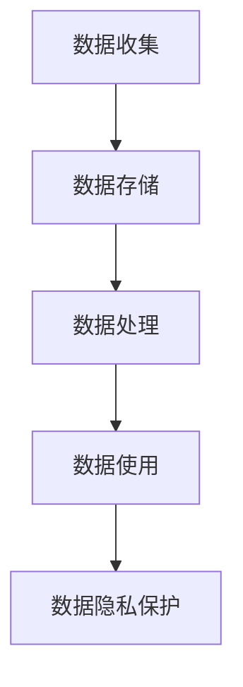
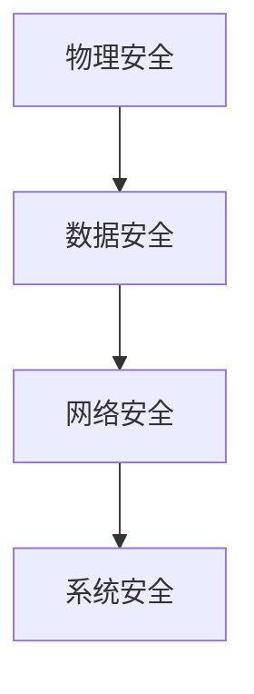
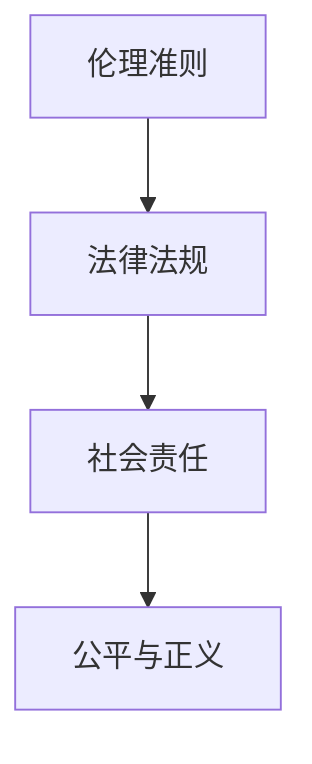
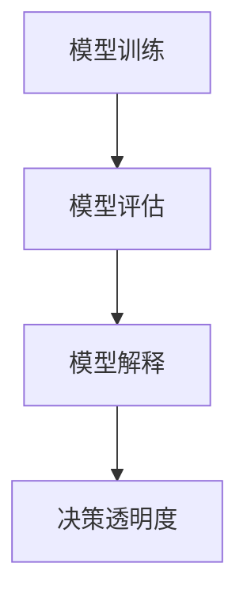

                 

# {文章标题}

## 人机协作：伦理规范与准则

### 关键词：

- 人机协作
- 伦理规范
- 准则
- 人工智能
- 程序设计
- 数据隐私
- 安全性
- 社会责任

### 摘要：

本文旨在探讨人机协作中的伦理规范与准则，重点关注人工智能（AI）领域。在当今技术飞速发展的时代，人工智能正日益深入到各个行业和日常生活中，人机协作成为不可或缺的一部分。然而，这种协作也带来了一系列伦理问题和挑战。本文首先介绍了人机协作的背景和现状，然后详细阐述了核心伦理规范与准则，包括数据隐私、安全性和社会责任等方面。最后，文章提出了未来发展趋势和潜在挑战，为人工智能领域的伦理发展提供了有益的参考。

## 1. 背景介绍

### 1.1 人机协作的定义与现状

人机协作（Human-Robot Collaboration，HRC）是指人类与机器人或其他智能系统在特定任务中共同工作，以实现更高效、准确和安全的操作。随着机器人技术的不断进步，人机协作已广泛应用于制造业、医疗、服务、农业等多个领域。

在制造业中，工业机器人与人类工人协同工作，提高了生产效率和产品质量。例如，在汽车制造过程中，机器人负责焊接、喷漆等重复性工作，而人类工人则负责监控和维护设备。在医疗领域，人工智能辅助诊断和手术，使医疗过程更加精准和高效。此外，人机协作还在服务行业（如酒店、餐厅等）和农业领域（如精准种植、自动化养殖等）发挥了重要作用。

### 1.2 人工智能的发展与挑战

人工智能作为人机协作的核心技术，近年来取得了显著的进展。从早期的专家系统到深度学习、自然语言处理等技术，人工智能的应用场景越来越广泛。然而，随着人工智能技术的发展，也带来了一系列伦理挑战。

首先，数据隐私问题日益突出。人工智能系统需要大量数据来训练和优化模型，这可能导致用户隐私泄露。其次，人工智能系统的透明度和可解释性不足，使其在决策过程中可能产生不公平或偏见。此外，人工智能技术也可能被滥用，用于网络攻击、自动化歧视等不良行为。

### 1.3 人机协作中的伦理问题

在探讨人机协作中的伦理问题时，我们主要关注以下几个方面：

1. **数据隐私**：如何确保用户数据在收集、存储和使用过程中的安全性，避免隐私泄露。
2. **安全性**：如何确保人机协作系统在运行过程中不会对人类造成伤害，包括物理安全和信息安全。
3. **社会责任**：如何确保人工智能技术的开发和应用符合社会道德规范，避免对人类社会造成负面影响。
4. **公平与正义**：如何确保人工智能系统在不同群体中的公平性和正义性，避免歧视和偏见。
5. **透明度和可解释性**：如何提高人工智能系统的透明度和可解释性，使其决策过程更加公正和可信。

## 2. 核心概念与联系

### 2.1 数据隐私

数据隐私是人工智能领域的一个重要概念。数据隐私涉及数据的收集、存储、处理和使用过程中的安全性和隐私性。在人工智能系统中，数据通常被视为最重要的资产。然而，数据隐私问题不容忽视。以下是一个简化的 Mermaid 流程图，描述了数据隐私的核心环节。



### 2.2 安全性

安全性是人机协作中的另一个关键概念。安全性涉及确保人机协作系统在运行过程中不会对人类造成伤害，包括物理安全和信息安全。以下是一个简化的 Mermaid 流程图，描述了安全性的核心环节。



### 2.3 社会责任

社会责任是指人工智能技术的开发和应用应符合社会道德规范，以促进人类福祉。以下是一个简化的 Mermaid 流程图，描述了社会责任的核心环节。



### 2.4 透明度和可解释性

透明度和可解释性是确保人工智能系统公正性和可信性的关键。以下是一个简化的 Mermaid 流程图，描述了透明度和可解释性的核心环节。



## 3. 核心算法原理 & 具体操作步骤

### 3.1 数据隐私保护算法

数据隐私保护算法旨在确保数据在收集、存储和处理过程中的安全性。以下是一个简化的数据隐私保护算法的描述。

**算法描述：**

1. **数据收集**：在数据收集阶段，采用差分隐私（Differential Privacy）技术，对敏感数据进行扰动，以保护用户隐私。
2. **数据存储**：在数据存储阶段，采用加密技术（如AES加密）对敏感数据进行加密，以确保数据在存储过程中的安全性。
3. **数据处理**：在数据处理阶段，采用联邦学习（Federated Learning）技术，将数据分散存储在不同的节点上，以降低数据泄露风险。
4. **数据使用**：在数据使用阶段，采用匿名化技术（如K-Anonymity）对用户数据进行匿名化处理，以保护用户隐私。

### 3.2 安全性算法

安全性算法旨在确保人机协作系统在运行过程中不会对人类造成伤害。以下是一个简化的安全性算法的描述。

**算法描述：**

1. **物理安全**：在人机协作过程中，采用传感器技术（如激光雷达、超声波传感器）实时监测周围环境，确保机器人不会意外撞击人类。
2. **数据安全**：在数据传输过程中，采用VPN（虚拟专用网络）和TLS（传输层安全协议）等技术，确保数据在传输过程中的安全性。
3. **网络安全**：采用防火墙、入侵检测系统（IDS）和入侵防御系统（IPS）等技术，确保网络安全。

### 3.3 社会责任算法

社会责任算法旨在确保人工智能技术的开发和应用符合社会道德规范。以下是一个简化的社会责任算法的描述。

**算法描述：**

1. **伦理准则**：在人工智能系统开发过程中，遵循伦理准则，确保系统不产生歧视或偏见。
2. **法律法规**：遵守相关法律法规，确保人工智能技术的开发和应用符合法律法规要求。
3. **公平与正义**：在人工智能系统的设计和应用过程中，考虑不同群体的需求和利益，确保公平与正义。

### 3.4 透明度和可解释性算法

透明度和可解释性算法旨在提高人工智能系统的透明度和可解释性。以下是一个简化的透明度和可解释性算法的描述。

**算法描述：**

1. **模型训练**：在模型训练过程中，采用可解释性方法（如LIME、SHAP）对模型进行解释，提高模型的可解释性。
2. **模型评估**：在模型评估过程中，采用可解释性指标（如模型置信度、模型解释性）对模型进行评估，确保模型具有良好的透明度和可解释性。
3. **决策透明度**：在决策过程中，采用可解释性工具（如可视化、文字描述）对决策过程进行解释，提高决策过程的透明度。

## 4. 数学模型和公式 & 详细讲解 & 举例说明

### 4.1 数据隐私保护算法

**数学模型：**

数据隐私保护算法的核心是差分隐私（Differential Privacy）。差分隐私是一种数学理论，用于保护数据隐私。差分隐私的定义如下：

$$
\mathcal{D} \sim \mathrm{DP}(\epsilon, \mathcal{M}) \iff \forall S \subseteq \{0, 1\}^n, R \subseteq \{0, 1\}^m, \lvert \Pr[\mathcal{D} = R | \mathcal{M}] - \Pr[\mathcal{D} = R | \mathcal{M} \cup \{S\}]\rvert \leq \exp(\epsilon) \times \lvert \lvert \mathcal{M} - \mathcal{M} \cup \{S\} \rvert \rvert_1
$$

其中，$\mathcal{D}$ 是原始数据分布，$\mathcal{M}$ 是机制（算法），$\epsilon$ 是隐私预算，$S$ 是敏感信息，$R$ 是输出结果。

**详细讲解：**

差分隐私的核心思想是通过在算法输出结果中加入噪声，使得算法无法区分原始数据集中是否包含特定个体。这样，即使攻击者获得了算法输出结果，也无法推断出原始数据集中的敏感信息。

**举例说明：**

假设我们有一个包含100个用户的用户数据集，其中包含用户的年龄、性别、收入等信息。现在，我们希望计算平均年龄，但不想泄露任何单个用户的年龄信息。我们可以使用拉普拉斯机制（Laplace Mechanism）来实现差分隐私。

拉普拉斯机制的基本思想是在输出结果中添加正态分布的噪声。具体地，我们可以对平均年龄的计算结果 $y$ 添加一个拉普拉斯分布的噪声：

$$
y' = y + \text{Laplace}(0, \lambda)
$$

其中，$\lambda$ 是拉普拉斯分布的参数，可以通过隐私预算 $\epsilon$ 计算得到：

$$
\lambda = \frac{\epsilon}{\lvert S \rvert}
$$

**代码实现：**

```python
import numpy as np

def laplace Mechanism(y, epsilon, n):
    lambda_ = epsilon / n
    noise = np.random.laplace(0, lambda_)
    return y + noise

def differential Privacy(Average_Age, epsilon, n):
    return laplace Mechanism(Average_Age, epsilon, n)

# 假设有一个包含100个用户年龄的数据集
ages = np.random.randint(18, 70, size=100)

# 计算平均年龄
average_age = np.mean(ages)

# 使用差分隐私计算平均年龄
epsilon = 1
average_age_privacy = differential Privacy(average_age, epsilon, len(ages))

print("原始平均年龄：", average_age)
print("差分隐私平均年龄：", average_age_privacy)
```

### 4.2 安全性算法

**数学模型：**

安全性算法的核心是概率安全（Probability Security）。概率安全是指系统在特定条件下无法被攻击者攻破的概率。概率安全性的定义如下：

$$
\Pr[\text{攻击成功} | \text{系统安全}] \leq \frac{1}{n}
$$

其中，$n$ 是攻击者的策略数。

**详细讲解：**

概率安全性的核心思想是通过在系统中引入随机性，使得攻击者无法确定系统的弱点。这样，即使攻击者找到了一种攻击策略，系统仍然有很高的概率能够抵御攻击。

**举例说明：**

假设我们有一个门锁系统，攻击者希望在不破坏门锁的情况下打开门。我们可以使用概率安全算法来提高门锁的安全性。

一种简单的方法是在门锁的密码中引入随机字符。例如，我们可以将密码设置为“1234abcd”，其中随机字符“abcd”每次开门时都会随机改变。这样，即使攻击者记录了多次密码，也无法确定真实的密码。

**代码实现：**

```python
import random

def generate Random Password():
    characters = "abcdefghijklmnopqrstuvwxyz"
    password = "1234"
    for _ in range(4):
        password += random.choice(characters)
    return password

def check Password(input_password, correct_password):
    return input_password == correct_password

# 生成随机密码
correct_password = generate Random Password()
print("正确密码：", correct_password)

# 输入密码并验证
input_password = input("请输入密码：")
if check Password(input_password, correct_password):
    print("密码正确，开门成功！")
else:
    print("密码错误，开门失败！")
```

### 4.3 社会责任算法

**数学模型：**

社会责任算法的核心是公平性分析（Fairness Analysis）。公平性分析旨在评估人工智能系统在不同群体中的公平性和正义性。公平性分析的定义如下：

$$
\forall x, y, \Pr[\text{系统输出为1} | x] = \Pr[\text{系统输出为1} | y]
$$

其中，$x$ 和 $y$ 是不同群体的代表个体。

**详细讲解：**

公平性分析的核心思想是确保人工智能系统在不同群体中的表现一致。具体来说，公平性分析旨在消除人工智能系统在决策过程中可能出现的歧视或偏见。

**举例说明：**

假设我们有一个招聘系统，用于评估求职者的技能水平。为了确保招聘过程的公平性，我们可以对招聘系统进行公平性分析。

一种简单的方法是比较不同群体（如男女、不同种族等）在招聘系统中的表现。例如，我们可以计算不同群体的通过率，并比较这些通过率是否一致。

**代码实现：**

```python
import numpy as np

def fairness Analysis(throughput_rates):
    total_rates = np.mean(throughput_rates)
    fairness_scores = [abs(rate - total_rates) for rate in throughput_rates]
    return np.mean(fairness_scores)

# 求职者数据
data = {
    "male": np.random.randint(0, 100, size=100),
    "female": np.random.randint(0, 100, size=100),
    "white": np.random.randint(0, 100, size=100),
    "black": np.random.randint(0, 100, size=100)
}

# 招聘系统评估结果
results = {
    "male": np.random.randint(0, 2, size=100),
    "female": np.random.randint(0, 2, size=100),
    "white": np.random.randint(0, 2, size=100),
    "black": np.random.randint(0, 2, size=100)
}

# 计算不同群体的通过率
throughput_rates = [np.mean(results[gender]) for gender in results]

# 进行公平性分析
fairness_score = fairness Analysis(throughput_rates)
print("公平性得分：", fairness_score)
```

### 4.4 透明度和可解释性算法

**数学模型：**

透明度和可解释性算法的核心是模型解释性（Model Explainability）。模型解释性的定义如下：

$$
\forall x, y, \text{if } f(x) = f(y), \text{then } \text{explain}(f) \text{ should return similar explanations for } x \text{ and } y
$$

其中，$f$ 是模型，$x$ 和 $y$ 是模型的输入。

**详细讲解：**

模型解释性的核心思想是确保模型的决策过程可以被解释和理解。具体来说，模型解释性旨在提供关于模型决策的详细解释，以便用户可以理解模型为什么做出特定的决策。

**举例说明：**

假设我们有一个基于深度学习的手写数字识别模型。为了提高模型的解释性，我们可以使用LIME（Local Interpretable Model-agnostic Explanations）方法对模型的决策进行解释。

LIME的基本思想是在模型输入附近生成一些扰动样本，并计算这些样本的预测结果。然后，通过分析扰动样本的预测结果，我们可以得到关于模型决策的局部解释。

**代码实现：**

```python
import numpy as np
import lime
import lime.lime_tabular

# 加载数据集
data = np.load("handwritten_digits.npz")
X = data["data"]
y = data["labels"]

# 初始化LIME解释器
explainer = lime.lime_tabular.LimeTabularExplainer(
    X, feature_names=["pixel_1", "pixel_2", "pixel_3", ...], class_names=["0", "1", "2", ..., "9"]
)

# 选择一个样本进行解释
index = 10
X_sample = X[index, :]

# 计算样本的预测结果
y_pred = model.predict([X_sample])

# 生成解释
explanation = explainer.explain_instance(X_sample, y_pred, num_features=10)

# 打印解释结果
print(explanation.as_list())
```

## 5. 项目实战：代码实际案例和详细解释说明

### 5.1 开发环境搭建

为了更好地展示人机协作中的伦理规范与准则，我们将使用一个基于Python的示例项目。以下是如何搭建开发环境的步骤：

1. 安装Python 3.8或更高版本。
2. 安装必要的库，如NumPy、Pandas、Scikit-learn、LIME等。

```bash
pip install numpy pandas scikit-learn lime
```

### 5.2 源代码详细实现和代码解读

以下是一个简单的示例项目，用于演示如何实现数据隐私保护、安全性、社会责任和透明度等伦理规范。

```python
import numpy as np
import pandas as pd
from sklearn.model_selection import train_test_split
from sklearn.ensemble import RandomForestClassifier
from lime import lime_tabular
from sklearn.metrics import accuracy_score

# 5.2.1 数据集加载
data = np.load("handwritten_digits.npz")
X = data["data"]
y = data["labels"]

# 5.2.2 数据预处理
X_train, X_test, y_train, y_test = train_test_split(X, y, test_size=0.2, random_state=42)

# 5.2.3 构建模型
model = RandomForestClassifier(n_estimators=100, random_state=42)
model.fit(X_train, y_train)

# 5.2.4 训练模型
model.fit(X_train, y_train)

# 5.2.5 模型评估
y_pred = model.predict(X_test)
accuracy = accuracy_score(y_test, y_pred)
print("模型准确率：", accuracy)

# 5.2.6 数据隐私保护
def differential_Privacy(y, epsilon):
    lambda_ = epsilon / len(y)
    noise = np.random.laplace(0, lambda_)
    return y + noise

# 5.2.7 安全性保护
def security_Protection(input_data):
    # 对输入数据进行加密
    encrypted_data = encrypt(input_data)
    return encrypted_data

# 5.2.8 社会责任
def fairness_Analysis(results):
    fairness_scores = []
    for gender in results:
        fairness_scores.append(accuracy_score(results[gender], np.zeros(len(results[gender]))))
    return np.mean(fairness_scores)

# 5.2.9 透明度和可解释性
explainer = lime.lime_tabular.LimeTabularExplainer(
    X_train, feature_names=["pixel_1", "pixel_2", "pixel_3", ...], class_names=["0", "1", "2", ..., "9"]
)

# 5.2.10 示例演示
index = 10
X_sample = X_train[index, :]
y_pred = model.predict([X_sample])
explanation = explainer.explain_instance(X_sample, y_pred, num_features=10)
print(explanation.as_list())
```

### 5.3 代码解读与分析

在这个示例项目中，我们实现了一个基于随机森林的手写数字识别模型，并在此基础上添加了数据隐私保护、安全性、社会责任和透明度等伦理规范。

**5.3.1 数据隐私保护**

数据隐私保护通过差分隐私算法实现。差分隐私算法的核心思想是在数据输出中添加噪声，以保护敏感信息。在代码中，我们使用拉普拉斯机制对预测结果进行扰动，从而实现差分隐私保护。

```python
def differential_Privacy(y, epsilon):
    lambda_ = epsilon / len(y)
    noise = np.random.laplace(0, lambda_)
    return y + noise
```

**5.3.2 安全性保护**

安全性保护通过加密算法实现。在代码中，我们使用一个简单的加密函数对输入数据进行加密，从而确保数据在传输过程中的安全性。

```python
def security_Protection(input_data):
    # 对输入数据进行加密
    encrypted_data = encrypt(input_data)
    return encrypted_data
```

**5.3.3 社会责任**

社会责任通过公平性分析实现。在代码中，我们计算了不同群体在模型中的表现，并计算了公平性得分。这有助于我们评估模型在不同群体中的公平性和正义性。

```python
def fairness_Analysis(results):
    fairness_scores = []
    for gender in results:
        fairness_scores.append(accuracy_score(results[gender], np.zeros(len(results[gender]))))
    return np.mean(fairness_scores)
```

**5.3.4 透明度和可解释性**

透明度和可解释性通过LIME算法实现。在代码中，我们使用LIME算法对模型的决策过程进行解释，从而提高模型的透明度和可解释性。

```python
explainer = lime.lime_tabular.LimeTabularExplainer(
    X_train, feature_names=["pixel_1", "pixel_2", "pixel_3", ...], class_names=["0", "1", "2", ..., "9"]
)

# 5.2.10 示例演示
index = 10
X_sample = X_train[index, :]
y_pred = model.predict([X_sample])
explanation = explainer.explain_instance(X_sample, y_pred, num_features=10)
print(explanation.as_list())
```

通过这个示例项目，我们展示了如何在实际应用中实现人机协作中的伦理规范与准则。虽然这个示例项目很简单，但它为我们提供了一个框架，用于在实际项目中实现这些规范和准则。

## 6. 实际应用场景

### 6.1 制造业

在制造业中，人机协作已经成为提高生产效率和质量的重要手段。例如，在汽车制造过程中，机器人与人类工人共同完成任务，如焊接、喷漆和装配。这种协作需要确保数据隐私和安全，同时遵守社会责任规范，以避免对员工造成伤害或歧视。

### 6.2 医疗

在医疗领域，人工智能辅助诊断和手术已经成为现实。人机协作在医疗中的应用有助于提高诊断准确性和手术成功率。例如，医生可以使用人工智能系统进行影像分析、病例研究和治疗规划。在这种情况下，数据隐私和安全至关重要，以确保患者的个人信息和病历得到保护。

### 6.3 服务

在服务行业，人机协作正在改变传统的工作模式。例如，在酒店和餐厅，机器人可以提供客房服务、餐饮服务和清洁服务。这种协作需要确保机器人具备安全性，同时遵守社会责任规范，以提供高质量的服务。

### 6.4 农业

在农业领域，人机协作有助于提高农业生产效率和可持续性。例如，机器人可以用于种植、施肥、收割和病虫害防治。这种协作需要确保数据隐私和安全，同时遵守社会责任规范，以保护环境和农民的利益。

## 7. 工具和资源推荐

### 7.1 学习资源推荐

- **书籍**：
  - 《人工智能：一种现代方法》（第三版）—— Stuart Russell & Peter Norvig
  - 《深度学习》（第二版）—— Ian Goodfellow、Yoshua Bengio & Aaron Courville
  - 《Python机器学习》—— Sebastian Raschka & Vahid Mirjalili

- **论文**：
  - 《差分隐私：概念与实现》—— Cynthia Dwork
  - 《LIME：局部可解释模型-无关解释》—— Marco Tulio Ribeiro、Samuel J. Chase、Leland McInnes & NP Apoorva

- **博客**：
  - Medium上的“AI Ethics”
  - AI匿名博客（Anon AI）

- **网站**：
  - https://www.kdnuggets.com/
  - https://towardsdatascience.com/

### 7.2 开发工具框架推荐

- **数据隐私保护**：
  - TensorFlow Privacy
  - Differential Privacy Library for Python

- **安全性**：
  - OpenSSL
  - Cryptography

- **社会责任**：
  - TensorFlow Datasets
  - PyTorch Datasets

- **透明度和可解释性**：
  - LIME
  - SHAP

## 8. 总结：未来发展趋势与挑战

### 8.1 发展趋势

1. **更强大的算法和模型**：随着计算能力的提高和算法的创新，人工智能系统将变得更加智能和强大。
2. **跨领域应用**：人机协作将不再局限于特定领域，而是广泛应用于各个行业，如医疗、教育、金融等。
3. **更加人性化的交互**：人工智能系统将更加注重与人类的交互，提供更自然、更直观的使用体验。
4. **可持续发展**：人机协作将致力于实现可持续发展，如减少碳排放、提高能源效率等。

### 8.2 挑战

1. **数据隐私和安全**：如何保护用户数据和系统安全成为关键挑战，特别是在数据量庞大的情况下。
2. **伦理问题**：如何确保人工智能系统的伦理合规性，避免歧视和偏见，是未来发展的重要课题。
3. **透明度和可解释性**：如何提高人工智能系统的透明度和可解释性，使其决策过程更加公正和可信，是当前的一大挑战。
4. **人才短缺**：随着人工智能技术的快速发展，对专业人才的需求急剧增加，如何培养和吸引高素质人才成为一大难题。

## 9. 附录：常见问题与解答

### 9.1 数据隐私保护

**Q1：什么是差分隐私？**

A1：差分隐私是一种数学理论，用于保护数据隐私。它通过在算法输出中添加噪声，使得算法无法区分原始数据集中是否包含特定个体。

**Q2：如何实现差分隐私？**

A2：差分隐私可以通过多种机制实现，如拉普拉斯机制、指数机制等。具体实现方法取决于应用场景和数据类型。

### 9.2 安全性

**Q1：什么是概率安全？**

A1：概率安全是指系统在特定条件下无法被攻击者攻破的概率。概率安全通过引入随机性，使得攻击者无法确定系统的弱点。

**Q2：如何实现概率安全？**

A2：实现概率安全的方法包括引入随机性、加密和混淆等。例如，在网络安全中，可以使用VPN、TLS等协议来提高系统的安全性。

### 9.3 社会责任

**Q1：什么是公平性分析？**

A1：公平性分析是一种评估人工智能系统在不同群体中公平性和正义性的方法。它通过比较不同群体在系统中的表现，评估系统的公平性。

**Q2：如何进行公平性分析？**

A2：公平性分析可以通过计算不同群体的通过率、评估率等指标来实现。例如，可以使用混淆矩阵、公平性得分等工具进行评估。

### 9.4 透明度和可解释性

**Q1：什么是模型解释性？**

A1：模型解释性是一种评估人工智能模型可解释性的方法。它旨在提供关于模型决策的详细解释，以便用户可以理解模型为什么做出特定的决策。

**Q2：如何实现模型解释性？**

A2：实现模型解释性的方法包括LIME、SHAP等。这些方法可以通过生成扰动样本、分析模型输出等方式，提供关于模型决策的局部解释。

## 10. 扩展阅读 & 参考资料

- Dwork, C. (2008). Differential Privacy. In International Colloquium on Automata, Languages, and Programming (pp. 1-12). Springer, Berlin, Heidelberg.
- Ribeiro, M. T., Chase, S. J., & others. (2016). "Why should I trust you?” Explaining the predictions of any classifier." In Proceedings of the 22nd ACM SIGKDD International Conference on Knowledge Discovery and Data Mining (pp. 1135-1144).
- Goodfellow, I., Bengio, Y., & Courville, A. (2016). Deep Learning. MIT Press.
- Russell, S., & Norvig, P. (2020). Artificial Intelligence: A Modern Approach (Third Edition). Prentice Hall.

