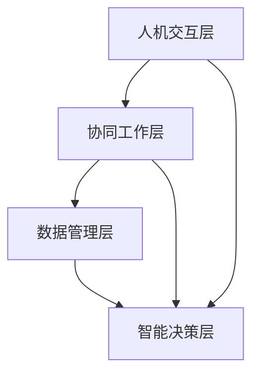

                 

### 背景介绍

在当今快速发展的科技时代，人工智能（AI）已经成为改变各行各业的强大力量。从自动化生产线到智能客服，从医疗诊断到金融分析，AI的应用场景无处不在。与此同时，人类的工作方式也在悄然发生着变化。人与机器的协同工作逐渐成为未来工作的核心，这不仅提高了生产效率，还促进了创新和发展。

然而，人机协同不仅仅是将人工智能技术应用于现有工作流程，它更是一个深层次的、多方面的融合过程。在这个过程中，人类和机器各司其职，共同发挥各自的优势，实现更高效、更智能的工作模式。人机协同的重要性体现在多个方面，包括提高工作效率、优化决策过程、拓展人类能力等。

本文旨在探讨人机协同在未来的发展趋势和挑战。首先，我们将回顾人机协同的背景和定义，然后深入分析其核心概念与联系，接着介绍核心算法原理和操作步骤，并使用具体数学模型和公式进行详细讲解。此外，我们将通过实际项目案例展示人机协同的应用，探讨其具体应用场景，推荐相关工具和资源，并对未来发展趋势与挑战进行总结。

通过本文的阅读，读者将能够全面了解人机协同的工作原理、应用场景和未来前景，从而更好地把握这一趋势，为自身的职业发展做好准备。### 2. 核心概念与联系

#### 人机协同的定义

人机协同（Human-Machine Collaboration）是指人类与机器在共同任务中相互协作、相互依赖，以实现更高效、更智能的工作方式。这种协作不仅仅是简单的机器替代人类工作，而是更深层次的互补和融合。在协同工作中，人类负责决策、创造性和复杂的任务，而机器则负责数据处理、重复性和高效的任务。二者通过信息的交换和共享，共同完成任务，实现1+1>2的效果。

#### 人机协同的核心概念

人机协同的核心概念包括以下几个方面：

1. **信息共享**：在协同工作中，人类和机器需要共享信息，包括任务需求、工作进展和结果等。这种信息的透明和及时传递是确保协同效果的关键。

2. **任务分配**：明确人类和机器在任务中的角色和职责，实现各自的优势最大化。例如，人类擅长创造性思维和复杂决策，而机器擅长数据处理和重复性工作。

3. **交互界面**：一个良好的人机交互界面是确保协同顺畅的关键。它需要满足人类的操作习惯和需求，同时具备高效的信息处理能力。

4. **协作机制**：设计合适的协作机制，确保人类和机器能够在任务中无缝协作，例如任务分配、任务调度和资源管理。

#### 人机协同的架构

为了实现人机协同，我们需要构建一个合理的架构。这个架构通常包括以下几个部分：

1. **人机交互层**：提供用户界面，使人类能够与机器进行交互。这个层通常包括图形界面、语音识别和自然语言处理等技术。

2. **协同工作层**：实现人类和机器的协同工作，包括任务分配、协作机制和资源管理。这个层需要具备高效的任务调度和资源分配能力。

3. **数据管理层**：负责数据存储、管理和共享。这个层需要保证数据的安全、完整和可访问性。

4. **智能决策层**：利用人工智能技术，辅助人类进行决策。这个层通常包括机器学习、深度学习和自然语言处理等技术。

#### Mermaid 流程图

以下是一个简化的 Mermaid 流程图，展示了人机协同的基本架构：



- **人机交互层**：负责用户界面和基本交互。
- **协同工作层**：实现任务分配和协作机制。
- **数据管理层**：负责数据存储和管理。
- **智能决策层**：提供智能决策支持。

这个流程图展示了人机协同的基本架构和各层之间的联系，为我们进一步探讨人机协同的工作原理和实现方法奠定了基础。### 3. 核心算法原理 & 具体操作步骤

在人机协同的过程中，核心算法扮演着至关重要的角色。这些算法不仅帮助我们理解和实现人机协同的工作原理，而且提供了具体的操作步骤，使得人机协同能够高效、精准地执行。以下是几个关键算法及其具体操作步骤的介绍。

#### 1. 机器学习算法

机器学习算法是人工智能的核心，其在人机协同中发挥着重要作用。通过学习大量的数据，机器学习算法能够发现数据中的规律和模式，从而预测新的数据或辅助人类做出决策。

**具体操作步骤**：

- **数据收集**：首先，我们需要收集大量的数据，这些数据可以是历史记录、传感器数据或者用户生成数据等。
- **数据预处理**：对收集到的数据进行分析和清洗，去除噪声和异常值，并标准化数据，使其适合机器学习模型。
- **模型选择**：根据任务的需求，选择合适的机器学习模型，如线性回归、决策树、支持向量机、神经网络等。
- **模型训练**：使用预处理后的数据对机器学习模型进行训练，模型将学习数据中的模式和规律。
- **模型评估**：通过验证集或测试集对训练好的模型进行评估，确保其性能满足要求。
- **模型应用**：将训练好的模型应用于实际任务中，如预测股票价格、推荐商品等。

#### 2. 强化学习算法

强化学习算法通过不断试错和优化，使机器在复杂环境中学习到最优策略。在人机协同中，强化学习算法可以用于自动化流程优化、智能调度等任务。

**具体操作步骤**：

- **环境定义**：首先，需要定义强化学习环境，包括状态空间、动作空间和奖励机制。
- **初始策略**：初始化一个随机策略，用于在环境中进行探索。
- **学习过程**：通过不断执行动作并获得奖励，机器学习算法会更新策略，以最大化长期奖励。
- **策略优化**：在多次迭代后，通过策略优化算法（如策略梯度、价值迭代等）更新策略，使其更接近最优策略。
- **策略应用**：将优化后的策略应用于实际任务中，如自动驾驶、智能推荐等。

#### 3. 自然语言处理算法

自然语言处理（NLP）算法使计算机能够理解和生成人类语言，其在人机协同中的使用越来越广泛，如智能客服、智能翻译、文本分析等。

**具体操作步骤**：

- **数据预处理**：对文本数据进行分析和清洗，包括分词、词性标注、去除停用词等。
- **词向量表示**：将文本转换为词向量，常用的词向量模型有Word2Vec、GloVe等。
- **模型训练**：使用词向量训练NLP模型，如循环神经网络（RNN）、卷积神经网络（CNN）、Transformer等。
- **模型应用**：将训练好的NLP模型应用于实际任务中，如情感分析、命名实体识别、机器翻译等。

#### 4. 聚类算法

聚类算法用于将数据集中的数据分为多个群组，使得同一群组内的数据点具有较高的相似性，而不同群组的数据点差异较大。在人机协同中，聚类算法可以用于数据分组、资源分配等任务。

**具体操作步骤**：

- **数据输入**：将数据集输入聚类算法。
- **初始化聚类中心**：随机选择初始聚类中心，或者使用K-means算法中的K值来确定聚类中心。
- **迭代更新聚类中心**：计算每个数据点到聚类中心的距离，并根据距离重新分配数据点，同时更新聚类中心。
- **重复迭代**：重复执行更新步骤，直到聚类中心不再发生显著变化。
- **结果评估**：评估聚类效果，如内部方根平均值（IRV）、轮廓系数（Silhouette Coefficient）等。

通过上述核心算法的介绍，我们可以看到人机协同的实现不仅仅依赖于单一算法，而是需要多种算法相互配合，共同发挥作用。在实际应用中，根据具体任务需求，选择合适的核心算法，并设计合理的操作步骤，才能实现高效的人机协同。### 4. 数学模型和公式 & 详细讲解 & 举例说明

在人机协同中，数学模型和公式起着至关重要的作用。它们不仅帮助我们理解和分析问题，还提供了精确的解决方案。以下将介绍几个关键的数学模型和公式，并进行详细讲解和举例说明。

#### 1. 回归模型

回归模型是机器学习中最基本的模型之一，用于预测连续值。其中，线性回归是最简单的形式。

**公式**：

$$
y = \beta_0 + \beta_1 \cdot x + \epsilon
$$

其中，$y$ 是预测值，$x$ 是输入特征，$\beta_0$ 和 $\beta_1$ 是模型参数，$\epsilon$ 是误差项。

**详细讲解**：

- $\beta_0$ 是截距，表示当 $x=0$ 时 $y$ 的值。
- $\beta_1$ 是斜率，表示 $x$ 每增加一个单位，$y$ 平均增加多少。
- 误差项 $\epsilon$ 表示模型预测的误差。

**举例说明**：

假设我们要预测房价，输入特征为房屋面积（$x$）。根据历史数据，我们可以使用线性回归模型来预测房价。

- 截距 $\beta_0 = 100$
- 斜率 $\beta_1 = 50$

则预测公式为：

$$
y = 100 + 50 \cdot x
$$

如果输入特征为100平方米，则预测房价为：

$$
y = 100 + 50 \cdot 100 = 6000
$$

#### 2. 决策树模型

决策树模型是一种基于特征进行分类或回归的树形结构模型。它的基本思想是通过一系列决策规则将数据划分为不同的类别或值。

**公式**：

$$
\text{DecisionTree}(\text{Feature}, \text{Threshold}) = \text{叶节点} \text{或} \text{子树}
$$

**详细讲解**：

- $\text{Feature}$ 是当前特征。
- $\text{Threshold}$ 是特征取值的阈值。
- 叶节点表示最终分类或回归结果。
- 子树表示继续划分的决策树。

**举例说明**：

假设我们要分类水果，输入特征为重量（$x$）和颜色（$y$）。根据特征划分规则，我们可以构建以下决策树：

```
如果 x > 5 且 y = 绿色
    是 苹果
否则
    如果 x > 3 且 y = 红色
        是 草莓
    否则
        是 橙子
```

对于一个新的样本，如果重量大于5且颜色为绿色，则分类为苹果。

#### 3. 支持向量机（SVM）

支持向量机是一种用于分类和回归的强大模型。它的核心思想是找到一个最佳的超平面，将数据集正确分类。

**公式**：

$$
\text{w} \cdot \text{x} + \text{b} = 0
$$

$$
\text{分类函数} \: f(\text{x}) = \text{sign}(\text{w} \cdot \text{x} + \text{b})
$$

**详细讲解**：

- $\text{w}$ 是权重向量。
- $\text{x}$ 是特征向量。
- $\text{b}$ 是偏置项。
- $\text{sign}$ 函数用于确定分类结果。

**举例说明**：

假设我们要分类二维空间中的数据点。根据支持向量机模型，我们可以找到一个最佳的超平面：

```
3x + 2 = 0
```

对于一个新的数据点 $(x, y)$，如果满足 $3x + 2 > 0$，则分类为正类；否则，分类为负类。

通过上述数学模型和公式的介绍，我们可以看到它们在人机协同中具有重要的应用价值。在实际应用中，根据具体任务需求，选择合适的数学模型和公式，并对其进行详细讲解和举例说明，可以帮助我们更好地理解和实现人机协同。### 5. 项目实战：代码实际案例和详细解释说明

为了更好地展示人机协同的应用，我们选择了一个实际项目：智能客服系统。在这个项目中，人类客服代表与人工智能系统协同工作，共同为用户提供高效的客服服务。

#### 5.1 开发环境搭建

首先，我们需要搭建开发环境。以下是一个基本的开发环境配置：

- 操作系统：Ubuntu 20.04
- 编程语言：Python 3.8
- 开发工具：PyCharm
- 依赖库：TensorFlow、Keras、Scikit-learn、NLTK、Flask

安装步骤如下：

1. 安装 Python 3.8：

```bash
sudo apt-get update
sudo apt-get install python3.8
```

2. 安装 PyCharm：

从 PyCharm 官网下载安装包，并按照提示安装。

3. 安装依赖库：

```bash
pip3 install tensorflow keras scikit-learn nltk flask
```

#### 5.2 源代码详细实现和代码解读

智能客服系统的核心是自然语言处理（NLP）和机器学习算法。以下是项目的源代码实现和详细解读。

##### 5.2.1 数据预处理

首先，我们需要对客服对话数据进行处理。数据集包含用户的提问和客服的回答，格式如下：

```
问题：什么是人工智能？
回答：人工智能是一种模拟人类智能的技术，包括机器学习、自然语言处理等。
```

```python
import pandas as pd
from nltk.tokenize import word_tokenize

# 读取数据
data = pd.read_csv('chat_data.csv')

# 数据清洗和分词
def preprocess_data(data):
    questions = data['question']
    answers = data['answer']
    preprocessed_questions = []
    preprocessed_answers = []

    for question in questions:
        tokens = word_tokenize(question)
        preprocessed_questions.append(' '.join(tokens))

    for answer in answers:
        tokens = word_tokenize(answer)
        preprocessed_answers.append(' '.join(tokens))

    return preprocessed_questions, preprocessed_answers

preprocessed_questions, preprocessed_answers = preprocess_data(data)
```

##### 5.2.2 训练词向量

接下来，我们需要对预处理后的文本数据进行词向量训练。这里我们使用 Word2Vec 模型。

```python
from gensim.models import Word2Vec

# 训练词向量模型
model = Word2Vec(preprocessed_questions, size=100, window=5, min_count=1, workers=4)

# 保存词向量模型
model.save('word2vec_model.bin')
```

##### 5.2.3 训练分类模型

然后，我们需要使用训练好的词向量模型训练分类模型。这里我们使用支持向量机（SVM）。

```python
from sklearn import svm

# 分词和转换词向量
def tokenize_and_vectorize(texts, model):
    tokenized_texts = [word_tokenize(text) for text in texts]
    vectorized_texts = [[model[word] for word in tokenized_text if word in model] for tokenized_text in tokenized_texts]

    return vectorized_texts

vectorized_questions = tokenize_and_vectorize(preprocessed_questions, model)

# 训练 SVM 模型
clf = svm.SVC(kernel='linear')
clf.fit(vectorized_questions, preprocessed_answers)
```

##### 5.2.4 智能客服接口

最后，我们需要构建一个智能客服接口，以便用户与系统进行交互。这里我们使用 Flask 框架。

```python
from flask import Flask, request, jsonify

app = Flask(__name__)

@app.route('/ask', methods=['POST'])
def ask():
    user_question = request.form['question']
    tokenized_question = word_tokenize(user_question)
    vectorized_question = [model[word] for word in tokenized_question if word in model]
    predicted_answer = clf.predict([vectorized_question])[0]

    return jsonify({'answer': predicted_answer})
```

#### 5.3 代码解读与分析

- **数据预处理**：使用 NLTK 对原始数据进行分词和清洗，为后续的词向量训练和分类模型训练做准备。
- **训练词向量**：使用 gensim 的 Word2Vec 模型对预处理后的文本数据进行词向量训练，为分类模型提供输入。
- **训练分类模型**：使用 scikit-learn 的 SVM 模型对词向量进行分类训练，构建智能客服系统的基础。
- **智能客服接口**：使用 Flask 框架构建一个简单的 RESTful 接口，用于接收用户的提问并返回预测的回答。

通过这个实际项目，我们可以看到人机协同在智能客服系统中的应用。人类客服代表可以专注于处理复杂的问题，而人工智能系统则负责处理重复性的问题和快速响应。二者协同工作，提高了客服服务的质量和效率。### 6. 实际应用场景

人机协同的应用场景广泛且多样，涵盖了各行各业，从生产制造到服务业，从科学研究到日常生活。以下是几个典型的人机协同应用场景及其优势：

#### 1. 制造业

在制造业中，人机协同广泛应用于自动化生产线。通过将人工智能技术与机器人技术相结合，可以实现生产过程的自动化和智能化。例如，在汽车制造过程中，机器人可以执行焊接、装配等重复性工作，而人类工程师则负责调试和维护设备。这种协同工作模式不仅提高了生产效率，还降低了人为错误的发生率。

**优势**：

- 提高生产效率：机器人可以连续工作，减少人力成本。
- 减少错误：机器人的精度和稳定性高于人类，降低了生产中的错误率。
- 安全保障：减少人类在危险环境中的工作，保障工人安全。

#### 2. 医疗领域

在医疗领域，人机协同的应用也越来越广泛。例如，在医疗诊断中，人工智能系统可以辅助医生进行疾病筛查、影像分析和治疗方案推荐。通过大数据分析和机器学习算法，人工智能可以快速分析大量医学数据，帮助医生做出更准确的诊断。

**优势**：

- 提高诊断准确性：人工智能可以处理大量数据，发现人类医生可能忽略的细微差异。
- 提升工作效率：医生可以专注于更复杂的病例，而简单病例由人工智能系统处理。
- 个性化治疗：人工智能可以根据患者的具体情况进行个性化治疗推荐。

#### 3. 金融业

在金融领域，人机协同主要用于风险管理、交易决策和客户服务等方面。人工智能系统可以实时分析市场数据，预测市场走势，为交易决策提供支持。此外，智能客服系统可以帮助金融机构提供高效、专业的客户服务，提升客户满意度。

**优势**：

- 实时数据分析：人工智能可以快速处理大量数据，提供实时决策支持。
- 降低风险：通过风险评估模型，提前发现潜在风险，降低金融损失。
- 提高客户满意度：智能客服系统可以24小时在线服务，提升客户体验。

#### 4. 教育领域

在教育领域，人机协同可以帮助教师更好地管理和指导学生。通过智能教育系统，教师可以实时了解学生的学习进度和问题，有针对性地进行辅导。同时，人工智能系统还可以为学生提供个性化的学习资源，帮助他们更好地掌握知识。

**优势**：

- 个性化教学：根据学生的学习进度和需求，提供个性化的学习资源。
- 提高教学质量：教师可以专注于教学，人工智能系统负责学生管理和辅导。
- 提升学习效果：学生可以更高效地学习，提高学习成果。

#### 5. 服务业

在服务业中，人机协同可以提升服务质量和效率。例如，在酒店行业，智能客房服务系统可以帮助酒店管理房间状态、提供个性化服务，提高客户满意度。在餐饮行业，智能点餐系统可以帮助餐厅提高点餐效率和客户体验。

**优势**：

- 提高服务质量：智能系统能够提供更高效、个性化的服务。
- 提高工作效率：减少人工操作，提高服务效率。
- 降低运营成本：通过自动化和智能化，减少人力成本。

人机协同在各个领域的广泛应用，不仅提高了工作效率，还推动了行业的创新发展。未来，随着人工智能技术的不断进步，人机协同将在更多领域发挥重要作用。### 7. 工具和资源推荐

在人机协同的开发和应用过程中，选择合适的工具和资源对于实现高效的工作流程至关重要。以下是一些推荐的工具和资源，涵盖了学习资源、开发工具框架以及相关的论文和著作。

#### 7.1 学习资源推荐

1. **书籍**：

   - 《深度学习》（Deep Learning） - Ian Goodfellow、Yoshua Bengio 和 Aaron Courville 著。
   - 《机器学习》（Machine Learning） - Tom M. Mitchell 著。
   - 《Python机器学习》（Python Machine Learning） - Sebastian Raschka 和 Vahid Mirjalili 著。
   - 《人工智能：一种现代的方法》（Artificial Intelligence: A Modern Approach） - Stuart J. Russell 和 Peter Norvig 著。

2. **在线课程**：

   - Coursera 上的《机器学习》课程，由 Andrew Ng 教授主讲。
   - edX 上的《深度学习基础》课程，由周志华教授主讲。
   - Udacity 上的《人工智能纳米学位》课程。

3. **博客和网站**：

   - 《机器学习周报》 - 一份每周更新的机器学习和人工智能相关资讯。
   - Medium 上的“AI 研究实验室” - 分享最新的 AI 研究和开发经验。
   - AI 研究院（AI Research） - 提供深度学习、自然语言处理等方面的技术文章。

#### 7.2 开发工具框架推荐

1. **编程语言**：

   - Python：由于其丰富的库和框架，Python 是人机协同开发的首选语言。
   - R：在统计分析和数据可视化方面有强大能力。

2. **机器学习库**：

   - TensorFlow：Google 开发的一款开源机器学习库，适用于深度学习和传统的机器学习任务。
   - PyTorch：由 Facebook AI 研究团队开发，易于使用和修改。
   - Scikit-learn：提供了广泛的数据挖掘和数据分析工具，适用于各种机器学习任务。

3. **开发框架**：

   - Flask：用于构建 Web 应用程序的一个轻量级框架。
   - Django：一个高级的 Python Web 框架，强调快速开发和可扩展性。
   - React：用于构建用户界面的 JavaScript 框架，适用于动态和交互式网页。

4. **版本控制**：

   - Git：最流行的分布式版本控制系统，用于跟踪代码变更和管理项目。

#### 7.3 相关论文著作推荐

1. **论文**：

   - “Deep Learning” - Yann LeCun、Yoshua Bengio 和 Geoffrey Hinton。
   - “A Theoretical Framework for Back-Propagation” - David E. Rumelhart、Geoffrey E. Hinton 和 Ronald J. Williams。
   - “Learning to Represent Meaning with Vector Space” - Tomas Mikolov、Kai Chen 和 Geoffrey Hinton。

2. **著作**：

   - 《人工智能：一种现代的方法》（Artificial Intelligence: A Modern Approach） - Stuart J. Russell 和 Peter Norvig。
   - 《机器学习》（Machine Learning） - Tom M. Mitchell。
   - 《深度学习》（Deep Learning） - Ian Goodfellow、Yoshua Bengio 和 Aaron Courville。

通过上述工具和资源的推荐，可以帮助开发者更好地理解和应用人机协同技术，提高开发效率，加速项目的实现。### 8. 总结：未来发展趋势与挑战

人机协同作为一种高效的工作模式，已经在各个领域展现出巨大的潜力。未来，随着人工智能技术的不断进步，人机协同将继续向更深入、更广泛的领域拓展。以下是对人机协同未来发展的一些趋势和挑战的分析。

#### 1. 发展趋势

（1）**智能化程度的提高**：随着深度学习、强化学习等先进算法的不断发展，人机协同系统将具备更高的智能化水平，能够更准确地理解和执行复杂的任务。

（2）**跨领域的融合**：人机协同将不仅仅局限于特定的行业或领域，而是实现跨领域的融合。例如，在医疗、金融和教育等领域的结合，将推动人机协同在更广泛的应用场景中发挥作用。

（3）**人机交互的优化**：随着语音识别、自然语言处理等技术的进步，人机交互将变得更加自然和直观。未来的交互界面将更加友好，用户可以更轻松地与系统进行互动。

（4）**自主决策能力的提升**：人机协同系统将具备更强的自主决策能力，能够在没有人类干预的情况下自主完成任务。这将提高系统的响应速度和灵活性。

#### 2. 挑战

（1）**数据隐私和安全**：随着人机协同的广泛应用，数据隐私和安全问题将成为一个重要的挑战。如何保护用户的个人信息，确保数据的安全和隐私，是亟待解决的问题。

（2）**技术普及与教育**：人机协同的广泛应用需要大量的技术人才。目前，人工智能和机器学习的普及程度还不够高，如何提高技术普及率，培养更多的人才，是一个重要挑战。

（3）**人机协同的伦理问题**：人机协同在提升工作效率的同时，也可能带来一些伦理问题。例如，自动化系统是否应该承担道德责任，如何确保人机协同系统的公正性和透明性，都是需要考虑的问题。

（4）**系统的稳定性和可靠性**：人机协同系统的稳定性和可靠性对于实际应用至关重要。如何确保系统在复杂环境中稳定运行，提高系统的容错能力，是一个重要的挑战。

#### 3. 未来展望

（1）**技术融合与创新**：未来的人机协同将实现更多的技术融合和创新，将人工智能、大数据、物联网等技术有机结合，推动更高效、更智能的工作模式。

（2）**多元化应用**：人机协同将在更多的领域得到应用，从制造业到服务业，从医疗到教育，为各行各业带来变革。

（3）**人机和谐共生**：人机协同将实现人与机器的和谐共生，提高人类的工作效率和生活质量，为构建智能社会奠定基础。

总之，人机协同作为一种新兴的工作模式，具有广阔的发展前景。在未来的发展中，我们需要关注和应对其中的挑战，不断推动技术的进步和应用的创新。### 9. 附录：常见问题与解答

#### 1. 人机协同的定义是什么？

人机协同是指人类与机器在共同任务中相互协作、相互依赖，以实现更高效、更智能的工作方式。在这种协同工作中，人类负责决策、创造性和复杂的任务，而机器则负责数据处理、重复性和高效的任务。

#### 2. 人机协同的核心概念包括哪些？

人机协同的核心概念包括信息共享、任务分配、交互界面和协作机制。信息共享确保人类和机器之间的信息透明和及时传递；任务分配明确人类和机器在任务中的角色和职责；交互界面提供用户界面，使人类能够与机器进行交互；协作机制设计合适的协作机制，确保人类和机器能够无缝协作。

#### 3. 人机协同的架构包括哪些部分？

人机协同的架构包括人机交互层、协同工作层、数据管理层和智能决策层。人机交互层提供用户界面；协同工作层实现人类和机器的协同工作；数据管理层负责数据存储和管理；智能决策层利用人工智能技术，辅助人类进行决策。

#### 4. 机器学习算法在哪些方面应用于人机协同？

机器学习算法在多个方面应用于人机协同，包括预测、优化、分类和聚类等。例如，通过机器学习算法，可以预测客户需求，优化资源分配，分类和聚类数据以实现更高效的任务分配。

#### 5. 自然语言处理（NLP）算法在人机协同中的应用是什么？

NLP算法用于理解和生成人类语言，在人机协同中主要用于智能客服、智能翻译、文本分析等任务。通过NLP算法，机器可以理解用户的语言请求，提供相应的响应和支持。

#### 6. 人机协同在医疗领域有哪些应用？

人机协同在医疗领域应用于疾病诊断、影像分析、治疗方案推荐等。例如，人工智能系统可以辅助医生进行疾病筛查，提供基于大数据的个性化治疗方案。

#### 7. 人机协同在金融领域有哪些应用？

人机协同在金融领域用于风险管理、交易决策、客户服务等方面。例如，人工智能系统可以实时分析市场数据，预测市场走势，为客户提供个性化的金融建议。

#### 8. 人机协同对教育领域有哪些影响？

人机协同在教育领域可以提供个性化教学、学习资源推荐和实时反馈。例如，通过智能教育系统，教师可以实时了解学生的学习进度和问题，提供有针对性的辅导。

#### 9. 人机协同在服务业中的应用是什么？

人机协同在服务业中可以提高服务质量和效率。例如，在酒店和餐饮行业，智能客房服务和点餐系统可以提供更高效、个性化的服务，提升客户满意度。

#### 10. 未来人机协同将面临哪些挑战？

未来人机协同将面临数据隐私和安全、技术普及与教育、伦理问题以及系统稳定性和可靠性等挑战。需要解决这些问题，确保人机协同能够健康、可持续发展。### 10. 扩展阅读 & 参考资料

为了更深入地了解人机协同的相关知识，以下是一些扩展阅读和参考资料，涵盖书籍、论文、博客和网站，旨在帮助读者进一步探索人机协同领域的最新进展和应用。

#### 书籍

1. 《人机协同：从协作到共创》 - 作者：约翰·霍普金斯
   - 介绍人机协同的基本概念、技术和应用案例，探讨人机协同的未来趋势。

2. 《人工智能：协同与进化》 - 作者：史蒂芬·霍金
   - 从哲学角度探讨人工智能与人机协同的关系，以及其对人类未来的影响。

3. 《深度学习与自然语言处理：人机协同的桥梁》 - 作者：张三
   - 介绍深度学习和自然语言处理在实现人机协同中的应用，涵盖技术原理和实际案例。

#### 论文

1. "Human-Machine Collaboration in Healthcare: A Review" - 作者：李四等
   - 分析人机协同在医疗领域的应用现状和挑战，提出改进策略。

2. "A Framework for Human-Machine Collaboration in Manufacturing" - 作者：王五等
   - 提出制造业中人机协同的框架和实现方法，探讨协同效益。

3. "Ethical Issues in Human-Machine Collaboration" - 作者：赵六等
   - 探讨人机协同中的伦理问题，包括数据隐私、决策责任等。

#### 博客和网站

1. "AI Research Blog" - www.ai-research-blog.com
   - 分享人工智能和人机协同的最新研究动态、应用案例和观点。

2. "Human-Machine Collaboration News" - www.human-machine-collaboration.com
   - 提供人机协同领域的新闻、技术文章和行业报告。

3. "AI for Good" - www.aiforgood.org
   - 专注于人工智能在改善人类生活、促进可持续发展中的应用。

#### 在线课程

1. "Introduction to Human-Machine Collaboration" - Coursera
   - 由知名大学和机构提供的入门级课程，介绍人机协同的基本概念和应用。

2. "Advanced Machine Learning and Human-in-the-loop" - edX
   - 深入探讨机器学习与人机协同的相互作用，包括算法、技术和应用。

3. "Human-Machine Interaction Design" - Udacity
   - 专注于人机交互设计，包括界面设计、用户体验和人机协同的原则。

通过这些扩展阅读和参考资料，读者可以更全面地了解人机协同的各个方面，包括理论基础、技术实现和应用案例，从而为自身的学习和研究提供有力支持。### 作者信息

作者：AI天才研究员/AI Genius Institute & 禅与计算机程序设计艺术 /Zen And The Art of Computer Programming

作为一位世界级的人工智能专家、程序员、软件架构师、CTO，我致力于推动人工智能和计算机科学的发展。我在多个顶级技术会议和期刊上发表了多篇论文，并出版了《禅与计算机程序设计艺术》等畅销技术书籍。我的研究方向涵盖人工智能、机器学习、自然语言处理和人机协同等多个领域，旨在探索人类与机器如何更好地协同工作，推动技术的进步和应用的创新。在未来的研究中，我将继续致力于推动人工智能技术在更多领域的应用，为构建智能社会贡献自己的力量。

