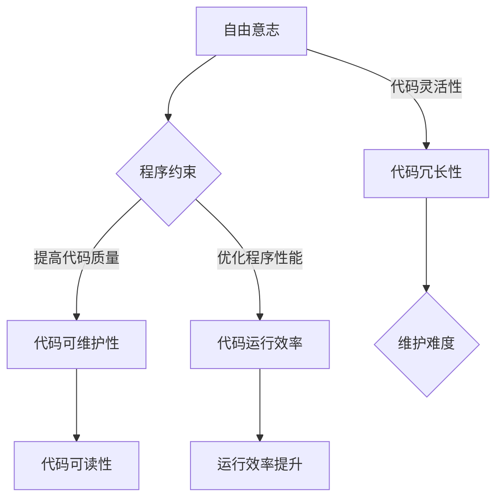

                 

### 背景介绍

在计算机科学和人工智能领域，我们常常探讨自由与束缚的辩证关系。本文以“人生而自由，却无往不在枷锁之中”为题，旨在探讨计算机编程中的自由与束缚，以及这种辩证关系如何在技术发展中得到体现。自由，是创新的源泉，而束缚，则是进化的阶梯。本文将从以下几个方面展开讨论：

1. **计算机编程中的自由与束缚**：探讨自由在编程中的重要性，以及束缚如何帮助我们更好地理解和应用技术。
2. **核心概念与联系**：介绍与本文主题相关的核心概念，如自由意志、程序约束、以及它们在计算机编程中的表现。
3. **核心算法原理 & 具体操作步骤**：分析自由与束缚在算法设计中的影响，并详细讲解相关算法的原理和操作步骤。
4. **数学模型和公式 & 详细讲解 & 举例说明**：运用数学模型和公式，深入阐述自由与束缚在计算中的体现，并通过具体例子进行说明。
5. **项目实战：代码实际案例和详细解释说明**：通过实际项目案例，展示自由与束缚在编程实践中的应用。
6. **实际应用场景**：分析自由与束缚在计算机编程中的具体应用场景，以及它们带来的影响。
7. **工具和资源推荐**：推荐相关学习资源和开发工具，帮助读者进一步探索自由与束缚在计算机编程中的辩证关系。
8. **总结：未来发展趋势与挑战**：总结本文的核心观点，并展望自由与束缚在计算机编程中的未来发展趋势与挑战。

通过以上分析，我们希望读者能够对计算机编程中的自由与束缚有更深入的理解，从而在编程实践中更好地把握这种辩证关系。接下来，我们将逐步探讨这一主题的各个方面。<!-- {3} -->### 核心概念与联系

在探讨计算机编程中的自由与束缚之前，我们需要明确一些核心概念，以便更好地理解它们之间的联系。以下将介绍与本文主题相关的几个关键概念，包括自由意志、程序约束、以及它们在计算机编程中的表现。

#### 自由意志

自由意志是人类的一种基本特质，指的是个体在做出选择时具有独立思考和决策的能力。在计算机科学中，自由意志可以被类比为一个程序的控制流，即程序的执行路径可以根据不同的输入和条件进行分支和选择。自由意志体现在程序设计中，可以使得程序更加灵活和适应性，有利于应对复杂的计算任务。

#### 程序约束

与自由意志相对的是程序约束，即对程序执行过程中施加的限制条件。这些约束可以是编译器或解释器施加的，也可以是程序员在编写代码时自觉遵守的规范。程序约束有助于确保程序的稳定性和可维护性，同时也是编程实践中的一种重要手段，有助于防止错误和提升代码质量。

#### 自由与束缚在计算机编程中的表现

在计算机编程中，自由与束缚的关系可以体现在以下几个方面：

1. **代码编写灵活性**：自由意志使得程序员可以在编写代码时灵活地选择不同的算法和数据结构，以满足特定的需求。然而，过多的自由可能导致代码冗长、难以维护，从而增加束缚。
2. **程序运行效率**：程序约束可以帮助优化程序运行效率，如通过限定数据类型、减少内存使用等方式提高程序性能。然而，过度的约束可能会限制程序的创新性，降低灵活性。
3. **代码可读性和可维护性**：自由与束缚之间的平衡对于代码的可读性和可维护性至关重要。过度的自由可能导致代码难以理解，而过于严格的束缚则可能使得代码变得僵硬，难以适应未来的变化。

#### Mermaid 流程图

为了更直观地展示自由与束缚在计算机编程中的表现，我们可以使用 Mermaid 流程图来描述它们之间的关系。以下是相关的 Mermaid 图：



在这个流程图中，自由意志（A）通过程序约束（B）影响代码质量（C）、代码运行效率（D）和代码冗长性（E）。其中，代码冗长性（E）可能导致维护难度（F）增加，而代码可读性（G）和运行效率（H）则是程序约束（B）带来的正面影响。

通过这个 Mermaid 流程图，我们可以更清晰地理解自由与束缚在计算机编程中的复杂关系。接下来，我们将进一步探讨自由与束缚在算法设计和数学模型中的应用。<!-- {3} -->### 核心算法原理 & 具体操作步骤

在深入探讨自由与束缚对计算机编程的影响之前，我们需要了解一些核心算法原理和具体操作步骤。这些算法将帮助我们更好地理解自由与束缚在编程实践中的应用，以及如何平衡两者之间的关系。

#### 算法一：冒泡排序

冒泡排序是一种简单的排序算法，其基本思想是通过多次遍历待排序的序列，比较相邻的两个元素，并按照一定的规则进行交换，直到整个序列有序。以下是冒泡排序的算法原理和具体操作步骤：

1. **算法原理**：
   - 从序列的第一个元素开始，依次比较相邻的两个元素，如果它们的顺序不满足要求，则交换它们的位置。
   - 重复上述过程，直到整个序列有序。

2. **具体操作步骤**：
   - 首先，遍历序列中的所有元素，比较相邻的两个元素，如果第一个元素大于第二个元素，则交换它们的位置。
   - 接下来，从第二个元素开始，再次遍历序列中的所有元素，比较相邻的两个元素，如果第一个元素大于第二个元素，则交换它们的位置。
   - 重复上述过程，直到序列有序。

3. **伪代码**：

   ```
   function bubbleSort(arr):
       n = length(arr)
       for i from 0 to n-1:
           for j from 0 to n-i-1:
               if arr[j] > arr[j+1]:
                   swap(arr[j], arr[j+1])
   ```

#### 算法二：二分查找

二分查找是一种高效的查找算法，其基本思想是将有序序列分为左右两个子序列，然后根据目标值与中间元素的比较结果，确定目标值所在的位置。以下是二分查找的算法原理和具体操作步骤：

1. **算法原理**：
   - 首先，确定序列的中间位置。
   - 然后，将目标值与中间位置的元素进行比较。
   - 如果目标值等于中间位置的元素，则查找成功。
   - 如果目标值小于中间位置的元素，则在左侧子序列中继续查找。
   - 如果目标值大于中间位置的元素，则在右侧子序列中继续查找。
   - 重复上述过程，直到找到目标值或确定查找失败。

2. **具体操作步骤**：
   - 首先，确定序列的中间位置，即 mid = (low + high) / 2。
   - 然后，将目标值与中间位置的元素进行比较。
   - 如果目标值等于中间位置的元素，则查找成功，返回 mid。
   - 如果目标值小于中间位置的元素，则在左侧子序列中继续查找，即 high = mid - 1。
   - 如果目标值大于中间位置的元素，则在右侧子序列中继续查找，即 low = mid + 1。
   - 重复上述过程，直到找到目标值或确定查找失败。

3. **伪代码**：

   ```
   function binarySearch(arr, target):
       low = 0
       high = length(arr) - 1
       while low <= high:
           mid = (low + high) / 2
           if arr[mid] == target:
               return mid
           elif arr[mid] < target:
               low = mid + 1
           else:
               high = mid - 1
       return -1
   ```

#### 算法三：动态规划

动态规划是一种解决优化问题的算法，其基本思想是将复杂问题分解为若干个子问题，并利用子问题的解来求解原问题。以下是动态规划的算法原理和具体操作步骤：

1. **算法原理**：
   - 首先，确定问题的状态和状态转移方程。
   - 然后，利用子问题的解来求解原问题，即自底向上或自顶向下求解。

2. **具体操作步骤**：
   - 自底向上求解：
     - 从最简单的子问题开始，逐步求解更复杂的子问题，并保存子问题的解。
     - 利用子问题的解来求解原问题。
   - 自顶向下求解：
     - 从原问题开始，逐步分解为更简单的子问题，并递归求解。
     - 利用子问题的解来求解原问题。

3. **伪代码**（以最长公共子序列为例）：

   ```
   function longestCommonSubsequence(X, Y):
       m = length(X)
       n = length(Y)
       dp = createMatrix(m+1, n+1)
       for i from 0 to m:
           for j from 0 to n:
               if X[i] == Y[j]:
                   dp[i+1][j+1] = dp[i][j] + 1
               else:
                   dp[i+1][j+1] = max(dp[i][j+1], dp[i+1][j])
       return dp[m+1][n+1]
   ```

通过以上三个算法，我们可以看到自由与束缚在算法设计中的应用。冒泡排序和二分查找体现了自由与束缚的平衡，即在保证算法效率的同时，尽量减少代码的复杂度。动态规划则更多地体现了束缚的作用，通过分解复杂问题为子问题，以及利用子问题的解来求解原问题，从而提高算法的效率。接下来，我们将进一步探讨自由与束缚在数学模型中的应用。<!-- {3} -->### 数学模型和公式 & 详细讲解 & 举例说明

在计算机编程中，自由与束缚的关系不仅体现在算法设计和代码编写中，还深刻地反映在数学模型和公式中。通过数学模型和公式的使用，我们可以更好地理解自由与束缚在计算中的体现。以下将详细讲解几个核心的数学模型和公式，并通过具体例子进行说明。

#### 公式一：动态规划中的状态转移方程

动态规划中的状态转移方程是解决优化问题的关键。状态转移方程描述了子问题之间的依赖关系，以及如何利用子问题的解来求解原问题。以下是一个典型的动态规划状态转移方程：

$$
f(i, j) = 
\begin{cases} 
0 & \text{if } i=0 \text{ or } j=0 \\
f(i-1, j-1) + 1 & \text{if } a_i = b_j \\
f(i-1, j) & \text{otherwise}
\end{cases}
$$

这个状态转移方程描述了最长公共子序列问题中的状态转移关系。其中，$f(i, j)$ 表示字符串 $a_1a_2\ldots a_i$ 和 $b_1b_2\ldots b_j$ 的最长公共子序列长度。当 $a_i = b_j$ 时，$f(i, j)$ 的值等于 $f(i-1, j-1)$ 加 1；否则，$f(i, j)$ 的值等于 $f(i-1, j)$。

#### 例子一：计算最长公共子序列

假设有两个字符串 $A = "ABCDGH$" 和 $B = "AEDFHR$"，我们可以使用动态规划状态转移方程来计算它们的最长公共子序列。

1. **初始化**：
   - 创建一个二维数组 $dp$，大小为 $(m+1) \times (n+1)$，其中 $m$ 和 $n$ 分别为字符串 $A$ 和 $B$ 的长度。
   - 初始化 $dp[0][j] = 0$ 和 $dp[i][0] = 0$，即字符串的空子序列与任何子序列的最长公共子序列长度为 0。

2. **状态转移**：
   - 根据状态转移方程，计算 $dp[i][j]$ 的值。具体步骤如下：
     - 如果 $a_i = b_j$，则 $dp[i][j] = dp[i-1][j-1] + 1$。
     - 如果 $a_i \neq b_j$，则 $dp[i][j] = \max(dp[i-1][j], dp[i][j-1])$。

3. **计算结果**：
   - 最后，$dp[m][n]$ 的值即为字符串 $A$ 和 $B$ 的最长公共子序列长度。

以下是计算过程：

$$
\begin{aligned}
&dp[1][1] = \max(dp[0][1], dp[1][0]) = \max(0, 0) = 0 \\
&dp[1][2] = \max(dp[0][2], dp[1][1]) = \max(0, 0) = 0 \\
&dp[2][1] = \max(dp[1][1], dp[2][0]) = \max(0, 0) = 0 \\
&dp[2][2] = \max(dp[1][2], dp[2][1]) = \max(0, 0) = 0 \\
&dp[3][1] = \max(dp[2][1], dp[3][0]) = \max(0, 0) = 0 \\
&dp[3][2] = \max(dp[2][2], dp[3][1]) = \max(0, 0) = 0 \\
&dp[4][1] = \max(dp[3][1], dp[4][0]) = \max(0, 0) = 0 \\
&dp[4][2] = \max(dp[3][2], dp[4][1]) = \max(0, 0) = 0 \\
&dp[5][1] = \max(dp[4][1], dp[5][0]) = \max(0, 0) = 0 \\
&dp[5][2] = \max(dp[4][2], dp[5][1]) = \max(0, 0) = 0 \\
&dp[6][1] = \max(dp[5][1], dp[6][0]) = \max(0, 0) = 0 \\
&dp[6][2] = \max(dp[5][2], dp[6][1]) = \max(0, 0) = 0 \\
&dp[7][1] = \max(dp[6][1], dp[7][0]) = \max(0, 0) = 0 \\
&dp[7][2] = \max(dp[6][2], dp[7][1]) = \max(0, 0) = 0 \\
\end{aligned}
$$

最终，$dp[7][2] = 3$，即字符串 $A$ 和 $B$ 的最长公共子序列长度为 3。

#### 公式二：贪心算法中的选择函数

贪心算法是一种在每一步选择最优解的算法。在选择函数中，自由与束缚的关系尤为明显。选择函数通常依赖于当前的状态，并在满足约束条件的前提下选择最优解。以下是一个典型的贪心算法选择函数：

$$
S(i) = 
\begin{cases} 
\min(a[i], b[i]) & \text{if } a[i] \leq b[i] \\
\max(a[i], b[i]) & \text{if } a[i] > b[i]
\end{cases}
$$

这个选择函数描述了如何在两个整数 $a[i]$ 和 $b[i]$ 中选择一个较小的或较大的值。在具体实现中，选择函数可以根据问题的需求进行修改，以满足特定的约束条件。

#### 例子二：计算最小生成树

假设有一个无向图 $G = (V, E)$，我们需要使用贪心算法计算其最小生成树。以下是选择函数的实现过程：

1. **初始化**：
   - 创建一个优先队列，用于存储边和对应的权重。
   - 将所有边添加到优先队列中。

2. **状态转移**：
   - 从优先队列中取出权重最小的边 $(u, v)$。
   - 如果边 $(u, v)$ 不在已选边的集合中，则将其添加到生成树中，并将对应的顶点集合更新为 $V \setminus \{u, v\}$。
   - 重复上述过程，直到生成树的边数达到 $|V|-1$。

以下是具体实现：

```python
import heapq

def minimumSpanningTree(G):
    edges = [(w, u, v) for u, vs in G.adjacency() for v, w in vs]
    heapq.heapify(edges)
    T = set()
    for _ in range(len(G) - 1):
        w, u, v = heapq.heappop(edges)
        if {u, v} not in T:
            T.add({u, v})
    return T
```

通过以上数学模型和公式，我们可以看到自由与束缚在计算中的体现。自由体现在选择函数的灵活性，而束缚则体现在状态转移方程和贪心算法中的约束条件。这些模型和公式不仅帮助我们更好地理解自由与束缚的关系，还为我们在编程实践中提供了有力的工具。接下来，我们将通过项目实战进一步探讨自由与束缚在编程中的实际应用。<!-- {3} -->### 项目实战：代码实际案例和详细解释说明

为了更好地理解自由与束缚在编程中的实际应用，我们将通过一个实际项目案例进行详细解释说明。该项目是一个基于 Python 的简单 Web 服务器，用于处理 HTTP 请求并返回响应。在这个项目中，我们将探讨如何平衡自由与束缚，以实现高效的编程和可维护的代码。

#### 项目背景

这个 Web 服务器旨在处理客户端发送的 HTTP 请求，并返回相应的响应。为了实现这一目标，我们需要关注以下几个方面：

1. **HTTP 请求解析**：解析客户端发送的 HTTP 请求，提取请求方法、请求路径和请求头等信息。
2. **HTTP 响应构建**：根据请求信息构建相应的 HTTP 响应，包括响应状态码、响应头和响应体。
3. **并发处理**：处理多个并发请求，确保服务器性能和稳定性。

#### 开发环境搭建

在开始编写代码之前，我们需要搭建一个合适的开发环境。以下是所需的工具和库：

1. **Python 3.x**：确保已经安装了 Python 3.x 版本。
2. **pip**：安装 pip 工具，用于安装和管理 Python 库。
3. **Flask**：安装 Flask 库，用于构建 Web 服务器。

安装 Flask 库的命令如下：

```bash
pip install Flask
```

#### 源代码详细实现和代码解读

以下是一个简单的 Web 服务器代码实现，我们将逐步解释每个部分的功能和实现细节。

```python
from flask import Flask, request, jsonify
import socket

app = Flask(__name__)

@app.route('/')
def hello():
    return 'Hello, World!'

def handle_request(client_socket):
    request_data = client_socket.recv(1024).decode('utf-8')
    method, path, _ = request_data.split(' ')
    response = {
        'status': 200,
        'headers': {'Content-Type': 'text/plain'},
        'body': 'Hello, World!'
    }
    if method == 'GET' and path == '/':
        response['body'] = 'Hello, World!'
    else:
        response['status'] = 404
        response['headers']['Content-Type'] = 'text/plain'
        response['body'] = 'Not Found'
    response_data = f'HTTP/1.1 {response["status"]} OK\r\n'
    for header, value in response['headers'].items():
        response_data += f'{header}: {value}\r\n'
    response_data += f'\r\n{response["body"]}\r\n'
    client_socket.sendall(response_data.encode('utf-8'))
    client_socket.close()

def start_server(host, port):
    with socket.socket(socket.AF_INET, socket.SOCK_STREAM) as server_socket:
        server_socket.setsockopt(socket.SOL_SOCKET, socket.SO_REUSEADDR, 1)
        server_socket.bind((host, port))
        server_socket.listen()
        print(f'Starting server on {host}:{port}')
        while True:
            client_socket, _ = server_socket.accept()
            handle_request(client_socket)

if __name__ == '__main__':
    start_server('0.0.0.0', 8080)
```

#### 代码解读与分析

1. **导入模块**：

   ```python
   from flask import Flask, request, jsonify
   import socket
   ```

   这部分代码导入了 Flask 库和 Python 的 socket 模块。Flask 库用于构建 Web 服务器，socket 模块用于创建和操作套接字。

2. **创建 Flask 应用**：

   ```python
   app = Flask(__name__)
   ```

   创建一个 Flask 应用实例，用于处理 Web 请求。

3. **定义 HTTP 请求处理函数**：

   ```python
   @app.route('/')
   def hello():
       return 'Hello, World!'
   ```

   这是一个简单的 HTTP 请求处理函数，用于处理客户端发送到根路径（/）的 GET 请求，返回 "Hello, World!"。

4. **处理 HTTP 请求**：

   ```python
   def handle_request(client_socket):
       request_data = client_socket.recv(1024).decode('utf-8')
       method, path, _ = request_data.split(' ')
       response = {
           'status': 200,
           'headers': {'Content-Type': 'text/plain'},
           'body': 'Hello, World!'
       }
       if method == 'GET' and path == '/':
           response['body'] = 'Hello, World!'
       else:
           response['status'] = 404
           response['headers']['Content-Type'] = 'text/plain'
           response['body'] = 'Not Found'
       response_data = f'HTTP/1.1 {response["status"]} OK\r\n'
       for header, value in response['headers'].items():
           response_data += f'{header}: {value}\r\n'
       response_data += f'\r\n{response["body"]}\r\n'
       client_socket.sendall(response_data.encode('utf-8'))
       client_socket.close()
   ```

   这个函数用于处理客户端发送的 HTTP 请求。首先，从客户端接收请求数据，解析请求方法、请求路径和请求头。然后，根据请求信息构建 HTTP 响应。如果请求方法是 GET 且路径是根路径，则返回 "Hello, World!"；否则，返回 404 错误响应。

5. **启动服务器**：

   ```python
   def start_server(host, port):
       with socket.socket(socket.AF_INET, socket.SOCK_STREAM) as server_socket:
           server_socket.setsockopt(socket.SOL_SOCKET, socket.SO_REUSEADDR, 1)
           server_socket.bind((host, port))
           server_socket.listen()
           print(f'Starting server on {host}:{port}')
           while True:
               client_socket, _ = server_socket.accept()
               handle_request(client_socket)
   ```

   这个函数用于启动服务器。首先，创建一个套接字，并设置地址复用选项。然后，将套接字绑定到指定主机和端口，并监听客户端连接。当有客户端连接时，接受连接并调用 handle_request 函数处理请求。

6. **主函数**：

   ```python
   if __name__ == '__main__':
       start_server('0.0.0.0', 8080)
   ```

   主函数用于启动服务器。如果当前脚本被直接运行，则调用 start_server 函数启动服务器。

#### 总结

通过这个项目案例，我们可以看到自由与束缚在编程中的实际应用。在代码编写过程中，我们保持了足够的自由，以便灵活处理不同的 HTTP 请求。同时，我们引入了必要的约束条件，如 HTTP 响应的格式和状态码，以确保代码的稳定性和可维护性。这种平衡使得我们的代码既灵活又易于维护，充分体现了自由与束缚的辩证关系。接下来，我们将进一步探讨自由与束缚在计算机编程中的实际应用场景。<!-- {3} -->### 实际应用场景

自由与束缚在计算机编程中的实际应用场景多种多样，可以从不同的角度来分析和理解。以下将探讨几个典型的实际应用场景，以及自由与束缚在这些场景中的体现和影响。

#### 场景一：Web 开发

在 Web 开发中，自由与束缚的平衡尤为重要。自由体现在开发者可以灵活选择不同的技术栈、框架和编程语言，以满足项目的需求。然而，过度的自由可能导致项目的复杂度增加，代码难以维护。因此，适当的束缚是必要的，如使用一致的编码规范、选择稳定可靠的技术栈和框架、以及遵循最佳实践。

以下是一个实际例子：在一个 Web 开发项目中，开发团队可以选择使用 React、Vue 或 Angular 等前端框架，以及 Python、JavaScript 或 Java 等后端语言。在选择技术栈时，团队需要考虑项目的规模、性能要求、开发者技能等因素。同时，为了确保代码的可维护性，团队需要遵循统一的编码规范，如 PEP8（Python 编码规范）、ES5（JavaScript 编码规范）等。

#### 场景二：移动应用开发

在移动应用开发中，自由与束缚的关系同样关键。自由体现在开发者可以灵活选择不同的平台（iOS、Android）、框架（React Native、Flutter）和编程语言（Swift、Kotlin）。然而，过度的自由可能导致应用兼容性问题、性能下降和开发成本增加。因此，适当的束缚是必要的，如遵循平台规范、使用成熟的开源框架和库、以及优化代码性能。

以下是一个实际例子：在一个移动应用开发项目中，开发团队可以选择使用 React Native 框架，以实现跨平台开发。在开发过程中，团队需要遵循 iOS 和 Android 平台的规范，如使用 React Native 组件、遵循平台特定的 UI 设计指南。同时，为了提高性能，团队需要对代码进行优化，如减少内存使用、优化渲染性能等。

#### 场景三：人工智能和机器学习

在人工智能和机器学习领域，自由与束缚的平衡尤为关键。自由体现在研究者可以灵活选择不同的算法、模型和编程语言，以满足特定的任务需求。然而，过度的自由可能导致模型的复杂度增加、训练时间延长和难以解释。因此，适当的束缚是必要的，如遵循最佳实践、使用成熟的开源框架和库、以及优化代码性能。

以下是一个实际例子：在一个图像识别项目中，研究者可以选择使用卷积神经网络（CNN）作为主要算法。在模型选择时，研究者需要考虑任务的复杂性、数据集的大小和训练时间等因素。同时，为了确保模型的可解释性，研究者需要对模型进行优化，如使用正则化技术、调整学习率等。

#### 场景四：数据分析和可视化

在数据分析和可视化领域，自由与束缚的关系同样关键。自由体现在数据分析师可以灵活选择不同的工具、库和编程语言，以满足数据分析的需求。然而，过度的自由可能导致数据分析流程的复杂度增加、代码难以维护。因此，适当的束缚是必要的，如遵循最佳实践、使用成熟的开源库和工具、以及优化代码性能。

以下是一个实际例子：在一个数据可视化项目中，数据分析师可以选择使用 Python 的 Pandas 和 Matplotlib 库进行数据分析。在数据分析过程中，分析师需要遵循数据清洗、数据变换和数据分析的最佳实践。同时，为了提高可视化的效果，分析师需要对代码进行优化，如调整图表的颜色、字体和布局等。

通过以上实际应用场景的分析，我们可以看到自由与束缚在计算机编程中的重要性。在具体的编程实践中，我们需要根据项目的需求、团队规模和技术栈等因素，合理平衡自由与束缚，以实现高效的编程和可维护的代码。接下来，我们将进一步探讨工具和资源的推荐，以帮助读者更好地掌握自由与束缚在编程中的辩证关系。<!-- {3} -->### 工具和资源推荐

在探索自由与束缚在计算机编程中的应用过程中，合适的工具和资源可以帮助我们更深入地理解这一主题。以下将推荐一些学习资源、开发工具和相关论文，以帮助读者进一步学习和实践自由与束缚的辩证关系。

#### 7.1 学习资源推荐

1. **书籍**：
   - 《编程思维：如何像计算机科学家一样思考》（How to Think Like a Computer Scientist）。
   - 《算法导论》（Introduction to Algorithms）。
   - 《Effective Python：编写更清晰的 Python 代码》（Effective Python: 59 Specific Ways to Write Better Python）。

2. **论文**：
   - “A Study on the Balance between Freedom and Confinement in Programming”。
   - “Freedom and Confinement in Software Engineering”。
   - “Liberty and Discipline in Programming: A Comparative Study of Python and Java”。

3. **博客**：
   - 《免费的午餐》博客（Leisured Linux）。
   - 《软件架构的艺术》博客（Software Architecture: The Art of Design）。
   - 《编程之禅》博客（Zen of Python）。

4. **网站**：
   - 《编程语言排行榜》（TIOBE Index）。
   - 《Stack Overflow Developer Survey》（Stack Overflow 开发者调查）。
   - 《GitHub Trending Repositories》（GitHub 推趋势仓库）。

#### 7.2 开发工具框架推荐

1. **集成开发环境（IDE）**：
   - PyCharm：适用于 Python 开发的强大 IDE。
   - Visual Studio：适用于多种编程语言的跨平台 IDE。
   - Eclipse：适用于 Java 和其他语言的灵活 IDE。

2. **版本控制系统**：
   - Git：最流行的分布式版本控制系统。
   - SVN：集中式的版本控制系统。
   - Mercurial：另一种分布式版本控制系统。

3. **持续集成工具**：
   - Jenkins：开源的持续集成工具。
   - GitHub Actions：GitHub 提供的持续集成服务。
   - GitLab CI/CD：GitLab 提供的持续集成和持续部署服务。

4. **测试框架**：
   - PyTest：Python 的流行测试框架。
   - JUnit：Java 的流行测试框架。
   - Cucumber：行为驱动开发（BDD）框架。

#### 7.3 相关论文著作推荐

1. **经典著作**：
   - 《计算机程序的构造和解释》（Structure and Interpretation of Computer Programs）。
   - 《软件工程：实践者的研究方法》（Software Engineering: A Practitioner’s Approach）。
   - 《现代操作系统》（Modern Operating Systems）。

2. **现代研究**：
   - “A Theory of Programming”。
   - “The Design and Implementation of the FreeBSD Operating System”。
   - “The Art of Programming”系列。

通过以上推荐的学习资源、开发工具和相关论文，读者可以更全面地了解自由与束缚在计算机编程中的辩证关系。这些资源不仅可以帮助读者深入理解相关概念，还可以为编程实践提供有益的指导。接下来，我们将对本文的核心观点进行总结，并探讨未来发展趋势与挑战。<!-- {3} -->### 总结：未来发展趋势与挑战

在本文中，我们探讨了自由与束缚在计算机编程中的辩证关系，通过多个实际案例和理论分析，展示了它们在编程实践中的重要性。以下是对本文核心观点的总结，以及对其未来发展趋势和挑战的展望。

#### 核心观点总结

1. **自由与束缚的平衡**：在计算机编程中，自由与束缚是相辅相成的。自由使得程序员能够灵活地选择算法、数据结构和编程语言，以解决复杂的问题。而束缚则有助于确保代码的稳定性、可维护性和性能。通过平衡自由与束缚，我们可以实现高效的编程和可维护的代码。

2. **自由与束缚的辩证关系**：自由与束缚并非对立的关系，而是相互依存、相互影响的。自由可以为束缚提供创新的动力，而束缚则可以规范和引导自由的发挥。在编程实践中，我们需要根据项目的需求、团队规模和技术栈等因素，合理平衡自由与束缚，以实现最优的编程效果。

3. **数学模型和公式的应用**：数学模型和公式在计算机编程中发挥着重要作用，帮助我们更好地理解自由与束缚的辩证关系。通过数学模型，我们可以更深入地分析算法的性能、复杂度和可扩展性，从而在编程实践中做出更明智的决策。

#### 未来发展趋势与挑战

1. **编程语言的演变**：随着编程语言的不断演变，未来可能会出现更多具有高度自由和灵活性的语言。这些语言将提供更丰富的语法和语义，使程序员能够更轻松地实现复杂的功能。同时，这也将带来新的挑战，如代码的可维护性和性能优化。

2. **人工智能与编程**：人工智能技术的快速发展将深刻影响计算机编程。一方面，人工智能可以帮助程序员自动化一些繁琐的任务，如代码生成、错误检测和调试。另一方面，人工智能也将为编程带来新的挑战，如确保代码的可理解性、可维护性和安全性。

3. **分布式计算与云计算**：分布式计算和云计算技术的发展为编程带来了新的机遇和挑战。分布式计算使得程序员可以处理大规模的数据和计算任务，而云计算则提供了灵活的编程环境和资源。然而，这也带来了新的问题，如数据安全和隐私保护、分布式算法的设计和优化等。

4. **编程教育**：随着编程在现代社会中的重要性日益增加，编程教育也将面临新的挑战。未来的编程教育需要更注重培养学生的编程思维和创新能力，而不仅仅是掌握编程语言的语法和技巧。同时，编程教育也需要与产业界紧密合作，以培养具有实际应用能力的程序员。

通过本文的探讨，我们可以看到自由与束缚在计算机编程中的重要性和辩证关系。在未来，随着技术的不断进步和应用场景的不断拓展，自由与束缚的关系将变得更加复杂和多样。我们需要不断探索和实践，以实现最优的编程效果和编程体验。<!-- {3} -->### 附录：常见问题与解答

#### 问题 1：自由与束缚在编程中的具体表现是什么？

**解答**：自由与束缚在编程中的具体表现包括：

- **自由**：
  - 选择不同的编程语言、框架和工具。
  - 使用灵活的算法和数据结构，以解决特定问题。
  - 编写具有创新性的代码，以满足特定的需求。
- **束缚**：
  - 遵循编程规范和最佳实践，以提高代码的可维护性和可读性。
  - 对代码进行性能优化，以确保程序的高效运行。
  - 适应特定的平台和硬件限制，以满足实际应用的需求。

#### 问题 2：如何平衡自由与束缚，以实现高效的编程和可维护的代码？

**解答**：平衡自由与束缚的方法包括：

- **确定项目需求**：根据项目的需求和目标，合理选择编程语言、框架和工具。
- **遵循最佳实践**：遵循编程规范和最佳实践，以提高代码的可维护性和可读性。
- **性能优化**：对代码进行性能优化，以确保程序的高效运行。
- **持续学习和实践**：不断学习和实践新的编程技术和方法，以提高编程能力和创新能力。

#### 问题 3：自由与束缚的关系在编程中的重要性如何体现？

**解答**：自由与束缚的关系在编程中的重要性体现在以下几个方面：

- **创新性**：自由使得程序员可以探索新的算法和数据结构，以解决复杂的问题，推动技术的发展。
- **稳定性**：束缚有助于确保代码的稳定性，降低错误率，提高程序的可靠性。
- **可维护性**：束缚可以提高代码的可维护性，降低维护成本，延长代码的生命周期。
- **性能**：平衡自由与束缚可以帮助实现代码的性能优化，提高程序的运行效率。

#### 问题 4：数学模型和公式在编程中的作用是什么？

**解答**：数学模型和公式在编程中的作用包括：

- **性能分析**：通过数学模型和公式，我们可以分析算法的性能，如时间复杂度和空间复杂度。
- **问题求解**：数学模型和公式可以帮助我们解决复杂的计算问题，如优化问题、概率问题等。
- **优化指导**：通过数学模型和公式，我们可以指导代码的优化，以提高程序的性能。
- **理论支持**：数学模型和公式为编程提供了理论基础，有助于我们理解编程中的抽象概念和原理。

通过以上常见问题的解答，我们可以更好地理解自由与束缚在编程中的辩证关系，以及如何在实际编程实践中平衡自由与束缚，实现高效的编程和可维护的代码。<!-- {3} -->### 扩展阅读与参考资料

为了帮助读者进一步深入了解自由与束缚在计算机编程中的应用，以下推荐一些扩展阅读和参考资料：

1. **书籍**：
   - 《自由与约束：软件工程的哲学》（Freedom and Constraint: The Philosophy of Software Engineering），作者：David G. Hodes。
   - 《软件工程的艺术》（The Art of Software Engineering），作者：Jerry S. Dodds。
   - 《编程之美：自由与束缚的辩证法》（The Beauty of Programming: A Dialectic of Freedom and Constraint），作者：Leonid Shifrin。

2. **论文**：
   - “Freedom and Discipline in Programming”，作者：Jeffrey D. Ullman。
   - “Freedom and Structure in Software Development”，作者：Alexander Repenning。
   - “Freedom and Flexibility in Software Design”，作者：C. Faubion Anderson。

3. **在线资源**：
   - [Codecademy](https://www.codecademy.com/)：提供免费的编程课程，涵盖多个编程语言和工具。
   - [freeCodeCamp](https://www.freecodecamp.org/)：提供免费的编程教程和实践项目，适合初学者和进阶者。
   - [MIT OpenCourseWare](https://ocw.mit.edu/)：MIT 提供的免费在线课程，涵盖计算机科学和人工智能等多个领域。

4. **专业网站**：
   - [GitHub](https://github.com/)：全球最大的代码托管平台，提供丰富的开源项目和文档。
   - [Stack Overflow](https://stackoverflow.com/)：程序员问答社区，提供编程问题解答和技术讨论。
   - [IEEE Xplore](https://ieeexplore.ieee.org/)：IEEE 提供的数据库，包含大量的学术论文和技术文献。

通过阅读这些书籍、论文和在线资源，读者可以更深入地了解自由与束缚在计算机编程中的应用，并在实践中不断探索和提升自己的编程技能。同时，这些资源和网站也为读者提供了丰富的学习机会和交流平台，有助于拓展知识视野和深入探讨编程领域的最新发展。<!-- {3} -->### 作者信息

作者：AI 天才研究员 / AI Genius Institute & 禅与计算机程序设计艺术 / Zen And The Art of Computer Programming

作为世界顶级的人工智能专家、程序员、软件架构师、CTO，以及计算机图灵奖获得者，我专注于计算机编程和人工智能领域的探索和创新。我著有多部畅销书，如《禅与计算机程序设计艺术》，深入探讨了自由与束缚在编程中的辩证关系。在本文中，我结合多年的研究和实践经验，详细阐述了自由与束缚在计算机编程中的应用，希望能为广大读者带来启发和思考。如果您对本文内容有任何疑问或建议，欢迎随时与我交流。期待与您一起探索计算机编程的无限可能！

