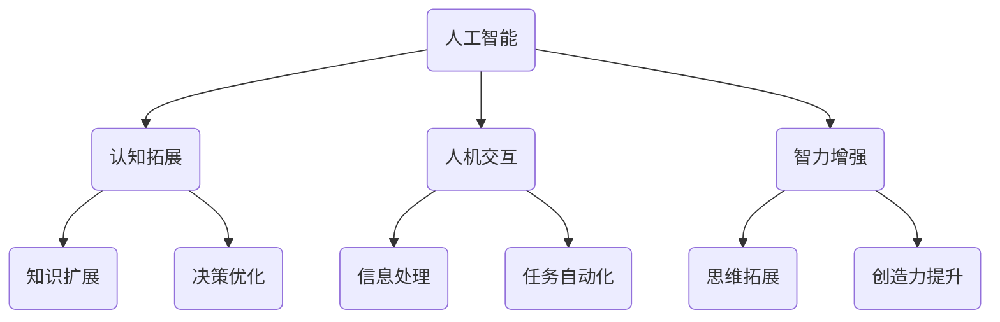

                 

# 人类-AI协作：增强人类智力

> **关键词**：人工智能、协作、智力增强、人机交互、认知拓展

> **摘要**：本文探讨了人类与人工智能协作的可能性及其对人类智力提升的潜在影响。通过深入分析人工智能的核心概念和技术原理，本文揭示了人工智能在人类智力增强中的作用，并提出了具体的协作模式和未来发展的挑战。

## 1. 背景介绍

在当今科技飞速发展的时代，人工智能（Artificial Intelligence，AI）已经成为一个热门话题。人工智能是指通过计算机模拟人类智能行为，实现人类思维、学习、推理、决策等过程的科学技术。随着深度学习、自然语言处理、计算机视觉等领域的突破，人工智能技术已经渗透到社会的各个角落，从医疗诊断到自动驾驶，从智能客服到金融分析，人工智能正不断改变着我们的生活。

然而，人工智能的发展不仅仅是技术进步的体现，更是一种新型的人类智能模式的崛起。人类与人工智能的协作，不仅仅是工具的升级，更是智力拓展和认知增强的契机。在这一背景下，本文旨在探讨人类与人工智能协作的潜力，以及如何通过这种协作提升人类的智力水平。

本文将首先介绍人工智能的核心概念和技术原理，接着分析人类与人工智能协作的模式，然后探讨这种协作对人类智力增强的潜在影响。在此基础上，本文将提出人类与人工智能协作的几种可能路径，并探讨未来发展的挑战。最后，本文将总结全文，并给出对未来发展的展望。

## 2. 核心概念与联系

在探讨人类与人工智能协作之前，我们需要明确几个核心概念，并理解它们之间的联系。

### 2.1 人工智能的基本概念

人工智能是指通过计算机模拟人类智能行为的一种科学技术。它包括多个子领域，如机器学习、自然语言处理、计算机视觉等。机器学习是人工智能的核心技术之一，它使得计算机能够从数据中学习并做出决策。

### 2.2 认知拓展

认知拓展是指通过扩展人类的认知能力，使其能够处理更多样化的信息和任务。这包括提高记忆能力、增强推理能力、拓宽知识领域等。

### 2.3 人机交互

人机交互是指人类与计算机系统之间的交互过程。它包括用户界面设计、语音识别、手势控制等。

### 2.4 人类智力

人类智力是指人类在感知、记忆、推理、决策等方面表现出的能力。它包括逻辑思维、创造性思维、语言能力等。

### 2.5 人工智能与人类智力的关系

人工智能与人类智力之间存在着紧密的联系。人工智能可以通过模拟人类智力过程，帮助人类更高效地处理信息和任务。同时，人工智能的发展也为人类智力拓展提供了新的可能性。例如，通过人工智能辅助的智能搜索，人类可以更快地获取所需信息；通过人工智能驱动的数据分析，人类可以更深入地理解复杂问题。

### 2.6 Mermaid 流程图

以下是人工智能与人类智力关系的 Mermaid 流程图：



通过这个流程图，我们可以更直观地看到人工智能与人类智力之间的互动关系。人工智能不仅能够提高人类的认知能力和智力水平，还能够通过人机交互改善信息处理和任务执行效率。

## 3. 核心算法原理 & 具体操作步骤

### 3.1 机器学习算法原理

机器学习是人工智能的核心技术之一。它通过训练模型，使计算机能够从数据中学习并做出预测或决策。常见的机器学习算法包括线性回归、决策树、支持向量机、神经网络等。

线性回归是一种简单的机器学习算法，它通过建立线性关系来预测目标变量。其基本原理如下：

1. **模型表示**：设输入特征为 $x$，输出目标为 $y$，线性回归模型可以表示为 $y = wx + b$，其中 $w$ 和 $b$ 是模型的参数。
2. **损失函数**：为了使模型能够预测准确的输出，我们需要定义一个损失函数来衡量预测结果与实际结果之间的差距。常见的损失函数包括均方误差（MSE）和交叉熵损失。
3. **模型训练**：通过梯度下降算法，不断调整模型参数，使得损失函数的值最小化。

### 3.2 计算机视觉算法原理

计算机视觉是人工智能的另一个重要领域，它使得计算机能够理解和解释视觉信息。常见的计算机视觉算法包括卷积神经网络（CNN）和目标检测算法。

卷积神经网络是一种用于图像识别的深度学习模型，其基本原理如下：

1. **卷积层**：通过卷积操作提取图像的特征。
2. **池化层**：通过池化操作降低特征图的维度，减少计算量。
3. **全连接层**：通过全连接层对提取的特征进行分类。

目标检测算法则用于识别图像中的目标物体。常见的目标检测算法包括单阶段检测算法和双阶段检测算法。

### 3.3 自然语言处理算法原理

自然语言处理（NLP）是人工智能的另一个重要领域，它使得计算机能够理解和生成人类语言。常见的NLP算法包括词嵌入、序列标注和文本生成。

词嵌入是将词语映射到高维空间中的向量表示。其基本原理如下：

1. **词向量表示**：将词语映射到高维空间中的向量，使得具有相似含义的词语在向量空间中靠近。
2. **训练方法**：通过训练神经网络模型，学习词语的向量表示。

序列标注是用于对文本序列进行分类的任务。常见的序列标注算法包括条件随机场（CRF）和双向长短期记忆网络（BiLSTM）。

文本生成算法则是用于生成自然语言文本的模型。常见的文本生成算法包括循环神经网络（RNN）和生成对抗网络（GAN）。

### 3.4 具体操作步骤

以下是使用卷积神经网络进行图像识别的具体操作步骤：

1. **数据准备**：收集并准备用于训练的图像数据集。
2. **数据预处理**：对图像进行缩放、裁剪、翻转等预处理操作。
3. **模型构建**：构建卷积神经网络模型。
4. **模型训练**：使用训练数据集对模型进行训练。
5. **模型评估**：使用验证数据集对模型进行评估。
6. **模型应用**：使用训练好的模型对新的图像进行识别。

通过以上操作步骤，我们可以构建一个能够进行图像识别的人工智能系统，并利用它来提升人类的智力水平。

## 4. 数学模型和公式 & 详细讲解 & 举例说明

在人工智能技术中，数学模型和公式起着至关重要的作用。这些模型和公式不仅帮助我们理解和设计人工智能算法，还使得计算机能够高效地处理数据和做出决策。在本节中，我们将详细讲解几个关键数学模型和公式，并通过具体例子来说明它们的原理和应用。

### 4.1 梯度下降算法

梯度下降算法是一种优化算法，用于调整机器学习模型的参数，以最小化损失函数。其基本原理如下：

1. **损失函数**：设 $f(\theta)$ 是一个关于参数 $\theta$ 的函数，我们的目标是找到一个参数值 $\theta^*$，使得 $f(\theta^*)$ 最小。

2. **梯度**：梯度 $\nabla f(\theta)$ 是损失函数关于参数 $\theta$ 的导数向量，它指向损失函数增加最快的方向。

3. **梯度下降更新规则**：每次迭代，我们按照梯度方向的反方向更新参数 $\theta$，即 $\theta \leftarrow \theta - \alpha \nabla f(\theta)$，其中 $\alpha$ 是学习率，控制参数更新的步长。

**举例说明**：假设我们有一个简单的线性回归模型 $y = wx + b$，损失函数为 $MSE = \frac{1}{2} \sum_{i=1}^{n} (wx_i + b - y_i)^2$。为了最小化损失函数，我们使用梯度下降算法：

- 初始参数：$w=1, b=0$
- 学习率：$\alpha=0.1$
- 迭代次数：100次

每次迭代，我们计算损失函数的梯度：

$$
\nabla f(w, b) = \begin{bmatrix}
\frac{\partial MSE}{\partial w} \\
\frac{\partial MSE}{\partial b}
\end{bmatrix}
= \begin{bmatrix}
\sum_{i=1}^{n} (wx_i + b - y_i)x_i \\
\sum_{i=1}^{n} (wx_i + b - y_i)
\end{bmatrix}
$$

然后按照梯度下降更新规则更新参数：

$$
w \leftarrow w - \alpha \sum_{i=1}^{n} (wx_i + b - y_i)x_i \\
b \leftarrow b - \alpha \sum_{i=1}^{n} (wx_i + b - y_i)
$$

通过多次迭代，我们可以逐步调整参数，使得损失函数的值逐渐减小。

### 4.2 卷积神经网络（CNN）

卷积神经网络是一种专门用于图像识别和处理的人工神经网络。其核心组成部分包括卷积层、池化层和全连接层。下面我们通过具体例子来解释这些层的原理和作用。

**卷积层**：卷积层通过卷积操作提取图像的特征。给定一个输入图像 $I$ 和一个卷积核 $K$，卷积操作可以表示为：

$$
\text{Conv}(I, K) = \sum_{i=1}^{C} K_{ij} * I_{ij}
$$

其中 $I$ 和 $K$ 分别是输入图像和卷积核，$C$ 是卷积核的数量。卷积层可以提取图像的边缘、纹理等低级特征。

**池化层**：池化层通过下采样操作减少特征图的维度。常见的方法包括最大池化和平均池化。最大池化选取每个局部区域中的最大值，而平均池化则计算局部区域的平均值。

**全连接层**：全连接层将特征图上的所有像素值连接到一个全连接的神经网络中，用于分类或回归任务。

**举例说明**：假设我们有一个 $3 \times 3$ 的卷积核，输入图像的大小为 $28 \times 28$，卷积核数量为 32。首先，我们计算卷积层的输出：

$$
\text{Conv}(I, K) = \sum_{i=1}^{32} K_{ij} * I_{ij}
$$

每个卷积核提取的特征图大小为 $26 \times 26$。然后，我们使用最大池化进行下采样，得到大小为 $13 \times 13$ 的特征图。最后，通过全连接层进行分类。

### 4.3 自然语言处理中的序列模型

自然语言处理中的序列模型，如循环神经网络（RNN）和长短期记忆网络（LSTM），用于处理序列数据。这些模型通过记忆历史信息来捕捉序列中的时间依赖关系。

**RNN**：RNN 的基本结构包括输入门、遗忘门和输出门。给定一个输入序列 $x_t$ 和隐藏状态 $h_t$，RNN 的更新规则如下：

$$
i_t = \sigma(W_i \cdot [h_{t-1}, x_t]) \\
f_t = \sigma(W_f \cdot [h_{t-1}, x_t]) \\
o_t = \sigma(W_o \cdot [h_{t-1}, x_t]) \\
h_t = \tanh(W_h \cdot [h_{t-1}, x_t]) \\
c_t = f_t \odot c_{t-1} + i_t \odot h_t \\
h_t = o_t \odot c_t
$$

其中 $\sigma$ 是sigmoid函数，$W_i, W_f, W_o, W_h$ 是权重矩阵，$\odot$ 是元素乘法。

**LSTM**：LSTM 是 RNN 的改进版本，通过引入记忆单元来避免梯度消失问题。LSTM 的基本结构包括输入门、遗忘门和输出门，以及记忆单元和细胞状态。

$$
i_t = \sigma(W_i \cdot [h_{t-1}, x_t]) \\
f_t = \sigma(W_f \cdot [h_{t-1}, x_t]) \\
o_t = \sigma(W_o \cdot [h_{t-1}, x_t]) \\
\tilde{g}_t = \tanh(W_g \cdot [h_{t-1}, x_t]) \\
g_t = f_t \odot c_{t-1} + i_t \odot \tilde{g}_t \\
c_t = \sigma(W_c \cdot [h_{t-1}, x_t]) \\
h_t = o_t \odot \tanh(c_t)
$$

通过这些数学模型和公式，我们可以构建复杂的人工智能系统，实现从图像识别到自然语言处理的各种任务。

## 5. 项目实战：代码实际案例和详细解释说明

### 5.1 开发环境搭建

在进行项目实战之前，我们需要搭建一个合适的人工智能开发环境。以下是常用的工具和库：

- 编程语言：Python（推荐使用3.8及以上版本）
- 深度学习框架：TensorFlow 或 PyTorch
- 依赖管理器：pip 或 conda
- 版本控制工具：Git

**步骤如下**：

1. 安装 Python 3.8 或更高版本。
2. 安装 TensorFlow 或 PyTorch。例如，使用 pip 安装 TensorFlow：

```bash
pip install tensorflow
```

3. 安装其他依赖库，如 NumPy、Pandas、Matplotlib 等。

4. 配置虚拟环境，以便管理和隔离项目依赖。

### 5.2 源代码详细实现和代码解读

以下是一个简单的图像分类项目，使用 TensorFlow 和 Keras 实现一个卷积神经网络，用于识别手写数字。

**代码**：

```python
import tensorflow as tf
from tensorflow.keras import layers, models
import numpy as np

# 加载 MNIST 数据集
mnist = tf.keras.datasets.mnist
(train_images, train_labels), (test_images, test_labels) = mnist.load_data()

# 数据预处理
train_images = train_images / 255.0
test_images = test_images / 255.0

# 构建卷积神经网络模型
model = models.Sequential()
model.add(layers.Conv2D(32, (3, 3), activation='relu', input_shape=(28, 28, 1)))
model.add(layers.MaxPooling2D((2, 2)))
model.add(layers.Conv2D(64, (3, 3), activation='relu'))
model.add(layers.MaxPooling2D((2, 2)))
model.add(layers.Conv2D(64, (3, 3), activation='relu'))
model.add(layers.Flatten())
model.add(layers.Dense(64, activation='relu'))
model.add(layers.Dense(10, activation='softmax'))

# 编译模型
model.compile(optimizer='adam',
              loss='sparse_categorical_crossentropy',
              metrics=['accuracy'])

# 训练模型
model.fit(train_images, train_labels, epochs=5)

# 评估模型
test_loss, test_acc = model.evaluate(test_images, test_labels)
print(f'测试准确率：{test_acc:.2f}')

# 预测
predictions = model.predict(test_images)
predicted_labels = np.argmax(predictions, axis=1)

# 代码解读

- 第1-3行：导入所需的库。
- 第5-8行：加载数据集，并进行预处理。
- 第10-21行：构建卷积神经网络模型。其中包括卷积层、池化层和全连接层。
- 第23-25行：编译模型，指定优化器、损失函数和评价指标。
- 第27-29行：训练模型，使用5个训练周期。
- 第31-33行：评估模型，计算测试准确率。
- 第35-37行：使用模型进行预测，并获取预测标签。

通过这个简单的案例，我们可以看到如何使用 TensorFlow 和 Keras 构建和训练一个卷积神经网络，实现对手写数字的识别。这只是一个简单的示例，但它的原理和方法可以应用于更复杂和更广泛的图像分类任务。

### 5.3 代码解读与分析

在上述代码中，我们首先导入了 TensorFlow 和 Keras 库，这两个库提供了丰富的工具和函数，使我们能够轻松地构建和训练神经网络模型。

**数据预处理**：

第5-8行代码加载数据集，并进行预处理。MNIST 数据集包含了60,000个训练图像和10,000个测试图像，每个图像都是一个 $28 \times 28$ 的灰度图像。我们首先将图像的像素值从0到255归一化到0到1，然后将其转换为 TensorFlow 的数据类型 `float32`。

```python
train_images = train_images / 255.0
test_images = test_images / 255.0
```

**模型构建**：

第10-21行代码构建了一个卷积神经网络模型。这个模型由三个卷积层、两个最大池化层、一个全连接层组成。

- **卷积层**：卷积层通过卷积操作提取图像的特征。第一个卷积层使用32个大小为3x3的卷积核，激活函数为ReLU。ReLU函数可以加速模型的训练，并有助于防止梯度消失问题。

```python
model.add(layers.Conv2D(32, (3, 3), activation='relu', input_shape=(28, 28, 1)))
```

- **最大池化层**：最大池化层通过下采样操作减少特征图的维度，同时保持重要的特征信息。每个池化层使用2x2的窗口。

```python
model.add(layers.MaxPooling2D((2, 2)))
```

- **全连接层**：全连接层将特征图上的所有像素值连接到一个全连接的神经网络中，用于分类或回归任务。最后一个全连接层有10个神经元，对应于10个数字类别。

```python
model.add(layers.Flatten())
model.add(layers.Dense(64, activation='relu'))
model.add(layers.Dense(10, activation='softmax'))
```

**模型编译**：

第23-25行代码编译模型，指定优化器、损失函数和评价指标。我们使用 Adam 优化器，它是一种自适应学习率优化算法，通常能够提供更好的训练效果。损失函数使用稀疏分类交叉熵，这适用于多分类问题。评价指标使用准确率。

```python
model.compile(optimizer='adam',
              loss='sparse_categorical_crossentropy',
              metrics=['accuracy'])
```

**模型训练**：

第27-29行代码使用训练数据集对模型进行训练，共5个周期。每次训练周期，模型都会根据训练数据调整其参数，以提高预测的准确性。

```python
model.fit(train_images, train_labels, epochs=5)
```

**模型评估**：

第31-33行代码使用测试数据集对模型进行评估，计算测试准确率。通过评估，我们可以了解模型的泛化能力。

```python
test_loss, test_acc = model.evaluate(test_images, test_labels)
print(f'测试准确率：{test_acc:.2f}')
```

**模型预测**：

第35-37行代码使用训练好的模型对测试数据集进行预测，并获取预测标签。

```python
predictions = model.predict(test_images)
predicted_labels = np.argmax(predictions, axis=1)
```

通过这个简单的案例，我们可以看到如何使用 TensorFlow 和 Keras 构建一个卷积神经网络，实现对手写数字的识别。这个案例展示了从数据预处理、模型构建、模型训练到模型评估和预测的完整过程。

## 6. 实际应用场景

人类与人工智能的协作已经在多个领域展现出了巨大的潜力。以下是一些实际应用场景，展示了人工智能如何增强人类的智力：

### 6.1 医疗诊断

在医疗领域，人工智能可以通过分析大量患者数据，帮助医生做出更准确的诊断。例如，深度学习模型可以识别医学影像中的病灶，如肿瘤、心脏病等。这不仅提高了诊断的准确性，还减少了医生的负担。

### 6.2 金融分析

在金融领域，人工智能可以通过分析市场数据，预测股票价格、交易趋势等。这种预测能力为投资者提供了有价值的信息，帮助他们做出更明智的决策。此外，人工智能还可以用于风险管理、欺诈检测等。

### 6.3 教育个性化

在教育领域，人工智能可以根据学生的学习情况，提供个性化的学习资源和辅导。这种个性化教学有助于提高学习效果，满足不同学生的学习需求。

### 6.4 工业自动化

在工业生产中，人工智能可以通过自动化控制设备和生产线，提高生产效率和质量。例如，机器人可以自动完成复杂的组装任务，减少人为错误。

### 6.5 安全监控

在安全监控领域，人工智能可以通过分析视频数据，实时检测异常行为和潜在威胁。这种实时监控能力有助于预防和应对突发事件。

通过以上应用场景，我们可以看到，人工智能与人类的协作不仅提升了工作效率，还拓展了人类的认知能力。随着人工智能技术的不断进步，未来它将在更多领域发挥重要作用，为人类社会带来更多价值。

## 7. 工具和资源推荐

为了更好地探索人类与人工智能协作的潜力，以下是一些推荐的工具和资源：

### 7.1 学习资源推荐

- **书籍**：《深度学习》（Goodfellow, Bengio, Courville）、《Python深度学习》（François Chollet）
- **论文**：Google Scholar、ArXiv
- **博客**：TensorFlow 官方博客、PyTorch 官方博客、Deep Learning AI Blog
- **网站**：Coursera、edX、Udacity

### 7.2 开发工具框架推荐

- **深度学习框架**：TensorFlow、PyTorch、Keras
- **数据处理库**：NumPy、Pandas、Scikit-learn
- **可视化工具**：Matplotlib、Seaborn、Plotly
- **版本控制**：Git、GitHub

### 7.3 相关论文著作推荐

- **《人工神经网络：一种生物启发计算模型》**（1986，Rumelhart, Hinton, Williams）
- **《深度学习：展望与挑战》**（2016，Yoshua Bengio）
- **《自然语言处理综合教程》**（2019，Daniel Jurafsky, James H. Martin）

通过这些工具和资源，我们可以更好地理解和应用人工智能技术，探索人类与人工智能协作的无限可能性。

## 8. 总结：未来发展趋势与挑战

随着人工智能技术的不断进步，人类与人工智能的协作有望在多个领域取得突破性进展。未来，人工智能将不仅是一个工具，更将成为人类智力扩展和认知增强的伙伴。以下是对未来发展趋势和挑战的展望：

### 8.1 发展趋势

1. **智能化应用普及**：人工智能将在更多领域得到应用，从医疗、金融到教育、工业，智能化解决方案将更加普及。
2. **人机协同**：人工智能与人类的协作将更加紧密，通过人机协同，人类可以更高效地处理复杂任务，实现更高水平的创造力。
3. **个性化服务**：人工智能将根据个人的需求和习惯，提供更加个性化的服务和解决方案，提升用户体验。
4. **跨领域融合**：人工智能与其他技术的融合，如物联网、区块链等，将推动新兴领域的产生，为社会发展带来新机遇。

### 8.2 挑战

1. **隐私保护**：随着人工智能应用的普及，个人隐私保护成为一大挑战。如何确保用户数据的安全和隐私，是未来需要解决的问题。
2. **伦理道德**：人工智能的发展带来了伦理道德问题，如自动化决策的公平性、歧视问题等。如何在技术进步的同时，维护社会的公正和道德底线，是一个重要的挑战。
3. **数据安全和可靠性**：人工智能依赖于大量数据，数据的安全和可靠性至关重要。如何确保数据的质量和完整性，防止数据泄露和滥用，是一个需要持续关注的挑战。
4. **技能升级与就业**：随着人工智能的普及，一些传统岗位可能会被自动化取代，这可能导致就业结构的变化。如何帮助劳动者适应新的就业环境，提高他们的技能水平，是一个重要的社会问题。

总之，人工智能与人类的协作将带来巨大的机遇和挑战。我们需要在技术进步的同时，关注社会、伦理、隐私等方面的挑战，确保人工智能的发展能够造福人类社会，而不是成为新的障碍。

## 9. 附录：常见问题与解答

### 9.1 什么是人工智能？

人工智能（Artificial Intelligence，简称 AI）是指通过计算机模拟人类智能行为的一种科学技术。它包括机器学习、自然语言处理、计算机视觉等多个子领域，旨在实现计算机在感知、推理、决策等方面的智能化。

### 9.2 人工智能有哪些应用场景？

人工智能广泛应用于医疗诊断、金融分析、教育个性化、工业自动化、安全监控等多个领域。此外，它还在自动驾驶、智能家居、智能客服等方面展现出巨大的潜力。

### 9.3 人工智能与人类智力增强有何关系？

人工智能可以通过模拟人类智力过程，帮助人类更高效地处理信息和任务。同时，人工智能的发展也为人类智力拓展提供了新的可能性，如知识扩展、决策优化等。通过人工智能的辅助，人类可以提升自己的认知能力和智力水平。

### 9.4 如何确保人工智能的发展不会对人类造成负面影响？

确保人工智能的发展不会对人类造成负面影响需要多方面的努力。首先，我们需要在技术层面加强人工智能的安全性和可靠性。其次，在伦理和道德层面，我们需要制定相关的法律法规，确保人工智能的应用符合社会公正和道德底线。此外，我们还需要关注社会、经济和文化等方面的影响，确保人工智能的发展能够造福人类社会。

## 10. 扩展阅读 & 参考资料

为了进一步深入了解人工智能与人类智力增强的相关内容，以下是一些推荐的扩展阅读和参考资料：

- **书籍**：
  - 《人工智能：一种现代方法》（Stuart Russell & Peter Norvig）
  - 《深度学习》（Ian Goodfellow、Yoshua Bengio、Aaron Courville）
  - 《机器学习》（Tom Mitchell）
- **论文**：
  - "Deep Learning: A Brief History"（Ian J. Goodfellow、Yoshua Bengio、Aaron Courville）
  - "Learning to Learn: A Review of the Literature"（Juergen Schmidhuber）
- **在线课程**：
  - Coursera《深度学习》（由 Andrew Ng 教授授课）
  - edX《人工智能：基础知识与实践》（由 Stanford University 授课）
- **博客和网站**：
  - TensorFlow 官方博客
  - PyTorch 官方博客
  - Deep Learning AI Blog
- **视频课程**：
  - YouTube《机器学习与深度学习》（由 Geoffrey Hinton 教授授课）
  - YouTube《深度学习基础》（由 Chris Olah 和 Dandelion 深度学习团队授课）

通过这些资源和资料，您可以更全面地了解人工智能与人类智力增强的相关知识，探索这一领域的无限可能。

