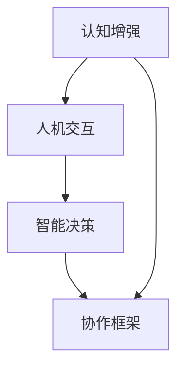

                 

### 背景介绍

人类-AI协作，是指人类与人工智能系统之间的协同工作，旨在通过人工智能技术增强人类的认知能力、工作效率和创新潜力。在过去的几十年里，随着人工智能技术的迅猛发展，特别是在深度学习、自然语言处理、计算机视觉等领域的突破，人类-AI协作逐渐成为各个行业和领域的研究热点和应用方向。

当前，人类-AI协作的应用场景已经涵盖了众多领域，如医疗、金融、教育、制造业等。通过AI技术的辅助，人类在复杂问题求解、数据处理、决策制定等方面获得了显著的提升。例如，在医疗领域，AI可以帮助医生进行疾病诊断、治疗方案推荐等；在金融领域，AI可以用于风险控制、投资策略制定等；在教育领域，AI可以辅助教师进行个性化教学、学生学习情况分析等。

然而，随着AI技术的不断进步，人类-AI协作也面临着一系列挑战和机遇。首先，如何更好地实现人类与AI之间的信息传递和协作效率是一个关键问题。当前，尽管已经有许多AI助手和系统，但它们在实际应用中仍然难以完全理解人类的意图和需求，需要人类进行大量的监督和调整。其次，AI的透明性和可解释性问题也是一个重要的挑战，尤其是在涉及安全和伦理的领域。最后，如何确保AI系统的稳定性和鲁棒性，避免因为算法错误或数据偏差导致严重后果，也是需要深入探讨的问题。

在此背景下，本文将探讨人类-AI协作的发展趋势，分析其中的机遇和挑战，并预测未来可能的发展方向。通过深入研究和分析，我们希望能够为相关领域的研究者和从业者提供有价值的参考和启示。

### 人类-AI协作的定义、历史与发展

#### 定义

人类-AI协作，即人机协作，是指人类与人工智能系统共同工作、相互补充的过程。在这个协作过程中，人类和AI各自发挥自身优势，共同完成复杂的任务，从而提高工作效率、拓展认知能力。人类在协作中负责制定策略、进行决策，而AI则负责数据分析和处理、执行具体操作。

#### 历史

人类-AI协作的历史可以追溯到20世纪中叶。随着计算机技术的进步，人们开始探索计算机辅助设计、计算机编程等领域的应用。20世纪80年代，专家系统的出现使得人类-AI协作在医疗、金融等领域取得了初步成功。进入21世纪，随着深度学习、自然语言处理等人工智能技术的发展，人类-AI协作进入了一个新的阶段。

#### 发展

1. **早期阶段（20世纪中叶至20世纪末）**：在这一阶段，人类-AI协作主要集中在计算机辅助设计、计算机编程等领域。这一时期，AI技术相对简单，主要应用于规则驱动的问题求解。

2. **快速发展阶段（21世纪初至今）**：21世纪初，随着深度学习、自然语言处理等技术的突破，人类-AI协作得到了迅速发展。在这一阶段，AI在图像识别、语音识别、语言翻译等方面的表现逐渐超越人类，人类-AI协作开始广泛应用于各个领域。

3. **未来趋势**：随着量子计算、脑机接口等前沿技术的不断发展，人类-AI协作有望实现更深层次的融合。未来，人类-AI协作将更加智能化、个性化，AI将更好地理解人类的需求和意图，实现真正的无缝协作。

#### 主要发展里程碑

- **20世纪50年代**：计算机科学之父艾伦·图灵提出图灵测试，标志着人工智能研究的开始。
- **20世纪80年代**：专家系统的出现，使得人类-AI协作在医疗、金融等领域初步应用。
- **21世纪初**：深度学习技术的突破，使得AI在图像识别、语音识别等领域取得重大进展。
- **2020年至今**：自然语言处理、计算机视觉等技术的发展，使得人类-AI协作在各个领域广泛应用。

#### 现状

当前，人类-AI协作已经广泛应用于医疗、金融、教育、制造业等各个领域，成为提高生产效率、优化决策的重要手段。例如，在医疗领域，AI可以帮助医生进行疾病诊断、治疗方案推荐；在金融领域，AI可以用于风险管理、投资策略制定；在教育领域，AI可以辅助教师进行个性化教学、学生学习情况分析等。

尽管人类-AI协作取得了显著成果，但仍面临诸多挑战，如信息传递效率、AI的透明性和可解释性、稳定性和鲁棒性等。未来，随着技术的不断发展，人类-AI协作有望在更广泛的领域实现更深层次的融合，为人类社会带来更多机遇和挑战。

### 核心概念与联系

在探讨人类-AI协作的发展趋势之前，有必要先了解几个核心概念，并分析它们之间的联系。这些核心概念包括：认知增强、人机交互、智能决策和协作框架。

#### 认知增强

认知增强是指通过技术手段提升人类认知能力的过程。在人类-AI协作中，认知增强主要体现在以下几个方面：

1. **数据分析与处理**：AI系统可以处理海量数据，帮助人类快速提取有用信息，从而提升决策效率。
2. **模式识别与预测**：AI系统具有较强的模式识别能力，可以帮助人类发现潜在趋势，进行预测分析。
3. **自动化决策**：AI系统可以自动化执行某些决策任务，减轻人类负担，使人类能够专注于更高层次的决策。

#### 人机交互

人机交互是指人类与计算机或其他智能系统之间的交互过程。在人类-AI协作中，人机交互的目的是确保人类与AI系统能够高效、顺畅地沟通和协作。人机交互的关键在于：

1. **自然语言理解**：AI系统需要能够理解人类语言，包括文本、语音等多种形式，从而更好地满足人类需求。
2. **智能反馈**：AI系统需要能够根据人类行为和反馈进行自适应调整，以提高协作效率。
3. **可解释性**：为了增强人类对AI系统的信任，AI系统需要具备一定的可解释性，使人类能够理解其工作原理和决策过程。

#### 智能决策

智能决策是指基于数据分析、模型预测和人工智能技术，实现高效、准确的决策过程。在人类-AI协作中，智能决策主要体现在以下几个方面：

1. **数据驱动**：通过分析海量数据，发现潜在规律和趋势，为决策提供依据。
2. **模型优化**：利用机器学习和深度学习等技术，构建和优化决策模型，提高决策准确性。
3. **协同决策**：人类和AI系统共同参与决策过程，利用各自的优势，实现最优决策。

#### 协作框架

协作框架是指人类与AI系统之间的协作结构和流程。在人类-AI协作中，协作框架的目的是确保人类和AI系统能够高效、有序地工作。协作框架通常包括以下几个部分：

1. **任务分配**：根据人类和AI系统的能力，合理分配任务，确保协作效率。
2. **信息共享**：建立信息共享平台，确保人类和AI系统能够及时获取所需信息。
3. **反馈机制**：建立反馈机制，使人类和AI系统能够根据协作效果进行自适应调整。

#### Mermaid 流程图

为了更清晰地展示这几个核心概念之间的联系，我们使用Mermaid绘制了一个流程图，如下所示：



在这个流程图中，认知增强作为基础，为人机交互和智能决策提供了支持；人机交互则是连接人类与AI系统的桥梁，确保协作过程的顺畅；智能决策则基于认知增强和人机交互，实现高效的决策过程；协作框架则对整个协作过程进行组织和管理，确保协作的有序进行。

通过上述核心概念和流程图的分析，我们可以更好地理解人类-AI协作的内涵和实质，为后续的探讨和发展趋势预测提供了基础。

### 核心算法原理 & 具体操作步骤

在人类-AI协作中，核心算法原理是确保协作高效、准确的关键。以下我们将介绍几种常用的核心算法原理，并详细描述其具体操作步骤。

#### 1. 深度学习算法

深度学习算法是目前人工智能领域的重要分支，其核心原理是通过多层神经网络模拟人类大脑的学习过程，从而实现数据的自动特征提取和模式识别。以下是深度学习算法的具体操作步骤：

1. **数据预处理**：对输入数据进行清洗、归一化等处理，确保数据质量。
2. **构建神经网络模型**：选择合适的神经网络结构，如卷积神经网络（CNN）、循环神经网络（RNN）等，并初始化模型参数。
3. **模型训练**：通过反向传播算法和优化算法（如梯度下降、Adam优化器等），不断调整模型参数，使模型在训练数据上达到较好的性能。
4. **模型评估**：使用验证集对训练好的模型进行评估，调整模型参数以优化性能。
5. **模型部署**：将训练好的模型部署到实际应用场景中，进行数据分析和预测。

#### 2. 自然语言处理算法

自然语言处理（NLP）算法用于理解和生成人类语言，其核心原理是通过深度学习、统计模型等方法对文本数据进行分析和处理。以下是自然语言处理算法的具体操作步骤：

1. **数据预处理**：对文本数据进行分词、词性标注、停用词过滤等处理，提取文本特征。
2. **构建NLP模型**：选择合适的NLP模型，如词向量模型（Word2Vec、GloVe）、序列模型（RNN、LSTM）等，并初始化模型参数。
3. **模型训练**：通过反向传播算法和优化算法，调整模型参数，使模型在训练数据上达到较好的性能。
4. **模型评估**：使用验证集对训练好的模型进行评估，调整模型参数以优化性能。
5. **模型部署**：将训练好的模型部署到实际应用场景中，进行文本分析和生成。

#### 3. 强化学习算法

强化学习（Reinforcement Learning）算法是一种通过试错和反馈进行学习的方法，其核心原理是通过与环境交互，不断优化策略，以实现最佳行动选择。以下是强化学习算法的具体操作步骤：

1. **定义环境与状态**：明确问题的环境状态，如游戏界面、机器人传感器数据等。
2. **定义动作与奖励**：根据问题需求，定义可执行的动作和相应的奖励机制。
3. **选择学习算法**：选择合适的强化学习算法，如Q-Learning、SARSA、Deep Q-Network（DQN）等。
4. **模型训练**：通过与环境交互，不断调整策略，使模型在训练过程中逐步优化。
5. **模型评估**：使用测试集对训练好的模型进行评估，验证策略的有效性。
6. **模型部署**：将训练好的模型部署到实际应用场景中，实现自主决策和行动。

#### 4. 聚类算法

聚类算法用于将数据集划分为若干个簇，以实现数据分析和模式识别。常见的聚类算法包括K-Means、DBSCAN等。以下是K-Means聚类算法的具体操作步骤：

1. **选择聚类数目**：根据数据分布和需求，选择合适的聚类数目k。
2. **初始化中心点**：随机选择k个数据点作为初始聚类中心。
3. **分配数据点**：将数据点分配到最近的聚类中心，形成初始聚类结果。
4. **更新中心点**：根据当前聚类结果，重新计算聚类中心。
5. **迭代优化**：重复步骤3和步骤4，直到聚类中心不再发生变化或达到预设的迭代次数。

通过上述核心算法原理和具体操作步骤的介绍，我们可以更好地理解人类-AI协作中的技术实现方法。在实际应用中，根据具体问题和需求，可以选择合适的核心算法进行协作，以实现高效、准确的人类-AI协作。

### 数学模型和公式 & 详细讲解 & 举例说明

在人类-AI协作中，数学模型和公式扮演着至关重要的角色，它们不仅帮助定义问题，还提供了解决问题的具体方法。以下我们将介绍几个常用的数学模型和公式，并进行详细讲解和举例说明。

#### 1. 梯度下降算法

梯度下降算法是一种优化方法，用于最小化损失函数。其核心公式为：

\[ w_{\text{new}} = w_{\text{current}} - \alpha \cdot \nabla_w J(w) \]

其中，\( w \) 代表模型参数，\( \alpha \) 为学习率，\( \nabla_w J(w) \) 为损失函数 \( J(w) \) 关于 \( w \) 的梯度。

**例子**：假设我们有一个简单的线性回归模型，其损失函数为：

\[ J(w) = \frac{1}{2} \sum_{i=1}^{n} (y_i - w \cdot x_i)^2 \]

其中，\( y_i \) 为实际输出，\( x_i \) 为输入特征，\( w \) 为模型参数。

要最小化该损失函数，我们可以使用梯度下降算法：

\[ w_{\text{new}} = w_{\text{current}} - \alpha \cdot \nabla_w J(w) \]

#### 2. 神经网络反向传播算法

神经网络反向传播算法是一种用于训练神经网络的方法。其核心公式为：

\[ \Delta w = \nabla_w L \cdot \nabla_w \sigma \]

其中，\( L \) 为损失函数，\( \sigma \) 为激活函数的导数。

**例子**：假设我们有一个简单的两层神经网络，其损失函数为：

\[ L = \frac{1}{2} \sum_{i=1}^{n} (y_i - \sigma(z_i))^2 \]

其中，\( y_i \) 为实际输出，\( z_i \) 为神经网络的输出，\( \sigma \) 为ReLU激活函数。

要训练该神经网络，我们可以使用反向传播算法：

\[ \Delta w = \nabla_w L \cdot \nabla_w \sigma \]

#### 3. 贝叶斯优化

贝叶斯优化是一种用于超参数调优的方法。其核心公式为：

\[ \pi(\theta) = \frac{p(f(\theta)|D) \cdot p(D)}{p(f(\theta)|D, \theta) \cdot p(\theta)} \]

其中，\( \theta \) 为超参数，\( f(\theta) \) 为目标函数，\( D \) 为数据集。

**例子**：假设我们要优化一个神经网络的隐藏层大小，目标函数为：

\[ f(\theta) = \frac{1}{2} \sum_{i=1}^{n} (y_i - \sigma(z_i))^2 \]

其中，\( y_i \) 为实际输出，\( z_i \) 为神经网络的输出，\( \sigma \) 为ReLU激活函数。

要使用贝叶斯优化方法进行超参数调优，我们可以按照以下步骤：

1. **初始化超参数分布**：根据先验知识，初始化超参数分布。
2. **选择采样点**：根据超参数分布，选择采样点进行目标函数评估。
3. **更新超参数分布**：根据采样点的评估结果，更新超参数分布。
4. **重复步骤2和步骤3**，直到找到最优超参数。

#### 4. 马尔可夫决策过程

马尔可夫决策过程（MDP）是一种用于解决动态规划问题的模型。其核心公式为：

\[ V^*(s) = \max_a \{ \gamma \cdot \sum_{s'} p(s' | s, a) \cdot V^*(s') \} \]

其中，\( s \) 为状态，\( a \) 为动作，\( \gamma \) 为折扣因子，\( p(s' | s, a) \) 为状态转移概率。

**例子**：假设我们有一个简单的MDP，其中状态为\( s = \{0, 1, 2\} \)，动作集为\( a = \{U, D\} \)，状态转移概率如下：

\[ p(s' = 1 | s = 0, a = U) = 0.5, \quad p(s' = 2 | s = 0, a = D) = 0.5 \]
\[ p(s' = 0 | s = 1, a = U) = 0.3, \quad p(s' = 2 | s = 1, a = D) = 0.7 \]
\[ p(s' = 1 | s = 2, a = U) = 0.2, \quad p(s' = 0 | s = 2, a = D) = 0.8 \]

其中，\( \gamma = 0.9 \)。

要使用MDP求解最优策略，我们可以按照以下步骤：

1. **初始化值函数**：初始化所有状态的价值函数。
2. **迭代更新值函数**：根据状态转移概率和奖励函数，迭代更新值函数。
3. **确定最优策略**：根据值函数，确定每个状态下的最优动作。

通过上述数学模型和公式的介绍，我们可以更好地理解人类-AI协作中的数学原理和方法。在实际应用中，根据具体问题和需求，可以选择合适的方法进行协作，以实现高效、准确的人类-AI协作。

### 项目实战：代码实际案例和详细解释说明

为了更好地展示人类-AI协作的实际应用，我们将通过一个具体的实战项目——基于深度学习的图像分类项目，来详细讲解代码的实现过程以及每个步骤的功能和作用。该项目将使用Python和TensorFlow框架进行开发，目标是将输入的图像分类为不同的类别。

#### 开发环境搭建

在开始项目之前，我们需要搭建一个适合深度学习开发的Python环境。以下是具体的步骤：

1. **安装Python**：前往Python官网下载安装包并安装Python 3.x版本。
2. **安装TensorFlow**：在命令行中执行以下命令安装TensorFlow：

\[ pip install tensorflow \]

3. **安装其他依赖**：根据项目需求，安装其他必要的库，如NumPy、Pandas、Matplotlib等。

#### 源代码详细实现和代码解读

以下是一个简单的基于深度学习的图像分类项目的源代码实现：

```python
import tensorflow as tf
from tensorflow.keras import layers
from tensorflow.keras.preprocessing.image import ImageDataGenerator

# 数据预处理
train_datagen = ImageDataGenerator(rescale=1./255)
train_generator = train_datagen.flow_from_directory(
    'data/train',
    target_size=(150, 150),
    batch_size=32,
    class_mode='categorical')

# 构建模型
model = tf.keras.Sequential([
    layers.Conv2D(32, (3, 3), activation='relu', input_shape=(150, 150, 3)),
    layers.MaxPooling2D(2, 2),
    layers.Conv2D(64, (3, 3), activation='relu'),
    layers.MaxPooling2D(2, 2),
    layers.Conv2D(128, (3, 3), activation='relu'),
    layers.MaxPooling2D(2, 2),
    layers.Conv2D(128, (3, 3), activation='relu'),
    layers.MaxPooling2D(2, 2),
    layers.Flatten(),
    layers.Dense(512, activation='relu'),
    layers.Dense(10, activation='softmax')
])

# 编译模型
model.compile(loss='categorical_crossentropy',
              optimizer=tf.keras.optimizers.Adam(),
              metrics=['accuracy'])

# 训练模型
model.fit(train_generator, steps_per_epoch=100, epochs=20)

# 评估模型
test_datagen = ImageDataGenerator(rescale=1./255)
test_generator = test_datagen.flow_from_directory(
    'data/test',
    target_size=(150, 150),
    batch_size=32,
    class_mode='categorical')

model.evaluate(test_generator)
```

#### 代码解读与分析

1. **导入库**：首先导入所需的库，包括TensorFlow和Keras模块，以及图像处理库ImageDataGenerator。

2. **数据预处理**：使用ImageDataGenerator对训练数据集进行预处理，包括图像的缩放和批量处理。这里将图像缩放为150x150像素，并将像素值缩放到0-1之间，以适应深度学习模型。

3. **构建模型**：使用Keras的Sequential模型构建一个简单的卷积神经网络（CNN）。模型包括多个卷积层和池化层，用于提取图像特征，以及全连接层用于分类。最后，使用softmax激活函数输出概率分布。

4. **编译模型**：设置模型的损失函数、优化器和评估指标。这里使用categorical_crossentropy作为损失函数，Adam优化器和accuracy作为评估指标。

5. **训练模型**：使用fit方法训练模型，将训练数据集传递给模型，设置训练轮数和每个轮次的批量大小。

6. **评估模型**：使用evaluate方法对测试数据集进行评估，输出模型的损失和准确率。

通过以上实战项目的代码实现，我们可以看到如何使用深度学习技术进行图像分类。每个步骤都有明确的函数和作用，使得代码易于理解和实现。在实际应用中，可以根据需求调整模型结构和超参数，以获得更好的分类效果。

### 实际应用场景

人类-AI协作在各个行业和领域中的应用已经越来越广泛，以下我们将探讨几个典型的实际应用场景，并分析其在不同领域的应用效果和优势。

#### 1. 医疗领域

在医疗领域，人类-AI协作已经展现出巨大的潜力。通过AI技术，可以实现疾病诊断、病情预测、个性化治疗等。例如，AI可以分析患者的病史、基因数据和实验室检测结果，帮助医生做出更准确的诊断。此外，AI还可以预测患者的病情发展趋势，为医生制定个性化治疗方案提供支持。

**应用效果和优势**：AI在医疗领域的应用显著提高了诊断的准确性和效率，减少了医生的负担。同时，通过大数据分析和机器学习算法，AI能够发现潜在的疾病关联，为疾病预防和控制提供科学依据。然而，AI在医疗领域也面临一些挑战，如数据隐私和安全、算法透明性等问题。

#### 2. 金融领域

在金融领域，人类-AI协作主要用于风险管理、投资决策和客户服务等方面。AI可以通过分析海量市场数据，预测市场走势，为投资决策提供支持。此外，AI还可以自动化处理客户服务请求，提高服务质量。

**应用效果和优势**：AI在金融领域的应用大大提高了风险控制和投资决策的准确性，降低了运营成本。通过自然语言处理技术，AI能够自动化处理客户服务请求，提高客户满意度。然而，AI在金融领域的应用也面临一些挑战，如算法透明性、公平性和合规性等问题。

#### 3. 教育领域

在教育领域，人类-AI协作可以帮助教师进行个性化教学、学生学习情况分析和教育资源共享。AI可以通过分析学生的学习行为和成绩数据，为教师提供教学建议和策略。此外，AI还可以创建个性化学习路径，帮助学生更好地掌握知识。

**应用效果和优势**：AI在教育领域的应用提高了教学质量和学习效率，使教育更加个性化和精准。通过智能辅导系统，AI可以为学生提供实时反馈和支持，帮助他们克服学习困难。然而，AI在教育领域的应用也面临一些挑战，如教育公平、教师角色变化等问题。

#### 4. 制造业领域

在制造业领域，人类-AI协作主要用于生产优化、设备维护和质量管理等方面。AI可以通过实时监测设备状态和生产数据，预测设备故障和维护需求，从而提高生产效率和设备利用率。此外，AI还可以优化生产流程，降低成本。

**应用效果和优势**：AI在制造业领域的应用显著提高了生产效率和产品质量，减少了设备故障率。通过智能监控系统，AI可以实时检测生产过程中的异常情况，并及时采取措施。然而，AI在制造业领域的应用也面临一些挑战，如数据安全、算法可靠性和员工技能提升等问题。

总之，人类-AI协作在各个领域的应用都取得了显著成果，但同时也面临一系列挑战。未来，随着技术的不断发展和应用场景的拓展，人类-AI协作有望在更多领域发挥重要作用，为人类社会带来更多价值。

### 工具和资源推荐

为了更好地进行人类-AI协作，掌握相关的工具和资源是非常必要的。以下我们将推荐一些学习资源、开发工具和相关论文著作，以帮助读者深入了解和实际操作人类-AI协作。

#### 1. 学习资源推荐

**书籍**：

- **《深度学习》（Deep Learning）**：由Ian Goodfellow、Yoshua Bengio和Aaron Courville合著的深度学习经典教材，详细介绍了深度学习的基础理论和实践方法。
- **《Python深度学习》（Python Deep Learning）**：由François Chollet撰写的书籍，涵盖了深度学习在Python中的实现和应用。
- **《强化学习》（Reinforcement Learning: An Introduction）**：由Richard S. Sutton和Andrew G. Barto合著，全面介绍了强化学习的基本概念和方法。

**论文**：

- **“Deep Learning for Text Classification”**：这篇论文介绍了深度学习在文本分类中的应用，涵盖了多种文本处理技术和模型结构。
- **“A Theoretically Grounded Application of Dropout in Recurrent Neural Networks”**：这篇论文探讨了在循环神经网络中应用Dropout的方法，提高了模型的泛化能力。

**博客**：

- **TensorFlow官方博客**：提供了丰富的TensorFlow教程和案例，适合初学者和进阶者。
- **AI技术博客**：收集了众多人工智能领域的最新研究成果和应用案例，涵盖了深度学习、自然语言处理、计算机视觉等多个领域。

#### 2. 开发工具推荐

**开发环境**：

- **TensorFlow**：一款由Google开发的深度学习框架，支持多种编程语言和平台，适合进行深度学习和人机协作项目。
- **PyTorch**：一款由Facebook开发的深度学习框架，以其灵活性和动态计算图著称，适用于研究型项目和应用开发。

**集成开发环境（IDE）**：

- **Visual Studio Code**：一款轻量级、开源的跨平台IDE，支持多种编程语言和深度学习框架，适合编写和调试代码。
- **Jupyter Notebook**：一款基于Web的交互式计算环境，支持Python、R等多种编程语言，适合数据分析和可视化。

**数据预处理工具**：

- **Pandas**：一款强大的数据处理库，支持数据清洗、合并、重塑等多种操作。
- **NumPy**：一款高性能的数学库，提供矩阵运算、数据处理等功能。

#### 3. 相关论文著作推荐

**经典论文**：

- **“Learning to Represent Hierarchical Text Structures with Recurrent Neural Networks”**：这篇论文介绍了使用循环神经网络（RNN）处理层次化文本结构的方法。
- **“Attention Is All You Need”**：这篇论文提出了Transformer模型，彻底改变了自然语言处理领域。

**著作**：

- **《人工智能：一种现代方法》（Artificial Intelligence: A Modern Approach）**：这是一本全面的人工智能教材，涵盖了人工智能的基本概念、算法和技术。
- **《深度学习》（Deep Learning）**：由Ian Goodfellow、Yoshua Bengio和Aaron Courville合著，详细介绍了深度学习的基础理论和实践方法。

通过上述推荐的学习资源、开发工具和相关论文著作，读者可以更全面地了解人类-AI协作的理论和实践，为自己的研究和工作提供有力支持。

### 总结：未来发展趋势与挑战

随着人工智能技术的不断发展，人类-AI协作在未来将迎来更多的发展机遇和挑战。以下我们将探讨未来人类-AI协作的可能发展趋势和面临的挑战。

#### 发展趋势

1. **更紧密的融合**：未来，人类-AI协作将更加紧密，AI将更好地理解人类的需求和意图，实现更深层次的协作。通过自然语言处理、语音识别等技术，AI将能够更准确地捕捉和理解人类的语言表达，从而提高协作效率。

2. **智能化的决策支持**：随着机器学习和深度学习算法的进步，AI将能够为人类提供更加智能化的决策支持。例如，在医疗、金融等领域，AI可以基于大量数据进行分析和预测，为人类提供更加精准和高效的决策依据。

3. **多元化的应用场景**：人类-AI协作的应用场景将不断拓展，从传统的医疗、金融、教育等领域，延伸到制造业、交通运输、智能城市等多个领域。AI将能够在这些领域中发挥更大的作用，提高生产效率、优化资源配置。

4. **增强现实与虚拟现实的结合**：未来，人类-AI协作将结合增强现实（AR）和虚拟现实（VR）技术，为用户提供更加沉浸式和互动的协作体验。通过AR/VR技术，用户可以与AI系统进行直观、实时的交互，提高协作效果和效率。

5. **跨学科的融合**：人类-AI协作将不仅仅局限于计算机科学和人工智能领域，还将与心理学、教育学、社会学等多个学科进行交叉融合。这种跨学科的融合将有助于更好地理解人类-AI协作的复杂性和多样性，为协作提供更全面的理论支持。

#### 面临的挑战

1. **数据隐私和安全**：随着人类-AI协作的深入，涉及的数据量将大幅增加，数据隐私和安全成为一大挑战。如何确保数据在收集、存储、传输和使用过程中的安全性，防止数据泄露和滥用，是未来需要重点解决的问题。

2. **算法透明性和可解释性**：AI系统的决策过程往往涉及复杂的算法和模型，如何确保算法的透明性和可解释性，使人类能够理解和信任AI的决策，是未来需要关注的另一个重要问题。

3. **伦理和法律问题**：人类-AI协作在应用过程中可能会涉及伦理和法律问题，如AI的决策责任、隐私权、数据所有权等。如何制定相应的伦理规范和法律框架，确保人类-AI协作的合法性和合规性，是未来需要深入探讨的领域。

4. **技能提升和职业转型**：随着AI技术的发展，一些传统职业可能会受到影响，同时也会涌现出新的职业需求。如何帮助人们提升技能、适应职业转型，是未来社会面临的一个重要挑战。

5. **技术公平性和包容性**：人类-AI协作在实现过程中，需要关注技术公平性和包容性。如何确保AI系统不会因为算法偏见、数据偏差等原因导致不公平的决策，是未来需要重点解决的问题。

总之，未来人类-AI协作将面临诸多机遇和挑战。通过不断探索和创新，我们有望实现更加高效、智能的人类-AI协作，为人类社会带来更多价值。

### 附录：常见问题与解答

在探讨人类-AI协作的过程中，读者可能会对某些概念和技术产生疑问。以下我们针对一些常见问题进行解答。

#### 1. 什么是人类-AI协作？

人类-AI协作是指人类与人工智能系统共同工作、相互补充的过程。通过人工智能技术，人类能够增强认知能力、提高工作效率，而人工智能系统则能够执行特定任务，辅助人类决策。

#### 2. 人类-AI协作的应用场景有哪些？

人类-AI协作的应用场景广泛，包括医疗、金融、教育、制造业、交通运输等多个领域。例如，在医疗领域，AI可以帮助医生进行疾病诊断、病情预测；在金融领域，AI可以用于风险控制和投资策略制定；在教育领域，AI可以辅助教师进行个性化教学、学生学习情况分析等。

#### 3. 人类-AI协作中的核心算法有哪些？

人类-AI协作中的核心算法包括深度学习、自然语言处理、强化学习、聚类算法等。这些算法在数据分析和处理、模式识别、决策制定等方面发挥着重要作用。

#### 4. 人类-AI协作的挑战有哪些？

人类-AI协作面临的挑战主要包括数据隐私和安全、算法透明性和可解释性、伦理和法律问题、技能提升和职业转型、技术公平性和包容性等。

#### 5. 如何确保人类-AI协作的公平性和包容性？

要确保人类-AI协作的公平性和包容性，可以从以下几个方面入手：

- **算法透明性和可解释性**：确保算法的决策过程透明，使人类能够理解和信任AI的决策。
- **数据多样性**：确保数据来源的多样性，避免算法偏见和歧视。
- **伦理规范**：制定相应的伦理规范，确保AI系统的应用符合道德和法律要求。
- **公众参与**：鼓励公众参与AI系统的设计和评估，提高透明度和包容性。

通过以上解答，我们希望能够帮助读者更好地理解人类-AI协作的概念和技术，为未来的研究和应用提供参考。

### 扩展阅读 & 参考资料

为了进一步深入了解人类-AI协作的相关研究和应用，以下是推荐的扩展阅读和参考资料。

#### 1. 书籍推荐

- **《人类-AI协作：理论与实践》（Human-AI Collaboration: Theory and Practice）**：本书详细介绍了人类-AI协作的理论基础、应用场景和实现方法，适合从事相关研究的读者。
- **《人工智能简史》（A Brief History of Artificial Intelligence）**：本书回顾了人工智能的发展历程，分析了人类-AI协作的演变和未来趋势。
- **《深度学习实践指南》（Deep Learning Hands-On Guide）**：本书提供了丰富的深度学习实践案例，包括图像分类、语音识别、自然语言处理等，适合希望实际操作AI的读者。

#### 2. 论文推荐

- **“Human-AI Collaboration for Intelligent Tutoring Systems”**：这篇论文探讨了人类-AI协作在智能辅导系统中的应用，分析了协作机制和效果。
- **“The Future of Human-AI Collaboration: Opportunities and Challenges”**：这篇论文从宏观角度分析了人类-AI协作的未来发展趋势和面临的挑战。
- **“A Survey on Human-AI Collaboration in Design”**：这篇综述文章总结了人类-AI协作在设计领域的研究进展和应用实例。

#### 3. 博客推荐

- **AI博客**：这是一个专注于人工智能领域的博客，涵盖了深度学习、自然语言处理、计算机视觉等多个方向，提供了丰富的学习资源和实战案例。
- **机器学习博客**：这是一个由著名机器学习专家撰写的技术博客，内容涵盖了机器学习的基础理论、算法实现和实际应用，适合初学者和进阶者。
- **TensorFlow官方博客**：这是一个由Google开发的TensorFlow框架的官方博客，提供了丰富的TensorFlow教程和案例，适合深度学习和AI实践者。

#### 4. 网络资源

- **AI技术社区**：这是一个全球最大的AI技术社区，汇聚了众多人工智能领域的专家和研究者，提供了丰富的技术讨论和资源分享。
- **Kaggle**：这是一个数据科学和机器学习的竞赛平台，提供了大量的公开数据集和比赛，适合希望实际操作AI的读者。
- **GitHub**：这是一个版本控制和管理平台，众多AI项目开源代码和资源在此平台上有分享，适合学习AI编程和实践。

通过以上推荐的扩展阅读和参考资料，读者可以更全面地了解人类-AI协作的理论和实践，为自己的研究和应用提供参考。

