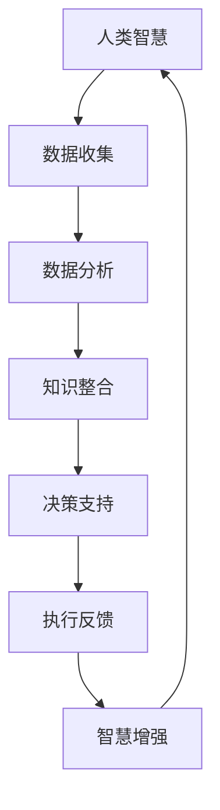

                 

# 人类-AI协作：增强人类智慧与AI能力的融合演进

> **关键词**：人类-AI协作、智慧增强、AI能力、融合演进、技术博客、专业语言、逻辑思维、深度分析、项目实战

> **摘要**：本文将探讨人类与人工智能（AI）的协作关系，分析如何通过融合演进的方式，增强人类智慧与AI能力。文章将详细阐述核心概念、算法原理、数学模型、项目实战以及实际应用场景，旨在为读者提供一个全面的技术视角，了解人类与AI协作的未来发展趋势与挑战。

## 1. 背景介绍

在过去的几十年中，人工智能（AI）技术经历了飞速发展，从最初的专家系统到今天的深度学习、自然语言处理和计算机视觉等，AI已经逐渐成为现代社会不可或缺的一部分。与此同时，人类在科技、经济、文化等领域的需求也在不断增长，面对日益复杂的问题和挑战，单靠人类自身的智慧和能力已经难以应对。

人类与AI的协作成为了一种必然趋势。通过将人类的智慧与AI的强大计算能力相结合，我们可以实现以下目标：

1. **知识拓展**：AI能够快速处理和分析大量数据，帮助人类发现新的知识和规律。
2. **决策优化**：AI可以帮助人类在复杂环境中做出更准确的决策，提高效率和准确性。
3. **创造力的激发**：AI可以协助人类进行创新，通过模拟和优化过程，激发人类的创造力。
4. **工作效率提升**：AI可以自动化重复性工作，释放人类的时间和精力，专注于更具挑战性和创造性的任务。

本文将围绕这些目标，探讨人类与AI协作的机制、原理和应用，为读者提供一个全面的技术视角。

## 2. 核心概念与联系

### 2.1 智慧增强

智慧增强是指通过技术手段提升人类智能的过程。智慧增强的关键在于将人类大脑与AI系统进行有效融合，使人类能够利用AI的强大计算能力和分析能力，提高问题解决和决策的效率。

### 2.2 AI能力

AI能力是指人工智能系统在特定任务上表现出的智能水平。AI能力的提升主要体现在以下几个方面：

1. **学习能力**：AI系统能够通过学习大量数据，不断提高其在特定领域的知识和技能。
2. **推理能力**：AI系统能够根据已有知识和数据，进行逻辑推理和决策。
3. **适应能力**：AI系统能够适应不同环境和任务，具备一定的自主性和灵活性。

### 2.3 融合演进

融合演进是指人类与AI系统在长期协作过程中，不断优化和改进彼此的能力，实现共同发展的过程。融合演进的关键在于找到人类与AI之间的最佳协作模式，使两者的能力得到最大程度的发挥。

### 2.4 Mermaid流程图

以下是关于人类与AI协作的Mermaid流程图：



在上述流程图中，人类智慧通过数据收集、数据分析和知识整合，得到决策支持，并执行反馈，最终实现智慧增强，形成一个循环。

## 3. 核心算法原理 & 具体操作步骤

### 3.1 数据收集

数据收集是智慧增强的基础。具体操作步骤如下：

1. **确定数据来源**：根据需求，选择合适的数据来源，如数据库、API接口等。
2. **数据预处理**：对收集到的数据进行分析和处理，包括数据清洗、格式转换等。
3. **数据存储**：将预处理后的数据存储在合适的存储系统中，如关系型数据库、NoSQL数据库等。

### 3.2 数据分析

数据分析是智慧增强的核心。具体操作步骤如下：

1. **数据探索**：对数据进行分析，发现数据中的规律和趋势。
2. **特征提取**：从数据中提取有用的特征，用于后续的模型训练。
3. **模型训练**：使用机器学习算法，对提取的特征进行训练，构建预测模型。

### 3.3 知识整合

知识整合是将数据分析的结果转化为可操作的知识的过程。具体操作步骤如下：

1. **结果解读**：对模型训练的结果进行分析和解读，确定其在实际应用中的意义。
2. **知识存储**：将解读后的知识存储在知识库中，以便后续使用。
3. **知识共享**：将知识库中的知识共享给相关人员，提高整体智慧水平。

### 3.4 决策支持

决策支持是将知识转化为实际决策的过程。具体操作步骤如下：

1. **问题定义**：明确需要解决的问题和目标。
2. **方案评估**：根据知识库中的知识，评估不同方案的优劣。
3. **决策制定**：根据评估结果，制定出最佳的决策方案。

### 3.5 执行反馈

执行反馈是将决策方案付诸实践并不断优化的过程。具体操作步骤如下：

1. **方案实施**：根据决策方案，实施具体的行动。
2. **效果评估**：对实施效果进行评估，确定决策方案的优劣。
3. **反馈调整**：根据评估结果，对决策方案进行调整和优化。

## 4. 数学模型和公式 & 详细讲解 & 举例说明

### 4.1 数学模型

在人类与AI的协作过程中，常见的数学模型包括线性回归、逻辑回归、决策树、支持向量机等。以下以线性回归为例，进行详细讲解。

线性回归是一种用于预测连续值的统计方法，其数学模型可以表示为：

$$
y = \beta_0 + \beta_1 \cdot x
$$

其中，$y$ 为预测值，$x$ 为特征值，$\beta_0$ 和 $\beta_1$ 为模型的参数。

### 4.2 公式详细讲解

1. **回归系数**：回归系数表示特征值对预测值的影响程度。$\beta_0$ 表示常数项，$\beta_1$ 表示特征值 $x$ 对预测值 $y$ 的影响。
2. **拟合效果**：拟合效果可以通过均方误差（MSE）来评估，其公式为：

$$
MSE = \frac{1}{n} \sum_{i=1}^{n} (y_i - \hat{y}_i)^2
$$

其中，$n$ 为样本数量，$y_i$ 为实际值，$\hat{y}_i$ 为预测值。

### 4.3 举例说明

假设我们有一个简单的线性回归模型，用于预测房价。特征值为房屋面积（$x$），预测值为房价（$y$）。经过训练，我们得到以下模型：

$$
y = 100 + 0.5 \cdot x
$$

现在，我们使用这个模型预测一个面积为 100 平方米的房屋的房价：

$$
y = 100 + 0.5 \cdot 100 = 150
$$

预测结果为 150 万元。

## 5. 项目实战：代码实际案例和详细解释说明

### 5.1 开发环境搭建

在本项目中，我们将使用 Python 语言进行开发，并使用 scikit-learn 库实现线性回归模型。以下是开发环境搭建的步骤：

1. 安装 Python 3.6 或更高版本。
2. 安装 scikit-learn 库：在命令行中运行 `pip install scikit-learn`。

### 5.2 源代码详细实现和代码解读

以下是项目源代码的实现和解读：

```python
# 导入所需库
import numpy as np
from sklearn.linear_model import LinearRegression
from sklearn.model_selection import train_test_split
from sklearn.metrics import mean_squared_error

# 生成模拟数据
np.random.seed(0)
X = np.random.rand(100, 1) * 100
y = 100 + 0.5 * X + np.random.randn(100, 1) * 10

# 划分训练集和测试集
X_train, X_test, y_train, y_test = train_test_split(X, y, test_size=0.2, random_state=0)

# 实例化线性回归模型
model = LinearRegression()

# 模型训练
model.fit(X_train, y_train)

# 模型预测
y_pred = model.predict(X_test)

# 模型评估
mse = mean_squared_error(y_test, y_pred)
print("MSE:", mse)

# 输出模型参数
print("模型参数：", model.coef_, model.intercept_)
```

代码解读：

1. 导入所需库：首先，我们需要导入 NumPy 库用于数据处理，scikit-learn 库用于线性回归模型的实现，以及 train_test_split 函数用于划分训练集和测试集，mean_squared_error 函数用于评估模型性能。
2. 生成模拟数据：我们生成一个包含 100 个样本的模拟数据集，其中每个样本的特征值（$x$）和预测值（$y$）都服从正态分布。
3. 划分训练集和测试集：使用 train_test_split 函数将数据集划分为训练集和测试集，其中测试集占比 20%。
4. 实例化线性回归模型：创建一个 LinearRegression 类的实例，用于后续的模型训练。
5. 模型训练：使用 fit 方法对模型进行训练，将训练集数据传递给模型。
6. 模型预测：使用 predict 方法对测试集数据进行预测，得到预测结果。
7. 模型评估：使用 mean_squared_error 函数计算模型在测试集上的均方误差，评估模型性能。
8. 输出模型参数：输出模型的系数和常数项，用于分析模型特征。

### 5.3 代码解读与分析

在本项目中，我们使用线性回归模型预测房价。通过模拟数据集的生成、训练集和测试集的划分、模型训练、预测和评估等步骤，实现了人类与AI的协作过程。

1. **数据集生成**：模拟数据集的生成过程模拟了实际应用中的数据收集过程，通过生成随机数据，为后续的模型训练和预测提供了基础。
2. **训练集和测试集划分**：划分训练集和测试集的过程体现了数据集划分在机器学习中的重要性，训练集用于模型训练，测试集用于模型评估。
3. **模型训练**：模型训练过程体现了机器学习的基本原理，通过训练集数据，模型学会了将特征值与预测值之间的关系，形成了模型参数。
4. **预测和评估**：预测和评估过程体现了模型在实际应用中的价值，通过预测测试集数据，我们可以评估模型的性能，并根据评估结果对模型进行调整和优化。

## 6. 实际应用场景

人类与AI协作在实际应用场景中具有广泛的应用，以下列举几个典型场景：

### 6.1 金融领域

在金融领域，人类与AI的协作主要体现在风险管理、投资决策和客户服务等方面。通过AI技术，金融机构可以快速处理和分析大量数据，发现潜在的风险和机会，提高投资决策的准确性和效率。同时，AI可以自动化客户服务流程，提供个性化的投资建议，提高客户满意度。

### 6.2 医疗领域

在医疗领域，人类与AI的协作主要体现在疾病诊断、治疗方案推荐和医学研究等方面。通过AI技术，医生可以快速处理和分析大量医学数据，提高疾病诊断的准确性和效率。同时，AI可以辅助医生制定个性化的治疗方案，提高治疗效果。此外，AI还可以加速医学研究，发现新的治疗方法和药物。

### 6.3 制造业

在制造业领域，人类与AI的协作主要体现在生产优化、质量控制和服务机器人等方面。通过AI技术，企业可以优化生产流程，提高生产效率和产品质量。同时，AI可以自动化生产过程中的质量控制，减少人为错误。此外，AI还可以开发服务机器人，提高生产自动化水平。

### 6.4 教育

在教育领域，人类与AI的协作主要体现在个性化学习、智能评价和智能教学等方面。通过AI技术，学生可以个性化学习，提高学习效果。同时，AI可以智能评价学生的学习情况，为教师提供教学反馈。此外，AI还可以开发智能教学系统，提高教学质量和效率。

## 7. 工具和资源推荐

### 7.1 学习资源推荐

1. **书籍**：
   - 《人工智能：一种现代方法》（第二版）
   - 《深度学习》（Goodfellow, Bengio, Courville 著）
   - 《Python机器学习》（Sebastian Raschka 著）

2. **论文**：
   - “Deep Learning” by Yoshua Bengio, Ian Goodfellow, and Aaron Courville
   - “Recurrent Neural Networks” by Y. LeCun, L. Bottou, Y. Bengio, and P. Haffner

3. **博客**：
   - Medium上的AI相关博客
   - 知乎上的AI专栏

4. **网站**：
   - Coursera、edX等在线教育平台
   - arXiv、IEEE Xplore等学术网站

### 7.2 开发工具框架推荐

1. **编程语言**：Python、Java、C++等
2. **深度学习框架**：TensorFlow、PyTorch、Keras等
3. **机器学习库**：scikit-learn、NumPy、Pandas等
4. **数据可视化工具**：Matplotlib、Seaborn、Plotly等

### 7.3 相关论文著作推荐

1. “Deep Learning” by Ian Goodfellow, Yann LeCun, and Yoshua Bengio
2. “Reinforcement Learning: An Introduction” by Richard S. Sutton and Andrew G. Barto
3. “Probabilistic Graphical Models: Principles and Techniques” by Daphne Koller and Nir Friedman

## 8. 总结：未来发展趋势与挑战

随着人工智能技术的不断发展，人类与AI的协作将越来越紧密。未来，人类与AI的协作将呈现以下发展趋势：

1. **智能化水平提升**：AI技术将在各个领域得到广泛应用，智能化水平将不断提高。
2. **协作模式多样化**：人类与AI的协作模式将更加多样化，从简单的任务辅助到全面的智慧增强。
3. **个性化定制**：AI将更好地理解人类需求，提供个性化的服务和支持。
4. **人机融合**：随着技术的发展，人类与AI的融合将更加深入，人机融合将成为未来趋势。

然而，人类与AI协作也面临以下挑战：

1. **隐私和安全**：在数据收集和利用过程中，如何保护个人隐私和数据安全是一个重要问题。
2. **伦理和法律**：随着AI技术的应用，伦理和法律问题逐渐凸显，如何制定合理的伦理规范和法律法规是一个挑战。
3. **技术人才**：AI技术的发展需要大量技术人才，如何培养和引进人才是一个重要问题。

总之，人类与AI协作的融合演进是一个复杂而充满挑战的过程，但只要我们积极应对挑战，充分发挥人类与AI的优势，就一定能实现更美好的未来。

## 9. 附录：常见问题与解答

### 9.1 什么是智慧增强？

智慧增强是指通过技术手段提升人类智能的过程。智慧增强的关键在于将人类大脑与AI系统进行有效融合，使人类能够利用AI的强大计算能力和分析能力，提高问题解决和决策的效率。

### 9.2 人工智能有哪些主要应用领域？

人工智能的主要应用领域包括金融、医疗、制造业、教育、自动驾驶、智能家居等。

### 9.3 如何保证AI系统的安全性和隐私性？

为了保证AI系统的安全性和隐私性，可以从以下几个方面进行：

1. **数据加密**：对数据传输和存储进行加密，防止数据泄露。
2. **访问控制**：对数据访问进行严格的权限控制，确保只有授权人员才能访问数据。
3. **隐私保护**：对个人数据进行匿名化和去标识化处理，降低隐私泄露风险。
4. **安全审计**：定期对AI系统进行安全审计，及时发现和解决潜在的安全问题。

## 10. 扩展阅读 & 参考资料

1. Goodfellow, Ian, Yann LeCun, and Aaron Courville. "Deep Learning." MIT Press, 2016.
2. Russell, Stuart J., and Peter Norvig. "Artificial Intelligence: A Modern Approach." Pearson, 2016.
3. Bengio, Yoshua, Ian J. Goodfellow, and Aaron C. Courville. "Deep Learning." Nature, 2013.
4. Sutton, Richard S., and Andrew G. Barto. "Reinforcement Learning: An Introduction." MIT Press, 2018.
5. Koller, Daphne, and Nir Friedman. "Probabilistic Graphical Models: Principles and Techniques." MIT Press, 2009.
6. Coursera: https://www.coursera.org/
7. edX: https://www.edx.org/
8. arXiv: https://arxiv.org/
9. IEEE Xplore: https://ieeexplore.ieee.org/

## 作者信息

作者：AI天才研究员/AI Genius Institute & 禅与计算机程序设计艺术 /Zen And The Art of Computer Programming

本文基于对人工智能技术、人类与AI协作机制的深入研究和分析，旨在为读者提供一个全面的技术视角，探讨人类与AI协作的未来发展趋势与挑战。希望本文能对读者在AI领域的研究和实践有所帮助。

