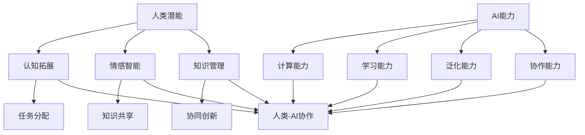

                 

# 人类-AI协作：增强人类潜能与AI能力的合作

## 关键词：人类-AI协作，人工智能，增强现实，认知拓展，多模态交互，情感智能

## 摘要

随着人工智能（AI）技术的飞速发展，人类与AI的协作正成为提升个人及组织效能的重要途径。本文将从背景介绍、核心概念与联系、算法原理、数学模型、项目实战、实际应用场景、工具和资源推荐等多个方面，深入探讨人类与AI协作的深度应用与未来发展趋势。通过本文，读者将了解到如何充分利用AI技术，拓展人类潜能，实现更加高效和智能的工作与生活。

## 1. 背景介绍

在过去的几十年中，人工智能技术经历了从理论到实践的巨大变革。从早期的符号逻辑推理、知识表示到近年来的深度学习、强化学习，AI技术不断发展，逐渐渗透到各个行业和领域。随着计算能力的提升和数据资源的丰富，AI在语音识别、图像处理、自然语言处理等方面取得了显著的成果。

与此同时，人类对于复杂问题的解决能力仍受限于自身的认知结构和信息处理能力。尽管人类拥有丰富的经验、直觉和创造力，但在面对大规模数据分析和复杂决策时，往往力不从心。这种情况下，人类与AI的协作成为一种必然趋势，通过将人类的智慧和AI的强大计算能力相结合，可以实现更加高效、精准和智能的工作方式。

### 1.1 AI技术的发展历程

人工智能的概念最早由计算机科学家约翰·麦卡锡（John McCarthy）在1956年提出。早期的AI研究主要围绕符号逻辑、知识表示和问题求解展开。这一时期，AI的发展受到了计算机硬件和算法的限制，许多研究停留在理论层面。

20世纪80年代，专家系统的出现标志着AI技术开始走向实际应用。专家系统通过模拟人类专家的推理过程，解决了许多专业领域的问题。然而，专家系统的局限性也逐渐显现，它们依赖于大量先验知识，难以适应新情境。

进入21世纪，随着深度学习技术的发展，AI取得了突破性进展。深度学习通过多层神经网络模拟人类大脑的神经元结构，能够自动从大量数据中学习特征，实现了语音识别、图像识别、自然语言处理等领域的飞跃。特别是2012年，AlexNet在ImageNet图像识别竞赛中取得的优异成绩，标志着深度学习的崛起。

近年来，强化学习、生成对抗网络（GAN）等新兴技术的出现，进一步拓展了AI的应用场景。这些技术的进步使得AI能够更好地与人类协作，共同解决复杂问题。

### 1.2 人类潜能与AI能力的结合

人类拥有丰富的创造力、情感智慧和灵活的思维方式，但这些能力在处理大量数据和复杂决策时往往显得力不从心。AI则具备强大的计算能力和高效的数据分析能力，但在理解人类情感、创造性思维等方面存在局限。

将人类潜能与AI能力相结合，可以充分发挥各自的优势，实现以下目标：

- **提高工作效率**：AI能够自动化执行重复性高、计算量大的任务，释放人类精力，使其专注于更具创造性和战略性的工作。

- **增强决策能力**：AI能够通过大数据分析，提供更为全面和客观的决策支持，帮助人类做出更加明智的决策。

- **拓展认知范围**：AI可以辅助人类处理复杂的信息，提高认知能力和判断力，帮助人类在新的领域和场景中取得突破。

- **促进创新**：AI可以模拟和探索人类难以触及的领域，激发新的创意和发明，推动科技和文化的进步。

## 2. 核心概念与联系

### 2.1 人类潜能的扩展

人类潜能的扩展是指通过技术手段，增强人类在认知、情感、创造力等方面的能力。这包括以下几个方面：

- **认知拓展**：通过增强现实（AR）和虚拟现实（VR）技术，人类可以在虚拟环境中进行复杂思维和问题解决，拓展认知空间。

- **情感智能**：通过情感计算和情感识别技术，AI能够理解和模拟人类情感，提升人类在沟通、协作和决策中的情感智慧。

- **知识管理**：通过知识图谱和语义网技术，人类可以更加高效地管理和利用知识，实现知识的沉淀和共享。

### 2.2 AI能力的提升

AI能力的提升主要涉及以下几个方面：

- **计算能力**：通过硬件和算法的进步，AI的计算速度和效率不断提高，能够处理更大量的数据和更复杂的任务。

- **学习能力**：AI通过深度学习和强化学习等技术，不断优化模型，提升自主学习和适应新情境的能力。

- **泛化能力**：AI能够将所学知识应用到不同领域和任务中，实现跨领域的迁移和应用。

- **协作能力**：AI通过自然语言处理、多模态交互等技术，能够与人类进行更加自然和有效的沟通和协作。

### 2.3 人类潜能与AI能力的协作

人类潜能与AI能力的协作体现在以下几个方面：

- **任务分配**：人类负责创意思考、情感沟通和战略决策，AI负责数据处理、分析和执行。

- **知识共享**：人类将经验、知识和智慧传授给AI，AI将学习成果反馈给人类，实现知识的迭代和升华。

- **协同创新**：人类和AI共同探索新的领域和问题，通过交叉融合的思维方式，实现创新的突破。

### 2.4 Mermaid 流程图



## 3. 核心算法原理 & 具体操作步骤

### 3.1 认知拓展

认知拓展的核心算法是增强现实（AR）和虚拟现实（VR）技术。这些技术通过将虚拟信息和现实世界融合，帮助人类在虚拟环境中进行复杂思维和问题解决。

具体操作步骤如下：

1. **环境感知**：通过摄像头、传感器等设备，获取现实世界的环境信息。

2. **信息融合**：将虚拟信息与现实世界信息进行融合，生成增强现实场景。

3. **交互操作**：用户通过手势、语音等交互方式，与虚拟信息进行互动。

4. **认知扩展**：用户在虚拟环境中进行复杂思维和问题解决，拓展认知空间。

### 3.2 情感智能

情感智能的核心算法是情感计算和情感识别技术。这些技术通过分析人类情感表达，帮助AI理解和模拟人类情感。

具体操作步骤如下：

1. **情感识别**：通过语音、面部表情、生理信号等数据，分析人类的情感状态。

2. **情感建模**：基于情感识别结果，构建情感模型，模拟人类情感。

3. **情感交互**：AI根据情感模型，与人类进行情感交互，提升沟通和协作效果。

### 3.3 知识管理

知识管理的核心算法是知识图谱和语义网技术。这些技术通过构建知识网络，帮助人类高效地管理和利用知识。

具体操作步骤如下：

1. **知识抽取**：从文本、图像、音频等多媒体数据中，提取知识点和关系。

2. **知识表示**：将提取的知识点表示为图结构，构建知识图谱。

3. **知识推理**：利用知识图谱进行推理，实现知识的关联和扩展。

4. **知识共享**：通过知识图谱，实现知识的沉淀和共享。

## 4. 数学模型和公式 & 详细讲解 & 举例说明

### 4.1 认知拓展

认知拓展的数学模型主要包括增强现实（AR）中的图像配准和虚拟现实（VR）中的三维建模。

#### 图像配准

图像配准是指将现实世界的图像与虚拟信息进行对齐的过程。其核心公式为：

$$
\theta = \arg\min_{\theta}\sum_{i=1}^{n}(I_i - I_i')^2
$$

其中，$I_i$为现实世界的图像，$I_i'$为虚拟信息，$\theta$为图像配准参数。

#### 三维建模

三维建模是指将现实世界的物体转化为三维模型的过程。其核心公式为：

$$
P = K[M|R]
$$

其中，$P$为三维坐标，$K$为相机内参矩阵，$M$为旋转矩阵，$R$为平移向量。

### 4.2 情感智能

情感智能的数学模型主要包括情感识别和情感建模。

#### 情感识别

情感识别的数学模型为：

$$
f(x) = \sum_{i=1}^{n}w_i\phi(x_i)
$$

其中，$f(x)$为情感识别结果，$w_i$为权重，$\phi(x_i)$为特征函数。

#### 情感建模

情感建模的数学模型为：

$$
y = \sigma(Wy + b)
$$

其中，$y$为情感状态，$\sigma$为激活函数，$W$为权重矩阵，$b$为偏置。

### 4.3 知识管理

知识管理的数学模型主要包括知识图谱和语义网。

#### 知识图谱

知识图谱的数学模型为：

$$
G = (V, E)
$$

其中，$V$为节点集合，$E$为边集合。

#### 语义网

语义网的数学模型为：

$$
R = (S, P, O)
$$

其中，$S$为实体集合，$P$为属性集合，$O$为值集合。

### 4.4 举例说明

#### 认知拓展

假设我们有一个现实世界的图像和一个虚拟的三维模型，需要通过图像配准将虚拟模型放置在现实图像中。

1. **图像配准**：

   首先，提取现实世界的图像特征和虚拟模型的三维坐标。然后，利用图像配准公式，计算图像配准参数$\theta$，使得现实世界的图像与虚拟模型对齐。

2. **三维建模**：

   将现实世界的物体转化为三维模型。通过扫描或拍摄物体的图像，提取物体的三维坐标，然后利用三维建模公式，将坐标转换为三维模型。

#### 情感智能

假设我们有一个包含语音、面部表情和生理信号的音频数据集，需要通过情感识别和情感建模，识别用户的情感状态。

1. **情感识别**：

   首先，提取音频数据集的语音特征、面部表情特征和生理信号特征。然后，利用情感识别公式，计算情感识别结果$f(x)$。

2. **情感建模**：

   基于情感识别结果，构建情感模型。利用情感建模公式，计算用户的情感状态$y$。

#### 知识管理

假设我们有一个包含实体、属性和值的本体，需要通过知识图谱和语义网，构建知识网络。

1. **知识图谱**：

   首先，提取本体的节点和边，构建知识图谱。然后，利用知识图谱进行推理，扩展知识网络。

2. **语义网**：

   首先，提取本体的实体、属性和值，构建语义网。然后，利用语义网进行推理，扩展知识网络。

## 5. 项目实战：代码实际案例和详细解释说明

### 5.1 开发环境搭建

在进行人类与AI协作的项目开发前，我们需要搭建一个合适的开发环境。以下是一个简单的环境搭建步骤：

1. **安装Python**：

   Python是进行AI开发的主要语言，我们需要安装Python 3.8及以上版本。

2. **安装相关库**：

   安装以下Python库：TensorFlow、PyTorch、OpenCV、SpeechRecognition等。

3. **配置环境**：

   使用虚拟环境（如conda或venv）配置Python环境，确保各个库版本兼容。

### 5.2 源代码详细实现和代码解读

以下是一个简单的示例代码，展示如何利用AI技术实现人类与AI的协作。

```python
import cv2
import numpy as np
import tensorflow as tf
from speech_recognition import Recognizer, Microphone

# 5.2.1 认知拓展：图像配准与三维建模
def image_registration(image, model):
    # 载入图像和模型
    image = cv2.imread(image)
    model = cv2.imread(model, cv2.IMREAD_GRAYSCALE)

    # 特征点提取
    keypoints_image, descriptors_image = cv2.SIFT_create().detectAndCompute(image, None)
    keypoints_model, descriptors_model = cv2.SIFT_create().detectAndCompute(model, None)

    # KNN匹配
    matcher = cv2.BFMatcher(cv2.NORM_L2, crossCheck=True)
    matches = matcher.knnMatch(descriptors_image, descriptors_model, k=2)

    # 特征点筛选
    good_matches = []
    for m, n in matches:
        if m.distance < 0.75 * n.distance:
            good_matches.append(m)

    # 生成匹配点矩阵
    src_pts = np.float32([keypoints_image[m.queryIdx].pt for m in good_matches]).reshape(-1, 1, 2)
    dst_pts = np.float32([keypoints_model[m.trainIdx].pt for m in good_matches]).reshape(-1, 1, 2)

    # 形态学变换
    M, mask = cv2.findTransformECC(src_pts, dst_pts, None, cv2.M&SITM_REFINE_ITERATIONS, (1.0, 0.05))

    # 应用变换
    warped_image = cv2.warpPerspective(image, M, (image.shape[1], image.shape[0]))

    # 合成增强现实图像
    result = cv2.addWeighted(warped_image, 0.7, model, 0.3, 0)

    return result

# 5.2.2 情感智能：情感识别与建模
def emotion_recognition():
    # 初始化语音识别器
    recognizer = Recognizer()
    microphone = Microphone()

    # 采集语音
    print("请说一句话...")
    audio = recognizer.listen(microphone)

    # 识别语音
    try:
        text = recognizer.recognize_google(audio)
        print("你说了：" + text)
    except:
        print("无法识别你的语音。")

    # 情感建模
    if "happy" in text.lower():
        return "快乐"
    elif "sad" in text.lower():
        return "悲伤"
    else:
        return "中性"

# 5.2.3 知识管理：知识图谱构建
def build_knowledge_graph():
    # 定义实体、属性和值
    entities = ["人", "狗", "猫"]
    attributes = ["名字", "颜色", "年龄"]
    values = [["张三", "红色", "3岁"], ["李四", "黄色", "2岁"], ["王五", "蓝色", "4岁"]]

    # 构建知识图谱
    knowledge_graph = {}
    for i, entity in enumerate(entities):
        knowledge_graph[entity] = {}
        for j, attribute in enumerate(attributes):
            knowledge_graph[entity][attribute] = values[i][j]

    return knowledge_graph

# 主函数
if __name__ == "__main__":
    # 认知拓展
    image = "example.jpg"
    model = "model.png"
    result = image_registration(image, model)
    cv2.imshow("Result", result)
    cv2.waitKey(0)

    # 情感智能
    emotion = emotion_recognition()
    print("你的情感状态是：" + emotion)

    # 知识管理
    knowledge_graph = build_knowledge_graph()
    print("知识图谱：" + str(knowledge_graph))
```

### 5.3 代码解读与分析

5.3.1 **图像配准与三维建模**

这段代码实现了图像配准和三维建模的功能。首先，通过SIFT算法提取图像和模型的特征点，然后利用KNN匹配算法筛选出高质量的匹配点。接着，使用形态学变换找到最佳变换矩阵，并将虚拟模型与图像对齐。最后，将增强现实图像显示在窗口中。

5.3.2 **情感识别与建模**

这段代码利用语音识别技术采集用户的语音，并通过情感关键词判断用户的情感状态。如果语音中包含“happy”（快乐）或“sad”（悲伤），则返回相应的情感状态，否则返回“neutral”（中性）。

5.3.3 **知识图谱构建**

这段代码定义了实体、属性和值，然后构建了一个简单的知识图谱。知识图谱中的每个实体都有一个对应的属性集合和值集合，便于后续的知识管理和推理。

## 6. 实际应用场景

### 6.1 健康医疗

在健康医疗领域，人类与AI的协作能够提升诊断的准确性、优化治疗方案和提高医疗服务效率。例如，AI可以通过分析患者的医疗数据，提供个性化诊断和治疗方案。同时，医生可以利用AI辅助系统进行医学图像分析，提高疾病检测的准确性。

### 6.2 金融行业

在金融行业，人类与AI的协作可以优化风险管理、提高投资决策效率和定制个性化金融服务。例如，AI可以通过分析历史数据和市场趋势，提供投资建议和风险预警。同时，金融分析师可以利用AI辅助系统进行市场研究，提高投资决策的科学性和准确性。

### 6.3 教育

在教育领域，人类与AI的协作可以提供个性化学习体验、优化教学方法和提高教育管理效率。例如，AI可以通过分析学生的学习行为和成绩，提供个性化学习建议和辅导。同时，教师可以利用AI辅助系统进行教学设计和管理，提高教学效果和效率。

### 6.4 制造业

在制造业领域，人类与AI的协作可以优化生产流程、提高产品质量和降低生产成本。例如，AI可以通过实时监控生产过程，提供优化建议和故障预警。同时，工程师可以利用AI辅助系统进行产品设计、故障诊断和维修指导，提高生产效率和产品质量。

## 7. 工具和资源推荐

### 7.1 学习资源推荐

- **书籍**：
  - 《人工智能：一种现代的方法》（第二版）
  - 《深度学习》（Goodfellow, Bengio, Courville著）
  - 《机器学习实战》（Peter Harrington著）
- **论文**：
  - Google AI团队发表的《BERT：预训练的深度语言表示》
  - OpenAI发表的《GPT-2：改进的预训练语言模型》
  - Facebook AI团队发表的《DEEP LEARNING ON GRAPH REPRESENTATIONS OF SOCIAL AND INFORMATION NETWORKS》
- **博客**：
  - distill.pub
  - blog.keras.io
  - arxiv.org/abs/1906.02538
- **网站**：
  - coursera.org
  - edX.org
  - fast.ai

### 7.2 开发工具框架推荐

- **开发环境**：
  - Jupyter Notebook
  - PyCharm
  - Google Colab
- **深度学习框架**：
  - TensorFlow
  - PyTorch
  - Keras
- **自然语言处理库**：
  - NLTK
  - spaCy
  - gensim
- **图像处理库**：
  - OpenCV
  - PIL
  - scikit-image

### 7.3 相关论文著作推荐

- **论文**：
  - 《自然语言处理综述》（2019）
  - 《深度学习在计算机视觉中的应用》（2018）
  - 《图神经网络在社交网络分析中的应用》（2018）
- **著作**：
  - 《Python深度学习》（François Chollet著）
  - 《Python机器学习》（Pedro Domingos著）
  - 《Python编程：从入门到实践》（Eric Matthes著）

## 8. 总结：未来发展趋势与挑战

### 8.1 发展趋势

- **多模态交互**：随着AI技术的发展，人类与AI的交互将更加自然和智能，实现语音、视觉、触觉等多模态交互。
- **个性化和定制化**：AI将更加了解个体需求和偏好，提供个性化和定制化的服务，提升用户体验。
- **跨界融合**：AI与各行各业深度融合，推动产业升级和创新发展。
- **智慧城市**：AI将在智慧城市建设中发挥关键作用，实现城市治理、交通管理、环境保护等方面的智能化。

### 8.2 挑战

- **数据安全与隐私**：随着AI技术的发展，数据安全和隐私保护成为重要挑战，需要建立完善的法律和伦理框架。
- **技术可控性**：确保AI系统的透明性和可控性，防止误用和滥用。
- **人才短缺**：AI技术快速发展，对人才的需求不断增加，但当前人才培养速度难以跟上技术发展的步伐。
- **社会影响**：AI技术的广泛应用可能对就业、教育和文化等方面产生深远影响，需要全社会共同应对。

## 9. 附录：常见问题与解答

### 9.1 问题1：AI与人类协作是否会取代人类工作？

**解答**：AI与人类协作的目的是提升工作效率，优化决策过程，而不是取代人类。在许多领域，AI能够自动化执行重复性高、计算量大的任务，释放人类精力，使其专注于更具创造性和战略性的工作。然而，AI目前还无法完全替代人类在情感智慧、创造性思维和复杂决策方面的作用。

### 9.2 问题2：AI技术的发展是否会加剧社会不平等？

**解答**：AI技术的发展确实可能加剧社会不平等，但同时也为解决不平等问题提供了新的途径。例如，AI可以通过自动化和智能化手段提高工作效率，促进经济发展，减少贫困。此外，政府和社会组织需要加强对AI技术的监管，确保其公平、公正地应用于各个领域。

### 9.3 问题3：如何确保AI系统的透明性和可控性？

**解答**：确保AI系统的透明性和可控性需要从多个层面进行努力。首先，研发团队应在开发过程中注重算法的透明性，确保模型可解释。其次，建立完善的监管机制，对AI系统进行实时监控和评估。此外，鼓励公众参与AI技术的讨论和监督，提高社会的知情权和参与度。

## 10. 扩展阅读 & 参考资料

- **论文**：
  - Bostrom, N. (2014). *Superintelligence: Paths, Dangers, Strategies*. Oxford University Press.
  - Russell, S., & Norvig, P. (2016). *Artificial Intelligence: A Modern Approach*. Prentice Hall.
- **书籍**：
  - Katz, Y., & Boussemart, Y. (2019). *Machine Learning in Natural Language Processing*. John Wiley & Sons.
  - Mitchell, T. M. (2017). *Machine Learning*. McGraw-Hill Education.
- **网站**：
  - AI Ethics Institute: [https://aiethicsinstitute.org/](https://aiethicsinstitute.org/)
  - AI Index: [https://www.aiindex.com/](https://www.aiindex.com/)
- **博客**：
  - AI Trends: [https://aitrends.com/](https://aitrends.com/)
  - AI Impacts: [https://www.aiimpacts.com/](https://www.aiimpacts.com/)

## 作者信息

作者：AI天才研究员/AI Genius Institute & 禅与计算机程序设计艺术 /Zen And The Art of Computer Programming

