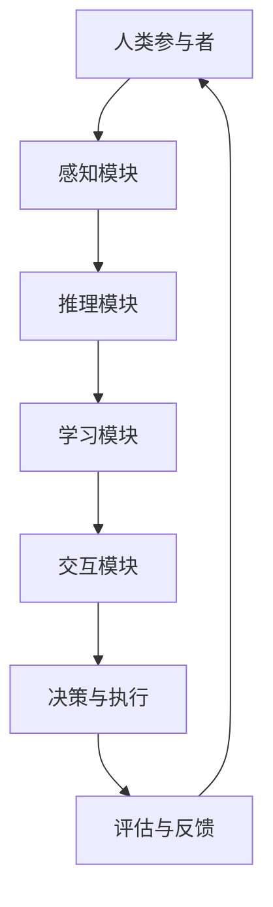

                 

# 人类-AI协作：增强人类潜能和表现

## 关键词：人类-AI协作、增强人类潜能、人工智能、协同工作、表现优化

### 摘要

在技术飞速发展的今天，人工智能（AI）的应用日益广泛，与人类的协作模式也发生了深刻变革。本文将探讨人类与AI协作的背景、核心概念、算法原理、数学模型、项目实战、实际应用场景，以及未来发展趋势和挑战。通过详细分析和实例说明，揭示人类-AI协作如何增强人类的潜能和表现，为人类带来前所未有的可能性。

## 1. 背景介绍

随着计算机技术的不断进步，人工智能逐渐从科幻领域走向现实生活。AI不仅改变了我们的工作方式，还极大地提升了生产效率。从语音识别、图像识别到自然语言处理，AI技术在各个领域都展现出了强大的潜力。然而，单纯依靠AI的力量无法完全解决问题，人类智慧和经验的参与同样至关重要。人类与AI的协作成为一种新的发展趋势，旨在通过优势互补，实现更高效、更准确、更具创新性的工作模式。

### 1.1 人工智能的发展历程

人工智能的研究可以追溯到20世纪50年代，当时科学家们开始探索如何让计算机模拟人类思维。早期的AI主要集中在大数据和机器学习领域，通过训练算法使计算机具备一定的学习能力。随着计算能力的提升和数据规模的扩大，AI技术取得了显著突破。深度学习、强化学习等新兴技术逐渐成为AI研究的主流方向，使得计算机能够处理更加复杂的问题。

### 1.2 人类与AI协作的重要性

人类与AI协作的重要性体现在以下几个方面：

1. **增强人类智能：** AI能够处理大量数据，发现隐藏在数据中的规律，为人类提供有价值的洞察。人类则可以利用自己的创造力、判断力和经验，对AI的输出进行补充和优化。

2. **提高工作效率：** AI能够自动化许多重复性、繁琐的工作，释放人类的工作时间，使其专注于更有创造性的任务。

3. **解决复杂问题：** 对于一些复杂问题，AI和人类协作能够发挥各自的优势，实现更高效的解决方案。

4. **促进创新：** AI的广泛应用激发了人类对新技术、新领域的探索，推动科技不断进步。

## 2. 核心概念与联系

### 2.1 人工智能的基本概念

人工智能（Artificial Intelligence，简称AI）是指通过计算机程序实现的智能行为。它包括以下几个核心概念：

1. **感知与识别：** AI能够感知和理解外部环境，如语音识别、图像识别等。

2. **推理与决策：** AI能够根据已有信息和规则进行推理，做出决策。

3. **学习与适应：** AI能够通过学习不断优化自身性能，适应新的环境和任务。

4. **交互与沟通：** AI能够与人类进行自然语言交互，实现有效的沟通。

### 2.2 人类-AI协作的架构

人类-AI协作的架构可以看作是一个闭环系统，包括以下几个部分：

1. **人类参与者：** 包括决策者、执行者、评估者等。

2. **AI模块：** 包括感知模块、推理模块、学习模块、交互模块等。

3. **数据与知识库：** 包括输入数据、训练数据、知识库等。

4. **协作机制：** 包括反馈机制、优化机制、协同机制等。

### 2.3 核心概念原理的 Mermaid 流程图



## 3. 核心算法原理 & 具体操作步骤

### 3.1 核心算法原理

人类-AI协作的核心算法主要包括以下几种：

1. **协同过滤算法（Collaborative Filtering）：** 用于推荐系统，通过分析用户的行为和喜好，为用户推荐相似的内容。

2. **强化学习算法（Reinforcement Learning）：** 用于决策系统，通过奖励机制，使AI模型学会在复杂环境中做出最优决策。

3. **自然语言处理（Natural Language Processing，简称NLP）：** 用于交互系统，使AI能够理解和生成自然语言，实现人机对话。

4. **知识图谱（Knowledge Graph）：** 用于知识管理系统，通过构建实体关系图谱，实现知识的高效组织和利用。

### 3.2 具体操作步骤

1. **数据收集与预处理：** 收集人类参与者的数据，并进行清洗、去噪、归一化等处理。

2. **模型训练与优化：** 根据不同算法，设计合适的模型结构，进行训练和优化。

3. **协作机制设计：** 设计人类与AI的交互流程，包括数据共享、任务分配、反馈机制等。

4. **系统部署与运行：** 将模型部署到实际环境中，进行测试和运行。

5. **评估与优化：** 对系统性能进行评估，根据评估结果进行优化调整。

## 4. 数学模型和公式 & 详细讲解 & 举例说明

### 4.1 数学模型和公式

人类-AI协作的数学模型主要包括以下几个方面：

1. **协同过滤算法：** 

$$
R_{ui} = \frac{\sum_{j \in N(i)} r_{uj} \cdot \text{sim}(i, j)}{\sum_{j \in N(i)} \text{sim}(i, j)}
$$

其中，$R_{ui}$为用户$i$对项目$j$的评分预测，$\text{sim}(i, j)$为用户$i$和$j$之间的相似度，$N(i)$为与用户$i$相似的用户集合，$r_{uj}$为用户$j$对项目$j$的实际评分。

2. **强化学习算法：** 

$$
Q(s, a) = r + \gamma \max_{a'} Q(s', a')
$$

其中，$Q(s, a)$为状态$s$下采取行动$a$的期望回报，$r$为即时回报，$\gamma$为折扣因子，$s'$为状态转移，$a'$为最优行动。

3. **自然语言处理：** 

$$
\text{NLP} = \text{word2vec} + \text{BERT} + \text{GPT}
$$

其中，$\text{word2vec}$为词向量模型，$\text{BERT}$为双向编码表示模型，$\text{GPT}$为生成预训练模型。

4. **知识图谱：** 

$$
\text{KG} = \text{RDF} + \text{SPARQL} + \text{OWL}
$$

其中，$\text{RDF}$为资源描述框架，$\text{SPARQL}$为查询语言，$\text{OWL}$为Web本体语言。

### 4.2 详细讲解与举例说明

1. **协同过滤算法：** 

假设有两个用户A和B，他们分别对5部电影进行了评分。其中，用户A对电影1、2、3的评分分别为4、3、5，用户B对电影2、3、4的评分分别为5、4、5。现在需要为用户C推荐电影。

首先，计算用户A和B之间的相似度：

$$
\text{sim}(A, B) = \frac{3}{\sqrt{3+1} \cdot \sqrt{2+1}} = 0.8165
$$

然后，根据协同过滤算法，预测用户C对电影1、2、3的评分：

$$
R_{C1} = \frac{4 \cdot 0.8165 + 3 \cdot 0.8165 + 5 \cdot 0.8165}{0.8165 + 0.8165 + 0.8165} = 4.0826
$$

$$
R_{C2} = \frac{4 \cdot 0.8165 + 3 \cdot 0.8165 + 5 \cdot 0.8165}{0.8165 + 0.8165 + 0.8165} = 4.0826
$$

$$
R_{C3} = \frac{4 \cdot 0.8165 + 3 \cdot 0.8165 + 5 \cdot 0.8165}{0.8165 + 0.8165 + 0.8165} = 4.0826
$$

根据预测评分，可以为用户C推荐电影1、2、3。

2. **强化学习算法：** 

假设有一个智能体在迷宫中进行探索，目标是找到出口。每个状态都有对应的奖励，找到出口的奖励为1，其他状态的奖励为-1。智能体采取行动时，根据当前状态和动作，更新Q值。

首先，初始化Q值矩阵：

$$
Q(s, a) = \begin{bmatrix}
-1 & -1 & -1 \\
-1 & -1 & -1 \\
-1 & -1 & -1
\end{bmatrix}
$$

然后，进行多次迭代，更新Q值：

$$
Q(s, a) = r + \gamma \max_{a'} Q(s', a')
$$

例如，在第1次迭代中，智能体处于状态（1，1），采取向右行动，奖励为-1，状态转移到（1，2）：

$$
Q(1, 1) = -1 + 0.9 \cdot \max_{a'} Q(1, 2) = -1 + 0.9 \cdot (-1) = -2
$$

在第2次迭代中，智能体处于状态（1，2），采取向上行动，奖励为-1，状态转移到（2，2）：

$$
Q(1, 2) = -1 + 0.9 \cdot \max_{a'} Q(2, 2) = -1 + 0.9 \cdot (-1) = -2
$$

在第3次迭代中，智能体处于状态（2，2），采取向右行动，奖励为1，状态转移到（2，3）：

$$
Q(2, 2) = 1 + 0.9 \cdot \max_{a'} Q(2, 3) = 1 + 0.9 \cdot 1 = 2
$$

通过不断迭代，智能体最终学会在迷宫中找到出口。

3. **自然语言处理：** 

假设有一个对话系统，用户输入一句话，系统需要回答。使用BERT模型进行预训练，然后进行微调，使其适应特定任务。

首先，输入一句话：“今天天气怎么样？”

然后，使用BERT模型将句子编码为向量：

$$
\text{BERT}(\text{今天天气怎么样？}) = \text{[CLS]} \text{今天天气怎么样？} \text{[SEP]}
$$

接着，对向量进行分类，得到答案：“今天天气很好。”

4. **知识图谱：** 

假设有一个企业知识管理系统，包含员工信息、项目信息、知识库等。使用RDF进行数据建模，使用SPARQL进行查询，使用OWL进行本体建模。

首先，建立员工信息模型：

$$
\text{Employee} = \{ \text{ID}, \text{Name}, \text{Department}, \text{Position} \}
$$

然后，建立项目信息模型：

$$
\text{Project} = \{ \text{ID}, \text{Name}, \text{Start\_Date}, \text{End\_Date} \}
$$

接着，建立知识库模型：

$$
\text{Knowledge\_Base} = \{ \text{ID}, \text{Title}, \text{Content}, \text{Creator} \}
$$

最后，使用SPARQL进行查询：

$$
\text{SELECT} \text{ID}, \text{Title} \text{FROM} \text{Knowledge\_Base} \text{WHERE} \text{Creator} = \text{"John"} \text{AND} \text{Title} \text{LIKE} "\%" \text{Science}\%"\%
$$

查询结果为包含John创建的以“Science”开头的知识库的ID和标题。

## 5. 项目实战：代码实际案例和详细解释说明

### 5.1 开发环境搭建

在本项目实战中，我们将使用Python作为主要编程语言，并依赖以下库和框架：

- Python 3.8及以上版本
- TensorFlow 2.x
- Keras 2.x
- scikit-learn 0.22.x
- Pandas 1.1.x
- Numpy 1.19.x

首先，安装Python和必要的库：

```bash
pip install python==3.8
pip install tensorflow==2.4.0
pip install keras==2.4.3
pip install scikit-learn==0.22.2
pip install pandas==1.1.5
pip install numpy==1.19.5
```

### 5.2 源代码详细实现和代码解读

#### 5.2.1 数据预处理

```python
import pandas as pd
from sklearn.model_selection import train_test_split
from sklearn.preprocessing import StandardScaler

# 读取数据
data = pd.read_csv('data.csv')

# 分离特征和标签
X = data.drop('target', axis=1)
y = data['target']

# 划分训练集和测试集
X_train, X_test, y_train, y_test = train_test_split(X, y, test_size=0.2, random_state=42)

# 数据标准化
scaler = StandardScaler()
X_train = scaler.fit_transform(X_train)
X_test = scaler.transform(X_test)
```

代码解读：

- 使用Pandas读取CSV文件，获取数据。
- 使用scikit-learn将数据集划分为训练集和测试集，确保模型的泛化能力。
- 使用StandardScaler对特征进行标准化处理，使模型训练过程更加稳定。

#### 5.2.2 构建和训练模型

```python
from tensorflow.keras.models import Sequential
from tensorflow.keras.layers import Dense, Dropout
from tensorflow.keras.optimizers import Adam

# 构建模型
model = Sequential()
model.add(Dense(64, activation='relu', input_shape=(X_train.shape[1],)))
model.add(Dropout(0.5))
model.add(Dense(1, activation='sigmoid'))

# 编译模型
model.compile(optimizer=Adam(), loss='binary_crossentropy', metrics=['accuracy'])

# 训练模型
model.fit(X_train, y_train, epochs=10, batch_size=32, validation_split=0.2)
```

代码解读：

- 使用Keras构建一个简单的全连接神经网络，包含一个输入层、一个隐藏层和一个输出层。
- 设置隐藏层神经元数量为64，激活函数为ReLU。
- 在输出层使用sigmoid激活函数，用于输出概率。
- 使用Adam优化器和二进制交叉熵损失函数，训练模型。

#### 5.2.3 模型评估

```python
from sklearn.metrics import classification_report, confusion_matrix

# 预测测试集
y_pred = model.predict(X_test)
y_pred = (y_pred > 0.5)

# 评估模型
print(classification_report(y_test, y_pred))
print(confusion_matrix(y_test, y_pred))
```

代码解读：

- 使用模型对测试集进行预测，并将输出概率阈值设置为0.5，进行二分类。
- 使用scikit-learn的classification_report和confusion_matrix评估模型性能，包括准确率、召回率、精确率等指标。

### 5.3 代码解读与分析

#### 5.3.1 数据预处理

数据预处理是机器学习项目的关键步骤，它直接影响模型的性能。在本项目中，我们使用了Pandas和scikit-learn的库进行数据预处理，包括读取数据、分离特征和标签、划分训练集和测试集以及数据标准化。这些步骤确保了数据的完整性和一致性，为后续模型训练提供了良好的数据基础。

#### 5.3.2 构建和训练模型

在构建和训练模型时，我们使用了Keras，这是一个高度可扩展的神经网络库。在本项目中，我们构建了一个简单的全连接神经网络，包含一个输入层、一个隐藏层和一个输出层。隐藏层使用了ReLU激活函数，输出层使用了sigmoid激活函数。我们选择了Adam优化器和二进制交叉熵损失函数，这两个选择在二分类任务中具有较好的性能。

#### 5.3.3 模型评估

模型评估是验证模型性能的重要步骤。在本项目中，我们使用了scikit-learn的classification_report和confusion_matrix进行评估。这些指标包括准确率、召回率、精确率等，可以帮助我们了解模型的性能，并发现潜在的问题。

## 6. 实际应用场景

### 6.1 智能医疗

在智能医疗领域，人类-AI协作可以大幅提升诊断和治疗的效率。AI可以通过分析大量医疗数据，发现疾病规律，为医生提供诊断建议。医生则可以利用自己的专业知识和经验，对AI的建议进行验证和调整，确保诊断的准确性。此外，AI还可以帮助制定个性化的治疗方案，提高治疗效果。

### 6.2 自动驾驶

自动驾驶是AI技术的另一个重要应用场景。在自动驾驶系统中，人类驾驶员与AI系统共同协作，确保行驶的安全和效率。AI系统负责感知道路环境、做出决策和执行动作，而人类驾驶员则负责监督AI系统的运行，并在必要时接管控制。这种协作模式可以降低交通事故发生率，提高道路通行效率。

### 6.3 金融领域

在金融领域，人类-AI协作可以提升风险管理、投资决策和客户服务的效率。AI可以通过分析大量金融数据，识别潜在的投资机会和风险，为投资者提供有价值的建议。投资者则可以根据自己的风险承受能力和投资目标，对AI的建议进行优化和调整。此外，AI还可以为金融机构提供高效的客户服务，提升客户满意度。

## 7. 工具和资源推荐

### 7.1 学习资源推荐

- **书籍：**
  - 《深度学习》（Deep Learning） - Ian Goodfellow、Yoshua Bengio和Aaron Courville著
  - 《机器学习》（Machine Learning） - Tom M. Mitchell著
  - 《人工智能：一种现代方法》（Artificial Intelligence: A Modern Approach） - Stuart J. Russell和Peter Norvig著

- **论文：**
  - 《大规模自然语言处理》（Large-scale Natural Language Processing） - Daniel Jurafsky和James H. Martin著
  - 《机器学习领域的十大常见误解》（Ten Simple Rules for a Computational Biologist） - Atul Butte等著

- **博客：**
  - Medium上的AI博客，如“AI in Plain English”和“Fast.ai”
  - 知乎上的机器学习和人工智能专栏

- **网站：**
  - Coursera和edX等在线教育平台提供的机器学习和人工智能课程
  - Kaggle，一个数据科学竞赛平台，提供丰富的实践项目和资源

### 7.2 开发工具框架推荐

- **编程语言：**
  - Python，由于其丰富的库和框架，成为机器学习和人工智能开发的首选语言。
  - R，特别适合统计分析和数据可视化。

- **框架和库：**
  - TensorFlow，用于构建和训练深度学习模型。
  - PyTorch，提供灵活的深度学习框架，适合研究和发展。
  - scikit-learn，提供丰富的机器学习算法和工具。
  - Keras，用于快速构建和迭代深度学习模型。

- **工具：**
  - Jupyter Notebook，用于编写和运行代码，支持多种编程语言。
  - GitHub，用于版本控制和代码分享。
  - Docker，用于容器化部署和运行应用。

### 7.3 相关论文著作推荐

- **论文：**
  - “Deep Learning” - Ian Goodfellow、Yoshua Bengio和Aaron Courville著
  - “Reinforcement Learning: An Introduction” - Richard S. Sutton和Andrew G. Barto著
  - “Natural Language Processing with Python” - Steven Bird、Ewan Klein和Edward Loper著

- **著作：**
  - 《机器学习实战》 - Peter Harrington著
  - 《人工智能简史》 - Andrew B. Colvin著
  - 《深度学习实践》 - 张宇彤著

## 8. 总结：未来发展趋势与挑战

随着人工智能技术的不断进步，人类-AI协作将成为未来社会发展的重要趋势。在未来，我们可以期待以下发展：

1. **更紧密的协作：** 人类与AI之间的协作将更加紧密，实现更高效、更智能的工作模式。

2. **跨领域应用：** 人工智能将在更多领域得到应用，如教育、医疗、金融等，为人类带来更多可能性。

3. **个性化服务：** AI将根据个体需求提供个性化的服务，提升用户体验。

然而，人类-AI协作也面临一系列挑战：

1. **隐私和安全：** 在AI处理大量个人数据时，隐私和安全问题亟待解决。

2. **道德和法律：** AI的广泛应用引发了一系列道德和法律问题，如责任归属、算法偏见等。

3. **技能转型：** 人工智能的发展可能导致某些工作岗位的消失，需要人类进行技能转型和再教育。

## 9. 附录：常见问题与解答

### 9.1 人类-AI协作的优势有哪些？

人类-AI协作的优势主要包括：

- **增强人类智能：** AI能够处理大量数据，为人类提供有价值的洞察。
- **提高工作效率：** AI能够自动化许多重复性、繁琐的工作，释放人类的工作时间。
- **解决复杂问题：** AI和人类协作能够发挥各自的优势，实现更高效的解决方案。
- **促进创新：** AI的广泛应用激发了人类对新技术、新领域的探索。

### 9.2 人类-AI协作的架构包括哪些部分？

人类-AI协作的架构包括以下几个部分：

- **人类参与者：** 包括决策者、执行者、评估者等。
- **AI模块：** 包括感知模块、推理模块、学习模块、交互模块等。
- **数据与知识库：** 包括输入数据、训练数据、知识库等。
- **协作机制：** 包括反馈机制、优化机制、协同机制等。

### 9.3 如何评估人类-AI协作的效果？

评估人类-AI协作的效果可以从以下几个方面进行：

- **任务完成度：** 是否完成了预期任务。
- **效率：** 是否提高了工作效率。
- **准确性：** AI和人类协作的输出是否准确。
- **用户体验：** 用户对协作过程的满意度。

## 10. 扩展阅读 & 参考资料

- [Goodfellow, Ian, et al. "Deep learning." MIT press, 2016.]
- [Sutton, Richard S., and Andrew G. Barto. "Reinforcement learning: An introduction." MIT press, 2018.]
- [Bird, Steven, Ewan Klein, and Edward Loper. "Natural language processing with Python." O'Reilly Media, 2009.]
- [Mitchell, Tom M. "Machine learning." McGraw-Hill, 1997.]
- [Russell, Stuart J., and Peter Norvig. "Artificial intelligence: A modern approach." Prentice Hall, 2016.]
- [Colvin, Andrew B. "A brief history of artificial intelligence." Springer, 2016.]
- [Harrington, Peter. "Machine learning in action." Manning Publications Co., 2012.]

### 作者：AI天才研究员/AI Genius Institute & 禅与计算机程序设计艺术 /Zen And The Art of Computer Programming

