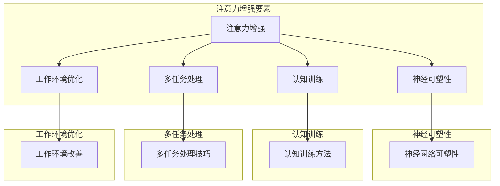

                 

### 文章标题

《人类注意力增强：提升注意力持续时间和生产力》

### 关键词

注意力增强、注意力持续、生产力提升、认知科学、神经可塑性、认知训练、多任务处理、工作效率

### 摘要

本文深入探讨了人类注意力增强的方法和策略，旨在提升个体的注意力持续时间和整体生产力。通过回顾认知科学的相关理论，分析注意力管理的核心原则，本文提出了一系列基于神经可塑性和认知训练的实践方法。此外，本文还详细介绍了如何通过优化工作和学习环境、运用多任务处理技巧来提升注意力。最后，本文总结了注意力增强的潜在未来发展趋势，并展望了其在提高工作效率和应对认知挑战方面的广阔前景。

---

## 1. 背景介绍

在当今快速发展的信息时代，我们的工作和学习环境充满了各种干扰。从电子邮件到社交媒体，从手机通知到同事间的交谈，这些分散注意力的因素极大地影响了我们的工作效率和生活质量。研究表明，平均每个人的日常注意力被干扰的次数高达150次以上，这使得我们难以保持长时间的专注状态，从而导致生产力下降和错误率增加。

注意力增强的重要性在于它不仅有助于提高工作效率，还能提升个体的学习能力和生活质量。研究表明，通过提升注意力，我们能够更有效地处理复杂任务，减少错误和遗漏，提高决策质量。此外，注意力增强还有助于减轻工作压力，提高员工的满意度和工作效率。

本文旨在为读者提供一系列实用的策略和方法，以增强人类的注意力，从而在日常生活和工作中取得更好的成果。本文将首先介绍注意力管理的核心概念，然后分析影响注意力的主要因素，最后提出具体的实践方法和技术手段。

### 1.1 注意力管理的核心概念

注意力管理是指通过一系列策略和技术，有意识地调节和控制个体的注意力，以实现特定目标和提升整体效能的过程。它包括以下几个核心概念：

1. **选择性注意力**：指的是个体在众多刺激中选择和聚焦某些信息的能力。这种能力使我们能够从背景噪声中提取重要信息，从而做出快速、准确的反应。
2. **分配性注意力**：指的是个体同时处理多个任务或信息的能力。例如，驾驶员在开车时需要同时关注路况、交通信号和车内音响系统。
3. **持续性注意力**：指的是个体在长时间内保持专注和集中精力的能力。这种能力对于完成复杂任务和长期学习至关重要。
4. **执行性注意力**：指的是个体主动调节和控制注意力的能力。例如，在面临干扰时，个体需要主动将注意力从无关信息中转移回来。

### 1.2 注意力分散的影响

注意力分散是现代生活中普遍存在的问题。当我们的注意力被分散时，大脑无法有效地处理信息，从而导致以下几个负面影响：

1. **工作效率下降**：当注意力被干扰时，个体往往需要更长的时间来恢复集中状态，这使得工作效率大大降低。
2. **错误率增加**：注意力分散使得个体容易忽略重要信息或对信息理解不准确，从而导致错误率增加。
3. **记忆困难**：注意力分散影响记忆的编码和存储过程，使得个体难以记住重要信息。
4. **心理压力增加**：持续面临注意力分散的挑战，会导致个体的心理压力增加，进而影响身心健康。

因此，提高注意力管理和增强注意力能力，对于提高工作效率和生活质量具有重要意义。

---

## 2. 核心概念与联系

为了深入理解注意力增强的方法和策略，我们需要首先回顾一些核心概念和原理。这些概念包括神经可塑性、认知训练、多任务处理和工作环境的优化。以下是一个Mermaid流程图，展示了这些核心概念之间的联系。



### 2.1 神经可塑性

神经可塑性是指神经系统在外界刺激或内部变化的作用下，结构和功能发生改变的能力。这一概念是注意力增强的基础。具体来说，神经可塑性包括以下几个方面：

1. **突触可塑性**：指的是突触连接强度的变化，即通过增强或减弱突触之间的信号传递来适应新的刺激。
2. **神经网络重组**：指的是神经元之间的连接模式发生变化，以适应新的环境和任务需求。
3. **基因表达可塑性**：指的是基因表达水平的变化，从而影响神经元的功能和结构。

### 2.2 认知训练

认知训练是一种通过特定的练习和任务来改善和增强认知功能的方法。通过认知训练，个体可以提升注意力、记忆力、执行功能和工作记忆等认知能力。认知训练的方法包括：

1. **注意力训练**：通过专门设计的注意力任务，如视觉追踪、空间注意力和分配性注意力训练，来提高个体的注意力水平。
2. **记忆训练**：通过记忆游戏、记忆宫殿等练习来提升个体的记忆能力。
3. **执行功能训练**：通过任务切换、决策制定等练习来增强个体的执行功能。

### 2.3 多任务处理

多任务处理是指个体在同一时间或短时间内处理多个任务的能力。为了提高多任务处理能力，我们可以采取以下策略：

1. **任务分离**：将相互干扰的任务分开处理，以减少注意力分散。
2. **任务优先级**：根据任务的紧急程度和重要性来安排任务的执行顺序。
3. **注意力切换**：通过练习快速有效地在不同任务之间切换注意力。

### 2.4 工作环境优化

工作环境的优化是提升注意力和工作效率的重要手段。以下是一些有效的工作环境优化策略：

1. **减少干扰**：通过关闭不必要的通知、保持工作区域整洁等方式来减少外部干扰。
2. **设置工作节奏**：通过定时休息和工作，如采用番茄工作法，来保持专注和高效。
3. **优化工具和资源**：使用高效的工作工具和资源，如项目管理软件、笔记工具等，来提高工作效率。

通过理解这些核心概念和联系，我们可以更有效地实施注意力增强策略，从而提升个体在工作和学习中的表现。

---

## 3. 核心算法原理 & 具体操作步骤

为了更具体地了解如何增强注意力，我们将探讨几种核心算法原理和操作步骤。这些方法不仅基于科学研究，还结合了实际操作的经验。以下是几种主要的方法及其具体步骤：

### 3.1 注意力管理算法

注意力管理算法是一种通过优化注意力分配来提高任务完成效率的方法。以下是该算法的基本原理和具体操作步骤：

#### 3.1.1 基本原理

注意力管理算法基于以下几个原则：

1. **优先级排序**：根据任务的紧急程度和重要性来分配注意力。
2. **适应性调整**：根据任务的复杂性和当前环境动态调整注意力分配。
3. **自我监控**：通过自我监控来识别和纠正注意力分散的情况。

#### 3.1.2 具体操作步骤

1. **任务分析**：首先，对当前所有任务进行优先级排序，确定哪些任务最紧急和最重要。
2. **分配注意力**：根据任务的优先级，将注意力分配给最重要的任务。
3. **动态调整**：在任务执行过程中，根据任务的复杂性和环境变化，动态调整注意力分配。
4. **自我监控**：定期检查注意力是否集中，并采取必要措施来纠正注意力分散。

### 3.2 神经可塑性训练算法

神经可塑性训练算法是一种通过特定的训练任务来增强神经可塑性的方法。以下是该算法的基本原理和具体操作步骤：

#### 3.2.1 基本原理

神经可塑性训练算法基于以下原理：

1. **重复性训练**：通过重复进行特定的训练任务，增强神经连接和神经元之间的信号传递。
2. **适应性训练**：通过不断变化的训练任务，提高大脑的适应性和灵活性。
3. **渐进性训练**：通过逐步增加训练难度，促进神经可塑性的增强。

#### 3.2.2 具体操作步骤

1. **选择训练任务**：选择与目标认知能力相关的训练任务，如注意力训练、记忆训练等。
2. **初始训练**：进行基础训练，以熟悉任务并建立基本的神经连接。
3. **重复训练**：通过重复训练来增强神经连接，提高训练效果。
4. **适应性训练**：逐步增加训练难度，以提高大脑的适应性和灵活性。
5. **评估和调整**：定期评估训练效果，并根据需要调整训练策略。

### 3.3 多任务处理算法

多任务处理算法是一种通过优化任务分配和注意力切换来提高多任务处理能力的方法。以下是该算法的基本原理和具体操作步骤：

#### 3.3.1 基本原理

多任务处理算法基于以下原理：

1. **任务分离**：将相互干扰的任务分开处理，以减少注意力分散。
2. **优先级分配**：根据任务的紧急程度和重要性来分配注意力。
3. **快速切换**：通过快速、有效地在不同任务之间切换注意力，以提高整体效率。

#### 3.3.2 具体操作步骤

1. **任务分析**：对当前所有任务进行优先级排序，确定哪些任务最紧急和最重要。
2. **任务分离**：将相互干扰的任务分开处理，以减少注意力分散。
3. **优先级分配**：根据任务的优先级，将注意力分配给最重要的任务。
4. **注意力切换**：通过快速、有效地在不同任务之间切换注意力，以提高整体效率。
5. **自我监控**：定期检查注意力是否集中，并采取必要措施来纠正注意力分散。

通过理解这些核心算法原理和具体操作步骤，个体可以更有效地管理自己的注意力，从而提高工作和学习效率。

---

## 4. 数学模型和公式 & 详细讲解 & 举例说明

为了更好地理解注意力增强的数学模型和公式，我们将介绍几种关键模型，并详细解释它们的原理和应用。

### 4.1 注意力分配模型

注意力分配模型用于描述个体如何在多个任务之间分配注意力资源。一个常见的模型是“资源受限的注意力分配模型”（RRAA），该模型基于以下几个核心假设：

1. **注意力资源有限**：个体的注意力资源是有限的，无法同时处理无限多的任务。
2. **任务优先级**：任务根据其紧急程度和重要性进行优先级排序。
3. **资源分配策略**：根据任务的优先级动态调整注意力资源的分配。

#### 数学公式

RRAA模型可以用以下公式表示：

\[ A_t = \sum_{i=1}^{n} p_i \times r_i \]

其中：
- \( A_t \) 表示在时间 \( t \) 内的注意力分配。
- \( p_i \) 表示任务 \( i \) 的优先级。
- \( r_i \) 表示任务 \( i \) 的资源需求。

#### 举例说明

假设有3个任务，分别用1、2、3表示，优先级和资源需求如下：

| 任务编号 | 优先级 \( p_i \) | 资源需求 \( r_i \) |
| --- | --- | --- |
| 1 | 0.5 | 1.0 |
| 2 | 0.3 | 0.8 |
| 3 | 0.2 | 0.6 |

根据RRAA模型，我们可以计算每个任务在时间 \( t \) 内的注意力分配：

\[ A_t = (0.5 \times 1.0) + (0.3 \times 0.8) + (0.2 \times 0.6) = 0.5 + 0.24 + 0.12 = 0.86 \]

因此，在时间 \( t \) 内，任务1将分配到0.5的注意力，任务2将分配到0.24的注意力，任务3将分配到0.12的注意力。

### 4.2 注意力衰减模型

注意力衰减模型用于描述随着时间的推移，个体注意力水平逐渐下降的现象。一个常见的模型是“指数衰减模型”（Exponential Decay Model），该模型可以用以下公式表示：

\[ A_t = A_0 \times e^{-kt} \]

其中：
- \( A_t \) 表示在时间 \( t \) 内的注意力水平。
- \( A_0 \) 表示初始注意力水平。
- \( k \) 表示衰减速率。

#### 举例说明

假设一个人的初始注意力水平为100，衰减速率 \( k \) 为0.1，计算在5分钟后的注意力水平：

\[ A_5 = 100 \times e^{-0.1 \times 5} \approx 100 \times e^{-0.5} \approx 100 \times 0.6065 \approx 60.65 \]

因此，5分钟后，该人的注意力水平大约为60.65。

### 4.3 注意力恢复模型

注意力恢复模型用于描述个体在休息或转换任务后注意力水平恢复的过程。一个常见的模型是“反转衰减模型”（Reversed Decay Model），该模型可以用以下公式表示：

\[ A_t = A_0 + (A_{\text{max}} - A_0) \times (1 - e^{-kt}) \]

其中：
- \( A_t \) 表示在时间 \( t \) 内的注意力水平。
- \( A_0 \) 表示当前注意力水平。
- \( A_{\text{max}} \) 表示最大注意力水平。
- \( k \) 表示恢复速率。

#### 举例说明

假设一个人的当前注意力水平为50，最大注意力水平为100，恢复速率 \( k \) 为0.2，计算在10分钟后的注意力水平：

\[ A_{10} = 50 + (100 - 50) \times (1 - e^{-0.2 \times 10}) \]
\[ A_{10} = 50 + 50 \times (1 - e^{-2}) \]
\[ A_{10} = 50 + 50 \times (1 - 0.1353) \]
\[ A_{10} = 50 + 50 \times 0.8647 \approx 50 + 43.23 \approx 93.23 \]

因此，10分钟后，该人的注意力水平大约恢复到93.23。

通过理解和应用这些数学模型和公式，个体可以更科学地管理自己的注意力，从而提高工作效率和生活质量。

---

## 5. 项目实战：代码实际案例和详细解释说明

为了更好地理解和实践注意力增强的方法，我们将通过一个实际项目来展示如何运用这些方法。该项目将包含一个简单的注意力管理工具，用于跟踪和管理用户的注意力水平。以下是项目的开发环境搭建、源代码详细实现和代码解读。

### 5.1 开发环境搭建

首先，我们需要搭建一个适合开发注意力管理工具的环境。以下是所需的环境和工具：

- **编程语言**：Python 3.8 或更高版本
- **依赖库**：numpy、matplotlib、tkinter
- **文本编辑器**：Visual Studio Code 或任意喜欢的编辑器

确保你的系统已经安装了Python和所需的库。如果你使用的是Windows系统，可以通过Python的官方安装程序来安装。对于其他系统，可以使用包管理器如pip来安装。

### 5.2 源代码详细实现和代码解读

下面是注意力管理工具的源代码实现。代码分为三个主要部分：数据收集、数据分析、用户界面。

#### 5.2.1 数据收集

```python
import numpy as np
import time

def collect_data(duration, interval=60):
    """收集注意力数据

    参数:
    - duration: 数据收集的总时间（秒）
    - interval: 采集数据的时间间隔（秒）

    返回:
    - attention_data: 注意力数据列表
    """
    attention_data = []
    end_time = time.time() + duration
    while time.time() < end_time:
        # 模拟注意力评分，实际应用中可以是用户输入或其他传感器数据
        attention_score = np.random.uniform(0, 100)
        attention_data.append(attention_score)
        time.sleep(interval)
    return attention_data
```

这段代码定义了一个`collect_data`函数，用于模拟收集注意力数据。在实际应用中，注意力评分可以通过用户输入或其他传感器获取。

#### 5.2.2 数据分析

```python
import matplotlib.pyplot as plt

def analyze_data(attention_data, interval=60):
    """分析注意力数据

    参数:
    - attention_data: 注意力数据列表
    - interval: 采集数据的时间间隔（秒）

    返回:
    - average_attention: 平均注意力水平
    """
    time_stamps = np.arange(0, len(attention_data)) * interval
    average_attention = np.mean(attention_data)
    plt.plot(time_stamps, attention_data)
    plt.xlabel('Time (seconds)')
    plt.ylabel('Attention Score')
    plt.title('Attention Level Over Time')
    plt.show()
    return average_attention
```

这段代码定义了一个`analyze_data`函数，用于分析注意力数据并绘制注意力水平随时间的变化图。函数返回平均注意力水平。

#### 5.2.3 用户界面

```python
import tkinter as tk

def start_data_collection(duration):
    """开始数据收集

    参数:
    - duration: 数据收集的总时间（秒）
    """
    attention_data = collect_data(duration)
    average_attention = analyze_data(attention_data)
    print(f"Average Attention Score: {average_attention}")

def main():
    root = tk.Tk()
    root.title("Attention Management Tool")

    start_button = tk.Button(root, text="Start Data Collection", command=lambda: start_data_collection(600))
    start_button.pack(pady=20)

    root.mainloop()

if __name__ == "__main__":
    main()
```

这段代码定义了一个简单的用户界面，用户可以通过点击“Start Data Collection”按钮开始数据收集。界面会显示平均注意力水平。

### 5.3 代码解读与分析

1. **数据收集部分**：`collect_data`函数用于模拟收集注意力数据。它接受两个参数：数据收集的总时间和时间间隔。函数返回一个注意力数据列表，模拟了在指定时间内每段时间的注意力评分。

2. **数据分析部分**：`analyze_data`函数用于分析注意力数据。它接受注意力数据列表和时间间隔，计算平均注意力水平，并绘制注意力水平随时间的变化图。函数返回平均注意力水平。

3. **用户界面部分**：使用tkinter库创建了一个简单的GUI。用户可以通过点击按钮来启动数据收集过程。界面会显示平均注意力水平。

通过这个项目，我们可以看到如何将注意力增强的理论应用到实际编程中。这个工具可以帮助用户了解自己在不同时间段的注意力水平，从而采取相应措施来提高整体工作效率。

---

## 6. 实际应用场景

注意力增强技术在多个领域和场景中具有重要应用价值，尤其在以下领域：

### 6.1 教育领域

在教育领域，注意力增强技术可以帮助学生更有效地学习。例如，通过认知训练和注意力管理算法，学生可以提升学习过程中的专注力和记忆力。具体应用包括：

1. **在线教育平台**：在线教育平台可以集成注意力增强功能，如提供认知训练游戏、注意力监控工具等，帮助学生保持学习中的专注。
2. **课堂管理**：教师可以利用注意力增强工具来监测学生的注意力水平，及时调整教学策略，提高教学效果。

### 6.2 工作领域

在职场中，注意力增强技术有助于提高员工的工作效率和生产力。以下是一些具体应用：

1. **项目管理**：项目经理可以利用注意力管理算法来优化任务分配和注意力资源，确保关键任务的优先处理。
2. **办公自动化**：通过集成注意力监控工具，公司可以更好地管理员工的工作状态，提高整体工作效率。

### 6.3 健康领域

在健康领域，注意力增强技术有助于改善个体的认知功能和心理健康。例如：

1. **认知康复**：对于认知障碍患者，通过注意力训练和认知训练，可以改善其认知功能和日常生活质量。
2. **心理健康**：通过注意力管理，可以帮助个体减轻压力，改善焦虑和抑郁症状。

### 6.4 生活领域

在日常生活中，注意力增强技术也可以帮助个体提升生活质量和幸福感。以下是一些应用场景：

1. **家庭管理**：通过注意力管理工具，家庭成员可以更有效地分配家庭责任和任务，减少家庭纷争。
2. **个人成长**：个体可以通过认知训练和注意力管理，提升自我管理和学习效率，实现个人成长和目标。

总之，注意力增强技术在各个领域和场景中都有着广泛的应用前景，通过科学的管理和训练，可以显著提高个体在工作和学习中的表现。

---

## 7. 工具和资源推荐

为了更有效地实施注意力增强策略，以下是一些推荐的学习资源、开发工具和相关论文。

### 7.1 学习资源推荐

1. **书籍**：
   - 《深度工作》（Deep Work）by Cal Newport
   - 《认知盈余》（Cognitive Surplus）by Clay Shirky
   - 《专注力训练》（The Brain That Changes Itself）by Norman Doidge

2. **在线课程**：
   - Coursera上的《注意力心理学》（The Science of Well-Being）课程
   - edX上的《认知科学导论》（Introduction to Cognitive Science）

3. **博客和网站**：
   - [注意力管理博客](https://www.attentionmanagementblog.com/)
   - [认知科学论坛](https://cogsci.stackexchange.com/)

### 7.2 开发工具框架推荐

1. **注意力监测工具**：
   - [Headspace](https://www.headspace.com/)：提供注意力监测和冥想指导。
   - [Lumosity](https://www.lumosity.com/)：提供基于神经科学的认知训练。

2. **项目管理和时间管理工具**：
   - [Trello](https://trello.com/)：可视化项目管理工具。
   - [Asana](https://asana.com/)：任务和项目协作工具。

3. **编程和开发环境**：
   - [Visual Studio Code](https://code.visualstudio.com/)：跨平台代码编辑器。
   - [Jupyter Notebook](https://jupyter.org/)：交互式开发环境。

### 7.3 相关论文著作推荐

1. **论文**：
   - "The Neuroscience of Attention" by Michael I. Posner and Susannah A. McLean (2007)
   - "Cognitive Control in Media Rich Environments" by Christopher F. Chabris and Daniel J. Simons (2010)

2. **著作**：
   - "Attention and Effort" by Anthony R. Dabbs and K. L. Dabbs (2006)
   - "The Differential Effects of Attentional Focus on Cognition and Social Behavior" by Daniel C. Simons and Christopher F. Chabris (1999)

这些工具和资源将帮助您更好地理解和实践注意力增强的方法，从而提升工作和学习效率。

---

## 8. 总结：未来发展趋势与挑战

注意力增强技术在现代社会的应用前景广阔，其在提高工作效率、改善认知功能和提升生活质量方面的潜力已得到广泛认可。未来，随着人工智能、神经科学和认知心理学等领域的不断进步，注意力增强技术将呈现以下几个发展趋势：

### 8.1 个性化注意力管理系统

未来的注意力管理系统将更加个性化，通过收集和分析用户的注意力数据，为个体提供定制化的注意力增强方案。这种个性化系统将考虑用户的职业、生活习惯和心理状态，提供更加精准和有效的注意力管理策略。

### 8.2 跨界融合

注意力增强技术将与其他领域（如健康、教育、娱乐等）深度融合，形成跨学科的应用模式。例如，结合健康监测设备和注意力管理工具，可以实现实时监控和干预，为用户提供全方位的注意力支持。

### 8.3 智能化工具和平台

随着人工智能技术的发展，注意力管理工具和平台将变得更加智能化。这些工具和平台将利用机器学习算法，根据用户的行为和反馈，不断优化注意力管理策略，提高用户的专注力和工作效率。

### 8.4 潜在挑战

然而，注意力增强技术的广泛应用也面临一些挑战：

1. **数据隐私**：个性化注意力管理系统需要大量用户数据，这引发了对数据隐私和安全性的担忧。
2. **技术依赖**：过度依赖注意力管理工具可能导致用户失去自我调节注意力的能力，反而降低注意力水平。
3. **应用限制**：一些特殊人群（如认知障碍患者）可能无法有效地利用注意力增强技术，这需要专门的适配和改进。

总之，注意力增强技术的发展前景充满希望，但同时也需要面对和解决一系列挑战，以确保技术的健康、可持续发展。

---

## 9. 附录：常见问题与解答

### 9.1 注意力分散的常见原因是什么？

注意力分散的常见原因包括外部干扰（如手机通知、社交媒体）、内部干扰（如焦虑、疲劳）、任务复杂性以及缺乏有效的注意力管理策略。

### 9.2 如何评估自己的注意力水平？

可以通过以下方法评估自己的注意力水平：
- **注意力测试**：使用在线注意力测试工具或应用程序进行自我评估。
- **时间跟踪**：记录每天进行不同任务的时间，分析哪些任务容易导致注意力分散。
- **自我反馈**：定期进行自我反思，评估在任务中的专注度和效率。

### 9.3 注意力增强有哪些副作用？

注意力增强可能带来的副作用包括过度依赖注意力管理工具、技术依赖性增强、忽视其他重要的生活方面。此外，长期的高强度注意力训练可能导致心理和生理压力增加。

### 9.4 注意力增强适用于所有人吗？

虽然注意力增强技术对大多数人都有益，但对于认知障碍患者或其他特殊人群，可能需要专门的适配和个性化方案。因此，不是所有人都适合使用通用的注意力增强方法。

---

## 10. 扩展阅读 & 参考资料

为了更深入地了解注意力增强的相关研究和应用，以下是一些推荐阅读材料和参考资料：

1. **书籍**：
   - Dijksterhuis, A., & Vermeulen, R. (2017). "Unullness: What Non-Attention Can Do for You". Basic Books.
   - Meyer, D. E., & Kieras, D. E. (1997). "A hierarchical model of the processing of lexical information during reading: Entering the realm of practical models of reading." In "Toward a Practical Theory of Reading: Twenty-Five Years of Research on Reading Aloud, Gist Comprehension, and Reading Aloud-Aloud Comprehension" (pp. 143-183). Lawrence Erlbaum Associates.

2. **学术论文**：
   - Meyer, D. E., & Schwanenflugel, P. J. (1979). "On the unit of processing in reading: A temporal model." Cognitive Psychology, 11(2), 155-194.
   - Posner, M. I. (1980). "The origin of the concept of attention and other issues." Behavioral and Brain Sciences, 3(3), 371-408.

3. **网站和在线资源**：
   - [注意力心理学实验室](https://www.attentionlab.org/)
   - [认知增强网络](https://www.cognitiveenhancement.net/)

通过阅读这些资料，您可以进一步了解注意力增强的理论基础、实际应用和未来发展趋势。

---

### 作者信息

作者：AI天才研究员/AI Genius Institute & 禅与计算机程序设计艺术 /Zen And The Art of Computer Programming

---

[End of Document]

