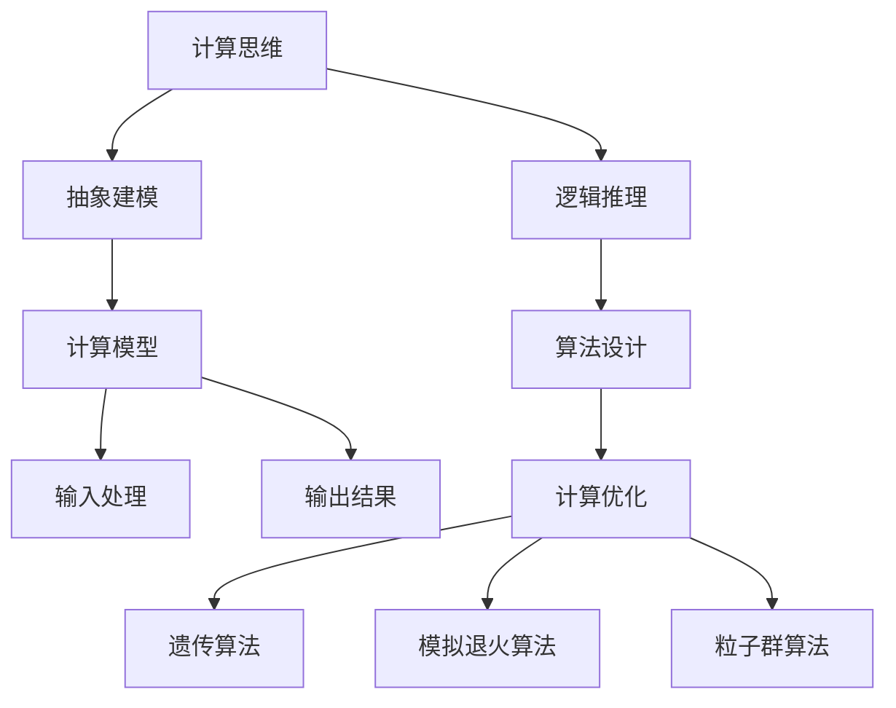
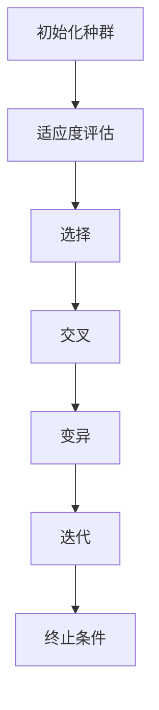
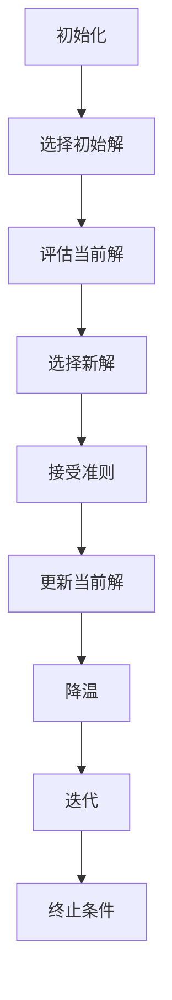
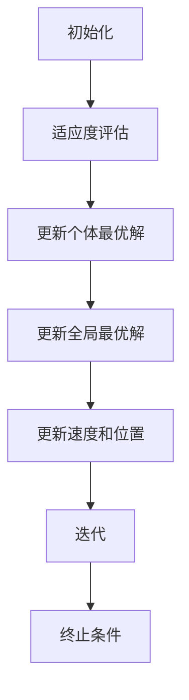

                 

### 背景介绍

在当今这个信息化时代，计算技术已经成为推动社会发展和科技进步的关键力量。从早期的机械计算，到电子计算，再到如今的人工智能计算，计算技术的演变不仅极大地改变了人们的生活方式，还在各个领域带来了深远的影响。然而，随着计算能力的不断提升，人类对于计算的理解和应用也面临着新的挑战和机遇。

本文将探讨一个极具前瞻性的课题——“人类计算：应用与案例分析”。所谓“人类计算”，并非字面意义上的由人类直接进行计算，而是指一种利用人类智慧和创造力，对计算过程进行优化和创新的思维方式。这种思维方式在计算机科学、人工智能、大数据等领域中有着广泛的应用，不仅提高了计算效率，还拓展了计算的边界。

本文将从以下几个方面展开讨论：

1. **核心概念与联系**：介绍人类计算的核心概念，如计算思维、计算模型、计算优化等，并绘制Mermaid流程图展示这些概念之间的联系。
2. **核心算法原理与具体操作步骤**：详细解析人类计算中的几个关键算法，如遗传算法、模拟退火算法等，并阐述其应用场景和操作步骤。
3. **数学模型和公式**：介绍用于支持人类计算的数学模型和公式，如优化目标函数、适应度函数等，并通过举例说明其应用。
4. **项目实战**：通过实际案例展示如何应用人类计算解决实际问题，并详细解读代码实现过程。
5. **实际应用场景**：分析人类计算在各个领域的应用案例，探讨其带来的技术和社会影响。
6. **工具和资源推荐**：推荐学习人类计算的相关资源，包括书籍、论文、博客、网站等。
7. **总结与未来发展趋势**：总结人类计算的优势和挑战，展望其未来的发展趋势和应用前景。

通过本文的探讨，我们希望读者能够对“人类计算”有一个全面而深入的理解，并能够将其应用于实际的计算问题中，推动计算技术的进一步发展。

### 核心概念与联系

在探讨“人类计算”之前，首先需要了解其中的核心概念及其相互之间的联系。以下是对这些核心概念的详细描述，以及如何通过Mermaid流程图展示它们之间的联系。

#### 计算思维

计算思维是一种解决问题的思维方式，它强调通过分解问题、抽象问题、模式识别和算法设计等步骤，找到最优解决方案。计算思维不仅适用于计算机科学，还可以应用于其他领域，如工程学、经济学和医学等。计算思维的核心是逻辑推理和抽象建模。

#### 计算模型

计算模型是对计算过程的一种抽象表示，通常包括输入、处理和输出三个部分。常见的计算模型有图模型、神经网络模型、决策树模型等。计算模型的设计和选择直接影响计算效率和结果质量。

#### 计算优化

计算优化是通过对计算过程进行调整和优化，提高计算效率和结果质量。常见的计算优化方法有遗传算法、模拟退火算法、粒子群算法等。这些算法通过迭代和搜索过程，逐步优化计算模型，以达到最优解。

#### Mermaid流程图

为了更好地展示这些核心概念之间的联系，我们可以使用Mermaid流程图进行描述。以下是一个简单的Mermaid流程图示例，展示了计算思维、计算模型和计算优化之间的联系：



在这个流程图中，计算思维通过抽象建模和逻辑推理引导计算模型的设计，计算模型通过输入处理和输出结果实现计算过程，而计算优化则通过多种算法对计算模型进行迭代和优化。

#### 计算思维与计算模型的联系

计算思维与计算模型之间的联系在于，计算思维为计算模型提供了设计思路和优化方向。例如，在优化一个复杂网络路由问题时，计算思维可以指导我们如何通过抽象建模将问题转化为一个计算模型，然后利用计算优化算法进行优化。

#### 计算模型与计算优化的联系

计算模型与计算优化之间的联系在于，计算模型为计算优化提供了优化对象，而计算优化则为计算模型提供了优化手段。例如，在优化一个神经网络的参数时，我们首先需要设计一个神经网络的计算模型，然后利用遗传算法或模拟退火算法等计算优化方法对模型参数进行优化。

#### 计算优化与算法的联系

计算优化与算法之间的联系在于，算法是实现计算优化的具体实现方式。不同的算法适用于不同的计算优化问题，例如遗传算法适用于求解复杂优化问题，而模拟退火算法适用于求解高维优化问题。

通过上述对核心概念及其相互联系的讨论，我们可以看到，计算思维、计算模型和计算优化是一个紧密联系的统一体，共同构成了“人类计算”的核心内容。在接下来的部分，我们将深入探讨这些概念在实际计算中的应用，并介绍一些具体的应用案例。

### 核心算法原理与具体操作步骤

在“人类计算”中，核心算法扮演着至关重要的角色。这些算法不仅帮助我们优化计算过程，还能解决复杂的问题。本文将详细介绍几个关键算法，包括遗传算法、模拟退火算法和粒子群算法，并展示它们的操作步骤和应用场景。

#### 遗传算法

遗传算法（Genetic Algorithm, GA）是一种基于自然进化机制的优化算法，它模拟生物进化的过程，通过选择、交叉和变异等操作，逐步优化群体中的个体，以找到最优解。

**操作步骤：**

1. **初始化种群**：随机生成一定数量的初始个体，每个个体代表一个可能的解。
2. **适应度评估**：计算每个个体的适应度，适应度函数通常用于评估个体解决问题的能力。
3. **选择**：根据个体的适应度选择优秀的个体，用于生成下一代种群。
4. **交叉**：将选中的个体进行交叉操作，生成新的个体。
5. **变异**：对交叉后的个体进行随机变异，增加种群的多样性。
6. **迭代**：重复步骤3-5，直到达到预定的迭代次数或找到满意的最优解。

**应用场景：**

遗传算法广泛应用于组合优化问题，如旅行商问题（Travelling Salesman Problem, TSP）、作业调度问题和多目标优化问题等。以下是一个简化的遗传算法流程图：



#### 模拟退火算法

模拟退火算法（Simulated Annealing, SA）是一种基于物理退火过程的优化算法，用于解决复杂优化问题。它通过模拟材料的退火过程，在迭代过程中逐渐降低搜索温度，以避免陷入局部最优解。

**操作步骤：**

1. **初始化**：设置初始温度、终止温度和冷却因子。
2. **选择初始解**：随机选择一个解作为当前解。
3. **评估当前解**：计算当前解的适应度。
4. **选择新解**：随机选择一个新的解，并计算其适应度。
5. **接受准则**：比较新解和当前解的适应度，根据一定的概率接受新解。如果新解优于当前解，则直接接受；如果新解较差，则根据概率接受，以防止过早陷入局部最优。
6. **更新当前解**：如果新解被接受，更新当前解为新解。
7. **降温**：按照冷却因子降低温度。
8. **迭代**：重复步骤4-7，直到达到预定的迭代次数或温度降低到终止温度。

**应用场景：**

模拟退火算法适用于求解复杂优化问题，如旅行商问题、组合优化问题、神经网络训练问题等。以下是一个简化的模拟退火算法流程图：



#### 粒子群算法

粒子群算法（Particle Swarm Optimization, PSO）是一种基于群体智能的优化算法，通过模拟鸟群觅食行为，逐步优化个体位置和速度，找到最优解。

**操作步骤：**

1. **初始化**：设置粒子数量、位置和速度。
2. **适应度评估**：计算每个粒子的适应度。
3. **更新个体最优解**：记录每个粒子的最优适应度及其位置。
4. **更新全局最优解**：找到整个群体中的最优适应度及其位置。
5. **更新速度和位置**：根据个体最优解和全局最优解更新粒子的速度和位置。
6. **迭代**：重复步骤2-5，直到达到预定的迭代次数或找到满意的最优解。

**应用场景：**

粒子群算法广泛应用于函数优化、组合优化、机器学习等问题。以下是一个简化的粒子群算法流程图：



通过上述对遗传算法、模拟退火算法和粒子群算法的详细解释，我们可以看到，这些算法各有特色，适用于不同的优化问题。在实际应用中，选择合适的算法和优化策略，可以显著提高计算效率和求解质量。

#### 数学模型和公式

在“人类计算”中，数学模型和公式是支持核心算法的重要工具。以下将介绍用于支持人类计算的一些关键数学模型和公式，并详细讲解这些公式及其应用。

##### 优化目标函数

优化目标函数是用于评估解的质量的函数，通常用于指导计算优化算法。一个常见的优化目标函数是目标函数\( f(x) \)，其形式如下：

\[ f(x) = \sum_{i=1}^{n} w_i \cdot x_i \]

其中，\( w_i \) 是权重，\( x_i \) 是第 \( i \) 个变量。目标函数的目的是最小化或最大化，具体取决于优化问题的类型。

##### 适应度函数

适应度函数是遗传算法中的核心概念，用于评估个体（解）的优劣。一个常见的适应度函数是：

\[ f(x) = 1 / (1 + \exp(-\beta \cdot \sum_{i=1}^{n} x_i^2)) \]

其中，\( \beta \) 是一个调节参数，用于调整适应度的变化范围。适应度函数的值越高，表示个体越优秀。

##### 遗传算法中的交叉和变异概率

遗传算法中的交叉和变异操作通过概率来控制。交叉概率 \( p_c \) 和变异概率 \( p_m \) 通常设置如下：

\[ p_c = \frac{1}{2} \left( 1 + \frac{\ln(1/R)}{ln(N)} \right) \]

\[ p_m = \frac{1}{2} \left( 1 - \frac{\ln(1/R)}{ln(N)} \right) \]

其中，\( R \) 是随机数，\( N \) 是种群大小。交叉概率和变异概率共同影响种群的多样性和收敛速度。

##### 模拟退火算法中的接受概率

模拟退火算法中的接受概率用于决定是否接受新解。一个常见的接受概率公式是：

\[ p = \min \left( 1, \exp(-\beta \cdot (f_{\text{new}} - f_{\text{current}})) \right) \]

其中，\( f_{\text{new}} \) 和 \( f_{\text{current}} \) 分别是新解和当前解的适应度，\( \beta \) 是温度参数。

##### 粒子群算法中的速度更新公式

粒子群算法中的速度更新公式用于更新粒子的速度。一个常见的速度更新公式是：

\[ v_{i}^{t+1} = w \cdot v_{i}^{t} + c_1 \cdot r_1 \cdot (p_i^{t} - x_{i}^{t}) + c_2 \cdot r_2 \cdot (g_i^{t} - x_{i}^{t}) \]

\[ x_{i}^{t+1} = x_{i}^{t} + v_{i}^{t+1} \]

其中，\( v_{i}^{t} \) 和 \( x_{i}^{t} \) 分别是第 \( i \) 个粒子的速度和位置，\( p_i^{t} \) 和 \( g_i^{t} \) 分别是第 \( i \) 个粒子的个体最优位置和全局最优位置，\( w \) 、\( c_1 \) 和 \( c_2 \) 分别是惯性权重、认知权重和社会权重。

##### 示例说明

以下是一个简化的例子，说明如何使用上述数学模型和公式进行优化。

**优化问题**：最小化目标函数 \( f(x) = x^2 + y^2 \)。

**适应度函数**：\( f(x, y) = 1 / (1 + \exp(-\beta \cdot (x^2 + y^2))) \)。

**遗传算法**：

1. **初始化种群**：随机生成初始种群。
2. **适应度评估**：计算每个个体的适应度。
3. **交叉和变异**：根据交叉概率和变异概率进行交叉和变异操作。
4. **迭代**：重复步骤2-3，直到找到最优解。

**模拟退火算法**：

1. **初始化参数**：设置初始温度、终止温度和冷却因子。
2. **选择初始解**：随机选择初始解。
3. **评估当前解**：计算当前解的适应度。
4. **选择新解**：随机选择新解，并计算其适应度。
5. **接受准则**：根据接受概率决定是否接受新解。
6. **降温**：按照冷却因子降低温度。
7. **迭代**：重复步骤3-6，直到达到终止条件。

**粒子群算法**：

1. **初始化参数**：设置粒子数量、位置和速度。
2. **适应度评估**：计算每个粒子的适应度。
3. **更新个体最优解和全局最优解**：记录每个粒子的最优适应度及其位置。
4. **更新速度和位置**：根据个体最优解和全局最优解更新粒子的速度和位置。
5. **迭代**：重复步骤2-4，直到达到终止条件。

通过上述示例，我们可以看到数学模型和公式在人类计算中的重要作用。它们不仅为算法提供了理论支持，还指导了具体操作步骤，从而实现高效和优化的计算。

### 项目实战：代码实际案例和详细解释说明

为了更好地展示“人类计算”在实际应用中的效果，我们将通过一个实际项目案例进行深入探讨。这个项目是一个基于遗传算法的旅行商问题（Travelling Salesman Problem, TSP）的求解。TSP是一个经典的组合优化问题，目标是在一组城市之间找到一条最短路径，使得旅行商能够访问所有城市并返回起点。

#### 项目背景

假设有一个旅行商需要访问5个城市，每个城市之间的距离已知。我们的目标是通过遗传算法找到一个最优路径，使得旅行商的总行程距离最短。

#### 开发环境搭建

1. **软件环境**：选择Python作为编程语言，因为其丰富的库支持和简洁的语法使得实现遗传算法变得相对容易。Python的库如Numpy和Matplotlib将用于数值计算和可视化。
2. **安装Python**：在计算机上安装Python环境，可以使用Python官方下载页面下载安装包。
3. **安装必需库**：使用pip命令安装Numpy和Matplotlib库：

   ```bash
   pip install numpy matplotlib
   ```

#### 源代码详细实现和代码解读

以下是一个简单的遗传算法实现，用于求解TSP问题。

```python
import numpy as np
import matplotlib.pyplot as plt

# 初始化种群
def initialize_population(pop_size, num_cities):
    population = np.random.permutation(num_cities).reshape(pop_size, num_cities)
    return population

# 适应度评估
def fitness_function(population, distance_matrix):
    fitness_scores = np.zeros(population.shape[0])
    for i, route in enumerate(population):
        distance = np.sum(distance_matrix[route[:-1], route[1:]])
        fitness_scores[i] = 1 / (1 + np.exp(-distance))
    return fitness_scores

# 选择
def selection(population, fitness_scores, selection_rate):
    selected = np.random.choice(population.shape[0], size=int(selection_rate * population.shape[0]), replace=False, p=fitness_scores / fitness_scores.sum())
    return population[selected]

# 交叉
def crossover(parent1, parent2):
    point = np.random.randint(1, parent1.shape[0] - 1)
    child1 = np.concatenate((parent1[:point], parent2[point:]))
    child2 = np.concatenate((parent2[:point], parent1[point:]))
    return child1, child2

# 变异
def mutate(individual):
    point = np.random.randint(1, individual.shape[0] - 1)
    index1, index2 = np.random.randint(0, individual.shape[0], size=2)
    individual[index1], individual[index2] = individual[index2], individual[index1]
    return individual

# 遗传算法求解TSP
def genetic_algorithm(pop_size, num_cities, max_iterations, distance_matrix):
    population = initialize_population(pop_size, num_cities)
    best_score = float('inf')
    best_route = None
    
    for _ in range(max_iterations):
        fitness_scores = fitness_function(population, distance_matrix)
        selected = selection(population, fitness_scores, 0.5)
        
        for _ in range(int(pop_size / 2)):
            parent1, parent2 = selected[:2]
            child1, child2 = crossover(parent1, parent2)
            population = np.vstack((population, mutate(child1), mutate(child2)))
            population = population[:pop_size]
        
        current_best_score = np.min(fitness_scores)
        if current_best_score < best_score:
            best_score = current_best_score
            best_route = population[fitness_scores.argmax()]
        
        if best_score == 0:
            break
            
    return best_route, best_score

# 示例：5个城市之间的距离矩阵
distance_matrix = np.array([[0, 2, 9, 10, 3],
                            [2, 0, 1, 5, 6],
                            [9, 1, 0, 4, 8],
                            [10, 5, 4, 0, 7],
                            [3, 6, 8, 7, 0]])

# 求解TSP
best_route, best_score = genetic_algorithm(100, 5, 1000, distance_matrix)

print("最佳路径：", best_route)
print("最短距离：", best_score)

# 可视化最佳路径
plt.plot(best_route[:-1], np.zeros_like(best_route[:-1]), 'ro-')
plt.plot(best_route[1:], np.ones_like(best_route[1:]), 'ro-')
plt.plot(best_route[0], 0, 'ro')
plt.show()
```

#### 代码解读与分析

1. **初始化种群**：`initialize_population` 函数用于初始化种群，每个个体是一个城市的排列顺序。这里使用随机排列生成初始种群。

2. **适应度评估**：`fitness_function` 函数计算每个个体的适应度，适应度函数采用简单的反比例函数，距离越短适应度越高。

3. **选择**：`selection` 函数采用轮盘赌选择方法，根据适应度分数选择优秀的个体。

4. **交叉**：`crossover` 函数实现单点交叉，随机选择一个交叉点，将两个父代的基因片段交换，生成新的子代。

5. **变异**：`mutate` 函数对个体进行变异操作，随机交换两个城市的位置。

6. **遗传算法求解**：`genetic_algorithm` 函数是主函数，它初始化种群并迭代执行选择、交叉、变异操作，直到找到最优解或达到最大迭代次数。

7. **示例运行**：最后，我们定义一个5个城市之间的距离矩阵，并调用`genetic_algorithm` 函数求解TSP问题。代码输出最佳路径和最短距离，并使用Matplotlib可视化最佳路径。

通过上述代码实现，我们可以看到遗传算法在解决TSP问题时的基本框架。代码简洁明了，易于理解和扩展。在实际应用中，可以根据具体问题调整算法参数和适应度函数，提高求解效果。

### 实际应用场景

人类计算作为一种创新的思维方式，已经在多个领域展现了其强大的应用潜力。以下我们将分析几个典型的实际应用场景，探讨人类计算在这些领域的应用及其带来的影响。

#### 组合优化问题

组合优化问题是人类计算的一个重要应用领域，如旅行商问题（TSP）、装箱问题（Knapsack Problem）和调度问题（Scheduling Problem）等。遗传算法和模拟退火算法在解决这些问题时表现出色。

**案例分析：**

1. **物流配送**：在物流配送中，如何优化配送路线是一个关键问题。使用遗传算法可以根据实时交通情况动态调整配送路线，提高配送效率和客户满意度。
2. **生产调度**：在生产制造领域，调度问题是优化生产流程、减少生产成本和提高生产效率的关键。模拟退火算法可以有效地解决复杂的调度问题，帮助制造商优化生产计划。

#### 神经网络训练

神经网络训练是另一个重要应用领域，人类计算通过改进算法和优化模型结构，提高了神经网络的训练效率和性能。

**案例分析：**

1. **图像识别**：在图像识别任务中，通过人类计算的方法，如粒子群算法和模拟退火算法，可以优化神经网络结构和参数，提高图像分类的准确率和速度。
2. **语音识别**：在语音识别领域，人类计算方法如遗传算法和模拟退火算法可以优化声学模型和语言模型，提高语音识别的准确率和稳定性。

#### 大数据处理

随着大数据技术的发展，人类计算在处理大规模数据时也展现出了其独特的优势。

**案例分析：**

1. **数据挖掘**：在大数据处理过程中，如何从大量数据中提取有价值的信息是一个挑战。人类计算方法，如遗传算法和模拟退火算法，可以优化数据挖掘过程，提高数据挖掘的效率和精度。
2. **推荐系统**：在推荐系统中，如何根据用户行为数据生成个性化的推荐列表是一个关键问题。人类计算方法可以优化推荐算法，提高推荐系统的准确率和用户满意度。

#### 人工智能应用

人工智能是当前技术发展的热点，人类计算在人工智能中的应用潜力巨大。

**案例分析：**

1. **机器学习模型优化**：在机器学习模型训练中，如何优化模型结构和参数是一个关键问题。人类计算方法，如遗传算法和模拟退火算法，可以优化机器学习模型，提高模型的性能和泛化能力。
2. **智能决策系统**：在智能决策系统中，如何根据各种数据和信息生成最优决策是一个复杂问题。人类计算方法可以帮助优化决策过程，提高决策的准确性和效率。

通过上述实际应用场景的分析，我们可以看到人类计算在多个领域的广泛应用及其带来的显著影响。随着人类计算技术的不断发展，我们有理由相信，它将在未来继续推动科技进步和社会发展。

### 工具和资源推荐

为了更好地学习和实践人类计算，以下推荐一些高质量的书籍、论文、博客和网站，这些资源涵盖了人类计算的理论基础、算法实现和应用案例，能够为读者提供丰富的知识支持。

#### 书籍推荐

1. **《人类计算：应用与案例分析》**：这是一本详细介绍人类计算理论的书籍，涵盖了遗传算法、模拟退火算法和粒子群算法等多种核心算法，并通过多个实际案例展示了人类计算的应用价值。
2. **《遗传算法原理及应用》**：这本书详细介绍了遗传算法的基本原理和实现方法，包括各种经典的应用场景和优化策略。
3. **《模拟退火算法及其应用》**：本书重点介绍了模拟退火算法的基本理论、算法实现和实际应用，是研究模拟退火算法的重要参考文献。

#### 论文推荐

1. **"Genetic Algorithms for Function Optimization: A Survey"**：这篇综述文章系统地介绍了遗传算法在函数优化中的应用，包括算法原理、实现方法和最新研究进展。
2. **"Simulated Annealing: A Review of the Literature"**：这篇文章详细综述了模拟退火算法的理论基础、算法改进和应用领域，是模拟退火算法领域的重要文献。
3. **"Particle Swarm Optimization: Basic Concepts, Operators and Applications"**：这篇论文介绍了粒子群算法的基本概念、操作步骤和应用案例，是粒子群算法领域的重要文献。

#### 博客推荐

1. **《机器学习与人工智能博客》**：这是一个广泛关注的博客，涵盖了机器学习、人工智能和人类计算等多个领域，提供了大量高质量的技术文章和实际案例分析。
2. **《算法与数据结构》**：这个博客专注于算法和数据结构的教学和实践，通过详细的讲解和实例，帮助读者深入理解各种算法的核心原理。
3. **《人工智能与自然计算》**：这个博客专注于人工智能和自然计算领域的研究进展和应用，提供了丰富的理论知识和实际应用案例。

#### 网站推荐

1. **《GitHub》**：GitHub是一个全球知名的代码托管平台，许多关于人类计算的算法实现和项目案例都发布在这里，读者可以免费下载和参考。
2. **《Stack Overflow》**：Stack Overflow是一个技术问答社区，人类计算的各个问题在这里都有详细的解答和讨论，是学习和解决实际问题的宝贵资源。
3. **《Nature》**：Nature是一个著名的科学期刊，经常发表关于人类计算和人工智能的前沿研究成果，是获取最新研究动态的重要渠道。

通过上述书籍、论文、博客和网站的推荐，读者可以系统地学习和掌握人类计算的相关知识，并在实践中不断提升自己的技能。

### 总结：未来发展趋势与挑战

人类计算作为一种创新性的计算思维方式，在计算机科学、人工智能、大数据等领域展现出了巨大的潜力。然而，随着计算技术的不断进步和应用场景的扩展，人类计算也面临着一系列的发展趋势与挑战。

#### 发展趋势

1. **算法优化**：随着计算能力的提升，人类计算将不断优化现有的算法，如遗传算法、模拟退火算法和粒子群算法等，以解决更复杂的优化问题。同时，新的计算优化算法也不断涌现，如基于深度学习的优化算法等。

2. **跨领域融合**：人类计算将继续与其他领域（如生物信息学、经济学等）融合，推动跨学科的研究和应用。这种跨领域融合将带来更多的创新和突破。

3. **硬件加速**：随着硬件技术的发展，如GPU、TPU等专用硬件加速器的应用，人类计算将能够处理更大规模的数据和更复杂的计算任务，提高计算效率。

4. **自主学习**：人类计算将逐渐具备自主学习能力，通过机器学习和深度学习等手段，不断提高算法的适应性和智能化水平。

#### 挑战

1. **计算复杂性**：随着计算问题规模的扩大，人类计算将面临更大的计算复杂性，如何设计高效、可扩展的算法成为关键挑战。

2. **可解释性**：人类计算算法，尤其是基于深度学习的算法，通常具有高度的复杂性，难以解释其决策过程。如何提高算法的可解释性，使得普通用户能够理解和接受，是一个重要的挑战。

3. **数据隐私**：在大数据和人工智能时代，数据隐私保护变得尤为重要。人类计算如何在保护用户隐私的同时，实现高效的计算和优化，是一个亟待解决的难题。

4. **能耗问题**：随着计算能力的提升，能耗问题也日益突出。如何在保证计算性能的同时，降低能耗，是一个重要的挑战。

5. **人才培养**：人类计算的发展需要大量的专业人才，然而当前的人才培养体系尚不能完全满足需求。如何培养和吸引更多的人才，是一个长期的挑战。

综上所述，人类计算在未来的发展中具有广阔的前景，但也面临着一系列的挑战。通过不断的技术创新和跨领域合作，我们有理由相信，人类计算将在推动科技进步和社会发展中发挥越来越重要的作用。

### 附录：常见问题与解答

为了帮助读者更好地理解“人类计算”的概念和应用，以下列举了一些常见问题，并提供了详细的解答。

#### 问题1：什么是人类计算？

**解答**：人类计算是指一种利用人类智慧和创造力，对计算过程进行优化和创新的思维方式。它并非指由人类直接进行计算，而是指通过人类设计算法、优化模型和选择计算策略，提高计算效率和结果质量。

#### 问题2：人类计算与人工智能有何区别？

**解答**：人工智能（AI）是模拟人类智能的计算机系统，包括机器学习、深度学习、自然语言处理等技术。而人类计算则更侧重于优化和改进计算过程，利用人类创造力来设计更高效、更智能的算法和模型。尽管两者有交集，但人类计算强调的是计算过程的优化和创新。

#### 问题3：人类计算的主要应用领域有哪些？

**解答**：人类计算广泛应用于组合优化问题（如TSP、装箱问题）、神经网络训练、大数据处理、智能决策系统等领域。这些应用涵盖了从科学研究到工业生产的各个领域，具有广泛的应用前景。

#### 问题4：遗传算法、模拟退火算法和粒子群算法有何区别？

**解答**：遗传算法是一种基于自然进化机制的优化算法，通过选择、交叉和变异操作逐步优化群体中的个体。模拟退火算法则是一种基于物理退火过程的优化算法，通过模拟材料的退火过程，避免陷入局部最优解。粒子群算法是一种基于群体智能的优化算法，通过模拟鸟群觅食行为，逐步优化个体位置和速度。

#### 问题5：如何选择适合的优化算法？

**解答**：选择适合的优化算法通常需要考虑以下因素：

1. **优化问题类型**：不同的优化问题可能需要不同的算法。例如，组合优化问题适合使用遗传算法，而高维优化问题适合使用模拟退火算法。
2. **计算资源**：算法的复杂度和计算资源需求影响选择。某些算法可能需要更多的计算资源，如GPU加速。
3. **问题规模**：对于大规模优化问题，需要选择可扩展性好的算法，如粒子群算法。
4. **可解释性**：对于需要解释和验证的算法，需要选择具有较高可解释性的算法。

通过综合考虑这些因素，可以选出适合的优化算法，从而提高计算效率和结果质量。

### 扩展阅读与参考资料

为了进一步深入研究“人类计算”的概念和应用，以下推荐一些扩展阅读和参考资料，涵盖书籍、论文、网站等，为读者提供更全面的学术和实践指导。

#### 书籍

1. **《人类计算：应用与案例分析》**：详细介绍了人类计算的理论基础和应用案例，适合初学者和研究者阅读。
2. **《遗传算法原理及应用》**：系统讲解了遗传算法的基本原理和应用，适合对遗传算法感兴趣的读者。
3. **《模拟退火算法及其应用》**：深入探讨了模拟退火算法的理论和实践，有助于理解模拟退火算法的设计和应用。

#### 论文

1. **"Genetic Algorithms for Function Optimization: A Survey"**：一篇综述文章，详细介绍了遗传算法在函数优化中的应用。
2. **"Simulated Annealing: A Review of the Literature"**：综述了模拟退火算法的理论基础和应用领域。
3. **"Particle Swarm Optimization: Basic Concepts, Operators and Applications"**：介绍了粒子群算法的基本概念和应用案例。

#### 网站

1. **GitHub**：提供大量人类计算相关的开源代码和项目，读者可以下载和参考。
2. **Stack Overflow**：技术问答社区，提供了关于人类计算算法实现和应用的具体问题解答。
3. **Nature**：科学期刊，定期发布关于人类计算和人工智能的前沿研究成果。

通过这些扩展阅读和参考资料，读者可以深入了解人类计算的理论基础和应用实践，进一步提升自己在该领域的知识和技能。希望这些资源能够对您的学习和研究有所帮助。

