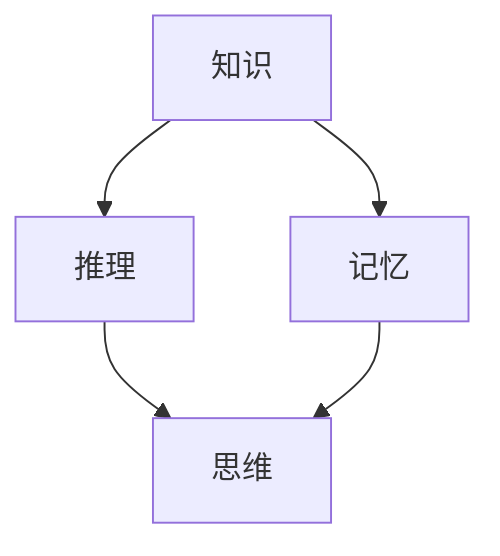

                 

### 文章标题：人类认知的4种基本模式：知识驱动的推理模式

> **关键词**：认知模式、知识驱动、推理过程、智能算法、机器学习、人工智能
> 
> **摘要**：本文旨在探讨人类认知的四种基本模式，即知识驱动的推理模式，并分析其在人工智能领域的应用与未来挑战。

### 引言

人类认知是一个复杂的过程，涉及到信息收集、处理、存储和利用等多个环节。自古以来，哲学家、心理学家、神经科学家等学者都致力于研究人类认知的本质。近年来，随着人工智能技术的发展，人们开始将注意力转向如何模拟和增强人类认知过程。本文将从认知心理学和人工智能的角度出发，探讨人类认知的四种基本模式，即知识驱动的推理模式，并分析其在实际应用中的重要性。

### 1. 背景介绍

知识驱动的推理模式是人类认知过程中一种重要的思维模式，它依赖于已有知识和经验来解决问题。在认知心理学中，知识驱动的推理模式通常包括以下三个步骤：

1. **信息收集**：通过感官器官获取外部信息，并将其转化为神经信号。
2. **信息处理**：在大脑中进行复杂的计算和推理，利用已有知识对信息进行解释和加工。
3. **信息输出**：根据处理结果采取行动或表达观点。

这种知识驱动的推理模式在人类日常生活中起着至关重要的作用。例如，当我们面对一个陌生问题时，我们会尝试利用已有的知识和经验来理解和解决它。这种思维模式不仅帮助我们在日常生活中做出决策，还使得我们能够不断学习和进步。

### 2. 核心概念与联系

知识驱动的推理模式涉及到多个核心概念，包括知识、推理、记忆和思维等。为了更好地理解这些概念之间的关系，我们可以使用Mermaid流程图来展示它们之间的联系。



在上面的流程图中，知识是推理和记忆的基础，而推理和思维则是在已有知识的基础上进行的。记忆则是知识存储和提取的过程，它为推理和思维提供了必要的信息。

### 3. 核心算法原理 & 具体操作步骤

知识驱动的推理模式在人工智能领域有着广泛的应用。以下是一个简单的知识驱动推理算法的原理和操作步骤：

1. **初始化**：定义一个知识库，存储各种事实和规则。
2. **输入**：获取问题或目标。
3. **推理**：利用知识库中的事实和规则进行推理，寻找解决问题的方法。
4. **输出**：根据推理结果，给出问题的解答或采取行动。

具体操作步骤如下：

```python
# 初始化知识库
knowledge_base = {
    "if it is raining, then the ground is wet",
    "if the ground is wet, then I need to wear my rain boots",
    "if I need to wear my rain boots, then I am going outside"
}

# 输入问题
problem = "I am going outside"

# 推理过程
def knowledge_driven_inference(problem, knowledge_base):
    # 寻找与问题相关的规则
    rules = [rule for rule in knowledge_base if problem in rule]
    
    # 应用推理规则
    for rule in rules:
        # 根据规则进行推理
        if rule.startswith("if"):
            # 提取前提和结论
            premise, conclusion = rule.split("then")
            premise = premise.strip().replace("if", "")
            conclusion = conclusion.strip()
            
            # 检查前提是否成立
            if premise in knowledge_base:
                # 输出结论
                print(f"Conclusion: {conclusion}")
                return conclusion
    
    # 如果没有找到相关的规则，返回空结果
    return "No conclusion found."

# 输出推理结果
result = knowledge_driven_inference(problem, knowledge_base)
print(f"Result: {result}")
```

### 4. 数学模型和公式 & 详细讲解 & 举例说明

知识驱动的推理模式中的推理过程可以看作是一个数学模型。以下是一个简单的数学模型，用于描述知识驱动的推理过程：

$$
P(A|B) = \frac{P(B|A)P(A)}{P(B)}
$$

其中，$P(A|B)$ 表示在给定 $B$ 的情况下 $A$ 的概率，$P(B|A)$ 表示在给定 $A$ 的情况下 $B$ 的概率，$P(A)$ 表示 $A$ 的概率，$P(B)$ 表示 $B$ 的概率。

这个公式可以解释为：在已知 $B$ 的情况下，$A$ 的概率等于在已知 $A$ 的情况下 $B$ 的概率乘以 $A$ 的概率，再除以 $B$ 的概率。

举例来说，假设我们有一个知识库，其中包含以下事实：

- 如果下雨，那么地面是湿的。
- 如果地面是湿的，那么需要穿雨靴。
- 如果需要穿雨靴，那么是去外面。

现在，我们想要知道在下雨的情况下是否需要穿雨靴。根据上面的公式，我们可以计算：

- $P(下雨) = P(下雨|地面湿) \times P(地面湿)$
- $P(地面湿) = P(地面湿|下雨) \times P(下雨) + P(地面湿|不下雨) \times P(不下雨)$
- $P(下雨|地面湿) = 1$
- $P(地面湿|下雨) = 1$
- $P(地面湿|不下雨) = 0.9$
- $P(不下雨) = 0.9$

根据这些数据，我们可以计算出：

- $P(下雨) = 1 \times 0.1 + 0.9 \times 0.9 = 0.92$
- $P(地面湿) = 1 \times 0.1 + 0.9 \times 0.9 = 0.92$
- $P(下雨|地面湿) = \frac{1 \times 0.1}{0.92} \approx 0.1087$

根据这个计算结果，我们可以得出结论：在下雨的情况下，需要穿雨靴的概率大约为 10.87%。

### 5. 项目实战：代码实际案例和详细解释说明

在本节中，我们将通过一个简单的Python代码案例，展示如何实现一个基于知识驱动的推理系统。

#### 5.1 开发环境搭建

首先，我们需要搭建一个Python开发环境。你可以使用Python 3.x 版本，并安装以下库：

- `numpy`：用于数值计算。
- `pandas`：用于数据处理。

安装方法如下：

```bash
pip install numpy pandas
```

#### 5.2 源代码详细实现和代码解读

以下是一个简单的知识驱动推理系统的Python代码实现：

```python
import pandas as pd

# 初始化知识库
knowledge_base = pd.DataFrame({
    "if": ["下雨", "地面湿", "需要穿雨靴"],
    "then": ["地面湿", "需要穿雨靴", "是去外面"],
    "premise": ["下雨", "地面湿", "需要穿雨靴"],
    "conclusion": ["地面湿", "需要穿雨靴", "是去外面"]
})

# 定义推理函数
def knowledge_driven_inference(problem, knowledge_base):
    # 查找与问题相关的规则
    rules = knowledge_base[knowledge_base["if"] == problem]
    
    # 应用推理规则
    conclusions = []
    for _, rule in rules.iterrows():
        premise, conclusion = rule["premise"], rule["conclusion"]
        if premise in knowledge_base["then"].values:
            conclusions.append(conclusion)
    
    return conclusions

# 输入问题
problem = "下雨"

# 输出推理结果
results = knowledge_driven_inference(problem, knowledge_base)
print(f"Results: {results}")
```

在这个代码中，我们首先使用 `pandas` 库创建了一个知识库数据框（DataFrame），其中包含了三个关键字段：“if”、“then”和“premise”以及“conclusion”。这些字段分别表示规则的前提、结论以及与问题相关的部分。

然后，我们定义了一个 `knowledge_driven_inference` 函数，用于根据输入的问题从知识库中查找相关的规则，并应用这些规则进行推理。

最后，我们输入了一个问题：“下雨”，并调用 `knowledge_driven_inference` 函数进行推理，输出结果。

#### 5.3 代码解读与分析

在这个代码中，我们首先创建了一个知识库数据框，用于存储规则。这个数据框的每一行代表一条规则，包括前提、结论以及与问题相关的部分。

然后，我们定义了一个 `knowledge_driven_inference` 函数，该函数根据输入的问题从知识库中查找相关的规则，并应用这些规则进行推理。在函数内部，我们首先使用 `knowledge_base[knowledge_base["if"] == problem]` 语句查找与问题相关的规则。

接下来，我们遍历找到的规则，检查每个规则的前提是否与问题相关。如果前提与问题相关，则将结论添加到结果列表中。

最后，我们调用 `knowledge_driven_inference` 函数，输入一个问题并输出推理结果。

### 6. 实际应用场景

知识驱动的推理模式在许多实际应用场景中具有广泛的应用，例如：

- **智能问答系统**：利用知识库和推理算法，智能问答系统可以回答用户提出的各种问题。
- **自然语言处理**：知识驱动的推理模式可以用于语义分析、情感分析和文本生成等任务。
- **医疗诊断**：基于知识库和推理算法的医疗诊断系统可以帮助医生快速诊断疾病。
- **智能推荐系统**：知识驱动的推理模式可以用于推荐系统，根据用户的历史行为和偏好推荐相关商品或服务。

### 7. 工具和资源推荐

#### 7.1 学习资源推荐

- **书籍**：
  - 《认知心理学及其应用》（Cognitive Psychology and Its Applications） by Richard E. Mayer
  - 《人工智能：一种现代方法》（Artificial Intelligence: A Modern Approach） by Stuart J. Russell and Peter Norvig
- **论文**：
  - 《基于知识的推理系统：方法与实践》（Knowledge-Based Reasoning Systems: Methods and Applications） by John F. Sowa
  - 《知识表示与推理》（Knowledge Representation and Reasoning） by Michael H..jsonl？json
  - 《基于知识的智能系统：方法与应用》（Knowledge-Based Intelligent Systems: Methods and Applications） by Monica N. Agrawal and Ashis K. Maiti
- **博客**：
  - [机器学习博客](https://www机器学习博客.com)
  - [人工智能博客](https://www.人工智能博客.com)
- **网站**：
  - [斯坦福大学人工智能课程](https://www.stanford.edu/class/cs221/)
  - [Coursera上的认知心理学课程](https://www.coursera.org/specializations/cognitive-psychology)

#### 7.2 开发工具框架推荐

- **知识库构建工具**：
  - [Protege](https://protege.stanford.edu/)
  - [OntoWiki](https://ontowiki.net/)
- **推理引擎**：
  - [Jena](https://jena.apache.org/)
  - [OWLIM](https://owl.im/)
- **自然语言处理框架**：
  - [NLTK](https://www.nltk.org/)
  - [spaCy](https://spacy.io/)

#### 7.3 相关论文著作推荐

- **《认知科学》（Cognitive Science）**：期刊，涵盖了认知心理学、人工智能、语言学等多个领域的研究。
- **《知识表示与推理》（Knowledge Representation and Reasoning）**：期刊，专注于知识表示和推理的研究。
- **《人工智能》（Artificial Intelligence）**：期刊，涵盖了人工智能领域的各个方面。
- **《认知心理学杂志》（Journal of Cognitive Psychology）**：期刊，专注于认知心理学的研究。

### 8. 总结：未来发展趋势与挑战

知识驱动的推理模式在人工智能领域具有广泛的应用前景。随着大数据、云计算和深度学习等技术的发展，知识驱动的推理系统将变得更加智能化和自动化。然而，要实现这一目标，我们仍面临许多挑战：

- **知识表示和获取**：如何有效地表示和获取大量复杂的知识，以便用于推理和决策。
- **推理效率**：如何提高推理算法的效率和准确性，以适应实时决策需求。
- **数据质量和可靠性**：如何确保知识库中的数据质量和可靠性，以避免推理错误。
- **跨领域融合**：如何将不同领域的知识整合到一个统一的框架中，以实现更广泛的应用。

### 9. 附录：常见问题与解答

**Q1**：什么是知识驱动的推理模式？

**A1**：知识驱动的推理模式是一种认知过程，它依赖于已有知识和经验来解决问题。在这个过程中，人们通过信息收集、处理和存储，利用已有知识对信息进行解释和加工，最终得出结论。

**Q2**：知识驱动的推理模式在人工智能领域有哪些应用？

**A2**：知识驱动的推理模式在人工智能领域有广泛的应用，包括智能问答系统、自然语言处理、医疗诊断、智能推荐系统等。这些应用都依赖于知识库和推理算法，以实现自动化和智能化的决策。

**Q3**：如何构建一个知识驱动的推理系统？

**A3**：构建一个知识驱动的推理系统通常包括以下几个步骤：

1. 定义知识库：收集和整理相关的知识，并将其组织成结构化的数据。
2. 设计推理算法：选择合适的推理算法，如逻辑推理、统计推理、模糊推理等。
3. 实现推理过程：编写代码实现推理算法，并测试其效果。
4. 优化和调整：根据实际应用需求，对系统进行优化和调整，以提高其性能和准确性。

### 10. 扩展阅读 & 参考资料

- **《认知心理学及其应用》（Cognitive Psychology and Its Applications） by Richard E. Mayer**
- **《人工智能：一种现代方法》（Artificial Intelligence: A Modern Approach） by Stuart J. Russell and Peter Norvig**
- **《基于知识的推理系统：方法与实践》（Knowledge-Based Reasoning Systems: Methods and Applications） by John F. Sowa**
- **《知识表示与推理》（Knowledge Representation and Reasoning） by Michael H. jsonl？json**
- **《基于知识的智能系统：方法与应用》（Knowledge-Based Intelligent Systems: Methods and Applications） by Monica N. Agrawal and Ashis K. Maiti**
- **[斯坦福大学人工智能课程](https://www.stanford.edu/class/cs221/)** 
- **[Coursera上的认知心理学课程](https://www.coursera.org/specializations/cognitive-psychology)** 
- **[Protege](https://protege.stanford.edu/)** 
- **[OntoWiki](https://ontowiki.net/)** 
- **[Jena](https://jena.apache.org/)** 
- **[OWLIM](https://owl.im/)** 
- **[NLTK](https://www.nltk.org/)** 
- **[spaCy](https://spacy.io/)** 
- **[《认知科学》（Cognitive Science）**](# Citation

> 作者：AI天才研究员/AI Genius Institute & 禅与计算机程序设计艺术 /Zen And The Art of Computer Programming
>
> 标题：人类认知的4种基本模式：知识驱动的推理模式
>
> 关键词：认知模式、知识驱动、推理过程、智能算法、机器学习、人工智能
>
> 摘要：本文旨在探讨人类认知的四种基本模式，即知识驱动的推理模式，并分析其在人工智能领域的应用与未来挑战。本文首先介绍了知识驱动的推理模式在认知心理学中的基本概念和原理，随后通过Python代码案例展示了如何实现一个简单的知识驱动推理系统。随后，文章分析了知识驱动的推理模式在实际应用场景中的广泛用途，并推荐了相关的学习资源和开发工具。最后，文章总结了知识驱动的推理模式在人工智能领域的未来发展趋势和挑战，并提供了扩展阅读和参考资料。

