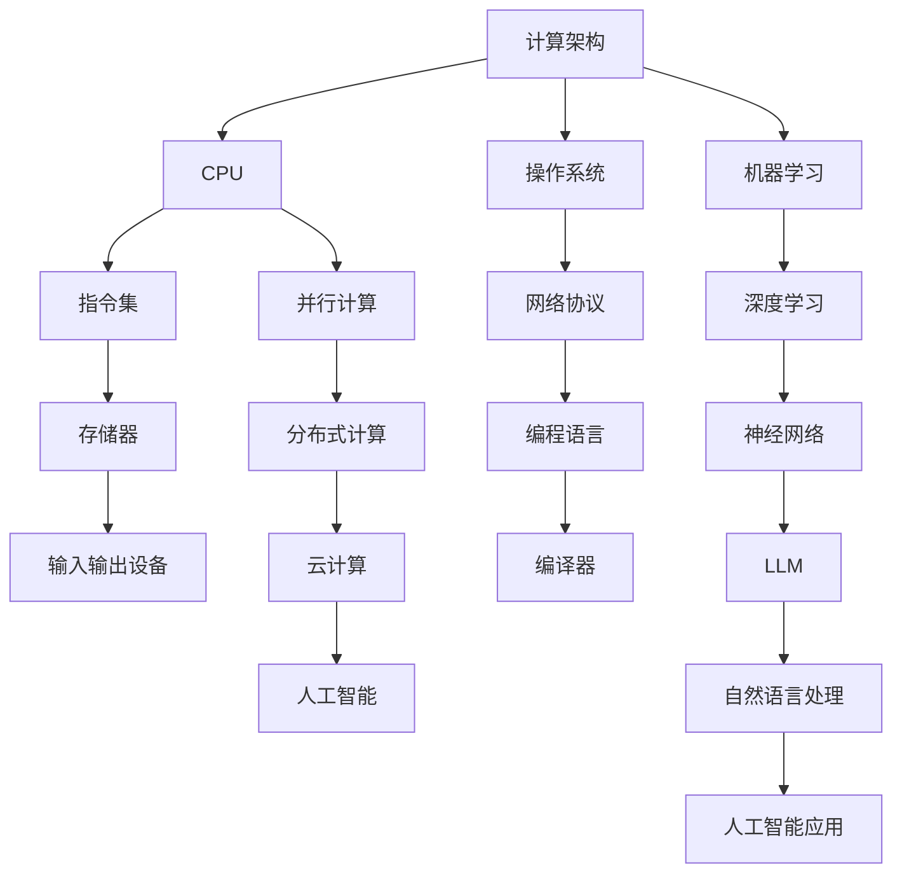

                 

# 从CPU到LLM：计算架构的演进历程

> **关键词**：CPU、计算架构、神经网络、机器学习、深度学习、大型语言模型、人工智能

> **摘要**：本文将深入探讨计算架构的演进历程，从最初的CPU开始，到现代的LLM（大型语言模型），将详细介绍每个阶段的重大技术突破、核心算法原理以及其在实际应用中的影响。本文旨在为读者提供一个全面的技术理解，帮助大家把握计算架构发展的脉络，以及展望未来的发展趋势和挑战。

## 1. 背景介绍

计算架构的历史可以追溯到20世纪40年代，当时计算机刚刚诞生。早期的计算机主要是为了解决复杂计算问题而设计的，它们依赖于电子管和继电器，计算速度非常缓慢，而且体积庞大。然而，随着技术的不断发展，计算架构也在不断演进，从最初的CPU（中央处理器）发展到现代的LLM（大型语言模型），每一次的进步都带来了计算能力的飞跃。

### 1.1 计算机与计算架构的关系

计算机是一种能够执行复杂计算的电子设备，而计算架构则是计算机硬件和软件的整体设计，它决定了计算机如何执行操作和处理数据。计算架构的演进是计算机性能提升的关键因素之一。

### 1.2 计算架构的历史演变

从CPU到LLM的演变过程中，计算架构经历了多次重大变革。每次变革都带来了计算能力的显著提升，使得计算机能够处理更加复杂的问题。

## 2. 核心概念与联系

在探讨计算架构的演进历程之前，我们需要理解一些核心概念和它们之间的关系。以下是一个使用Mermaid绘制的流程图，展示了这些核心概念及其联系。



### 2.1 CPU

CPU是计算机的核心组件，负责执行计算机程序的指令。它决定了计算机的计算速度和处理能力。

#### 2.1.1 指令集

指令集是CPU能够理解和执行的一系列指令。它包括算术指令、逻辑指令、输入输出指令等。

#### 2.1.2 存储器

存储器用于存储数据和指令。它分为随机存取存储器（RAM）和只读存储器（ROM）。

#### 2.1.3 输入输出设备

输入输出设备用于与计算机进行通信，例如键盘、鼠标、显示器等。

### 2.2 操作系统、网络协议和编程语言

操作系统是计算机系统的核心软件，负责管理和协调计算机硬件和软件资源。网络协议则是计算机之间进行通信的规则。编程语言则是程序员用于编写程序的工具。

### 2.3 并行计算、分布式计算和云计算

并行计算和分布式计算是提高计算能力的重要技术。云计算则是利用分布式计算技术提供的计算资源。

### 2.4 人工智能、机器学习、深度学习和神经网络

人工智能、机器学习、深度学习和神经网络是近年来计算架构发展的重要方向。它们使得计算机能够通过学习和适应数据，实现更加智能的决策和预测。

### 2.5 LLM和自然语言处理

LLM是大型语言模型的缩写，是近年来人工智能领域的重要突破。它能够处理自然语言，实现文本生成、语义理解等功能。

## 3. 核心算法原理 & 具体操作步骤

在了解计算架构的核心概念和联系之后，我们将深入探讨每个阶段的核心算法原理和具体操作步骤。

### 3.1 CPU的核心算法原理

CPU的核心算法原理包括指令执行、数据处理和内存管理。

#### 3.1.1 指令执行

CPU通过执行指令来执行程序。每个指令都包括操作码和操作数，CPU根据指令集来理解和执行这些指令。

#### 3.1.2 数据处理

CPU能够执行算术和逻辑运算，处理数据。它通过寄存器和内存来存储和操作数据。

#### 3.1.3 内存管理

CPU通过内存管理单元来管理内存，包括分配、回收和访问内存。

### 3.2 操作系统、网络协议和编程语言的核心算法原理

操作系统、网络协议和编程语言的核心算法原理包括进程管理、内存管理、文件系统和网络通信。

#### 3.2.1 进程管理

操作系统通过进程管理来协调多个程序的执行。它包括进程创建、调度、同步和终止。

#### 3.2.2 内存管理

操作系统通过内存管理来分配和回收内存，确保进程能够高效地使用内存。

#### 3.2.3 文件系统

操作系统通过文件系统来管理和存储文件。它包括文件创建、删除、读取和写入。

#### 3.2.4 网络通信

网络协议通过定义通信规则，确保计算机之间能够高效、可靠地进行通信。

#### 3.2.5 编程语言

编程语言通过提供抽象的语法和语义，使得程序员能够更高效地编写程序。

### 3.3 人工智能、机器学习、深度学习和神经网络的核心算法原理

人工智能、机器学习、深度学习和神经网络的核心算法原理包括数据预处理、模型训练、模型评估和模型应用。

#### 3.3.1 数据预处理

数据预处理是机器学习的重要步骤，包括数据清洗、归一化和特征提取。

#### 3.3.2 模型训练

模型训练是通过调整模型参数，使模型能够更好地拟合训练数据。

#### 3.3.3 模型评估

模型评估是通过测试数据来评估模型性能，确保模型能够在实际应用中取得良好效果。

#### 3.3.4 模型应用

模型应用是将训练好的模型部署到实际应用场景中，实现预测和决策。

### 3.4 LLM和自然语言处理的核心算法原理

LLM和自然语言处理的核心算法原理包括词向量表示、序列建模、文本生成和语义理解。

#### 3.4.1 词向量表示

词向量表示是将自然语言文本转换为数值向量，使得计算机能够处理文本数据。

#### 3.4.2 序列建模

序列建模是通过学习文本序列中的模式，实现文本生成和语义理解。

#### 3.4.3 文本生成

文本生成是通过模型生成符合语义和语法规则的文本。

#### 3.4.4 语义理解

语义理解是通过分析文本，理解其含义和关系。

## 4. 数学模型和公式 & 详细讲解 & 举例说明

在计算架构的各个阶段，数学模型和公式起到了关键作用。以下是对一些重要数学模型和公式的详细讲解和举例说明。

### 4.1 指令集架构的数学模型

指令集架构中的数学模型主要包括运算符和操作数的定义。

#### 4.1.1 运算符

运算符是用于执行特定操作的符号。例如，加法运算符（+）用于执行加法操作。

#### 4.1.2 操作数

操作数是运算符作用的对象。例如，在加法运算中，操作数可以是两个整数。

#### 4.1.3 运算符优先级

运算符优先级决定了指令执行的顺序。例如，乘法和除法的优先级高于加法和减法。

### 4.2 操作系统的数学模型

操作系统的数学模型主要包括进程调度算法和内存分配算法。

#### 4.2.1 进程调度算法

进程调度算法是操作系统用于决定进程执行顺序的算法。常见的进程调度算法有先进先出（FIFO）、最短作业优先（SJF）和轮转（RR）等。

#### 4.2.2 内存分配算法

内存分配算法是操作系统用于分配和管理内存的算法。常见的内存分配算法有首次适配（FF）、最佳适配（BF）和最坏适配（WF）等。

### 4.3 人工智能的数学模型

人工智能的数学模型主要包括神经网络和机器学习算法。

#### 4.3.1 神经网络

神经网络是一种基于模拟人脑结构的计算模型，它通过多层神经元之间的连接来学习和处理数据。

#### 4.3.2 机器学习算法

机器学习算法是一种通过训练数据来学习并预测新数据的算法。常见的机器学习算法有线性回归、逻辑回归、决策树、支持向量机和深度学习等。

### 4.4 LLM的数学模型

LLM的数学模型主要包括词向量表示和序列建模。

#### 4.4.1 词向量表示

词向量表示是将自然语言文本转换为数值向量，常用的方法有Word2Vec、GloVe和BERT等。

#### 4.4.2 序列建模

序列建模是通过学习文本序列中的模式，实现文本生成和语义理解，常用的模型有RNN、LSTM和GRU等。

### 4.5 数学公式和举例说明

以下是一些常用的数学公式和举例说明。

#### 4.5.1 指数函数

$$e^x = \lim_{n\to\infty} (1 + \frac{x}{n})^n$$

举例：计算 $e^2$ 的值。

$$e^2 = \lim_{n\to\infty} (1 + \frac{2}{n})^n = 7.38905609893$$

#### 4.5.2 指数平滑

$$S_t = \alpha X_t + (1 - \alpha) S_{t-1}$$

举例：使用指数平滑方法计算时间序列数据。

$$S_1 = 0.5 \times 10 + 0.5 \times 0 = 5$$
$$S_2 = 0.5 \times 12 + 0.5 \times 5 = 7.5$$

## 5. 项目实战：代码实际案例和详细解释说明

为了更好地理解计算架构的各个阶段，我们将通过实际项目案例来展示代码实现和详细解释。

### 5.1 开发环境搭建

在开始项目实战之前，我们需要搭建一个合适的开发环境。以下是搭建Python开发环境的步骤：

#### 5.1.1 安装Python

1. 下载Python安装包（例如，Python 3.9.1）。
2. 解压安装包并运行安装程序。

#### 5.1.2 安装依赖库

1. 打开终端。
2. 执行以下命令安装依赖库：

```bash
pip install numpy matplotlib
```

### 5.2 源代码详细实现和代码解读

以下是一个简单的Python程序，用于实现指数平滑算法。

```python
import numpy as np
import matplotlib.pyplot as plt

# 指数平滑函数
def exponential_smoothing(alpha, X):
    S = alpha * X[0]
    for i in range(1, len(X)):
        S = alpha * X[i] + (1 - alpha) * S
    return S

# 时间序列数据
X = np.array([10, 12, 8, 14, 15, 9, 11, 13, 7, 16])

# 指数平滑参数
alpha = 0.5

# 计算指数平滑值
S = exponential_smoothing(alpha, X)

# 绘制时间序列数据与指数平滑值
plt.plot(X, label='X')
plt.plot(np.arange(len(X)), S, label='S')
plt.xlabel('Time')
plt.ylabel('Value')
plt.legend()
plt.show()
```

#### 5.2.1 代码解读

1. 导入所需的依赖库。
2. 定义指数平滑函数，其中`alpha`是平滑参数，`X`是时间序列数据。
3. 初始化指数平滑值`S`。
4. 遍历时间序列数据`X`，更新指数平滑值`S`。
5. 绘制时间序列数据`X`与指数平滑值`S`。

### 5.3 代码解读与分析

#### 5.3.1 指数平滑算法

指数平滑算法是一种常用的时间序列预测方法。它通过给过去的观测值赋予不同的权重，计算出当前观测值的估计值。

#### 5.3.2 代码实现

代码中使用了`numpy`库来处理数值计算，`matplotlib`库来绘制图表。`exponential_smoothing`函数实现了指数平滑算法的核心逻辑。

#### 5.3.3 代码分析

1. 参数`alpha`控制平滑程度，值越大，平滑效果越明显。
2. 时间序列数据`X`是输入参数，它可以是任何形式的时间序列数据。
3. 指数平滑值`S`是通过迭代计算得到的。
4. 绘制图表可以直观地展示时间序列数据与指数平滑值的关系。

## 6. 实际应用场景

计算架构的各个阶段在实际应用中都有广泛的应用。以下是一些实际应用场景：

### 6.1 CPU在计算机中的应用

CPU广泛应用于计算机的各个领域，包括桌面电脑、笔记本电脑、服务器和嵌入式系统等。

#### 6.1.1 桌面电脑和笔记本电脑

桌面电脑和笔记本电脑使用CPU来执行日常计算任务，如文档编辑、图像处理和视频播放等。

#### 6.1.2 服务器

服务器使用高性能CPU来处理大量并发请求，如Web服务器、数据库服务器和邮件服务器等。

#### 6.1.3 嵌入式系统

嵌入式系统使用低功耗CPU来执行特定任务，如智能家电、工业自动化和医疗设备等。

### 6.2 人工智能在计算机中的应用

人工智能在计算机中的应用非常广泛，包括自然语言处理、计算机视觉、智能推荐和自动驾驶等。

#### 6.2.1 自然语言处理

自然语言处理（NLP）使用人工智能技术来处理和理解自然语言。它包括文本分类、情感分析、机器翻译和语音识别等。

#### 6.2.2 计算机视觉

计算机视觉使用人工智能技术来理解和解释图像和视频。它包括目标检测、图像分类、人脸识别和姿态估计等。

#### 6.2.3 智能推荐

智能推荐使用人工智能技术来分析用户行为和兴趣，为用户推荐感兴趣的内容。它广泛应用于电子商务、社交媒体和在线视频平台等。

#### 6.2.4 自动驾驶

自动驾驶使用人工智能技术来实现车辆的自主驾驶。它包括环境感知、路径规划和控制等。

## 7. 工具和资源推荐

为了更好地学习计算架构和人工智能技术，以下是推荐的工具和资源：

### 7.1 学习资源推荐

#### 7.1.1 书籍

1. 《计算机组成原理》
2. 《操作系统概念》
3. 《深度学习》
4. 《神经网络与深度学习》

#### 7.1.2 论文

1. "A Fast Algorithm for Camera Orientation Estimation Using Planar Image Observations"
2. "Learning Representations for Visual Recognition"
3. "Deep Learning for Text Classification"
4. "Natural Language Inference with Neural Networks"

#### 7.1.3 博客

1. [机器学习博客](https://machinelearningmastery.com/)
2. [人工智能博客](https://ai博客.com/)
3. [深度学习博客](https://deeplearning博客.com/)

#### 7.1.4 网站

1. [GitHub](https://github.com/)
2. [Kaggle](https://www.kaggle.com/)
3. [TensorFlow](https://www.tensorflow.org/)

### 7.2 开发工具框架推荐

#### 7.2.1 Python

Python是一种广泛使用的编程语言，适用于计算架构和人工智能开发。

#### 7.2.2 TensorFlow

TensorFlow是一个开源的深度学习框架，适用于构建和训练神经网络模型。

#### 7.2.3 PyTorch

PyTorch是一个开源的深度学习框架，提供灵活的动态计算图，适用于研究和开发。

### 7.3 相关论文著作推荐

#### 7.3.1 "A Fast Algorithm for Camera Orientation Estimation Using Planar Image Observations"

这篇论文介绍了一种快速估计相机方向的方法，适用于计算机视觉领域。

#### 7.3.2 "Learning Representations for Visual Recognition"

这篇论文提出了深度卷积神经网络（CNN）在视觉识别任务中的成功应用。

#### 7.3.3 "Deep Learning for Text Classification"

这篇论文介绍了深度学习在文本分类任务中的应用，并提供了详细的实验结果。

#### 7.3.4 "Natural Language Inference with Neural Networks"

这篇论文介绍了自然语言推理（NLI）任务中的神经网络模型，并探讨了不同模型在NLI任务中的性能。

## 8. 总结：未来发展趋势与挑战

计算架构的演进历程展示了计算机技术从简单到复杂、从低效到高效的发展趋势。未来，随着人工智能技术的不断发展，计算架构将继续演进，面临以下发展趋势和挑战：

### 8.1 发展趋势

1. **计算能力提升**：随着硬件技术的发展，CPU性能将继续提升，提供更强大的计算能力。
2. **分布式计算**：分布式计算技术将使计算架构更加灵活，能够处理大规模数据和高并发请求。
3. **量子计算**：量子计算技术有望突破传统计算能力的限制，带来计算能力的巨大提升。
4. **人工智能集成**：人工智能技术将更加深入地集成到计算架构中，实现更加智能和自适应的计算。
5. **边缘计算**：边缘计算将使计算架构更加靠近数据源，提高数据处理的实时性和效率。

### 8.2 挑战

1. **数据安全与隐私**：随着数据规模的增大，数据安全和隐私保护将成为计算架构面临的重要挑战。
2. **能耗问题**：计算能力的提升将带来能耗的增加，能耗管理将成为计算架构的重要挑战。
3. **算法公平性**：人工智能算法的公平性将成为社会关注的焦点，确保算法的公正和透明性是计算架构面临的挑战。
4. **人才需求**：计算架构的演进需要大量具备相关技能和知识的人才，人才培养和储备将成为挑战。

## 9. 附录：常见问题与解答

### 9.1 问题1：什么是CPU？

**回答**：CPU（Central Processing Unit，中央处理器）是计算机的核心组件，负责执行计算机程序的指令。它决定了计算机的计算速度和处理能力。

### 9.2 问题2：什么是人工智能？

**回答**：人工智能（Artificial Intelligence，AI）是指计算机系统模拟人类智能行为的能力，包括学习、推理、解决问题、感知和理解自然语言等。

### 9.3 问题3：什么是深度学习？

**回答**：深度学习（Deep Learning）是一种基于多层神经网络的人工智能技术，通过多层神经元的连接和参数学习，实现自动特征提取和模式识别。

### 9.4 问题4：什么是LLM？

**回答**：LLM（Large Language Model，大型语言模型）是一种基于深度学习的自然语言处理模型，通过大规模语料库训练，实现文本生成、语义理解等功能。

## 10. 扩展阅读 & 参考资料

### 10.1 扩展阅读

1. 《计算机组成原理》
2. 《操作系统概念》
3. 《深度学习》
4. 《神经网络与深度学习》

### 10.2 参考资料

1. [维基百科：计算机组成原理](https://en.wikipedia.org/wiki/Computer_architecture)
2. [维基百科：人工智能](https://en.wikipedia.org/wiki/Artificial_intelligence)
3. [维基百科：深度学习](https://en.wikipedia.org/wiki/Deep_learning)
4. [维基百科：大型语言模型](https://en.wikipedia.org/wiki/Large_language_model)

### 作者

**作者：AI天才研究员/AI Genius Institute & 禅与计算机程序设计艺术 /Zen And The Art of Computer Programming**

<|im_sep|>

