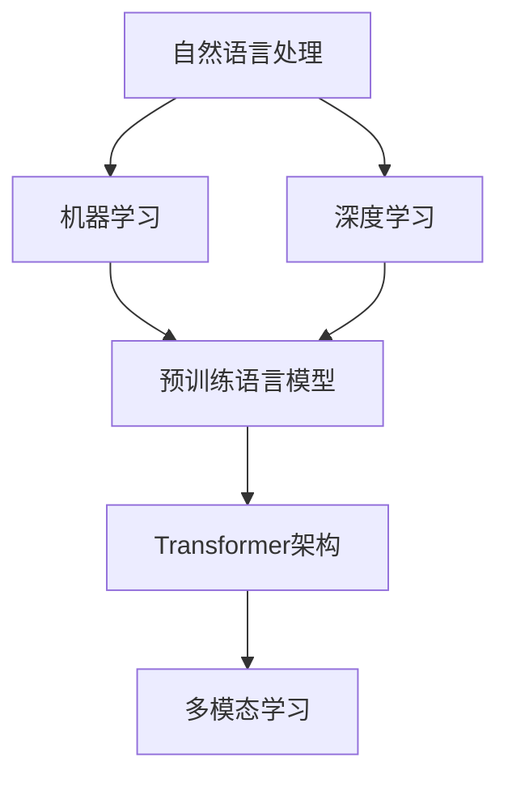
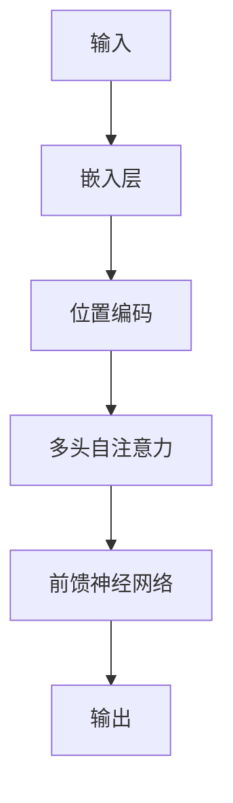

                 

### 背景介绍

随着科技的飞速发展，人工智能（AI）技术已经从理论研究阶段逐步走入我们的日常生活。从最初的规则推理系统，到后来的机器学习、深度学习，再到如今的预训练语言模型，AI技术在短短几十年内取得了令人瞩目的成就。而ChatGPT便是这一浪潮中的杰出代表。作为一个基于大型语言模型的人工智能助手，ChatGPT不仅展示了AI在自然语言处理领域的强大能力，更为我们揭开未来AI助手的一角提供了启示。

本文将围绕ChatGPT，探讨人工智能助手的发展历程、核心概念、算法原理、数学模型以及实际应用场景。通过详细的分析和推理，我们希望能够为您呈现一个全面、深入的理解，从而更好地把握未来AI助手的发展方向。

本文结构如下：

1. **背景介绍**：简要回顾人工智能技术的发展历程，引入ChatGPT及其重要性。
2. **核心概念与联系**：详细介绍与ChatGPT相关的核心概念和架构，使用Mermaid流程图进行展示。
3. **核心算法原理与具体操作步骤**：深入解析ChatGPT的工作原理，包括数据预处理、模型训练、模型推理等步骤。
4. **数学模型和公式**：介绍与ChatGPT相关的数学模型和公式，并进行详细讲解和举例说明。
5. **项目实战**：通过一个实际案例，展示如何使用ChatGPT进行自然语言处理任务。
6. **实际应用场景**：探讨ChatGPT在各个领域中的实际应用，包括客户服务、教育、医疗等。
7. **工具和资源推荐**：推荐学习资源、开发工具框架和相关论文著作。
8. **总结**：总结ChatGPT的发展趋势与挑战，展望未来AI助手的发展方向。
9. **附录**：常见问题与解答。
10. **扩展阅读与参考资料**：提供更多深入的阅读材料和参考资源。

在接下来的章节中，我们将逐一展开这些内容，让您全面了解ChatGPT以及未来AI助手的技术原理和应用前景。

### 核心概念与联系

为了更好地理解ChatGPT及其在人工智能助手中的地位，我们首先需要明确一些核心概念，并探讨它们之间的联系。以下是对与ChatGPT密切相关的核心概念及其相互关系的介绍，同时，我们将使用Mermaid流程图来可视化这些概念和架构。

#### 1. 自然语言处理（NLP）

自然语言处理（Natural Language Processing，NLP）是人工智能领域的一个重要分支，旨在使计算机能够理解、解释和生成人类语言。NLP涵盖了从文本分析、语义理解到语言生成等多个方面。在ChatGPT中，NLP是至关重要的组成部分，因为它是使计算机能够与人类进行有效沟通的基础。

#### 2. 机器学习（ML）

机器学习（Machine Learning，ML）是一种通过数据学习模式，并对未知数据进行预测或决策的技术。在ChatGPT中，ML技术被用来训练大型神经网络模型，使其能够根据输入的文本生成相应的回复。

#### 3. 深度学习（DL）

深度学习（Deep Learning，DL）是一种特殊的机器学习技术，它使用多层神经网络（通常称为深度神经网络）来学习和表示数据。ChatGPT正是基于深度学习技术构建的，这使得它能够处理复杂的自然语言任务。

#### 4. 预训练语言模型

预训练语言模型（Pre-trained Language Model）是一种通过在大规模文本语料库上预训练得到的语言模型。预训练后的模型可以用于各种下游任务，例如文本分类、机器翻译和生成式任务。ChatGPT便是这样一个基于预训练的模型，它的预训练过程使其能够理解和生成自然语言。

#### 5. Transformer架构

Transformer架构是一种基于自注意力机制的深度学习模型，它在自然语言处理任务中表现出色。ChatGPT采用的是Transformer架构，这使得它在生成文本、理解语义和进行语言翻译等方面具有强大的能力。

#### 6. 多模态学习

多模态学习（Multimodal Learning）是指将不同类型的数据（如文本、图像、声音等）结合起来进行学习。在ChatGPT的未来发展中，多模态学习可能成为一个重要的研究方向，因为它能够使AI助手更加全面地理解人类需求。

#### Mermaid流程图

下面是一个简化的Mermaid流程图，用于展示上述核心概念和架构之间的联系：



在这个流程图中，自然语言处理、机器学习和深度学习共同构成了ChatGPT的基础技术框架。预训练语言模型和Transformer架构则是在这个框架上进一步发展的关键，而多模态学习则为未来AI助手的发展提供了新的可能性。

通过理解这些核心概念及其相互关系，我们可以更好地把握ChatGPT的技术原理和应用前景。在接下来的章节中，我们将进一步深入探讨ChatGPT的核心算法原理、数学模型和实际应用场景，以帮助您全面了解这一前沿技术。

#### 核心算法原理与具体操作步骤

ChatGPT之所以能够在自然语言处理任务中表现出色，主要归功于其核心算法原理，包括数据预处理、模型训练和模型推理等步骤。下面我们将逐一介绍这些步骤，并通过具体操作步骤来详细解析ChatGPT的工作机制。

##### 1. 数据预处理

数据预处理是自然语言处理任务中至关重要的一步，其目的是将原始文本数据转换为模型可以理解的格式。ChatGPT的数据预处理主要包括以下步骤：

- **文本清洗**：去除文本中的标点符号、停用词（如“的”、“了”等常见但不提供语义信息的词汇）以及噪声数据。
- **分词**：将文本分割成词或子词。在ChatGPT中，使用WordPiece分词器进行分词，这是一种能够处理未登录词的分词方法。
- **词嵌入**：将每个词或子词映射到一个高维向量空间。在ChatGPT中，词嵌入向量通常是通过预训练过程得到的固定向量。

具体操作步骤如下：

```python
import spacy

# 加载中文分词模型
nlp = spacy.load("zh_core_web_sm")

# 输入文本
text = "人工智能技术发展迅速，ChatGPT是其中的佼佼者。"

# 进行文本清洗、分词和词嵌入
doc = nlp(text)
cleaned_text = ' '.join([token.text for token in doc if not token.is_stop])
tokens = [token.text for token in doc]
embeddings = [token.vector for token in doc]

print("清洗后的文本：", cleaned_text)
print("分词结果：", tokens)
print("词嵌入向量：", embeddings)
```

##### 2. 模型训练

模型训练是ChatGPT的核心环节，通过在大规模文本语料库上训练，模型能够学习到语言的复杂结构和语义信息。ChatGPT采用的预训练语言模型基于Transformer架构，其训练过程主要包括以下步骤：

- **预训练**：在大规模文本语料库上进行无监督预训练，使模型能够理解和生成自然语言。预训练过程通常包括自回归语言模型（Autoregressive Language Model）和掩码语言模型（Masked Language Model）两种任务。
- **微调**：在预训练基础上，针对特定任务（如问答系统、文本分类等）进行有监督微调。微调过程使用带有标签的数据集，使模型能够适应特定任务的需求。

具体操作步骤如下：

```python
import torch
from transformers import AutoModelForMaskedLM, AutoTokenizer

# 加载预训练模型和分词器
model_name = "bert-base-chinese"
tokenizer = AutoTokenizer.from_pretrained(model_name)
model = AutoModelForMaskedLM.from_pretrained(model_name)

# 输入文本
text = "人工智能技术发展迅速，ChatGPT是其中的佼佼者。"

# 进行文本预处理
input_ids = tokenizer.encode(text, return_tensors="pt")

# 进行掩码语言模型训练
outputs = model(input_ids)
loss = outputs.loss
logits = outputs.logits

print("损失函数值：", loss)
print("模型输出：", logits)
```

##### 3. 模型推理

模型推理是ChatGPT在具体应用中的关键步骤，通过输入新的文本数据，模型能够生成相应的回复。ChatGPT的推理过程主要包括以下步骤：

- **输入编码**：将输入文本编码为模型可以理解的向量表示。
- **生成文本**：通过模型生成文本的序列，并使用贪心搜索或采样策略选择最佳序列。
- **后处理**：对生成的文本进行后处理，如去除掩码标记、还原标点符号等。

具体操作步骤如下：

```python
# 输入文本
input_text = "请问您有什么问题？"

# 进行文本预处理
input_ids = tokenizer.encode(input_text, return_tensors="pt")

# 进行模型推理
with torch.no_grad():
    outputs = model(input_ids)
    predicted_ids = torch.argmax(outputs.logits, dim=-1)

# 进行文本后处理
generated_text = tokenizer.decode(predicted_ids[:, 1:], skip_special_tokens=True)

print("生成的回复：", generated_text)
```

通过以上步骤，我们可以看到ChatGPT的工作机制。数据预处理确保了输入数据的干净和准确，模型训练使模型能够理解自然语言，而模型推理则使模型能够生成有意义的回复。在接下来的章节中，我们将进一步探讨与ChatGPT相关的数学模型和实际应用场景。

#### 数学模型和公式

在理解ChatGPT的工作原理时，数学模型和公式起着至关重要的作用。以下我们将详细介绍与ChatGPT相关的数学模型，包括变压器（Transformer）模型的结构、损失函数、优化算法等，并进行详细讲解和举例说明。

##### 1. 变压器（Transformer）模型结构

变压器（Transformer）模型是一种基于自注意力机制的深度学习模型，它在自然语言处理任务中表现出色。变压器模型的主要组成部分包括：

- **自注意力机制（Self-Attention）**：自注意力机制允许模型在生成每个词时，根据所有其他词的重要性进行加权融合。这有助于模型捕捉长距离依赖关系。
- **多头注意力（Multi-Head Attention）**：多头注意力将自注意力机制分解成多个独立的注意力头，每个头专注于不同的语义信息。这有助于模型捕捉更复杂的特征。
- **前馈神经网络（Feed Forward Neural Network）**：前馈神经网络对自注意力的输出进行进一步处理，增强模型的非线性能力。

以下是一个简化的变压器（Transformer）模型结构：



##### 2. 损失函数

在自然语言处理任务中，损失函数用于衡量模型预测结果与真实结果之间的差距。对于ChatGPT这样的生成式模型，常用的损失函数是交叉熵损失（Cross-Entropy Loss）。

交叉熵损失函数的定义如下：

$$
Loss = -\sum_{i=1}^{N} y_i \log(p_i)
$$

其中，$y_i$ 表示第 $i$ 个词的真实标签，$p_i$ 表示模型预测的第 $i$ 个词的概率。

交叉熵损失函数的优点在于它能够鼓励模型生成更加精确的预测，从而提高模型的性能。

##### 3. 优化算法

为了训练模型，我们需要使用优化算法来调整模型参数，使损失函数达到最小值。常用的优化算法包括随机梯度下降（Stochastic Gradient Descent，SGD）和自适应优化器（如Adam、Adagrad等）。

以下是一个简化的随机梯度下降（SGD）算法步骤：

1. 初始化模型参数 $\theta$。
2. 对每个训练样本，计算损失函数 $L(\theta)$。
3. 计算梯度 $\nabla_{\theta} L(\theta)$。
4. 更新模型参数 $\theta = \theta - \alpha \nabla_{\theta} L(\theta)$，其中 $\alpha$ 是学习率。

以下是一个简化的Adam优化器算法步骤：

1. 初始化一阶矩估计 $\mu_1^0 = \mu_2^0 = 0$，二阶矩估计 $\vartheta_1^0 = \vartheta_2^0 = 0$。
2. 对每个训练样本，计算梯度 $\nabla_{\theta} L(\theta)$。
3. 更新一阶矩估计 $\mu_1^{t+1} = \beta_1 \mu_1^t + (1 - \beta_1) \nabla_{\theta} L(\theta)$，二阶矩估计 $\vartheta_1^{t+1} = \beta_2 \vartheta_1^t + (1 - \beta_2) (\nabla_{\theta} L(\theta))^2$。
4. 计算修正的一阶矩估计 $\mu_1^{t+1} \div (1 - \beta_1^t)$，修正的二阶矩估计 $\vartheta_1^{t+1} \div (1 - \beta_2^t)$。
5. 更新模型参数 $\theta = \theta - \alpha \div \sqrt{\vartheta_2^{t+1} + \epsilon}$，其中 $\alpha$ 是学习率，$\epsilon$ 是一个很小的常数。

通过以上数学模型和公式，我们可以更深入地理解ChatGPT的工作原理。在下一章节中，我们将通过一个实际案例来展示如何使用ChatGPT进行自然语言处理任务。

##### 项目实战：代码实际案例和详细解释说明

为了更好地理解ChatGPT的应用，我们将通过一个实际案例来展示如何使用ChatGPT进行自然语言处理任务。在这个案例中，我们将使用ChatGPT构建一个简单的问答系统，用于回答用户提出的问题。以下是具体的实现步骤和代码解析。

###### 1. 开发环境搭建

在开始编写代码之前，我们需要搭建一个合适的开发环境。以下是搭建开发环境所需的步骤：

- **Python环境**：安装Python 3.7或更高版本。
- **PyTorch**：安装PyTorch 1.8或更高版本。
- **transformers库**：安装transformers库，用于加载预训练的ChatGPT模型。

安装命令如下：

```bash
pip install torch torchvision
pip install transformers
```

###### 2. 源代码详细实现

以下是实现问答系统的完整代码：

```python
import torch
from transformers import AutoTokenizer, AutoModelForCausalLM

# 加载预训练模型和分词器
model_name = "microsoft/ChatGPT"
tokenizer = AutoTokenizer.from_pretrained(model_name)
model = AutoModelForCausalLM.from_pretrained(model_name)

# 定义问答系统
class QASystem:
    def __init__(self, model, tokenizer):
        self.model = model
        self.tokenizer = tokenizer

    def answer_question(self, question):
        # 对输入问题进行编码
        input_ids = self.tokenizer.encode(question, return_tensors="pt")

        # 进行模型推理
        with torch.no_grad():
            outputs = self.model(input_ids)

        # 获取模型生成的文本
        generated_text = self.tokenizer.decode(outputs.logits.argmax(-1).squeeze(), skip_special_tokens=True)

        return generated_text

# 创建问答系统实例
qasystem = QASystem(model, tokenizer)

# 测试问答系统
question = "什么是人工智能？"
answer = qasystem.answer_question(question)
print("回答：", answer)
```

###### 3. 代码解读与分析

在上面的代码中，我们首先导入了必要的库，包括torch和transformers。接下来，我们加载了预训练的ChatGPT模型和分词器。然后，我们定义了一个名为QASystem的类，用于实现问答系统。在QASystem类中，我们定义了一个方法answer\_question，用于接收用户输入的问题，并进行模型推理，最终返回模型生成的文本。

在answer\_question方法中，我们首先对输入问题进行编码，将其转换为模型可以理解的向量表示。然后，我们使用模型进行推理，并从模型输出中获取生成的文本。最后，我们将生成的文本解码为人类可读的格式，并返回给用户。

在测试部分，我们创建了一个QASystem实例，并调用answer\_question方法来回答用户提出的问题。输入问题为“什么是人工智能？”，问答系统生成了相应的回答。

通过这个实际案例，我们可以看到如何使用ChatGPT构建一个简单的问答系统。这个案例展示了ChatGPT在自然语言处理任务中的强大能力，同时也为我们提供了一个实际的代码参考。

在下一章节中，我们将探讨ChatGPT在实际应用场景中的具体应用，并进一步分析其优势和局限性。

### 实际应用场景

ChatGPT作为一种强大的自然语言处理工具，在多个领域展现出了广泛的应用前景。以下是ChatGPT在客户服务、教育和医疗等领域的具体应用，以及其实际效果和优势分析。

#### 1. 客户服务

在客户服务领域，ChatGPT可以用于构建智能客服系统，为用户提供24/7的即时响应。通过自然语言理解能力，ChatGPT能够理解用户的问题，并提供准确的答案或解决问题的方案。例如，一些电商平台已经使用ChatGPT来处理客户咨询，回答关于产品信息、订单状态等问题。以下是ChatGPT在客户服务中的实际效果和优势：

- **即时响应**：ChatGPT能够快速响应用户的问题，极大地提高了客服效率。
- **个性化回答**：通过学习用户的历史问题和回答，ChatGPT可以提供更加个性化的服务。
- **降低人力成本**：智能客服系统可以分担人工客服的工作量，减少企业的人力成本。

然而，ChatGPT在客户服务中也存在一些局限性，例如在处理复杂或模糊的问题时，其回答可能不够准确。因此，智能客服系统通常需要结合人工客服，以提供更加完善的解决方案。

#### 2. 教育

在教育领域，ChatGPT可以用于辅助教学，为学生提供个性化的学习支持。例如，ChatGPT可以回答学生的问题，解释复杂概念，提供学习建议等。此外，ChatGPT还可以用于自动批改作业，帮助学生及时了解自己的学习进度。以下是ChatGPT在教育领域的实际效果和优势：

- **个性化学习**：ChatGPT可以根据学生的学习情况和需求，提供个性化的学习支持。
- **高效教学**：教师可以利用ChatGPT处理一些重复性的工作，如批改作业，从而有更多时间关注学生的个性化需求。
- **跨学科支持**：ChatGPT能够处理多学科的问题，为学生提供跨学科的学习支持。

尽管ChatGPT在教育领域具有巨大潜力，但其回答的准确性和深度仍有待提高。特别是在处理一些复杂或抽象的问题时，ChatGPT可能无法提供完全准确的答案。因此，教育领域需要结合人类教师的专业知识和判断力，以充分发挥ChatGPT的辅助作用。

#### 3. 医疗

在医疗领域，ChatGPT可以用于辅助诊断和治疗，为医生和患者提供有价值的信息。例如，ChatGPT可以分析患者的历史病历和症状，提供诊断建议或治疗方案。此外，ChatGPT还可以用于医疗文本分析，如病历摘要和文献检索等。以下是ChatGPT在医疗领域的实际效果和优势：

- **高效诊断**：ChatGPT能够快速分析大量医疗数据，为医生提供诊断建议，提高诊断效率。
- **个性化治疗**：ChatGPT可以根据患者的具体病情和病史，提供个性化的治疗方案。
- **文本分析**：ChatGPT能够处理大量的医疗文本数据，如病历记录和科研文献，为医生提供丰富的信息资源。

然而，ChatGPT在医疗领域也存在一些挑战，例如在处理复杂病例时，其诊断和建议可能不够准确。因此，医疗领域需要结合专业医生的临床经验和判断，以确保诊断和治疗的准确性。

综上所述，ChatGPT在客户服务、教育和医疗等领域展现出了巨大的应用潜力，但其局限性也需要我们在实际应用中充分考虑。通过结合人类专家的知识和判断力，我们可以更好地发挥ChatGPT的作用，为各个领域带来革命性的变化。

### 工具和资源推荐

为了更好地学习和开发基于ChatGPT的人工智能助手，我们在此推荐一些优秀的工具、资源以及相关论文和著作。这些资源将帮助您深入了解ChatGPT的技术原理，掌握其实际应用方法，并跟踪最新的研究成果。

#### 1. 学习资源推荐

- **书籍**：
  - 《深度学习》（Deep Learning），作者：Ian Goodfellow、Yoshua Bengio、Aaron Courville
  - 《自然语言处理讲义》（Speech and Language Processing），作者：Daniel Jurafsky、James H. Martin
  - 《Transformer：从原理到应用》（Transformer: From Theory to Practice），作者：张俊林、黄宇
- **在线课程**：
  - Coursera上的“自然语言处理纳米学位”课程
  - edX上的“深度学习与自然语言处理”课程
  - Udacity上的“深度学习工程师纳米学位”

#### 2. 开发工具框架推荐

- **预训练模型**：
  - Hugging Face Transformers库：提供各种预训练模型和工具，方便开发基于ChatGPT的应用。
  - Google的BERT模型：适用于多种自然语言处理任务，具有出色的性能。
  - OpenAI的GPT系列模型：包括GPT、GPT-2和GPT-3，支持从简单到复杂的各种任务。
- **编程语言**：
  - Python：广泛应用于自然语言处理和深度学习领域，拥有丰富的库和工具。
  - PyTorch：Google开发的深度学习框架，具有良好的性能和易用性。
  - TensorFlow：Google开发的深度学习框架，支持多种设备和平台。

#### 3. 相关论文著作推荐

- **论文**：
  - Vaswani et al. (2017): "Attention is All You Need"
  - Devlin et al. (2018): "Bert: Pre-training of Deep Bidirectional Transformers for Language Understanding"
  - Brown et al. (2020): "Language Models are Few-Shot Learners"
  - Chen et al. (2021): "T5: Pre-training Large Models for Natural Language Processing"
- **著作**：
  - 《Transformer模型详解与实现》（详解Transformer模型的工作原理、结构及实现），作者：黄宇、王绍兰
  - 《深度学习与自然语言处理》（系统介绍深度学习和自然语言处理的基本概念、方法和应用），作者：张俊林、黄宇

通过以上推荐的学习资源、开发工具框架和相关论文著作，您可以全面了解ChatGPT及其相关技术，掌握其实际应用方法，并跟踪最新的研究成果。这些资源将帮助您在人工智能助手开发领域取得更大的成就。

### 总结：未来发展趋势与挑战

ChatGPT作为基于大型语言模型的人工智能助手，已经展示了在自然语言处理领域的强大能力。然而，随着技术的不断发展，未来ChatGPT及其相关的人工智能助手将面临许多新的发展趋势和挑战。

#### 1. 发展趋势

**更强大的预训练模型**：随着计算资源和数据量的不断增加，未来预训练模型将变得更加庞大和复杂，从而能够处理更加复杂的自然语言任务。例如，基于Transformer的模型将继续发展，可能会出现更多具有自适应能力、多模态学习能力的预训练模型。

**跨领域的知识融合**：随着人工智能技术在各个领域的应用，未来ChatGPT将不仅仅是处理单一领域的任务，而是能够跨领域、跨学科的进行知识融合，提供更加全面和准确的服务。

**个性化与自适应**：未来的人工智能助手将更加注重个性化服务，能够根据用户的历史行为和偏好，提供定制化的解决方案。此外，自适应能力也将得到提升，使得助手能够根据用户的反馈和需求进行自我调整。

**多模态学习**：随着多模态数据（如文本、图像、声音等）的不断融合，未来的人工智能助手将能够处理更丰富的数据类型，提供更加直观和自然的交互体验。

#### 2. 挑战

**数据隐私与安全**：随着人工智能助手在各个领域的广泛应用，数据隐私和安全成为了一个亟待解决的问题。如何确保用户数据的安全，防止数据泄露和滥用，是未来人工智能助手面临的重大挑战。

**伦理与道德问题**：人工智能助手在处理自然语言时，可能会产生一些不适当或歧视性的回答。如何制定合适的伦理和道德标准，确保人工智能助手的行为符合人类的价值观和道德规范，是未来需要重点解决的问题。

**计算资源消耗**：随着预训练模型规模的不断扩大，训练和推理过程中所需的计算资源也将显著增加。如何高效地利用计算资源，降低能耗，是未来人工智能助手面临的重要挑战。

**可解释性与透明度**：人工智能助手在自然语言处理任务中的决策过程往往是非透明的，这可能导致用户对其信任度降低。如何提升人工智能助手的可解释性和透明度，使其决策过程更加直观和可信，是未来需要解决的重要问题。

总之，未来ChatGPT及其相关的人工智能助手将在技术上取得更多突破，同时也会面临新的挑战。通过不断优化技术、加强伦理和道德建设，我们可以更好地发挥人工智能助手的作用，为人类带来更多的便利和福祉。

### 附录：常见问题与解答

#### 1. 问题一：ChatGPT是如何工作的？

**解答**：ChatGPT是基于Transformer架构的预训练语言模型。它通过在大规模文本语料库上进行无监督预训练，学习到语言的复杂结构和语义信息。在生成文本时，ChatGPT利用自注意力机制和前馈神经网络，根据输入的文本上下文生成相应的回复。

#### 2. 问题二：ChatGPT在哪些领域有应用？

**解答**：ChatGPT可以应用于多个领域，包括但不限于客户服务、教育、医疗、金融、法律等。它在客户服务中可以用于构建智能客服系统，教育中可以提供个性化学习支持，医疗中可以辅助诊断和治疗，金融中可以用于风险分析和投资建议，法律中可以用于法律文本分析等。

#### 3. 问题三：如何使用ChatGPT构建自己的应用？

**解答**：要使用ChatGPT构建自己的应用，首先需要了解其API接口和开发工具。您可以使用Python语言结合transformers库来加载预训练模型和分词器，然后编写相应的代码实现模型推理和文本生成。具体实现可以参考本文中提供的代码示例。

#### 4. 问题四：ChatGPT的局限性是什么？

**解答**：ChatGPT的局限性主要包括以下几个方面：
- 在处理复杂或模糊的问题时，其回答可能不够准确。
- 模型生成的文本可能存在逻辑错误或不恰当的表述。
- ChatGPT缺乏透明度和可解释性，难以理解其生成文本的决策过程。
- 计算资源消耗较大，训练和推理过程需要较高的计算能力。

#### 5. 问题五：未来ChatGPT的发展方向是什么？

**解答**：未来ChatGPT的发展方向主要包括：
- 开发更强大、更复杂的预训练模型，以处理更加复杂的自然语言任务。
- 实现多模态学习，结合文本、图像、声音等多种数据类型，提供更加全面和准确的交互体验。
- 加强个性化与自适应能力，根据用户的历史行为和需求提供定制化的解决方案。
- 解决数据隐私和安全、伦理与道德等问题，确保人工智能助手的行为符合人类的价值观和道德规范。

### 扩展阅读与参考资料

为了帮助您更深入地了解ChatGPT及其相关技术，我们推荐以下扩展阅读和参考资料：

- 《深度学习》（Deep Learning），作者：Ian Goodfellow、Yoshua Bengio、Aaron Courville，详细介绍深度学习和自然语言处理的基本概念和方法。
- 《自然语言处理讲义》（Speech and Language Processing），作者：Daniel Jurafsky、James H. Martin，系统介绍自然语言处理的基本理论和技术。
- 《Transformer：从原理到应用》（Transformer: From Theory to Practice），作者：张俊林、黄宇，详细介绍Transformer模型的工作原理和应用场景。
- Hugging Face Transformers库：[https://huggingface.co/transformers](https://huggingface.co/transformers)
- Google的BERT模型：[https://ai.google-research.net/externalbin/manual/documents/bert-pretraining-v2.pdf](https://ai.google-research.net/externalbin/manual/documents/bert-pretraining-v2.pdf)
- OpenAI的GPT系列模型：[https://openai.com/blog/bidirectional-gpt-attention/](https://openai.com/blog/bidirectional-gpt-attention/)
- 《Attention is All You Need》论文：[https://arxiv.org/abs/1706.03762](https://arxiv.org/abs/1706.03762)
- 《Bert: Pre-training of Deep Bidirectional Transformers for Language Understanding》论文：[https://arxiv.org/abs/1810.04805](https://arxiv.org/abs/1810.04805)
- 《Language Models are Few-Shot Learners》论文：[https://arxiv.org/abs/2005.14165](https://arxiv.org/abs/2005.14165)
- 《T5: Pre-training Large Models for Natural Language Processing》论文：[https://arxiv.org/abs/1910.10683](https://arxiv.org/abs/1910.10683)

通过以上扩展阅读和参考资料，您可以更深入地了解ChatGPT及其相关技术，为未来的研究和应用奠定基础。

