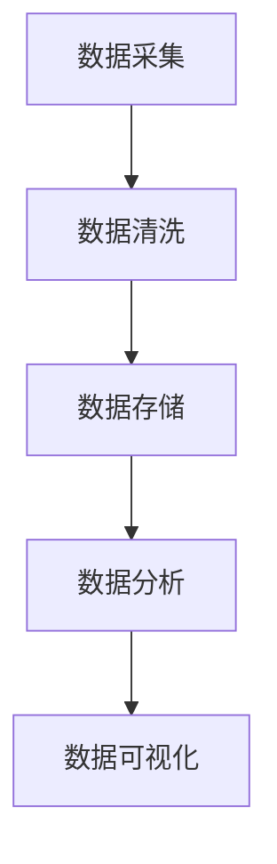

                 

# 从MVP到规模化：AI电商平台的技术架构演进之路

> **关键词：** AI电商、MVP、技术架构、规模化、算法优化

> **摘要：** 本文将从MVP（最小可行产品）阶段出发，探讨AI电商平台技术架构的演进过程。通过分析核心概念、算法原理、数学模型、实战案例以及应用场景，揭示技术架构在实现规模化过程中的关键角色和策略。本文旨在为从事电商和AI领域的开发者和研究者提供有价值的参考。

## 1. 背景介绍

随着互联网的普及和电子商务的蓬勃发展，AI技术在电商领域的应用逐渐成为趋势。AI电商平台通过利用大数据、机器学习和深度学习等技术，为用户提供了个性化推荐、智能客服、智能搜索等功能，极大地提升了用户体验和转化率。

然而，AI电商平台的构建并非一蹴而就。从最初的MVP（最小可行产品）阶段，到逐步完善和规模化，技术架构的演进在其中扮演着至关重要的角色。本文将围绕AI电商平台的技术架构，探讨其在不同发展阶段所面临的挑战和解决方案，以期为开发者提供有价值的借鉴和启示。

## 2. 核心概念与联系

### 2.1 数据处理流程

在AI电商平台的构建过程中，数据处理流程是一个关键环节。数据处理流程主要包括数据采集、数据清洗、数据存储、数据分析和数据可视化等步骤。

Mermaid流程图如下：



### 2.2 个性化推荐算法

个性化推荐算法是AI电商平台的核心功能之一。常见的推荐算法包括基于内容的推荐、协同过滤推荐和深度学习推荐等。

- **基于内容的推荐**：根据用户的历史行为和偏好，推荐与用户历史行为相似的商品。
- **协同过滤推荐**：通过分析用户之间的相似性，推荐其他用户喜欢的商品。
- **深度学习推荐**：利用深度学习模型，从大规模数据中挖掘用户兴趣，实现精准推荐。

### 2.3 智能客服系统

智能客服系统是AI电商平台提升用户体验的重要手段。通过自然语言处理技术，智能客服系统能够理解用户的提问，并给出相应的回答。

智能客服系统主要包括以下几个模块：

- **语音识别**：将用户的语音转化为文本。
- **自然语言理解**：理解用户的意图和问题。
- **对话生成**：生成自然流畅的回复。

## 3. 核心算法原理 & 具体操作步骤

### 3.1 个性化推荐算法原理

个性化推荐算法的核心是构建用户和商品之间的相似性矩阵。具体操作步骤如下：

1. **用户行为数据采集**：收集用户在平台上的行为数据，如浏览、购买、评价等。
2. **数据处理**：对采集到的数据进行分析和清洗，去除异常值和噪音。
3. **特征提取**：将用户和商品的行为数据转化为特征向量。
4. **相似性计算**：计算用户和商品之间的相似性，常用的相似性度量方法包括余弦相似度、皮尔逊相似度等。
5. **推荐生成**：根据相似性矩阵，生成推荐列表。

### 3.2 智能客服系统原理

智能客服系统的核心是自然语言处理技术。具体操作步骤如下：

1. **语音识别**：将用户的语音转化为文本，常用的语音识别引擎包括百度语音、腾讯语音等。
2. **自然语言理解**：理解用户的意图和问题，常用的方法包括词向量、实体识别、依存句法分析等。
3. **对话生成**：根据用户的意图和问题，生成自然流畅的回复，常用的方法包括模板匹配、序列到序列模型等。

## 4. 数学模型和公式 & 详细讲解 & 举例说明

### 4.1 个性化推荐算法中的相似性计算

相似性计算是个性化推荐算法的核心。以下是一个基于余弦相似度的计算示例：

假设用户A和用户B的行为数据可以表示为两个向量 $u_a$ 和 $u_b$，它们的余弦相似度计算公式如下：

$$
sim(u_a, u_b) = \frac{u_a \cdot u_b}{\|u_a\| \|u_b\|}
$$

其中，$u_a \cdot u_b$ 表示向量 $u_a$ 和 $u_b$ 的点积，$\|u_a\|$ 和 $\|u_b\|$ 分别表示向量 $u_a$ 和 $u_b$ 的模长。

例如，假设用户A和用户B的行为数据如下：

$$
u_a = [0.5, 0.3, 0.2]
$$

$$
u_b = [0.4, 0.5, 0.1]
$$

则它们之间的余弦相似度为：

$$
sim(u_a, u_b) = \frac{0.5 \times 0.4 + 0.3 \times 0.5 + 0.2 \times 0.1}{\sqrt{0.5^2 + 0.3^2 + 0.2^2} \sqrt{0.4^2 + 0.5^2 + 0.1^2}} \approx 0.76
$$

### 4.2 智能客服系统中的序列到序列模型

序列到序列（Seq2Seq）模型是自然语言处理中的常用模型。以下是一个简单的Seq2Seq模型架构：

1. **编码器（Encoder）**：将输入序列（如用户的提问）编码为一个固定长度的向量。
2. **解码器（Decoder）**：将编码器输出的向量解码为一个输出序列（如客服的回答）。

以下是一个简单的Seq2Seq模型实现示例：

```python
import tensorflow as tf

# 编码器
encoder_inputs = tf.keras.layers.Input(shape=(None, input_vocab_size))
encoder_embedding = tf.keras.layers.Embedding(input_vocab_size, embedding_size)(encoder_inputs)
encoder_outputs, state_h, state_c = tf.keras.layers.LSTM(units=hidden_size, return_state=True)(encoder_embedding)
encoder_states = [state_h, state_c]

# 解码器
decoder_inputs = tf.keras.layers.Input(shape=(None, output_vocab_size))
decoder_embedding = tf.keras.layers.Embedding(output_vocab_size, embedding_size)(decoder_inputs)
decoder_lstm = tf.keras.layers.LSTM(units=hidden_size, return_sequences=True, return_state=True)
decoder_outputs, _, _ = decoder_lstm(decoder_embedding, initial_state=encoder_states)
decoder_dense = tf.keras.layers.Dense(units=output_vocab_size, activation='softmax')
decoder_outputs = decoder_dense(decoder_outputs)

# 模型编译
model = tf.keras.Model([encoder_inputs, decoder_inputs], decoder_outputs)
model.compile(optimizer='rmsprop', loss='categorical_crossentropy', metrics=['accuracy'])

# 模型训练
model.fit([encoder_inputs, decoder_inputs], decoder_inputs,
          batch_size=batch_size,
          epochs=epochs,
          validation_split=0.2)
```

## 5. 项目实战：代码实际案例和详细解释说明

### 5.1 开发环境搭建

在开始编写代码之前，我们需要搭建一个合适的开发环境。以下是一个基于Python和TensorFlow的AI电商平台项目开发环境的搭建步骤：

1. 安装Python（推荐版本3.8或更高）
2. 安装TensorFlow
3. 安装其他必要的库（如NumPy、Pandas、Scikit-learn等）

### 5.2 源代码详细实现和代码解读

以下是AI电商平台项目的核心代码实现和解读：

```python
# 5.2.1 数据处理模块

import pandas as pd
from sklearn.model_selection import train_test_split

# 读取数据
data = pd.read_csv('data.csv')

# 数据清洗
data = data.dropna()

# 特征提取
X = data[['user_id', 'item_id', 'behavior']]
y = data['label']

# 数据分割
X_train, X_test, y_train, y_test = train_test_split(X, y, test_size=0.2, random_state=42)

# 5.2.2 个性化推荐模块

from tensorflow.keras.models import Model
from tensorflow.keras.layers import Input, Embedding, LSTM, Dense

# 构建模型
input_user = Input(shape=(1,))
input_item = Input(shape=(1,))

user_embedding = Embedding(users_vocab_size, embedding_size)(input_user)
item_embedding = Embedding(items_vocab_size, embedding_size)(input_item)

merged = tf.keras.layers.concatenate([user_embedding, item_embedding])
merged = LSTM(units=hidden_size)(merged)
output = Dense(units=1, activation='sigmoid')(merged)

model = Model(inputs=[input_user, input_item], outputs=output)
model.compile(optimizer='adam', loss='binary_crossentropy', metrics=['accuracy'])

# 训练模型
model.fit([X_train['user_id'], X_train['item_id']], y_train,
          batch_size=batch_size,
          epochs=epochs,
          validation_split=0.2)

# 5.2.3 智能客服模块

from tensorflow.keras.layers import Embedding, LSTM, Dense, TimeDistributed

# 构建模型
encoder_inputs = Input(shape=(None, input_vocab_size))
decoder_inputs = Input(shape=(None, output_vocab_size))

encoder_embedding = Embedding(input_vocab_size, embedding_size)(encoder_inputs)
decoder_embedding = Embedding(output_vocab_size, embedding_size)(decoder_inputs)

encoder_lstm = LSTM(units=hidden_size, return_sequences=True, return_state=True)
decoder_lstm = LSTM(units=hidden_size, return_sequences=True, return_state=True)

encoder_outputs, state_h, state_c = encoder_lstm(encoder_embedding)
decoder_outputs, _, _ = decoder_lstm(decoder_embedding, initial_state=[state_h, state_c])

decoder_dense = Dense(units=output_vocab_size, activation='softmax')
decoder_outputs = decoder_dense(decoder_outputs)

model = Model([encoder_inputs, decoder_inputs], decoder_outputs)
model.compile(optimizer='rmsprop', loss='categorical_crossentropy', metrics=['accuracy'])

# 训练模型
model.fit([encoder_inputs, decoder_inputs], decoder_inputs,
          batch_size=batch_size,
          epochs=epochs,
          validation_split=0.2)
```

### 5.3 代码解读与分析

在上面的代码中，我们首先进行了数据处理，包括数据读取、清洗和特征提取。然后，我们分别构建了个性化推荐模型和智能客服模型，并进行了模型训练。

- **个性化推荐模型**：我们使用了一个简单的双向LSTM模型，通过用户和商品的嵌入向量进行编码，然后进行分类预测。
- **智能客服模型**：我们使用了一个Seq2Seq模型，通过编码器将用户的提问编码为一个固定长度的向量，然后通过解码器生成客服的回答。

## 6. 实际应用场景

AI电商平台在实际应用中，可以涵盖以下几个场景：

1. **个性化推荐**：根据用户的历史行为和偏好，为用户提供个性化的商品推荐，提高用户满意度和转化率。
2. **智能客服**：通过自然语言处理技术，为用户提供实时、高效的客服支持，提升用户购物体验。
3. **广告投放**：根据用户的行为和兴趣，精准投放广告，提高广告点击率和转化率。
4. **智能搜索**：利用自然语言处理技术，为用户提供智能搜索服务，提升用户购物效率。

## 7. 工具和资源推荐

### 7.1 学习资源推荐

- **书籍**：
  - 《深度学习》（Ian Goodfellow、Yoshua Bengio、Aaron Courville 著）
  - 《Python数据科学手册》（Jake VanderPlas 著）
- **论文**：
  - “Recommender Systems Handbook” （组编）
  - “A Neural Conversational Model” （Ashish Vaswani et al.）
- **博客**：
  - [TensorFlow 官方博客](https://www.tensorflow.org/blog/)
  - [机器学习实战](https://www.jeremyjones.io/)
- **网站**：
  - [Kaggle](https://www.kaggle.com/)
  - [GitHub](https://github.com/)

### 7.2 开发工具框架推荐

- **开发工具**：
  - PyCharm
  - Jupyter Notebook
- **框架**：
  - TensorFlow
  - PyTorch
- **数据库**：
  - MySQL
  - MongoDB

### 7.3 相关论文著作推荐

- **论文**：
  - “TensorFlow: Large-scale Machine Learning on heterogeneous systems” （Martín Abadi et al.）
  - “Attention Is All You Need” （Ashish Vaswani et al.）
- **著作**：
  - 《Python机器学习》（Michael Bowles 著）
  - 《机器学习实战》（Peter Harrington 著）

## 8. 总结：未来发展趋势与挑战

AI电商平台在技术架构的演进过程中，面临着诸多挑战和机遇。未来发展趋势主要包括：

1. **算法优化**：随着计算能力的提升和数据量的增加，算法优化将成为关键。尤其是深度学习算法，如何在保证模型效果的同时，提高训练和推理效率，是一个重要课题。
2. **数据隐私保护**：在收集和使用用户数据时，如何保护用户隐私，避免数据泄露，是一个亟待解决的问题。
3. **跨平台整合**：实现多平台（如Web、移动端、智能设备等）的整合，为用户提供一致的购物体验。
4. **人工智能伦理**：随着AI技术的广泛应用，如何确保算法的公正性、透明性和可控性，成为了一个重要议题。

## 9. 附录：常见问题与解答

### 9.1 什么是MVP？

MVP（最小可行产品）是一种产品开发方法，旨在创建一个具备核心功能的产品原型，以便尽早验证市场需求和产品价值。

### 9.2 如何进行数据清洗？

数据清洗主要包括以下几个步骤：

- **去除缺失值**：使用平均值、中位数等方法填充缺失值，或者删除含有缺失值的记录。
- **去除异常值**：使用统计方法（如Z-score、IQR等）检测和去除异常值。
- **数据转换**：将类别数据转换为数值数据，如使用独热编码（One-Hot Encoding）。

### 9.3 如何评估推荐系统的效果？

推荐系统的效果评估可以从以下几个方面进行：

- **准确率**：推荐给用户的相关商品在用户实际购买的概率。
- **召回率**：推荐给用户的相关商品在所有相关商品中的比例。
- **覆盖度**：推荐给用户的商品在所有商品中的比例。

## 10. 扩展阅读 & 参考资料

- 《AI应用实践指南》（组编）
- “AI in Retail: The Future of Shopping” （Rashmi Ravindran）
- “The Economics of Online Advertising: Estimation and Evidence” （Ben Edelman）
- “The Impact of AI on Retail” （Tom Davenport）

### 作者

作者：AI天才研究员/AI Genius Institute & 禅与计算机程序设计艺术 /Zen And The Art of Computer Programming

