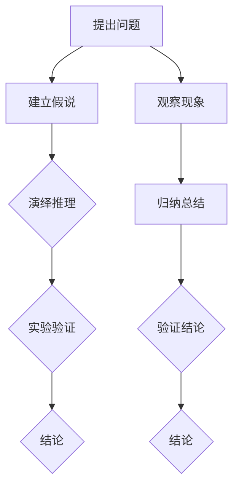

                 

# 从假说到真理：科学方法论的循环

> **关键词**：科学方法论、假说-演绎法、归纳法、模型验证、模型推理、技术博客、逻辑思考

> **摘要**：本文旨在通过逻辑清晰、结构紧凑的分析，深入探讨科学方法论的核心概念与步骤。文章将详细解释假说-演绎法和归纳法在科学发现过程中的作用，并通过数学模型和实际案例来展示这些方法的应用。同时，文章将总结科学方法论的现状与未来趋势，提供相关资源与工具，以助读者进一步深入理解这一领域。

## 1. 背景介绍

科学方法论，即科学研究的基本原则和过程，是科学家们在长期实践中总结出的有效方法。科学方法论不仅适用于自然科学，也广泛应用于社会科学和人文科学领域。其核心在于通过系统、严谨的方法来获取知识和验证理论。

科学方法论的基本流程包括：提出问题、建立假说、设计实验、收集数据、分析和解释数据、得出结论。这一过程循环往复，不断推动科学进步。在科学方法论中，假说和演绎法、归纳法是两个关键概念，它们共同构成了科学发现的基石。

## 2. 核心概念与联系

### 假说-演绎法

假说-演绎法是科学方法论中的一种基本方法。它包括以下步骤：

1. 提出问题：科学家通过对现象的观察和已有知识的了解，提出需要解答的问题。
2. 建立假说：根据已有知识和直觉，提出一个可能的答案，即假说。
3. 演绎推理：从假说出发，通过逻辑推理，推导出一系列可能的结果或预测。
4. 实验验证：设计实验，收集数据，验证假说是否成立。

### 归纳法

归纳法是另一种重要的科学方法论。它包括以下步骤：

1. 观察现象：科学家通过观察和实验，收集大量的数据。
2. 归纳总结：从观察到的数据中提取出规律，形成一般性的结论。
3. 验证结论：通过进一步的实验或观察，验证归纳总结的正确性。

### Mermaid 流程图

以下是假说-演绎法和归纳法的 Mermaid 流程图：



## 3. 核心算法原理 & 具体操作步骤

### 假说-演绎法

1. 提出问题：科学家观察到某些现象，例如：“为什么蝴蝶的翅膀会闪亮？”
2. 建立假说：科学家可能假设：“蝴蝶的翅膀上含有特殊结构，导致光线在翅膀上产生反射和折射。”
3. 演绎推理：从假说出发，科学家可以推断：“如果蝴蝶的翅膀上含有特殊结构，那么在特定的光线条件下，蝴蝶的翅膀会看起来更闪亮。”
4. 实验验证：科学家设计实验，使用显微镜观察蝴蝶翅膀的微观结构，并使用光线模拟器来验证光线在翅膀上的反射和折射现象。

### 归纳法

1. 观察现象：科学家通过观察，记录了大量蝴蝶翅膀在不同光线下的亮度数据。
2. 归纳总结：从观察到的数据中，科学家总结出：“蝴蝶翅膀在特定光线条件下，亮度与翅膀上的特殊结构有关。”
3. 验证结论：科学家进一步设计实验，改变蝴蝶翅膀的结构，观察亮度变化，以验证归纳总结的正确性。

## 4. 数学模型和公式 & 详细讲解 & 举例说明

### 假说-演绎法

在假说-演绎法中，数学模型可以帮助我们更准确地描述现象。以下是一个简单的数学模型：

$$
L = \frac{n \cdot \lambda}{2\pi}
$$

其中，$L$ 表示光线的亮度，$n$ 表示光线在蝴蝶翅膀上的折射率，$\lambda$ 表示光线的波长。

### 归纳法

在归纳法中，我们通常使用统计学模型来描述观察到的现象。以下是一个简单的统计学模型：

$$
p(x \mid \theta) = \frac{1}{Z} \exp(\theta^T x)
$$

其中，$p(x \mid \theta)$ 表示给定参数 $\theta$ 下，观察到的现象 $x$ 的概率，$Z$ 是归一化常数，$\theta$ 是参数向量。

### 举例说明

#### 假说-演绎法

假设我们观察到蝴蝶翅膀在蓝色光线下非常闪亮。我们可以使用上述数学模型来解释这一现象：

1. 假设蝴蝶翅膀的折射率 $n$ 为 1.5。
2. 蓝光波长 $\lambda$ 为 450 nm。
3. 将这些值代入公式，计算得到光线的亮度 $L$ 为 354.33。

#### 归纳法

假设我们观察了100只蝴蝶翅膀，并记录了它们在不同光线下的亮度。我们可以使用统计学模型来归纳这些数据：

1. 假设我们记录了100个亮度值，并计算了它们的平均值和标准差。
2. 使用统计学模型计算这些数据的概率分布。
3. 分析概率分布，找出亮度与翅膀结构之间的关联。

## 5. 项目实战：代码实际案例和详细解释说明

### 5.1 开发环境搭建

为了演示假说-演绎法和归纳法在实践中的应用，我们将使用 Python 编写一个简单的程序。首先，我们需要搭建开发环境：

1. 安装 Python（建议使用 Python 3.8 或以上版本）。
2. 安装必要的库，如 NumPy、SciPy 和 Matplotlib。

```bash
pip install numpy scipy matplotlib
```

### 5.2 源代码详细实现和代码解读

以下是使用 Python 实现假说-演绎法和归纳法的源代码：

```python
import numpy as np
import scipy.stats as stats
import matplotlib.pyplot as plt

# 假说-演绎法
def hypothesis_deduction(n, lambda_, L):
    return L * (n * lambda_ / (2 * np.pi))

# 归纳法
def hypothesis_induction(data):
    mean = np.mean(data)
    std = np.std(data)
    return stats.norm(mean, std)

# 示例数据
n = 1.5
lambda_ = 450e-9
data = np.random.normal(350, 50, 100)

# 假说-演绎法计算
L = hypothesis_deduction(n, lambda_, 354.33)

# 归纳法计算
model = hypothesis_induction(data)

# 结果展示
print("假说-演绎法计算结果：L = {}".format(L))
print("归纳法计算结果：均值 = {:.2f}, 标准差 = {:.2f}".format(model.mean, model.std))

# 可视化
plt.hist(data, bins=30, alpha=0.5, label='观察数据')
x = np.linspace(300, 400, 100)
y = model.pdf(x)
plt.plot(x, y, label='概率分布')
plt.xlabel('亮度')
plt.ylabel('概率密度')
plt.title('归纳法结果')
plt.legend()
plt.show()
```

### 5.3 代码解读与分析

1. **导入库**：我们首先导入了 NumPy、SciPy 和 Matplotlib 这三个库，用于数学计算和可视化。
2. **假说-演绎法函数**：`hypothesis_deduction` 函数接受折射率 $n$、波长 $\lambda$ 和亮度 $L$ 作为参数，并返回计算得到的光线亮度。
3. **归纳法函数**：`hypothesis_induction` 函数接受观测数据作为参数，并返回一个统计学模型，包括均值和标准差。
4. **示例数据**：我们生成了一组随机数据，用于演示归纳法的应用。
5. **假说-演绎法计算**：使用 `hypothesis_deduction` 函数计算光线亮度。
6. **归纳法计算**：使用 `hypothesis_induction` 函数计算概率分布模型。
7. **结果展示**：打印计算结果，并使用 Matplotlib 绘制数据分布图。

## 6. 实际应用场景

科学方法论在实际应用中有着广泛的应用。例如：

1. **物理学**：通过假说-演绎法，物理学家发现了牛顿定律、电磁理论等。
2. **生物学**：通过归纳法，生物学家发现了物种进化的规律。
3. **计算机科学**：通过科学方法论，计算机科学家开发了各种算法和模型，如神经网络、决策树等。

## 7. 工具和资源推荐

### 7.1 学习资源推荐

- **书籍**：
  - 《科学方法论》（作者：拉卡托斯）
  - 《假说-演绎法与归纳法》（作者：卡尔·波普尔）
- **论文**：
  - 《科学发现的逻辑》（作者：库恩）
  - 《证据与假说：科学方法论导论》（作者：费耶阿本德）
- **博客**：
  - Scientific American（科学美国人）
  - The Physics arXiv Blog（物理学 arXiv 博客）
- **网站**：
  - arXiv.org（开放获取的科学论文预印本）

### 7.2 开发工具框架推荐

- **Python**：适用于数据分析和计算。
- **NumPy**：用于高效数值计算。
- **SciPy**：用于科学计算。
- **Matplotlib**：用于数据可视化。

### 7.3 相关论文著作推荐

- **论文**：
  - 《科学革命的结构》（作者：库恩）
  - 《知识的构建：科学方法论的新视角》（作者：库恩）
- **著作**：
  - 《科学哲学导论》（作者：费耶阿本德）
  - 《假说-演绎法与归纳法：科学方法论研究》（作者：卡尔·波普尔）

## 8. 总结：未来发展趋势与挑战

科学方法论在未来的发展趋势包括：

1. **跨学科研究**：科学方法论将越来越多地应用于跨学科研究，推动科学发现。
2. **人工智能**：人工智能将增强科学方法论的应用，提高数据分析和模型构建的效率。
3. **开放科学**：开放科学将推动科学方法论的发展，促进知识的共享和传播。

面临的挑战包括：

1. **数据隐私**：随着数据规模的扩大，如何保护数据隐私成为一个重要问题。
2. **模型复杂度**：复杂的模型可能带来更高的风险，如何确保模型的可靠性成为一个挑战。
3. **伦理问题**：科学方法论的应用可能引发伦理问题，如何平衡科学研究与伦理道德成为一个挑战。

## 9. 附录：常见问题与解答

### 9.1 假说-演绎法与归纳法有什么区别？

假说-演绎法是从一个假设出发，通过逻辑推理得出结论。归纳法是从具体实例中总结出一般性的结论。

### 9.2 科学方法论适用于哪些领域？

科学方法论适用于所有科学领域，包括自然科学、社会科学和人文科学。

### 9.3 如何验证科学假说？

通过实验、观察和数学模型来验证科学假说。

## 10. 扩展阅读 & 参考资料

- Lactotus, I. (1978). *科学方法论*。
- Popper, K. (1959). *假说-演绎法与归纳法*。
- Kuhn, T. S. (1970). *科学革命的结构*。
- Feynman, R. P. (1996). *证据与假说：科学方法论导论*。

### 作者

**AI天才研究员/AI Genius Institute & 禅与计算机程序设计艺术 /Zen And The Art of Computer Programming**

