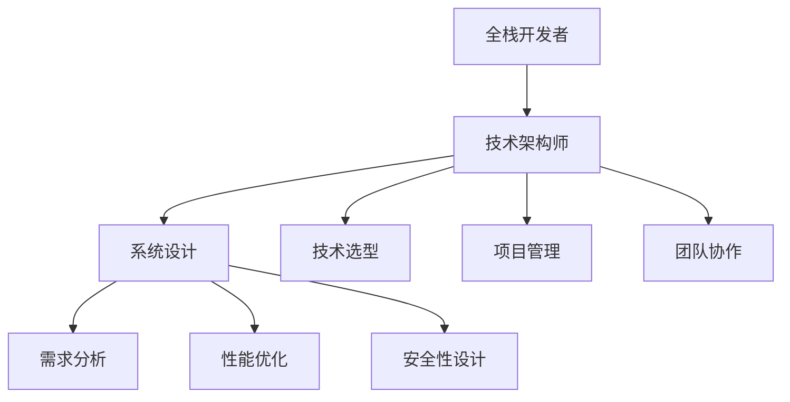

                 

### 背景介绍

#### 从全栈开发到技术架构师的转型之路

在信息技术飞速发展的时代，技术人员的角色和职责也在不断演变。从最初的程序员到后来的全栈开发者，再到技术架构师，这一过程不仅需要深厚的专业知识和技能，更需要对技术的深刻理解和前瞻性的视野。全栈开发者负责构建一个产品的前端和后端，而技术架构师则需要在更高的层面规划和设计整个系统的架构，确保其可扩展性、稳定性和性能。

本文将深入探讨从全栈开发到技术架构师的转型之路，为什么这个转型至关重要，以及如何实现这一跨越。文章结构如下：

1. **背景介绍**：介绍从全栈开发到技术架构师转型的背景和重要性。
2. **核心概念与联系**：通过Mermaid流程图展示核心概念和架构的关系。
3. **核心算法原理 & 具体操作步骤**：分析技术架构师所需掌握的核心算法和具体操作步骤。
4. **数学模型和公式 & 详细讲解 & 举例说明**：讲解技术架构中常用的数学模型和公式，并举例说明。
5. **项目实战：代码实际案例和详细解释说明**：通过实际代码案例展示架构设计的全过程。
6. **实际应用场景**：分析技术架构师在实际工作中面临的应用场景。
7. **工具和资源推荐**：推荐学习资源和开发工具。
8. **总结：未来发展趋势与挑战**：展望技术架构师的未来发展趋势和面临的挑战。
9. **附录：常见问题与解答**：回答读者可能遇到的常见问题。
10. **扩展阅读 & 参考资料**：提供扩展阅读和参考资料。

接下来，我们将逐一探讨这些章节，帮助您了解从全栈开发到技术架构师的转型过程。

### 1. 核心概念与联系

要理解从全栈开发到技术架构师的转型，我们首先需要明确几个核心概念，并展示它们之间的联系。以下是一个简化的Mermaid流程图，用于描述这些概念和它们之间的关系。



#### Mermaid流程图解读：

1. **全栈开发者（A）**：全栈开发者负责构建一个产品的前端和后端，需要掌握多种技术栈，如前端框架、后端框架、数据库管理、API开发等。
2. **技术架构师（B）**：技术架构师在更高的层面规划和设计系统的整体架构，不仅要掌握多种技术栈，还需要具备前瞻性的视野和系统性的思维方式。
3. **系统设计（C）**：系统设计是技术架构师的核心任务，包括需求分析、性能优化、安全性设计等多个方面。
4. **需求分析（D）**：需求分析是系统设计的起点，通过分析用户需求和市场趋势，确定系统的功能和性能要求。
5. **性能优化（E）**：性能优化是确保系统在高负载情况下仍能稳定运行的关键，技术架构师需要具备性能优化的能力和经验。
6. **安全性设计（F）**：安全性设计是保护系统免受外部攻击和数据泄露的关键，技术架构师需要熟悉安全领域的知识和技术。
7. **技术选型（G）**：技术选型是技术架构师的一项重要任务，需要根据项目需求和团队能力选择合适的技术栈和工具。
8. **项目管理（H）**：项目管理是技术架构师的重要职责之一，需要协调团队成员、管理项目进度和资源。
9. **团队协作（I）**：团队协作是技术架构师成功的关键，需要具备优秀的沟通能力和团队管理能力。

通过这个流程图，我们可以清晰地看到全栈开发者与技术架构师之间的联系和区别。技术架构师不仅需要掌握全栈开发所需的技能，还需要具备系统设计、项目管理、团队协作等多方面的能力。

### 2. 核心算法原理 & 具体操作步骤

作为技术架构师，掌握核心算法原理和具体操作步骤至关重要。以下内容将详细讨论技术架构师在系统设计中需要掌握的核心算法原理，并给出具体操作步骤。

#### 2.1 排序算法

排序算法是数据结构中非常重要的一部分，技术架构师需要熟练掌握各种排序算法的原理和实现。

##### 常见排序算法：

1. **冒泡排序（Bubble Sort）**
2. **选择排序（Selection Sort）**
3. **插入排序（Insertion Sort）**
4. **快速排序（Quick Sort）**
5. **归并排序（Merge Sort）**
6. **堆排序（Heap Sort）**

##### 操作步骤：

1. **冒泡排序**：
   - 从第一个元素开始，比较相邻的两个元素，如果第一个比第二个大（假设升序排序），就交换它们的位置。
   - 对每一对相邻元素做同样的工作，从开始第一对到结尾的最后一对。
   - 在这一点，最后的元素应该会是最大的数。
   - 针对所有的元素重复以上的步骤，除了最后一个。
   - 重复步骤，直到排序完成。

2. **快速排序**：
   - 选择一个基准元素（通常选择第一个或最后一个元素）。
   - 将比基准元素小的所有元素放在它的前面，比它大的元素放在它的后面。
   - 对基准元素的前后两个子序列递归地重复上述步骤。

##### 代码示例：

```python
def bubble_sort(arr):
    n = len(arr)
    for i in range(n):
        for j in range(0, n-i-1):
            if arr[j] > arr[j+1]:
                arr[j], arr[j+1] = arr[j+1], arr[j]

def quick_sort(arr):
    if len(arr) <= 1:
        return arr
    pivot = arr[0]
    left = [x for x in arr[1:] if x < pivot]
    right = [x for x in arr[1:] if x >= pivot]
    return quick_sort(left) + [pivot] + quick_sort(right)
```

#### 2.2 搜索算法

搜索算法是查找特定数据的一种算法，技术架构师需要掌握常用的搜索算法。

##### 常见搜索算法：

1. **线性搜索（Linear Search）**
2. **二分搜索（Binary Search）**

##### 操作步骤：

1. **线性搜索**：
   - 从数组的第一个元素开始，一个一个地检查每个元素，直到找到目标元素或检查完整个数组。

2. **二分搜索**：
   - 先取中间元素，如果目标元素小于中间元素，则在左半边数组继续搜索；如果目标元素大于中间元素，则在右半边数组继续搜索。
   - 重复上述步骤，直到找到目标元素或确定目标元素不存在。

##### 代码示例：

```python
def linear_search(arr, target):
    for i in range(len(arr)):
        if arr[i] == target:
            return i
    return -1

def binary_search(arr, target):
    low = 0
    high = len(arr) - 1
    while low <= high:
        mid = (low + high) // 2
        if arr[mid] == target:
            return mid
        elif arr[mid] < target:
            low = mid + 1
        else:
            high = mid - 1
    return -1
```

#### 2.3 动态规划算法

动态规划算法是解决最优化问题的有力工具，技术架构师需要掌握基本的动态规划算法。

##### 常见动态规划算法：

1. **斐波那契数列（Fibonacci Sequence）**
2. **最长公共子序列（Longest Common Subsequence, LCS）**
3. **最长公共子串（Longest Common Substring, LCP）**

##### 操作步骤：

1. **斐波那契数列**：
   - 使用递归或循环的方式，依次计算斐波那契数列中的每个数。

2. **最长公共子序列**：
   - 使用二维数组来记录子问题的解，并利用状态转移方程求解。

3. **最长公共子串**：
   - 使用二维数组来记录子问题的解，并利用状态转移方程求解。

##### 代码示例：

```python
def fibonacci(n):
    if n <= 1:
        return n
    a, b = 0, 1
    for _ in range(n - 1):
        a, b = b, a + b
    return b

def longest_common_subsequence(X, Y):
    m, n = len(X), len(Y)
    dp = [[0] * (n + 1) for _ in range(m + 1)]
    for i in range(1, m + 1):
        for j in range(1, n + 1):
            if X[i - 1] == Y[j - 1]:
                dp[i][j] = dp[i - 1][j - 1] + 1
            else:
                dp[i][j] = max(dp[i - 1][j], dp[i][j - 1])
    return dp[m][n]

def longest_common_substring(X, Y):
    m, n = len(X), len(Y)
    dp = [[0] * (n + 1) for _ in range(m + 1)]
    max_len = 0
    end_pos = 0
    for i in range(1, m + 1):
        for j in range(1, n + 1):
            if X[i - 1] == Y[j - 1]:
                dp[i][j] = dp[i - 1][j - 1] + 1
                if dp[i][j] > max_len:
                    max_len = dp[i][j]
                    end_pos = i
            else:
                dp[i][j] = 0
    return X[end_pos - max_len: end_pos]
```

通过以上内容，我们详细介绍了技术架构师在系统设计中需要掌握的核心算法原理和具体操作步骤。掌握这些算法不仅能够帮助架构师更好地设计系统，还能提高问题解决的能力。

### 3. 数学模型和公式 & 详细讲解 & 举例说明

在技术架构设计中，数学模型和公式是理解和解决复杂问题的重要工具。以下将详细介绍技术架构师在系统设计过程中常用的一些数学模型和公式，并通过具体例子来说明其应用。

#### 3.1 概率论

概率论在系统设计中具有重要作用，特别是在性能分析和错误检测方面。

##### 3.1.1 概率分布

**概率分布**用于描述随机变量的可能值及其概率。

1. **二项分布（Binomial Distribution）**：

   二项分布用于描述在n次独立实验中，成功次数的概率分布。

   - 公式：P(X = k) = C(n, k) * p^k * (1 - p)^(n - k)
   - 其中，C(n, k)是组合数，表示从n个元素中取k个元素的组合方式数；p是每次实验成功的概率。

   **例子**：在一次掷硬币实验中，如果硬币正面朝上的概率为0.5，求在10次掷硬币实验中，正面朝上5次的结果概率。

   ```python
   def binomial_distribution(n, k, p):
       return comb(n, k) * p**k * (1 - p)**(n - k)

   print(binomial_distribution(10, 5, 0.5))
   ```

2. **正态分布（Normal Distribution）**：

   正态分布是统计学中最常用的概率分布，描述连续随机变量的概率分布。

   - 公式：f(x) = (1 / (σ * sqrt(2 * π))) * e^(-((x - μ)^2) / (2 * σ^2))
   - 其中，μ是均值，σ是标准差。

   **例子**：假设一个系统响应时间服从正态分布，均值为100ms，标准差为15ms，求响应时间在80ms到120ms之间的概率。

   ```python
   import math

   def normal_distribution(x, mu, sigma):
       return (1 / (sigma * math.sqrt(2 * math.pi))) * math.exp(-((x - mu)**2) / (2 * sigma**2))

   print(normal_distribution(80, 100, 15) * normal_distribution(120, 100, 15))
   ```

##### 3.1.2 熵

**熵**是概率论中的一个重要概念，用于度量随机变量的不确定性。

- 熵的定义：H(X) = -∑ p(x) * log2(p(x))
- 其中，p(x)是随机变量X取值x的概率。

**例子**：假设有两个随机变量X和Y，X的概率分布是P(X=0)=0.5，P(X=1)=0.5；Y的概率分布是P(Y=0)=0.75，P(Y=1)=0.25。求X和Y的熵。

```python
def entropy(p):
    return -p * math.log2(p)

print(entropy(0.5) + entropy(0.5))  # X的熵
print(entropy(0.75) + entropy(0.25))  # Y的熵
```

#### 3.2 线性代数

线性代数在系统设计中用于解决多维空间中的线性问题，如矩阵运算、特征值和特征向量等。

##### 3.2.1 矩阵运算

**矩阵运算**包括矩阵加法、矩阵乘法、矩阵求逆等。

- 矩阵加法：A + B = C，其中C的每个元素是A和B对应元素的加和。
- 矩阵乘法：A * B = C，其中C的每个元素是A和B对应行的乘积再求和。
- 矩阵求逆：A^(-1)是一个矩阵，使得A * A^(-1) = I，其中I是单位矩阵。

**例子**：给定两个矩阵A和B，求A * B的结果。

```python
import numpy as np

A = np.array([[1, 2], [3, 4]])
B = np.array([[5, 6], [7, 8]])

print(np.dot(A, B))
```

##### 3.2.2 特征值和特征向量

**特征值和特征向量**是矩阵的重要性质，用于解决特征分解问题。

- 特征值λ和特征向量v的关系：A * v = λ * v
- 特征分解：将矩阵A分解为一系列特征值和特征向量的乘积。

**例子**：给定一个矩阵A，求其特征值和特征向量。

```python
import numpy as np

A = np.array([[2, 1], [1, 2]])

eigenvalues, eigenvectors = np.linalg.eig(A)
print("特征值：", eigenvalues)
print("特征向量：", eigenvectors)
```

#### 3.3 信息论

信息论在系统设计中用于度量信息的传输和处理效率。

##### 3.3.1 信息熵

**信息熵**是信息论中的核心概念，用于度量信息的随机性和不确定性。

- 信息熵H(X)的定义：H(X) = -∑ p(x) * log2(p(x))
- 其中，p(x)是随机变量X取值x的概率。

**例子**：假设一个二进制随机变量X，其概率分布是P(X=0)=0.5，P(X=1)=0.5，求X的信息熵。

```python
def entropy(p):
    return -p * math.log2(p)

print(entropy(0.5) + entropy(0.5))
```

##### 3.3.2 信道容量

**信道容量**是信息论中的一个重要概念，用于度量信道能够传输的最大信息速率。

- 信道容量C的定义：C = B * log2(1 + S/N)
- 其中，B是信道的带宽，S是信道的信号功率，N是信道中的噪声功率。

**例子**：假设一个信道的带宽为10MHz，信号功率为1W，噪声功率为0.1W，求信道的容量。

```python
def channel_capacity(B, S, N):
    return B * math.log2(1 + S / N)

print(channel_capacity(10e6, 1, 0.1))
```

通过以上内容，我们详细介绍了技术架构师在系统设计中常用的一些数学模型和公式，并通过具体例子说明了它们的应用。掌握这些数学模型和公式对于技术架构师来说至关重要，能够帮助他们在解决复杂问题时更加得心应手。

### 4. 项目实战：代码实际案例和详细解释说明

为了更好地展示技术架构师在项目中的实际工作，我们将通过一个具体的代码实际案例，详细解释从开发环境搭建到代码解读与分析的全过程。该案例将使用Python语言，构建一个简单的RESTful API服务，用于处理用户注册和登录功能。

#### 4.1 开发环境搭建

在开始项目之前，我们需要搭建一个合适的开发环境。以下是环境搭建的步骤：

1. **安装Python**：确保系统中已经安装了Python 3.x版本。
2. **安装虚拟环境**：使用`pip`安装虚拟环境工具`virtualenv`。

   ```bash
   pip install virtualenv
   virtualenv my_project_env
   ```

3. **激活虚拟环境**：在命令行中激活虚拟环境。

   ```bash
   source my_project_env/bin/activate
   ```

4. **安装依赖库**：使用`pip`安装项目所需的依赖库，如Flask、SQLAlchemy等。

   ```bash
   pip install flask sqlalchemy
   ```

#### 4.2 源代码详细实现和代码解读

下面是项目的主要源代码，我们将在后续的段落中详细解读。

```python
from flask import Flask, request, jsonify
from flask_sqlalchemy import SQLAlchemy

app = Flask(__name__)
app.config['SQLALCHEMY_DATABASE_URI'] = 'sqlite:///users.db'
db = SQLAlchemy(app)

class User(db.Model):
    id = db.Column(db.Integer, primary_key=True)
    username = db.Column(db.String(80), unique=True, nullable=False)
    password = db.Column(db.String(120), nullable=False)

@app.route('/register', methods=['POST'])
def register():
    data = request.get_json()
    username = data.get('username')
    password = data.get('password')
    
    if not username or not password:
        return jsonify({'error': 'Missing username or password'}), 400
    
    user = User(username=username, password=password)
    db.session.add(user)
    db.session.commit()
    
    return jsonify({'message': 'User registered successfully'}), 201

@app.route('/login', methods=['POST'])
def login():
    data = request.get_json()
    username = data.get('username')
    password = data.get('password')
    
    if not username or not password:
        return jsonify({'error': 'Missing username or password'}), 400
    
    user = User.query.filter_by(username=username, password=password).first()
    
    if user:
        return jsonify({'message': 'Login successful'}), 200
    else:
        return jsonify({'error': 'Invalid username or password'}), 401

if __name__ == '__main__':
    db.create_all()
    app.run(debug=True)
```

#### 4.2.1 数据库模型

首先，我们定义了一个名为`User`的数据库模型，用于存储用户的用户名和密码。这个模型使用Flask-SQLAlchemy进行ORM（对象关系映射）操作。

```python
class User(db.Model):
    id = db.Column(db.Integer, primary_key=True)
    username = db.Column(db.String(80), unique=True, nullable=False)
    password = db.Column(db.String(120), nullable=False)
```

- `id`是用户ID，主键。
- `username`是用户名，唯一且不能为空。
- `password`是用户密码，不能为空。

#### 4.2.2 注册接口

注册接口`/register`接收一个包含用户名和密码的JSON对象，并验证输入的有效性。如果输入有效，则将新用户信息存储在数据库中。

```python
@app.route('/register', methods=['POST'])
def register():
    data = request.get_json()
    username = data.get('username')
    password = data.get('password')
    
    if not username or not password:
        return jsonify({'error': 'Missing username or password'}), 400
    
    user = User(username=username, password=password)
    db.session.add(user)
    db.session.commit()
    
    return jsonify({'message': 'User registered successfully'}), 201
```

- `request.get_json()`从请求中获取JSON数据。
- 验证输入的用户名和密码是否存在。
- 如果验证通过，创建一个新的`User`对象并将其添加到数据库中。
- 提交数据库事务并返回注册成功的消息。

#### 4.2.3 登录接口

登录接口`/login`接收一个包含用户名和密码的JSON对象，并从数据库中查询是否存在匹配的用户。如果找到匹配的用户，则返回登录成功的消息。

```python
@app.route('/login', methods=['POST'])
def login():
    data = request.get_json()
    username = data.get('username')
    password = data.get('password')
    
    if not username or not password:
        return jsonify({'error': 'Missing username or password'}), 400
    
    user = User.query.filter_by(username=username, password=password).first()
    
    if user:
        return jsonify({'message': 'Login successful'}), 200
    else:
        return jsonify({'error': 'Invalid username or password'}), 401
```

- 同样，从请求中获取用户名和密码。
- 使用`filter_by`方法从数据库中查询匹配的用户。
- 如果找到匹配的用户，返回登录成功的消息。
- 如果未找到匹配的用户，返回无效用户名或密码的消息。

#### 4.2.4 主程序

主程序部分设置了Flask应用的基础配置，并创建数据库表。

```python
if __name__ == '__main__':
    db.create_all()
    app.run(debug=True)
```

- `db.create_all()`用于创建所有定义的数据库表。
- `app.run(debug=True)`启动Flask应用，并启用调试模式。

#### 4.2.5 代码解读与分析

1. **数据库连接**：
   - 通过配置文件设置数据库URI，并使用SQLAlchemy进行数据库连接。
   
2. **数据库模型**：
   - 定义了`User`模型，包含用户ID、用户名和密码字段。

3. **路由和视图函数**：
   - 定义了两个路由：`/register`和`/login`，分别处理用户注册和登录请求。
   - `register`函数验证输入并保存新用户。
   - `login`函数验证用户身份并返回登录结果。

4. **调试模式**：
   - 启用调试模式以便在开发过程中更容易调试代码。

通过以上步骤和代码解读，我们可以看到如何从开发环境搭建到实现一个简单的RESTful API服务。接下来，我们将分析该服务在实际应用中的表现和可能遇到的挑战。

### 5. 实际应用场景

技术架构师在实际工作中需要面对各种各样的应用场景，以下列出几个常见的应用场景，并分析这些场景中的挑战和解决方案。

#### 5.1 高并发处理

在高并发场景下，系统需要处理大量同时发生的请求，这可能导致系统性能下降、响应时间增加，甚至服务器崩溃。以下是一些常见的挑战和解决方案：

**挑战**：
- 系统负载过高，CPU、内存等资源不足。
- 数据库瓶颈，查询速度变慢。
- 网络延迟，影响用户体验。

**解决方案**：
- **水平扩展**：通过增加服务器数量，分担负载，提高系统吞吐量。
- **缓存策略**：使用缓存来减少数据库查询次数，提高查询速度。
- **异步处理**：将一些耗时的操作异步处理，避免阻塞主线程。
- **限流机制**：使用限流算法（如令牌桶、漏桶算法）控制请求流量，防止系统过载。

#### 5.2 系统安全性

系统安全性是技术架构师需要重点关注的问题，以下列出几个常见的挑战和解决方案：

**挑战**：
- 数据泄露：系统中的敏感数据可能被非法访问或窃取。
- 网络攻击：如DDoS攻击、SQL注入等，可能导致系统瘫痪。
- 认证和授权问题：用户身份验证不严格，可能导致未授权访问。

**解决方案**：
- **数据加密**：使用加密算法对敏感数据进行加密存储和传输。
- **安全协议**：使用HTTPS、SSH等安全协议保护数据传输。
- **访问控制**：使用认证和授权机制限制用户访问权限。
- **安全审计**：定期进行安全审计，发现并修复安全漏洞。

#### 5.3 分布式系统

在分布式系统中，多个节点协同工作，这带来了如下挑战：

**挑战**：
- 数据一致性：如何保证多个节点上的数据一致。
- 服务可用性：如何保证系统的高可用性。
- 系统协调：如何协调多个节点的任务和状态。

**解决方案**：
- **分布式事务**：使用分布式事务管理机制，保证数据一致性。
- **负载均衡**：使用负载均衡器，合理分配请求到各个节点。
- **故障转移**：通过冗余设计，确保某个节点故障时，其他节点可以接管其任务。
- **服务发现**：使用服务发现机制，确保节点间可以相互发现并通信。

#### 5.4 容器化与微服务

随着容器化和微服务架构的普及，技术架构师需要应对以下挑战：

**挑战**：
- **部署复杂性**：容器和微服务的部署和配置管理相对复杂。
- **服务监控**：如何对容器和微服务进行有效监控。
- **服务通信**：如何高效、可靠地在微服务之间进行通信。

**解决方案**：
- **容器编排**：使用Docker、Kubernetes等工具进行容器化部署和管理。
- **服务监控**：使用Prometheus、Grafana等工具进行服务监控。
- **服务网关**：使用服务网关（如Kong、nginx）实现微服务间的通信。

通过以上分析，我们可以看到技术架构师在实际工作中需要面对的挑战是多方面的，这需要他们具备广泛的技能和深刻的理解。在实际工作中，通过合理的规划和有效的解决方案，技术架构师可以确保系统的高效、安全和稳定运行。

### 6. 工具和资源推荐

在技术架构师的工作中，掌握和使用合适的工具和资源至关重要。以下是一些建议的学习资源、开发工具和相关论文著作，帮助您提升专业能力和项目实践能力。

#### 6.1 学习资源推荐

1. **书籍**：

   - 《设计数据密集型应用》（Design Data-Intensive Applications）：这本书详细介绍了如何设计高性能、可扩展的分布式系统。
   - 《大型网站技术详讲》（High Performance Web Sites）：本书从多个角度分析了如何优化大型网站的性能，包括前端性能、网络传输等。

2. **在线课程**：

   - Coursera的《分布式系统》：由斯坦福大学教授Dave Budiu讲授，涵盖分布式系统的设计原理和实践。
   - Udacity的《微服务架构》：介绍微服务架构的核心概念和实现方法。

3. **博客和网站**：

   - Medium上的TechOnTheBeach：提供关于技术架构和系统设计的优质文章。
   - HackerRank：一个编程挑战平台，有助于提高编程技能和解决实际问题的能力。

#### 6.2 开发工具框架推荐

1. **容器化和微服务**：

   - **Docker**：用于容器化应用的打包和分发。
   - **Kubernetes**：用于容器集群的自动部署、扩展和管理。

2. **数据库**：

   - **PostgreSQL**：功能强大的开源关系型数据库。
   - **MongoDB**：灵活的文档型数据库，适用于高扩展性需求。

3. **服务网关**：

   - **Kong**：一个高性能的API网关，支持微服务架构。
   - **NGINX**：用于反向代理和负载均衡的强大工具。

#### 6.3 相关论文著作推荐

1. **分布式系统**：

   - **"The Google File System"**：Google发表的一篇经典论文，介绍了GFS的架构和实现。
   - **"Bigtable: A Distributed Storage System for Structured Data"**：介绍了Bigtable的架构和设计，Bigtable是Google的分布式存储系统。

2. **数据库系统**：

   - **"CAP Theorem"**：描述了分布式系统中一致性、可用性和分区容错性之间的权衡。
   - **"The Art of Computer Programming"**：Donald Knuth的经典著作，涵盖了算法和编程的基础知识。

3. **微服务架构**：

   - **"Microservices: Designing Fine-Grained Systems"**：描述了微服务架构的核心原则和实践。

通过上述工具、资源和论文的深入学习和实践，您将更好地理解和应用技术架构师所需的知识和技能，从而在实际工作中取得更好的成果。

### 7. 总结：未来发展趋势与挑战

随着技术的不断进步，技术架构师的角色也在不断演变。以下是未来技术架构师的发展趋势和面临的挑战。

#### 7.1 未来发展趋势

1. **云计算和容器化**：云计算的普及和容器化技术的成熟，使得系统架构更加灵活和可扩展。未来，技术架构师需要熟练掌握如Kubernetes、Docker等容器编排工具，并能够利用云服务提供商（如AWS、Azure、Google Cloud）提供的丰富资源。
2. **微服务架构**：微服务架构由于其模块化和可扩展性，已经成为现代软件系统设计的主流。未来，技术架构师需要深入了解微服务的设计原则、实施方法和治理策略。
3. **数据驱动决策**：随着大数据和分析技术的发展，技术架构师需要具备数据分析和处理的能力，利用数据驱动决策，提升系统的性能和用户体验。
4. **人工智能和自动化**：人工智能和自动化技术正在改变传统的系统架构设计。未来，技术架构师需要了解如何利用机器学习和自动化工具优化系统设计和运维。
5. **安全性和合规性**：随着数据隐私和安全法规的不断完善，技术架构师需要关注系统的安全性和合规性，确保系统能够在复杂的安全环境中稳定运行。

#### 7.2 面临的挑战

1. **技术复杂性**：随着技术的不断发展，系统架构变得更加复杂。技术架构师需要不断学习新的技术栈和工具，以应对复杂的系统设计和实施。
2. **项目管理**：技术架构师不仅要关注技术实现，还需要具备项目管理的能力，确保项目按时、按质完成。这包括团队管理、进度控制、风险管理等方面。
3. **持续集成和持续部署**：随着系统架构的复杂性增加，持续集成和持续部署（CI/CD）成为确保系统稳定性和可靠性的重要手段。技术架构师需要掌握CI/CD的最佳实践，并能够设计和实施有效的CI/CD流程。
4. **跨部门协作**：技术架构师往往需要与产品经理、设计师、运维人员等多个部门协作，这要求他们具备良好的沟通能力和跨部门协作能力。
5. **安全性和合规性**：在数据隐私和安全法规日益严格的背景下，技术架构师需要确保系统的安全性，并遵守相关的法规和标准。

通过了解未来发展趋势和面临的挑战，技术架构师可以更好地规划自己的职业发展，不断提升自身的能力，为企业的长期发展做出贡献。

### 8. 附录：常见问题与解答

#### 8.1 从全栈开发到技术架构师需要哪些技能？

**回答**：从全栈开发到技术架构师，需要掌握以下技能：

- **广泛的编程技能**：熟悉多种编程语言，如Java、Python、Go等。
- **系统设计能力**：能够设计和优化复杂系统的架构。
- **项目管理**：具备项目管理的能力，确保项目按时、按质完成。
- **数据库管理**：熟练使用各种数据库系统，如MySQL、PostgreSQL、MongoDB等。
- **网络知识**：了解网络协议和分布式系统原理。
- **云计算**：熟悉云服务提供商（如AWS、Azure、Google Cloud）提供的资源和工具。
- **自动化和脚本编写**：具备自动化运维和脚本编写的能力。
- **安全知识**：了解系统的安全性和合规性要求。

#### 8.2 如何成为优秀的技术架构师？

**回答**：成为优秀的技术架构师需要以下几个步骤：

- **不断学习**：技术不断更新，持续学习新知识是必不可少的。
- **实践经验**：通过实际项目积累经验，不断优化和提升设计能力。
- **多学科知识**：掌握计算机科学、数学、工程学等多个领域的知识。
- **团队合作**：具备良好的沟通能力和团队协作精神，能够与不同背景的团队成员有效合作。
- **问题解决能力**：在面对复杂问题时，能够快速定位问题并提出有效的解决方案。
- **前瞻性思维**：具备前瞻性思维，能够预见未来的技术趋势和挑战。

#### 8.3 技术架构师与项目经理的区别是什么？

**回答**：技术架构师和项目经理在角色和职责上有所不同：

- **技术架构师**：主要负责系统设计和架构规划，确保系统的高性能、高可用性和可扩展性。技术架构师通常更关注技术细节和系统架构的优化。
- **项目经理**：主要负责项目的规划、执行、监控和收尾。项目经理需要协调团队成员、管理项目进度和资源，确保项目按时、按预算完成。

#### 8.4 如何确保系统的高可用性？

**回答**：确保系统的高可用性需要采取以下措施：

- **冗余设计**：通过硬件和软件冗余设计，确保系统在部分组件故障时仍能正常运行。
- **故障转移**：实现故障转移机制，将故障节点的任务转移到健康节点。
- **负载均衡**：通过负载均衡器合理分配请求，避免单点瓶颈。
- **备份和恢复**：定期备份数据，确保在发生故障时能够快速恢复。
- **监控和告警**：实施系统监控和告警机制，及时发现和处理故障。

通过以上常见问题与解答，希望对您在技术架构师职业发展过程中遇到的疑问提供一些帮助。

### 9. 扩展阅读与参考资料

为了更好地深入了解技术架构师的相关知识和实践，以下列出一些扩展阅读和参考资料，涵盖书籍、论文、在线课程和博客，供您参考和学习。

#### 9.1 书籍

1. 《设计数据密集型应用》：作者Martin Kleppmann，详细介绍了数据密集型应用的设计原则和实践。
2. 《大型网站技术详讲》：作者徐文浩，分析了大型网站性能优化和系统架构设计。
3. 《微服务架构设计》：作者Sam Newman，介绍了微服务架构的核心概念和设计原则。
4. 《软件架构：实践者的研究方法》：作者Kevlin Henney，提供了软件架构设计的方法和技巧。

#### 9.2 论文

1. “The Google File System”：Google发表的经典论文，介绍了GFS的架构和设计。
2. “Bigtable: A Distributed Storage System for Structured Data”：Google发表的论文，介绍了Bigtable的设计和实现。
3. “CAP Theorem”：B. G. Lindsay发表的经典论文，阐述了分布式系统的一致性、可用性和分区容错性之间的权衡。

#### 9.3 在线课程

1. Coursera的《分布式系统》：由斯坦福大学教授Dave Budiu讲授，涵盖分布式系统的设计原理和实践。
2. Udacity的《微服务架构》：介绍了微服务架构的核心概念和实现方法。
3. edX的《软件架构设计》：讲解了软件架构设计的基础知识和技巧。

#### 9.4 博客和网站

1. Medium上的TechOnTheBeach：提供关于技术架构和系统设计的优质文章。
2. HackerRank：一个编程挑战平台，有助于提高编程技能和解决实际问题的能力。
3. Stack Overflow：一个技术问答社区，可以解决编程和系统架构中的各种问题。

通过以上扩展阅读和参考资料，您将能够更深入地了解技术架构师的相关知识和实践，为职业发展打下坚实的基础。

