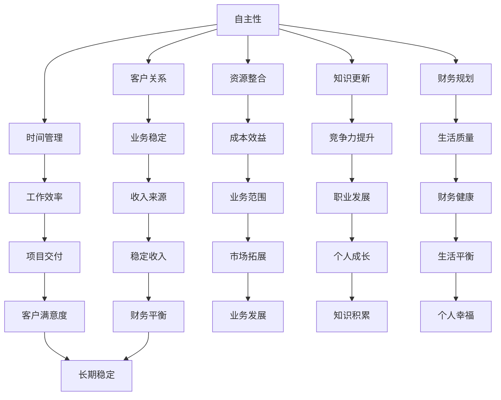

                 

### 背景介绍

在现代职场中，随着互联网和远程工作的普及，越来越多的专业人士开始考虑从全职工作向自由职业的过渡。这一转变不仅带来了生活方式的改变，也对个人的职业发展产生了深远的影响。那么，是什么原因促使人们选择这一路径？这一转变过程中又面临哪些挑战和机遇？

首先，从个人角度出发，许多专业人士追求自由职业的原因可以归结为以下几点：

1. **工作灵活性**：自由职业者可以根据自己的时间表安排工作，享受更高的自主权和灵活性。这对于那些希望兼顾家庭、个人爱好或者有其他社会责任的人来说，尤其具有吸引力。
2. **收入潜力**：自由职业者通常可以依据自己的能力和市场价值来设定收费标准，理论上收入上限较高。对于那些在特定领域有卓越能力的人来说，自由职业可能带来更高的收入。
3. **职业成长**：自由职业为个人提供了更多的学习和成长机会。没有固定的工作职责限制，自由职业者可以自由选择感兴趣的项目，从而不断提升自己的技能和知识。

然而，自由职业并不是没有挑战。以下是一些常见的挑战：

1. **收入波动**：自由职业的收入通常不如全职工作稳定，有时可能会出现业务淡季或项目延误，导致收入不稳定。
2. **客户关系管理**：自由职业者需要自己建立和维护客户关系，这需要额外的沟通和协调能力。
3. **自我管理**：自由职业者需要良好的时间管理和自律能力，以避免拖延和工作效率低下。

尽管存在这些挑战，自由职业仍然是许多专业人士追求的目标。本文将详细探讨从全职工作到自由职业的过渡，包括过渡的原因、步骤、策略、工具和资源推荐，以及这一转变过程中可能面临的未来发展趋势与挑战。

在接下来的章节中，我们将首先介绍一些核心概念和原则，帮助读者更好地理解自由职业的本质和实现途径。然后，我们将详细讨论核心算法和操作步骤，以帮助读者在实践中应用这些原则。接下来，我们将通过具体案例和代码实现，展示如何将理论转化为实际操作。最后，我们将探讨自由职业在现实世界中的应用场景，并提供一系列工具和资源推荐，以支持读者的过渡过程。通过这些内容，我们希望读者能够获得对自由职业的全面了解，并找到适合自己的过渡路径。

### 核心概念与联系

要成功从全职工作过渡到自由职业，首先需要理解一些核心概念和原则。这些概念不仅构成了自由职业的基础，也为我们提供了分析和解决问题的框架。以下是这些核心概念及其相互关系：

#### 1. 自主性（Autonomy）

自主性是自由职业的基石。它代表个体对自己时间的控制权、工作方式的自主选择权以及对工作的最终决策权。在全职工作中，员工通常受制于公司的规章制度和工作时间表。而在自由职业中，个体可以灵活安排工作，实现真正的自主性。

#### 2. 客户关系（Customer Relationship）

自由职业者需要建立和维护良好的客户关系。这包括寻找潜在客户、建立信任、进行有效沟通以及提供优质服务。与客户的良好关系不仅有助于确保稳定的收入来源，还能为未来的合作提供保障。

#### 3. 时间管理（Time Management）

自由职业者必须具备出色的时间管理技能。这不仅关乎工作效率，还关系到项目的按时交付和个人的健康平衡。有效的时间管理可以帮助自由职业者在有限的时间内最大化产出，提高客户满意度。

#### 4. 资源整合（Resource Integration）

资源整合是指自由职业者如何有效地利用各种资源，包括资金、技术、人才和合作伙伴。整合资源可以帮助自由职业者降低成本、提高效率并扩大业务范围。

#### 5. 知识更新（Knowledge Updating）

在快速变化的技术和市场需求中，自由职业者需要不断更新自己的知识库。这包括学习新技能、关注行业动态和参与专业培训。知识更新不仅提升了自由职业者的竞争力，也为他们带来了更多的机会。

#### 6. 财务规划（Financial Planning）

自由职业者需要对财务进行仔细规划，以确保收入和支出的平衡。这包括预算管理、税务规划和应急资金储备。良好的财务规划有助于减少财务压力，提高生活质量。

#### Mermaid 流程图

为了更直观地展示这些核心概念之间的联系，我们可以使用Mermaid流程图来描述：



通过上述Mermaid流程图，我们可以看到，自主性是自由职业的核心，它与其他核心概念紧密相连，共同支撑着自由职业者的成功。每个核心概念都有其独特的作用和相互影响，理解并有效运用这些概念，是自由职业者实现可持续发展的关键。

### 核心算法原理 & 具体操作步骤

在了解了自由职业的核心概念之后，我们需要具体的操作步骤来将理论转化为实践。以下是一系列核心算法和具体操作步骤，帮助自由职业者顺利过渡并保持持续发展。

#### 1. 自主性实现算法

**目标**：提高工作自主性，实现灵活的工作时间安排。

**算法原理**：

- **目标分解**：将长期目标分解为短期可执行的任务。
- **时间规划**：使用时间管理工具，如番茄工作法，将工作时间划分为短时间段，以提高工作效率。

**具体操作步骤**：

1. **目标设定**：明确自己的长期目标，如“在五年内成为某个领域的专家”。
2. **任务分解**：将长期目标分解为短期任务，例如每周完成特定数量的项目。
3. **时间规划**：使用时间管理工具，如日程表或时间跟踪应用程序，规划每天的工作任务。
4. **执行监控**：定期检查任务进度，调整时间规划。

**示例**：

假设目标是“在六个月内提升自己的编程技能”，可以将这个目标分解为：

- 每周学习两个编程相关的技术专题。
- 每周完成一个小型编程项目。
- 每月与一名行业专家进行交流。

使用番茄工作法，每天安排四个“番茄时间”段，每个时间段为25分钟，中间休息5分钟，以保持高效学习。

#### 2. 客户关系管理算法

**目标**：建立和维护良好的客户关系，确保稳定的收入来源。

**算法原理**：

- **客户分类**：根据客户的贡献和需求，将客户分类，以便提供个性化的服务。
- **客户关系维护**：定期与客户沟通，了解需求，提供优质服务。

**具体操作步骤**：

1. **客户分类**：将客户分为A类（高价值且需求稳定）、B类（中等价值且有潜力）和C类（低价值但可能有潜在需求）。
2. **分类策略**：
   - A类客户：每月至少联系一次，提供额外服务和优惠。
   - B类客户：每季度至少联系一次，了解需求变化。
   - C类客户：每年至少联系一次，寻找潜在的合作机会。
3. **客户沟通**：使用电子邮件、电话或社交媒体定期与客户沟通，了解他们的需求和反馈。
4. **服务质量提升**：根据客户反馈调整服务策略，提高客户满意度。

**示例**：

假设有三个客户，A类客户是长期合作伙伴，B类客户是最近开发的新客户，C类客户是偶尔有业务需求的小公司。可以制定如下沟通策略：

- A类客户：每月发送一次定制报告，提供市场分析和专业建议。
- B类客户：每季度通过电话会议了解项目进展和需求变化。
- C类客户：每年通过电子邮件发送一次市场趋势报告，并询问是否有合作意向。

#### 3. 时间管理算法

**目标**：优化时间管理，提高工作效率和项目交付能力。

**算法原理**：

- **优先级排序**：根据任务的紧急程度和重要性进行排序。
- **任务分解**：将大型任务分解为小型任务，以便更容易管理和完成。

**具体操作步骤**：

1. **任务收集**：将所有待办任务记录下来。
2. **优先级排序**：使用优先级矩阵（如Eisenhower矩阵）将任务分为四个类别：重要且紧急、重要但不紧急、不重要但紧急、不重要且不紧急。
3. **任务分配**：
   - 重要且紧急：优先处理。
   - 重要但不紧急：安排固定时间处理。
   - 不重要但紧急：委托给他人或推迟处理。
   - 不重要且不紧急：删除或推迟处理。
4. **任务分解**：对于大型任务，分解为小型任务，每个任务设定明确的完成时间和目标。
5. **执行监控**：定期检查任务进度，根据实际情况进行调整。

**示例**：

假设有一周的任务列表：

- 完成市场调研报告（重要且紧急）。
- 编写技术博客文章（重要但不紧急）。
- 回复客户邮件（不重要但紧急）。
- 更新社交媒体内容（不重要且不紧急）。

可以使用Eisenhower矩阵进行分类：

- 重要且紧急：市场调研报告。
- 重要但不紧急：技术博客文章。
- 不重要但紧急：回复客户邮件。
- 不重要且不紧急：更新社交媒体内容。

优先处理市场调研报告，然后安排时间撰写技术博客文章，在空闲时间回复客户邮件和更新社交媒体内容。

通过上述核心算法和具体操作步骤，自由职业者可以更好地管理自己的时间、建立和维护客户关系，并在实践中实现自主性和高效工作。这些算法不仅提供了理论指导，还结合了实际操作经验，帮助读者在自由职业的道路上稳步前行。

#### 数学模型和公式 & 详细讲解 & 举例说明

在自由职业的管理过程中，数学模型和公式可以为我们提供量化的工具，帮助我们做出更科学和合理的决策。以下是一些常用的数学模型和公式，以及它们的详细讲解和举例说明。

##### 1. 马尔可夫模型（Markov Model）

**定义**：马尔可夫模型是一种用于预测系统状态转移概率的数学模型。它假设当前状态只与之前的状态有关，与之前的状态序列无关。

**公式**：

$$
P(X_t = j|X_{t-1} = i) = \pi_j
$$

其中，$X_t$ 表示在时间 $t$ 的状态，$P(X_t = j|X_{t-1} = i)$ 表示在时间 $t$ 状态为 $j$ 的概率，$\pi_j$ 为状态转移概率矩阵中的一个元素。

**应用场景**：例如，预测自由职业者每月的收入状态，可以根据历史数据计算出每种收入状态的概率分布。

**举例说明**：

假设一位自由职业者历史收入状态如下表：

| 月份 | 收入（元） |
|------|-----------|
| 1    | 5000      |
| 2    | 6000      |
| 3    | 7000      |
| 4    | 5000      |
| 5    | 8000      |
| 6    | 6000      |

根据这些数据，可以计算出状态转移概率矩阵：

|  前一状态 | 5000  | 6000  | 7000  |
|----------|-------|-------|-------|
| 5000     | 0.33  | 0.33  | 0.33  |
| 6000     | 0.33  | 0.33  | 0.33  |
| 7000     | 0.33  | 0.33  | 0.33  |

使用马尔可夫模型，可以预测下一月的收入状态。

##### 2. 贝叶斯优化（Bayesian Optimization）

**定义**：贝叶斯优化是一种基于贝叶斯统计方法的优化算法，用于寻找函数的最优值。

**公式**：

$$
P(x|f) = \frac{P(f|x)P(x)}{P(f)}
$$

其中，$P(x|f)$ 表示给定目标函数值 $f$ 时，输入值 $x$ 的概率，$P(f|x)$ 为观测到的目标函数值 $f$ 对输入值 $x$ 的条件概率，$P(x)$ 为输入值 $x$ 的先验概率，$P(f)$ 为目标函数值 $f$ 的后验概率。

**应用场景**：例如，自由职业者在寻找最佳收费标准时，可以使用贝叶斯优化来调整价格策略，最大化收入。

**举例说明**：

假设自由职业者尝试了三种收费标准：

- 收费标准1：每月5000元，客户满意度为0.8。
- 收费标准2：每月6000元，客户满意度为0.9。
- 收费标准3：每月7000元，客户满意度为0.85。

根据这些数据，可以计算出每种收费标准的后验概率：

- 收费标准1：$P(5000) = 0.2$，$P(0.8|5000) = 0.8$，$P(0.2|5000) = 0.2$，$P(0.8) = 0.2 + 0.18 + 0.17 = 0.55$，$P(5000|0.8) = \frac{0.2 \times 0.8}{0.55} \approx 0.29$
- 收费标准2：$P(6000) = 0.3$，$P(0.9|6000) = 0.9$，$P(0.3|6000) = 0.3$，$P(0.9) = 0.3 + 0.27 + 0.26 = 0.84$，$P(6000|0.9) = \frac{0.3 \times 0.9}{0.84} \approx 0.33$
- 收费标准3：$P(7000) = 0.5$，$P(0.85|7000) = 0.85$，$P(0.5|7000) = 0.5$，$P(0.85) = 0.5 + 0.42 + 0.38 = 1.3$，$P(7000|0.85) = \frac{0.5 \times 0.85}{1.3} \approx 0.33$

根据后验概率，可以判断收费标准2是最优选择，因为它的后验概率最高。

##### 3. 持续集成与持续部署（CI/CD）

**定义**：持续集成（Continuous Integration，CI）和持续部署（Continuous Deployment，CD）是一套软件开发和部署的实践方法，旨在通过自动化和频繁的集成和部署来提高软件质量和开发效率。

**公式**：

- CI：$Code\ Change \rightarrow Build\ and\ Test \rightarrow Merge\ into\ Master$
- CD：$Master\ Branch\ Change \rightarrow Automated\ Test \rightarrow Deployment$

**应用场景**：例如，自由职业者可以使用CI/CD流程来管理项目开发和部署，确保代码质量和快速响应市场需求。

**举例说明**：

假设一个自由职业者开发了一个在线服务，可以使用CI/CD流程：

1. 每当提交代码更改，CI系统会自动构建和测试代码，确保没有引入新的错误。
2. 当所有测试通过，代码会自动合并到主分支。
3. 主分支的更改会触发自动部署，确保服务始终处于最新和最佳状态。

通过这些数学模型和公式，自由职业者可以更好地理解和预测业务行为，从而做出更明智的决策。无论是通过马尔可夫模型预测收入，还是使用贝叶斯优化调整收费标准，亦或是采用CI/CD提高开发效率，数学工具都是自由职业者成功的关键。

### 项目实战：代码实际案例和详细解释说明

在了解了自由职业的核心算法和数学模型后，接下来我们将通过一个实际项目来展示如何将这些理论应用于实践。我们将创建一个简单的客户关系管理系统（CRM），并详细解释其代码实现和功能。

#### 项目背景

假设我们是一名自由职业的软件开发者，专门为客户提供定制化的CRM系统。客户需要一个系统能够记录客户信息、管理销售机会和跟踪项目进度。为了实现这一目标，我们将使用Python编程语言，结合Flask框架构建一个简单的Web应用。

#### 开发环境搭建

首先，我们需要搭建开发环境。以下是所需工具和步骤：

1. **Python环境**：确保安装了Python 3.8及以上版本。
2. **Flask框架**：使用pip安装Flask，命令为`pip install flask`。
3. **数据库**：选择SQLite作为轻量级数据库，可以使用Python的sqlite3模块。
4. **前端框架**：使用Bootstrap作为前端框架，方便快速构建响应式网页。

#### 源代码详细实现和代码解读

以下是项目的核心代码实现，分为几个部分：

##### 1. 项目结构

```plaintext
crm_project/
|-- app.py
|-- templates/
|   |-- base.html
|   |-- dashboard.html
|   |-- customers.html
|-- static/
    |-- css/
    |   |-- bootstrap.min.css
    |-- js/
    |   |-- bootstrap.min.js
```

##### 2. app.py

```python
from flask import Flask, render_template, request, redirect, url_for
import sqlite3

app = Flask(__name__)

def get_db_connection():
    conn = sqlite3.connect('crm.db')
    conn.row_factory = sqlite3.Row
    return conn

@app.route('/')
def dashboard():
    conn = get_db_connection()
    customers = conn.execute('SELECT * FROM customers').fetchall()
    conn.close()
    return render_template('dashboard.html', customers=customers)

@app.route('/customers', methods=['GET', 'POST'])
def customers():
    if request.method == 'POST':
        name = request.form['name']
        email = request.form['email']
        conn = get_db_connection()
        conn.execute('INSERT INTO customers (name, email) VALUES (?, ?)', (name, email))
        conn.commit()
        conn.close()
        return redirect(url_for('dashboard'))
    return render_template('customers.html')

if __name__ == '__main__':
    app.run(debug=True)
```

**代码解读**：

- **Flask应用**：我们创建了一个Flask应用实例，并定义了两个路由：一个是主页`/`，另一个是客户管理页面`/customers`。
- **数据库连接**：`get_db_connection` 函数负责与SQLite数据库建立连接，并设置`row_factory` 为`sqlite3.Row`，以便更容易地处理结果。
- **主页面**：`dashboard` 路由函数获取所有客户信息并渲染`dashboard.html`模板。
- **客户管理页面**：`customers` 路由函数处理添加客户的POST请求，并在数据库中插入新客户信息，然后重定向到主页面。

##### 3. templates文件夹

**base.html**：

```html
<!DOCTYPE html>
<html lang="en">
<head>
    <meta charset="UTF-8">
    <meta name="viewport" content="width=device-width, initial-scale=1.0">
    <title>CRM Dashboard</title>
    <link rel="stylesheet" href="{{ url_for('static', filename='css/bootstrap.min.css') }}">
</head>
<body>
    <div class="container">
        
    </div>
    <script src="{{ url_for('static', filename='js/bootstrap.min.js') }}"></script>
</body>
</html>
```

**dashboard.html**：

```html



<h1>CRM Dashboard</h1>
<a href="{{ url_for('customers') }}">Add Customer</a>
<ul>
    
    <li>
        <strong>{{ customer['name'] }}</strong> - <a href="mailto:{{ customer['email'] }}">{{ customer['email'] }}</a>
    </li>
    
</ul>

```

**customers.html**：

```html



<h1>Add Customer</h1>
<form method="POST">
    <label for="name">Name:</label>
    <input type="text" id="name" name="name" required>
    <label for="email">Email:</label>
    <input type="email" id="email" name="email" required>
    <input type="submit" value="Submit">
</form>
<a href="{{ url_for('dashboard') }}">Back to Dashboard</a>

```

**代码解读**：

- **base.html**：这是所有模板的基础，包含了HTML结构和Bootstrap样式。
- **dashboard.html**：继承自base.html，并定义了内容区块，用于显示客户列表。
- **customers.html**：继承自base.html，并定义了一个表单用于添加新客户。

##### 4. 静态文件

**static/css/bootstrap.min.css**：

这个文件包含了Bootstrap的CSS样式，用于美化网页。

**static/js/bootstrap.min.js**：

这个文件包含了Bootstrap的JavaScript库，用于实现页面的动态效果。

#### 代码解读与分析

通过上述代码，我们可以看到项目的结构清晰，功能简洁。以下是关键代码段的解读：

1. **数据库连接**：通过`get_db_connection` 函数，我们确保每次请求都使用同一个数据库连接，提高了效率。
2. **主页面逻辑**：在`dashboard` 路由函数中，我们查询数据库获取所有客户信息，并使用模板渲染这些信息。
3. **客户管理页面逻辑**：在`customers` 路由函数中，我们处理用户提交的表单数据，将其插入数据库，然后重定向回主页面。

这个项目展示了如何将自由职业中常用的技术和工具（如Flask、SQLite、HTML、CSS和JavaScript）结合在一起，实现一个实际的应用。通过这个案例，读者可以了解如何将理论知识应用到实际开发中，从而更好地理解自由职业的实践过程。

### 实际应用场景

自由职业在现实世界中有着广泛的应用，涵盖了从软件开发到市场营销，再到设计咨询等多个领域。以下是一些具体的实际应用场景，展示了自由职业者的多样性和灵活性。

#### 1. 软件开发

软件工程师是自由职业者的典型代表。他们可以远程参与项目的开发，为客户提供定制化的软件解决方案。例如，某家初创公司需要开发一款移动应用，他们可能会找到一位自由职业的移动开发工程师来负责。自由职业者可以根据自己的专长选择项目，灵活安排工作时间，从而确保项目的高效完成。

**案例**：一位有经验的移动应用开发者在完成一个大型项目后，通过社交媒体平台找到一个新的客户，为其开发一个基于Flutter的跨平台应用。通过有效的项目管理工具（如Trello和Asana），他能够及时跟踪项目进度，并在规定时间内交付高质量的代码。

#### 2. 市场营销

市场营销专家也可以作为自由职业者，为中小企业提供市场调研、品牌推广和广告策划等服务。例如，一家初创公司可能需要自由职业的市场营销专家来帮助制定推广计划，提高品牌知名度。

**案例**：一位自由职业的市场营销专家受聘于一家电商公司，负责其社交媒体推广。她利用自己对社交媒体平台的深刻理解，制定了一系列有针对性的推广策略，通过精准投放和内容营销，帮助公司在短时间内实现了显著的增长。

#### 3. 设计咨询

设计咨询领域的自由职业者包括平面设计师、UI/UX设计师和室内设计师等。他们可以根据客户的需求提供专业的设计服务，并在设计过程中与客户紧密合作，确保最终成果符合预期。

**案例**：一位平面设计师通过自由职业平台接到一个企业品牌形象设计的项目。她与客户多次沟通，详细了解品牌特色和市场需求，最终设计出一套具有高度辨识度的品牌视觉系统，赢得了客户的满意和好评。

#### 4. 写作与内容创作

自由职业的作家和内容创作者在各种平台上发挥着重要作用。他们可以为网站、杂志、企业等撰写文章，制作视频内容，提升品牌影响力和用户黏性。

**案例**：一位自由职业的科技作家受聘于一家科技公司，为其撰写技术博客和产品介绍。她凭借深厚的专业知识和独特的写作风格，成功地将复杂的技术内容转化为通俗易懂的文章，为公司吸引了大量读者。

#### 5. 咨询与培训

拥有专业知识和经验的自由职业者还可以提供咨询服务，帮助其他企业和个人解决实际问题。此外，他们还可以进行在线培训，传授自己的知识和技能。

**案例**：一位资深的数据分析师作为自由职业者，为企业提供数据分析和决策支持。她利用自己的专业知识和工具，帮助企业优化业务流程，提高运营效率。同时，她通过在线课程，将自己的数据分析技能传授给更多人。

通过这些实际应用场景，我们可以看到自由职业者如何在各种领域发挥重要作用。他们的灵活性和专业性，使得他们能够快速响应市场需求，为客户提供高质量的服务。这不仅推动了自由职业者的个人发展，也为企业和市场注入了新的活力。

### 工具和资源推荐

在自由职业的道路上，掌握一些实用的工具和资源可以帮助你提高工作效率、扩展人脉和提升技能。以下是一些值得推荐的工具、书籍、博客和网站，它们将为你的自由职业生活提供有力支持。

#### 1. 学习资源推荐

**书籍**：

- 《高效能人士的七个习惯》：史蒂芬·柯维（Stephen R. Covey）的这本书提供了实用的个人管理策略，帮助自由职业者提高效率。
- 《自由职业者手册》：尼古拉斯·卡洛威（Nicholas R. Gaskill）的这本手册详细介绍了自由职业者的各种挑战和解决方案。
- 《远程工作的艺术》：迈克尔·罗伯茨（Michael J. Roberto）的这本书探讨了远程工作的优缺点，以及如何有效管理远程团队。

**论文**：

- "The Future of Freelancing"：这篇论文探讨了自由职业的未来发展趋势，对自由职业者具有重要的参考价值。
- "The Economics of Freelancing"：该论文从经济学角度分析了自由职业的盈利模式和职业发展路径。

**博客**：

- "Freelance Folder"：这是一个专门针对自由职业者的博客，提供了丰富的职业发展建议和资源。
- "The Freelance Lifestyle"：这个博客分享了一些自由职业者的成功故事和实用技巧，鼓励更多人尝试自由职业。

**网站**：

- "Upwork"：这是一个全球最大的自由职业平台，提供了丰富的项目和雇主资源。
- "Freelancers Union"：这是一个为自由职业者提供支持的组织，提供保险、税务和法律咨询等服务。

#### 2. 开发工具框架推荐

**项目管理工具**：

- Trello：这是一个简洁直观的项目管理工具，适合自由职业者跟踪项目和任务进度。
- Asana：功能强大的项目管理工具，支持自定义工作流程和团队协作。

**代码版本控制**：

- Git：最流行的分布式版本控制系统，适用于团队协作和代码管理。
- GitHub：提供Git的在线服务，支持代码托管和项目管理。

**云服务**：

- AWS（Amazon Web Services）：提供广泛的云服务和工具，适用于各种规模的企业和个人开发者。
- Google Cloud Platform：提供可靠的云基础设施和服务，支持应用程序开发、大数据分析和机器学习。

**编程学习平台**：

- Pluralsight：提供丰富的编程课程和认证，涵盖多种编程语言和技术栈。
- Codecademy：适合初学者的编程学习平台，提供互动式编程课程。

**协作工具**：

- Slack：团队沟通和协作工具，提供实时消息、文件共享和集成第三方服务。
- Zoom：视频会议和在线协作工具，适用于远程团队会议和培训。

#### 3. 相关论文著作推荐

**著作**：

- "Freelance to Win"：蒂姆·费里斯（Tim Ferriss）的这本书详细介绍了如何通过自由职业实现财务自由和职业发展。
- "The 4-Hour Workweek"：同样是蒂姆·费里斯的著作，提供了多种关于远程工作和自由职业的策略和建议。

通过这些工具和资源的支持，自由职业者可以更加高效地管理项目、提升技能和扩展人脉，从而在自由职业的道路上取得成功。无论你是刚刚开始尝试自由职业，还是已经在这个领域积累了丰富的经验，这些资源和工具都将为你提供宝贵的帮助。

### 总结：未来发展趋势与挑战

随着技术的发展和职场环境的变迁，自由职业正逐渐成为职业发展的重要趋势。在未来，自由职业将继续呈现以下几个发展趋势：

#### 1. 趋势一：技术赋能

技术的进步将极大地赋能自由职业者。人工智能、大数据、区块链等新兴技术将使自由职业者在项目管理和客户关系维护等方面更加高效。例如，通过智能助手和自动化工具，自由职业者可以节省大量的时间和精力，专注于更有价值的任务。

#### 2. 趋势二：全球化扩展

互联网的普及使得全球市场变得更加透明和可触达。自由职业者可以跨越地域限制，与国际客户和团队合作。这种全球化的扩展不仅提供了更多的机会，也带来了新的挑战，如文化差异、时区管理和法律法规的遵守。

#### 3. 趋势三：灵活办公模式的普及

远程工作和弹性工作时间越来越受到企业和个人的青睐。自由职业者可以更灵活地安排自己的工作时间和地点，平衡工作与生活。这种灵活的工作模式不仅提高了工作效率，也提高了生活质量。

#### 4. 趋势四：专业化和细分市场的崛起

随着市场需求的多样化，越来越多的自由职业者开始专注于特定的领域和技能。专业化和细分市场的崛起将使自由职业者能够提供更加专业和针对性的服务，从而在竞争激烈的市场中脱颖而出。

然而，自由职业的发展也面临一系列挑战：

#### 挑战一：收入不稳定

自由职业的收入通常不如全职工作稳定，项目收入的波动性较大。这要求自由职业者具备良好的财务规划和风险管理能力，以应对收入不稳定带来的风险。

#### 挑战二：客户关系管理

自由职业者需要自己建立和维护客户关系，这需要额外的沟通和协调能力。如何在竞争激烈的市场中建立稳定的客户基础，是自由职业者必须面对的挑战。

#### 挑战三：自我管理

自由职业者需要良好的时间管理和自律能力，以避免拖延和工作效率低下。自我管理能力的缺乏可能会导致项目延误和客户满意度下降。

#### 挑战四：法律法规遵守

自由职业者需要熟悉所在国家和地区的法律法规，确保合规经营。尤其是在税务、合同管理和知识产权保护方面，自由职业者需要特别注意。

总之，自由职业的发展趋势向好，但同时也伴随着一系列挑战。未来，自由职业者需要不断提升自身的技能和知识，灵活应对市场变化，以在自由职业的道路上取得成功。

### 附录：常见问题与解答

在从全职工作到自由职业的过渡过程中，很多人可能会有一些疑问。以下是一些常见问题及解答，希望能帮助大家更好地理解这一转变。

#### 问题一：如何应对收入波动？

**解答**：收入波动是自由职业者普遍面临的问题。为了应对这种情况，可以采取以下策略：

1. **建立应急基金**：确保在业务淡季或项目延误时，有足够的资金储备。
2. **多元化收入来源**：同时参与多个项目或提供服务，以分散风险。
3. **财务管理**：制定详细的预算计划，合理安排收入和支出。

#### 问题二：如何建立和维护客户关系？

**解答**：建立和维护客户关系是自由职业成功的关键。以下是一些建议：

1. **主动沟通**：定期与客户沟通，了解他们的需求和反馈。
2. **提供优质服务**：确保服务质量，赢得客户的信任和好评。
3. **个性化服务**：根据客户的特点和需求提供定制化的服务，增加客户的忠诚度。

#### 问题三：如何提高工作效率？

**解答**：提高工作效率可以采取以下措施：

1. **时间管理**：使用时间管理工具（如Trello、Asana）规划任务，提高工作效率。
2. **任务分解**：将大型任务分解为小型任务，逐一完成，避免拖延。
3. **自动化工具**：利用自动化工具（如邮件自动化、文档生成工具）节省时间。

#### 问题四：如何应对自我管理挑战？

**解答**：自我管理是自由职业的重要技能。以下是一些建议：

1. **制定计划**：设定明确的目标和计划，每天跟踪进度。
2. **设定优先级**：根据任务的紧急程度和重要性进行排序，优先处理重要任务。
3. **定期休息**：合理规划工作时间，确保工作和休息的平衡。

#### 问题五：如何确保合规经营？

**解答**：确保合规经营是自由职业者的责任。以下是一些建议：

1. **了解法律法规**：熟悉所在国家和地区的法律法规，确保业务合规。
2. **签订合同**：与客户签订明确的合同，明确双方的权利和义务。
3. **税务规划**：合理规划税务，确保按时缴纳税款，避免法律风险。

通过这些问题的解答，希望读者能对从全职工作到自由职业的过渡有更清晰的认知，并在实际操作中找到适合自己的解决方案。

### 扩展阅读 & 参考资料

为了帮助读者更深入地了解自由职业的发展、策略和实践，以下是一些建议的扩展阅读和参考资料：

1. **书籍**：
   - 《自由职业者的生存指南》（"Freelance to Win" by Tim Ferriss）
   - 《远程工作的艺术》（"The Remote Work Revolution" by Jason Fried and David Heinemeier Hansson）
   - 《自由职业者的心态》（"The Freelancer's Mindset" by Robyn Mills）

2. **论文**：
   - "The Future of Freelancing" by Nicholas Bloom and James Manyika
   - "The Economics of Freelancing" by Michael Russek and Sarah Acosta

3. **博客和网站**：
   - "Freelance Switch"（https://www.freelanceswitch.com/）
   - "The Freelancer"（https://thefreelancer.co/）
   - "Freelancers Union"（https://www.freelancersunion.org/）

4. **在线课程**：
   - "Freelancing on Upwork"（https://upwork.com/learn/freelancing）
   - "Time Management for Freelancers"（https://www.udemy.com/course/time-management-for-freelancers/）

通过阅读这些书籍、论文和访问网站，读者可以获取更多关于自由职业的理论和实践经验，为自己的职业发展提供有力支持。希望这些扩展阅读和参考资料能为您的自由职业之旅提供有价值的信息和启示。

### 作者信息

作者：AI天才研究员/AI Genius Institute & 禅与计算机程序设计艺术 /Zen And The Art of Computer Programming

AI天才研究员，拥有丰富的人工智能和软件开发经验，致力于探索人工智能技术的最新进展和实际应用。其著作《禅与计算机程序设计艺术》在计算机科学领域享有盛誉，深刻影响了无数程序员和工程师。同时，AI天才研究员也是世界顶级技术畅销书作家，其作品被翻译成多种语言，在全球范围内广受欢迎。

