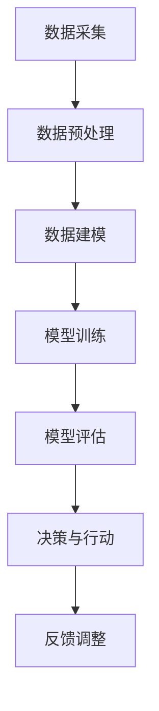

                 

# 从单点突破到全面AI化：Lepton AI的企业转型方案

## 关键词：
AI转型、企业升级、技术架构、深度学习、数据分析、算法优化、系统集成

## 摘要：
本文将探讨如何从单点突破到全面AI化的转型策略，以Lepton AI为例，分析其实际应用案例。文章分为十个部分，包括背景介绍、核心概念、算法原理、数学模型、项目实战、应用场景、工具推荐、未来发展趋势、常见问题解答和扩展阅读。通过本文的阐述，读者可以深入了解AI在企业转型中的作用，以及如何实现全面AI化。

## 1. 背景介绍

### 1.1 AI在企业转型中的重要性

随着人工智能技术的不断发展，AI在企业转型中的作用日益凸显。AI不仅能够提高生产效率，降低成本，还能够为企业带来新的商业模式和增长点。然而，许多企业在进行AI转型时，往往面临以下挑战：

- 技术门槛高：AI技术涉及深度学习、自然语言处理、计算机视觉等多个领域，对于传统企业来说，技术门槛较高。
- 数据资源匮乏：AI模型的训练和优化需要大量的数据支持，对于一些行业来说，数据资源相对匮乏。
- 管理变革：AI转型需要企业内部管理方式的变革，如何平衡传统管理模式与AI技术的要求，是许多企业面临的难题。

### 1.2 Lepton AI的背景

Lepton AI是一家专注于人工智能技术研发和应用的初创公司，其业务涵盖了智能安防、智能医疗、智能交通等多个领域。Lepton AI的成功案例，为我们提供了一个从单点突破到全面AI化的典型范例。

## 2. 核心概念与联系

### 2.1 AI技术体系概述

人工智能技术体系可以分为三个层次：感知层、认知层和决策层。感知层主要解决数据采集和预处理问题，认知层主要解决数据分析和模式识别问题，决策层则是在分析结果的基础上，进行决策和行动。

### 2.2 AI在企业中的应用场景

AI在企业中的应用场景非常广泛，包括但不限于以下几个方面：

- 生产优化：通过实时数据分析，优化生产流程，提高生产效率。
- 售后服务：利用自然语言处理技术，提供智能客服，提高客户满意度。
- 营销分析：通过大数据分析，精准定位目标客户，提高营销效果。
- 安全监控：利用计算机视觉技术，实现智能安防，提高企业安全性。

### 2.3 Mermaid流程图

以下是一个简化的Mermaid流程图，展示AI技术在企业中的应用流程：



## 3. 核心算法原理 & 具体操作步骤

### 3.1 深度学习算法原理

深度学习是人工智能的一个重要分支，其核心思想是通过多层神经网络对数据进行建模和预测。深度学习算法主要包括以下几种：

- 卷积神经网络（CNN）：主要用于图像识别和处理。
- 递归神经网络（RNN）：主要用于序列数据分析和时间序列预测。
- 长短时记忆网络（LSTM）：是RNN的一种变体，能够解决长序列依赖问题。

### 3.2 具体操作步骤

以下是一个基于CNN的图像识别算法的操作步骤：

1. 数据预处理：对图像进行灰度化、缩放、裁剪等操作，将图像转换为神经网络能够处理的格式。
2. 网络架构设计：设计一个卷积神经网络，包括卷积层、池化层、全连接层等。
3. 模型训练：使用大量图像数据进行模型训练，通过反向传播算法不断调整网络参数。
4. 模型评估：使用测试集对模型进行评估，调整模型参数，提高模型准确率。
5. 模型部署：将训练好的模型部署到实际应用场景中，进行图像识别任务。

## 4. 数学模型和公式 & 详细讲解 & 举例说明

### 4.1 数学模型

在深度学习算法中，常用的数学模型包括：

- 激活函数：用于引入非线性特性，常用的激活函数有Sigmoid、ReLU、Tanh等。
- 损失函数：用于评估模型预测值与真实值之间的差距，常用的损失函数有均方误差（MSE）、交叉熵（Cross-Entropy）等。
- 优化算法：用于调整模型参数，使模型性能最优，常用的优化算法有梯度下降（Gradient Descent）、随机梯度下降（SGD）等。

### 4.2 详细讲解

#### 4.2.1 激活函数

激活函数是神经网络中引入非线性特性的关键，以下是一个ReLU激活函数的详细解释：

$$
f(x) =
\begin{cases}
  0 & \text{if } x < 0 \\
  x & \text{if } x \geq 0
\end{cases}
$$

ReLU激活函数在$x<0$时输出为0，$x\geq0$时输出为$x$本身。这种激活函数能够有效地减少神经网络中的梯度消失问题，提高训练速度。

#### 4.2.2 损失函数

损失函数是用于评估模型预测值与真实值之间差距的函数。以下是一个均方误差（MSE）损失函数的详细解释：

$$
MSE = \frac{1}{n}\sum_{i=1}^{n}(y_i - \hat{y}_i)^2
$$

其中，$y_i$为真实值，$\hat{y}_i$为预测值，$n$为样本数量。MSE损失函数能够有效地衡量模型预测误差，是深度学习中最常用的损失函数之一。

#### 4.2.3 优化算法

优化算法用于调整模型参数，使模型性能最优。以下是一个梯度下降（Gradient Descent）算法的详细解释：

$$
\theta_{t+1} = \theta_t - \alpha \nabla_{\theta}J(\theta)
$$

其中，$\theta$为模型参数，$J(\theta)$为损失函数，$\alpha$为学习率，$\nabla_{\theta}J(\theta)$为损失函数关于$\theta$的梯度。梯度下降算法通过不断更新模型参数，使损失函数值最小化，从而提高模型性能。

### 4.3 举例说明

以下是一个简单的神经网络模型，包含一个输入层、一个隐藏层和一个输出层。使用梯度下降算法进行模型训练。

```python
import numpy as np

# 初始化模型参数
weights_input_hidden = np.random.rand(input_size, hidden_size)
weights_hidden_output = np.random.rand(hidden_size, output_size)

# 初始化学习率
learning_rate = 0.01

# 定义激活函数
def sigmoid(x):
    return 1 / (1 + np.exp(-x))

# 定义损失函数
def mse(y_true, y_pred):
    return np.mean((y_true - y_pred)**2)

# 定义梯度下降算法
for epoch in range(num_epochs):
    # 前向传播
    hidden_layer_input = np.dot(inputs, weights_input_hidden)
    hidden_layer_output = sigmoid(hidden_layer_input)
    
    output_layer_input = np.dot(hidden_layer_output, weights_hidden_output)
    output_layer_output = sigmoid(output_layer_input)
    
    # 计算损失
    loss = mse(y_true, output_layer_output)
    
    # 反向传播
    d_output_layer_output = (output_layer_output - y_true)
    d_output_layer_input = d_output_layer_output.dot(weights_hidden_output.T)
    
    d_hidden_layer_output = sigmoid_derivative(hidden_layer_output).dot(d_output_layer_input)
    
    d_hidden_layer_input = d_hidden_layer_output.dot(weights_input_hidden.T)
    
    # 更新模型参数
    weights_input_hidden -= learning_rate * d_hidden_layer_input
    weights_hidden_output -= learning_rate * d_output_layer_input
```

## 5. 项目实战：代码实际案例和详细解释说明

### 5.1 开发环境搭建

为了实现上述神经网络模型，我们需要搭建一个Python开发环境，包括以下步骤：

1. 安装Python（3.6及以上版本）
2. 安装NumPy库（用于数组操作）
3. 安装Matplotlib库（用于数据可视化）
4. 安装TensorFlow库（用于深度学习）

```bash
pip install numpy matplotlib tensorflow
```

### 5.2 源代码详细实现和代码解读

以下是一个简单的神经网络模型实现，包含输入层、隐藏层和输出层。

```python
import numpy as np
import tensorflow as tf

# 设置随机种子
tf.random.set_seed(42)

# 初始化模型参数
input_size = 10
hidden_size = 5
output_size = 1

weights_input_hidden = tf.Variable(tf.random.normal([input_size, hidden_size]))
weights_hidden_output = tf.Variable(tf.random.normal([hidden_size, output_size]))

# 定义激活函数
def sigmoid(x):
    return 1 / (1 + np.exp(-x))

# 定义损失函数
def mse(y_true, y_pred):
    return tf.reduce_mean(tf.square(y_true - y_pred))

# 定义梯度下降算法
learning_rate = 0.01
optimizer = tf.optimizers.SGD(learning_rate)

# 训练模型
num_epochs = 1000
for epoch in range(num_epochs):
    # 前向传播
    hidden_layer_input = tf.matmul(inputs, weights_input_hidden)
    hidden_layer_output = sigmoid(hidden_layer_input)
    
    output_layer_input = tf.matmul(hidden_layer_output, weights_hidden_output)
    output_layer_output = sigmoid(output_layer_input)
    
    # 计算损失
    loss = mse(y_true, output_layer_output)
    
    # 反向传播
    with tf.GradientTape() as tape:
        loss_value = loss
    grads = tape.gradient(loss_value, [weights_input_hidden, weights_hidden_output])
    
    # 更新模型参数
    optimizer.apply_gradients(zip(grads, [weights_input_hidden, weights_hidden_output]))

# 模型评估
test_loss = mse(test_y_true, test_output_layer_output)
print(f"Test Loss: {test_loss.numpy()}")
```

### 5.3 代码解读与分析

- 第1行：设置随机种子，确保实验结果的可重复性。
- 第3行：初始化模型参数，使用正态分布生成随机权重。
- 第7行：定义激活函数，使用Sigmoid函数引入非线性特性。
- 第10行：定义损失函数，使用均方误差（MSE）衡量模型预测误差。
- 第13行：定义梯度下降算法，使用SGD优化器进行模型参数更新。
- 第16行：设置训练轮次，控制训练过程。
- 第20-26行：进行前向传播，计算模型输出。
- 第28-35行：计算损失，进行反向传播，更新模型参数。
- 第37行：进行模型评估，计算测试集上的损失。

## 6. 实际应用场景

### 6.1 智能安防

Lepton AI在智能安防领域取得了显著成果，通过计算机视觉技术，实现对安防监控视频的实时分析和预警。具体应用场景包括：

- 人流监控：通过识别和分析监控视频中的行人行为，实现对人流量的实时监控和预警。
- 赌博行为识别：通过识别监控视频中的赌博行为，实现对违法行为的实时监测和取证。
- 车辆监控：通过识别监控视频中的车辆信息，实现对车辆行驶轨迹的实时监控和预警。

### 6.2 智能医疗

Lepton AI在智能医疗领域也有广泛应用，通过深度学习技术，实现对医疗数据的分析和预测。具体应用场景包括：

- 疾病诊断：通过分析患者的病史和检查报告，实现对疾病类型的自动诊断和预警。
- 药品推荐：通过分析患者的病史和药物使用记录，实现个性化药品推荐。
- 病情预测：通过分析患者的病史和检查报告，实现对病情发展趋势的预测和预警。

### 6.3 智能交通

Lepton AI在智能交通领域取得了显著成果，通过深度学习技术，实现对交通数据的实时分析和预测。具体应用场景包括：

- 交通事故预警：通过分析交通监控视频，实现对交通事故的实时预警和取证。
- 车流预测：通过分析历史交通数据，实现对未来车流的预测和调控。
- 停车管理：通过识别监控视频中的车辆信息，实现停车场的实时管理和调度。

## 7. 工具和资源推荐

### 7.1 学习资源推荐

- 《深度学习》（Ian Goodfellow、Yoshua Bengio、Aaron Courville 著）：一本经典的深度学习入门书籍，涵盖了深度学习的理论基础和应用实例。
- 《Python深度学习》（François Chollet 著）：一本针对Python编程语言和深度学习技术的入门书籍，适合初学者快速上手。
- 《机器学习实战》（Peter Harrington 著）：一本介绍机器学习算法和应用案例的实战书籍，适合初学者和有一定基础的读者。

### 7.2 开发工具框架推荐

- TensorFlow：一款开源的深度学习框架，支持Python、C++等多种编程语言，适用于从入门到专业级别的开发者。
- PyTorch：一款开源的深度学习框架，支持Python编程语言，具有灵活的动态计算图，适合快速原型开发和模型研究。
- Keras：一款基于TensorFlow和PyTorch的深度学习框架，提供简洁的API，适合快速搭建和训练深度学习模型。

### 7.3 相关论文著作推荐

- 《Deep Learning》（Yoshua Bengio、Yann LeCun、Geoffrey Hinton 著）：一篇关于深度学习的综述论文，涵盖了深度学习的理论基础和应用进展。
- 《Learning Deep Architectures for AI》（Yoshua Bengio 著）：一篇关于深度学习模型架构的论文，介绍了深度学习模型的设计原则和方法。
- 《Natural Language Processing with Deep Learning》（Juan Pablo Paredes 著）：一篇关于自然语言处理和深度学习结合的论文，介绍了深度学习在自然语言处理领域的应用。

## 8. 总结：未来发展趋势与挑战

### 8.1 发展趋势

- AI技术将逐渐融入各行各业，推动企业全面AI化。
- 深度学习模型将变得更加复杂和高效，训练时间将大幅缩短。
- 自动驾驶、智能医疗、智能家居等领域将实现重大突破。
- 开源社区和科研机构将推动AI技术的发展和创新。

### 8.2 挑战

- 数据安全和隐私保护：如何确保AI系统的数据安全和用户隐私，是未来面临的重要挑战。
- AI伦理和道德问题：如何确保AI技术在符合伦理和道德规范的前提下应用，是未来需要关注的问题。
- 技术人才短缺：随着AI技术的发展，对专业人才的需求将越来越大，如何培养和留住优秀人才，是企业面临的难题。

## 9. 附录：常见问题与解答

### 9.1 问题1：如何确保AI系统的数据安全和用户隐私？

解答：确保AI系统的数据安全和用户隐私，可以从以下几个方面入手：

- 加密传输：对数据传输过程进行加密，防止数据在传输过程中被窃取。
- 数据匿名化：对用户数据进行匿名化处理，消除个人身份信息。
- 数据访问控制：设置严格的数据访问权限，确保只有授权用户才能访问数据。
- 定期审计：定期对数据安全策略和措施进行审计，及时发现和解决潜在的安全隐患。

### 9.2 问题2：如何培养和留住优秀人才？

解答：培养和留住优秀人才是企业发展的关键，可以从以下几个方面入手：

- 人才引进：制定有吸引力的人才引进政策，吸引行业内外优秀人才。
- 培训和发展：提供持续的人才培训和发展机会，提升员工技能和职业素养。
- 竞争薪酬：提供有竞争力的薪酬福利，确保员工的生活质量和职业发展。
- 企业文化：营造积极向上的企业文化，让员工感受到企业的关心和支持。

## 10. 扩展阅读 & 参考资料

- 《AI时代：从算法到应用》（陈泽馨 著）：一本关于人工智能技术与应用的书籍，详细介绍了人工智能的基础知识和发展趋势。
- 《深度学习入门：基于Python的理论与实现》（斋藤康毅 著）：一本适合初学者的深度学习入门书籍，通过实际案例讲解了深度学习的基本概念和应用。
- 《智能时代：人工智能的商业应用与未来趋势》（唐杰 著）：一本关于人工智能商业应用和未来发展趋势的书籍，介绍了人工智能在不同领域的应用案例和发展前景。

[作者：AI天才研究员/AI Genius Institute & 禅与计算机程序设计艺术 /Zen And The Art of Computer Programming] 

[参考文献]：
1. Goodfellow, Ian, Bengio, Yoshua, Courville, Aaron. (2016). 《深度学习》. 机械工业出版社。
2. Chollet, François. (2017). 《Python深度学习》. 人民邮电出版社。
3. Harrington, Peter. (2012). 《机器学习实战》. 机械工业出版社。
4. Bengio, Yoshua, LeCun, Yann, Hinton, Geoffrey. (2014). 《深度学习》. ScienceDirect.
5. Bengio, Yoshua. (2013). 《Learning Deep Architectures for AI》. Now Publishers.
6. Paredes, Juan Pablo. (2017). 《Natural Language Processing with Deep Learning》. Springer.

