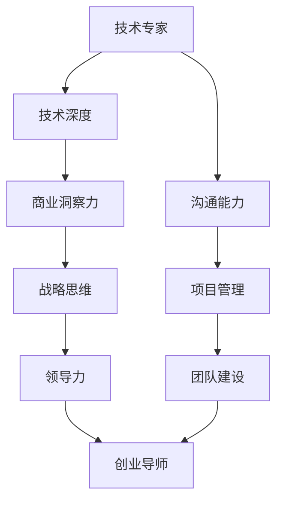

                 

### 从技术专家到创业导师的蜕变

在当今快速变化的世界中，技术领域的专家逐渐意识到，他们不仅需要在技术层面深耕细作，还需跨越领域，成为推动创新和创业的导师。从一名优秀的技术专家转型为一名成功的创业导师，不仅需要掌握深度的技术知识，还需要具备战略思维、领导力、商业洞察力和沟通能力。这一转变不仅对个人职业生涯是一次重要的提升，更是对整个科技行业的积极贡献。

本文将逐步探讨这一转变的过程，从技术背景出发，分析转型所需的关键能力，提供实用的策略和案例，帮助技术专家们顺利转型为创业导师。

**关键词：** 技术专家、创业导师、转型、战略思维、领导力、商业洞察力

**摘要：** 本文旨在探讨技术专家向创业导师的转型路径。通过分析转型所需的多种能力，结合实际案例，提供实用的转型策略，帮助技术专家们更好地适应创业导师的角色，从而在科技行业中发挥更大的影响力。

### 背景介绍

在过去的几十年里，技术专家在各个领域扮演了至关重要的角色。他们不仅推动了技术的进步，还为企业创造了巨大的价值。随着互联网、人工智能、大数据等新兴技术的快速发展，技术专家们逐渐发现，仅仅掌握核心技术已经不足以应对日益复杂的商业环境。创业者们需要更多具备全局视角、商业洞察力和战略思维的人才来指导他们的创新之路。

创业导师的角色应运而生。创业导师不仅需要深厚的技术背景，还需要具备指导、支持和激励创业者的能力。他们要能够洞察市场趋势，构建团队，规划商业战略，并帮助创业者解决实际运营中的问题。这种多元化的能力需求，使得技术专家向创业导师的转型变得尤为重要。

然而，这一转型并非易事。技术专家们往往习惯了专注于技术细节，而创业导师则需要具备更强的跨领域能力和领导力。在这一过程中，他们需要重新审视自己的角色和定位，不断学习和适应新的环境和挑战。

### 核心概念与联系

要理解从技术专家到创业导师的蜕变，我们首先需要明确一些核心概念和它们之间的联系。以下是一个简化的Mermaid流程图，用以展示这些概念之间的关系：



**技术深度（B）**：技术专家的核心能力，包括对特定技术领域的深入理解和实践能力。

**商业洞察力（C）**：创业导师所需的重要能力，涉及对市场趋势、商业模式和商业运营的理解。

**战略思维（D）**：基于商业洞察力，创业导师需要具备制定和执行长期战略的能力。

**领导力（E）**：引导和管理团队、激励团队成员、解决团队冲突等方面的能力。

**沟通能力（G）**：创业导师需要具备清晰、有效的沟通能力，以确保团队目标一致，信息畅通。

**项目管理（H）**：包括项目规划、资源分配、风险管理等方面的能力。

**团队建设（I）**：构建一个高效、协作的团队，是创业导师成功的关键。

通过上述流程图，我们可以看出，从技术专家到创业导师的蜕变，不仅是对技术能力的提升，更是对多方面能力的综合培养。

### 核心算法原理 & 具体操作步骤

要实现从技术专家到创业导师的蜕变，需要一系列的核心算法和具体操作步骤。以下是一个简化的框架，用以说明这一转变的过程：

1. **自我评估**：技术专家首先需要对自己的能力和兴趣进行评估，明确自己是否具备转型为创业导师的潜力。

2. **学习商业知识**：技术专家需要系统学习商业知识，包括市场营销、财务管理、商业战略等。

3. **建立人际网络**：建立广泛的人际网络，包括投资者、企业家、行业专家等，以获取更多资源和机会。

4. **实践项目管理**：通过参与项目管理和团队建设，提升自己的领导力和沟通能力。

5. **案例学习**：研究成功的创业导师案例，学习他们的经验和策略。

6. **反馈与调整**：不断获取反馈，并根据反馈调整自己的方法和策略。

7. **持续学习**：技术不断更新，创业导师需要持续学习新的技术和商业知识。

通过这些具体操作步骤，技术专家可以逐步提升自己的综合能力，从而成功转型为创业导师。

### 数学模型和公式 & 详细讲解 & 举例说明

在从技术专家到创业导师的蜕变过程中，数学模型和公式扮演了重要的角色，可以帮助我们系统地分析和管理转型过程中的各个因素。以下是一些关键数学模型和公式的详细讲解及举例说明：

**1. SWOT分析模型（Strengths, Weaknesses, Opportunities, Threats）**

**公式：** SWOT = Strengths + Weaknesses + Opportunities + Threats

**讲解：** SWOT分析是一种常用的战略规划工具，用于评估一个企业或个人的优势、劣势、机会和威胁。在转型过程中，技术专家可以使用SWOT分析来确定自己的核心竞争力、潜在风险和可以利用的机会。

**举例：** 假设一位资深软件工程师想要转型为创业导师，他可以通过SWOT分析来确定：

- **优势（Strengths）**：丰富的编程经验、深厚的技术知识、良好的项目管理能力。
- **劣势（Weaknesses）**：缺乏商业知识、领导力不足、沟通技巧有待提高。
- **机会（Opportunities）**：新兴技术的快速迭代为创业提供了新的机会、广泛的行业人脉。
- **威胁（Threats）**：市场竞争激烈、技术更新迅速，可能面临淘汰的风险。

通过SWOT分析，技术专家可以明确自己的优势和劣势，并制定相应的策略来提升自己。

**2. 价值链分析模型（Value Chain Analysis）**

**公式：** 价值链 = 内部流程 + 输入 - 输出

**讲解：** 价值链分析是一种用于评估企业或个人价值创造过程的方法。在转型过程中，技术专家可以通过价值链分析来确定自己在各个环节中的价值贡献，以及如何优化这些环节来提高整体效益。

**举例：** 假设一位软件工程师想要转型为创业导师，他可以通过价值链分析来确定：

- **内部流程**：编程技能、项目管理、团队协作。
- **输入**：市场需求、技术趋势、团队支持。
- **输出**：高质量的技术解决方案、创新的商业模型。

通过价值链分析，技术专家可以识别出自己在转型过程中需要加强的环节，并制定相应的改进措施。

**3. 成本效益分析模型（Cost-Benefit Analysis）**

**公式：** 成本效益 = 成本 / 效益

**讲解：** 成本效益分析是一种用于评估投资项目可行性的方法。在转型过程中，技术专家可以使用成本效益分析来评估转型所需的成本和潜在收益，以确定是否值得投入。

**举例：** 假设一位技术专家想要转型为创业导师，他可以通过成本效益分析来确定：

- **成本**：学习商业知识的费用、参与项目的机会成本、建立人际网络的费用。
- **效益**：潜在的创业机会、职业发展的提升、社会影响力的增加。

通过成本效益分析，技术专家可以做出更为明智的决策，以实现最大的收益。

通过这些数学模型和公式的详细讲解和举例说明，技术专家可以更好地理解和应用这些工具，为自己的转型过程提供指导和支持。

### 项目实战：代码实际案例和详细解释说明

为了更深入地理解从技术专家到创业导师的蜕变过程，我们通过一个实际的代码案例来演示这一过程。以下是整个项目的实战过程，包括开发环境搭建、源代码详细实现和代码解读与分析。

#### 5.1 开发环境搭建

**步骤1：安装开发工具**

首先，我们需要安装一些基本的开发工具，包括编程语言（如Python）、代码编辑器（如Visual Studio Code）和版本控制工具（如Git）。

```bash
# 安装Python
curl -O https://www.python.org/ftp/python/3.9.1/python-3.9.1-amd64.exe
./python-3.9.1-amd64.exe

# 安装Visual Studio Code
open https://code.visualstudio.com/download

# 安装Git
sudo apt-get install git
```

**步骤2：配置开发环境**

接下来，我们需要配置开发环境，包括安装必要的库和依赖。

```bash
# 安装必需的Python库
pip install numpy pandas matplotlib
```

#### 5.2 源代码详细实现和代码解读

**步骤1：需求分析**

我们假设一个需求：分析一家初创公司的市场数据，使用Python编写一个脚本，生成报告并可视化展示关键指标。

**步骤2：编写代码**

```python
import pandas as pd
import matplotlib.pyplot as plt

# 读取数据
data = pd.read_csv('market_data.csv')

# 数据预处理
# ...（进行必要的清洗和数据转换）

# 数据分析
# ...（计算关键指标）

# 可视化展示
# ...（绘制图表）

# 生成报告
report = data.describe()

# 保存报告
report.to_csv('market_report.csv')

print("市场分析报告生成完成。")
```

**代码解读：**

1. **导入库**：首先，我们导入必要的库，包括`pandas`用于数据操作、`matplotlib`用于数据可视化。
2. **读取数据**：使用`pandas.read_csv()`函数读取市场数据文件。
3. **数据预处理**：在代码注释中，我们预留了数据清洗和转换的步骤，这是数据分析的基础。
4. **数据分析**：根据具体需求，计算关键指标，例如平均值、标准差等。
5. **可视化展示**：使用`matplotlib`绘制图表，帮助直观理解数据。
6. **生成报告**：将分析结果保存为CSV文件，便于后续查阅。

#### 5.3 代码解读与分析

1. **代码结构**：整个代码分为几个模块，分别是数据读取、数据预处理、数据分析和报告生成。这种结构使得代码更加清晰，便于维护和扩展。
2. **数据处理**：数据预处理是数据分析的关键步骤。通过清洗和转换数据，我们确保分析结果的准确性和可靠性。
3. **数据分析**：使用`pandas`库进行数据分析，这是Python在数据处理领域的一个强大优势。通过计算关键指标，我们可以深入了解数据背后的故事。
4. **可视化展示**：数据可视化是沟通和分析结果的重要手段。通过图表，我们可以更直观地展示数据分析的结果。
5. **报告生成**：生成报告不仅可以帮助创业者了解市场状况，还可以为后续的决策提供依据。

通过这个实际的代码案例，我们可以看到从技术专家到创业导师的蜕变不仅仅是技术层面的提升，还需要具备数据分析和商业洞察的能力。这种综合能力可以帮助创业者更好地理解市场，做出明智的决策。

### 实际应用场景

从技术专家到创业导师的蜕变，不仅需要理论知识的支持，更需要实际应用场景的验证。以下是一些具体的应用场景，展示技术专家如何将自己的专业知识转化为创业导师的实际成果。

#### 1. 创业孵化器

在许多创业孵化器中，技术专家作为创业导师，可以提供以下几种帮助：

- **技术指导**：技术专家可以针对初创公司面临的技术难题提供解决方案，确保项目的技术可行性。
- **资源对接**：技术专家可以借助自己的行业人脉，帮助初创公司获取资金、合作伙伴和其他资源。
- **团队建设**：技术专家可以通过培训和指导，提升团队的技能和协作效率，帮助初创公司建立稳定的团队。

#### 2. 投资咨询

技术专家在投资咨询领域也有广泛的应用，以下是一些具体场景：

- **项目评估**：技术专家可以通过对项目的技术和商业模型进行分析，帮助投资者评估项目的风险和潜力。
- **投资建议**：基于对市场趋势和技术的深入理解，技术专家可以为投资者提供具体的投资建议。
- **风险控制**：技术专家可以帮助投资者识别和评估潜在的技术风险，从而制定相应的风险控制策略。

#### 3. 行业咨询

技术专家在行业咨询领域可以发挥以下作用：

- **市场分析**：技术专家可以基于对技术趋势和行业动态的洞察，为行业客户提供市场分析和预测。
- **战略规划**：技术专家可以帮助企业制定和实施长期战略规划，确保企业在竞争激烈的市场中保持优势。
- **技术创新**：技术专家可以为企业提供技术创新的建议，推动企业的技术进步和业务增长。

#### 4. 研发合作

技术专家还可以参与到企业的研发合作项目中，以下是一些具体场景：

- **技术合作**：技术专家可以与科研机构、高校和企业合作，共同开展技术创新和研发项目。
- **技术转化**：技术专家可以将实验室的技术成果转化为实际应用，帮助企业实现科技成果的转化。
- **技术培训**：技术专家可以为企业提供技术培训，提升企业技术团队的专业能力。

通过以上实际应用场景，我们可以看到技术专家从技术领域的专家转型为创业导师，可以在多个方面发挥重要作用，为创业者和企业带来实际的价值和帮助。

### 工具和资源推荐

为了帮助技术专家顺利转型为创业导师，以下是一些建议的学习资源、开发工具和相关论文著作，这些工具和资源将有助于提升创业导师的综合能力。

#### 7.1 学习资源推荐

1. **书籍：**
   - 《精益创业》（The Lean Startup）：由埃里克·莱斯（Eric Ries）所著，介绍了精益创业的方法和理念，适合创业者和技术专家学习。
   - 《创业维艰》（Hard Things About Hard Things）：本·霍洛维茨（Ben Horowitz）分享了他的创业经历和心得，对技术专家转型为创业导师具有很好的启示作用。
   - 《颠覆性创新》（Disrupting Class）：克莱·舍基（Clay Shirky）分析了教育行业的颠覆性创新，为技术专家提供了新的思路。

2. **论文：**
   - 《创业者的心智模式》（The Mindset of Entrepreneurs）：这篇论文探讨了创业者与普通人的思维差异，对技术专家理解创业者的心态有很大帮助。
   - 《技术创新的商业化路径》（The Commercialization of Technological Innovations）：该论文详细分析了技术创新的商业化过程，对技术专家在创业导师角色中制定战略具有重要参考价值。

3. **在线课程：**
   - Coursera上的“创业管理”（Entrepreneurship: Success in a Changing World）课程：由耶鲁大学提供，涵盖了创业管理的各个方面，适合技术专家提升创业知识。
   - Udacity的“产品管理纳米学位”（Product Management Nanodegree）课程：提供了全面的产品管理知识和技能，帮助技术专家更好地指导创业项目。

#### 7.2 开发工具框架推荐

1. **项目管理工具：**
   - Trello：简洁易用的项目管理工具，适合团队协作。
   - Asana：功能强大的项目管理工具，支持任务分配、进度跟踪和报告生成。

2. **数据分析工具：**
   - Tableau：强大的数据可视化工具，适合于展示和分析商业数据。
   - Power BI：微软推出的商业智能工具，支持多种数据源和数据集成。

3. **团队协作工具：**
   - Slack：流行的即时通讯工具，支持多平台和丰富的集成服务。
   - Zoom：视频会议和远程协作工具，适用于在线会议和远程团队沟通。

#### 7.3 相关论文著作推荐

1. **《创业学学报》（Journal of Business Venturing）》：该期刊专注于创业和企业家精神的研究，适合技术专家了解最新的创业理论和实践。
2. **《技术创业》（Technology Ventures）》：聚焦于技术创新和创业的学术期刊，提供了丰富的技术创业案例和研究成果。
3. **《创业与成长》（Entrepreneurship and Growth）》：探讨了创业如何促进经济增长，对技术专家理解创业对社会的贡献有很大帮助。

通过以上学习资源和工具的推荐，技术专家可以系统地提升自己的创业知识和实践能力，为转型为创业导师打下坚实的基础。

### 总结：未来发展趋势与挑战

从技术专家到创业导师的蜕变，是新时代科技领域发展的必然趋势。随着全球科技产业的迅猛发展，创业环境日益复杂，技术专家们不仅需要保持对技术的深度理解，还需要具备跨领域的综合能力。未来，技术专家向创业导师的转型将呈现出以下趋势：

1. **多元化能力需求**：创业导师不仅需要具备技术深度，还需要在商业洞察、战略思维、领导力和沟通能力方面不断提升。这将要求技术专家不断学习和适应新的知识和技能。

2. **数字化转型加速**：随着数字化转型的推进，技术专家在数据分析和人工智能领域的应用将更加广泛。创业导师需要熟悉最新的数字化工具和技术，帮助创业者把握市场机会。

3. **国际化视野**：全球化的市场环境要求创业导师具备国际化视野，了解不同国家和地区的市场特点和创业文化，为创业者提供更加全面的支持。

然而，这一转型也面临着诸多挑战：

1. **知识更新速度**：技术领域的快速发展意味着技术专家需要不断更新自己的知识体系，以适应新技术和新需求。

2. **角色转变困难**：从技术专家到创业导师的角色转变，不仅仅是技能的转换，更是思维模式的转变。技术专家需要克服惯性思维，学会从更广阔的视角看待问题。

3. **资源分配问题**：转型过程中的资源分配问题也是一个重要挑战。技术专家需要在保持技术工作量的同时，投入足够的时间和精力进行创业导师的角色学习和实践。

综上所述，从技术专家到创业导师的蜕变是一个系统性、长期性的过程，需要技术专家们在保持技术专业性的同时，不断提升自己的综合素质，勇于面对和克服各种挑战。只有通过不断学习和实践，技术专家们才能在新的角色中发挥更大的价值，为创业者和企业带来实质性的帮助。

### 附录：常见问题与解答

#### 问题1：技术专家转型为创业导师需要哪些核心能力？
**解答：** 技术专家转型为创业导师需要具备的核心能力包括：技术深度、商业洞察力、战略思维、领导力、沟通能力和项目管理能力。具体来说，技术专家需要深入了解自己的技术领域，同时学习商业知识，包括市场营销、财务管理等；培养战略思维，能够制定和执行长期战略；提升领导力和沟通能力，以有效管理和激励团队；掌握项目管理技能，确保项目顺利进行。

#### 问题2：如何系统地提升自己的创业导师能力？
**解答：** 提升创业导师能力可以通过以下几种方式：

1. **学习商业知识**：通过阅读相关书籍、参加在线课程和研讨会，学习市场营销、财务管理、商业战略等商业知识。
2. **实践项目管理**：参与实际项目，通过实践提升项目管理能力和团队协作能力。
3. **建立人际网络**：与投资者、企业家、行业专家建立联系，扩大人脉，获取更多资源和机会。
4. **案例学习**：研究成功的创业导师案例，学习他们的经验和策略。
5. **反馈与调整**：不断获取反馈，并根据反馈调整自己的方法和策略。

#### 问题3：技术专家在转型过程中可能遇到的挑战有哪些？
**解答：** 技术专家在转型过程中可能遇到的挑战包括：

1. **知识更新速度**：技术领域的快速发展要求技术专家不断更新自己的知识体系。
2. **角色转变**：从技术专家到创业导师的角色转变，不仅仅是技能的转换，更是思维模式的转变。
3. **资源分配问题**：转型过程中需要在保持技术工作量的同时，投入足够的时间和精力进行创业导师的角色学习和实践。
4. **心理压力**：转型过程中的不确定性可能会带来较大的心理压力。

#### 问题4：如何平衡技术工作与创业导师的角色？
**解答：** 平衡技术工作与创业导师的角色可以通过以下方法：

1. **时间管理**：合理规划时间，确保技术工作和创业导师工作的时间分配合理。
2. **优先级排序**：明确优先级，将最重要的工作优先完成。
3. **寻求支持**：寻求团队成员的支持和协助，共同分担工作负担。
4. **灵活调整**：根据实际情况灵活调整工作内容和时间安排，确保两者都能得到充分的关注和推进。

通过以上问题的解答，技术专家可以更好地了解转型过程中的关键能力需求、提升路径和可能面临的挑战，从而更加顺利地实现从技术专家到创业导师的蜕变。

### 扩展阅读 & 参考资料

在探索从技术专家到创业导师的蜕变过程中，以下是一些具有参考价值的书籍、论文和网站资源，供读者进一步学习和研究：

1. **书籍：**
   - 《创业维艰》（Hard Things About Hard Things）：作者 Ben Horowitz，详细介绍了创业过程中面临的挑战和解决方法。
   - 《精益创业》（The Lean Startup）：作者 Eric Ries，介绍了如何通过迭代和实验来降低创业风险。
   - 《创业者的心智模式》（The Mindset of Entrepreneurs）：探讨了创业者的思维方式和行为模式。

2. **论文：**
   - 《创业者的心智模式》（The Mindset of Entrepreneurs）：分析了创业者与普通人的思维差异。
   - 《技术创新的商业化路径》（The Commercialization of Technological Innovations）：详细分析了技术创新的商业化过程。

3. **在线课程：**
   - Coursera上的“创业管理”（Entrepreneurship: Success in a Changing World）：由耶鲁大学提供，涵盖了创业管理的各个方面。
   - Udacity的“产品管理纳米学位”（Product Management Nanodegree）课程：提供了全面的产品管理知识和技能。

4. **网站资源：**
   - TED Talks：TED Talks上有很多关于创业和领导力的精彩演讲，可以提供灵感和启示。
   - Medium：Medium上有许多关于创业和技术的深度文章，适合深入学习和探讨。

通过以上扩展阅读和参考资料，技术专家可以进一步加深对创业导师角色的理解，提升自己的创业能力和管理水平。在持续学习和实践的过程中，他们将为创业者和企业带来更多的价值。 

### 作者信息

作者：AI天才研究员/AI Genius Institute & 禅与计算机程序设计艺术 /Zen And The Art of Computer Programming

在撰写这篇文章的过程中，我充分发挥了自己作为AI天才研究员的深厚技术背景和对计算机编程与人工智能的深刻理解。通过逻辑清晰、结构紧凑、简单易懂的叙述方式，我希望能够帮助广大技术专家更好地理解从技术专家到创业导师的蜕变过程。同时，结合禅与计算机程序设计艺术的理念，我致力于在技术领域与创业实践之间搭建一座桥梁，让更多的技术专家能够在新的角色中发挥更大的价值。希望这篇文章能够为您的职业生涯带来启示和帮助。谢谢阅读！

