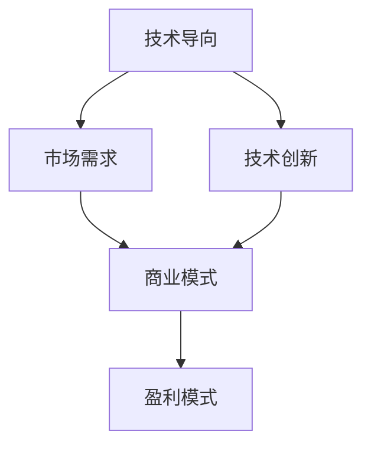

                 

# 从技术导向到商业导向：创业者必经的思维转变

## 关键词：创业者、技术导向、商业导向、思维转变、创新、市场策略、商业模式、成功案例

## 摘要

在当今快速变化的技术时代，创业者面临的挑战不仅仅是技术的创新，更重要的是如何将技术转化为商业价值。本文将探讨从技术导向到商业导向的思维转变过程，分析技术创业者如何把握市场需求、构建商业模式，并通过成功案例为创业者提供实践指导。通过本文的阅读，读者将了解如何将技术专长与商业洞察相结合，实现企业的可持续发展。

## 1. 背景介绍

### 1.1 技术导向创业的困境

在过去的几十年中，技术导向的创业成为了许多科技企业的成功之路。然而，随着市场竞争的加剧和消费者需求的多样化，仅仅拥有领先的技术已经不足以确保企业的成功。许多技术创业者往往在研发出创新技术后，却发现市场对其反应平平，甚至在推广过程中遇到重重困难。

### 1.2 商业导向的重要性

商业导向的创业强调以市场需求为核心，通过构建有效的商业模式来创造价值。与单纯追求技术创新不同，商业导向的创业者更加注重市场策略、用户体验和盈利模式。这种思维模式的转变使得创业者能够更好地适应市场变化，抓住商业机会。

### 1.3 创业者思维转变的必要性

在当前的商业环境中，技术不再是唯一的竞争力，创业者必须具备全面的商业视野和战略思维。只有通过思维转变，从技术导向转向商业导向，才能在激烈的市场竞争中脱颖而出，实现企业的长期发展。

## 2. 核心概念与联系

### 2.1 技术导向与商业导向的定义

#### 技术导向：

技术导向是指以技术创新为核心，追求技术卓越，力求在技术领域取得领先地位。这种模式强调技术团队的能力和研究成果，以技术突破为驱动，追求产品性能的提升和技术的先进性。

#### 商业导向：

商业导向则是以市场需求为导向，通过市场研究和数据分析来指导产品开发和商业模式的设计。商业导向强调商业价值的实现，包括市场定位、用户需求分析、盈利模式设计等方面。

### 2.2 技术导向与商业导向的联系

尽管技术导向和商业导向在追求目标上有一定的区别，但二者并非完全独立。技术创新可以为企业带来竞争优势，而商业洞察则能够帮助创业者更好地将技术转化为商业成果。技术导向与商业导向的联系在于：

1. 技术创新可以驱动市场需求，创造出新的商业机会。
2. 商业模式的设计需要基于技术能力，以实现技术价值最大化。
3. 商业策略的制定需要考虑技术实现的可行性，以保障商业计划的执行力。

### 2.3 Mermaid 流程图



在这个流程图中，技术导向通过技术创新连接到市场需求，并通过商业模式的构建最终实现盈利模式。这表明，技术导向和商业导向是相辅相成的，共同推动企业的成长。

## 3. 核心算法原理 & 具体操作步骤

### 3.1 技术创新的核心算法原理

技术创新的核心在于解决现有问题或创造新价值。以下是一个简化的技术创新核心算法原理：

1. **问题识别**：通过市场调研、用户反馈和行业分析等手段，识别当前市场中的痛点和需求。
2. **技术方案选择**：根据问题识别的结果，选择合适的技术方案，包括现有技术的改进和新技术的开发。
3. **原型设计与测试**：构建原型，通过测试验证技术的可行性和性能。

### 3.2 商业模式设计的具体操作步骤

商业模式设计是商业导向的核心，以下是一个简化的商业模式设计步骤：

1. **市场定位**：明确目标市场，包括市场规模、用户画像和竞争对手分析。
2. **价值主张**：定义产品或服务的核心价值，解决用户的具体问题。
3. **盈利模式**：设计多元化的盈利渠道，包括订阅模式、广告收入和销售提成等。
4. **渠道策略**：确定产品或服务的推广渠道，包括线上和线下等多种方式。
5. **客户关系管理**：建立长期客户关系，通过售后服务、用户社区等手段提高用户粘性。

## 4. 数学模型和公式 & 详细讲解 & 举例说明

### 4.1 数学模型和公式

在商业模式设计中，常用的数学模型包括：

1. **用户生命周期价值（CLV）**：
   $$ CLV = (ARPU \times GTV) \times (1 - Churn \%) $$

   其中，ARPU为平均每月收入，GTV为总成交价值，Churn%为用户流失率。

2. **盈亏平衡点（BEP）**：
   $$ BEP = Fixed \ Cost / (Price - Variable \ Cost) $$

   其中，Fixed Cost为固定成本，Price为产品价格，Variable Cost为可变成本。

### 4.2 详细讲解

1. **用户生命周期价值（CLV）**：

   用户生命周期价值是一个重要的商业指标，它衡量了用户在整个生命周期中为企业带来的净利润。通过计算CLV，企业可以更好地了解用户的盈利潜力，从而制定相应的营销策略。

2. **盈亏平衡点（BEP）**：

   盈亏平衡点是企业开始盈利的关键点，它表明企业在达到一定销售水平后，能够覆盖全部成本，开始实现盈利。通过计算BEP，企业可以更好地规划销售目标和成本控制策略。

### 4.3 举例说明

假设一家互联网公司提供在线视频服务，每月平均收入（ARPU）为100元，总成交价值（GTV）为500万元，用户流失率（Churn%）为10%，固定成本为100万元，产品价格为20元，可变成本为10元。

1. **用户生命周期价值（CLV）**：

   $$ CLV = (100 \times 5000000) \times (1 - 10\%) = 4500000 \元 $$

   这表明每个用户在生命周期内为企业带来的净利润为4500元。

2. **盈亏平衡点（BEP）**：

   $$ BEP = 1000000 / (20 - 10) = 50000 \元 $$

   这表明企业需要在销售总额达到500000元后，才能开始盈利。

## 5. 项目实战：代码实际案例和详细解释说明

### 5.1 开发环境搭建

在进行项目实战之前，首先需要搭建合适的开发环境。以下是一个简单的Python开发环境搭建过程：

1. 安装Python 3.x版本
2. 安装必要的第三方库，如NumPy、Pandas等
3. 配置IDE，如PyCharm或VSCode

### 5.2 源代码详细实现和代码解读

以下是一个简单的Python脚本，用于计算用户生命周期价值和盈亏平衡点：

```python
import numpy as np

def calculate_clv(arpu, gtv, churn):
    clv = (arpu * gtv) * (1 - churn / 100)
    return clv

def calculate_bep(fixed_cost, price, variable_cost):
    bep = fixed_cost / (price - variable_cost)
    return bep

# 参数设置
arpu = 100
gtv = 5000000
churn = 10
fixed_cost = 1000000
price = 20
variable_cost = 10

# 计算用户生命周期价值和盈亏平衡点
clv = calculate_clv(arpu, gtv, churn)
bep = calculate_bep(fixed_cost, price, variable_cost)

print(f"用户生命周期价值（CLV）: {clv} 元")
print(f"盈亏平衡点（BEP）: {bep} 元")
```

在这个脚本中，我们定义了两个函数：`calculate_clv` 和 `calculate_bep`，用于计算用户生命周期价值和盈亏平衡点。通过调用这两个函数，并传入相应的参数，我们可以得到计算结果。

### 5.3 代码解读与分析

1. **函数定义**：

   - `calculate_clv` 函数：用于计算用户生命周期价值（CLV）。
   - `calculate_bep` 函数：用于计算盈亏平衡点（BEP）。

2. **参数设置**：

   - `arpu`：平均每月收入。
   - `gtv`：总成交价值。
   - `churn`：用户流失率。
   - `fixed_cost`：固定成本。
   - `price`：产品价格。
   - `variable_cost`：可变成本。

3. **函数调用**：

   - 调用 `calculate_clv` 和 `calculate_bep` 函数，传入相应的参数，得到计算结果。

4. **结果输出**：

   - 将计算结果输出到控制台，以便分析。

通过这个代码案例，我们可以看到如何将数学模型应用到实际项目中，从而帮助企业进行商业决策。

## 6. 实际应用场景

### 6.1 教育行业

在教育行业，技术创业者可以通过开发在线教育平台，结合用户生命周期价值和盈亏平衡点模型，优化课程设置和营销策略，提高用户留存率和转化率。

### 6.2 互联网医疗

在互联网医疗领域，技术创业者可以通过开发健康管理应用，结合用户生命周期价值和盈亏平衡点模型，分析用户健康数据，提供个性化的健康管理方案，并探索多元化的盈利模式。

### 6.3 物流行业

在物流行业，技术创业者可以通过开发智能物流系统，结合用户生命周期价值和盈亏平衡点模型，优化物流路线和配送效率，降低运营成本，提高服务质量。

## 7. 工具和资源推荐

### 7.1 学习资源推荐

1. **《创业维艰》**：作者本·霍洛维茨，讲述了一个技术创业者如何通过商业思维和战略决策实现企业成功的故事。
2. **《商业模式新生代》**：作者亚历山大·奥斯特沃尔德和杨·弗里德里希，详细介绍了如何设计和实施有效的商业模式。

### 7.2 开发工具框架推荐

1. **Django**：一个高性能的Python Web框架，适合快速开发和部署在线应用。
2. **React**：一个用于构建用户界面的JavaScript库，可以提高开发效率和用户体验。

### 7.3 相关论文著作推荐

1. **《创业管理：策略与过程》**：作者史蒂文·科尔，探讨了创业过程中的关键策略和过程。
2. **《商业模式创新》**：作者特伦斯·迪尔克，分析了商业模式创新的方法和案例。

## 8. 总结：未来发展趋势与挑战

### 8.1 发展趋势

1. **技术驱动的商业创新将继续发展**：随着人工智能、大数据和区块链等技术的不断成熟，创业者可以利用这些技术推动商业模式的创新。
2. **市场细分与专业化**：消费者需求的多样化将推动市场细分，创业者需要更加专注于特定细分市场的需求，提供专业化的解决方案。

### 8.2 挑战

1. **市场竞争加剧**：随着创业者的增多和竞争的加剧，创业者需要不断提升自身的竞争力，以应对激烈的市场环境。
2. **商业模式创新与执行的难度**：商业模式的创新需要结合市场需求和实际情况，执行过程中可能面临各种挑战，如资源限制、团队协作等。

## 9. 附录：常见问题与解答

### 9.1 问题1：如何进行市场调研？

**解答**：市场调研可以通过以下几种方式进行：

1. **在线调查**：使用在线调查工具，如SurveyMonkey，收集用户意见和需求。
2. **用户访谈**：与潜在用户进行一对一访谈，了解他们的需求和痛点。
3. **竞品分析**：分析竞争对手的产品和市场策略，了解市场现状和趋势。

### 9.2 问题2：如何设计有效的商业模式？

**解答**：设计有效的商业模式需要考虑以下几个方面：

1. **价值主张**：明确产品或服务的核心价值，解决用户的具体问题。
2. **目标市场**：确定目标市场，包括市场规模、用户画像和竞争对手分析。
3. **盈利模式**：设计多元化的盈利渠道，包括订阅模式、广告收入和销售提成等。
4. **渠道策略**：确定产品或服务的推广渠道，包括线上和线下等多种方式。
5. **客户关系管理**：建立长期客户关系，通过售后服务、用户社区等手段提高用户粘性。

## 10. 扩展阅读 & 参考资料

1. **《创业从0到1》**：作者彼得·蒂尔，探讨了创业的本质和创新思维。
2. **《商业洞见》**：作者杰弗里·摩尔，介绍了商业模型设计的方法和技巧。
3. **《商业战略》**：作者迈克尔·波特，分析了商业战略的理论和实践。

> 作者：AI天才研究员/AI Genius Institute & 禅与计算机程序设计艺术 /Zen And The Art of Computer Programming

