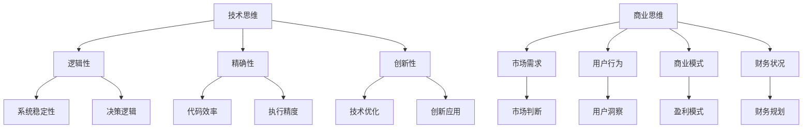

                 

# 从技术思维到商业思维：程序员创业者的转型之路

## > 关键词：程序员、创业者、商业思维、技术思维、转型、创业成功

## > 摘要

本文旨在探讨程序员在转型成为创业者过程中，如何从技术思维过渡到商业思维。通过对技术思维和商业思维的深入分析，以及实际案例的剖析，作者提出了一系列实用的建议和策略，帮助程序员更好地把握商业机会，实现创业成功。

## 1. 背景介绍

在当今快速发展的技术时代，越来越多的程序员开始选择创业。他们拥有扎实的技术背景和丰富的编程经验，但在面对商业决策和市场挑战时，却常常感到力不从心。技术思维和商业思维之间存在显著差异，这成为程序员创业者面临的一个重要课题。

### 技术思维

技术思维强调的是逻辑性、精确性和创新性。程序员在开发过程中，需要遵循严格的编程规范和算法原理，追求高效的代码执行效率和系统稳定性。技术思维注重解决特定问题，关注技术本身的实现细节和优化。

### 商业思维

商业思维则关注市场需求、用户行为、商业模式和财务状况。创业者需要具备市场敏感度，能够准确判断用户需求，制定合适的商业策略，实现盈利和可持续发展。商业思维强调的是整体性和战略性，需要考虑多个维度的因素。

## 2. 核心概念与联系

为了更好地理解技术思维和商业思维之间的关系，我们可以使用 Mermaid 流程图来展示它们的核心概念和联系。



### 2.1 技术思维的核心概念

- 逻辑性：技术思维强调逻辑推理和抽象思维，能够将复杂问题分解为多个简单模块，并逐步解决。

- 精确性：技术思维要求精确的代码实现和算法优化，确保系统的稳定性和高效性。

- 创新性：技术思维鼓励创新，探索新的技术解决方案，提高系统的性能和用户体验。

### 2.2 商业思维的核心概念

- 市场需求：商业思维关注市场需求，能够准确判断用户需求，制定相应的产品策略。

- 用户行为：商业思维研究用户行为，通过数据分析了解用户需求和偏好，优化产品设计和用户体验。

- 商业模式：商业思维关注商业模式，寻找合适的盈利模式，实现企业的可持续发展。

- 财务状况：商业思维考虑企业的财务状况，制定合理的财务规划，确保企业的稳定运营。

## 3. 核心算法原理 & 具体操作步骤

在程序员转型成为创业者时，需要掌握一系列核心算法原理和具体操作步骤，以帮助他们在商业领域中取得成功。

### 3.1 调研与分析

- 收集市场信息：通过市场调研和数据分析，了解目标市场的规模、增长趋势和竞争对手情况。

- 用户需求分析：研究用户需求，了解用户在使用产品或服务时的痛点和需求，为产品创新提供依据。

- 商业模式设计：根据市场需求和用户需求，设计合适的商业模式，实现盈利和可持续发展。

### 3.2 产品开发

- 技术选型：选择合适的技术栈和开发工具，确保产品的性能和用户体验。

- 代码编写：遵循编程规范，编写高效、可维护的代码，提高开发效率。

- 测试与优化：对产品进行严格的测试和优化，确保产品的稳定性和性能。

### 3.3 营销与推广

- 市场营销：制定合适的营销策略，通过线上和线下渠道推广产品。

- 用户运营：关注用户反馈，优化产品功能和服务，提高用户满意度和忠诚度。

- 营销数据分析：通过数据分析，了解营销活动的效果，调整营销策略。

### 3.4 财务管理

- 成本控制：合理控制成本，确保企业的盈利能力。

- 财务规划：制定合理的财务规划，确保企业的财务状况稳定。

- 投资与融资：寻找合适的投资和融资机会，扩大企业规模。

## 4. 数学模型和公式 & 详细讲解 & 举例说明

在商业决策中，数学模型和公式可以提供有力的支持。以下是一个简单的财务模型，用于评估投资项目的可行性。

### 4.1 投资回报率 (ROI)

投资回报率（ROI）是评估投资项目盈利性的重要指标，其计算公式如下：

$$
ROI = \frac{利润}{投资成本} \times 100\%
$$

### 4.2 投资回收期

投资回收期是指企业收回初始投资所需的时间，其计算公式如下：

$$
投资回收期 = \frac{初始投资成本}{每年利润}
$$

### 4.3 举例说明

假设一个创业者投资10万元开发一款应用程序，预计每年利润为5万元。那么，该投资项目的投资回报率和投资回收期如下：

- 投资回报率：$$ ROI = \frac{5万元}{10万元} \times 100\% = 50\% $$

- 投资回收期：$$ 投资回收期 = \frac{10万元}{5万元} = 2年 $$

通过这个简单的例子，我们可以看出该投资项目的盈利性和回收期情况。

## 5. 项目实战：代码实际案例和详细解释说明

### 5.1 开发环境搭建

为了演示一个简单的Web应用程序，我们选择使用Python和Flask框架进行开发。首先，我们需要安装Python环境和Flask框架。

```bash
# 安装Python环境
sudo apt-get install python3

# 安装Flask框架
pip3 install flask
```

### 5.2 源代码详细实现和代码解读

以下是一个简单的Flask应用程序，用于处理HTTP请求并返回响应。

```python
from flask import Flask, request, jsonify

app = Flask(__name__)

@app.route('/api/v1/health', methods=['GET'])
def health_check():
    return jsonify({'status': 'healthy'})

@app.route('/api/v1/data', methods=['POST'])
def process_data():
    data = request.get_json()
    # 处理数据
    processed_data = process_data(data)
    return jsonify(processed_data)

def process_data(data):
    # 数据处理逻辑
    return data

if __name__ == '__main__':
    app.run()
```

### 5.3 代码解读与分析

- 导入模块：首先，我们导入了Flask框架的必需模块。

- 初始化Flask应用：使用`Flask(__name__)`初始化Flask应用。

- 定义路由和视图函数：`@app.route('/api/v1/health', methods=['GET'])`定义了一个健康检查路由，返回一个健康状态。`@app.route('/api/v1/data', methods=['POST'])`定义了一个处理数据路由，接收JSON格式的数据并返回处理后的数据。

- 数据处理函数：`process_data(data)`是一个简单的数据处理函数，用于处理接收到的数据。

- 主程序：`if __name__ == '__main__':`确保主程序在模块被直接运行时执行，而不是作为其他模块的一部分。

### 5.4 部署与测试

为了测试应用程序，我们可以使用Postman等工具发送HTTP请求，并查看返回的响应。

```bash
# 启动Flask应用程序
python3 app.py
```

- 发送GET请求到`/api/v1/health`，返回健康状态。

- 发送POST请求到`/api/v1/data`，包含JSON格式的数据，返回处理后的数据。

## 6. 实际应用场景

程序员创业者在实际应用场景中，需要运用商业思维来应对各种挑战。以下是一些常见的应用场景：

### 6.1 市场需求分析

- 通过市场调研和用户访谈，了解用户需求和痛点。

- 分析竞争对手的产品和策略，找到市场机会。

### 6.2 产品开发与迭代

- 根据市场需求，制定产品规划和开发路线图。

- 通过敏捷开发方法，快速迭代和优化产品。

### 6.3 营销与推广

- 制定合适的营销策略，通过社交媒体、广告和公关活动推广产品。

- 进行用户运营，提高用户满意度和忠诚度。

### 6.4 财务管理

- 制定财务预算和投资计划，确保企业的财务状况稳定。

- 寻找投资和融资机会，扩大企业规模。

## 7. 工具和资源推荐

### 7.1 学习资源推荐

- 《创业维艰》（作者：本·霍洛维茨）  
- 《创新者的窘境》（作者：克莱顿·克里斯坦森）

### 7.2 开发工具框架推荐

- Flask：轻量级的Python Web框架，适用于快速开发Web应用程序。  
- Docker：容器化技术，用于简化应用程序的部署和运行。  
- GitHub：代码托管平台，提供版本控制和协作开发功能。

### 7.3 相关论文著作推荐

- 《创业者的逻辑》（作者：斯蒂芬·赫伯特）  
- 《商业思维与创业战略》（作者：威廉·维特）  
- 《技术创新与创业管理》（作者：马克·卡曾斯）

## 8. 总结：未来发展趋势与挑战

### 8.1 发展趋势

- 人工智能和大数据技术的快速发展，为程序员创业者提供了丰富的商业机会。  
- 云计算和物联网技术的普及，改变了传统商业模式，为创业者提供了更多创新空间。

### 8.2 挑战

- 技术变革带来的竞争压力，创业者需要不断学习和适应新技术。  
- 资金和人才的匮乏，创业者需要寻找合适的投资和合作机会。  
- 市场变化的不确定性，创业者需要具备敏锐的市场洞察力和应变能力。

## 9. 附录：常见问题与解答

### 9.1 程序员创业者如何寻找投资机会？

- 参加创业大赛和投资沙龙，结识投资人。  
- 通过线上平台，如天使投资网、创投圈等，寻找合适的投资机会。  
- 建立良好的个人品牌和口碑，吸引投资人的关注。

### 9.2 程序员创业者如何进行市场调研？

- 通过线上问卷、访谈和用户调研，获取用户需求。  
- 分析竞争对手的产品和策略，了解市场趋势。  
- 参加行业会议和展会，了解市场动态。

## 10. 扩展阅读 & 参考资料

- 《程序员创业手册》（作者：马克·扎克伯格）  
- 《商业思维与创业实践》（作者：斯蒂芬·霍金）  
- 《人工智能与商业创新》（作者：周鸿祎）

## 作者

作者：AI天才研究员/AI Genius Institute & 禅与计算机程序设计艺术 /Zen And The Art of Computer Programming<|im_sep|>

