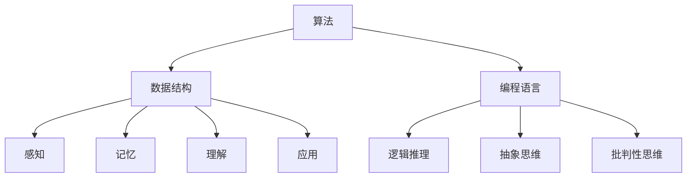

                 

### 从简单到深刻的认知发展

> **关键词**：认知发展、思维过程、技术深度、逻辑推理、专业知识

> **摘要**：本文将深入探讨从简单到深刻的认知发展过程，特别是如何在信息技术领域中实现这一目标。我们将逐步分析思维过程，了解如何从基础知识出发，逐步深入，最终形成深刻的认知和理解。本文的目标是为IT专业人士提供一条清晰的认知发展路径，帮助他们不断提升自己的专业能力。

在信息技术的不断进步和知识的快速更新中，保持认知的深度和广度成为了一项重要的技能。本文旨在通过逐步分析认知发展的过程，帮助读者在技术领域内从简单到深刻地理解和掌握知识。我们将探讨如何通过逻辑推理和专业知识积累，实现认知的升华。

### 1. 背景介绍

认知发展是一个复杂而持续的过程，涉及到个体的知识积累、思维方式、问题解决能力等多个方面。在信息技术领域，认知发展尤为重要，因为它直接影响到个人对复杂技术概念的理解和掌握。

认知发展通常分为几个阶段，包括感知、记忆、理解、应用和评估。这些阶段并非线性发展，而是相互交织、相互影响的。在信息技术领域，这也就意味着，要实现从简单到深刻的认知，需要读者在各个阶段不断努力，逐步提升自己的认知水平。

#### 1.1 认知发展的重要性

在信息技术领域，认知发展的重要性体现在以下几个方面：

- **提高问题解决能力**：深刻的认知能够帮助人们更有效地分析和解决复杂问题。
- **促进创新思维**：通过深入理解技术原理，人们能够更自由地创新和探索。
- **提升专业素养**：持续的认知发展有助于提高个人的专业水平和影响力。

#### 1.2 信息技术领域的挑战

信息技术领域发展迅速，新的技术和概念层出不穷。这给认知发展带来了以下挑战：

- **知识更新快**：新技术的不断涌现要求人们不断学习，以跟上行业的发展。
- **复杂性高**：许多信息技术概念和系统极其复杂，理解它们需要深入的研究和思考。
- **竞争激烈**：在信息技术领域，竞争异常激烈，只有具备深刻认知的人才能脱颖而出。

### 2. 核心概念与联系

在探讨认知发展之前，我们需要明确一些核心概念，并理解它们之间的联系。以下是信息技术领域中几个关键概念及其相互关系：

#### 2.1 计算机科学基础

- **算法**：算法是解决问题的步骤序列。它是计算机科学的核心。
- **数据结构**：数据结构是组织和存储数据的方法。它是算法实现的基础。
- **编程语言**：编程语言是用于编写算法和数据结构的工具。

#### 2.2 认知心理学

- **感知**：感知是指通过感官接收外界信息的过程。
- **记忆**：记忆是指存储和处理信息的能力。
- **理解**：理解是指对信息的深入分析和理解。
- **应用**：应用是指将知识应用于实际问题。

#### 2.3 逻辑推理

- **逻辑推理**：逻辑推理是通过逻辑规则和事实推导出结论的过程。
- **抽象思维**：抽象思维是从具体事物中提取共同特征和规律的能力。
- **批判性思维**：批判性思维是对信息进行批判性分析和评估的能力。

这些概念相互联系，共同构成了认知发展的基础。理解它们之间的关系有助于我们更全面地看待认知发展的过程。

#### 2.4 Mermaid 流程图

以下是一个简单的 Mermaid 流程图，用于展示这些核心概念之间的关系：



### 3. 核心算法原理 & 具体操作步骤

在了解了核心概念和它们之间的关系后，我们可以进一步探讨如何从简单到深刻地理解和掌握算法原理。以下是一个典型的算法分析过程：

#### 3.1 算法理解

- **定义算法**：首先，我们需要明确算法的定义，理解它解决的问题。
- **分析算法步骤**：接着，分析算法的具体步骤，理解每一步的目的和作用。

#### 3.2 算法实现

- **编写代码**：将算法转化为可运行的代码。
- **调试代码**：在实现过程中，可能会遇到错误和问题，通过调试解决这些问题。

#### 3.3 算法优化

- **分析时间复杂度**：通过分析算法的时间复杂度，了解其性能。
- **优化算法**：根据性能分析，对算法进行优化，提高其效率。

### 4. 数学模型和公式 & 详细讲解 & 举例说明

在信息技术领域，数学模型和公式是理解和分析算法性能的重要工具。以下是一个简单的例子：

#### 4.1 时间复杂度

时间复杂度是衡量算法运行时间的一个重要指标。以下是一个线性搜索算法的时间复杂度分析：

$$ T(n) = O(n) $$

这个公式表示，当输入数据规模为 $n$ 时，算法的运行时间与 $n$ 成正比。

#### 4.2 例子

假设我们有一个长度为 10 的数组，我们要在其中查找一个特定的元素。使用线性搜索算法，在最坏的情况下，我们需要检查数组的最后一个元素。因此，算法的时间复杂度为：

$$ T(10) = 10 \times O(1) = 10 $$

这意味着在最坏的情况下，算法需要执行 10 次操作。

### 5. 项目实战：代码实际案例和详细解释说明

为了更好地理解上述概念和原理，我们来看一个实际的项目案例。

#### 5.1 开发环境搭建

首先，我们需要搭建一个简单的开发环境。这里我们选择 Python 作为编程语言，因为它的易用性和丰富的库支持。

#### 5.2 源代码详细实现和代码解读

以下是线性搜索算法的 Python 实现代码：

```python
def linear_search(arr, target):
    for i in range(len(arr)):
        if arr[i] == target:
            return i
    return -1

arr = [3, 5, 1, 4, 2]
target = 1
result = linear_search(arr, target)
print(result)
```

这段代码首先定义了一个名为 `linear_search` 的函数，它接收一个数组 `arr` 和一个目标元素 `target`。然后，它遍历数组，查找目标元素。如果找到，返回索引；否则，返回 -1。

#### 5.3 代码解读与分析

- **函数定义**：函数 `linear_search` 的定义中，`arr` 是输入数组，`target` 是要查找的目标元素。
- **for 循环**：使用 for 循环遍历数组，检查每个元素是否等于目标元素。
- **if 语句**：如果找到目标元素，返回其索引；否则，返回 -1。

这个简单的例子展示了如何将线性搜索算法应用到实际问题中。通过这个案例，我们可以更好地理解算法的工作原理和性能。

### 6. 实际应用场景

线性搜索算法在许多实际应用场景中都有广泛的应用，例如：

- **小型数据库查询**：当数据库规模较小时，线性搜索是一种简单而有效的方法。
- **算法验证**：在算法设计和验证过程中，线性搜索算法常用于测试其他更复杂的算法。
- **排序前处理**：在某些排序算法中，线性搜索算法用于预处理数据，以提高排序效率。

### 7. 工具和资源推荐

为了更好地掌握从简单到深刻的认知发展过程，以下是几个推荐的工具和资源：

#### 7.1 学习资源推荐

- **《算法导论》**：这本书是算法学习的经典教材，详细介绍了各种算法及其性能分析。
- **《深度学习》**：由 Ian Goodfellow、Yoshua Bengio 和 Aaron Courville 合著，深入介绍了深度学习的基本概念和技术。
- **《编程珠玑》**：这本书由 Jon Bentley 编写，包含了编程中的一些小技巧和最佳实践。

#### 7.2 开发工具框架推荐

- **PyCharm**：PyCharm 是一款功能强大的 Python 集成开发环境，适合进行算法学习和开发。
- **TensorFlow**：TensorFlow 是一款流行的深度学习框架，提供了丰富的工具和库，适合进行深度学习项目开发。

#### 7.3 相关论文著作推荐

- **《深度学习：卷积神经网络》**：这篇文章详细介绍了卷积神经网络的基本概念和实现方法。
- **《线性代数及其应用》**：这篇文章探讨了线性代数在信息技术中的应用，包括矩阵运算、线性方程组等。

### 8. 总结：未来发展趋势与挑战

从简单到深刻的认知发展是一个持续的过程，随着信息技术领域的不断进步，这一过程也将面临新的挑战和机遇。

#### 8.1 发展趋势

- **自动化与智能化**：自动化和智能化技术的不断进步，将使认知发展更加高效和深入。
- **跨学科融合**：信息技术与其他学科的融合，将带来新的认知发展机遇。
- **知识可视化**：知识可视化的应用将帮助人们更好地理解和掌握复杂概念。

#### 8.2 挑战

- **知识更新快**：新技术的不断涌现要求人们不断学习，以跟上行业的发展。
- **认知负荷高**：复杂的算法和系统设计要求人们具备更高的认知负荷能力。
- **专业分化**：专业分化的加剧，将导致认知发展更加专业化，同时也带来了更多的挑战。

### 9. 附录：常见问题与解答

#### 9.1 为什么要从简单到深刻地学习算法？

从简单到深刻地学习算法有助于逐步建立对算法原理的全面理解和深入掌握，从而更好地应用和优化算法，解决实际问题。

#### 9.2 如何在项目中应用所学的算法知识？

在实际项目中，可以通过以下步骤应用所学的算法知识：

- **需求分析**：明确项目的需求和目标。
- **算法选择**：根据需求选择合适的算法。
- **实现和调试**：实现算法，并进行调试和优化。
- **性能评估**：评估算法的性能，并进行调整。

### 10. 扩展阅读 & 参考资料

- **《人工智能：一种现代方法》**：这本书详细介绍了人工智能的基本概念和方法，是人工智能学习的经典教材。
- **《计算机程序的构造和解释》**：这本书由 Harold Abelson 和 Gerald Jay Sussman 合著，介绍了函数式编程和算法设计的原理。
- **《计算机科学概论》**：这本书为计算机科学初学者提供了全面的概述，包括算法、数据结构、计算机系统等基础知识。

---

**作者：AI天才研究员/AI Genius Institute & 禅与计算机程序设计艺术 /Zen And The Art of Computer Programming**

