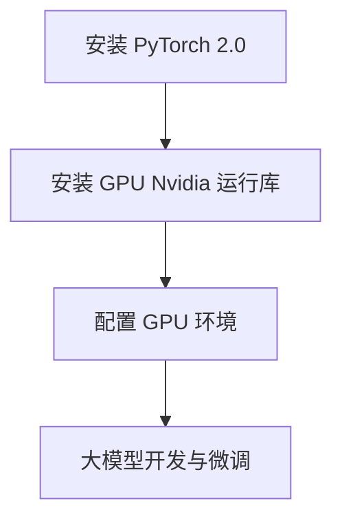

                 

# 从零开始大模型开发与微调：PyTorch 2.0 GPU Nvidia运行库的安装

> **关键词**：大模型开发、微调、PyTorch 2.0、GPU、Nvidia 运行库、安装、教程

> **摘要**：本文将带领读者从零开始，详细了解如何在 PyTorch 2.0 环境下安装和配置 GPU Nvidia 运行库，为后续的大模型开发和微调工作打下坚实的基础。文章分为背景介绍、核心概念与联系、核心算法原理与具体操作步骤、数学模型与公式讲解、项目实战、实际应用场景、工具和资源推荐、总结和附录等多个部分，旨在为读者提供全面、详细的指导。

## 1. 背景介绍

在当前人工智能飞速发展的时代，深度学习技术已经成为了许多领域的关键驱动力。特别是大模型（Large Models）的开发和微调（Fine-tuning），它们在图像识别、自然语言处理、语音识别等多个领域取得了显著的成果。然而，这些高性能的大模型往往需要大量的计算资源和高效的运行环境来支持。

其中，PyTorch 是目前最受欢迎的深度学习框架之一，它具有灵活、易用和高效的特性，深受研究人员和开发者的喜爱。而 GPU Nvidia 运行库作为 PyTorch 的核心组件之一，负责将模型和算法高效地运行在 Nvidia GPU 上，极大地提高了计算速度和效率。

本文的目标是，帮助读者从零开始，逐步了解并掌握在 PyTorch 2.0 环境下安装和配置 GPU Nvidia 运行库的技巧，为后续的大模型开发和微调工作打下坚实的基础。

## 2. 核心概念与联系

### PyTorch 2.0 简介

PyTorch 是一个基于 Python 的开源深度学习框架，由 Facebook AI 研究团队开发。它以动态计算图（Dynamic Computation Graph）为基础，使得研究人员和开发者可以更加灵活地构建和调试深度学习模型。PyTorch 提供了丰富的内置功能，包括自动微分（Autograd）、神经网络（NN）模块、数据加载（Data Loading）和可视化（Visualization）等，使其成为了深度学习研究和开发的利器。

### GPU Nvidia 运行库简介

GPU Nvidia 运行库是 PyTorch 的一个重要组件，它负责将 PyTorch 的模型和算法运行在 Nvidia GPU 上。Nvidia GPU 具有强大的并行计算能力，可以显著提高深度学习模型的计算速度和效率。GPU Nvidia 运行库通过 CUDA（Compute Unified Device Architecture）和cuDNN（CUDA Deep Neural Network Library）等底层技术，为 PyTorch 提供了高效的 GPU 加速功能。

### 大模型开发与微调

大模型开发与微调是当前深度学习领域的研究热点。大模型具有更多的参数和更强的表示能力，可以在各种复杂任务中取得更好的性能。然而，大模型的训练和微调需要大量的计算资源和时间。通过 GPU Nvidia 运行库，我们可以充分利用 GPU 的计算能力，加速大模型的训练和微调过程。

### Mermaid 流程图



## 3. 核心算法原理 & 具体操作步骤

### 安装 PyTorch 2.0

在安装 PyTorch 2.0 之前，我们需要确保 Python 和 pip 已经安装在我们的系统中。以下是安装 PyTorch 2.0 的具体步骤：

1. 打开终端，运行以下命令安装 PyTorch 2.0：

   ```bash
   pip install torch torchvision torchaudio
   ```

2. 确认安装成功，运行以下命令：

   ```python
   python -m torchinfo torchvision.models.resnet18
   ```

   如果输出正确，说明 PyTorch 2.0 已经成功安装。

### 安装 GPU Nvidia 运行库

在安装 GPU Nvidia 运行库之前，我们需要确保 Nvidia 驱动程序已经安装在系统中。以下是安装 GPU Nvidia 运行库的具体步骤：

1. 打开终端，运行以下命令安装 GPU Nvidia 运行库：

   ```bash
   pip install torch==2.0.0+cu121 freezes cpu=1 torchvision==0.13.0+cu121 freezes cpu=1 torchaudio==0.13.0+cu121 freezes cpu=1 -f https://download.pytorch.org/whl/cu121/torch_stable.html
   ```

2. 确认安装成功，运行以下命令：

   ```python
   import torch
   print(torch.__version__)
   ```

   如果输出正确，说明 GPU Nvidia 运行库已经成功安装。

### 配置 GPU 环境

在配置 GPU 环境之前，我们需要确保 PyTorch 已经识别到我们的 GPU 设备。以下是配置 GPU 环境的具体步骤：

1. 打开终端，运行以下命令：

   ```python
   import torch
   print(torch.cuda.is_available())
   print(torch.cuda.get_device_name(0))
   print(torch.cuda.get_device_properties(0))
   ```

   如果输出正确，说明 PyTorch 已经成功识别到我们的 GPU 设备。

2. 在 PyTorch 中设置 GPU 设备，例如：

   ```python
   device = torch.device("cuda" if torch.cuda.is_available() else "cpu")
   print(device)
   ```

   如果输出 "cuda:0"，说明我们已经成功配置了 GPU 环境。

### 大模型开发与微调

在配置好 PyTorch 2.0 和 GPU Nvidia 运行库之后，我们可以开始进行大模型开发和微调。以下是一个简单的示例：

1. 导入所需的库：

   ```python
   import torch
   import torchvision
   import torchvision.transforms as transforms
   ```

2. 加载一个预训练的 ResNet-18 模型：

   ```python
   model = torchvision.models.resnet18(pretrained=True)
   ```

3. 定义一个损失函数和优化器：

   ```python
   criterion = torch.nn.CrossEntropyLoss()
   optimizer = torch.optim.SGD(model.parameters(), lr=0.001, momentum=0.9)
   ```

4. 加载数据集并创建数据加载器：

   ```python
   transform = transforms.Compose([
       transforms.Resize((224, 224)),
       transforms.ToTensor(),
   ])

   trainset = torchvision.datasets.CIFAR10(
       root='./data', train=True, download=True, transform=transform
   )

   trainloader = torch.utils.data.DataLoader(
       trainset, batch_size=32, shuffle=True, num_workers=2
   )
   ```

5. 训练模型：

   ```python
   for epoch in range(2):  # loop over the dataset multiple times
       running_loss = 0.0
       for i, data in enumerate(trainloader, 0):
           inputs, labels = data
           inputs, labels = inputs.to(device), labels.to(device)

           # zero the parameter gradients
           optimizer.zero_grad()

           # forward + backward + optimize
           outputs = model(inputs)
           loss = criterion(outputs, labels)
           loss.backward()
           optimizer.step()

           # print statistics
           running_loss += loss.item()
           if i % 2000 == 1999:    # print every 2000 mini-batches
               print(f'[{epoch + 1}, {i + 1:5d}] loss: {running_loss / 2000:.3f}')
               running_loss = 0.0

       print(f'Epoch {epoch + 1} average loss: {running_loss / len(trainloader):.3f}')

   print('Finished Training')
   ```

## 4. 数学模型和公式 & 详细讲解 & 举例说明

### 数学模型

在深度学习中，数学模型是核心。以下是一个简单的全连接神经网络（Fully Connected Neural Network，FCNN）的数学模型：

$$
Z = \sigma(W \cdot X + b)
$$

其中：

- $Z$ 是网络的输出
- $\sigma$ 是激活函数，通常使用 Sigmoid 或 ReLU 函数
- $W$ 是权重矩阵
- $X$ 是输入特征
- $b$ 是偏置向量

### 损失函数

在深度学习中，损失函数用于评估模型的预测结果与真实值之间的差距。常见的损失函数包括均方误差（MSE）、交叉熵（Cross-Entropy）等。以下是一个简单的交叉熵损失函数：

$$
L = -\frac{1}{N} \sum_{i=1}^{N} y \log(p)
$$

其中：

- $L$ 是损失值
- $N$ 是样本数量
- $y$ 是真实标签
- $p$ 是模型预测的概率值

### 优化器

在深度学习中，优化器用于调整模型的参数以最小化损失函数。常见的优化器包括随机梯度下降（SGD）、Adam 等。以下是一个简单的随机梯度下降优化器：

$$
\theta_{t+1} = \theta_{t} - \alpha \nabla_{\theta}L(\theta)
$$

其中：

- $\theta$ 是模型参数
- $\alpha$ 是学习率
- $\nabla_{\theta}L(\theta)$ 是损失函数关于参数的梯度

### 示例

假设我们有一个二分类问题，输入特征为 $(x_1, x_2)$，真实标签为 $y=1$。我们使用一个单层全连接神经网络进行预测。网络的权重矩阵为 $W = \begin{bmatrix} w_1 & w_2 \end{bmatrix}$，偏置向量为 $b = \begin{bmatrix} b_1 \\ b_2 \end{bmatrix}$。

网络的输出为：

$$
z = \sigma(W \cdot X + b) = \sigma(w_1x_1 + w_2x_2 + b_1, w_1x_1 + w_2x_2 + b_2)
$$

假设激活函数为 ReLU，则：

$$
z = \max(0, w_1x_1 + w_2x_2 + b_1), \max(0, w_1x_1 + w_2x_2 + b_2)
$$

网络的损失函数为交叉熵损失函数：

$$
L = -\frac{1}{2} \left[ y \log(z_1) + (1 - y) \log(1 - z_1) \right]
$$

假设学习率为 $\alpha=0.01$，则优化器的更新规则为：

$$
w_1 = w_1 - \alpha \frac{\partial L}{\partial w_1}, w_2 = w_2 - \alpha \frac{\partial L}{\partial w_2}, b_1 = b_1 - \alpha \frac{\partial L}{\partial b_1}, b_2 = b_2 - \alpha \frac{\partial L}{\partial b_2}
$$

## 5. 项目实战：代码实际案例和详细解释说明

### 5.1 开发环境搭建

在开始项目实战之前，我们需要确保 PyTorch 2.0 和 GPU Nvidia 运行库已经成功安装。以下是开发环境的搭建步骤：

1. 确保 Python 和 pip 已经安装在我们的系统中。

2. 安装 PyTorch 2.0：

   ```bash
   pip install torch torchvision torchaudio
   ```

3. 安装 GPU Nvidia 运行库：

   ```bash
   pip install torch==2.0.0+cu121 freezes cpu=1 torchvision==0.13.0+cu121 freezes cpu=1 torchaudio==0.13.0+cu121 freezes cpu=1 -f https://download.pytorch.org/whl/cu121/torch_stable.html
   ```

4. 确认安装成功：

   ```python
   import torch
   print(torch.__version__)
   ```

   如果输出正确，说明 PyTorch 2.0 已经成功安装。

### 5.2 源代码详细实现和代码解读

以下是一个简单的 PyTorch 项目，用于实现一个二分类问题。项目主要分为以下三个部分：

1. 数据加载和预处理
2. 模型定义
3. 模型训练和评估

#### 1. 数据加载和预处理

数据集采用著名的 MNIST 数据集，包含 60,000 个训练样本和 10,000 个测试样本。每个样本是一个 28x28 的灰度图像，标签为 0 到 9 之间的整数。

```python
import torch
import torchvision
import torchvision.transforms as transforms

transform = transforms.Compose([
    transforms.Resize((28, 28)),
    transforms.ToTensor(),
])

trainset = torchvision.datasets.MNIST(
    root='./data', train=True, download=True, transform=transform
)

trainloader = torch.utils.data.DataLoader(
    trainset, batch_size=100, shuffle=True, num_workers=2
)

testset = torchvision.datasets.MNIST(
    root='./data', train=False, download=True, transform=transform
)

testloader = torch.utils.data.DataLoader(
    testset, batch_size=100, shuffle=False, num_workers=2
)
```

#### 2. 模型定义

我们使用一个简单的全连接神经网络（FCNN）作为分类器，包含一个输入层、一个隐藏层和一个输出层。隐藏层使用 ReLU 激活函数，输出层使用 Sigmoid 激活函数。

```python
import torch.nn as nn
import torch.nn.functional as F

class SimpleFCNN(nn.Module):
    def __init__(self):
        super(SimpleFCNN, self).__init__()
        self.fc1 = nn.Linear(28*28, 128)
        self.fc2 = nn.Linear(128, 10)

    def forward(self, x):
        x = x.view(-1, 28*28)
        x = F.relu(self.fc1(x))
        x = self.fc2(x)
        return F.sigmoid(x)

model = SimpleFCNN()
print(model)
```

#### 3. 模型训练和评估

在模型训练和评估过程中，我们使用随机梯度下降（SGD）优化器，交叉熵损失函数，并设置学习率为 0.01。训练过程中，我们每隔 100 个批次输出一次训练损失和测试损失。

```python
import torch.optim as optim

criterion = nn.BCELoss()
optimizer = optim.SGD(model.parameters(), lr=0.01, momentum=0.9)

num_epochs = 5

for epoch in range(num_epochs):
    running_loss = 0.0
    for i, data in enumerate(trainloader, 0):
        inputs, labels = data
        inputs, labels = inputs.to(device), labels.to(device)

        optimizer.zero_grad()

        outputs = model(inputs)
        loss = criterion(outputs, labels)
        loss.backward()
        optimizer.step()

        running_loss += loss.item()
        if i % 100 == 99:
            print(f'[{epoch + 1}, {i + 1:5d}] loss: {running_loss / 100:.3f}')
            running_loss = 0.0

print('Finished Training')

# 评估模型
correct = 0
total = 0
with torch.no_grad():
    for data in testloader:
        images, labels = data
        images, labels = images.to(device), labels.to(device)
        outputs = model(images)
        _, predicted = torch.max(outputs.data, 1)
        total += labels.size(0)
        correct += (predicted == labels).sum().item()

print(f'Accuracy of the network on the 10000 test images: {100 * correct / total} %')
```

### 5.3 代码解读与分析

1. **数据加载和预处理**：

   - `transforms.Compose`：用于组合多个转换操作，包括 Resize 和 ToTensor。
   - `torchvision.datasets.MNIST`：用于加载数据集。
   - `torch.utils.data.DataLoader`：用于创建数据加载器，可以批量加载数据，并支持打乱顺序和多线程加载。

2. **模型定义**：

   - `nn.Module`：用于定义神经网络模型。
   - `nn.Linear`：用于定义全连接层。
   - `nn.ReLU`：用于定义 ReLU 激活函数。
   - `forward`：用于定义前向传播过程。

3. **模型训练和评估**：

   - `criterion`：用于定义损失函数，这里使用 BCELoss（二进制交叉熵损失函数）。
   - `optimizer`：用于定义优化器，这里使用 SGD（随机梯度下降）。
   - `zero_grad`：用于将梯度清零。
   - `backward`：用于计算梯度。
   - `step`：用于更新参数。
   - `torch.no_grad()`：用于禁用梯度计算。

## 6. 实际应用场景

在实际应用中，大模型开发和微调通常用于以下场景：

1. **图像识别**：例如，使用 ResNet 模型进行人脸识别或物体检测。
2. **自然语言处理**：例如，使用 BERT 模型进行文本分类或情感分析。
3. **语音识别**：例如，使用 WaveNet 模型进行语音识别。
4. **推荐系统**：例如，使用深度学习模型进行用户行为预测和商品推荐。
5. **医学影像**：例如，使用卷积神经网络进行医学影像诊断。

在这些场景中，PyTorch 2.0 和 GPU Nvidia 运行库为开发者提供了强大的支持，可以显著提高模型的训练和推理速度。

## 7. 工具和资源推荐

### 7.1 学习资源推荐

- **书籍**：
  - 《深度学习》（Goodfellow, Ian； Bengio, Yoshua； Courville, Aaron）
  - 《Python 深度学习》（Raschka, Frank）
- **论文**：
  - 《A Theoretically Grounded Application of Dropout in Recurrent Neural Networks》（Yoshua Bengio et al.）
  - 《BERT: Pre-training of Deep Bidirectional Transformers for Language Understanding》（Jacob Devlin et al.）
- **博客**：
  - [PyTorch 官方文档](https://pytorch.org/docs/stable/)
  - [NVIDIA 官方文档](https://docs.nvidia.com/cuda/cuda-c-programming-guide/index.html)
- **网站**：
  - [Kaggle](https://www.kaggle.com/)
  - [Google Colab](https://colab.research.google.com/)

### 7.2 开发工具框架推荐

- **PyTorch**：作为一个开源的深度学习框架，PyTorch 提供了丰富的功能，包括自动微分、神经网络模块和数据加载等。
- **TensorFlow**：另一个流行的深度学习框架，TensorFlow 提供了与 PyTorch 类似的功能和性能。
- **Keras**：一个高层神经网络 API，可以用于快速构建和训练神经网络模型。

### 7.3 相关论文著作推荐

- **《Deep Learning》（Goodfellow, Bengio 和 Courville 著）**：这本书是深度学习的经典教材，详细介绍了深度学习的理论、技术和应用。
- **《Natural Language Processing with Deep Learning》（Mikolov, Sutskever, Chen 著）**：这本书介绍了深度学习在自然语言处理领域的应用，包括词向量、序列模型和语言模型等。
- **《Speech and Language Processing》（Jurafsky 和 Martin 著）**：这本书是自然语言处理的经典教材，涵盖了语音识别、语言模型和机器翻译等主题。

## 8. 总结：未来发展趋势与挑战

随着深度学习技术的不断进步，大模型开发和微调将变得更加重要。未来，以下发展趋势和挑战值得关注：

1. **模型规模和计算资源的增长**：随着计算能力的不断提升，大模型的规模和复杂性将进一步增加，这对计算资源的需求也将越来越大。
2. **自动化和优化**：为了提高大模型开发和微调的效率，自动化和优化技术将成为研究的热点，包括自动化模型搜索、优化算法和分布式训练等。
3. **数据隐私和安全**：随着深度学习在大规模数据集上的应用，数据隐私和安全问题日益突出，如何在保护用户隐私的同时进行有效的数据分析和模型训练将成为一个重要挑战。

## 9. 附录：常见问题与解答

### Q：如何查看已安装的 PyTorch 版本？

A：在终端中运行以下命令：

```python
import torch
print(torch.__version__)
```

### Q：如何查看可用的 GPU 设备？

A：在终端中运行以下命令：

```python
import torch
print(torch.cuda.device_count())
print(torch.cuda.get_device_name(0))
```

### Q：如何切换 GPU 设备？

A：在代码中，可以使用以下命令切换 GPU 设备：

```python
device = torch.device("cuda" if torch.cuda.is_available() else "cpu")
```

## 10. 扩展阅读 & 参考资料

- [PyTorch 官方文档](https://pytorch.org/docs/stable/)
- [NVIDIA 官方文档](https://docs.nvidia.com/cuda/cuda-c-programming-guide/index.html)
- [《深度学习》（Goodfellow, Bengio 和 Courville 著）](https://www.deeplearningbook.org/)
- [《Python 深度学习》（Raschka 著）](https://www.pythondl.org/)

### 作者

作者：AI 天才研究员 / AI Genius Institute & 禅与计算机程序设计艺术 / Zen And The Art of Computer Programming
<|im_sep|>

