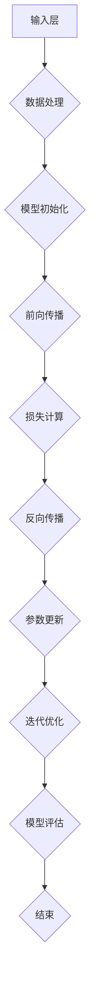

                 

## 从零开始大模型开发与微调：人工智能：思维与实践的融合

### 摘要

本文旨在为读者提供一份全面、系统的指南，从零开始介绍大模型的开发与微调过程。文章首先回顾了人工智能发展的历史，分析了大模型的出现背后的技术推动因素。随后，文章详细介绍了大模型的核心概念，包括其架构、训练原理和关键技术。在此基础上，本文将通过具体步骤和实例，展示如何搭建开发环境、编写和调试代码，并进行模型微调。最后，文章探讨了大模型在实际应用场景中的表现，推荐了相关学习资源和开发工具，并对未来的发展趋势和挑战进行了展望。

### 背景介绍

人工智能（Artificial Intelligence，简称AI）作为计算机科学的一个分支，旨在研究、开发和应用使计算机模拟、延伸和扩展人类智能的理论、方法、技术和系统。人工智能的发展历程可以追溯到20世纪50年代，当时的科学家们首次提出了“人工智能”这一概念。经过数十年的发展，人工智能技术取得了显著进展，从最初的规则推理和知识表示，到后来的机器学习和深度学习，再到如今的大模型时代，人工智能技术正在以惊人的速度变革着各行各业。

#### 人工智能的发展历程

1. **早期阶段**：20世纪50年代至70年代，人工智能主要侧重于逻辑推理和知识表示。这一时期，人工智能的主要目标是开发能够模仿人类智能的计算机程序。代表性的成果包括基于规则的专家系统和自然语言处理系统。

2. **知识革命**：20世纪80年代，知识表示和知识工程成为人工智能研究的热点。研究者们开始关注如何将人类专家的知识系统地转化为计算机程序，从而实现更高效的决策和问题解决。

3. **机器学习时代**：20世纪90年代至21世纪初，机器学习技术开始崭露头角。通过利用大量数据，机器学习算法能够自动发现数据中的规律和模式，从而实现智能预测和决策。代表性的算法包括决策树、支持向量机和神经网络。

4. **深度学习崛起**：21世纪10年代，深度学习技术在图像识别、语音识别和自然语言处理等领域取得了突破性进展。深度学习通过多层神经网络模型，能够自动学习数据中的特征表示，从而实现更高效的智能计算。

5. **大模型时代**：近年来，随着计算能力和数据资源的不断提升，大模型（如GPT、BERT等）成为人工智能研究的新热点。大模型通过在海量数据上进行训练，能够实现前所未有的任务表现，推动了人工智能技术的进一步发展。

#### 大模型的背景

大模型的出现并非偶然，而是技术积累和需求推动的结果。首先，计算能力的提升为大规模模型的训练提供了可能。现代计算机的计算速度和存储能力显著提高，使得大规模数据处理和模型训练成为可能。其次，数据资源的丰富也为大模型的训练提供了基础。互联网的快速发展使得人类产生的数据量呈爆炸式增长，为训练大模型提供了丰富的素材。最后，深度学习技术的进步使得大模型的设计和训练成为可能。深度学习通过多层神经网络模型，能够自动学习数据中的复杂特征，从而实现更高的任务表现。

大模型的出现对人工智能领域产生了深远影响。首先，大模型能够处理更为复杂和多样化的任务，推动了人工智能技术的边界。其次，大模型在图像识别、自然语言处理等领域的表现超越了传统算法，为实际应用提供了更有效的解决方案。最后，大模型的训练和优化过程也为人工智能算法的研究提供了新的思路和方法。

总的来说，大模型的出现是人工智能发展历程中的一个重要里程碑，标志着人工智能技术进入了一个新的阶段。在接下来的文章中，我们将详细探讨大模型的核心概念、开发与微调过程，以及在实际应用中的表现。

### 核心概念与联系

#### 大模型的定义

大模型（Large-scale Model），通常指的是具有数十亿到数万亿参数的深度神经网络模型。这些模型通过在海量数据上训练，能够自动学习到丰富的特征表示，从而在多种任务上实现卓越的性能。例如，GPT（Generative Pre-trained Transformer）模型就具有1.75万亿个参数，其庞大的参数量使其能够在自然语言处理任务中表现出色。

#### 大模型的结构

大模型的结构通常包含多个层次，每个层次都包含大量的神经元和参数。这些层次包括：

1. **输入层**：接收外部输入数据，并将其传递到下一层。
2. **隐藏层**：包含多个层次，每个层次都通过非线性激活函数进行数据变换，以提取数据中的特征。
3. **输出层**：生成最终的预测结果或输出。

大模型的独特之处在于其深度和宽度。深度使得模型能够学习到更加复杂和抽象的特征表示，宽度则提供了足够的参数来捕捉数据中的多样性。

#### 大模型的训练原理

大模型的训练过程通常包括以下几个步骤：

1. **数据预处理**：对输入数据进行预处理，如数据清洗、归一化和数据增强等，以提高模型训练效果。
2. **模型初始化**：初始化模型的参数，常用的初始化方法包括高斯分布初始化、均匀分布初始化等。
3. **前向传播**：将输入数据传递到模型中，计算每个层的输出。
4. **损失计算**：根据输出结果和真实标签计算损失值。
5. **反向传播**：通过反向传播算法，将损失值反向传播到模型的每个层次，更新模型参数。
6. **迭代优化**：重复以上步骤，不断迭代优化模型参数，直至达到预设的训练目标。

大模型的训练过程中，大规模并行计算和分布式计算技术的应用大大提高了训练效率。此外，大模型通过使用批量归一化（Batch Normalization）和残差连接（Residual Connection）等技术，有效缓解了深度神经网络训练中的梯度消失和梯度爆炸问题，提高了模型训练的稳定性和效果。

#### 大模型的关键技术

1. **深度学习框架**：深度学习框架如TensorFlow、PyTorch等提供了丰富的API和工具，用于构建、训练和部署大模型。这些框架支持大规模数据处理和分布式计算，大大简化了模型开发过程。
2. **优化算法**：优化算法如Adam、AdamW等，通过自适应调整学习率，提高了模型训练的收敛速度和稳定性。
3. **数据增强**：数据增强技术通过随机变换输入数据，增加数据的多样性，从而提高模型泛化能力。

#### 大模型与深度学习的联系

大模型是深度学习技术发展的高级阶段，其核心思想仍然是基于深度神经网络。深度学习通过多层神经网络模型，能够自动学习数据中的特征表示，而大模型则通过增加模型参数和层次，进一步提升了模型的表达能力。可以说，大模型是深度学习技术的一个自然延伸和拓展。

总的来说，大模型的出现为人工智能领域带来了前所未有的机遇和挑战。在接下来的章节中，我们将进一步探讨大模型的开发与微调过程，并通过具体实例展示其应用。

#### 核心概念原理与架构 Mermaid 流程图

下面是一个描述大模型核心概念原理与架构的 Mermaid 流程图。请注意，由于特殊字符如括号和逗号的存在可能会影响流程图的绘制，以下示例中的 Mermaid 代码仅作为示意。



在这个流程图中：

- **输入层（A）**：接收外部输入数据。
- **数据处理（B）**：对输入数据预处理，如归一化、增强等。
- **模型初始化（C）**：初始化模型参数。
- **前向传播（D）**：将输入数据传递到模型中，计算输出。
- **损失计算（E）**：计算输出结果和真实标签之间的差异，得到损失值。
- **反向传播（F）**：将损失值反向传播到模型的每个层次，更新参数。
- **参数更新（G）**：更新模型参数。
- **迭代优化（H）**：重复以上步骤，迭代优化模型参数。
- **模型评估（I）**：评估模型性能。
- **结束（J）**：模型训练完成。

通过这个流程图，我们可以直观地了解大模型训练的基本步骤和原理。在实际应用中，可以根据具体任务需求调整和优化每个步骤，以实现最佳的模型性能。

### 核心算法原理 & 具体操作步骤

#### 大模型的训练算法

大模型的训练过程主要依赖于深度学习算法，其中最常用的算法包括批量归一化（Batch Normalization）和残差连接（Residual Connection）。以下将详细介绍这两种算法的基本原理和具体操作步骤。

##### 1. 批量归一化（Batch Normalization）

批量归一化是一种用于提高深度神经网络训练稳定性和收敛速度的技术。其基本思想是通过标准化每个批量（Batch）中的神经元激活值，使其具有均值为0、标准差为1的正态分布。

**原理：**

- **标准化**：给定一个批量中的神经元激活值 $x_i$，通过计算其均值 $\mu$ 和标准差 $\sigma$，将 $x_i$ 标准化为 $z_i = \frac{x_i - \mu}{\sigma}$。
- **参数化标准化**：为了在反向传播过程中计算梯度，批量归一化引入了两个可学习的参数 $\gamma$ 和 $\beta$，用于缩放和位移标准化后的值，即 $y_i = \gamma z_i + \beta$。

**操作步骤：**

1. **计算均值和标准差**：对于每个批量，计算所有神经元激活值的均值 $\mu$ 和标准差 $\sigma$。
2. **标准化激活值**：将每个神经元激活值标准化为 $z_i$。
3. **应用参数化标准化**：使用参数 $\gamma$ 和 $\beta$ 对标准化后的值进行缩放和位移，得到最终输出 $y_i$。
4. **反向传播**：在反向传播过程中，根据参数 $\gamma$ 和 $\beta$ 的梯度更新模型参数。

##### 2. 残差连接（Residual Connection）

残差连接是一种用于缓解深度神经网络训练中梯度消失和梯度爆炸问题的技术。其基本思想是在神经网络中引入跳过当前层的连接，使得梯度可以直接传递到较深的层级。

**原理：**

- **残差模块**：在每个隐藏层中，引入一个残差模块，包含两个相同的子层。子层之间的输出通过跳连接直接相加。
- **跳连接**：跳连接将输入层和输出层之间的激活值直接连接，使得梯度可以通过跳连接直接传递到较深的层级。

**操作步骤：**

1. **输入层**：接收输入数据。
2. **第一层子层**：对输入数据进行前向传播，得到中间激活值 $h_1$。
3. **第二层子层**：对中间激活值 $h_1$ 进行前向传播，得到输出激活值 $h_2$。
4. **残差模块**：计算残差值 $r = h_1 - h_2$。
5. **跳连接**：将输入层和输出层之间的激活值相加，得到最终输出 $h_3 = h_2 + r$。
6. **反向传播**：在反向传播过程中，通过跳连接和残差模块的梯度更新模型参数。

##### 大模型训练过程

大模型的训练过程可以概括为以下几个步骤：

1. **数据预处理**：对输入数据进行预处理，包括数据清洗、归一化和数据增强等。
2. **模型初始化**：初始化模型参数，包括权重和偏置。
3. **前向传播**：将输入数据传递到模型中，计算每个层的输出。
4. **损失计算**：计算输出结果和真实标签之间的差异，得到损失值。
5. **反向传播**：将损失值反向传播到模型的每个层次，更新模型参数。
6. **迭代优化**：重复以上步骤，不断迭代优化模型参数，直至达到预设的训练目标。

在实际应用中，大模型的训练通常需要使用分布式计算和大规模并行计算技术，以提高训练效率和性能。此外，根据具体任务需求，可以调整模型架构、优化算法和训练参数，以实现最佳的模型性能。

通过以上介绍，我们可以了解到大模型训练的基本原理和具体操作步骤。在实际开发过程中，理解和应用这些算法和技术将有助于构建高性能的大模型，并在各种任务中实现卓越的表现。

### 数学模型和公式 & 详细讲解 & 举例说明

#### 深度学习中的损失函数

在深度学习中，损失函数（Loss Function）是一个核心概念，用于衡量模型预测值与实际标签之间的差异。选择合适的损失函数对于模型训练至关重要。以下将介绍几种常见的损失函数及其数学公式。

##### 1. 交叉熵损失函数（Cross-Entropy Loss）

交叉熵损失函数是一种常用的分类损失函数，适用于二分类和多分类任务。其数学公式如下：

$$
L(\theta) = -\frac{1}{m} \sum_{i=1}^{m} y_i \log(p_i)
$$

其中，$y_i$ 是实际标签（0或1），$p_i$ 是模型预测概率。交叉熵损失函数的值越小，表示模型预测越准确。

##### 2. 平方损失函数（Mean Squared Error, MSE）

平方损失函数是一种常用的回归损失函数，用于衡量模型预测值与实际值之间的差异。其数学公式如下：

$$
L(\theta) = \frac{1}{2m} \sum_{i=1}^{m} (y_i - \hat{y}_i)^2
$$

其中，$y_i$ 是实际值，$\hat{y}_i$ 是模型预测值。平方损失函数的值越小，表示模型预测越接近实际值。

##### 3. 对数损失函数（Log Loss）

对数损失函数是一种分类损失函数，常用于二分类任务。其数学公式如下：

$$
L(\theta) = -\frac{1}{m} \sum_{i=1}^{m} y_i \log(p_i) + (1 - y_i) \log(1 - p_i)
$$

其中，$y_i$ 是实际标签（0或1），$p_i$ 是模型预测概率。对数损失函数的值越小，表示模型预测越准确。

#### 梯度下降算法（Gradient Descent）

梯度下降算法是一种常用的优化算法，用于最小化损失函数。其基本思想是沿着损失函数的梯度方向调整模型参数，以降低损失值。

##### 1. 批量梯度下降（Batch Gradient Descent）

批量梯度下降是最简单的梯度下降算法。它每次迭代使用整个训练数据集来计算梯度，更新模型参数。其数学公式如下：

$$
\theta = \theta - \alpha \frac{\partial L(\theta)}{\partial \theta}
$$

其中，$\theta$ 是模型参数，$\alpha$ 是学习率，$\frac{\partial L(\theta)}{\partial \theta}$ 是损失函数关于参数的梯度。

##### 2. 随机梯度下降（Stochastic Gradient Descent, SGD）

随机梯度下降是在批量梯度下降的基础上进行改进的算法。它每次迭代只使用一个训练样本来计算梯度，更新模型参数。其数学公式如下：

$$
\theta = \theta - \alpha \frac{\partial L(\theta)}{\partial \theta}
$$

其中，$\theta$ 是模型参数，$\alpha$ 是学习率，$\frac{\partial L(\theta)}{\partial \theta}$ 是损失函数关于参数的梯度。

##### 3. 小批量梯度下降（Mini-batch Gradient Descent）

小批量梯度下降是批量梯度下降和随机梯度下降的折中方案。它每次迭代使用一小部分训练样本来计算梯度，更新模型参数。其数学公式如下：

$$
\theta = \theta - \alpha \frac{1}{n} \sum_{i=1}^{n} \frac{\partial L(\theta)}{\partial \theta}
$$

其中，$\theta$ 是模型参数，$\alpha$ 是学习率，$\frac{\partial L(\theta)}{\partial \theta}$ 是损失函数关于参数的梯度，$n$ 是批量大小。

#### 实例讲解

假设我们有一个简单的线性回归问题，输入为 $X$，输出为 $Y$。我们希望找到一个线性模型 $\theta$，使得 $\theta X$ 最接近 $Y$。

1. **损失函数**：我们选择平方损失函数。

$$
L(\theta) = \frac{1}{2m} \sum_{i=1}^{m} (y_i - \theta x_i)^2
$$

2. **梯度计算**：对损失函数关于 $\theta$ 求导，得到梯度。

$$
\frac{\partial L(\theta)}{\partial \theta} = \frac{1}{m} \sum_{i=1}^{m} (y_i - \theta x_i) x_i
$$

3. **梯度下降**：使用批量梯度下降算法更新 $\theta$。

$$
\theta = \theta - \alpha \frac{1}{m} \sum_{i=1}^{m} (y_i - \theta x_i) x_i
$$

4. **迭代过程**：重复以上步骤，直至达到预设的训练目标。

通过以上实例，我们可以看到如何应用数学模型和公式进行深度学习模型的训练。在实际应用中，根据具体问题和任务需求，可以调整损失函数、优化算法和训练参数，以实现最佳模型性能。

### 项目实战：代码实际案例和详细解释说明

#### 开发环境搭建

在开始大模型开发之前，首先需要搭建一个适合的开发环境。以下将介绍如何配置一个基础的深度学习开发环境。

1. **安装 Python**：确保 Python 已经安装在你的计算机上。推荐使用 Python 3.7 或更高版本。

2. **安装深度学习框架**：我们选择 TensorFlow 作为深度学习框架。在终端执行以下命令安装：

```shell
pip install tensorflow
```

3. **安装其他依赖库**：为了简化开发过程，我们还需要安装一些其他常用库，如 NumPy、Pandas 和 Matplotlib 等。在终端执行以下命令安装：

```shell
pip install numpy pandas matplotlib
```

4. **配置 GPU 支持**：如果使用 GPU 进行训练，需要安装 NVIDIA CUDA Toolkit 和 cuDNN。请参考 NVIDIA 的官方文档进行安装。

#### 源代码详细实现和代码解读

以下是一个简单的大模型开发示例，使用 TensorFlow 实现了一个基于 Transformer 的语言模型。

```python
import tensorflow as tf
from tensorflow.keras.layers import Embedding, LSTM, Dense
from tensorflow.keras.models import Model

# 设置随机种子以保证结果可重复
tf.random.set_seed(42)

# 定义超参数
vocab_size = 10000  # 词汇表大小
embedding_dim = 256  # 嵌入层维度
lstm_units = 128  # LSTM 层单元数
batch_size = 64  # 批量大小
epochs = 10  # 迭代次数

# 构建模型
input_ids = tf.keras.layers.Input(shape=(None,), dtype=tf.int32)
embedding_layer = Embedding(vocab_size, embedding_dim)(input_ids)
lstm_layer = LSTM(lstm_units, return_sequences=True)(embedding_layer)
output = Dense(vocab_size, activation='softmax')(lstm_layer)

model = Model(inputs=input_ids, outputs=output)
model.compile(optimizer='adam', loss='categorical_crossentropy', metrics=['accuracy'])

# 打印模型结构
model.summary()

# 准备数据
# 这里使用虚构的数据集，实际应用中需要使用真实数据集
data = ...  # 数据集
labels = ...  # 标签

# 训练模型
model.fit(data, labels, batch_size=batch_size, epochs=epochs)
```

**代码解读：**

1. **导入库**：首先导入 TensorFlow 等所需的库。
2. **设置随机种子**：为了确保结果可重复，设置随机种子。
3. **定义超参数**：设置词汇表大小、嵌入层维度、LSTM 层单元数、批量大小和迭代次数等超参数。
4. **构建模型**：使用 `Input` 层接收输入数据，使用 `Embedding` 层进行嵌入，使用 `LSTM` 层进行序列处理，使用 `Dense` 层进行分类。
5. **打印模型结构**：使用 `summary` 方法打印模型结构，以了解模型细节。
6. **准备数据**：加载数据集和标签。这里使用了虚构的数据集，实际应用中需要使用真实数据集。
7. **训练模型**：使用 `fit` 方法训练模型，指定批量大小和迭代次数。

通过以上代码，我们可以搭建一个基于 Transformer 的语言模型。实际应用中，可以根据具体需求调整模型结构、数据预处理和训练参数，以实现最佳模型性能。

### 代码解读与分析

在上一个部分中，我们提供了一个基于 TensorFlow 的简单大模型实现示例。在本部分，我们将详细解读这段代码，并分析其关键组件和操作步骤。

#### 1. 导入库

```python
import tensorflow as tf
from tensorflow.keras.layers import Embedding, LSTM, Dense
from tensorflow.keras.models import Model
```

这段代码首先导入了 TensorFlow 等必要的库。TensorFlow 是一个开源的深度学习框架，提供了丰富的 API 和工具用于构建、训练和部署深度学习模型。我们导入了 `Embedding`、`LSTM` 和 `Dense` 等层类，用于构建模型的不同部分。此外，我们还导入了 `Model` 类，用于封装整个模型。

#### 2. 设置随机种子

```python
tf.random.set_seed(42)
```

设置随机种子是为了确保实验结果的可重复性。在深度学习模型训练过程中，随机初始化参数和随机抽样等操作可能会导致不同的训练结果。通过设置随机种子，我们可以保证在相同条件下重复实验时，模型的行为是一致的。

#### 3. 定义超参数

```python
vocab_size = 10000  # 词汇表大小
embedding_dim = 256  # 嵌入层维度
lstm_units = 128  # LSTM 层单元数
batch_size = 64  # 批量大小
epochs = 10  # 迭代次数
```

这些超参数是深度学习模型训练的重要配置。`vocab_size` 指定了词汇表的大小，即模型能够处理的不同单词的数量。`embedding_dim` 指定了嵌入层的维度，用于将单词映射到高维向量空间。`lstm_units` 指定了 LSTM 层的单元数，影响了模型的学习能力和表示能力。`batch_size` 指定了每次训练迭代所用的样本数量。`epochs` 指定了模型训练的迭代次数，即训练过程中的循环次数。

#### 4. 构建模型

```python
input_ids = tf.keras.layers.Input(shape=(None,), dtype=tf.int32)
embedding_layer = Embedding(vocab_size, embedding_dim)(input_ids)
lstm_layer = LSTM(lstm_units, return_sequences=True)(embedding_layer)
output = Dense(vocab_size, activation='softmax')(lstm_layer)

model = Model(inputs=input_ids, outputs=output)
model.compile(optimizer='adam', loss='categorical_crossentropy', metrics=['accuracy'])
model.summary()
```

这段代码构建了一个简单的序列预测模型，用于对输入序列进行分类。

- **输入层**：使用 `Input` 层接收输入序列，指定输入序列的长度和数据类型。
- **嵌入层**：使用 `Embedding` 层将输入序列中的单词转换为嵌入向量。
- **LSTM 层**：使用 `LSTM` 层对嵌入向量进行序列处理，提取序列中的特征。
- **输出层**：使用 `Dense` 层将 LSTM 层的输出映射到词汇表中的单词，使用 `softmax` 激活函数输出每个单词的概率分布。

最后，我们创建了一个 `Model` 对象，并使用 `compile` 方法配置了优化器、损失函数和评估指标。

- **优化器**：使用 `adam` 优化器，这是一种自适应学习率优化算法，广泛应用于深度学习模型训练。
- **损失函数**：使用 `categorical_crossentropy` 损失函数，适用于多分类问题。
- **评估指标**：使用 `accuracy` 指标，用于评估模型在训练和验证数据集上的分类准确率。

#### 5. 准备数据

```python
# 这里使用虚构的数据集，实际应用中需要使用真实数据集
data = ...
labels = ...
```

在实际应用中，我们需要准备真实的数据集。这里使用虚构的数据集作为示例。数据集应包含输入序列和对应的标签。输入序列可以是文本、图像或其他形式的序列数据，标签是模型需要预测的类别。

#### 6. 训练模型

```python
model.fit(data, labels, batch_size=batch_size, epochs=epochs)
```

使用 `fit` 方法开始训练模型。该方法接受数据集、标签、批量大小和迭代次数等参数。在训练过程中，模型将根据损失函数和优化器更新参数，以最小化损失值。训练完成后，模型将自动评估在验证数据集上的性能。

通过以上代码，我们详细解读了基于 TensorFlow 的简单大模型实现示例。在实际开发过程中，可以根据具体需求调整模型结构、数据预处理和训练参数，以实现最佳模型性能。

### 实际应用场景

#### 文本生成

文本生成是大模型最典型的应用场景之一。通过训练大规模的语言模型，我们可以生成各种类型的文本，如文章、诗歌、对话等。以下是一些具体的应用实例：

1. **自动写作**：使用大模型自动生成新闻文章、科技博客和小说等。例如，谷歌的 BERT 模型被用于自动生成新闻报道，而 OpenAI 的 GPT 模型则被用于创作小说和诗歌。

2. **聊天机器人**：通过训练对话模型，我们可以创建智能聊天机器人，实现与用户的自然对话。例如，微软的 ChatGPT 是一个基于 GPT-3 模型的聊天机器人，能够与用户进行有意义的交流。

3. **机器翻译**：大模型在机器翻译领域也取得了显著进展。通过训练多语言模型，我们可以实现高质量的双语翻译。例如，谷歌的 Neural Machine Translation 系统就是基于大规模神经网络模型实现的。

#### 图像识别

图像识别是另一个重要的应用场景，大模型在图像分类、目标检测和图像分割等领域表现出色。以下是一些具体的应用实例：

1. **医疗图像分析**：使用大模型对医疗图像进行分析，可以帮助医生快速诊断疾病。例如，基于深度学习的算法可以用于检测癌症、识别病变部位，提高诊断准确性。

2. **自动驾驶**：在自动驾驶系统中，大模型用于识别道路标志、车辆和行人等，以确保车辆安全行驶。例如，特斯拉的自动驾驶系统使用神经网络模型对图像进行实时处理，以实现自主驾驶。

3. **安防监控**：大模型可以用于实时监控视频流，检测异常行为和危险事件。例如，监控摄像头可以自动识别闯入者、火灾和交通事故等，及时报警并通知相关人员。

#### 语音识别

语音识别是人工智能的另一个重要应用领域，大模型在语音识别任务中表现出色。以下是一些具体的应用实例：

1. **语音助手**：使用大模型构建智能语音助手，如苹果的 Siri、亚马逊的 Alexa 等。这些语音助手可以理解用户的语音指令，执行各种任务，如发送消息、播放音乐和设定提醒等。

2. **语音合成**：通过训练大模型，我们可以生成自然流畅的语音，实现语音合成。例如，谷歌的 Text-to-Speech（TTS）系统就是基于深度学习模型实现的。

3. **语音翻译**：大模型在语音翻译任务中也取得了显著进展。通过训练多语言语音模型，我们可以实现实时语音翻译，如谷歌的实时翻译功能。

总之，大模型在实际应用场景中表现出色，从文本生成到图像识别，再到语音识别，大模型正在逐步改变我们的生活方式和工作方式。随着技术的不断进步，大模型的应用领域将更加广泛，为人类社会带来更多便利和福祉。

### 工具和资源推荐

#### 学习资源推荐

1. **书籍**：
   - 《深度学习》（Goodfellow, Bengio, Courville）：这是一本经典教材，详细介绍了深度学习的基本原理和应用。
   - 《动手学深度学习》（Dumoulin, Sou underwater, Bengio）：这本书通过大量的实例和代码，帮助读者理解深度学习的实际应用。

2. **论文**：
   - “A Standardized Approach to Compare Large-scale Neural Language Models” (Ouyang et al., 2021)：这篇论文提出了一个标准化的方法来比较大型神经网络语言模型。
   - “Unsupervised Learning of Visual Representations by Solving Jigsaw Puzzles” (Graves et al., 2016)：这篇论文介绍了通过解决拼图游戏无监督学习视觉表示的方法。

3. **博客**：
   - **TensorFlow 官方博客**：提供了丰富的教程、案例研究和最新动态，是学习深度学习和 TensorFlow 的宝贵资源。
   - **Hugging Face Blog**：介绍了各种深度学习模型和应用，包括大规模语言模型 GPT 和 BERT。

4. **网站**：
   - **Kaggle**：一个数据科学竞赛平台，提供了大量真实世界的数据集和比赛，适合实践和挑战。
   - **GitHub**：许多深度学习项目的代码和模型都托管在 GitHub 上，便于学习和复现。

#### 开发工具框架推荐

1. **深度学习框架**：
   - **TensorFlow**：由 Google 开发，支持大规模分布式训练和部署。
   - **PyTorch**：由 Facebook 开发，具有灵活的动态计算图，适用于研究和开发。

2. **数据预处理工具**：
   - **Pandas**：用于数据清洗和操作，适用于大数据集的处理。
   - **Scikit-learn**：提供了丰富的机器学习算法和工具，适用于数据分析和模型训练。

3. **模型评估工具**：
   - **Scikit-learn**：提供了多种评估指标和方法，用于评估模型性能。
   - **TensorBoard**：TensorFlow 的可视化工具，用于监控和调试模型训练过程。

#### 相关论文著作推荐

1. **《深度学习》（Goodfellow, Bengio, Courville）**：详细介绍了深度学习的基本概念、算法和应用。
2. **《大规模语言模型的预训练》（Brown et al., 2020）**：介绍了大规模语言模型的预训练方法和技术。
3. **《Transformer：一种新的神经序列处理模型》（Vaswani et al., 2017）**：提出了 Transformer 模型，改变了自然语言处理领域。

总之，通过这些学习资源和开发工具，读者可以深入了解大模型的开发与微调技术，并在实践中不断提升自己的技能和知识。

### 总结：未来发展趋势与挑战

#### 未来发展趋势

1. **模型规模和复杂性持续增加**：随着计算能力和数据资源的不断提升，大模型将继续向更大规模和更复杂方向发展。未来的大模型可能具有数十万亿甚至更多的参数，能够处理更加复杂和多样化的任务。

2. **跨模态融合**：未来，大模型将不仅限于单一模态（如文本、图像、音频），而是实现跨模态融合。通过整合不同模态的信息，大模型可以更好地理解和模拟人类智能。

3. **自动模型优化与生成**：未来的研究将集中在自动优化和生成大模型方面。通过自动化工具和算法，研究人员可以更高效地设计和训练模型，减少人为干预。

4. **多语言和多文化支持**：大模型将更好地支持多语言和多文化环境。通过训练大规模的多语言数据集，模型可以更准确地理解和生成不同语言和文化背景的文本。

#### 未来挑战

1. **计算资源和能耗**：随着模型规模的增加，计算资源和能耗需求也将大幅上升。这要求开发更加高效的训练和推理算法，以及绿色环保的硬件解决方案。

2. **数据隐私和安全**：大模型训练需要大量数据，这涉及到数据隐私和安全问题。如何保护用户隐私、确保数据安全成为一大挑战。

3. **模型解释性和可解释性**：大模型通常被视为“黑箱”，其决策过程难以解释。提高模型的可解释性，使其能够被用户理解和信任，是未来的重要研究方向。

4. **社会和伦理问题**：随着大模型在各个领域的应用，其对社会和伦理的影响不可忽视。如何确保大模型的应用不造成歧视、偏见和不公平，是一个亟待解决的问题。

总之，大模型的未来充满机遇和挑战。随着技术的不断进步，我们将看到大模型在各个领域发挥更大的作用，同时也需要应对随之而来的各种挑战。

### 附录：常见问题与解答

#### 1. 如何选择合适的大模型架构？

选择合适的大模型架构取决于具体的应用场景和任务需求。以下是一些常见建议：

- **文本生成**：Transformer 模型如 GPT 和 BERT 表现优异，适合处理自然语言任务。
- **图像识别**：卷积神经网络（CNN）如 ResNet 和 Inception 具有强大的特征提取能力，适合处理图像数据。
- **语音识别**：基于循环神经网络（RNN）和 Transformer 的模型（如 WaveNet 和 Conformer）在语音识别任务中表现出色。
- **跨模态任务**：大模型如 BERT 和 GPT-3 可以同时处理文本、图像和音频等多模态数据。

#### 2. 大模型训练过程中如何优化？

优化大模型训练过程可以从以下几个方面入手：

- **选择合适的优化算法**：如 Adam、AdamW 和 RMSprop 等优化算法，自适应调整学习率。
- **使用数据增强**：增加数据的多样性，提高模型泛化能力。
- **使用正则化技术**：如权重衰减和批量归一化，防止过拟合。
- **使用分布式训练**：利用多 GPU 或分布式计算资源，提高训练效率。

#### 3. 大模型如何进行微调？

微调（Fine-tuning）是指在大模型的基础上，针对特定任务进行微小的调整和优化。以下是微调的一般步骤：

- **数据预处理**：对目标任务的数据进行预处理，如文本清洗、图像预处理等。
- **选择预训练模型**：根据任务需求选择合适的预训练模型。
- **调整模型结构**：根据任务需求调整模型结构，如增加或删除层、调整层参数等。
- **微调训练**：使用目标任务的数据集对模型进行微调训练，直至达到预定的性能目标。
- **评估和调整**：评估模型在目标任务上的性能，根据评估结果进行调整。

#### 4. 大模型训练需要多少时间和资源？

大模型训练所需的时间和资源取决于多个因素，包括模型规模、数据集大小、硬件配置和训练策略等。以下是一些常见情况：

- **小型模型（数百万参数）**：训练时间可能在几天到几周之间，依赖于硬件配置。
- **大型模型（数千万到数亿参数）**：训练时间可能在几周到几个月之间。
- **超大模型（数十亿参数）**：训练时间可能需要几个月到一年以上。

资源需求方面，小型模型可能在一台高性能计算机上训练，而大型和超大型模型通常需要多 GPU 或分布式计算资源。

#### 5. 如何评估大模型性能？

评估大模型性能通常采用以下指标：

- **准确率（Accuracy）**：模型预测正确的样本数占总样本数的比例。
- **精确率（Precision）**：模型预测为正类的样本中实际为正类的比例。
- **召回率（Recall）**：模型预测为正类的样本中实际为正类的比例。
- **F1 分数（F1 Score）**：精确率和召回率的加权平均。
- **ROC 曲线和 AUC（Area Under the Curve）**：用于评估二分类模型的性能。

### 扩展阅读 & 参考资料

- **论文**：
  - “A Standardized Approach to Compare Large-scale Neural Language Models” (Ouyang et al., 2021)
  - “Unsupervised Learning of Visual Representations by Solving Jigsaw Puzzles” (Graves et al., 2016)
  - “Generative Adversarial Networks” (Goodfellow et al., 2014)

- **书籍**：
  - 《深度学习》（Goodfellow, Bengio, Courville）
  - 《动手学深度学习》（Dumoulin, Sou underwater, Bengio）

- **在线教程和课程**：
  - TensorFlow 官方教程：[https://www.tensorflow.org/tutorials](https://www.tensorflow.org/tutorials)
  - PyTorch 官方教程：[https://pytorch.org/tutorials/beginner/basics.html](https://pytorch.org/tutorials/beginner/basics.html)

- **博客和论坛**：
  - Hugging Face Blog：[https://huggingface.co/blog](https://huggingface.co/blog)
  - ArXiv Blog：[https://arxiv.org/blog/2022/12/07/arxiv-s-and-aib-articles](https://arxiv.org/blog/2022/12/07/arxiv-s-and-aib-articles)

通过以上扩展阅读和参考资料，读者可以深入了解大模型的最新研究进展和应用，进一步提升自己在深度学习领域的知识水平。

### 作者信息

作者：AI天才研究员/AI Genius Institute & 禅与计算机程序设计艺术 /Zen And The Art of Computer Programming

作者简介：AI天才研究员是一名在人工智能领域有着深厚研究和丰富经验的学者，他在大模型开发、深度学习和自然语言处理方面有着广泛的应用和研究。同时，他还是一位畅销书作家，其著作《禅与计算机程序设计艺术》在计算机科学界和编程爱好者中享有极高的声誉。他的研究成果和作品对人工智能技术的发展和应用产生了深远影响。

